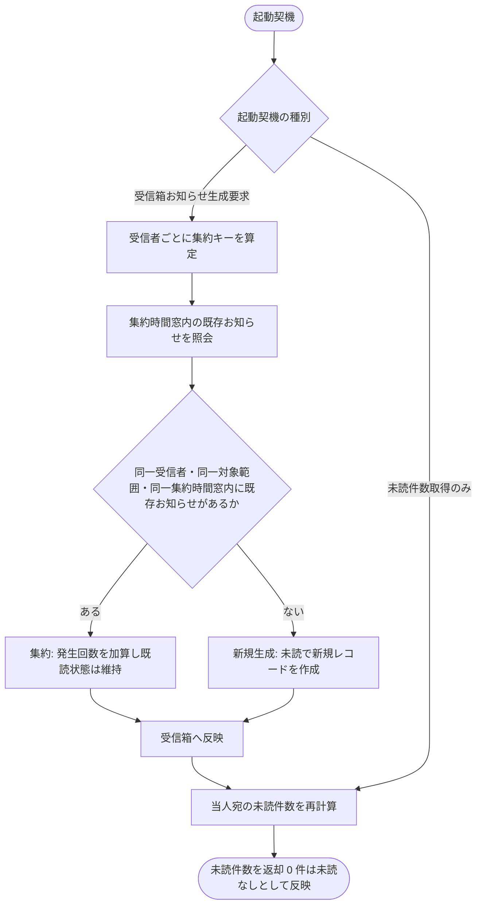

# IPO-008: 未読お知らせ集約判定ロジック

> **本記述書は、受信箱お知らせの生成要求を同一対象範囲(受信者・プロジェクト・イベント種別)内の集約時間窓で重複判定し、既存お知らせへ集約するか新規生成するかを確定したうえで、当人宛の未読お知らせ件数を再計算する処理ロジックを定義します。**

*種別 IPO処理機能記述書 ・ 優先度 P0 ・ ステータス ドラフト*

| 項目 | 値 |
|----|----|
| IPO ID | IPO-008 |
| 業務ユースケースID | [UC-063](../../01_requirements/04_business_usecases/UC-063.md#UC-063) ・ [UC-080](../../01_requirements/04_business_usecases/UC-080.md#UC-080) |
| 関連 API / SYS | [API-051](../../02_basic_design/02_backend/03_apis/API-051.md#API-051) ・ [SYS-013](../../02_basic_design/02_backend/01_system/SYS-013.md#SYS-013) ・ [SYS-026](../../02_basic_design/02_backend/01_system/SYS-026.md#SYS-026) |
| 参照 SEQ | — (基本設計に SEQ 未整備) |
| 利用テーブル | [TBL-021](../../02_basic_design/02_backend/04_database/TBL-021.md#TBL-021) ・ [TBL-022](../../02_basic_design/02_backend/04_database/TBL-022.md#TBL-022) ・ [TBL-010](../../02_basic_design/02_backend/04_database/TBL-010.md#TBL-010) ・ [TBL-011](../../02_basic_design/02_backend/04_database/TBL-011.md#TBL-011) |

## 1. 目的

本処理は、受信箱お知らせの生成要求([SYS-026](../../02_basic_design/02_backend/01_system/SYS-026.md#SYS-026))を受けて、同一受信者・同一対象範囲(プロジェクト・イベント種別)・同一集約時間窓内の既存お知らせへ集約するか新規生成するかを確定し、その結果を反映した当人宛の未読お知らせ件数([SYS-013](../../02_basic_design/02_backend/01_system/SYS-013.md#SYS-013))を再計算する Service 層ロジックである。実装者が押さえるべき前提は次の 3 点である。

- 集約時間窓は[システム仕様書 §3](../../02_basic_design/07_system-spec.md#3-タイムアウトセッション認証)の「お知らせ集約時間窓」(60 分・[FR-160](../../01_requirements/02_functional_requirement/05_notification-fr.md#FR-160))が正本。窓のスロット切り捨て方式・連結項目は [TBL-022 `dedup_key` 生成ロジック](../../02_basic_design/02_backend/04_database/TBL-022.md#dedup_key)に従う。
- 集約キー `dedup_key` は受信者(`user_id`)単位で保持する([TBL-022](../../02_basic_design/02_backend/04_database/TBL-022.md#TBL-022))。同一プロジェクト・同一イベント種別の重複判定([FR-160](../../01_requirements/02_functional_requirement/05_notification-fr.md#FR-160))は、配信対象となる受信者ごとに集約キーを算出し受信者単位で判定する(オーナー・メンバー等、対象範囲に複数の受信者がいる場合はそれぞれ独立に集約判定する)。
- 未読件数は受信箱([TBL-022](../../02_basic_design/02_backend/04_database/TBL-022.md#TBL-022))の当人宛レコードのうち `read_at IS NULL` の件数であり、集約判定の結果(既存お知らせへ集約 / 新規生成)によって対象レコード数が変わるため未読件数の再計算はお知らせ集約判定の後段で行う。

## 2. 処理概要

受信箱お知らせの生成要求(対象範囲・受信者・イベント種別)を入力に、集約キー算定 → 集約時間窓内の既存お知らせ照会 → 集約/新規生成の確定 → 受信箱反映 → 未読件数再計算までを 1 単位として俯瞰する。未読件数取得(遷移時・定期取得)は生成要求を伴わない照会単独の起動もあり、その場合は集約判定を経ず未読件数再計算のみを行う。

| 機能名 | 処理概要 | 起動条件 | 終了条件 |
|----|----|----|----|
| 未読お知らせ集約判定 | 受信者・対象範囲・イベント種別が一致し集約時間窓内の既存お知らせがあれば集約、無ければ新規生成し、当人宛の未読件数を確定する | 受信箱お知らせの生成要求が発生したとき、または管理ダッシュボード遷移時・滞在中の定期取得タイミングで未読件数取得が要求されたとき | 集約 / 新規生成の結果を受信箱へ反映し、当人宛の未読件数(未読なしを含む)を呼び出し元へ返したとき |

## 3. IPO 一覧

入力・処理・出力の対応と例外・分岐を 1 行 1 処理で一覧化する。判定分岐の詳細条件は `## 4. 処理詳細` に定義する。

| No | Input | Process | Output | 例外・分岐 | 備考 |
|----|----|----|----|----|----|
| 1 | 生成要求(対象プロジェクト、イベント種別、由来 ID、本文、配信対象範囲) | 配信対象範囲([TBL-011](../../02_basic_design/02_backend/04_database/TBL-011.md#TBL-011) 限定指定 or プロジェクト関係者全員)から受信者を確定 | 受信者(`user_id`)の集合 | 配信対象が 0 件は生成をスキップ | 対象範囲の解決は生成元処理([SYS-026](../../02_basic_design/02_backend/01_system/SYS-026.md#SYS-026))の入力として既に特定済みの前提 |
| 2 | 受信者ごとの `user_id`、イベント種別(`source_kind`)、由来 ID(`source_id`)、要求時刻 | 集約キー `dedup_key` を算定([TBL-022 生成ロジック](../../02_basic_design/02_backend/04_database/TBL-022.md#dedup_key)) | 受信者ごとの `dedup_key` | — | 時間窓スロットの切り捨て方式は TBL-022 正本 |
| 3 | 受信者ごとの `dedup_key` | 同一 `dedup_key` を持つ集約時間窓内の既存お知らせを [TBL-022](../../02_basic_design/02_backend/04_database/TBL-022.md#TBL-022) から照会 | 既存お知らせ有無(受信者ごと) | 窓を外れた同一キーは既存扱いしない | 索引は `idx_inbox_dedup` |
| 4 | 既存お知らせ有無、要求内容(本文・優先度) | 既存があれば本文を上書きせず発生回数を加算し 1 件へ集約、無ければ新規レコードを生成 | 受信箱レコード(集約後 or 新規) | — | 集約時の `read_at` 扱いは `## 4.` No.4 |
| 5 | 集約/新規生成後の受信箱レコード | 当人宛の受信箱のうち `read_at IS NULL` の件数を集計 | 未読お知らせ件数(0 件時は未読なし) | 集計に失敗した場合は直前表示値を維持 | [SYS-013](../../02_basic_design/02_backend/01_system/SYS-013.md#SYS-013) PR-04 |

## 4. 処理詳細

各処理の判定条件・入出力・エラー時挙動を実装可能な粒度で定義する。物理カラム名の定義は [DBP-012](../07_db_physical/DBP-012.md#DBP-012)、受信箱お知らせの生成契機・配信対象範囲の解決は [SYS-026](../../02_basic_design/02_backend/01_system/SYS-026.md#SYS-026) の本務、未読件数の取得契機(遷移時・定期取得の起動制御)は [SYS-013](../../02_basic_design/02_backend/01_system/SYS-013.md#SYS-013) に委ねる。

| No | 処理名 | 処理内容(疑似コード / 判定条件) | 入力 | 出力 | 条件 | エラー時 |
|----|----|----|----|----|----|----|
| 1 | 集約キー算定 | `dedup_key = hash(user_id + "\|" + source_kind + "\|" + (source_id ?? "") + "\|" + floor(created_at / 集約時間窓))`。集約時間窓は[システム仕様書 §3](../../02_basic_design/07_system-spec.md#3-タイムアウトセッション認証)の設計値 | 受信者 `user_id`、イベント種別 `source_kind`、由来 ID `source_id`、要求時刻 | 受信者ごとの `dedup_key` | 生成要求ごと・受信者ごとに算定 | 由来 ID が無い場合は空文字として連結(TBL-022 正本) |
| 2 | 既存お知らせ照会 | `existing = SELECT ... WHERE user_id = :user_id AND dedup_key = :dedup_key`(索引 `idx_inbox_dedup` 利用) | 受信者ごとの `dedup_key` | 既存お知らせ有無(0 件 or 1 件) | 集約キー算定後 | 複数件ヒットは想定外(集約キーの一意性が前提。検出時はアラート対象として課題化) |
| 3 | 対象範囲・種別一致判定 | `if existing あり and existing.source_kind == source_kind and 集約時間窓内 → 集約対象 else → 新規生成対象`。窓を外れた同一 `dedup_key` は理論上発生しない(スロットが窓ごとに変わるため)が、窓境界での同時到達はスロット単位の一致で判定する | 既存お知らせ有無、要求のイベント種別・要求時刻 | 集約対象 / 新規生成対象の区分 | 既存照会後 | 異なるイベント種別は別お知らせとして新規生成(UC-063 代替フロー) |
| 4 | 集約反映 | `if 集約対象 → 既存レコードの本文を最新発生内容へ更新せず発生回数を加算し created_at は既存を維持`([SYS-026](../../02_basic_design/02_backend/01_system/SYS-026.md#SYS-026) PR-03)。集約時に既読済みレコードの `read_at` を未読へ戻すかは基本設計未規定のため既読状態を変更せず維持する(要変更時は課題化) | 既存お知らせレコード、要求内容(本文・優先度) | 更新後の受信箱レコード(1 件) | 集約対象のとき | 更新競合(同時集約)は受信者単位の行ロックまたは楽観的排他で解決(具体実装は DSQ へ委譲) |
| 5 | 新規生成 | `INSERT 相当`。`dedup_key` に算定値、`read_at` は `NULL`(未読)で新規レコードを生成 | 要求内容、受信者ごとの `dedup_key` | 新規受信箱レコード(1 件) | 新規生成対象のとき | — |
| 6 | 未読件数集計 | `unreadsCount = COUNT(*) WHERE user_id = :user_id AND read_at IS NULL`(索引 `idx_inbox_user_unread` 利用) | 当人 `user_id` | 未読お知らせ件数(0 件時は未読なしとして反映) | 受信箱反映後、または未読件数取得要求(生成要求を伴わない場合を含む) | 集計に失敗した場合は直前に表示していた件数を維持し、次回取得タイミングで再取得([SYS-013](../../02_basic_design/02_backend/01_system/SYS-013.md#SYS-013) PR-04) |

未読件数取得は、受信箱お知らせの生成要求を伴わずに管理ダッシュボード遷移時・画面滞在中の定期取得タイミングでも独立に起動する([SYS-013](../../02_basic_design/02_backend/01_system/SYS-013.md#SYS-013))。この場合は No.1〜5(集約判定)を経由せず、No.6(未読件数集計)のみを実行する。

対象範囲(プロジェクト/イベント種別)による重複集約と未読件数計算の分岐を示す。

## 5. 後続工程への引き継ぎ事項

詳細シーケンス(DSQ)・テスト設計へ引き継ぐ観点を挙げる。

- 集約時間窓の境界(スロット切り捨て境界近くでの同時到達)で、同一対象範囲・同一イベント種別の要求が異なるスロットへ振り分けられ集約漏れとなるケースの境界値テスト。
- 集約反映時に既読済みレコードの `read_at` をどう扱うか(既読維持のままか未読へ戻すか)は基本設計未規定([SYS-026](../../02_basic_design/02_backend/01_system/SYS-026.md#SYS-026))のため、業務要否を確認したうえで DSQ 確定前に方針を課題化する。
- 同一受信者に対する同時並行の生成要求(同一 `dedup_key`)が競合した場合の排他制御(行ロック / 楽観的排他のいずれを採るか)は DSQ で確定する。
- 未読件数集計の失敗時は直前表示値を維持し次回取得で再取得する挙動([SYS-013](../../02_basic_design/02_backend/01_system/SYS-013.md#SYS-013) PR-04)のフォールバックテスト。
- 配信対象範囲が複数受信者にまたがる場合、受信者ごとに独立して集約判定・未読件数計算が行われること(1 受信者の既読状態が他の受信者の未読件数に影響しないこと)の検証。
