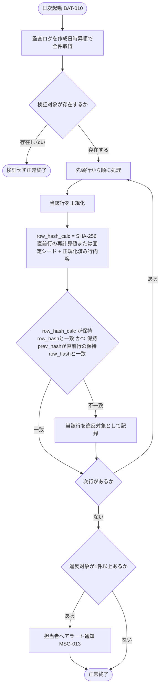

# IPO-009: 監査ログ整合性検証ロジック

> **本記述書は、追記専用の監査ログ全件についてハッシュ連鎖(`row_hash` / `prev_hash`)を再計算・突合し、改ざんまたは欠落を検出して違反対象を確定する処理ロジックを定義します。**

*種別 IPO処理機能記述書 ・ 優先度 P0 ・ ステータス ドラフト*

| 項目 | 値 |
|----|----|
| IPO ID | IPO-009 |
| 業務ユースケースID | [UC-070](../../01_requirements/04_business_usecases/UC-070.md#UC-070) |
| 関連 API / SYS | [SYS-031](../../02_basic_design/02_backend/01_system/SYS-031.md#SYS-031) |
| 参照 SEQ | — (起動契機・スケジュール・実行機構は [BAT-010](../05_batch/BAT-010.md#BAT-010)) |
| 利用テーブル | [TBL-027](../../02_basic_design/02_backend/04_database/TBL-027.md#TBL-027) |

## 1. 目的

本処理は、日次起動([SYS-031](../../02_basic_design/02_backend/01_system/SYS-031.md#SYS-031) `PR-01`〜`PR-04`)の中核として、監査ログ([TBL-027](../../02_basic_design/02_backend/04_database/TBL-027.md#TBL-027) `H_AUDIT_LOGS`)を全件走査し、各行の改ざん検知情報(`row_hash` / `prev_hash`)を再計算・突合して、不正な変更または欠落の疑いがある対象を確定する Service 層ロジックである。実装者が押さえるべき前提は次の 3 点である。

- 監査ログは追記専用でハッシュ連鎖により改ざん検知可能な形で保持すること([NFR-015](../../01_requirements/03_non_functional_requirement/07_nfr.md#NFR-015))が要件であり、`row_hash` は「直前行の `row_hash`(先頭行は固定シード)+ 当該行の正規化内容」を SHA-256(Hex・64 文字)でハッシュ化した値、`prev_hash` は直前行の `row_hash` を保持する([TBL-027](../../02_basic_design/02_backend/04_database/TBL-027.md#TBL-027) 注記)。
- 正規化対象の項目・順序および固定シード値は基本設計・物理設計([DBP-013 §7](../07_db_physical/DBP-013.md#DBP-013))で詳細設計への確定を委ねられた設計値であり、本処理が `## 4.` で確定する。
- 本処理は読み取りのみであり監査ログ自体を変更しない。起動契機・スケジュール・リトライ・部分失敗時の扱いなどの実行機構は [BAT-010](../05_batch/BAT-010.md#BAT-010) に委ねる。

## 2. 処理概要

保持されている監査ログ全件を入力に、正規化 → ハッシュ再計算 → 保持値との突合 → 違反対象の特定・通知までを 1 単位として俯瞰する。

| 機能名 | 処理概要 | 起動条件 | 終了条件 |
|----|----|----|----|
| 監査ログ整合性検証 | 監査ログ全件の `row_hash` を再計算し保持値と突合、不一致を改ざん(欠落含む)として検出・通知する | 日次起動により整合性検証が呼び出されたとき([BAT-010](../05_batch/BAT-010.md#BAT-010)) | 全件の検証を完了し、違反対象があればアラート通知済みの状態で正常終了したとき |

## 3. IPO 一覧

入力・処理・出力の対応と例外・分岐を 1 行 1 処理で一覧化する。判定分岐の詳細条件は `## 4. 処理詳細` に定義する。

| No | Input | Process | Output | 例外・分岐 | 備考 |
|----|----|----|----|----|----|
| 1 | 保持されている監査ログ全件([TBL-027](../../02_basic_design/02_backend/04_database/TBL-027.md#TBL-027)) | 検証対象の有無を確認し、作成日時昇順で走査順序を確定 | 走査対象の行集合(順序確定済み) | 検証対象が存在しない場合は検証せず正常終了 | 走査順序はハッシュ連鎖の前提(`## 4.` No.1) |
| 2 | 走査対象の各行(全カラム値) | 正規化対象の項目・順序に従い当該行の内容を正規化 | 正規化済み行内容 | 正規化対象項目に欠損があっても正規化は継続(値はそのまま連結) | 正規化仕様は `## 4.` No.2 |
| 3 | 正規化済み行内容、直前行の `row_hash`(先頭行は固定シード) | `row_hash = SHA-256(直前行のrow_hash + 正規化済み行内容)` を再計算 | 再計算した `row_hash` | — | 固定シード値は `## 4.` No.3 |
| 4 | 再計算した `row_hash`、保持されている `row_hash` / `prev_hash` | 再計算値と保持値を突合し一致可否を判定 | 一致 / 不一致(改ざんまたは欠落の疑い)の別 | 不一致は違反対象として記録し走査を継続(中断しない) | 突合条件は `## 4.` No.4 |
| 5 | 検出した違反対象一覧 | 違反対象を特定し担当者へアラート通知 | アラート通知結果 | 違反対象が 0 件のときは通知せず正常終了 | 通知は[SYS-031 PR-03](../../02_basic_design/02_backend/01_system/SYS-031.md#PR-03)・[MSG-013](../../02_basic_design/06_messages/MSG-013.md#MSG-013) |

## 4. 処理詳細

各処理の判定条件・入出力・エラー時挙動を実装可能な粒度で定義する。物理カラム名の定義は [DBP-013](../07_db_physical/DBP-013.md#DBP-013)、起動契機・リトライ・部分失敗時の扱いは [BAT-010](../05_batch/BAT-010.md#BAT-010) に委ねる。

| No | 処理名 | 処理内容(疑似コード / 判定条件) | 入力 | 出力 | 条件 | エラー時 |
|----|----|----|----|----|----|----|
| 1 | 走査対象確定 | `rows = H_AUDIT_LOGS を作成日時昇順で全件取得`。`if rows が空 → 検証せず正常終了`。作成日時昇順はハッシュ連鎖(`prev_hash` が直前行の `row_hash` を指す)の生成順序と一致させるための前提 | 保持されている監査ログ全件 | 走査対象の行集合(順序確定済み) | 検証起動時 | 取得不能時は本処理を実行せず [BAT-010](../05_batch/BAT-010.md#BAT-010) の異常終了扱いに従う |
| 2 | 行内容正規化 | 各行について、正規化対象の項目を `id, project_id, actor_type, user_id, actor_role, action, target_type, target_id, ip_address_masked, user_agent, metadata, retention_class, created_at` の順に連結する。値が `NULL` の項目は空文字として連結し、区切り文字は用いず項目順序のみで正規化を確定する(項目の型は [TBL-027](../../02_basic_design/02_backend/04_database/TBL-027.md#TBL-027) のカラム定義に従う) | 走査対象の各行(全カラム値) | 正規化済み行内容(文字列) | 走査対象確定後、行ごとに | 正規化対象項目に `NULL` があっても正規化・検証を継続(空文字連結として扱う) |
| 3 | ハッシュ再計算 | `if 先頭行 → prev = 固定シード(全 64 文字 "0" 固定値) else → prev = 直前行の再計算後 row_hash`。`row_hash_calc = SHA-256_Hex(prev + 正規化済み行内容)` | 正規化済み行内容、直前行の再計算後 `row_hash`(先頭行は固定シード) | 再計算した `row_hash`(64 文字 Hex) | 正規化完了後、行ごとに作成日時昇順で逐次計算 | 直前行が既に不一致(改ざん検出済み)でも、保持されている `prev_hash` ではなく再計算値を連鎖の基点として後続行の計算を継続する |
| 4 | 突合判定 | `if row_hash_calc != 保持row_hash → 改ざんの疑い(row_hash不一致)`。`else if 保持prev_hash != 直前行の保持row_hash → 欠落の疑い(prev_hash不一致)`。`else → 一致` | 再計算した `row_hash`、保持されている `row_hash` / `prev_hash`(当該行・直前行) | 一致 / 改ざんの疑い(row_hash不一致)/ 欠落の疑い(prev_hash不一致)の別 | ハッシュ再計算後、行ごとに | 不一致検出時も走査は中断せず対象行を違反対象として記録し次行へ進む |
| 5 | 違反対象特定・通知 | `violations = 突合判定で不一致となった全行`。`if violations が空でない → 対象の行識別子(`id`)・検出種別(改ざん/欠落)・検出日時を担当者へアラート通知` | 全行の突合結果 | アラート通知の要否、通知内容(違反対象一覧) | 全件の突合完了後 | 通知失敗時も検証自体の完了は取り消さない([BAT-010](../05_batch/BAT-010.md#BAT-010) の再通知方針に従う) |

先頭行から末尾行まで連鎖的に再計算する処理順序と、不一致検出時に走査を継続する分岐を示す。

## 5. 後続工程への引き継ぎ事項

詳細シーケンス・テスト設計へ引き継ぐ観点を挙げる。実行機構(起動トリガ・リトライ・部分失敗時の扱い)は [BAT-010](../05_batch/BAT-010.md#BAT-010) を参照。

- 正規化対象の項目順序・区切り方式(No.2)は本書が確定した設計値であり、書込み側(監査ログ記録処理)の `row_hash` 生成ロジックと本処理の再計算ロジックが同一の正規化仕様を用いることの整合確認(不一致だと全件が偽陽性の違反として検出される)。
- 先頭行の固定シード値(No.3・全 64 文字 "0")が書込み側の初期化ロジックと一致していることの確認。
- 連鎖の基点として「保持されている `prev_hash`」ではなく「直前行の再計算後 `row_hash`」を用いる方式(No.3)により、1 行の改ざんが以降全行を連鎖的に不一致とせず当該行単独の違反として切り分けられることの検証(誤検知の連鎖拡大防止)。
- 全件走査の性能([DBP-013 §6](../07_db_physical/DBP-013.md#DBP-013) の走査性能に関する留意)を踏まえた、大量データ時のバッチ処理単位・タイムアウト対策は [BAT-010](../05_batch/BAT-010.md#BAT-010) 側の実行機構で検証する。
- 違反対象検出時のアラート通知([MSG-013](../../02_basic_design/06_messages/MSG-013.md#MSG-013))の宛先・内容が担当者の事後追跡調査に十分な情報(行識別子・検出種別・検出日時)を含むことの確認。
