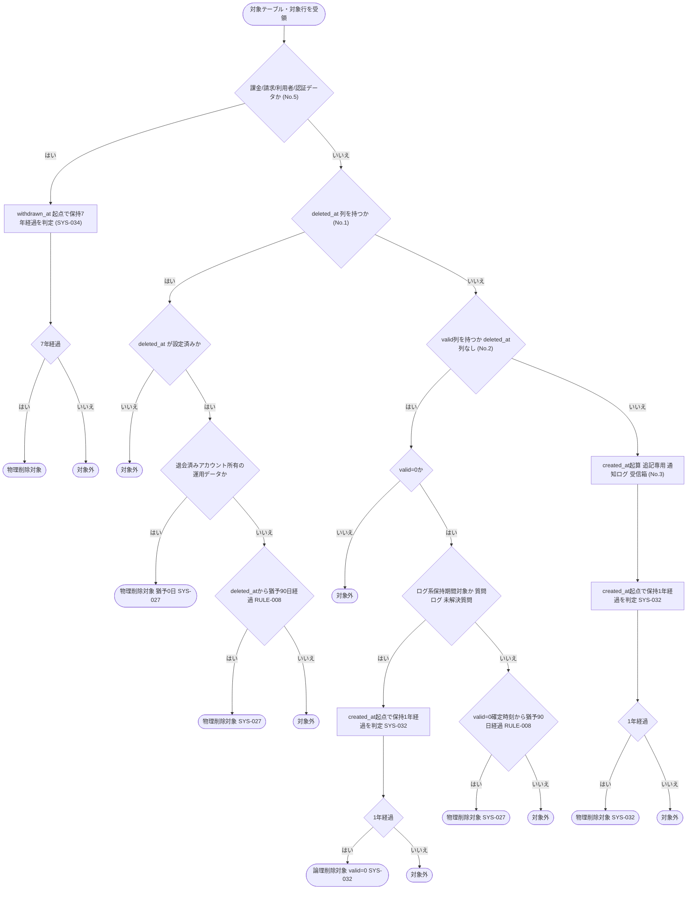

# IPO-010: 保持期間超過削除判定ロジック

> **本記述書は「退会済みアカウントの運用データ」「退会以外の事由で論理削除された行」「データ保持期間(1 年)を超過したログ系データ」「退会から保持期間(7 年)を経過したアカウントの課金・請求・認証データ」の 4 区分について、テーブル種別ごとの起算点を判定し削除対象を確定する処理ロジックを定義します。**

*種別 IPO処理機能記述書 ・ 優先度 P0 ・ ステータス ドラフト*

| 項目 | 値 |
|----|----|
| IPO ID | IPO-010 |
| 業務ユースケースID | [UC-066](../../01_requirements/04_business_usecases/UC-066.md#UC-066) |
| 関連 API / SYS | [SYS-027](../../02_basic_design/02_backend/01_system/SYS-027.md#SYS-027) ・ [SYS-032](../../02_basic_design/02_backend/01_system/SYS-032.md#SYS-032) ・ [SYS-034](../../02_basic_design/02_backend/01_system/SYS-034.md#SYS-034) |
| 参照 SEQ | — (日次バッチの内部判定ロジックのため機能固有 SEQ には結線しない) |
| 利用テーブル | [TBL-001](../../02_basic_design/02_backend/04_database/TBL-001.md#TBL-001) ・ [TBL-002](../../02_basic_design/02_backend/04_database/TBL-002.md#TBL-002) ・ [TBL-004](../../02_basic_design/02_backend/04_database/TBL-004.md#TBL-004) ・ [TBL-005](../../02_basic_design/02_backend/04_database/TBL-005.md#TBL-005) ・ [TBL-006](../../02_basic_design/02_backend/04_database/TBL-006.md#TBL-006) ・ [TBL-013](../../02_basic_design/02_backend/04_database/TBL-013.md#TBL-013) ・ [TBL-014](../../02_basic_design/02_backend/04_database/TBL-014.md#TBL-014) ・ [TBL-017](../../02_basic_design/02_backend/04_database/TBL-017.md#TBL-017) ・ [TBL-018](../../02_basic_design/02_backend/04_database/TBL-018.md#TBL-018) ・ [TBL-019](../../02_basic_design/02_backend/04_database/TBL-019.md#TBL-019) ・ [TBL-022](../../02_basic_design/02_backend/04_database/TBL-022.md#TBL-022) ・ [TBL-023](../../02_basic_design/02_backend/04_database/TBL-023.md#TBL-023) ・ [TBL-024](../../02_basic_design/02_backend/04_database/TBL-024.md#TBL-024) ・ [TBL-025](../../02_basic_design/02_backend/04_database/TBL-025.md#TBL-025) ・ [TBL-026](../../02_basic_design/02_backend/04_database/TBL-026.md#TBL-026) ・ [TBL-027](../../02_basic_design/02_backend/04_database/TBL-027.md#TBL-027) ・ [TBL-032](../../02_basic_design/02_backend/04_database/TBL-032.md#TBL-032) |

## 1. 目的

本処理は、[UC-066](../../01_requirements/04_business_usecases/UC-066.md#UC-066) が定める物理削除の傘処理のうち、対象テーブルごとに異なる起算点(退会日時 / 論理削除確定時刻 / 作成日時)と保持期間・猶予期間を突き合わせて「削除対象か否か」を確定する判定ロジックである。実行契機・スケジュール・冪等性・部分失敗時の扱いは [SYS-027](../../02_basic_design/02_backend/01_system/SYS-027.md#SYS-027)・[SYS-032](../../02_basic_design/02_backend/01_system/SYS-032.md#SYS-032)・[SYS-034](../../02_basic_design/02_backend/01_system/SYS-034.md#SYS-034) へ委ね(実行機構は対応するバッチ処理設計書 [BAT-009](../05_batch/BAT-009.md#BAT-009)・[BAT-011](../05_batch/BAT-011.md#BAT-011)・[BAT-013](../05_batch/BAT-013.md#BAT-013) を参照)、本書は各バッチが共通して呼び出す削除対象抽出条件の判定に集中する。実装者が押さえるべき前提は次の 3 点である。

- 保持期間・猶予期間の具体値の正本は[システム仕様書 §4](../../02_basic_design/07_system-spec.md#4-データ保持期間削除猶予)(アカウント論理削除猶予 90 日・[RULE-008](../../01_requirements/01_business_requirement/08_rule.md#RULE-008)、退会後請求関連データ保持 7 年・[RULE-022](../../01_requirements/01_business_requirement/08_rule.md#RULE-022)、退会後運用データ削除は猶予 0 日・[RULE-022](../../01_requirements/01_business_requirement/08_rule.md#RULE-022)、質問ログ・未解決質問の保持期間 1 年、通知ログ・お知らせ受信箱の保持期間 1 年)である。
- 起算点はテーブルの論理削除列の持ち方で 3 通りに分かれる(`## 3.` No.1〜3 で判定)。`updated_at` は以後の更新で変動しうるため猶予期間の起算に用いない([SYS-027](../../02_basic_design/02_backend/01_system/SYS-027.md#SYS-027))。
- 課金・請求関連データ(課金アカウント・サブスクリプション・請求書・課金 Webhook 受信ログ・退会記録・課金関連監査)および利用者(`M_USER`)は、退会済み運用データの速やか削除([SYS-027](../../02_basic_design/02_backend/01_system/SYS-027.md#SYS-027))・ログ系保持期間削除([SYS-032](../../02_basic_design/02_backend/01_system/SYS-032.md#SYS-032))の対象から除外し、退会日時起点の保持期間(7 年)経過後にのみ[SYS-034](../../02_basic_design/02_backend/01_system/SYS-034.md#SYS-034)が削除する。

## 2. 処理概要

対象テーブル・対象行を入力に、テーブル種別の判定 → 起算点の決定 → 保持期間・猶予期間との比較 → 削除対象確定(論理削除対象 / 物理削除対象 / 対象外)までを 1 単位として俯瞰する。

| 機能名 | 処理概要 | 起動条件 | 終了条件 |
|----|----|----|----|
| 保持期間超過削除判定 | テーブル種別ごとの起算点を決定し、保持期間・猶予期間との比較により削除対象(論理削除 / 物理削除)を確定する | [SYS-027](../../02_basic_design/02_backend/01_system/SYS-027.md#SYS-027) / [SYS-032](../../02_basic_design/02_backend/01_system/SYS-032.md#SYS-032) / [SYS-034](../../02_basic_design/02_backend/01_system/SYS-034.md#SYS-034) の日次実行が対象走査を要求したとき | 各対象行について削除対象(論理削除対象 / 物理削除対象)か対象外かを確定し呼び出し元へ返したとき |

## 3. IPO 一覧

入力・処理・出力の対応と例外・分岐を 1 行 1 処理で一覧化する。判定分岐の詳細条件は `## 4. 処理詳細` に定義する。

| No | Input | Process | Output | 例外・分岐 | 備考 |
|----|----|----|----|----|----|
| 1 | 対象テーブル、対象行 | テーブルが `deleted_at` 列を持つか判定([TBL-001](../../02_basic_design/02_backend/04_database/TBL-001.md#TBL-001) `M_USER` / [TBL-004](../../02_basic_design/02_backend/04_database/TBL-004.md#TBL-004) `M_PROJECTS` / [TBL-006](../../02_basic_design/02_backend/04_database/TBL-006.md#TBL-006) `M_FAQS`) | `deleted_at` 起算区分 | `deleted_at` が NULL(未削除)の行は判定対象外 | 起算点は `deleted_at`(`## 4.` No.1) |
| 2 | 対象テーブル、対象行 | テーブルが `valid` 列を持ち `deleted_at` 列を持たないか判定([TBL-005](../../02_basic_design/02_backend/04_database/TBL-005.md#TBL-005) / [TBL-017](../../02_basic_design/02_backend/04_database/TBL-017.md#TBL-017) / [TBL-025](../../02_basic_design/02_backend/04_database/TBL-025.md#TBL-025) など) | `valid=0` 確定時刻起算区分 | `valid=1`(未論理削除)の行は判定対象外 | 起算点は論理削除が確定した時刻(`## 4.` No.2)。`updated_at` は用いない |
| 3 | 対象テーブル、対象行 | テーブルが `valid`・`deleted_at` のいずれも持たない追記専用か判定([TBL-022](../../02_basic_design/02_backend/04_database/TBL-022.md#TBL-022) `T_INBOX_MSG` / [TBL-026](../../02_basic_design/02_backend/04_database/TBL-026.md#TBL-026) `H_NOTIF_LOGS`) | `created_at` 起算区分 | — | 起算点は `created_at`(`## 4.` No.3) |
| 4 | 起算区分、起算時刻、対象テーブルの区分(退会済み運用データ / 一般論理削除 / ログ系保持期間 / 退会アカウント課金・請求・認証) | 区分に応じた保持期間・猶予期間([システム仕様書 §4](../../02_basic_design/07_system-spec.md#4-データ保持期間削除猶予))と起算時刻からの経過日数を比較 | 削除対象(論理削除対象 / 物理削除対象)/ 対象外 | 課金・請求関連データおよび `M_USER` は退会運用データ削除・ログ系保持期間削除の対象から除外(`## 4.` No.4・No.5) | 区分別の判定条件は `## 4.` No.4 |
| 5 | 対象テーブル、削除対象確定結果 | 課金・請求関連データ([TBL-002](../../02_basic_design/02_backend/04_database/TBL-002.md#TBL-002)・[TBL-018](../../02_basic_design/02_backend/04_database/TBL-018.md#TBL-018)・[TBL-019](../../02_basic_design/02_backend/04_database/TBL-019.md#TBL-019)・[TBL-023](../../02_basic_design/02_backend/04_database/TBL-023.md#TBL-023)・[TBL-032](../../02_basic_design/02_backend/04_database/TBL-032.md#TBL-032))・利用者([TBL-001](../../02_basic_design/02_backend/04_database/TBL-001.md#TBL-001))・認証従属([TBL-013](../../02_basic_design/02_backend/04_database/TBL-013.md#TBL-013)・[TBL-014](../../02_basic_design/02_backend/04_database/TBL-014.md#TBL-014)・[TBL-024](../../02_basic_design/02_backend/04_database/TBL-024.md#TBL-024))を No.4 の一般判定から除外し [SYS-034](../../02_basic_design/02_backend/01_system/SYS-034.md#SYS-034) 専用の退会日時起点判定へ振り分け | 判定区分の確定(SYS-027 対象 / SYS-032 対象 / SYS-034 対象 / 対象外) | 除外漏れは削除対象抽出条件の誤りとなるため区分振り分けを最初に確定 | 除外対象一覧は `## 4.` No.5 |

## 4. 処理詳細

各処理の判定条件・入出力・エラー時挙動を実装可能な粒度で定義する。物理カラム名の定義・`ON DELETE` 設定は対象テーブルごとの [DB物理設計一覧](../07_db_physical/index.md)、削除順序(FK 依存順)の実装は [SYS-027](../../02_basic_design/02_backend/01_system/SYS-027.md#SYS-027)・[SYS-034](../../02_basic_design/02_backend/01_system/SYS-034.md#SYS-034) に委ねる。

| No | 処理名 | 処理内容(疑似コード / 判定条件) | 入力 | 出力 | 条件 | エラー時 |
|----|----|----|----|----|----|----|
| 1 | `deleted_at` 起算区分の判定 | `if table in {M_USER, M_PROJECTS, M_FAQS} and row.deleted_at is not null → 起算時刻 = row.deleted_at`。`row.deleted_at is null` は状態が `deleted` へ未移行のため判定対象外(状態の意味は[状態モデル §1](../../02_basic_design/08_state-model.md#1-アカウント状態)・[§5](../../02_basic_design/08_state-model.md#5-プロジェクト状態)) | 対象テーブル、対象行の `deleted_at` | 起算時刻 または 対象外 | テーブルが `deleted_at` 列を持つとき | `deleted_at` 欠損(NULL のまま状態のみ `deleted`)は整合性異常として本処理では削除対象化せず記録 |
| 2 | `valid=0` 確定時刻起算区分の判定 | `if table in {M_ALLOWED_DOMAINS, M_PRJ_USERS, T_INQUIRIES, H_QUESTION_LOGS, T_BILL_SUBS など valid 列を持ち deleted_at 列を持たないテーブル} and row.valid == 0 → 起算時刻 = 論理削除が確定した時刻`。`row.valid == 1` は未論理削除のため判定対象外 | 対象テーブル、対象行の `valid` | 起算時刻 または 対象外 | テーブルが `valid` 列を持ち `deleted_at` 列を持たないとき | 論理削除確定時刻を専用カラムとして持たないテーブルでの記録方法は§5 の課題候補。`updated_at` を起算に代用しない([SYS-027](../../02_basic_design/02_backend/01_system/SYS-027.md#SYS-027)) |
| 3 | `created_at` 起算区分の判定 | `if table in {T_INBOX_MSG, H_NOTIF_LOGS} → 起算時刻 = row.created_at` | 対象テーブル、対象行の `created_at` | 起算時刻 | テーブルが `valid`・`deleted_at` のいずれも持たない追記専用のとき | — |
| 4 | 区分別の保持期間・猶予期間判定 | 起算区分と対象テーブルの属する区分に応じ以下のいずれかを適用し、`現在日時 - 起算時刻 >= 適用期間` なら削除対象、未満なら対象外とする: (a) 退会済みアカウントが所有するプロジェクトの運用データ([SYS-027](../../02_basic_design/02_backend/01_system/SYS-027.md#SYS-027) 対象。[TBL-005](../../02_basic_design/02_backend/04_database/TBL-005.md#TBL-005) 等) → 猶予 0 日([システム仕様書 §4](../../02_basic_design/07_system-spec.md#4-データ保持期間削除猶予) 退会後運用データ削除・速やかに削除。物理削除対象)。(b) 退会以外で論理削除された一般行(No.2 の起算時刻を用いる) → アカウント論理削除の猶予 90 日([システム仕様書 §4](../../02_basic_design/07_system-spec.md#4-データ保持期間削除猶予)・[RULE-008](../../01_requirements/01_business_requirement/08_rule.md#RULE-008)。物理削除対象)。(c) ログ系保持期間対象([TBL-025](../../02_basic_design/02_backend/04_database/TBL-025.md#TBL-025)・[TBL-017](../../02_basic_design/02_backend/04_database/TBL-017.md#TBL-017)は `created_at` 起点でデータ保持期間 1 年経過時に論理削除対象、[TBL-026](../../02_basic_design/02_backend/04_database/TBL-026.md#TBL-026)・[TBL-022](../../02_basic_design/02_backend/04_database/TBL-022.md#TBL-022)は `created_at` 起点で保持期間 1 年経過時に物理削除対象) | 起算時刻、起算区分、対象テーブルの属する区分 | 削除対象(論理削除対象 / 物理削除対象)/ 対象外 | 起算時刻が確定しているとき | 適用期間の判定不能(区分不明のテーブル)は削除対象化せず記録し§5 の課題候補へ回す |
| 5 | 課金・請求・利用者・認証データの区分振り分け | `if table in {M_BILLING_ACCOUNT, T_BILL_SUBS, T_BILL_INVOICES, T_WITHDRAW_REQ, T_BILLING_WEBHOOK_LOG, M_USER, T_SESSIONS, T_ACCESS_TOKENS, T_TERMS_AGREE} → No.4 の一般判定から除外し、退会日時 `withdrawn_at`([TBL-002](../../02_basic_design/02_backend/04_database/TBL-002.md#TBL-002))起点で退会後請求関連データ保持 7 年([システム仕様書 §4](../../02_basic_design/07_system-spec.md#4-データ保持期間削除猶予)・[RULE-022](../../01_requirements/01_business_requirement/08_rule.md#RULE-022))を経過したかで判定([SYS-034](../../02_basic_design/02_backend/01_system/SYS-034.md#SYS-034) 専用) else No.4 の一般判定を適用` | 対象テーブル、[TBL-002](../../02_basic_design/02_backend/04_database/TBL-002.md#TBL-002) の `withdrawn_at` | 判定区分(SYS-027 対象 / SYS-032 対象 / SYS-034 対象 / 対象外) | 常時(削除対象抽出の最初に実施) | `withdrawn_at` が NULL(未退会)の課金アカウントに紐づくデータは判定対象外 |

保持期間・猶予期間の区分と対応バッチ・削除方式の対応を示す。区分別の削除方式(論理削除 / 物理削除)・実行順序・冪等性は各対応バッチが担う。

## 5. 後続工程への引き継ぎ事項

詳細シーケンス(DSQ)・テスト設計へ引き継ぐ観点を挙げる。実行スケジュール・冪等性・部分失敗時の再評価は [SYS-027](../../02_basic_design/02_backend/01_system/SYS-027.md#SYS-027)・[SYS-032](../../02_basic_design/02_backend/01_system/SYS-032.md#SYS-032)・[SYS-034](../../02_basic_design/02_backend/01_system/SYS-034.md#SYS-034) を参照。

- 実行契機・スケジュール・冪等性・部分失敗時の再評価・削除順序(FK 依存順)の実装機構は対応するバッチ処理設計書 [BAT-009](../05_batch/BAT-009.md#BAT-009)・[BAT-011](../05_batch/BAT-011.md#BAT-011)・[BAT-013](../05_batch/BAT-013.md#BAT-013) が担う。
- **課題候補**: `valid` 列を持つが `deleted_at` に相当する専用の論理削除確定時刻カラムを持たないテーブル([TBL-005](../../02_basic_design/02_backend/04_database/TBL-005.md#TBL-005)・[TBL-017](../../02_basic_design/02_backend/04_database/TBL-017.md#TBL-017)・[TBL-025](../../02_basic_design/02_backend/04_database/TBL-025.md#TBL-025)・[TBL-018](../../02_basic_design/02_backend/04_database/TBL-018.md#TBL-018) 等)について、猶予期間 90 日の起算時刻(`valid=0` へ更新した時刻)をどのカラムで確定させるか(専用カラム追加 / 更新ログ参照 等)が基本設計に明示されていない。DBP 側での物理カラム追加要否を確認したい。
- ログ系保持期間対象のうち [TBL-025](../../02_basic_design/02_backend/04_database/TBL-025.md#TBL-025)(質問ログ)・[TBL-017](../../02_basic_design/02_backend/04_database/TBL-017.md#TBL-017)(未解決質問)は論理削除(`valid=0`)後、[SYS-027](../../02_basic_design/02_backend/01_system/SYS-027.md#SYS-027) の一般猶予判定(猶予 90 日)に合流するか、保持期間超過時点で即座に物理削除対象とするかの境界(二重の待機期間になっていないか)をテストで検証する。
- 退会済みアカウントが所有するプロジェクトの運用データ判定(No.5 の除外後・No.4(a))と、退会以外の事由で論理削除された一般行の判定(No.4(b))が同一テーブル([TBL-005](../../02_basic_design/02_backend/04_database/TBL-005.md#TBL-005) 等)に混在する場合の優先順位(退会済みアカウント起因なら猶予 0 日を優先し RULE-008 の猶予 90 日を適用しない)をテストで確認する。
- [TBL-002](../../02_basic_design/02_backend/04_database/TBL-002.md#TBL-002)(課金アカウント)自身は `deleted_at` 列を持たないため、[SYS-034](../../02_basic_design/02_backend/01_system/SYS-034.md#SYS-034) 側での削除対象確定は `withdrawn_at` 起点の保持期間経過のみで判定し、`valid`/`deleted_at` 判定(No.1〜No.3)を経由しないことを実装時に明確化する。
- 実行中の長時間処理(FAQ 一括取り込み等)保護中は、当該プロジェクト配下データを削除対象と判定しても実削除を保留する境界([SYS-027](../../02_basic_design/02_backend/01_system/SYS-027.md#SYS-027) PR-06)をテストで検証する。
