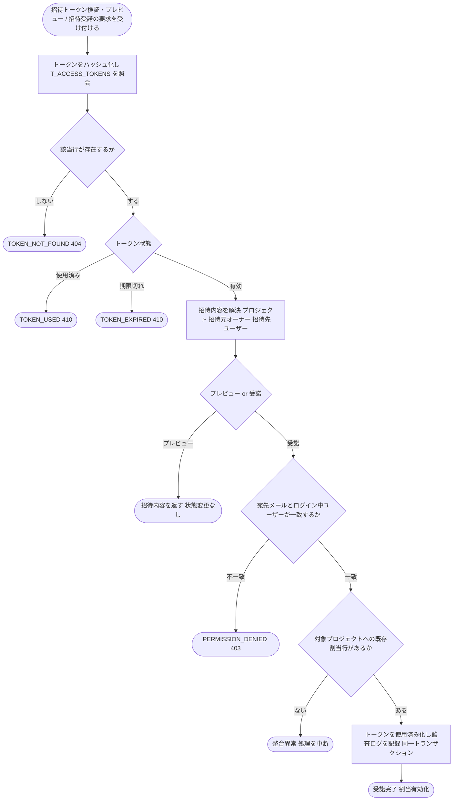

# IPO-011: 招待受諾・割当有効化判定ロジック

> **本記述書は「招待された登録済みユーザー本人が招待を受諾したとき、招待トークンの状態・有効期限・宛先一致・重複割当の有無を判定し、対象プロジェクトへの割当を有効化してよいか」を確定する処理ロジックを定義します。**

*種別 IPO処理機能記述書 ・ 優先度 P0 ・ ステータス ドラフト*

| 項目 | 値 |
|----|----|
| IPO ID | IPO-011 |
| 業務ユースケースID | [UC-006](../../01_requirements/04_business_usecases/UC-006.md#UC-006) |
| 関連 API / SYS | [API-007](../../02_basic_design/02_backend/03_apis/API-007.md#API-007) ・ [API-008](../../02_basic_design/02_backend/03_apis/API-008.md#API-008) ・ [SYS-010](../../02_basic_design/02_backend/01_system/SYS-010.md#SYS-010) |
| 参照 SEQ | — (基本設計に招待受諾専用の SEQ なし。詳細シーケンスは未着手) |
| 利用テーブル | [TBL-001](../../02_basic_design/02_backend/04_database/TBL-001.md#TBL-001) ・ [TBL-003](../../02_basic_design/02_backend/04_database/TBL-003.md#TBL-003) ・ [TBL-014](../../02_basic_design/02_backend/04_database/TBL-014.md#TBL-014) |

## 1. 目的

本処理は、招待トークン検証・プレビュー([API-007](../../02_basic_design/02_backend/03_apis/API-007.md#API-007))と招待受諾(割当有効化)([API-008](../../02_basic_design/02_backend/03_apis/API-008.md#API-008))の中核として、招待トークンの状態(有効期限・使用済み・存在有無)と本人一致・重複割当の有無を判定し、対象プロジェクトへの割当([TBL-003](../../02_basic_design/02_backend/04_database/TBL-003.md#TBL-003) `M_PRJ_USERS`)を有効化してよいかを確定する Service 層ロジックである。実装者が押さえるべき前提は次の 3 点である。

- 招待トークンの有効期限(7 日)の正本は[システム仕様書 §4](../../02_basic_design/07_system-spec.md#4-データ保持期間削除猶予)([RULE-007](../../01_requirements/01_business_requirement/08_rule.md#RULE-007))。期限切れ後は招待メール再送で新トークンを発行する運用であり、本処理では延長・救済を行わない。
- メンバー割当の状態(招待中 / 有効 / 割当解除)の意味・遷移契機の正本は[状態モデル §3](../../02_basic_design/08_state-model.md#3-メンバー割当状態)、実装上の遷移契機・ガード条件・Repository 更新の詳細は [STS-004](../01_state_transitions/STS-004.md#STS-004)。本処理は STS-004 の「招待中 → 有効」遷移の判定部分を実装可能な粒度へ具体化する。
- 招待作成時点で当該プロジェクトの割当行([TBL-003](../../02_basic_design/02_backend/04_database/TBL-003.md#TBL-003))は `valid=1` で確定済みであり([STS-004](../01_state_transitions/STS-004.md#STS-004) 状態遷移一覧 備考)、受諾時に `valid` を書き換える処理は発生しない。合成状態としての「招待中 → 有効」は被招待ユーザー本人の [`M_USER.status`](../../02_basic_design/02_backend/04_database/TBL-001.md#TBL-001)(`pending_activation` → `active`)側の有効化にのみ連動する。当該有効化自体はアカウント有効化処理([API-006](../../02_basic_design/02_backend/03_apis/API-006.md#API-006) 相当)の責務であり、本処理は招待受諾の可否判定と招待トークンの使用済み化を担う。

## 2. 処理概要

招待トークンと受諾要求者(ログイン中ユーザー)を入力に、トークン状態検証 → 宛先一致確認 → 受諾確定(トークン使用済み化)までを 1 単位として俯瞰する。プレビュー(API-007)は状態変更を行わず検証結果のみを返す読み取り専用経路であり、受諾(API-008)は同じ検証を経て状態を確定する書き込み経路である。

| 機能名 | 処理概要 | 起動条件 | 終了条件 |
|----|----|----|----|
| 招待受諾・割当有効化判定 | 招待トークンの状態(存在・期限・使用済み)と宛先一致を検証し、受諾時は割当有効化(トークン使用済み化・監査ログ記録)を同一トランザクションで確定する | 招待トークン検証・プレビュー要求、または招待受諾要求を受け付けたとき | プレビュー結果を返す、または受諾の成立(割当有効化完了)/ 不成立(エラー)を確定したとき |

## 3. IPO 一覧

入力・処理・出力の対応と例外・分岐を 1 行 1 処理で一覧化する。判定分岐の詳細条件は `## 4. 処理詳細` に定義する。

| No | Input | Process | Output | 例外・分岐 | 備考 |
|----|----|----|----|----|----|
| 1 | 招待トークン(平文・URL パス) | トークンをハッシュ化し [TBL-014](../../02_basic_design/02_backend/04_database/TBL-014.md#TBL-014)(`purpose='activation'`)を照会 | トークンレコード有無 | 該当行なしは `TOKEN_NOT_FOUND` | ハッシュ化アルゴリズムは TBL-014 定義に従う |
| 2 | トークンレコード | 有効期限・使用済みを判定 | 有効 / 期限切れ / 使用済み | 期限切れは `TOKEN_EXPIRED`、使用済みは `TOKEN_USED` | 正本は[システム仕様書 §4](../../02_basic_design/07_system-spec.md#4-データ保持期間削除猶予) |
| 3 | トークンレコードの `meta`(`projectId` / `invitedEmail`) | 招待先プロジェクト・招待元オーナー・招待先ユーザーを解決 | 招待内容(プロジェクト名・招待元オーナー名・宛先メール・有効期限) | プロジェクトまたは招待先ユーザーが存在しない場合は判定不能 | プレビュー(API-007)はここで終了・状態変更なし |
| 4 | 招待内容の宛先メール、ログイン中ユーザーのメール(受諾時のみ) | 宛先一致(本人受諾)を確認 | 一致 / 不一致 | 不一致は `PERMISSION_DENIED` | プレビューは認証不要のため本判定を行わない |
| 5 | 対象プロジェクト、受諾者ユーザー、[TBL-003](../../02_basic_design/02_backend/04_database/TBL-003.md#TBL-003) の既存割当 | 重複割当の有無を確認 | 割当あり(想定内)/ 割当なし(不整合) | 割当行が存在しない場合は整合異常として処理を中断 | 招待作成時点で割当行は作成済みが前提(STS-004) |
| 6 | 上記いずれも通過 | 割当有効化を確定(トークン使用済み化・監査ログ記録) | 受諾完了(割当有効・トークン使用済み) | 一連の判定のいずれかが不成立の場合は状態を確定しない | 同一トランザクション(API-008 前提) |

## 4. 処理詳細

各処理の判定条件・入出力・エラー時挙動を実装可能な粒度で定義する。物理カラム名の定義は [DBP-001](../07_db_physical/DBP-001.md#DBP-001) に委ねる。プレビュー(API-007)は No.1〜3 のみを実行し状態を変更しない。受諾(API-008)は No.1〜6 を実行する。

| No | 処理名 | 処理内容(疑似コード / 判定条件) | 入力 | 出力 | 条件 | エラー時 |
|----|----|----|----|----|----|----|
| 1 | トークン照会 | `hash = sha256(token)`、`rec = T_ACCESS_TOKENS から (token_hash=hash, purpose='activation') の行を取得` | 招待トークン(平文) | トークンレコード有無 | プレビュー・受諾いずれの起動時も先頭で実行 | 該当行なしは [ERR-008](../../02_basic_design/05_errors/ERR-008.md#ERR-008)(404)を返し後続を実行しない |
| 2 | トークン状態検証 | `if rec.used_at IS NOT NULL → 使用済み else if 現在時刻 > rec.expires_at → 期限切れ else → 有効`(判定順序は使用済みを先に評価) | トークンレコード | 有効 / 期限切れ / 使用済み | トークン照会で行を取得できた場合 | 使用済みは [ERR-007](../../02_basic_design/05_errors/ERR-007.md#ERR-007)(410)、期限切れは [ERR-006](../../02_basic_design/05_errors/ERR-006.md#ERR-006)(410)を返し後続を実行しない |
| 3 | 招待内容解決 | `meta = JSON.parse(rec.meta)`(`projectId` / `invitedEmail`)。`project = M_PROJECTS から meta.projectId で取得`、`invitedUser = M_USER から rec.user_id で取得`、`inviterOwner = M_PROJECTS.owner_user_id から M_USER で取得` | トークンレコードの `meta`・`user_id` | 招待内容(プロジェクト名・招待元オーナー名・宛先メール・有効期限) | トークン状態が有効な場合 | プロジェクトまたは招待先ユーザーが存在しない場合は整合異常としてプレビュー・受諾いずれも中断し `TOKEN_NOT_FOUND` 相当で扱う |
| 4 | 宛先一致確認(受諾時のみ) | `if invitedUser.email !== ログイン中ユーザーの email → 不一致`(招待は登録済みユーザー限定のため `invitedEmail` と `invitedUser.email` は招待時点で一致している前提。本判定はログイン中ユーザーとの一致を確認する) | 招待先ユーザーのメール、ログイン中ユーザーのメール | 一致 / 不一致 | 受諾(API-008)起動時のみ実行(プレビューでは行わない) | 不一致は [ERR-030](../../02_basic_design/05_errors/ERR-030.md#ERR-030)(403)を返し状態を変更しない |
| 5 | 重複割当確認(受諾時のみ) | `assign = M_PRJ_USERS から (project_id, user_id=invitedUser.id) の行を取得`。招待作成時点で当該行は `valid=1` で作成済みが前提([STS-004](../01_state_transitions/STS-004.md#STS-004)) | 対象プロジェクト、受諾者ユーザー | 既存割当行 | 宛先一致確認を通過した場合 | 割当行が存在しない場合は整合異常として処理を中断し、割当を新規作成しない(受諾は既存招待の有効化のみを担い新規作成は招待発行の責務) |
| 6 | 受諾確定 | `T_ACCESS_TOKENS.used_at = 現在時刻 で更新`。`M_PRJ_USERS.valid` は既に `1` のため更新しない(状態変化の実体は被招待ユーザー本人の `M_USER.status` 側の有効化であり本処理の対象外)。監査ログ(招待受諾・割当有効化完了)を記録 | トークンレコード、既存割当行 | 受諾完了(`projectId` / `userId` / `redirectUrl`) | 重複割当確認で既存割当行を確認できた場合 | 更新に失敗した場合はトランザクション全体をロールバックし状態を確定しない([API-008](../../02_basic_design/02_backend/03_apis/API-008.md#API-008) は 1 トランザクションで実行) |

## 5. 後続工程への引き継ぎ事項

詳細シーケンス・テスト設計へ引き継ぐ観点を挙げる。合成状態の整合性検証・並行遷移時の競合制御は [STS-004 §7](../01_state_transitions/STS-004.md#STS-004) を参照。

- トークン状態検証の判定順序(使用済み判定を期限切れ判定より先に評価する)の境界値検証(期限切れかつ使用済みの行に対し `TOKEN_USED` を優先して返すこと)。
- 重複割当確認で既存割当行が存在しない(招待作成時の割当行作成が欠落した)整合異常ケースの扱いと、その際に新規割当を作成しないことの確認。
- 招待受諾と招待メール再送・プロジェクトから外す操作([STS-004](../01_state_transitions/STS-004.md#STS-004) 状態遷移一覧)が同時に発生した場合の楽観的排他・トークン失効順序の実装方針([STS-004 §7](../01_state_transitions/STS-004.md#STS-004) 詳細設計への引き継ぎ)。
- `Idempotency-Key` による受諾 API 再送時に、既に使用済みのトークンへ二重に受諾完了を返さず `TOKEN_USED` として扱う冪等性のテスト観点。
- プロジェクト削除に伴う一括割当解除([SYS-010](../../02_basic_design/02_backend/01_system/SYS-010.md#SYS-010))が受諾処理と競合した場合(受諾直前に対象プロジェクトが削除された場合)の整合性検証。
