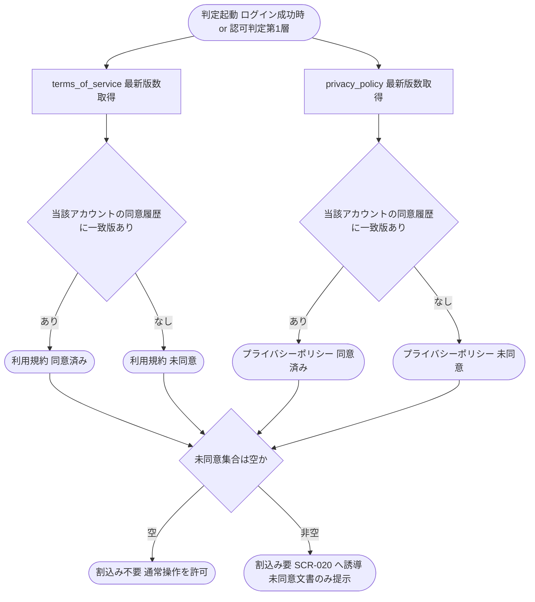

# IPO-012: 規約再同意要否判定ロジック

> **本記述書は「ログイン中のアカウント本人が、利用規約・プライバシーポリシーの改定最新版に同意済みか」を版数比較で判定し、未同意の文書があれば認可フローへ再同意割込みを発火させる処理ロジックを定義します。**

*種別 IPO処理機能記述書 ・ 優先度 P0 ・ ステータス ドラフト*

| 項目 | 値 |
|----|----|
| IPO ID | IPO-012 |
| 業務ユースケースID | [UC-013](../../01_requirements/04_business_usecases/UC-013.md#UC-013) ・ [UC-001](../../01_requirements/04_business_usecases/UC-001.md#UC-001) |
| 関連 API / SYS | [API-052](../../02_basic_design/02_backend/03_apis/API-052.md#API-052) ・ [API-053](../../02_basic_design/02_backend/03_apis/API-053.md#API-053) ・ [API-054](../../02_basic_design/02_backend/03_apis/API-054.md#API-054) ・ [API-055](../../02_basic_design/02_backend/03_apis/API-055.md#API-055) ・ [API-002](../../02_basic_design/02_backend/03_apis/API-002.md#API-002) |
| 参照 SEQ | [SEQ-002](../../02_basic_design/03_sequences/SEQ-002.md#SEQ-002) ・ [SEQ-066](../../02_basic_design/03_sequences/SEQ-066.md#SEQ-066) ・ [SEQ-067](../../02_basic_design/03_sequences/SEQ-067.md#SEQ-067) |
| 利用テーブル | [TBL-012](../../02_basic_design/02_backend/04_database/TBL-012.md#TBL-012) ・ [TBL-024](../../02_basic_design/02_backend/04_database/TBL-024.md#TBL-024) |

## 1. 目的

本処理は、ログイン成功時([API-002](../../02_basic_design/02_backend/03_apis/API-002.md#API-002))および認可判定の第 1 層([PERM-002 §1 判定段 3](../../02_basic_design/04_permissions/PERM-002.md#criteria))の各契機で、アカウント本人が利用規約・プライバシーポリシーそれぞれの最新版に同意済みかを版数比較で判定し、未同意の文書があれば再同意画面([SCR-020](../../02_basic_design/01_frontend/01_screens/SCR-020.md#SCR-020))への割込みを発火させる Service 層ロジックである。実装者が押さえるべき前提は次の 3 点である。

- 判定はアカウント(本人)単位であり、プロジェクトの立場(オーナー / メンバー)を問わない([PERM-010 §2](../../02_basic_design/04_permissions/PERM-010.md#invariant)・[FR-015](../../01_requirements/02_functional_requirement/01_account-fr.md#FR-015))。
- 利用規約・プライバシーポリシーは文書種別([TBL-012](../../02_basic_design/02_backend/04_database/TBL-012.md#TBL-012) `doc_type`)ごとに独立して判定し、改定対象でない文書は判定・提示・同意の対象としない([UC-013](../../01_requirements/04_business_usecases/UC-013.md#UC-013) 代替フロー)。
- 規約改定予告・同意期限の設計値は[システム仕様書 §3](../../02_basic_design/07_system-spec.md#3-タイムアウトセッション認証)が正本(規約改定予告 30 日前 / 規約再同意期限 14 日)。本処理は期限の起算・通知送信を担わず、期限到達後も未同意であれば通常操作を許可しない割込みを継続する([FR-010](../../01_requirements/02_functional_requirement/01_account-fr.md#FR-010))。

## 2. 処理概要

アカウント本人の同意履歴([TBL-024](../../02_basic_design/02_backend/04_database/TBL-024.md#TBL-024))と各文書の最新版([TBL-012](../../02_basic_design/02_backend/04_database/TBL-012.md#TBL-012))を突き合わせ、未同意文書の集合を確定するまでを 1 単位として俯瞰する。

| 機能名 | 処理概要 | 起動条件 | 終了条件 |
|----|----|----|----|
| 規約再同意要否判定 | 文書種別ごとに最新版と既同意版数を比較し、未同意文書の集合と割込み要否を確定する | ログイン成功時、または認証済みリクエストの認可判定(第 1 層)が実行されたとき | 割込み要否(要 / 不要)と、要の場合は未同意文書の集合を呼び出し元へ返したとき |

## 3. IPO 一覧

入力・処理・出力の対応と例外・分岐を 1 行 1 処理で一覧化する。判定分岐の詳細条件は `## 4. 処理詳細` に定義する。

| No | Input | Process | Output | 例外・分岐 | 備考 |
|----|----|----|----|----|----|
| 1 | 文書種別(`terms_of_service` / `privacy_policy`) | 文書種別ごとに最新版を取得([TBL-012](../../02_basic_design/02_backend/04_database/TBL-012.md#TBL-012) の当該 `doc_type` で最新 `effective_date`) | 文書種別ごとの最新版数 | 最新版が存在しない文書種別は判定対象から除外 | 版の一意性は `doc_type` × `version` |
| 2 | アカウント本人の識別子、文書種別ごとの最新版数 | アカウント本人の同意履歴を照合([TBL-024](../../02_basic_design/02_backend/04_database/TBL-024.md#TBL-024) の `(user_id, doc_type, terms_version)` 一致有無) | 文書種別ごとの同意有無 | 同意履歴が 1 件も無い文書種別は未同意扱い | 判定はアカウント単位(プロジェクトの立場を問わない) |
| 3 | 文書種別ごとの同意有無 | 未同意の文書種別を集合として確定 | 未同意文書の集合(0〜2 件) | 集合が空なら以降の割込み処理は行わない | 文書種別は独立判定(片方のみ未同意も成立) |
| 4 | 未同意文書の集合 | 集合が非空なら割込み要、空なら不要と確定 | 割込み要否(要 / 不要) | 要の場合は呼び出し元(ログイン応答・認可判定)へ未同意文書の集合を渡す | ログイン応答は `requireTermsAgreement`([API-002](../../02_basic_design/02_backend/03_apis/API-002.md#API-002))、認可判定は[PERM-010](../../02_basic_design/04_permissions/PERM-010.md#PERM-010) |

## 4. 処理詳細

各処理の判定条件・入出力・エラー時挙動を実装可能な粒度で定義する。物理カラム名の定義は [DBP-003](../07_db_physical/DBP-003.md#DBP-003)、認可フローへの割込み実装は [PERM-002](../../02_basic_design/04_permissions/PERM-002.md#PERM-002)・[PERM-010](../../02_basic_design/04_permissions/PERM-010.md#PERM-010) に委ねる。

| No | 処理名 | 処理内容(疑似コード / 判定条件) | 入力 | 出力 | 条件 | エラー時 |
|----|----|----|----|----|----|----|
| 1 | 最新版数取得 | `latest[docType] = M_TERMS_VER の doc_type=docType 群から effective_date 最大の 1 件`。`docType ∈ {terms_of_service, privacy_policy}` の 2 種を独立に取得 | 文書種別 | 文書種別ごとの最新版数 `latest[docType]` | 判定起動時(毎回。キャッシュしない) | 該当 `doc_type` の登録が 1 件も無い場合は判定対象から除外し割込み不要側で扱う |
| 2 | 既同意版数照合 | `agreed[docType] = exists(T_TERMS_AGREE where user_id=対象アカウント and doc_type=docType and terms_version=latest[docType])` | アカウント本人の識別子、`latest[docType]` | 文書種別ごとの真偽値 `agreed[docType]` | 最新版数取得後 | 同意履歴取得不能(取得エラー)時は安全側(未同意)として扱い割込みを発火する |
| 3 | 版数比較(未同意判定) | `if not agreed[docType] → 未同意集合に docType を追加`。`docType` ごとに独立判定し、旧版への同意履歴があっても最新版数と不一致なら未同意 | `agreed[docType]`(文書種別ごと) | 未同意文書の集合 `pending = {docType \| not agreed[docType]}` | 各 `docType` について実施 | 版数完全一致のみを同意済みとし、部分一致(旧版同意)は未同意 |
| 4 | 割込み要否確定 | `if pending is empty → 不要 else → 要`。要の場合、呼び出し元がログイン応答時は [API-002](../../02_basic_design/02_backend/03_apis/API-002.md#API-002) `requireTermsAgreement=true` を設定し、認可判定時は [PERM-010](../../02_basic_design/04_permissions/PERM-010.md#PERM-010) が[SCR-020](../../02_basic_design/01_frontend/01_screens/SCR-020.md#SCR-020) へ誘導する | 未同意文書の集合 `pending` | 割込み要否、`pending` | 判定完了時 | 呼び出し元判定不能(未対応の呼び出し元)時は安全側(割込み要)で確定 |
| 5 | 同意記録(再同意完了時) | `T_TERMS_AGREE に (user_id, docType, terms_version=latest[docType]) を 1 行記録`。`(user_id, doc_type, terms_version)` の一意制約により、既存同意があれば新規挿入せず成功として扱う(冪等) | アカウント本人の識別子、同意対象の `docType`・`version`(リクエスト指定) | 同意記録結果(成功 / 失敗) | [API-054](../../02_basic_design/02_backend/03_apis/API-054.md#API-054)・[API-055](../../02_basic_design/02_backend/03_apis/API-055.md#API-055) 呼出時 | リクエスト指定 `version` が `latest[docType]` と不一致の場合は最新版への同意として記録しない(No.6 で検証) |
| 6 | 版数不一致検証 | `if リクエスト version != latest[docType] → 記録失敗`。改定対象でない文書種別への同意要求は対象外として扱う | リクエスト指定 `version`、`latest[docType]` | 記録可否 | 同意記録の直前 | 不一致時は[エラー設計](../../02_basic_design/05_errors/index.md) の標準エラー体系に従い記録せず、`pending` から除外しない(未同意のまま維持) |

版数比較から割込み確定までの分岐を示す。文書種別(利用規約 / プライバシーポリシー)ごとに独立して判定し、いずれか一方でも未同意なら割込みを発火する。

## 5. 後続工程への引き継ぎ事項

詳細シーケンス・テスト設計へ引き継ぐ観点を挙げる。認可フローへの割込み実装は [PERM-010](../../02_basic_design/04_permissions/PERM-010.md#PERM-010)、割込み中の他画面遮断は [PERM-002](../../02_basic_design/04_permissions/PERM-002.md#PERM-002) 判定段 3 を参照。

- 文書種別ごとの独立判定(片方のみ改定・片方のみ未同意)が、[SCR-020](../../02_basic_design/01_frontend/01_screens/SCR-020.md#SCR-020) の表示条件(改定対象外の文書は非表示)と一致することの検証。
- 版数完全一致のみを同意済みとする判定(旧版同意履歴が残っていても未同意と確定すること)の境界値テスト。
- 同意履歴取得不能時に安全側(未同意・割込み要)へフォールバックする挙動と、[FR-010](../../01_requirements/02_functional_requirement/01_account-fr.md#FR-010) の同意期限(発効日 + 14 日)超過後も本判定が変わらず割込みを継続する(期限到達で判定ロジックが分岐しない)ことの確認。
- 同意記録(No.5・No.6)の冪等性(同一版数への再送で二重記録・エラーとならないこと)と、リクエスト指定版数が最新版と不一致の場合に未同意集合から除外されないことの検証。
