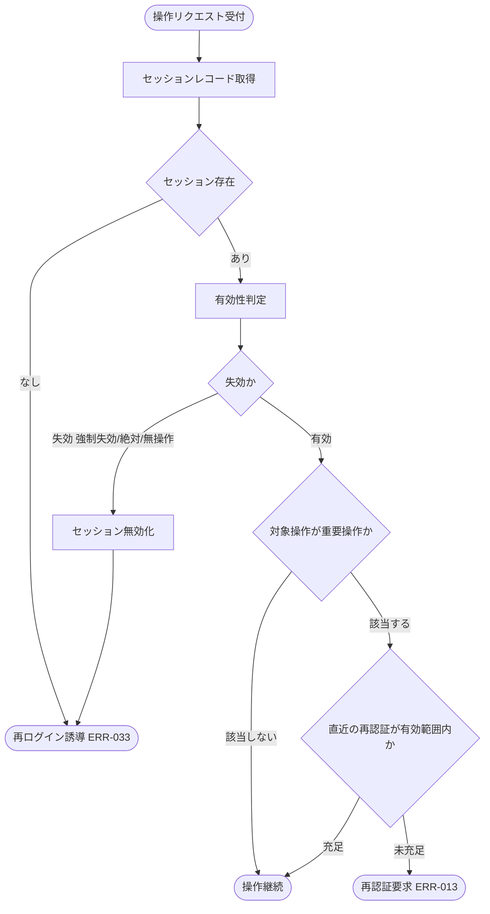

# IPO-013: セッション失効・再認証判定ロジック

> **本記述書は、アカウント利用者の操作リクエストごとに、経過時間の上限(無操作・絶対)からセッションの失効有無を判定し、失効時はセッションを無効化して再ログインへ誘導し、有効時でも重要操作では直近の本人確認(再認証)充足を判定して未充足なら再認証を要求する処理ロジックを定義します。**

*種別 IPO処理機能記述書 ・ 優先度 P0 ・ ステータス ドラフト*

| 項目 | 値 |
|----|----|
| IPO ID | IPO-013 |
| 業務ユースケースID | [UC-067](../../01_requirements/04_business_usecases/UC-067.md#UC-067) |
| 関連 API / SYS | [API-005](../../02_basic_design/02_backend/03_apis/API-005.md#API-005) ・ [SYS-028](../../02_basic_design/02_backend/01_system/SYS-028.md#SYS-028) |
| 参照 SEQ | — |
| 利用テーブル | [TBL-013](../../02_basic_design/02_backend/04_database/TBL-013.md#TBL-013) ・ [TBL-014](../../02_basic_design/02_backend/04_database/TBL-014.md#TBL-014) |

## 1. 目的

本処理は、アカウント利用者の操作リクエストを受け付けるたびに([SYS-028](../../02_basic_design/02_backend/01_system/SYS-028.md#SYS-028) `PR-01`〜`PR-06`)、ログイン状態(セッション)の有効性を経過時間の上限から判定し、失効・有効・再認証要求のいずれを確定するかを実装者が迷わず組み立てられる粒度へ具体化する Service 層ロジックである。実装者が押さえるべき前提は次の 3 点である。

- 無操作タイムアウト・絶対タイムアウトの正本値は[システム仕様書 §3](../../02_basic_design/07_system-spec.md#3-タイムアウトセッション認証)(無操作 30 分・絶対 12 時間・[RULE-004](../../01_requirements/01_business_requirement/08_rule.md#RULE-004)・[RULE-005](../../01_requirements/01_business_requirement/08_rule.md#RULE-005))。本書はこれらの値を再定義せず ID 参照する。
- セッションの永続状態(発行日時・最終アクセス日時・有効期限・失効日時)は [TBL-013](../../02_basic_design/02_backend/04_database/TBL-013.md#TBL-013)(`T_SESSIONS`)が正本。
- 重要操作の対象操作・再認証の有効範囲(当該操作 1 回 / 15 分以内)は [PERM-006](../../02_basic_design/04_permissions/PERM-006.md#PERM-006) が正本([システム仕様書 §3](../../02_basic_design/07_system-spec.md#3-タイムアウトセッション認証)・[RULE-002](../../01_requirements/01_business_requirement/08_rule.md#RULE-002))。本処理は認可判定順序([PERM-002](../../02_basic_design/04_permissions/PERM-002.md#PERM-002) 判定段 1・10)のうち、段 1(セッション検証)と段 10(再認証判定)の判定ロジックを担う。
- 再認証成立時刻・消費状態の保持先は [TBL-014](../../02_basic_design/02_backend/04_database/TBL-014.md#TBL-014)(`T_ACCESS_TOKENS`、`purpose='reauth'`・`meta{action}`)が正本。有効期限 15 分・対象操作 1 回限りで `used_at` 設定により消費する([API-005](../../02_basic_design/02_backend/03_apis/API-005.md#API-005) が発行)。

## 2. 処理概要

操作リクエストの認証情報とセッション状態を入力に、失効優先順位に従った有効性判定 → 失効時の無効化・誘導、または有効時の重要操作再認証判定 → 出力確定までを 1 単位として俯瞰する。

| 機能名 | 処理概要 | 起動条件 | 終了条件 |
|----|----|----|----|
| セッション失効・再認証判定 | 失効優先順位とタイムアウト(無操作・絶対)でセッション有効性を判定し、失効なら無効化・再ログイン誘導、有効かつ重要操作なら再認証充足を判定する | アカウント利用者の操作リクエストを受け付けたとき | 有効(操作継続) / 失効(無効化・再ログイン誘導) / 再認証要求のいずれかを呼び出し元へ返したとき |

## 3. IPO 一覧

入力・処理・出力の対応と例外・分岐を 1 行 1 処理で一覧化する。判定分岐の詳細条件は `## 4. 処理詳細` に定義する。

| No | Input | Process | Output | 例外・分岐 | 備考 |
|----|----|----|----|----|----|
| 1 | 操作リクエストのセッション識別情報 | セッション認証情報を確認し判定対象のセッションレコードを取得 | セッションレコード(最終アクセス日時・有効期限・失効日時) | 取得不能(未提示・存在しない)は失効相当として扱う | [TBL-013](../../02_basic_design/02_backend/04_database/TBL-013.md#TBL-013) |
| 2 | セッションレコード、現在時刻 | 失効優先順位(強制失効 → 絶対タイムアウト → 無操作タイムアウト → 有効)に従い有効性を判定 | 有効性判定結果(失効 / 有効) | 複数の失効条件に同時該当する場合は優先順位の先着で確定 | タイムアウト正本は[システム仕様書 §3](../../02_basic_design/07_system-spec.md#3-タイムアウトセッション認証) |
| 3 | 失効に該当したセッションレコード | 当該セッションを無効化 | セッション無効化結果 | 既に無効化済み(冪等)は再無効化しない | [TBL-013](../../02_basic_design/02_backend/04_database/TBL-013.md#TBL-013) `revoked_at` |
| 4 | 無効化結果 | 失効を明示するメッセージで再ログインへ誘導する応答を確定 | 再ログイン誘導応答([ERR-033](../../02_basic_design/05_errors/ERR-033.md#ERR-033)) | — | 当該リクエストの操作は許可しない |
| 5 | 有効と判定されたセッション、対象操作が重要操作か否か | 重要操作(対象操作は [PERM-006](../../02_basic_design/04_permissions/PERM-006.md#PERM-006))の場合、直近の本人確認(再認証)充足を判定 | 再認証充足判定結果(充足 / 未充足) / 重要操作でなければ判定省略 | 再認証の有効範囲(当該操作 1 回 / 15 分以内)を超えるか、既に他の重要操作で消費済みなら未充足 | 有効範囲正本は[システム仕様書 §3](../../02_basic_design/07_system-spec.md#3-タイムアウトセッション認証) |
| 6 | 再認証充足判定結果 | 未充足なら再認証要求、充足または重要操作でなければ操作継続を確定 | 再認証要求([ERR-013](../../02_basic_design/05_errors/ERR-013.md#ERR-013)) / 操作継続 | — | 再認証トークン発行は [API-005](../../02_basic_design/02_backend/03_apis/API-005.md#API-005) が別途担う(本処理は充足判定のみ) |

## 4. 処理詳細

各処理の判定条件・入出力・エラー時挙動を実装可能な粒度で定義する。物理カラム名の定義は [DBP-002](../07_db_physical/DBP-002.md#DBP-002)(該当 DBP 未整備時は課題化)、認可判定順序全体の枠組みは [PERM-002](../../02_basic_design/04_permissions/PERM-002.md#PERM-002) に委ねる。

| No | 処理名 | 処理内容(疑似コード / 判定条件) | 入力 | 出力 | 条件 | エラー時 |
|----|----|----|----|----|----|----|
| 1 | セッションレコード取得 | `session = T_SESSIONS.findByToken(sessionToken)`。未提示または該当レコードなしは `session = null` | 操作リクエストのセッション識別情報 | セッションレコード または `null` | 操作リクエスト受付時 | `null` の場合は判定 2 を経ず即座に失効(未認証)として `## 3.` No.4 相当の応答を返す |
| 2 | 有効性判定 | `if session.revoked_at != null → 失効(強制失効); elif now - session.created_at > 絶対タイムアウト → 失効(絶対タイムアウト); elif now - session.last_accessed_at > 無操作タイムアウト → 失効(無操作タイムアウト); else → 有効`。絶対タイムアウト・無操作タイムアウトの値は[システム仕様書 §3](../../02_basic_design/07_system-spec.md#3-タイムアウトセッション認証) | セッションレコード、現在時刻 | 有効性判定結果(失効 [理由] / 有効) | セッションレコード取得後 | 判定不能(現在時刻取得失敗等の内部異常)はサーバー内部エラーとして操作を許可しない |
| 3 | セッション無効化 | `if 判定結果が失効 → T_SESSIONS.update(session.id, revoked_at = now)` | 失効と判定されたセッションレコード | 更新後のセッションレコード(`revoked_at` 設定済み) | 判定 2 が失効のとき | 既に `revoked_at` が設定済み(強制失効等で先行無効化済み)の場合は上書きせず現状維持(冪等) |
| 4 | 再ログイン誘導応答確定 | `response = ERR-033(SESSION_EXPIRED)` を確定し、以降の当該操作は処理しない | 無効化結果 | 再ログイン誘導応答 | セッション無効化後 | — |
| 5 | 重要操作判定・再認証充足判定 | `if 対象操作 not in PERM-006対象操作 → 再認証判定を省略し充足扱い`。対象操作に該当する場合、`token = T_ACCESS_TOKENS.findLatest(userId, purpose='reauth', meta.action = 対象操作)`。`if token が無い or token.used_at != null or now - token.created_at > 15分 → 未充足 else → 充足` | 有効と判定されたセッション、対象操作の重要操作該当有無、[TBL-014](../../02_basic_design/02_backend/04_database/TBL-014.md#TBL-014)(`purpose='reauth'`)のトークンレコード | 再認証充足判定結果(充足 / 未充足 / 省略) | 判定 2 が有効のとき | 取得不能(内部異常)はサーバー内部エラーとして未充足扱い |
| 6 | 出力確定 | `if 未充足 → response = ERR-013(REAUTH_REQUIRED) else → response = 操作継続` | 再認証充足判定結果 | 再認証要求応答 / 操作継続 | 判定 5 の結果確定後 | — |

未解決・後続分岐を伴わない単純な判定であるため、写像表は設けず本節の判定条件で完結する。処理全体の分岐を俯瞰する図を示す。

## 5. 後続工程への引き継ぎ事項

詳細シーケンス(DSQ)・テスト設計へ引き継ぐ観点を挙げる。

- 失効優先順位(強制失効 → 絶対タイムアウト → 無操作タイムアウト)の境界値(タイムアウトちょうどのとき失効とするか。本書は `>`(超過のみ失効)で確定。等号境界のテストを要する)。
- 操作処理中にセッションが失効した場合の扱い(UC-067 例外フロー「操作中の失効」)。本処理は操作受付時点の判定を前提とし、処理中の再判定タイミングは DSQ で確定する。
- 同一利用者の別端末セッションは本判定の対象外(UC-067 事後条件)であり、本処理は 1 セッション単位の判定に限定することの確認。
- セッション無効化(`revoked_at` 設定)の冪等性(強制失効と本判定の二重無効化が競合しないこと)のテスト観点。
