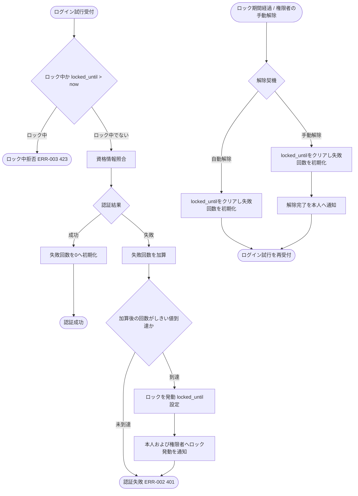

# IPO-014: ログイン失敗ロックアウト判定ロジック

> **本記述書は、ログイン試行のたびに連続失敗回数とロック状態を突き合わせ、失敗計上・ロック発動・ロック中拒否・自動解除・手動解除・失敗回数初期化のいずれを確定するかの判定ロジックを定義します。**

*種別 IPO処理機能記述書 ・ 優先度 P0 ・ ステータス ドラフト*

| 項目 | 値 |
|----|----|
| IPO ID | IPO-014 |
| 業務ユースケースID | [UC-068](../../01_requirements/04_business_usecases/UC-068.md#UC-068) |
| 関連 API / SYS | [API-002](../../02_basic_design/02_backend/03_apis/API-002.md#API-002) ・ [SYS-029](../../02_basic_design/02_backend/01_system/SYS-029.md#SYS-029) |
| 参照 SEQ | — |
| 利用テーブル | [TBL-001](../../02_basic_design/02_backend/04_database/TBL-001.md#TBL-001) ・ [TBL-013](../../02_basic_design/02_backend/04_database/TBL-013.md#TBL-013) |

## 1. 目的

本処理は、ログイン API([API-002](../../02_basic_design/02_backend/03_apis/API-002.md#API-002) P-01〜P-02)のたびに([SYS-029](../../02_basic_design/02_backend/01_system/SYS-029.md#SYS-029) `PR-01`〜`PR-08`)、当該アカウントの連続失敗回数とロック状態を突き合わせ、失敗計上・ロック発動・ロック中拒否・自動解除・失敗回数初期化のいずれを確定するかを実装者が迷わず組み立てられる粒度へ具体化する Service 層ロジックである。実装者が押さえるべき前提は次の 3 点である。

- ロックアウトしきい値(連続失敗回数)・ロック時間の正本値は[システム仕様書 §3](../../02_basic_design/07_system-spec.md#3-タイムアウトセッション認証)(連続失敗 5 回・ロック 15 分・[RULE-001](../../01_requirements/01_business_requirement/08_rule.md#RULE-001))。本書はこれらの値を再定義せず ID 参照する。
- 連続失敗回数・ロック状態は状態値(`status`)ではなく [TBL-001](../../02_basic_design/02_backend/04_database/TBL-001.md#TBL-001)(`M_USER`)の `login_failed_count` / `locked_until` の更新で表す。アカウント状態(`status`)の意味は [状態モデル §1](../../02_basic_design/08_state-model.md#1-アカウント状態) を参照し、本処理は `status` を遷移させない。
- ロック中はログイン試行を認証せず一律に拒否する([ERR-003](../../02_basic_design/05_errors/ERR-003.md#ERR-003) 423)。既存の有効セッション([TBL-013](../../02_basic_design/02_backend/04_database/TBL-013.md#TBL-013))はロック発動によって失効しない(本処理はログイン試行時点の可否判定に限定し、既存セッションの失効判定は [IPO-013](IPO-013.md#IPO-013) が別途担う)。

## 2. 処理概要

ログイン試行の認証情報とロック状態を入力に、ロック中拒否判定 → 認証照合 → 失敗時の回数加算・しきい値到達判定・ロック発動、または成功時の回数初期化までを 1 単位として俯瞰する。ロック期間の経過判定・権限者の手動解除は別契機として同一ロジックの解除処理を起動する。

| 機能名 | 処理概要 | 起動条件 | 終了条件 |
|----|----|----|----|
| ログイン失敗ロックアウト判定 | 連続失敗回数としきい値を突き合わせてロック発動可否を判定し、ロック中拒否・自動解除・手動解除・失敗回数初期化を確定する | ログイン試行を受け付けたとき、ロック期間の経過判定スケジュールが到達したとき、または権限者が手動解除を実行したとき | 認証結果(成功 / 失敗 / ロック中拒否)とロック状態の更新結果を確定して呼び出し元へ返したとき |

## 3. IPO 一覧

入力・処理・出力の対応と例外・分岐を 1 行 1 処理で一覧化する。判定分岐の詳細条件は `## 4. 処理詳細` に定義する。

| No | Input | Process | Output | 例外・分岐 | 備考 |
|----|----|----|----|----|----|
| 1 | ログイン試行対象の `M_USER` レコード、現在時刻 | ロック中か判定(`locked_until` が現在時刻より未来か) | ロック中判定結果(ロック中 / ロック中でない) | ロック中は認証照合を行わず即座にロック中拒否を確定 | [TBL-001](../../02_basic_design/02_backend/04_database/TBL-001.md#TBL-001) `locked_until` |
| 2 | メール / パスワード、対象 `M_USER` レコード | 資格情報を照合 | 認証結果(一致 / 不一致) | 判定 1 がロック中でないときのみ実施 | [API-002](../../02_basic_design/02_backend/03_apis/API-002.md#API-002) P-01 |
| 3 | 認証結果(不一致)、現在の `login_failed_count` | 連続失敗回数を加算 | 加算後の `login_failed_count` | — | [TBL-001](../../02_basic_design/02_backend/04_database/TBL-001.md#TBL-001) `login_failed_count` |
| 4 | 加算後の `login_failed_count`、ロックアウトしきい値 | しきい値到達を判定しロックを発動 | ロック発動結果(`locked_until` 設定) / 未到達なら認証失敗を確定 | しきい値到達時のみロック発動 | しきい値・ロック時間は[システム仕様書 §3](../../02_basic_design/07_system-spec.md#3-タイムアウトセッション認証) |
| 5 | ロック発動結果 | 本人および必要な権限者へロック発動を通知 | ロック発動通知 | — | [MSG-005](../../02_basic_design/06_messages/MSG-005.md#MSG-005) |
| 6 | 認証結果(一致)、現在の `login_failed_count` | 連続失敗回数を即座に初期化 | 初期化後の `login_failed_count`(0) | 判定 1 がロック中でないときのみ到達 | [SYS-029](../../02_basic_design/02_backend/01_system/SYS-029.md#SYS-029) PR-08 |
| 7 | ロック期間の経過判定スケジュール到達、または権限者の手動解除操作 | 解除契機を判定しロックを解除 | 解除結果(`locked_until` クリア) | 自動解除はロック期間経過が条件、手動解除は権限者操作が条件 | 解除契機の判定は `## 4.` No.6 |
| 8 | 解除結果 | 連続失敗回数を初期化しログイン試行を再受付、手動解除時は解除完了を通知 | 初期化後の `login_failed_count`(0)、(手動解除時)解除完了通知 | — | [SYS-029](../../02_basic_design/02_backend/01_system/SYS-029.md#SYS-029) PR-07 |

## 4. 処理詳細

各処理の判定条件・入出力・エラー時挙動を実装可能な粒度で定義する。物理カラム名の定義は [DBP-002](../07_db_physical/DBP-002.md#DBP-002)、権限者による手動解除操作の受付経路は [API-069](../../02_basic_design/02_backend/03_apis/API-069.md#API-069)(ログイン失敗ロック解除・オーナー / 当該プロジェクトの有効メンバー)を正本とする。

| No | 処理名 | 処理内容(疑似コード / 判定条件) | 入力 | 出力 | 条件 | エラー時 |
|----|----|----|----|----|----|----|
| 1 | ロック中判定 | `if user.locked_until != null and now < user.locked_until → ロック中 else → ロック中でない` | 対象 `M_USER` レコード、現在時刻 | ロック中判定結果 | ログイン試行受付時 | ロック中は認証照合(判定 2)を行わず [ERR-003](../../02_basic_design/05_errors/ERR-003.md#ERR-003)(423)を確定 |
| 2 | 資格情報照合 | `if email/password が一致 → 認証成功 else → 認証失敗` | メール / パスワード、対象 `M_USER` レコード | 認証結果(成功 / 失敗) | 判定 1 がロック中でないとき | 対象アカウント不存在時もタイミング攻撃対策のため照合処理自体は実施し不一致として扱う([ERR-002](../../02_basic_design/05_errors/ERR-002.md#ERR-002) 401) |
| 3 | 失敗回数加算・しきい値判定 | `count = user.login_failed_count + 1; if count >= ロックアウトしきい値(5) → ロック発動 else → 認証失敗のみ確定` | 認証結果(失敗)、現在の `login_failed_count` | 加算後の `login_failed_count`、ロック発動要否 | 判定 2 が失敗のとき | しきい値到達判定は加算後の値で行う(加算前と比較しない) |
| 4 | ロック発動 | `user.locked_until = now + ロック時間(15分); user.login_failed_count = count` を更新 | ロック発動要否、加算後の `login_failed_count`、ロック時間 | 更新後の `M_USER` レコード(`locked_until` 設定済み) | 判定 3 がロック発動のとき | 同時多発ログイン試行時は最後に確定した加算を正としロック発動を重複させない(冪等) |
| 5 | ロック発動通知 | ロック発動を本人および必要な権限者(対象プロジェクトのオーナー・当該プロジェクトの有効メンバー)へ通知 | ロック発動結果 | ロック発動通知 | 判定 4 実行後 | 通知送信失敗時もロック発動自体は確定済みとして扱う(通知再送は[システム仕様書 §2](../../02_basic_design/07_system-spec.md#2-課金利用量上限)の再送回数上限に従う) |
| 6 | 解除契機判定 | `if ロック期間の経過判定スケジュールで locked_until <= now のレコードを検出 → 自動解除; elif 権限者が手動解除操作を実行 → 手動解除` | ロック期間の経過判定スケジュール到達、権限者の手動解除操作 | 解除契機(自動解除 / 手動解除) | ロック中のアカウントに対して | 手動解除は [API-069](../../02_basic_design/02_backend/03_apis/API-069.md#API-069)(オーナー / 当該プロジェクトの有効メンバー)が受け付ける |
| 7 | ロック解除 | `user.locked_until = null; user.login_failed_count = 0` を更新 | 解除契機、対象 `M_USER` レコード | 更新後の `M_USER` レコード(`locked_until` クリア・`login_failed_count` 初期化) | 判定 6 で解除契機が確定したとき | 既に解除済み(`locked_until` が既に `null`)の場合は再更新しない(冪等) |
| 8 | 解除完了通知 | 手動解除の場合のみ、解除完了を本人へ通知 | 解除契機(手動解除)、更新結果 | 解除完了通知 | 判定 7 実行後かつ手動解除のとき | 自動解除時は解除完了通知を行わない(次回ログイン試行の受付再開が確認手段) |
| 9 | 成功時即時初期化 | `if 認証成功 → user.login_failed_count = 0` を更新 | 認証結果(成功)、現在の `login_failed_count` | 初期化後の `login_failed_count`(0) | 判定 2 が成功のとき | `login_failed_count` が既に 0 の場合は更新をスキップしてよい(冪等) |

連続失敗回数・ロック状態の遷移を俯瞰する図を示す。ロック中拒否・自動解除・手動解除・成功時初期化のいずれも `M_USER` の `login_failed_count` / `locked_until` の更新で表し、`status` は変えない([状態モデル §1](../../02_basic_design/08_state-model.md#1-アカウント状態))。

## 5. 後続工程への引き継ぎ事項

詳細シーケンス(DSQ)・テスト設計へ引き継ぐ観点を挙げる。アカウント状態モデルは [状態モデル §1](../../02_basic_design/08_state-model.md#1-アカウント状態) を参照。

- ロック判定の境界値(`locked_until` がちょうど現在時刻のとき「ロック中」に含めるか。本書は `now < locked_until`(現在時刻が解除予定日時より前)をロック中として確定。等号境界のテストを要する)。
- しきい値到達判定は「加算後」の `login_failed_count` で行うこと(加算前の値と比較しないこと)の確認。
- ロック発動時に既存の有効セッション([TBL-013](../../02_basic_design/02_backend/04_database/TBL-013.md#TBL-013))を失効させるか否か(本書は失効させない前提で確定。UC-068 事後条件・[IPO-013](IPO-013.md#IPO-013) との整合をDSQで再確認)。
- 同一アカウントへの並行ログイン試行時の失敗回数加算・ロック発動の競合制御(楽観ロック・冪等性)の実装方針をDSQへ委ねる。
- 自動解除(ロック期間の経過判定スケジュール)の起動契機・実行機構(トリガ/リトライ/部分失敗時の扱い)は対の BAT へ委譲(該当 BAT 未整備時は課題化)。
