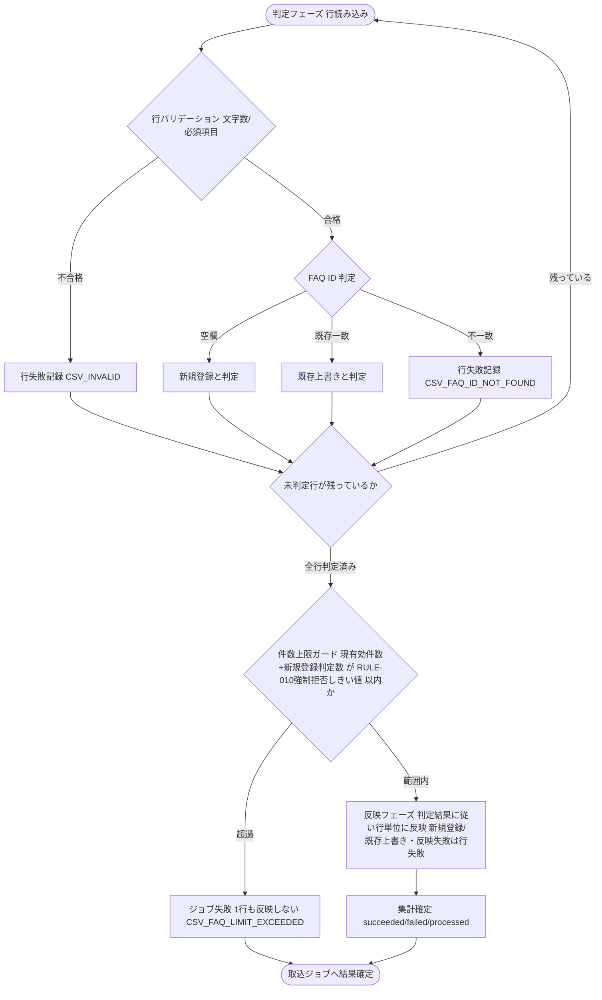

# IPO-015: FAQ CSV取込バリデーションロジック

> **本記述書は、FAQ CSV 一括取込ジョブが行単位に読み込んだ 1 行を、新規登録 / 既存上書き / 行失敗のいずれとして反映するかを判定し、全行処理後に成功・失敗件数と失敗明細を集計する処理ロジックを定義します。**

*種別 IPO処理機能記述書 ・ 優先度 P1 ・ ステータス ドラフト*

| 項目 | 値 |
|----|----|
| IPO ID | IPO-015 |
| 業務ユースケースID | [UC-046](../../01_requirements/04_business_usecases/UC-046.md#UC-046) ・ [UC-027](../../01_requirements/04_business_usecases/UC-027.md#UC-027) |
| 関連 API / SYS | [API-028](../../02_basic_design/02_backend/03_apis/API-028.md#API-028) ・ [API-029](../../02_basic_design/02_backend/03_apis/API-029.md#API-029) ・ [SYS-014](../../02_basic_design/02_backend/01_system/SYS-014.md#SYS-014) |
| 参照 SEQ | [SEQ-087](../../02_basic_design/03_sequences/SEQ-087.md#SEQ-087) |
| 利用テーブル | [TBL-006](../../02_basic_design/02_backend/04_database/TBL-006.md#TBL-006) ・ [TBL-033](../../02_basic_design/02_backend/04_database/TBL-033.md#TBL-033) |

## 1. 目的

本処理は、FAQ 一括取込ジョブ非同期実行([SYS-014](../../02_basic_design/02_backend/01_system/SYS-014.md#SYS-014) の [PR-02](../../02_basic_design/02_backend/01_system/SYS-014.md#PR-02)〜[PR-06](../../02_basic_design/02_backend/01_system/SYS-014.md#PR-06))の中核として、取込対象 CSV の 1 行ごとに新規登録・既存上書き・行失敗のいずれかを確定し、行単位のバリデーション・反映・失敗記録を経て全行処理後の成功・失敗件数と失敗明細を確定する Service 層ロジックである。実装者が押さえるべき前提は次の 2 点である。

- 受付時点の形式検証(CSV 形式・文字コード・ヘッダ行・1 ファイルあたりの最大件数・最大サイズ)は [API-028](../../02_basic_design/02_backend/03_apis/API-028.md#API-028) の受付処理(P-02)が担い、本処理の対象外([ERR-024](../../02_basic_design/05_errors/ERR-024.md#ERR-024))。本処理は受付済みジョブの行単位バリデーションのみを扱う。
- FAQ 文字数上限(質問 500 文字以内 / 回答 5,000 文字以内)は[RULE-011](../../01_requirements/01_business_requirement/08_rule.md#RULE-011)を正本とし、超過行は形式不正として扱う([ERR-024](../../02_basic_design/05_errors/ERR-024.md#ERR-024))。行単位の存在検証は[ERR-025](../../02_basic_design/05_errors/ERR-025.md#ERR-025)（当該プロジェクトに存在しない FAQ ID）を正本とする。

## 2. 処理概要

取込ジョブが受け付けた CSV の各行を入力に、**判定フェーズ**(全行のバリデーション・新規/上書き/行失敗判定)→ **件数上限ガード**(反映前)→ **反映フェーズ**(範囲内のときのみ行単位に反映)→ 件数集計までを 1 単位として俯瞰する。反映フェーズにおける行単位の成否は独立しており、1 行の失敗は他行の取込に影響しない(部分成功)。件数上限超過時は反映フェーズに入らず 1 行も反映しない([SYS-014](../../02_basic_design/02_backend/01_system/SYS-014.md#SYS-014) 処理概要)。

| 機能名 | 処理概要 | 起動条件 | 終了条件 |
|----|----|----|----|
| FAQ CSV取込バリデーション | CSV の各行について新規 / 上書き / 行失敗を判定し反映したうえで、全行処理後の成功・失敗件数と失敗明細を確定する | [API-028](../../02_basic_design/02_backend/03_apis/API-028.md#API-028) が受付済みの取込ジョブに対し、取込ジョブ非同期実行が行の読み込みを開始したとき | 全行の判定・反映・記録を終え、成功件数・失敗件数・失敗明細を取込ジョブへ確定したとき |

## 3. IPO 一覧

入力・処理・出力の対応と例外・分岐を 1 行 1 処理で一覧化する。判定分岐の詳細条件は `## 4. 処理詳細` に定義する。

| No | Input | Process | Output | 例外・分岐 | 備考 |
|----|----|----|----|----|----|
| 1 | CSV の 1 行(`FAQ ID` / 質問 / 回答 / カテゴリ)、対象プロジェクト | 行内容の形式・文字数を検証する | 検証結果(合格 / 不合格) | 質問 500 文字超過・回答 5,000 文字超過は不合格 | 文字数上限は[RULE-011](../../01_requirements/01_business_requirement/08_rule.md#RULE-011)、上限値は再定義しない |
| 2 | 検証合格行の `FAQ ID`、対象プロジェクトの既存 FAQ | `FAQ ID` の空欄 / 既存一致 / 不一致で新規・上書き・行失敗を判定する | 判定結果(新規登録 / 既存上書き / 行失敗) | 当該プロジェクトに存在しない `FAQ ID` は行失敗 | 判定条件は[API-028](../../02_basic_design/02_backend/03_apis/API-028.md#API-028)本文の `FAQ ID` 判定規約 |
| 3 | 新規登録判定行 | 未公開状態の FAQ として登録する | 登録済み FAQ(`status=draft`) | 登録失敗時は当該行のみ行失敗へ振り替え | [TBL-006](../../02_basic_design/02_backend/04_database/TBL-006.md#TBL-006) |
| 4 | 既存上書き判定行 | 既存 FAQ の質問・回答・カテゴリを上書きする(状態は維持) | 更新済み FAQ | 更新失敗時は当該行のみ行失敗へ振り替え | `status` 列は取込 CSV から受理しない([API-028](../../02_basic_design/02_backend/03_apis/API-028.md#API-028)) |
| 5 | 不合格行 / 行失敗判定行 | 行番号・失敗理由コードを記録する | 失敗明細 1 件 | 他行の処理は継続する | [TBL-033](../../02_basic_design/02_backend/04_database/TBL-033.md#TBL-033) `error_summary` |
| 6 | 全行の新規 / 上書き判定結果、対象プロジェクトの現有効 FAQ 件数 | 全行判定後・反映前に、現有効件数 + 新規登録判定件数が[RULE-010](../../01_requirements/01_business_requirement/08_rule.md#RULE-010)の強制拒否しきい値を超えるかをジョブ単位で判定する | 判定結果(範囲内 / 超過) | 超過時は反映フェーズに入らず取込ジョブを失敗とする(1 行も反映しない・部分取込しない) | 失敗理由コード `CSV_FAQ_LIMIT_EXCEEDED`([ERR-037](../../02_basic_design/05_errors/ERR-037.md#ERR-037)) |
| 7 | 全行の判定・反映結果 | 成功件数・失敗件数・処理済み件数・失敗明細を集計する | 取込ジョブの集計結果(`succeeded_count` / `failed_count` / `processed_count` / `error_summary`) | 件数上限ガード通過後に確定 | 集計後 [SYS-014](../../02_basic_design/02_backend/01_system/SYS-014.md#SYS-014) [PR-07](../../02_basic_design/02_backend/01_system/SYS-014.md#PR-07) 完了通知へ引き継ぐ |

## 4. 処理詳細

各処理の判定条件・入出力・エラー時挙動を実装可能な粒度で定義する。物理カラム名の定義は [DBP-007](../07_db_physical/DBP-007.md#DBP-007)(`M_FAQS`)・[DBP-008](../07_db_physical/DBP-008.md#DBP-008)(`TP_IMPORT_JOBS`)、非同期実行の起動制御・リトライ・冪等性・部分失敗時の扱いは [SYS-014](../../02_basic_design/02_backend/01_system/SYS-014.md#SYS-014) に委ねる(実行機構は [BAT-003](../05_batch/BAT-003.md#BAT-003) を参照)。

| No | 処理名 | 処理内容(疑似コード / 判定条件) | 入力 | 出力 | 条件 | エラー時 |
|----|----|----|----|----|----|----|
| 1 | 行バリデーション | `if len(質問) > 500 or len(回答) > 5000 → 不合格(CSV_INVALID) else → 合格`。質問・回答が空文字の行も不合格とする | CSV 1 行(質問 / 回答) | 検証結果(合格 / 不合格) | 各行の判定開始時 | 不合格行は行失敗へ振り替え(No.5 の入力へ) |
| 2 | 新規 / 上書き / 行失敗判定 | `if FAQ ID が空欄 → 新規 elif FAQ ID が当該プロジェクトの既存 FAQ と一致 → 上書き else → 行失敗(CSV_FAQ_ID_NOT_FOUND)`。既存 FAQ との一致判定は当該プロジェクト内の `id` 一致に限る(他プロジェクトの FAQ ID 一致は不一致扱い)。同一取込内で既出の非空 `FAQ ID` は重複として行失敗(`CSV_INVALID`)とする | 検証合格行の `FAQ ID`、対象プロジェクトの既存 FAQ 一覧 | 判定結果(新規登録 / 既存上書き / 行失敗) | 行バリデーション合格後 | 行失敗は理由コード `CSV_FAQ_ID_NOT_FOUND` で記録(No.5 の入力へ)。重複 `FAQ ID` は `CSV_INVALID` で記録 |
| 3 | 新規登録反映 | `INSERT`([TBL-006](../../02_basic_design/02_backend/04_database/TBL-006.md#TBL-006))。`status` は取込 CSV の値を用いず固定で `draft` とする | 新規登録判定行(質問 / 回答 / カテゴリ) | 登録済み FAQ(`status=draft`) | 新規登録判定時 | 反映失敗(制約違反等)は当該行のみ行失敗へ振り替え、他行の処理は継続する |
| 4 | 既存上書き反映 | `UPDATE`([TBL-006](../../02_basic_design/02_backend/04_database/TBL-006.md#TBL-006))。質問・回答・カテゴリを上書きし、`status` は既存値を維持する(取込 CSV の値では変更しない) | 既存上書き判定行(質問 / 回答 / カテゴリ)、対象 FAQ の現行 `status` | 更新済み FAQ | 既存上書き判定時 | 反映失敗(制約違反等)は当該行のみ行失敗へ振り替え、他行の処理は継続する |
| 5 | 行失敗記録 | `errors.push({ row, code, message })`。`row` はヘッダ行を除く 1 始まりの CSV 行番号 | 行番号、失敗理由コード(`CSV_INVALID` / `CSV_FAQ_ID_NOT_FOUND`) | 失敗明細 1 件([TBL-033](../../02_basic_design/02_backend/04_database/TBL-033.md#TBL-033) `error_summary` へ追加) | 行バリデーション不合格時、または判定・反映のいずれかが失敗したとき | 記録後、当該行はスキップし次行へ進む(1 行の失敗は他行に影響しない) |
| 6 | 件数上限ガード(ジョブ単位・**反映前**) | `if 現有効FAQ件数 + 新規登録判定件数 > RULE-010強制拒否しきい値 → ジョブ失敗(CSV_FAQ_LIMIT_EXCEEDED)`。**全行の判定(No.1/No.2)完了後、反映(No.3/No.4)を開始する前**に本ガードを評価する。超過時は 1 行も反映せずジョブを失敗とする(ロールバック不要)。範囲内のときのみ No.3/No.4 の行単位反映へ進む。しきい値の正本は[RULE-010](../../01_requirements/01_business_requirement/08_rule.md#RULE-010)(値は再定義しない) | 対象プロジェクトの現有効 FAQ 件数、新規登録判定件数 | 判定結果(範囲内 / 超過) | 全行判定後・反映開始前 | 超過時は 1 行も反映せずジョブを `failed` とする(理由コード `CSV_FAQ_LIMIT_EXCEEDED`・[ERR-037](../../02_basic_design/05_errors/ERR-037.md#ERR-037)・ジョブ単位)。部分取込しない |
| 7 | 集計確定 | `succeeded_count = 新規登録数 + 既存上書き数`、`failed_count = errors.length`、`processed_count = succeeded_count + failed_count` | 全行の判定・反映・記録結果 | `succeeded_count` / `failed_count` / `processed_count` / `error_summary` | 件数上限ガード通過後 | 集計不能(異常終了)時の扱いは [SYS-014](../../02_basic_design/02_backend/01_system/SYS-014.md#SYS-014) に委ねる(実行機構は [BAT-003](../05_batch/BAT-003.md#BAT-003) を参照) |

行の失敗理由コードとエラー定義・API 応答への対応は次のとおり。

| 失敗理由コード | 発生する処理 | エラー定義 | `error_summary.errors[].code` |
|----|----|----|----|
| 文字数超過・必須項目欠落 | No.1 行バリデーション | [ERR-024](../../02_basic_design/05_errors/ERR-024.md#ERR-024) | `CSV_INVALID` |
| 当該プロジェクトに存在しない `FAQ ID` | No.2 新規 / 上書き / 行失敗判定 | [ERR-025](../../02_basic_design/05_errors/ERR-025.md#ERR-025) | `CSV_FAQ_ID_NOT_FOUND` |

ジョブ単位の失敗理由 `CSV_FAQ_LIMIT_EXCEEDED`([ERR-037](../../02_basic_design/05_errors/ERR-037.md#ERR-037))は No.6 件数上限ガード(反映前)で発生し、行明細(`errors[]`)ではなく取込ジョブ自体の失敗理由として記録する(ジョブ状態は `failed`・1 行も反映しない)。

行単位の判定から集計確定までの分岐を示す。

## 5. 後続工程への引き継ぎ事項

詳細シーケンス(DSQ)・テスト設計へ引き継ぐ観点を挙げる。取込ジョブの状態遷移は[状態モデル §6](../../02_basic_design/08_state-model.md#6-faq取込ジョブ状態)、非同期実行の起動制御・リトライ・冪等性・部分失敗時の異常終了判定は [SYS-014](../../02_basic_design/02_backend/01_system/SYS-014.md#SYS-014) を参照(実行機構は [BAT-003](../05_batch/BAT-003.md#BAT-003) を参照)。

- 文字数上限([RULE-011](../../01_requirements/01_business_requirement/08_rule.md#RULE-011))の境界値(500 文字ちょうど / 5,000 文字ちょうどを合格とするか)の確認とテスト観点。
- 既存上書き反映時に `status` を現行値のまま維持する(取込 CSV の値で変更しない)ことの検証。
- テスト観点: 同一 CSV 内の同一 `FAQ ID` 重複(2 行 / 3 行・一部が文字数超過)を `CSV_INVALID` の行失敗として検証する。
- 反映失敗(制約違反等)を行失敗へ振り替える際に、他行の処理・トランザクション境界へ影響を与えないことの検証(Tx 境界の実装方式は [BAT-003](../05_batch/BAT-003.md#BAT-003) §6 を参照)。
