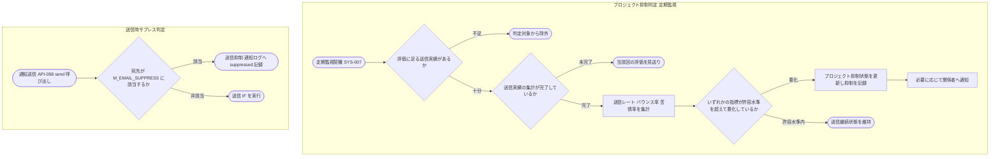

# IPO-016: 通知送信抑制判定ロジック(品質監視)

> **本記述書は「プロジェクト単位の送信品質(送信レート・バウンス率・苦情率)を監視して通知送信を自動抑制してよいか」を、定期監視によるプロジェクト抑制判定と、通知送信時点でのサプレス照合の 2 系統から判定する処理ロジックを定義します。**

*種別 IPO処理機能記述書 ・ 優先度 P1 ・ ステータス ドラフト*

| 項目 | 値 |
|----|----|
| IPO ID | IPO-016 |
| 業務ユースケースID | [UC-065](../../01_requirements/04_business_usecases/UC-065.md#UC-065) |
| 関連 API / SYS | [SYS-007](../../02_basic_design/02_backend/01_system/SYS-007.md#SYS-007) ・ [API-058](../../02_basic_design/02_backend/03_apis/API-058.md#API-058) ・ [API-059](../../02_basic_design/02_backend/03_apis/API-059.md#API-059) |
| 参照 SEQ | — (定期監視の起動契機・スケジュールは [SYS-007](../../02_basic_design/02_backend/01_system/SYS-007.md#SYS-007)) |
| 利用テーブル | [TBL-026](../../02_basic_design/02_backend/04_database/TBL-026.md#TBL-026) ・ [TBL-007](../../02_basic_design/02_backend/04_database/TBL-007.md#TBL-007) ・ [TBL-004](../../02_basic_design/02_backend/04_database/TBL-004.md#TBL-004) |

## 1. 目的

本処理は、送信元ドメインの評判を守るため、プロジェクト単位の送信品質([TBL-026](../../02_basic_design/02_backend/04_database/TBL-026.md#TBL-026) `H_NOTIF_LOGS` を集計元とする送信レート・バウンス率・苦情率)を監視し、あらかじめ定めた許容水準を超えて悪化したプロジェクト宛の通知送信を自動で抑制するかを確定する Service 層ロジックである（[BR-05](../../01_requirements/01_business_requirement/05_notification-br.md) 送信品質の監視）。実装者が押さえるべき前提は次の 3 点である。

- 本処理は 2 系統から成る。(1) 定期監視によりプロジェクト単位の送信可否そのものを切り替える**プロジェクト抑制判定**、(2) 通知送信の都度、宛先アドレスが送信停止対象でないかを確認する**送信時サプレス判定**([TBL-007](../../02_basic_design/02_backend/04_database/TBL-007.md#TBL-007) `M_EMAIL_SUPPRESS` の照合)。両系統は判定単位(プロジェクト / メールアドレス)と適用範囲(単一プロジェクト / 全プロジェクト横断)が異なり、独立して働く。
- 送信品質の許容水準(送信レート・バウンス率・苦情率のしきい値)そのものの具体値は基本設計([SYS-007](../../02_basic_design/02_backend/01_system/SYS-007.md#SYS-007))・[システム仕様書](../../02_basic_design/07_system-spec.md)のいずれにも定義がない。本書は「許容水準と照合する」という判定の枠組みのみを定義し、具体値は正本未確定として `## 5.` で引き継ぐ。
- `M_EMAIL_SUPPRESS`([TBL-007](../../02_basic_design/02_backend/04_database/TBL-007.md#TBL-007))はメールアドレス単位・全プロジェクト横断のサプレスリストであり、バウンス・苦情の宛先を Webhook 契機([API-059](../../02_basic_design/02_backend/03_apis/API-059.md#API-059))で登録する。本処理の送信時サプレス判定はこのリストを参照するのみで、リストへの追加は本処理の対象外([STS-009](../01_state_transitions/STS-009.md#STS-009) が定義する `H_NOTIF_LOGS` の状態遷移に付随する処理)である。

## 2. 処理概要

定期監視によるプロジェクト単位の品質評価と、通知送信時点での宛先単位のサプレス照合という起動契機の異なる 2 処理を、通知送信抑制という共通の目的の下で 1 単位として俯瞰する。

| 機能名 | 処理概要 | 起動条件 | 終了条件 |
|----|----|----|----|
| プロジェクト抑制判定(定期監視) | プロジェクト単位の送信レート・バウンス率・苦情率を集計し許容水準と照合して抑制要否を確定する | 定期監視のスケジュール契機で呼び出されたとき([SYS-007](../../02_basic_design/02_backend/01_system/SYS-007.md#SYS-007)) | 対象プロジェクトごとに抑制 / 継続のいずれかを確定し記録したとき |
| 送信時サプレス判定 | 通知送信の直前に宛先メールアドレスが送信停止対象かを確認する | 通知送信 IF([API-058](../../02_basic_design/02_backend/03_apis/API-058.md#API-058) `send`)が呼び出されたとき | 送信可 / 送信抑制のいずれかを確定し呼び出し元へ返したとき |

## 3. IPO 一覧

入力・処理・出力の対応と例外・分岐を 1 行 1 処理で一覧化する。判定分岐の詳細条件は `## 4. 処理詳細` に定義する。

| No | Input | Process | Output | 例外・分岐 | 備考 |
|----|----|----|----|----|----|
| 1 | 対象プロジェクト、直近の送信実績([TBL-026](../../02_basic_design/02_backend/04_database/TBL-026.md#TBL-026)) | 評価に足る送信実績があるかを判定 | 判定対象 / 判定対象外 | 実績不足のプロジェクトは判定対象から除外 | 定期監視の起動制御は [SYS-007](../../02_basic_design/02_backend/01_system/SYS-007.md#SYS-007) |
| 2 | 判定対象プロジェクトの送信実績 | 送信実績の集計が完了しているかを確認 | 集計完了 / 未完了 | 未完了時は当該回の評価を見送り次回監視で再評価 | — |
| 3 | 集計完了済みの送信実績 | 直近の送信レート・バウンス率・苦情率を集計 | 各指標の集計値 | — | 集計元は [TBL-026](../../02_basic_design/02_backend/04_database/TBL-026.md#TBL-026)(参照のみ) |
| 4 | 各指標の集計値、許容水準(正本未確定) | 各指標を許容水準と照合し悪化有無を判定 | 悪化あり / 許容水準内 | 許容水準の具体値は `## 5.` 参照 | いずれか 1 指標でも超過なら悪化と判定 |
| 5 | 悪化判定結果 | 悪化時は当該プロジェクト宛の通知送信を抑制状態にし、抑制の有無と対象を記録 | プロジェクト抑制状態の更新、抑制記録、必要に応じた関係者通知 | 許容水準内なら送信継続状態を維持(更新なし) | 更新先は [TBL-004](../../02_basic_design/02_backend/04_database/TBL-004.md#TBL-004)(§5 参照) |
| 6 | 通知送信の宛先メールアドレス | [TBL-007](../../02_basic_design/02_backend/04_database/TBL-007.md#TBL-007) を宛先メール HMAC で照合 | 送信可 / 送信抑制(サプレス対象) | 該当時は送信 IF 呼び出し前に送信抑制として処理する | 全プロジェクト横断で判定(プロジェクト抑制判定とは独立) |

## 4. 処理詳細

各処理の判定条件・入出力・エラー時挙動を実装可能な粒度で定義する。定期監視の起動契機・スケジュールは [SYS-007](../../02_basic_design/02_backend/01_system/SYS-007.md#SYS-007) に委ね、物理カラム名の定義は [DBP-002](../07_db_physical/DBP-002.md#DBP-002) に委ねる。

### 4.1 プロジェクト抑制判定(定期監視)

| No | 処理名 | 処理内容(疑似コード / 判定条件) | 入力 | 出力 | 条件 | エラー時 |
|----|----|----|----|----|----|----|
| 1 | 評価対象判定 | `if 対象プロジェクトの直近送信実績が評価に足る量に満たない → 判定対象から除外` | 対象プロジェクト、直近の送信実績 | 判定対象 / 判定対象外 | 定期監視の各起動サイクルごと | 実績不足の判定基準そのものが正本未確定(`## 5.` 参照) |
| 2 | 集計完了確認 | `if 送信実績の集計が未完了 → 当該回の評価を見送り次回監視機会で再評価` | 判定対象プロジェクトの送信実績集計状態 | 集計完了 / 未完了 | 評価対象判定を通過したプロジェクトに対して | 未完了時は本処理を中断し当該プロジェクトの状態を変更しない |
| 3 | 指標集計 | `送信レート = 送信件数の推移`、`バウンス率 = バウンス件数 / 送信件数`、`苦情率 = 苦情件数 / 送信件数` を直近期間で算出 | 集計完了済みの送信実績([TBL-026](../../02_basic_design/02_backend/04_database/TBL-026.md#TBL-026) `delivery_state` 別件数) | 送信レート・バウンス率・苦情率の集計値 | 集計完了確認を通過したとき | 集計対象期間・分母の定義は正本未確定(`## 5.` 参照) |
| 4 | 許容水準照合 | `if 送信レート、バウンス率、苦情率のいずれかが許容水準を超えて悪化 → 悪化と判定 else → 許容水準内と判定` | 各指標の集計値、許容水準 | 悪化あり / 許容水準内 | 指標集計の完了後 | 許容水準の具体値は正本未確定(`## 5.` 参照)。いずれか 1 指標の超過で悪化とする |
| 5 | 抑制状態更新 | `if 悪化と判定 → 当該プロジェクトの通知送信を抑制状態へ更新 else → 抑制状態を更新せず送信継続状態を維持` | 許容水準照合結果、対象プロジェクト | プロジェクト抑制状態(抑制 / 非抑制) | 許容水準照合の完了後 | 更新先の物理カラムは [TBL-004](../../02_basic_design/02_backend/04_database/TBL-004.md#TBL-004) に定義がなく正本未確定(`## 5.` 参照) |
| 6 | 抑制記録 | 抑制の有無と対象プロジェクトを記録し、事後に経緯を追跡できるようにする | 抑制状態更新結果 | 抑制記録 | 抑制状態を更新したとき | 記録先テーブルは正本未確定(`## 5.` 参照) |
| 7 | 関係者通知 | 抑制を行った旨と対象プロジェクトを、必要に応じて運営へ知らせる | 抑制記録 | 関係者通知([MSG-013](../../02_basic_design/06_messages/MSG-013.md#MSG-013)) | 抑制状態更新時 | 通知失敗時も抑制状態の確定自体は取り消さない(再送方針は正本未確定・`## 5.` 参照) |

### 4.2 送信時サプレス判定

| No | 処理名 | 処理内容(疑似コード / 判定条件) | 入力 | 出力 | 条件 | エラー時 |
|----|----|----|----|----|----|----|
| 8 | サプレス照合 | `s = M_EMAIL_SUPPRESS を宛先メール HMAC で検索`。`if s が存在 → 送信抑制(サプレス対象) else → 送信可` | 通知送信の宛先メールアドレス | 送信可 / 送信抑制 | [API-058](../../02_basic_design/02_backend/03_apis/API-058.md#API-058) `send` 呼び出し直前 | 照合不能時は安全側に倒し送信を保留する(具体的なフォールバック方針は正本未確定・`## 5.` 参照) |
| 9 | 送信可否確定 | `if サプレス照合=送信抑制 → 送信を実行せず抑制結果を通知ログへ記録 else → 送信 IF を呼び出す` | サプレス照合結果 | 送信実行 / 送信抑制(通知ログへ記録) | サプレス照合の完了後 | 抑制結果は [TBL-026](../../02_basic_design/02_backend/04_database/TBL-026.md#TBL-026) `delivery_state='suppressed'`([状態モデル §8.2](../../02_basic_design/08_state-model.md#82-通知配信状態)) |

2 系統の判定の全体像を示す。プロジェクト抑制判定は定期監視から、送信時サプレス判定は通知送信の都度、それぞれ独立に起動する。

## 5. 後続工程への引き継ぎ事項

詳細シーケンス(DSQ)・テスト設計・基本設計へ引き継ぐ観点を挙げる。定期監視の起動契機・スケジュールは [SYS-007](../../02_basic_design/02_backend/01_system/SYS-007.md#SYS-007) を参照。通知配信状態の遷移契機は [STS-009](../01_state_transitions/STS-009.md#STS-009) を参照。

- **正本未確定(基本設計への差し戻し課題)**: 送信品質の許容水準(送信レート・バウンス率・苦情率それぞれのしきい値)の具体値が [SYS-007](../../02_basic_design/02_backend/01_system/SYS-007.md#SYS-007)・[システム仕様書](../../02_basic_design/07_system-spec.md)のいずれにも定義されていない。指標集計の対象期間・分母の定義、評価に足る送信実績の下限値も同様に未確定。本書はこれらを正本値として再定義せず、判定の枠組みのみを定義した。
- **正本未確定(基本設計への差し戻し課題)**: プロジェクト単位の送信抑制状態を保持する物理カラムが [TBL-004](../../02_basic_design/02_backend/04_database/TBL-004.md#TBL-004)(`M_PROJECTS`)のカラム定義に存在しない。[STS-009](../01_state_transitions/STS-009.md#STS-009) §4 注記は更新先を TBL-004 としているが、対応するカラムの追加は基本設計側の対応が必要。
- 定期監視の起動契機・スケジュール・冪等性・部分失敗時の扱い・再送方針の実行機構は [BAT-002](../05_batch/BAT-002.md#BAT-002)(送信品質監視による通知送信抑制)が定義する。起動周期・時刻等の具体値は同 BAT §9 が正本未確定として引き継ぐ。
- サプレス照合不能時(D1 応答遅延・障害等)のフォールバック方針(送信を保留するか許容するか)の確定。
- プロジェクト抑制状態と送信時サプレス判定の優先順位(両方に該当する場合の抑制理由の記録方法)の確認。
- 定期監視と通知送信時の評価が同一プロジェクトへほぼ同時に到達した場合の競合制御方針の確定([BAT-002](../05_batch/BAT-002.md#BAT-002) §9 が正本未確定として引き継ぐ)。
- 抑制状態解除(悪化から回復した場合の再評価・解除契機)の判定条件が基本設計・本書のいずれにも定義がなく、確定が必要。
