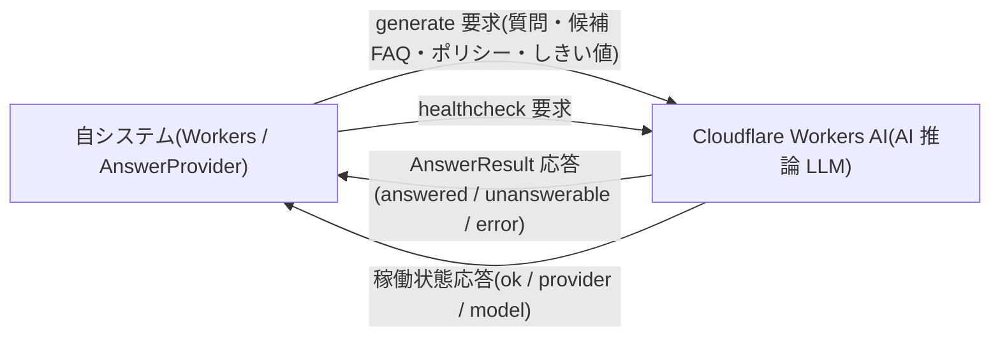

# EIF-001: AI 推論 LLM 連携(`AnswerProvider`)

> **本設計は「AI 推論 LLM(Cloudflare Workers AI)への回答生成連携」の外部インターフェースを定義します。** MVP は `WorkersAIAnswerProvider` として実装します。

*種別 外部インターフェース設計 ・ ステータス ドラフト*

## 項目

本連携の識別子と、支える業務ユースケース・関連する基本設計 ID を示す。全層の厳密な紐付けはトレーサビリティ一覧で一元管理し、本文には記載しない。

| 項目 | 値 |
|----|----|
| EIF ID | EIF-001 |
| 業務ユースケースID | [UC-042](../../01_requirements/04_business_usecases/UC-042.md#UC-042) ・ [UC-047](../../01_requirements/04_business_usecases/UC-047.md#UC-047) |
| 関連 API | [API-057](../../02_basic_design/02_backend/03_apis/API-057.md#API-057) ・ [API-038](../../02_basic_design/02_backend/03_apis/API-038.md#API-038) |
| 関連 SYS | [SYS-015](../../02_basic_design/02_backend/01_system/SYS-015.md#SYS-015) |
| 関連テーブル | [TBL-030](../../02_basic_design/02_backend/04_database/TBL-030.md#TBL-030) ・ [TBL-031](../../02_basic_design/02_backend/04_database/TBL-031.md#TBL-031) |
| 関連エラー | [ERR-036](../../02_basic_design/05_errors/ERR-036.md#ERR-036) ・ [ERR-009](../../02_basic_design/05_errors/ERR-009.md#ERR-009) |
| 関連メッセージ | — |

## 1. 目的

ウィジェット利用者の質問に対し、候補 FAQ の範囲内で AI が回答を生成する処理を外部 LLM(Cloudflare Workers AI)へ委譲する連携を定義する。ウィジェット質問送信([API-038](../../02_basic_design/02_backend/03_apis/API-038.md#API-038))が回答可否を判定して案内を返す業務([UC-042](../../01_requirements/04_business_usecases/UC-042.md#UC-042))を、内部抽象インターフェース [`AnswerProvider`](../../02_basic_design/02_backend/03_apis/API-057.md#API-057) を介して支える。

## 2. 連携概要

連携先と連携の性質を一覧で示す。連携方向は自システムからの同期呼び出し(送信)と結果受信(応答)の一方向要求・応答で、外部からの能動通知(Webhook)は持たない。値の正本は各リンク先を参照する。

| 連携先 | 連携方向 | プロトコル | 連携タイミング | 認証方式 | セキュリティ要件 |
|----|----|----|----|----|----|
| Cloudflare Workers AI(AI 推論 LLM) | 送信(要求 → 応答受信) | Cloudflare Workers AI バインディング(Workers ランタイム内呼び出し) | ウィジェット質問送信時([API-038](../../02_basic_design/02_backend/03_apis/API-038.md#API-038) P-03)の同期呼び出し / ヘルスチェック実行時 | Workers AI バインディング(内部・秘匿。Bearer トークン・API キーの実値は保持しない) | Cloudflare ネットワーク内通信・モデル学習に利用しない(`learn: false`)・秘匿値は環境で注入 |

> [!NOTE]
> **本連携は Webhook を受信しない。** 外部からの能動的な状態通知が無いため署名検証・冪等な重複再送処理は該当しない(§6 参照)。冪等性は上位 [API-038](../../02_basic_design/02_backend/03_apis/API-038.md#API-038) が質問ログ ID を基準に担保する。

## 3. 連携図

自システム(Workers)と AI 推論 LLM の間のデータの流れを示す。要求に対して応答線を対で描く。

## 4. 送信項目

自システム(`AnswerProvider.generate`)から Cloudflare Workers AI へ渡す入力項目を定義する。型・全集合は [API-057 インターフェース定義](../../02_basic_design/02_backend/03_apis/API-057.md#API-057) を正本とする。秘密情報・プロンプト実文は書かない。

| 項目名 | データ型 | 必須 | 説明 | 備考 |
|----|----|----|----|----|
| `question` | string | ◯ | ウィジェット利用者が送信した質問内容 | 1〜1000 文字([API-038](../../02_basic_design/02_backend/03_apis/API-038.md#API-038) バリデーション) |
| `candidate_faqs` | array\<object\> | ◯ | 回答の根拠として渡す候補 FAQ 配列。要素は `id` / `question` / `answer` | 抽出は本連携外(上位 `AnswerService` の全文検索上位 N 件・§7) |
| `policy.faq_only` | boolean | ◯ | 候補 FAQ の範囲に回答を限定する(`true` 固定) | [API-057](../../02_basic_design/02_backend/03_apis/API-057.md#API-057) |
| `policy.forbid_new_facts` | boolean | ◯ | 候補 FAQ に無い新規事実の生成を禁止する(`true` 固定) | [API-057](../../02_basic_design/02_backend/03_apis/API-057.md#API-057) |
| `policy.learn` | boolean | ◯ | 送信内容をモデル学習に利用しない(`false` 固定) | [API-057](../../02_basic_design/02_backend/03_apis/API-057.md#API-057) |
| `locale` | enum | ◯ | 応答生成のロケール(`ja-JP` 固定) | [API-057](../../02_basic_design/02_backend/03_apis/API-057.md#API-057) |
| `timeout_ms` | number | ◯ | 推論打ち切り時間(ミリ秒) | 値の正本は [システム仕様書 §3 `AI 推論タイムアウト`](../../02_basic_design/07_system-spec.md#3-タイムアウトセッション認証) |

> [!NOTE]
> **回答可否のしきい値(信頼度・関連度)は本連携の入力として渡す。** 対象プロジェクトに設定値があれば [`TP_AI_THRESH_CACHE`](../../02_basic_design/02_backend/04_database/TBL-031.md#TBL-031) の値を、未登録・取得不能時はグローバル既定値を渡す。値の正本は [システム仕様書 §1](../../02_basic_design/07_system-spec.md#1-aiしきい値)、取得・フォールバックの担い手は [SYS-015](../../02_basic_design/02_backend/01_system/SYS-015.md#SYS-015)。ただし関連度(relevance)は候補最上位の全文検索一致スコアであり本連携は返さず、関連度しきい値との比較は上位([IPO-001](../04_ipo/IPO-001.md#IPO-001) No.3)で行う。本連携は信頼度(`confidence`)を返す。

## 5. 受信項目

Cloudflare Workers AI からの応答(`AnswerResult`)を定義する。取りうる結果種別・理由コードは全集合を列挙する。型の正本は [API-057 インターフェース定義](../../02_basic_design/02_backend/03_apis/API-057.md#API-057)。

| 項目名 | データ型 | 必須 | 説明 | 備考 |
|----|----|----|----|----|
| `kind` | enum | ◯ | 結果種別。取りうる値は `answered` / `unanswerable` / `error` | 以下の項目は `kind` により有無が分岐 |
| `answer` | string | 条件付 | `kind=answered` 時の生成回答本文 | 回答文中の個人情報は上位でマスキング([RULE-024](../../01_requirements/01_business_requirement/08_rule.md#RULE-024)) |
| `cited_faq_ids` | array\<string\> | 条件付 | `kind=answered` 時の引用元 FAQ ID 配列 | — |
| `confidence` | number | 条件付 | `kind=answered` 時の信頼度(0〜1) | しきい値判定は上位([API-038](../../02_basic_design/02_backend/03_apis/API-038.md#API-038) P-03) |
| `reason_code`(`unanswerable`) | enum | 条件付 | `kind=unanswerable` 時の理由。取りうる値は `no_match` / `low_confidence` / `contradiction` | 未回答として未解決質問を生成([API-038](../../02_basic_design/02_backend/03_apis/API-038.md#API-038) P-05) |
| `reason_code`(`error`) | enum | 条件付 | `kind=error` 時の理由。取りうる値は `provider_error` / `timeout` / `rate_limited` | 処理エラーとして扱い未解決質問を生成しない([FR-082](../../01_requirements/02_functional_requirement/02_faq-ai-fr.md#FR-082)) |

ヘルスチェック応答(`healthcheck`)は稼働監視用途で、`ok`(boolean・稼働中か)・`provider`(string・プロバイダ名)・`model`(string・使用モデル名)を受信する。

## 6. 例外処理

タイムアウト・プロバイダエラー・レート制限の発生条件と自システムの処理を定義する。いずれも `AnswerResult` の `kind=error` として受領し、上位 [API-038](../../02_basic_design/02_backend/03_apis/API-038.md#API-038) が写像する。Webhook 受信が無いため署名検証失敗・重複再送は該当しない。

| 発生条件 | 自システムの処理 | リトライ | 通知 | 備考 |
|----|----|----|----|----|
| 推論タイムアウト(`kind=error` / `timeout`) | 処理エラーとして打ち切り。上位で質問ログに `result_type=error` / `result_reason_code=ai_unavailable` を記録し、未解決質問は生成しない | 行わない(リクエスト内で再試行せず即時打ち切り) | [ERR-036](../../02_basic_design/05_errors/ERR-036.md#ERR-036)(503)へ写像しウィジェットへ処理エラー表示 | タイムアウト値は [システム仕様書 §3](../../02_basic_design/07_system-spec.md#3-タイムアウトセッション認証)。未解決化しない([FR-082](../../01_requirements/02_functional_requirement/02_faq-ai-fr.md#FR-082)) |
| プロバイダ障害(`kind=error` / `provider_error`) | 処理エラーとして打ち切り。ログ記録は `timeout` 時と同一(`result_reason_code=ai_unavailable`) | 行わない(リクエスト内で再試行しない) | [ERR-036](../../02_basic_design/05_errors/ERR-036.md#ERR-036)(503)へ写像 | 継続時は運用者が [`healthcheck`](../../02_basic_design/02_backend/03_apis/API-057.md#API-057) で稼働状況を確認 |
| レート制限(`kind=error` / `rate_limited`) | 処理エラーとして打ち切り。ログ記録は `ai_unavailable` と同一系統で扱う | 行わない(リクエスト内で再試行しない) | [ERR-036](../../02_basic_design/05_errors/ERR-036.md#ERR-036)(503)へ写像 | ウィジェット単位のレート制限([ERR-009](../../02_basic_design/05_errors/ERR-009.md#ERR-009) 429)とは別系統(こちらは AI プロバイダ側の制限) |
| `healthcheck` が `ok=false` を返す | 稼働不良として運用アラートを上げる | 行わない | 運用監視へ通知 | 質問応答フローの打ち切り判定は上記 3 条件で行う |

> [!IMPORTANT]
> **リクエスト内リトライは行わない(実装決定)。** AI 推論タイムアウトは 8 秒([システム仕様書 §3](../../02_basic_design/07_system-spec.md#3-タイムアウトセッション認証))で打ち切り、`timeout` / `provider_error` / `rate_limited` のいずれも同一リクエスト内で再試行せず、その回の質問処理を [ERR-036](../../02_basic_design/05_errors/ERR-036.md#ERR-036)(503)として即時完了する。ウィジェット利用者は時間をおいて再送信できる([ERR-036](../../02_basic_design/05_errors/ERR-036.md#ERR-036) 復旧手段)。

## 7. 後続工程への引き継ぎ事項

実装・テスト設計へ引き継ぐ観点を示す。基本設計に定義の無い業務仕様は本文へ確定値を書かず、課題として分離する。

- **接続確認**: `AnswerProvider` バインディングの秘匿値注入(環境変数経由)・`healthcheck` の稼働監視組み込み・`ok=false` 時のアラート経路。
- **例外系テスト**: タイムアウト境界(8 秒 [システム仕様書 §3](../../02_basic_design/07_system-spec.md#3-タイムアウトセッション認証))・`provider_error` / `rate_limited` の疑似発生と [ERR-036](../../02_basic_design/05_errors/ERR-036.md#ERR-036) 写像・未解決質問を生成しないこと([FR-082](../../01_requirements/02_functional_requirement/02_faq-ai-fr.md#FR-082))の検証。
- **候補 FAQ 抽出方式**: 送信 `candidate_faqs` は本連携の入力前段(別工程・上位 `AnswerService`)で確定する。公開かつ当該プロジェクトの FAQ を全文検索([TBL-030](../../02_basic_design/02_backend/04_database/TBL-030.md#TBL-030) `TP_FAQ_FTS`)し、一致スコア降順で上位 N 件を候補とする(N は[システム仕様書 §1](../../02_basic_design/07_system-spec.md#1-aiしきい値)の設計値・[FR-198](../../01_requirements/02_functional_requirement/02_faq-ai-fr.md#FR-198))。並び順は一致スコア降順。
- **関連度(relevance)算定**: 関連度は候補最上位の全文検索一致スコアであり、本連携(`AnswerProvider`)は返さない。しきい値判定は上位([IPO-001](../04_ipo/IPO-001.md#IPO-001) No.3)で `confidence`(本連携応答値)と併せて行う。
- **矛盾検出・`confidence` 算出**: 候補 FAQ 間で結論・指示が対立する場合、本連携が `AnswerResult(kind=unanswerable, reason_code=contradiction)` を返す(`faq_only` / `forbid_new_facts` と同系統のプロンプト方針で指示・[RULE-023](../../01_requirements/01_business_requirement/08_rule.md#RULE-023))。検出アルゴリズム詳細および `confidence` の算出根拠は詳細設計事項とする。
- **回答文マスキング**: 回答文の個人情報マスキング([RULE-024](../../01_requirements/01_business_requirement/08_rule.md#RULE-024))は本連携(`AnswerProvider`)の外・上位 `AnswerService` が応答整形前に行う工程であり、送受信項目には含まれない。氏名・住所の判定高度化は将来対応([FUT-07](../../04_future/FUT-07.md#FUT-07))。
