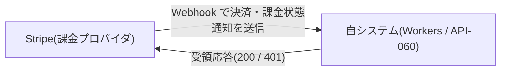

# EIF-002: 課金プロバイダ(Stripe)連携

> **本設計は「課金プロバイダ(Stripe)からの決済・課金状態通知の Webhook 受信連携」の外部インターフェースを定義します。**

*種別 外部インターフェース設計 ・ ステータス ドラフト*

## 項目

本連携の識別子と、支える業務ユースケース・関連する基本設計 ID を示す。全層の厳密な紐付けはトレーサビリティ一覧で一元管理し、本文には記載しない。

| 項目 | 値 |
|----|----|
| EIF ID | EIF-002 |
| 業務ユースケースID | [UC-056](../../01_requirements/04_business_usecases/UC-056.md#UC-056) |
| 関連 API | [API-060](../../02_basic_design/02_backend/03_apis/API-060.md#API-060) |
| 関連 SYS | [SYS-004](../../02_basic_design/02_backend/01_system/SYS-004.md#SYS-004) ・ [SYS-033](../../02_basic_design/02_backend/01_system/SYS-033.md#SYS-033) |
| 関連テーブル | [TBL-018](../../02_basic_design/02_backend/04_database/TBL-018.md#TBL-018) ・ [TBL-019](../../02_basic_design/02_backend/04_database/TBL-019.md#TBL-019) ・ [TBL-032](../../02_basic_design/02_backend/04_database/TBL-032.md#TBL-032) |
| 関連エラー | [ERR-031](../../02_basic_design/05_errors/ERR-031.md#ERR-031) ・ [ERR-032](../../02_basic_design/05_errors/ERR-032.md#ERR-032) |
| 関連メッセージ | [MSG-013](../../02_basic_design/06_messages/MSG-013.md#MSG-013) |

## 1. 目的

課金プロバイダ(Stripe)から届く決済・課金アカウント状態の通知を、なりすまし・重複を防ぎながら受信し、課金アカウント・サブスクリプション・請求書の状態へ取り込む連携を定義する。課金プロバイダ通知の受信・検証・取込・提示([UC-056](../../01_requirements/04_business_usecases/UC-056.md#UC-056))を、受信 API [API-060](../../02_basic_design/02_backend/03_apis/API-060.md#API-060) を介して支える。取込内部フローの内部コンポーネント連携・トランザクション境界は [DSQ-002](../08_sequences/DSQ-002.md#DSQ-002) を参照する。

## 2. 連携概要

連携先と連携の性質を一覧で示す。連携方向は外部(Stripe)からの能動的な Webhook 通知受信のみで、自システムから Stripe への同期的な送信呼び出しは本連携の対象外(サブスクリプション・支払方法の操作 API 呼び出しは別途 SCR/API 側で扱う)。値の正本は各リンク先を参照する。

| 連携先 | 連携方向 | プロトコル | 連携タイミング | 認証方式 | セキュリティ要件 |
|----|----|----|----|----|----|
| Stripe(課金プロバイダ) | 受信(Stripe → 自システム) | HTTPS / Webhook(POST) | 決済発生時・課金状態変更時([API-060](../../02_basic_design/02_backend/03_apis/API-060.md#API-060) `POST /webhooks/billing`) | 受信=署名検証(HMAC-SHA256・`Stripe-Signature` ヘッダ) | TLS 必須・署名検証・冪等キーによる重複排除 |

## 3. 連携図

Stripe と自システム(Workers)間のデータの流れを示す。

## 4. 送信項目

本連携は Stripe から自システムへの受信専用であり、自システムから Stripe への送信は行わない(§2)。受領応答として返す項目のみを示す。

| 項目名 | データ型 | 必須 | 説明 | 備考 |
|----|----|----|----|----|
| HTTP ステータス | number | ◯ | 受領結果を示す応答コード | 取込完了・冪等リプレイ・後続再処理いずれも 200(受領扱い)、署名検証失敗は 401([API-060](../../02_basic_design/02_backend/03_apis/API-060.md#API-060) エラー) |

## 5. 受信項目

Stripe から受信する通知の項目を定義する。取りうるイベント種別は [API-060 §列挙値](../../02_basic_design/02_backend/03_apis/API-060.md#API-060) が正本であり全集合を再掲する。

| 項目名 | データ型 | 必須 | 説明 | 備考 |
|----|----|----|----|----|
| `Stripe-Signature` | string(ヘッダ) | ◯ | 送信元署名(HMAC-SHA256) | 署名シークレットは環境変数で注入(秘匿) |
| `type` | enum | ◯ | 通知イベント種別。取りうる値は `payment.succeeded` / `payment.failed` / `subscription.created` / `subscription.updated` / `subscription.deleted` / `invoice.created` / `invoice.paid` / `invoice.payment_failed` / `invoice.voided` / `charge.refunded` | 各値の反映対象・意味は [API-060 §列挙値](../../02_basic_design/02_backend/03_apis/API-060.md#API-060) を参照。列挙値に無い `type` は状態反映なしで冪等に応答する |
| `data.event_id` | string | ◯ | プロバイダ側イベント ID(冪等キーの一部) | [`T_BILLING_WEBHOOK_LOG.event_id`](../../02_basic_design/02_backend/04_database/TBL-032.md#TBL-032)。冪等キーは `(provider, event_id)` |
| `data.billing_account_ref` | string | ◯ | 対象課金アカウントの参照キー | [`M_BILLING_ACCOUNT.stripe_customer_id`](../../02_basic_design/02_backend/04_database/TBL-002.md#TBL-002) への解決キー。解決不能時は反映失敗として扱う([DSQ-002](../08_sequences/DSQ-002.md#DSQ-002) §5 No.3) |
| `data.timestamp` | string(ISO 8601) | ◯ | イベント発生時刻 | — |

### 5.1 データマッピング

通知種別(`type`)ごとの反映先テーブル・反映内容の対応を示す。取込ロジックの内部連携は [DSQ-002](../08_sequences/DSQ-002.md#DSQ-002) を参照する。

| `type` | 反映先テーブル | 反映内容 |
|----|----|----|
| `payment.succeeded` | [TBL-019](../../02_basic_design/02_backend/04_database/TBL-019.md#TBL-019)(請求書)・[TBL-002](../../02_basic_design/02_backend/04_database/TBL-002.md#TBL-002)(課金アカウント) | 猶予中であれば課金アカウントを `active` へ復帰し、対象請求書を `paid` にする |
| `payment.failed` | [TBL-019](../../02_basic_design/02_backend/04_database/TBL-019.md#TBL-019)(請求書) | 対象請求書を `past_due` にする。決済失敗の猶予の起算は [課金・請求設計 §5.1](../../02_basic_design/05_billing-design.md#51-決済失敗からサスペンションへ) を参照 |
| `subscription.created` | [TBL-018](../../02_basic_design/02_backend/04_database/TBL-018.md#TBL-018)(課金サブスクリプション) | サブスクを `incomplete` で新規登録する([状態モデル §7.1](../../02_basic_design/08_state-model.md#71-課金サブスクリプション状態)) |
| `subscription.updated` | [TBL-018](../../02_basic_design/02_backend/04_database/TBL-018.md#TBL-018)(課金サブスクリプション) | `status` を通知内容に応じて `active` / `past_due` / `unpaid` / `incomplete` へ更新する |
| `subscription.deleted` | [TBL-018](../../02_basic_design/02_backend/04_database/TBL-018.md#TBL-018)(課金サブスクリプション) | `status` を `canceled` にする |
| `invoice.created` | [TBL-019](../../02_basic_design/02_backend/04_database/TBL-019.md#TBL-019)(請求書) | 請求書を `issued` で新規登録する |
| `invoice.paid` | [TBL-019](../../02_basic_design/02_backend/04_database/TBL-019.md#TBL-019)(請求書) | 請求書を `paid` にする |
| `invoice.payment_failed` | [TBL-019](../../02_basic_design/02_backend/04_database/TBL-019.md#TBL-019)(請求書) | 請求書を `past_due` にし、決済失敗の猶予判定へ連動する |
| `invoice.voided` | [TBL-019](../../02_basic_design/02_backend/04_database/TBL-019.md#TBL-019)(請求書) | 請求書を `void` にする |
| `charge.refunded` | [TBL-019](../../02_basic_design/02_backend/04_database/TBL-019.md#TBL-019)(請求書) | 対象請求書を `refunded` にし `refunded_at` を記録する([状態モデル §7.2](../../02_basic_design/08_state-model.md#72-請求書状態)) |

反映先エンティティの状態遷移そのもの(遷移契機・ガード条件)は各テーブルの「コード値・区分値」および[状態モデル §2](../../02_basic_design/08_state-model.md#2-課金アカウント状態)・[状態モデル §7](../../02_basic_design/08_state-model.md#7-課金サブスク請求状態)を正本とし、本節では重複定義しない。受信ログ自体の取込状態遷移は [STS-010](../01_state_transitions/STS-010.md#STS-010) を参照する。

## 6. 例外処理

署名検証失敗・重複再送・取込失敗の発生条件と自システムの処理を定義する。内部コンポーネント連携・トランザクション境界は [DSQ-002](../08_sequences/DSQ-002.md#DSQ-002) を参照する。

| 発生条件 | 自システムの処理 | リトライ | 通知 | 備考 |
|----|----|----|----|----|
| 署名検証失敗(`Stripe-Signature` の HMAC-SHA256 検証不通過) | 取り込まず 401 を返す。受信ログへ `signature_valid = 0` で記録し `status` 遷移対象外とする | 不可(自システムからは再送要求しない。Stripe 側の再送方針に委ねる) | 不正受信として記録([TBL-032](../../02_basic_design/02_backend/04_database/TBL-032.md#TBL-032)) | 失敗時 [ERR-031](../../02_basic_design/05_errors/ERR-031.md#ERR-031)(401) |
| 重複再送(同一冪等キー `(provider, event_id)` の受信ログが既存) | 冪等に受領応答(200)を返す。課金アカウント・サブスクリプション・請求書への反映は行わず `status = 'skipped'` で記録のみ残す | 不要 | — | [ERR-032](../../02_basic_design/05_errors/ERR-032.md#ERR-032)(200・エラーではなく正常応答)。冪等キーの照合有効期間は受信ログの保持期間([システム仕様書 §4](../../02_basic_design/07_system-spec.md#4-データ保持期間削除猶予) `課金通知の受信履歴保持`)に準拠 |
| 反映失敗(課金アカウント・サブスクリプション・請求書への更新が例外・対象不在等で完了しない) | 受信ログを `status = 'failed'` で確定し反映先への部分更新をロールバックする。200 を返し受領扱いとする | 自システム側で定期スケジュールにより再処理([SYS-033](../../02_basic_design/02_backend/01_system/SYS-033.md#SYS-033)・[BAT-012](../05_batch/BAT-012.md#BAT-012)) | 再処理が上限回数に達した分は運用者へエスカレーション通知([MSG-013](../../02_basic_design/06_messages/MSG-013.md#MSG-013)) | 上限回数(5 回)・再処理周期(15 分)は [システム仕様書 §7](../../02_basic_design/07_system-spec.md#7-バッチ運用設計値)。同期フロー内では再試行しない([DSQ-002](../08_sequences/DSQ-002.md#DSQ-002) §5 No.3) |
| ペイロード形式不正(署名検証以前に構造が解釈不能) | 受信ログを残さず処理エラーとして打ち切る | 不可 | — | [DSQ-002](../08_sequences/DSQ-002.md#DSQ-002) §4 No.1 |
| 受信ログ更新自体の失敗(取込完了 / 失敗確定の書込が致命的に失敗) | トランザクション全体をロールバックし、受信ログ・反映先とも未確定のまま終える | Stripe 側の再送に委ねる(自システムからは能動的に再送要求しない) | — | [DSQ-002](../08_sequences/DSQ-002.md#DSQ-002) §5 No.4 |

## 7. 後続工程への引き継ぎ事項

実装・テスト設計へ引き継ぐ観点を示す。基本設計に定義の無い業務仕様は本文へ確定値を書かず、課題として分離する。

- **署名検証の検証データ**: 正当な署名・改ざんされた署名・期限切れ署名の 3 パターンをテストデータとして用意し、[ERR-031](../../02_basic_design/05_errors/ERR-031.md#ERR-031) への写像を検証する。署名シークレットの環境変数注入方式は実装確定。
- **冪等キーの生成規則**: 冪等キー `(provider, event_id)` は Stripe が採番する `event_id` をそのまま用い、自システム側では生成しない。一意制約違反([TBL-032](../../02_basic_design/02_backend/04_database/TBL-032.md#TBL-032) `uq_billing_wh_event`)を契機とした重複判定とみなし応答([DSQ-002](../08_sequences/DSQ-002.md#DSQ-002) §4 No.3)をテストケース化する。
- **データマッピングの拡張性**: `type` の列挙値に無い通知が Stripe から送信された場合、受信ログへ記録のうえ状態反映なしで冪等に応答する([API-060 §列挙値](../../02_basic_design/02_backend/03_apis/API-060.md#API-060))。新規イベント種別を追加する際は本ページ §5.1 と [API-060](../../02_basic_design/02_backend/03_apis/API-060.md#API-060) の列挙値を両方更新する。
- **順序逆転・遅延到達時の整合性**: 同一課金アカウントに対する複数通知が到着順序と発生順序で入れ替わるケース(例 `invoice.payment_failed` の後に古い `invoice.paid` が遅延到達)の整合性確保方針は詳細ロジック設計で確定する([DSQ-002](../08_sequences/DSQ-002.md#DSQ-002) §6 引き継ぎ)。
