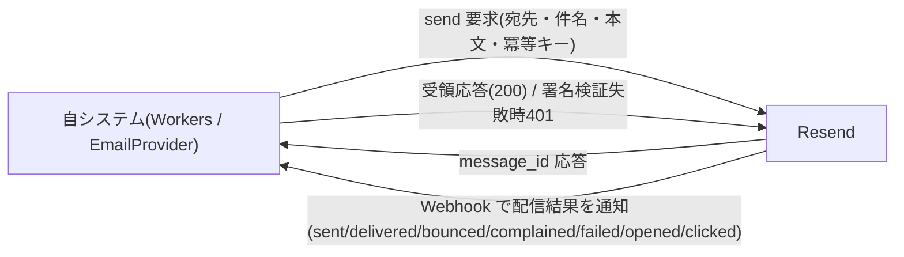

# EIF-003: メール配信(Resend)連携

> **本設計は「メール配信事業者(Resend)へのメール送信と、配信状態 Webhook の受信」の外部インターフェースを定義します。** MVP は `ResendEmailProvider` として実装します。

*種別 外部インターフェース設計 ・ ステータス ドラフト*

## 項目

本連携の識別子と、支える業務ユースケース・関連する基本設計 ID を示す。全層の厳密な紐付けはトレーサビリティ一覧で一元管理し、本文には記載しない。

| 項目 | 値 |
|----|----|
| EIF ID | EIF-003 |
| 業務ユースケースID | [UC-058](../../01_requirements/04_business_usecases/UC-058.md#UC-058) ・ [UC-062](../../01_requirements/04_business_usecases/UC-062.md#UC-062) ・ [UC-065](../../01_requirements/04_business_usecases/UC-065.md#UC-065) |
| 関連 API | [API-058](../../02_basic_design/02_backend/03_apis/API-058.md#API-058) ・ [API-059](../../02_basic_design/02_backend/03_apis/API-059.md#API-059) |
| 関連 SYS | [SYS-021](../../02_basic_design/02_backend/01_system/SYS-021.md#SYS-021) ・ [SYS-025](../../02_basic_design/02_backend/01_system/SYS-025.md#SYS-025) ・ [SYS-007](../../02_basic_design/02_backend/01_system/SYS-007.md#SYS-007) |
| 関連テーブル | [TBL-026](../../02_basic_design/02_backend/04_database/TBL-026.md#TBL-026) ・ [TBL-007](../../02_basic_design/02_backend/04_database/TBL-007.md#TBL-007) |
| 関連エラー | [ERR-031](../../02_basic_design/05_errors/ERR-031.md#ERR-031) ・ [ERR-032](../../02_basic_design/05_errors/ERR-032.md#ERR-032) |
| 関連メッセージ | [MSG-001](../../02_basic_design/06_messages/MSG-001.md#MSG-001)〜[MSG-013](../../02_basic_design/06_messages/MSG-013.md#MSG-013)(全メールテンプレート共通) |

## 1. 目的

メインシステムが発行する全メールテンプレート([メッセージ設計](../../02_basic_design/06_messages/index.md) 13 件)を外部メール配信事業者(Resend)へ送信し、送信後の配信結果(到達・不達・苦情・遅延)を Webhook で受信して通知ログの配信状態へ反映する連携を定義する。メール配信状態 Webhook 処理([UC-058](../../01_requirements/04_business_usecases/UC-058.md#UC-058))・配信失敗通知の再送([UC-062](../../01_requirements/04_business_usecases/UC-062.md#UC-062))・送信品質監視による送信抑制([UC-065](../../01_requirements/04_business_usecases/UC-065.md#UC-065))の 3 業務を、内部抽象インターフェース [`EmailProvider`](../../02_basic_design/02_backend/03_apis/API-058.md#API-058) を介して支える。

## 2. 連携概要

連携先と連携の性質を一覧で示す。送信は自システムから Resend への同期呼び出し、配信結果は Resend から自システムへの Webhook 通知(能動)であり、双方向の連携となる。値の正本は各リンク先を参照する。

| 連携先 | 連携方向 | プロトコル | 連携タイミング | 認証方式 | セキュリティ要件 |
|----|----|----|----|----|----|
| Resend(メール配信事業者) | 双方向 | HTTPS(送信 API 呼び出し)/ Webhook(POST・受信) | 送信=メールテンプレート発行契機([メッセージ設計](../../02_basic_design/06_messages/index.md) 各 `NOTIF-*`)発生時・配信失敗通知の再送バッチ実行時 / 受信=Resend 側で配信結果が確定した都度 | 送信=送信元 API キー(秘匿) / 受信=署名検証(HMAC-SHA256・`Svix-Signature` ヘッダ) | TLS 必須・Webhook 署名検証・冪等キーによる重複送信排除・重複受信の冪等応答 |

## 3. 連携図

自システム(Workers)と Resend の間のデータの流れを示す。送信経路と Webhook 受信経路を対で描く。

## 4. 送信項目

自システム(`EmailProvider.send`)から Resend へ渡す送信項目を定義する。型・全集合は [API-058 インターフェース定義](../../02_basic_design/02_backend/03_apis/API-058.md#API-058) を正本とする。秘密情報・本文実文は書かない。

| 項目名 | データ型 | 必須 | 説明 | 備考 |
|----|----|----|----|----|
| `to` | string | ◯ | 宛先メールアドレス | 配信先解決ロジックは [メッセージ設計 §3.1](../../02_basic_design/06_messages/index.md#31-配信先解決ロジック) |
| `from` | string | ◯ | 送信元アドレス表記 | 固定値は [メッセージ設計 §2.1](../../02_basic_design/06_messages/index.md#21-送信元--reply-to--差出人表記) |
| `reply_to` | string | 任意 | 返信先アドレス | テンプレートにより有無が分岐([メッセージ設計 §2.1](../../02_basic_design/06_messages/index.md#21-送信元--reply-to--差出人表記)) |
| `subject` | string | ◯ | 件名 | 件名規則は [メッセージ設計 §2.2](../../02_basic_design/06_messages/index.md#22-件名規則) |
| `html` | string | ◯ | HTML 本文 | サニタイズ規則は [メッセージ設計 §2.5](../../02_basic_design/06_messages/index.md#25-サニタイズ) |
| `text` | string | 任意 | テキスト本文 | HTML と対で送信するテンプレートのみ |
| `headers` | object | 任意 | 追加ヘッダ(`List-Unsubscribe` 等) | `low` 重要度のみ付与([メッセージ設計 §3.2](../../02_basic_design/06_messages/index.md#32-重要度別の強制送信ルール共有概念正本)) |
| `idempotency_key` | string | ◯ | 重複送信を排除する冪等キー | 保持期間は [システム仕様書 §4 `冪等性キー保持`](../../02_basic_design/07_system-spec.md#4-データ保持期間削除猶予)。重複配信抑止の生成規則は [メッセージ設計 §3.3](../../02_basic_design/06_messages/index.md#33-重複配信抑止) |

## 5. 受信項目

Resend から Webhook で受信する配信結果を定義する。取りうるイベント種別は全集合を列挙する。型の正本は [API-058 インターフェース定義](../../02_basic_design/02_backend/03_apis/API-058.md#API-058)(`verifyWebhook` 戻り値)・[API-059 リクエスト定義](../../02_basic_design/02_backend/03_apis/API-059.md#API-059)。

| 項目名 | データ型 | 必須 | 説明 | 備考 |
|----|----|----|----|----|
| `event_type` | enum | ◯ | 配信イベント種別。取りうる値は `sent` / `delivered` / `bounced` / `complained` / `failed` / `opened` / `clicked` | Webhook 受信ボディの `type` は `email.delivered` / `email.bounced` / `email.complained` / `email.delivery_delayed` の 4 種を送る([API-059](../../02_basic_design/02_backend/03_apis/API-059.md#API-059) Request Body) |
| `message_id` | string | ◯ | 対象メールのメッセージ ID | 送信時応答の `message_id` と紐付け([TBL-026](../../02_basic_design/02_backend/04_database/TBL-026.md#TBL-026) `idx_nlog_message_id`) |
| `to` | string | ◯ | 宛先メールアドレス | — |
| `subject` | string | ◯ | メール件名 | — |
| `timestamp` | string (ISO 8601) | ◯ | イベント発生時刻 | 記録済みの状態より古い場合は上書きしない([STS-009](../01_state_transitions/STS-009.md#STS-009)) |

## 6. 例外処理

Webhook 受信時の署名検証失敗・重複再送、送信時のタイムアウト・レート制限の発生条件と自システムの処理を定義する。配信状態の遷移確定は [STS-009](../01_state_transitions/STS-009.md#STS-009) を正本とし、本書では重複定義しない。

| 発生条件 | 自システムの処理 | リトライ | 通知 | 備考 |
|----|----|----|----|----|
| Webhook 署名検証失敗(`Svix-Signature` 不正) | 通知ログ・送信停止リストを変更せず 401 を返す | 不可(Resend 側の再送設定に依存) | 不正受信として [ERR-031](../../02_basic_design/05_errors/ERR-031.md#ERR-031) | 検証方式は HMAC-SHA256([API-059](../../02_basic_design/02_backend/03_apis/API-059.md#API-059) P-01) |
| Webhook 重複受信(同一イベント) | 通知ログ・送信停止リストを変更せず既存処理結果を 200 で返す | 不要 | [ERR-032](../../02_basic_design/05_errors/ERR-032.md#ERR-032)(冪等リプレイ・エラーではない) | 冪等判定は [SYS-021](../../02_basic_design/02_backend/01_system/SYS-021.md#SYS-021) `PR-03` |
| Webhook 順序逆転・遅延到達(イベント発生時刻が記録済み状態より古い) | 配信状態を上書きしない | 不要 | — | [API-059](../../02_basic_design/02_backend/03_apis/API-059.md#API-059) P-03・[STS-009](../01_state_transitions/STS-009.md#STS-009) |
| 送信 API 呼び出しタイムアウト・プロバイダ障害 | 当該送信を失敗として打ち切り、通知ログの配信状態を `failed` として記録する | 再送は当該リクエスト内では行わず、定期再送バッチ([BAT-008](../05_batch/BAT-008.md#BAT-008))の対象とする | 標準エラー体系([エラー設計](../../02_basic_design/05_errors/index.md))に従う | 再送回数上限・バックオフは [システム仕様書 §3](../../02_basic_design/07_system-spec.md#3-タイムアウトセッション認証) の通知再送回数上限・通知再送バックオフ |
| 送信停止リスト該当宛先への送信要求 | 送信を行わず抑制対象として扱う | 対象外 | — | 送信停止リスト([TBL-007](../../02_basic_design/02_backend/04_database/TBL-007.md#TBL-007))登録契機は本連携の受信(バウンス・苦情)、判定・抑制実行は上位([SYS-025](../../02_basic_design/02_backend/01_system/SYS-025.md#SYS-025) `PR-03`) |
| プロジェクト単位の送信品質悪化(送信レート・バウンス率・苦情率が許容水準超過) | 当該プロジェクト宛の送信を抑制状態にする | 対象外 | 関係者へ [MSG-013](../../02_basic_design/06_messages/MSG-013.md#MSG-013) で通知 | 評価・抑制実行は [SYS-007](../../02_basic_design/02_backend/01_system/SYS-007.md#SYS-007) が担う。本連携は評価の入力(配信結果)を供給する側 |

## 7. 後続工程への引き継ぎ事項

実装・テスト設計へ引き継ぐ観点(署名検証の検証データ、冪等キーの生成規則、リトライ上限到達時の扱い等)を示す。詳細設計で確定できない事項は課題として分離する。

- **接続確認**: `EmailProvider` 実装(`ResendEmailProvider`)の送信元 API キー注入(環境変数経由)・Webhook 受信エンドポイント([API-059](../../02_basic_design/02_backend/03_apis/API-059.md#API-059) `/webhooks/resend`)の署名シークレット注入。
- **署名検証テスト**: 正当な署名・改ざんされた署名・欠落ヘッダの 3 パターンで [ERR-031](../../02_basic_design/05_errors/ERR-031.md#ERR-031)(401)への写像を検証する。
- **冪等性テスト**: 送信側は `idempotency_key` の再送で二重送信が発生しないこと、受信側は同一イベントの重複受信で通知ログ・送信停止リストが変化せず [ERR-032](../../02_basic_design/05_errors/ERR-032.md#ERR-032) を返すことを検証する。
- **順序逆転・遅延到達テスト**: イベント発生時刻が記録済みの状態より古い Webhook を受信した場合に配信状態を上書きしないことを検証する([STS-009](../01_state_transitions/STS-009.md#STS-009))。
- **再送上限到達時の扱い**: 再送回数が [システム仕様書 §3](../../02_basic_design/07_system-spec.md#3-タイムアウトセッション認証) の通知再送回数上限に到達した場合、または宛先が送信停止リスト該当の場合は再送せず確定失敗として記録する。実行機構(起動・排他・監視)は [BAT-008](../05_batch/BAT-008.md#BAT-008) に委ねる。
- **配信状態遷移の確定**: 通知ログ(`H_NOTIF_LOGS.delivery_state`)の遷移契機・ガード条件・実行可能ロールは本書で重複定義せず [STS-009](../01_state_transitions/STS-009.md#STS-009) を正本とする。
- **送信品質監視との連携範囲**: 本連携(Webhook 受信)は [SYS-007](../../02_basic_design/02_backend/01_system/SYS-007.md#SYS-007) の指標集計に配信結果を供給するのみで、許容水準照合・送信抑制の判定ロジック自体は本書の対象外(SYS-007 側で確定)。
