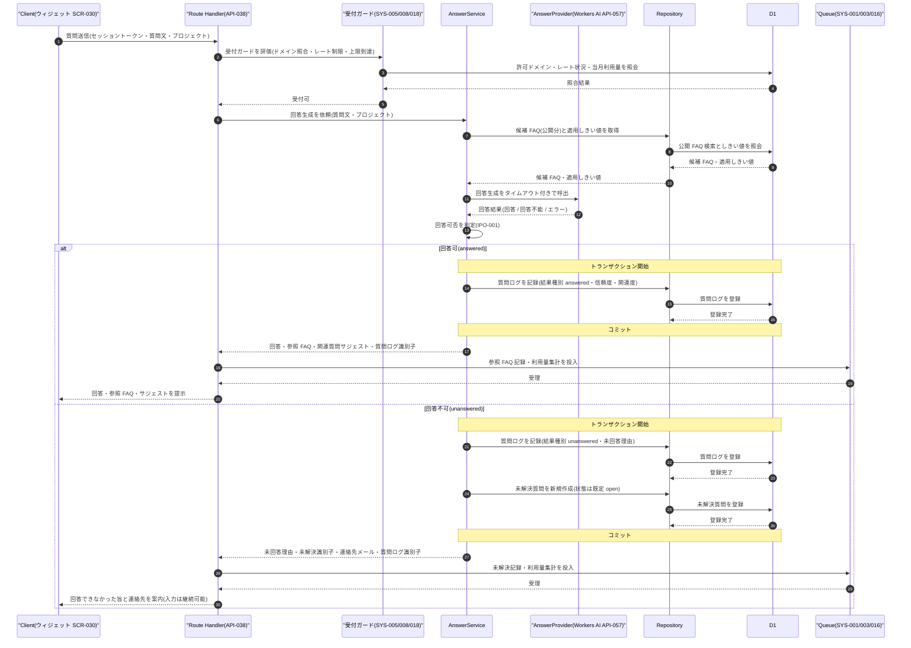

# DSQ-001: ウィジェット質問→AI回答→未解決登録 詳細シーケンス

> **この詳細シーケンスは「ウィジェットからの質問受付・受付ガード通過・AI 回答生成・回答/未解決の確定と質問ログ記録、および非同期後処理投入までの内部コンポーネント連携とトランザクション境界」を定義します。**

*種別 詳細シーケンス図 ・ ステータス ドラフト*

## 1. 目的

本フローは、ウィジェット利用者の 1 回の質問送信に対し、受付ガード(ドメイン照合・レート制限・上限到達)・AI 推論呼出・回答可否判定・質問ログ記録・未解決質問の同一トランザクション生成・非同期後処理投入という複数コンポーネントの連携と分岐を伴うため、内部連携順・トランザクション境界・異常分岐を実装粒度で確定する。詳細化元は基本設計の参照 FAQ 記録([SEQ-105](../../02_basic_design/03_sequences/SEQ-105.md#SEQ-105))であり、その「サーバー・DB」抽象を Route Handler / Service / Repository / D1 / Workers AI / Queue の連携へ写像する。回答可否の判定ロジックは [IPO-001](../04_ipo/IPO-001.md#IPO-001)、入出力契約は [IO-001](../03_io_specs/IO-001.md#IO-001)、未解決質問の状態確定は [STS-001](../01_state_transitions/STS-001.md#STS-001) を参照する。

## 2. 前提条件

本フローの利用者・開始条件・前提状態と、対象画面 / API / DB・外部 IF・参照する詳細設計を示す。受付ガードは起動済セッションを前提に同期で作用する。

| 項目 | 値 |
|----|----|
| 利用者 | ウィジェット利用者(設置サイト訪問者・ウィジェットセッション認証) |
| 開始条件 | 起動済ウィジェット([SCR-030](../../02_basic_design/01_frontend/01_screens/SCR-030.md#SCR-030) EVT-04)で質問を送信したとき |
| 前提状態 | ウィジェットセッショントークンが有効・対象プロジェクトが読み込み元ドメインの許可範囲内([SYS-005](../../02_basic_design/02_backend/01_system/SYS-005.md#SYS-005))・課金アカウントが `active`(意味は [状態モデル](../../02_basic_design/08_state-model.md) を参照) |
| 対象画面 | [SCR-030](../../02_basic_design/01_frontend/01_screens/SCR-030.md#SCR-030)(EVT-04 質問送信 / EVT-07 処理エラー表示) |
| 対象 API | [API-038](../../02_basic_design/02_backend/03_apis/API-038.md#API-038)(`POST /widget/v1/ask`)・[API-057](../../02_basic_design/02_backend/03_apis/API-057.md#API-057)(AI 推論 IF `AnswerProvider`) |
| 対象 DB | [TBL-025](../../02_basic_design/02_backend/04_database/TBL-025.md#TBL-025)(質問ログ)・[TBL-017](../../02_basic_design/02_backend/04_database/TBL-017.md#TBL-017)(未解決質問)・[TBL-016](../../02_basic_design/02_backend/04_database/TBL-016.md#TBL-016)(参照 FAQ M:N)・[TBL-006](../../02_basic_design/02_backend/04_database/TBL-006.md#TBL-006)(FAQ)・[TBL-020](../../02_basic_design/02_backend/04_database/TBL-020.md#TBL-020)(利用量計測) |
| 詳細化元 SEQ | [SEQ-105](../../02_basic_design/03_sequences/SEQ-105.md#SEQ-105)(参照 FAQ 記録・提示 [UC-048](../../01_requirements/04_business_usecases/UC-048.md#UC-048)) |
| 受付ガード SYS | [SYS-005](../../02_basic_design/02_backend/01_system/SYS-005.md#SYS-005)(ドメイン照合)・[SYS-008](../../02_basic_design/02_backend/01_system/SYS-008.md#SYS-008)(オーナー単位レート制限)・[SYS-018](../../02_basic_design/02_backend/01_system/SYS-018.md#SYS-018)(上限到達受付停止・同期) |
| 非同期後処理 SYS | [SYS-001](../../02_basic_design/02_backend/01_system/SYS-001.md#SYS-001)(参照 FAQ 記録・提示)・[SYS-003](../../02_basic_design/02_backend/01_system/SYS-003.md#SYS-003)(未解決質問の記録)・[SYS-016](../../02_basic_design/02_backend/01_system/SYS-016.md#SYS-016)(利用量集計) |
| 外部 IF | Cloudflare Workers AI(仕様は [EIF-001](../06_external_if/EIF-001.md#EIF-001) を参照) |
| 参照 IPO | [IPO-001](../04_ipo/IPO-001.md#IPO-001)(AI 回答可否判定) |
| 参照 IO / STS / BAT | [IO-001](../03_io_specs/IO-001.md#IO-001) ・ [STS-001](../01_state_transitions/STS-001.md#STS-001) ・ [BAT-001](../05_batch/BAT-001.md#BAT-001) |

## 3. 正常系シーケンス

質問送信から受付ガード通過・AI 推論・回答可否判定・質問ログ記録・非同期後処理投入までの内部コンポーネント連携を、回答時と未回答時のトランザクション境界とともに示す。未回答時は質問ログと未解決質問を同一トランザクションで生成する([API-038](../../02_basic_design/02_backend/03_apis/API-038.md#API-038) P-05)。非同期後処理(参照 FAQ 記録・未解決記録・利用量集計)はコミット後に Queue へ投入する。

## 4. 処理詳細

図の各ステップの実行主体・入出力・分岐条件・エラー時挙動を実装可能な粒度で示す。判定条件・トランザクション境界の方針は記すが、SQL 本文・物理カラム名・写像アルゴリズムは書かない(判定ロジックは [IPO-001](../04_ipo/IPO-001.md#IPO-001)、物理定義は [DBP-001](../07_db_physical/DBP-001.md#DBP-001)、AI 連携は [EIF-001](../06_external_if/EIF-001.md#EIF-001) を参照)。

| No | 実行主体 | 処理内容 | 入力 | 出力 | 分岐・条件 | エラー時 |
|----|----|----|----|----|----|----|
| 1 | Route Handler | 質問送信を受け付けセッショントークンとオリジンを検証する([API-038](../../02_basic_design/02_backend/03_apis/API-038.md#API-038) P-01) | セッショントークン・質問文・プロジェクト | 検証済リクエスト | 質問文は 1〜1000 文字([IO-001](../03_io_specs/IO-001.md#IO-001)) | セッション無効・入力不正は受付ガード前に検証エラーを返す |
| 2 | 受付ガード | ドメイン照合・レート制限・上限到達を同期で評価する([SYS-005](../../02_basic_design/02_backend/01_system/SYS-005.md#SYS-005) / [SYS-008](../../02_basic_design/02_backend/01_system/SYS-008.md#SYS-008) / [SYS-018](../../02_basic_design/02_backend/01_system/SYS-018.md#SYS-018)) | 検証済リクエスト・許可ドメイン・レート状況・当月利用量 | 受付可否 | ドメイン外は §5 No.2 / レート超過は §5 No.1 / 上限到達は §5 No.3 へ分岐 | ガード判定不能時は後段へ渡さず処理エラーとして扱う |
| 3 | AnswerService | 候補 FAQ(公開分)と適用しきい値を取得する | プロジェクト・質問文 | 候補 FAQ・適用しきい値 | 候補 FAQ が公開状態のみ対象([TBL-006](../../02_basic_design/02_backend/04_database/TBL-006.md#TBL-006))。しきい値は正本([システム仕様書 §1](../../02_basic_design/07_system-spec.md#1-aiしきい値)) | しきい値取得不能時はグローバル既定で継続([IPO-001](../04_ipo/IPO-001.md#IPO-001) No.1) |
| 4 | AnswerService → AnswerProvider | AI 推論をタイムアウト付きで呼出し回答を生成する([API-057](../../02_basic_design/02_backend/03_apis/API-057.md#API-057) `generate`) | 質問文・候補 FAQ・適用しきい値 | 回答結果(回答 / 回答不能 / エラー) | タイムアウト超過([システム仕様書 §3](../../02_basic_design/07_system-spec.md#3-タイムアウトセッション認証))・プロバイダエラーは §5 No.4 へ分岐 | 呼出例外は処理エラーとして確定([IPO-001](../04_ipo/IPO-001.md#IPO-001) No.5) |
| 5 | AnswerService | 回答可否を判定する([IPO-001](../04_ipo/IPO-001.md#IPO-001)) | 回答結果・適用しきい値 | 回答可否と未回答理由 | 信頼度・関連度がしきい値以上なら回答可、いずれか未満または回答不能なら未回答、エラーなら処理エラー | スコア欠損時は未回答(信頼度不足)として未解決へ回す |
| 6 | AnswerService | 回答可時、質問ログを記録する(結果種別 `answered`) | 回答本文・信頼度・関連度・参照 FAQ | 質問ログ識別子 | トランザクション境界内で登録し即コミット | 書込失敗はロールバックし §5 No.5 の処理エラーへ |
| 7 | AnswerService | 回答不可時、質問ログと未解決質問を同一トランザクションで作成する([API-038](../../02_basic_design/02_backend/03_apis/API-038.md#API-038) P-05) | 質問文・未回答理由・プロジェクト | 質問ログ識別子・未解決識別子 | 対象理由は `no_faq_match` / `low_confidence` / `pii_detected` / `contradiction`。未解決は状態 `open` で作成([STS-001](../01_state_transitions/STS-001.md#STS-001)) | いずれかの書込失敗で同一トランザクションをロールバックし §5 No.5 へ(未解決を残さない) |
| 8 | Route Handler → Queue | コミット後に非同期後処理を投入する | 質問ログ識別子・回答可否 | 投入受理 | 回答可時は参照 FAQ 記録([SYS-001](../../02_basic_design/02_backend/01_system/SYS-001.md#SYS-001))・利用量集計([SYS-016](../../02_basic_design/02_backend/01_system/SYS-016.md#SYS-016))、回答不可時は未解決記録([SYS-003](../../02_basic_design/02_backend/01_system/SYS-003.md#SYS-003))・利用量集計。集計・消費は [BAT-001](../05_batch/BAT-001.md#BAT-001) | 投入失敗時の再試行方針は [BAT-001](../05_batch/BAT-001.md#BAT-001) が担う(同期応答は返却済) |
| 9 | Route Handler | 応答を返却する([API-038](../../02_basic_design/02_backend/03_apis/API-038.md#API-038) P-06) | 回答可否・回答/未回答理由・連絡先メール | ウィジェット応答([IO-001](../03_io_specs/IO-001.md#IO-001)) | 回答可時は回答・参照 FAQ・サジェスト、回答不可時は未回答理由・連絡先メール(未設定時は連絡先を `null`) | — |

## 5. 異常系・例外系

異常・例外の発生箇所と後続処理を示す。エラー内容は ERR ID、表示メッセージは画面 [SCR-030](../../02_basic_design/01_frontend/01_screens/SCR-030.md#SCR-030) §8 の `EM-NN` で参照する(文面を書かない)。受付停止(上限到達)は 200 の graceful 応答であり 4xx/5xx ではない。

| No | 発生箇所 | 発生条件 | エラー内容(ERR ID) | 表示メッセージ(MSG ID) | 後続処理 |
|----|----|----|----|----|----|
| 1 | 受付ガード(No.2) | オーナー単位のレート制限を超過([SYS-008](../../02_basic_design/02_backend/01_system/SYS-008.md#SYS-008)) | [ERR-009](../../02_basic_design/05_errors/ERR-009.md#ERR-009)(429) | SCR-030 §8 `EM-03` | 後段へ渡さず 429 を返す。質問ログ・未解決質問は作成しない |
| 2 | 受付ガード(No.2) | 読み込み元が許可ドメイン外([SYS-005](../../02_basic_design/02_backend/01_system/SYS-005.md#SYS-005)) | [ERR-027](../../02_basic_design/05_errors/ERR-027.md#ERR-027)(403) | SCR-030 §8 `EM-03` | ウィジェットを動作させず 403 を返す。記録しない |
| 3 | 受付ガード(No.2) | 当月質問数が月次上限 100% に到達([SYS-018](../../02_basic_design/02_backend/01_system/SYS-018.md#SYS-018)) | —(受付停止・エラーではない) | SCR-030 §8 定型文(受付停止) | 200 の未回答応答(理由 `usage_limit_reached`)を返し送信を無効化する。AI 推論は呼び出さない |
| 4 | AI 推論呼出(No.4) | 所定時間([システム仕様書 §3](../../02_basic_design/07_system-spec.md#3-タイムアウトセッション認証))内に応答しない / プロバイダがエラーを返す | [ERR-036](../../02_basic_design/05_errors/ERR-036.md#ERR-036)(503) | SCR-030 §8 `EM-03` | 質問ログを結果種別 `error`・理由 `ai_unavailable` で記録する場合でも未解決質問は登録しない([FR-082](../../01_requirements/02_functional_requirement/02_faq-ai-fr.md#FR-082))。503 を返す |
| 5 | 質問ログ / 未解決質問記録(No.6・No.7) | トランザクション中の書込失敗(致命的エラー) | —(標準エラー体系外の 500・追跡用エラー識別子付き) | SCR-030 §8 `EM-03` | 同一トランザクションをロールバックし未解決質問を残さない。追跡可能なエラー識別子を生成しレスポンスに含める([FR-084](../../01_requirements/02_functional_requirement/02_faq-ai-fr.md#FR-084)) |

## 6. 後続工程への引き継ぎ事項

テスト設計・詳細ロジック設計([IPO-001](../04_ipo/IPO-001.md#IPO-001))・DB 物理設計([DBP-001](../07_db_physical/DBP-001.md#DBP-001))へ渡す観点を示す。

- 回答不可時の質問ログ + 未解決質問の同一トランザクション境界(部分コミットの排除・書込失敗時のロールバックで未解決質問が残らないこと)をテスト設計でケース化する([STS-001](../01_state_transitions/STS-001.md#STS-001))。
- AI 推論タイムアウト / プロバイダエラー時に処理エラーとして確定し未解決質問を登録しないこと([FR-082](../../01_requirements/02_functional_requirement/02_faq-ai-fr.md#FR-082))、質問ログを結果種別 `error` で記録する分岐を検証する。
- 受付ガード 3 種(ドメイン外 403 / レート超過 429 / 上限到達 200 graceful)の分岐と、上限到達時に AI 推論を呼び出さないことを網羅する。
- 冪等性は質問ログ識別子を基準に担保する前提での再送時挙動([API-038](../../02_basic_design/02_backend/03_apis/API-038.md#API-038)・[IO-001](../03_io_specs/IO-001.md#IO-001))。
- コミット後の非同期後処理投入(参照 FAQ 記録・未解決記録・利用量集計)の投入失敗・再試行と消費順序は [BAT-001](../05_batch/BAT-001.md#BAT-001) と結線して確定する。
- 致命的な書込失敗時の追跡用エラー識別子生成・レスポンス反映の実装方針を詳細ロジック設計へ委ねる。
