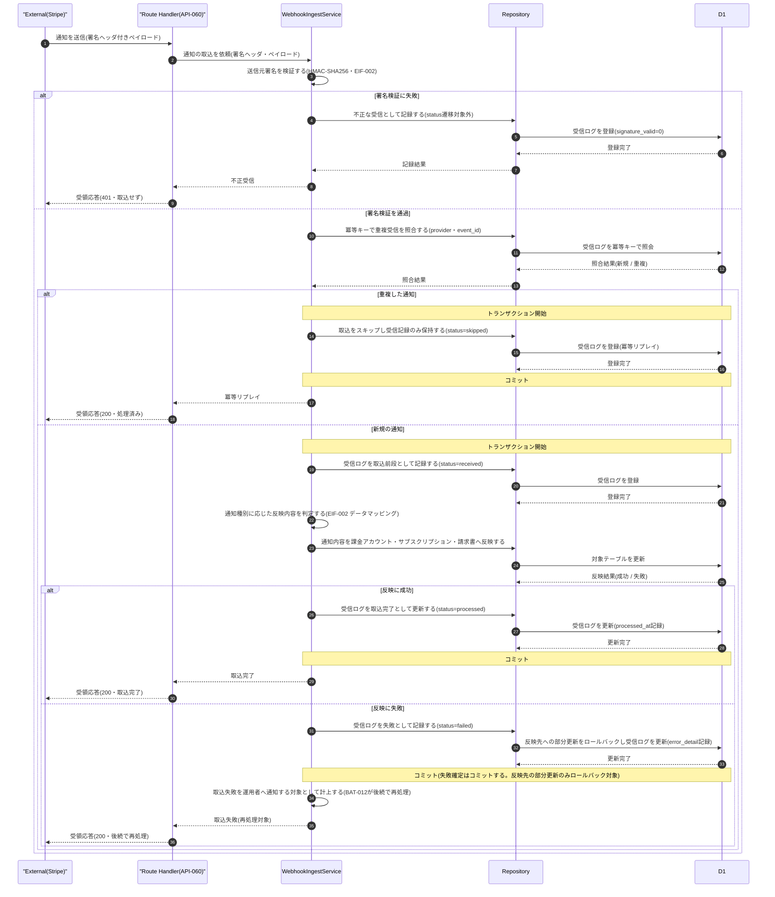

# DSQ-002: 課金プロバイダWebhook受信→検証→取込 詳細シーケンス

> **この詳細シーケンスは「課金プロバイダからの通知受信・署名検証・冪等キー照合による重複判定・受信ログ記録・課金アカウント/サブスクリプション/請求書へのトランザクション反映、および反映失敗時の再処理対象化までの内部コンポーネント連携とトランザクション境界」を定義します。**

*種別 詳細シーケンス図 ・ ステータス ドラフト*

## 1. 目的

本フローは、課金プロバイダ(Stripe)からの Webhook 通知受信に対し、署名検証・冪等キー照合による重複排除・受信ログ記録・課金アカウント関連テーブルへのトランザクション反映という複数コンポーネントの連携と分岐を伴うため、内部連携順・トランザクション境界・異常分岐を実装粒度で確定する。詳細化元は基本設計の課金プロバイダ通知の受信・検証・取込([SEQ-108](../../02_basic_design/03_sequences/SEQ-108.md#SEQ-108))であり、その「サーバー・DB」抽象を Route Handler / Service / Repository / D1 の連携へ写像する。外部連携仕様(署名検証方式・リトライ・データマッピング)は [EIF-002](../06_external_if/EIF-002.md#EIF-002)、受信ログの状態遷移は [STS-010](../01_state_transitions/STS-010.md#STS-010)、反映失敗分の再処理は [BAT-012](../05_batch/BAT-012.md#BAT-012) を参照する。

## 2. 前提条件

本フローの利用者・開始条件・前提状態と、対象画面 / API / DB・外部 IF・参照する詳細設計を示す。本フローは無人の外部システム起点処理であり、対象画面を持たない。

| 項目 | 値 |
|----|----|
| 利用者 | —(システム起点。契機は課金プロバイダからの HTTP 通知) |
| 開始条件 | 課金プロバイダ(Stripe)が決済・課金アカウント状態の通知を送信したとき |
| 前提状態 | 対象課金アカウントが存在する(通知が持つ決済プロバイダ顧客IDで [TBL-002](../../02_basic_design/02_backend/04_database/TBL-002.md#TBL-002) `stripe_customer_id`(`uq_billing_account_stripe_customer`)を逆引きし対応レコードがある)。存在しない対象は反映失敗として扱う |
| 対象画面 | —(無人処理) |
| 対象 API | [API-060](../../02_basic_design/02_backend/03_apis/API-060.md#API-060)(`POST /webhooks/billing`) |
| 対象 DB | [TBL-032](../../02_basic_design/02_backend/04_database/TBL-032.md#TBL-032)(課金Webhook受信ログ)・[TBL-002](../../02_basic_design/02_backend/04_database/TBL-002.md#TBL-002)(課金アカウント)・[TBL-018](../../02_basic_design/02_backend/04_database/TBL-018.md#TBL-018)(課金サブスクリプション)・[TBL-019](../../02_basic_design/02_backend/04_database/TBL-019.md#TBL-019)(請求書)・[TBL-027](../../02_basic_design/02_backend/04_database/TBL-027.md#TBL-027)(監査ログ) |
| 詳細化元 SEQ | [SEQ-108](../../02_basic_design/03_sequences/SEQ-108.md#SEQ-108)(課金プロバイダ通知の受信・検証・取込・提示 [UC-056](../../01_requirements/04_business_usecases/UC-056.md#UC-056)) |
| 対象 SYS | [SYS-004](../../02_basic_design/02_backend/01_system/SYS-004.md#SYS-004)(受信・検証・取込)・[SYS-033](../../02_basic_design/02_backend/01_system/SYS-033.md#SYS-033)(取込失敗の再処理・本フローの対象外。連携のみ) |
| 外部 IF | 課金プロバイダ(Stripe。仕様は [EIF-002](../06_external_if/EIF-002.md#EIF-002) を参照) |
| 参照 STS / BAT | [STS-010](../01_state_transitions/STS-010.md#STS-010)(受信ログ取込状態遷移) ・ [BAT-012](../05_batch/BAT-012.md#BAT-012)(取込失敗の再処理バッチ) |

## 3. 正常系シーケンス

通知受信から署名検証・冪等キー照合による重複判定・受信ログ記録・課金アカウント関連テーブルへの反映・受領応答までの内部コンポーネント連携を、トランザクション境界とともに示す。受信ログの新規作成(`status = 'received'`)と反映結果の確定(`processed` / `failed`)は同一トランザクションで行い、受信応答はコミット後に返す([API-060](../../02_basic_design/02_backend/03_apis/API-060.md#API-060) P-01〜P-06)。

## 4. 処理詳細

図の各ステップの実行主体・入出力・分岐条件・エラー時挙動を実装可能な粒度で示す。署名検証・データマッピングの実装方式は [EIF-002](../06_external_if/EIF-002.md#EIF-002)、受信ログの遷移契機・ガード条件は [STS-010](../01_state_transitions/STS-010.md#STS-010) を参照する(本表では重複定義しない)。

| No | 実行主体 | 処理内容 | 入力 | 出力 | 分岐・条件 | エラー時 |
|----|----|----|----|----|----|----|
| 1 | Route Handler | 通知を受け付け取込処理へ委譲する([API-060](../../02_basic_design/02_backend/03_apis/API-060.md#API-060) P-01) | 署名ヘッダ・ペイロード | 検証依頼 | — | ペイロード形式不正時は署名検証前に受信ログを残さず処理エラーとする |
| 2 | WebhookIngestService | 送信元署名を検証する(HMAC-SHA256・[EIF-002](../06_external_if/EIF-002.md#EIF-002)) | 署名ヘッダ・ペイロード | 検証結果(成功 / 失敗) | 検証失敗は §5 No.1 へ分岐 | 検証失敗時は受信ログへ `signature_valid = 0` で記録し `status` 遷移対象外とする([STS-010](../01_state_transitions/STS-010.md#STS-010)) |
| 3 | WebhookIngestService | 冪等キー `(provider, event_id)` で重複受信を照合する([TBL-032](../../02_basic_design/02_backend/04_database/TBL-032.md#TBL-032) `uq_billing_wh_event`) | `provider`・`event_id` | 照合結果(新規 / 重複) | 一意制約違反を契機に重複と判定する。照合の有効期間は受信ログの保持期間([システム仕様書 §4](../../02_basic_design/07_system-spec.md#4-データ保持期間削除猶予)) | 照合時点の一意制約違反は例外を捕捉し重複と同一に扱う(冪等リプレイ) |
| 4 | WebhookIngestService | 重複時、取込をスキップし受信記録のみ保持する(`status = 'skipped'`) | 照合結果(重複) | 受信ログ(`skipped`) | 課金アカウント・サブスクリプション・請求書への反映は行わない | 記録自体の書込失敗はロールバックし §5 No.5 へ |
| 5 | WebhookIngestService | 新規時、受信ログを取込前段として記録する(`status = 'received'`。既定値) | `provider`・`event_id`・通知種別・ペイロード | 受信ログ識別子 | — | 記録の書込失敗はロールバックし §5 No.5 へ |
| 6 | WebhookIngestService | 通知種別に応じた反映内容を判定する([API-060](../../02_basic_design/02_backend/03_apis/API-060.md#API-060) 列挙値・[EIF-002](../06_external_if/EIF-002.md#EIF-002) データマッピング)。反映対象の課金アカウントは通知が持つ決済プロバイダ顧客IDで [TBL-002](../../02_basic_design/02_backend/04_database/TBL-002.md#TBL-002) `stripe_customer_id` を逆引きして特定する | 通知種別・ペイロード | 反映対象(課金アカウント / サブスクリプション / 請求書)と反映内容 | 列挙値の全集合は [API-060](../../02_basic_design/02_backend/03_apis/API-060.md#API-060) `## 列挙値` を正本とする。未定義の通知種別は状態反映なしで冪等に応答する | 判定不能時(逆引き不能を含む)は反映失敗として §5 No.3 へ |
| 7 | WebhookIngestService | 通知内容を課金アカウント・サブスクリプション・請求書へ反映する([SYS-004](../../02_basic_design/02_backend/01_system/SYS-004.md#SYS-004) PR-04) | 反映対象・反映内容 | 反映結果(成功 / 失敗) | 反映先の状態遷移そのものは対象エンティティ側の状態モデルに従う([状態モデル §2](../../02_basic_design/08_state-model.md#2-課金アカウント状態)・[状態モデル §7](../../02_basic_design/08_state-model.md#7-課金サブスク請求状態)・[TBL-018](../../02_basic_design/02_backend/04_database/TBL-018.md#TBL-018)・[TBL-019](../../02_basic_design/02_backend/04_database/TBL-019.md#TBL-019)) | 対象課金アカウント不在・更新例外は反映失敗として §5 No.3 へ |
| 8 | WebhookIngestService | 反映成功時、受信ログを取込完了として更新する(`status = 'processed'`・`processed_at` 記録) | 反映結果(成功) | 受信ログ(`processed`) | 同一トランザクション内でコミットする | 更新失敗はロールバックし §5 No.5 へ |
| 9 | WebhookIngestService | 反映失敗時、受信ログを失敗として記録し反映先への部分更新をロールバックする(`status = 'failed'`・`error_detail` 記録) | 反映結果(失敗内容) | 受信ログ(`failed`) | 受信ログの `failed` 確定と反映先の部分更新ロールバックは同一トランザクション内で行い、失敗確定自体はコミットする([STS-010](../01_state_transitions/STS-010.md#STS-010)) | 受信ログ更新自体が失敗した場合はトランザクション全体をロールバックし §5 No.5 へ |
| 10 | WebhookIngestService | 反映失敗を運用者への通知対象として計上する([SYS-004](../../02_basic_design/02_backend/01_system/SYS-004.md#SYS-004) PR-06) | 受信ログ(`failed`) | 失敗記録(再処理対象) | 即時のメール送信は行わず、対象は [BAT-012](../05_batch/BAT-012.md#BAT-012) が定期スケジュールで拾って再処理する。再処理上限回数・周期は [システム仕様書 §7](../../02_basic_design/07_system-spec.md#7-バッチ運用設計値) を参照し、上限到達時のエスカレーション通知は BAT-012 側で行う | 計上自体の失敗は §5 No.6 へ(受信ログは `failed` のまま維持) |
| 11 | Route Handler | 受領応答を返す([API-060](../../02_basic_design/02_backend/03_apis/API-060.md#API-060) P-06) | 取込結果(不正受信 / 冪等リプレイ / 取込完了 / 取込失敗) | HTTP 応答 | 不正受信は 401、それ以外は 200(取込完了・冪等リプレイ・後続再処理いずれも受領扱い) | — |

## 5. 異常系・例外系

異常・例外の発生箇所と後続処理を示す。エラー内容は ERR ID で参照する(文面を書かない)。本 API はシステム間連携のため画面表示メッセージを持たない。

| No | 発生箇所 | 発生条件 | エラー内容(ERR ID) | 表示メッセージ(MSG ID) | 後続処理 |
|----|----|----|----|----|----|
| 1 | 署名検証(No.2) | 送信元署名(HMAC-SHA256)の検証に失敗する | [ERR-031](../../02_basic_design/05_errors/ERR-031.md#ERR-031)(401) | —(システム間連携。画面表示なし) | 受信ログへ `signature_valid = 0` で記録し `status` 遷移対象外とする。課金アカウント・サブスクリプション・請求書への反映は行わない |
| 2 | 重複判定(No.3) | 冪等キー `(provider, event_id)` が既存の受信ログと一致する(冪等リプレイ) | [ERR-032](../../02_basic_design/05_errors/ERR-032.md#ERR-032)(200・エラーではなく正常応答) | —(システム間連携。画面表示なし) | 既存レコードの状態を変えず `skipped` として記録のみ残す |
| 3 | 課金アカウント等への反映(No.7) | 通知内容に応じた更新処理が例外・対象不在・タイムアウト等で完了しない | —(内部エラー・[SYS-004](../../02_basic_design/02_backend/01_system/SYS-004.md#SYS-004) PR-06) | —(システム間連携。画面表示なし) | 受信ログを `failed` で確定し反映先への部分更新をロールバックする(No.9)。[BAT-012](../05_batch/BAT-012.md#BAT-012) の再処理対象へ回す |
| 4 | 受信ログ更新(No.8・No.9) | 取込完了 / 失敗確定のための受信ログ更新自体が失敗する(致命的エラー) | —(内部エラー) | —(システム間連携。画面表示なし) | トランザクション全体をロールバックし、課金プロバイダ側の再送に委ねる(受信ログ・反映先とも未確定のまま終える) |
| 5 | 受信ログ新規記録(No.4・No.5) | トランザクション中の受信ログ書込自体が失敗する | —(内部エラー) | —(システム間連携。画面表示なし) | ロールバックし、課金プロバイダ側の再送に委ねる(受信ログを残さない) |
| 6 | 失敗計上(No.10) | 反映失敗の再処理対象への計上が失敗する | —(内部エラー) | —(システム間連携。画面表示なし) | 受信ログは `failed` のまま維持されるため、[BAT-012](../05_batch/BAT-012.md#BAT-012) の定期抽出([TBL-032](../../02_basic_design/02_backend/04_database/TBL-032.md#TBL-032) `idx_billing_wh_status`)で次回スケジュール時に再評価される |

## 6. 後続工程への引き継ぎ事項

テスト設計・詳細ロジック設計・DB 物理設計([DBP-011](../07_db_physical/DBP-011.md#DBP-011))へ渡す観点を示す。

- 冪等キー `(provider, event_id)` の一意制約違反を契機とした重複判定と、境界近傍(ほぼ同時到達)での競合解決・リトライ方式をテスト設計でケース化する([STS-010](../01_state_transitions/STS-010.md#STS-010) §7 引き継ぎ)。
- 反映失敗時の「受信ログの `failed` 確定はコミットしつつ反映先への部分更新のみロールバックする」トランザクション境界を、部分コミットが発生しないことも含めてテスト設計でケース化する([STS-010](../01_state_transitions/STS-010.md#STS-010))。
- 署名検証失敗分は `status` 遷移の対象外(受信ログへ `signature_valid = 0` のみ記録)であり、課金アカウント等への反映を一切行わないことを検証する。
- 反映失敗時の再処理は同期フロー内では行わず [BAT-012](../05_batch/BAT-012.md#BAT-012) の定期スケジュールに委ねる(再処理上限回数・周期は [システム仕様書 §7](../../02_basic_design/07_system-spec.md#7-バッチ運用設計値) を正本とし、上限到達時のエスカレーション通知は BAT-012 側で確定済み)。
- 受信ログ・反映先(課金アカウント・サブスクリプション・請求書)への書込順序と、致命的な書込失敗時の課金プロバイダ側再送への委譲方針(受信ログを残さずロールバックするケースと、`failed` を残して再処理に委ねるケースの切り分け)を詳細ロジック設計へ委ねる。
- 通知種別ごとのデータマッピング(反映対象テーブル・反映項目の対応)の実装方針は [EIF-002](../06_external_if/EIF-002.md#EIF-002) と結線して確定する。
