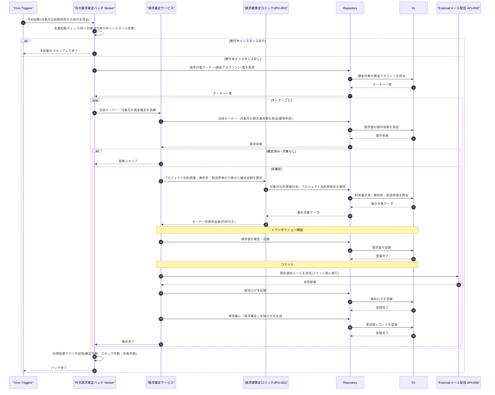

# DSQ-003: 月次請求確定バッチ 詳細シーケンス

> **この詳細シーケンスは「月初起動から対象月の利用量集計・無料枠控除超過分の按分・オーナー単位の請求確定トランザクション・確定通知メール送信・受信箱お知らせ生成までの内部コンポーネント連携とトランザクション境界」を定義します。**

*種別 詳細シーケンス図 ・ ステータス ドラフト*

## 1. 目的

本フローは、Cron Triggers 起動による月次バッチが、多重起動排他・オーナー単位の冪等スキップ・集計と按分の算定・請求確定コミット・確定コミット後の通知送信という複数コンポーネントの連携と順序保証(確定コミット後に通知送信する順序)を伴うため、内部連携順・トランザクション境界・異常分岐を実装粒度で確定する。詳細化元は基本設計の月次請求確定バッチ([SEQ-090](../../02_basic_design/03_sequences/SEQ-090.md#SEQ-090))であり、その「スケジューラ・バッチ・DB・メール配信 IF」抽象を Cron / Worker / Service / Repository / D1 / External の連携へ写像する。請求額算定ロジックは [IPO-002](../04_ipo/IPO-002.md#IPO-002)、起動制御・冪等スキップ・排他・監視の実行機構は [BAT-005](../05_batch/BAT-005.md#BAT-005) を参照する。

## 2. 前提条件

本フローの利用者・開始条件・前提状態と、対象画面 / API / DB・外部 IF・参照する詳細設計を示す。利用者はなくシステム起点(Cron Triggers)である。

| 項目 | 値 |
|----|----|
| 利用者 | —(システム起点。契機は Cron Triggers) |
| 開始条件 | 月初の定時起動タイミングに到達したとき([BAT-005](../05_batch/BAT-005.md#BAT-005) §2 起動タイミング) |
| 前提状態 | 対象オーナー(課金アカウント)が課金対象([課金・請求設計書 §6](../../02_basic_design/05_billing-design.md#6-利用量集計方針)。サスペンション中は集計対象外)。当該対象月の請求書が未確定であること(意味は [状態モデル](../../02_basic_design/08_state-model.md) §7.2 を参照) |
| 対象画面 | —(無人処理) |
| 対象 API | [API-043](../../02_basic_design/02_backend/03_apis/API-043.md#API-043)(請求サマリ)・[API-058](../../02_basic_design/02_backend/03_apis/API-058.md#API-058)(メール配信 IF `EmailProvider`) |
| 対象 DB | [TBL-002](../../02_basic_design/02_backend/04_database/TBL-002.md#TBL-002)(課金アカウント)・[TBL-009](../../02_basic_design/02_backend/04_database/TBL-009.md#TBL-009)(プロジェクト別利用設定)・[TBL-018](../../02_basic_design/02_backend/04_database/TBL-018.md#TBL-018)(課金サブスクリプション)・[TBL-019](../../02_basic_design/02_backend/04_database/TBL-019.md#TBL-019)(請求書)・[TBL-020](../../02_basic_design/02_backend/04_database/TBL-020.md#TBL-020)(利用量計測)・[TBL-022](../../02_basic_design/02_backend/04_database/TBL-022.md#TBL-022)(受信箱)・[TBL-026](../../02_basic_design/02_backend/04_database/TBL-026.md#TBL-026)(通知ログ) |
| 詳細化元 SEQ | [SEQ-090](../../02_basic_design/03_sequences/SEQ-090.md#SEQ-090)(月次請求確定バッチ・[UC-054](../../01_requirements/04_business_usecases/UC-054.md#UC-054)) |
| 対応 SYS | [SYS-019](../../02_basic_design/02_backend/01_system/SYS-019.md#SYS-019)(月次請求確定) |
| 外部 IF | メール配信(Resend。仕様は [API-058](../../02_basic_design/02_backend/03_apis/API-058.md#API-058) を参照) |
| 参照 IPO | [IPO-002](../04_ipo/IPO-002.md#IPO-002)(月次請求確定ロジック) |
| 参照 BAT | [BAT-005](../05_batch/BAT-005.md#BAT-005)(月次請求確定バッチ実行機構) |

## 3. 正常系シーケンス

月初起動から多重起動チェック・対象オーナー一覧取得・オーナー単位ループ(冪等判定・集計・按分・請求確定コミット・確定コミット後の通知送信・受信箱お知らせ生成)までの内部コンポーネント連携を、請求確定のトランザクション境界とともに示す。集計・按分の算定ロジックは [IPO-002](../04_ipo/IPO-002.md#IPO-002) を呼び出す(算定内部の詳細は本図では展開しない)。確定通知メール送信と受信箱お知らせ生成は、請求確定のコミットが完了した後に実行する(コミット前には送信しない)。

## 4. 処理詳細

図の各ステップの実行主体・入出力・分岐・エラー時挙動を実装可能な粒度で示す(算定の疑似コードは [IPO-002](../04_ipo/IPO-002.md#IPO-002)、起動制御・冪等キー構成・排他は [BAT-005](../05_batch/BAT-005.md#BAT-005) を参照。SQL 本文・物理カラム名の羅列は書かない)。

| No | 実行主体 | 処理内容 | 入力 | 出力 | 分岐・条件 | エラー時 |
|----|----|----|----|----|----|----|
| 1 | 月次請求確定バッチ Worker | 月初起動を受け対象月(前月)を確定し多重起動チェックを行う([BAT-005](../05_batch/BAT-005.md#BAT-005) No.1・No.2) | 起動時刻 | 対象月・多重起動チェック結果 | 同一対象月の実行中インスタンスがあればスキップ | 起動処理自体の異常はバッチ全体を異常終了([BAT-005](../05_batch/BAT-005.md#BAT-005) §8) |
| 2 | Repository | 請求対象オーナー(課金アカウント)一覧を取得する | 対象月 | 課金対象のオーナー一覧 | 課金対象外(サスペンション中等)は対象から除く([課金・請求設計書 §6](../../02_basic_design/05_billing-design.md#6-利用量集計方針)) | 一覧取得失敗はバッチ全体を異常終了([BAT-005](../05_batch/BAT-005.md#BAT-005) §8) |
| 3 | 請求確定サービス | オーナーごとに当該対象月の請求書有無を照会し冪等判定する([IPO-002](../04_ipo/IPO-002.md#IPO-002) No.5) | オーナー・対象月・既存請求書有無 | 確定対象 / スキップ対象の別 | 確定済み・対象プロジェクト 0 件はスキップ | 判定不能時は当該オーナーを失敗として記録し次のオーナーへ継続 |
| 4 | 請求額算定ロジック(IPO-002) | プロジェクト別利用量から課金対象件数を算出し、無料枠控除・超過単価計算を経て按分した確定金額をオーナー単位へ集約する([IPO-002](../04_ipo/IPO-002.md#IPO-002) No.1〜No.4) | 対象月・プロジェクト別利用量計測・プロジェクト別利用設定 | オーナー別請求金額(内訳付き) | 算定内部の判定条件・境界値は [IPO-002](../04_ipo/IPO-002.md#IPO-002) を正本とする | 算定不能時は当該オーナーを失敗として記録し§5へ |
| 5 | 請求確定サービス | 請求書を確定・記録する(トランザクション境界内) | オーナー別請求金額・内訳 | 確定した請求書 | 未確定と判定されたオーナーのみ実行 | 書込失敗はロールバックし当該オーナーを失敗として記録、他オーナーの処理は継続 |
| 6 | 請求確定サービス → メール配信 IF | 請求確定のコミット完了後に確定通知メールを送信する([API-058](../../02_basic_design/02_backend/03_apis/API-058.md#API-058) `send`) | 確定した請求書 | 送信結果 | コミット前には送信しない(順序保証) | 送信失敗は請求確定をロールバックせず失敗として配信ログに記録 |
| 7 | 請求確定サービス | 確定通知の配信結果を配信ログへ記録する | 送信結果 | 通知ログレコード | — | 記録失敗は運用監視対象とし請求確定・通知送信は取り消さない |
| 8 | 請求確定サービス | 受信箱へ「請求確定」お知らせを生成する | 確定した請求書 | 受信箱レコード | 通知送信の成否によらず実行する | 生成失敗は運用監視対象とし請求確定は取り消さない |
| 9 | 月次請求確定バッチ Worker | 全オーナーの処理完了後に処理結果サマリ(確定件数・スキップ件数・失敗件数)を記録する([BAT-005](../05_batch/BAT-005.md#BAT-005) No.6) | 各オーナーの確定 / スキップ / 失敗結果 | 処理結果サマリ | 失敗オーナーが存在してもバッチ全体は正常終了とする | — |

## 5. 異常系・例外系

異常・例外の発生箇所と後続処理を示す。エラー内容は ERR ID、表示メッセージは MSG ID で参照する(文面を書かない)。

| No | 発生箇所 | 発生条件 | エラー内容(ERR ID) | 表示メッセージ(MSG ID) | 後続処理 |
|----|----|----|----|----|----|
| 1 | 請求対象オーナー一覧取得(No.2) | 一覧取得処理の失敗 | —(内部エラー) | — | バッチ全体を異常終了とし当該対象月は未確定のまま終える([BAT-005](../05_batch/BAT-005.md#BAT-005) §8) |
| 2 | 請求書確定・記録(No.5) | トランザクション中の書込失敗 | —(内部エラー) | — | ロールバックし当該オーナーのみ失敗として記録、他オーナーの処理を継続([BAT-005](../05_batch/BAT-005.md#BAT-005) §8) |
| 3 | 確定通知メール送信(No.6) | メール配信 IF の送信失敗・タイムアウト | —(内部エラー) | — | 請求確定はロールバックせず、通知ログへ失敗として記録([BAT-005](../05_batch/BAT-005.md#BAT-005) の再送方針に従う) |
| 4 | 受信箱お知らせ生成(No.8) | 受信箱レコードの書込失敗 | —(内部エラー) | — | 請求確定・通知送信は取り消さず、生成失敗を運用監視対象とする |
| 5 | 全体(想定処理時間超過) | 未処理オーナーが起動ウィンドウ内に処理し切れず滞留 | —(内部エラー) | — | 未処理オーナーの滞留を監視しアラートする([BAT-005](../05_batch/BAT-005.md#BAT-005) §8) |

## 6. 後続工程への引き継ぎ事項

テスト設計・詳細ロジック設計・DB 物理設計へ渡す観点を示す。

- 請求書確定のトランザクション境界(部分コミットの排除・書込失敗時のロールバックで請求書が残らないこと)をテスト設計でケース化する。
- 確定コミット後に確定通知メール送信・受信箱お知らせ生成を実行する順序保証(コミット前に通知が送信されないこと)を検証する。
- 確定通知メール送信の失敗が請求確定のロールバック要因にならないこと([IPO-002](../04_ipo/IPO-002.md#IPO-002) No.7)を検証する。
- オーナー単位の冪等スキップ(確定済み・対象プロジェクト 0 件)と、多重起動時のバッチ全体スキップの両方を境界値としてケース化する([BAT-005](../05_batch/BAT-005.md#BAT-005) §6)。
- 一部オーナーの請求確定処理が失敗しても他オーナーの確定・通知が継続されること、失敗分が次回起動で冪等に再試行されることを検証する([BAT-005](../05_batch/BAT-005.md#BAT-005) §8)。
- 按分算定(無料枠控除・超過単価計算・オーナー集約)の境界値そのものは [IPO-002](../04_ipo/IPO-002.md#IPO-002) を正本とし、本フローでは算定呼出しの前後連携のみを対象とすることをテストで区別して確認する。
- 通知ログ・受信箱レコードの物理定義との対応は [DBP](../07_db_physical/) へ委ねる。
