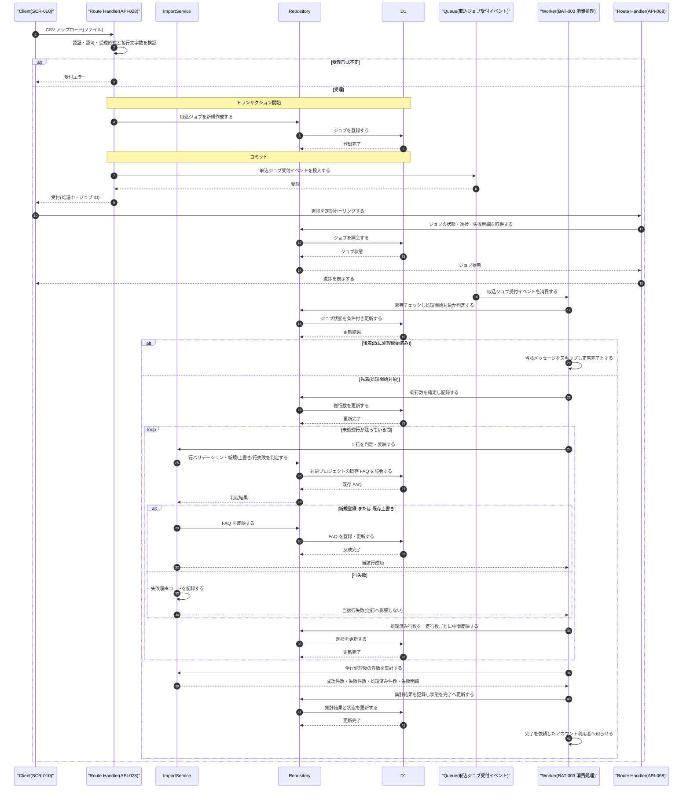

# DSQ-004: FAQ CSV非同期取込 詳細シーケンス

> **この詳細シーケンスは「FAQ CSV インポート受付から Cloudflare Queues 経由の非同期起動・行単位ループでの部分失敗許容・進捗ポーリング用状態更新までの内部コンポーネント連携とトランザクション境界」を定義します。**

*種別 詳細シーケンス図 ・ ステータス ドラフト*

## 1. 目的

本フローは、CSV 受付という同期応答と、行単位ループ・部分失敗許容・進捗ポーリング用状態更新という非同期処理が Cloudflare Queues を跨いで連携し、ジョブ状態の直列化・行単位の独立した成否確定・多重配信時の冪等スキップという複数の分岐を伴うため、内部連携順・トランザクション境界・異常分岐を実装粒度で確定する。詳細化元は基本設計の非同期 CSV インポートジョブ([SEQ-087](../../02_basic_design/03_sequences/SEQ-087.md#SEQ-087))であり、その「サーバー・DB・インポートジョブ」抽象を Route Handler / Service / Repository / D1 / Queue / Worker の連携へ写像する。行単位の判定・バリデーション・反映ロジックは [IPO-015](../04_ipo/IPO-015.md#IPO-015)、非同期実行機構(起動方式・排他・リトライ・ログ)は [BAT-003](../05_batch/BAT-003.md#BAT-003)、ジョブの状態確定は [STS-006](../01_state_transitions/STS-006.md#STS-006) を参照する。

## 2. 前提条件

本フローの利用者・開始条件・前提状態と、対象画面 / API / DB・外部 IF・参照する詳細設計を示す。CSV 受付は利用者セッションの同期応答、行単位取込・進捗更新は非同期ワーカー側で作用する。

| 項目 | 値 |
|----|----|
| 利用者 | アカウント利用者(オーナー / 該当プロジェクトの編集権限を持つメンバー) |
| 開始条件 | [SCR-010](../../02_basic_design/01_frontend/01_screens/SCR-010.md#SCR-010) EVT-04 で FAQ CSV インポートモーダルから CSV をアップロードしたとき |
| 前提状態 | 利用者セッションが有効・対象プロジェクトへの編集権限を保持・課金アカウントが `active`(意味は [状態モデル](../../02_basic_design/08_state-model.md) を参照) |
| 対象画面 | [SCR-010](../../02_basic_design/01_frontend/01_screens/SCR-010.md#SCR-010)(EVT-04 CSV アップロード・進捗ポーリング・結果サマリ表示) |
| 対象 API | [API-028](../../02_basic_design/02_backend/03_apis/API-028.md#API-028)(`POST /faqs/import`) ・ [API-068](../../02_basic_design/02_backend/03_apis/API-068.md#API-068)(`GET /faqs/import/{jobId}`) |
| 対象 DB | [TBL-006](../../02_basic_design/02_backend/04_database/TBL-006.md#TBL-006)(FAQ) ・ [TBL-033](../../02_basic_design/02_backend/04_database/TBL-033.md#TBL-033)(取込ジョブ) |
| 詳細化元 SEQ | [SEQ-087](../../02_basic_design/03_sequences/SEQ-087.md#SEQ-087)(非同期 CSV インポートジョブ・提示 [UC-046](../../01_requirements/04_business_usecases/UC-046.md#UC-046)) |
| 対応システム SYS | [SYS-014](../../02_basic_design/02_backend/01_system/SYS-014.md#SYS-014)(FAQ一括取り込みジョブ非同期実行) |
| 外部 IF | —(外部サービス連携なし。Cloudflare Queues は内部基盤コンポーネントとして描く) |
| 参照 IPO / BAT / STS | [IPO-015](../04_ipo/IPO-015.md#IPO-015)(行単位バリデーション・判定・集計) ・ [BAT-003](../05_batch/BAT-003.md#BAT-003)(非同期実行機構) ・ [STS-006](../01_state_transitions/STS-006.md#STS-006)(取込ジョブ状態遷移) |

## 3. 正常系シーケンス

CSV 受付(受理形式検証・ジョブ作成・Queue 投入)から、Queue 消費によるワーカー起動・行単位ループでの部分失敗許容・進捗記録・件数集計・完了確定までの内部コンポーネント連携を、トランザクション境界とともに示す。CSV 受付とジョブ作成は同一トランザクションで確定し、行単位ループは 1 行ごとに独立して確定する(1 行の失敗は他行に影響しない)。進捗ポーリングは画面から独立して随時到達する。

## 4. 処理詳細

図の各ステップの実行主体・入出力・分岐条件・エラー時挙動を実装可能な粒度で示す。行単位の判定条件・疑似コードは [IPO-015](../04_ipo/IPO-015.md#IPO-015)、非同期実行の起動制御・排他・リトライは [BAT-003](../05_batch/BAT-003.md#BAT-003)、状態遷移のガード条件は [STS-006](../01_state_transitions/STS-006.md#STS-006) を参照し本書で再定義しない(SQL 本文・物理カラム名は書かない)。

| No | 実行主体 | 処理内容 | 入力 | 出力 | 分岐・条件 | エラー時 |
|----|----|----|----|----|----|----|
| 1 | Route Handler | CSV アップロードを受け付け認証・認可と受理形式・各行文字数を検証する([API-028](../../02_basic_design/02_backend/03_apis/API-028.md#API-028) P-01/P-02) | CSV ファイル・利用者セッション | 検証結果 | 受理形式(CSV・UTF-8・ヘッダ行・件数・サイズ = 設計値)と文字数([RULE-011](../../01_requirements/01_business_requirement/08_rule.md#RULE-011))をいずれも満たすときのみ受理 | 形式不正は §5 No.1 へ分岐しジョブを作成しない |
| 2 | Route Handler | 取込ジョブを新規作成し状態を既定へ確定する(同一トランザクション) | 検証済みリクエスト | 取込ジョブ(状態 `queued`) | 総行数はこの時点では未設定([STS-006](../01_state_transitions/STS-006.md#STS-006) `(なし)→queued`) | 書込失敗時はロールバックし §5 No.2 へ |
| 3 | Route Handler → Queue | コミット後に取込ジョブ受付イベントを Queue へ投入する([API-028](../../02_basic_design/02_backend/03_apis/API-028.md#API-028) P-03) | ジョブ ID・対象プロジェクト ID | 投入受理 | 1 ジョブ = 1 メッセージ | 投入失敗時の再試行方針は [BAT-003](../05_batch/BAT-003.md#BAT-003) が担う(同期応答は返却済み) |
| 4 | Route Handler | ジョブ ID と受付状態を返却する([API-028](../../02_basic_design/02_backend/03_apis/API-028.md#API-028) P-05) | ジョブ ID | 受付応答(`processing`) | — | — |
| 5 | Route Handler(API-068) | 進捗ポーリング要求のたびにジョブの状態・進捗・失敗明細を照会する | ジョブ ID | ジョブ状態・進捗・失敗明細 | 指定ジョブが当該プロジェクトに属し存在することを検証する([API-068](../../02_basic_design/02_backend/03_apis/API-068.md#API-068) P-02/P-03) | 不一致は §5 No.3、不在は §5 No.4 へ分岐 |
| 6 | Worker | Queue メッセージを消費し冪等チェックで処理開始対象か判定する([BAT-003](../05_batch/BAT-003.md#BAT-003) No.1) | ジョブ ID | 処理開始可否 | ジョブが `queued` であれば条件付き更新で `processing` へ確定し先着とする | 既に `processing`/`completed`/`failed` の場合は後着として当該メッセージをスキップし正常完了とする |
| 7 | Worker | 取込対象の総行数を確定して記録する([SYS-014](../../02_basic_design/02_backend/01_system/SYS-014.md#PR-01)) | ジョブに紐づく取込対象 | 総行数 | 処理開始判定通過時 | 記録失敗時は当該ジョブを失敗として継続し No.10 へ進む |
| 8 | Worker → ImportService | 未処理行が残っている間、行番号順に 1 行ずつ判定・反映する([IPO-015](../04_ipo/IPO-015.md#IPO-015) No.1〜5) | CSV 1 行・対象プロジェクトの既存 FAQ | 行反映結果(成功 / 行失敗) | 行バリデーション → 新規/上書き/行失敗判定 → 反映の順に判定する | 当該行の反映失敗(制約違反等)は当該行のみ行失敗へ振り替え他行の処理を継続する |
| 9 | Worker | 行単位ループ処理中、一定行数ごとに処理済み行数・成功行数・失敗行数を中間反映する([BAT-003](../05_batch/BAT-003.md#BAT-003) No.4) | 累積の処理済み / 成功 / 失敗行数 | 進捗更新 | 一定行数ごと(反映間隔は §6 引き継ぎ) | 中間反映の失敗は次回の進捗記録機会で再試行しループ処理自体は継続する |
| 10 | Worker → ImportService | 全行処理完了後、成功件数・失敗件数・処理済み件数・失敗明細を集計する([IPO-015](../04_ipo/IPO-015.md#IPO-015) No.6) | 全行の判定・反映結果 | 集計結果 | 全行の処理完了後 | 集計不能時は §5 No.5 の異常終了へ |
| 11 | Worker | 集計結果を記録し状態を `completed` へ確定する([STS-006](../01_state_transitions/STS-006.md#STS-006) `processing→completed`) | 集計結果 | 確定済みジョブ | 全件成功・部分失敗を区別しない共通状態 | 集計・更新処理自体の失敗はジョブを `failed` へ更新する([STS-006](../01_state_transitions/STS-006.md#STS-006) `processing→failed`) |
| 12 | Worker | 依頼したアカウント利用者へ完了を知らせる([SYS-014](../../02_basic_design/02_backend/01_system/SYS-014.md#PR-07)) | 確定済みジョブ | 完了通知 | 全件成功時と一部失敗時で種別を分け件数・失敗明細を提示する | 通知投入失敗時は当該ジョブの通知のみ失敗として再試行しジョブの状態確定は取り消さない |

## 5. 異常系・例外系

異常・例外の発生箇所と後続処理を示す。エラー内容は ERR ID、表示メッセージは画面 [SCR-010](../../02_basic_design/01_frontend/01_screens/SCR-010.md#SCR-010) §8 の `EM-NN` で参照する(文面を書かない)。

| No | 発生箇所 | 発生条件 | エラー内容(ERR ID) | 表示メッセージ(MSG ID) | 後続処理 |
|----|----|----|----|----|----|
| 1 | CSV 受付検証(No.1) | 受理形式不正(CSV 以外 / 文字コード不正 / ヘッダ行欠落 / 件数・サイズ上限超過 / 文字数超過) | [ERR-024](../../02_basic_design/05_errors/ERR-024.md#ERR-024)(415/400) | SCR-010 §8 `EM-02`〜`EM-04` | 受付前に拒否しジョブを作成しない |
| 2 | 取込ジョブ作成(No.2) | トランザクション中の書込失敗 | —(標準エラー体系外の 500) | SCR-010 §8 `EM-05` | ロールバックしジョブを作成しない。Queue への投入も行わない |
| 3 | 進捗ポーリング(No.5) | 指定ジョブが当該プロジェクトに属さない | [ERR-019](../../02_basic_design/05_errors/ERR-019.md#ERR-019)(403) | SCR-010 §8 `EM-05` | 進捗取得を拒否する |
| 4 | 進捗ポーリング(No.5) | 指定ジョブが存在しない | [ERR-017](../../02_basic_design/05_errors/ERR-017.md#ERR-017)(404) | SCR-010 §8 `EM-05` | 進捗取得を拒否する |
| 5 | 行単位反映(No.8) | 当該プロジェクトに存在しない `FAQ ID` / 行バリデーション不合格 | [ERR-025](../../02_basic_design/05_errors/ERR-025.md#ERR-025)(行単位) | —(画面はエラー一覧 #8 に失敗行と理由を表示・EM 対象外) | 当該行のみ行失敗として記録し他行の処理を継続する([IPO-015](../04_ipo/IPO-015.md#IPO-015) No.5) |
| 6 | ワーカー処理(No.7・No.10・No.11) | 回復不能な異常(DB 書込失敗の継続・予期しない例外等) | —(標準エラー体系外の 500) | SCR-010 §8 `EM-05` | 状態を `failed` へ更新し既に確定済みの行単位結果は巻き戻さない([STS-006](../01_state_transitions/STS-006.md#STS-006) `processing→failed`) |
| 7 | `processing` 滞留(監視) | 監視処理が進捗の更新されない滞留ジョブを検知する([BAT-003](../05_batch/BAT-003.md#BAT-003) 異常終了時の扱い) | —(監視契機による確定) | SCR-010 §8 `EM-05` | 状態を `failed` へ更新する。ワーカー側が同時に `completed` へ更新済みの場合は先着(ワーカー側)を優先する |

## 6. 後続工程への引き継ぎ事項

テスト設計・詳細ロジック設計・DB 物理設計へ渡す観点を示す。

- CSV 受付とジョブ作成の同一トランザクション境界(書込失敗時のロールバックでジョブが作成されず Queue へも投入されないこと)をテスト設計でケース化する。
- Queue メッセージの多重配信時、冪等チェック(No.6)で後着が正しくスキップされ二重に `processing` 更新が行われないことを検証する([BAT-003](../05_batch/BAT-003.md#BAT-003) §6)。
- 行単位ループ(No.8)で 1 行の反映失敗が他行の処理・トランザクション境界に影響を与えないこと(部分失敗許容)を [IPO-015](../04_ipo/IPO-015.md#IPO-015) の判定分岐と突き合わせて網羅する。
- 進捗ポーリング(No.5)が行単位ループの中間反映(No.9)と非同期に到達しても、時点断面の整合した進捗値を返すことを検証する(反映間隔は基本設計・システム仕様書に未定義のため [BAT-003](../05_batch/BAT-003.md#BAT-003) §9 引き継ぎに従う)。
- 全行処理完了後の集計確定(No.10・No.11)と `completed`/`failed` の状態確定の排他([STS-006](../01_state_transitions/STS-006.md#STS-006))、および `processing` 滞留監視との競合(先着優先)をテスト設計でケース化する。
- 冪等キーは取込ジョブ ID を基準に処理開始・完了確定の重複実行を抑止する前提での再送・再消費時挙動([BAT-003](../05_batch/BAT-003.md#BAT-003) §6)を検証する。
