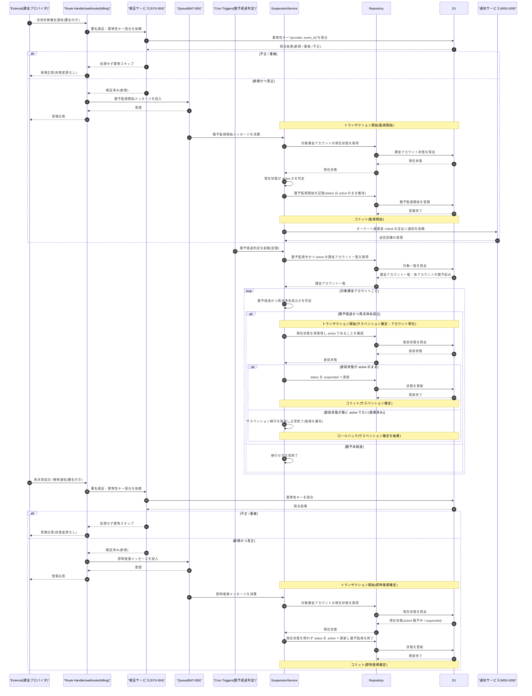

# DSQ-005: サスペンション移行 詳細シーケンス

> **この詳細シーケンスは「決済失敗確定通知による猶予監視開始、猶予経過を判定する定期起動によるサスペンション移行確定、再決済成功 / 解除通知による即時復帰確定という複合トリガーの内部コンポーネント連携とトランザクション境界」を定義します。**

*種別 詳細シーケンス図 ・ ステータス ドラフト*

## 1. 目的

本フローは、課金プロバイダ通知(Webhook 経由の Queue 投入)と定期起動(Cron Triggers)という異なる契機が同一課金アカウントの状態に対しほぼ同時に到達しうるため、監視開始とサスペンション確定のトランザクション分離、および定期判定によるサスペンション移行確定と通知受信による即時復帰確定が競合した場合の状態整合を実装粒度で確定する。詳細化元は基本設計の決済失敗→猶予→サスペンション([SEQ-098](../../02_basic_design/03_sequences/SEQ-098.md#SEQ-098))であり、その「サーバー・DB」抽象を Route Handler / Service / Repository / D1 / Queue / Cron の連携へ写像する。判定ロジックは [IPO-003](../04_ipo/IPO-003.md#IPO-003)、状態確定は [STS-003](../01_state_transitions/STS-003.md#STS-003)、実行機構(トリガー振り分け・排他・冪等・異常終了)は [BAT-006](../05_batch/BAT-006.md#BAT-006) を参照する。

## 2. 前提条件

本フローの利用者・開始条件・前提状態と、対象画面 / API / DB・外部 IF・参照する詳細設計を示す。3 つの契機(通知受信 2 種・定期起動 1 種)がいずれも同一課金アカウントの状態確定に合流しうることを前提とする。

| 項目 | 値 |
|----|----|
| 利用者 | —(システム起点。契機は課金プロバイダ通知受信および Cron Triggers) |
| 開始条件 | 決済失敗確定通知を受信したとき / 猶予経過を判定する定期起動が到達したとき / 再決済成功・解除通知を受信したとき |
| 前提状態 | 対象課金アカウントが `active`(決済失敗確定通知・猶予経過判定時)または `active` 猶予中 / `suspended`(復帰通知時)。意味は [状態モデル](../../02_basic_design/08_state-model.md#2-課金アカウント状態) を参照 |
| 対象画面 | —(無人処理) |
| 対象 API | [API-060](../../02_basic_design/02_backend/03_apis/API-060.md#API-060)(`POST /webhooks/billing`) |
| 対象 DB | [TBL-002](../../02_basic_design/02_backend/04_database/TBL-002.md#TBL-002)(課金アカウント状態)・[TBL-018](../../02_basic_design/02_backend/04_database/TBL-018.md#TBL-018)(課金サブスクリプション) |
| 詳細化元 SEQ | [SEQ-098](../../02_basic_design/03_sequences/SEQ-098.md#SEQ-098)(決済失敗→猶予→サスペンション・[UC-055](../../01_requirements/04_business_usecases/UC-055.md#UC-055)) |
| 対象 SYS | [SYS-020](../../02_basic_design/02_backend/01_system/SYS-020.md#SYS-020)(決済失敗猶予・サスペンション移行) |
| 参照 IPO / STS / BAT | [IPO-003](../04_ipo/IPO-003.md#IPO-003) ・ [STS-003](../01_state_transitions/STS-003.md#STS-003) ・ [BAT-006](../05_batch/BAT-006.md#BAT-006) |

## 3. 正常系シーケンス

決済失敗確定通知による猶予監視開始と、定期起動による猶予経過判定・サスペンション移行確定、および再決済成功 / 解除通知による即時復帰確定の 3 経路を、それぞれ独立したトランザクション境界とともに示す。監視開始とサスペンション確定は別トリガー・別トランザクションであり同一 Tx に含めない。定期判定と復帰通知がほぼ同時到達した場合は復帰確定を優先する分岐を alt で明示する。

## 4. 処理詳細

図の各ステップの実行主体・入出力・分岐・エラー時挙動を実装可能な粒度で示す(判定ロジックは [IPO-003](../04_ipo/IPO-003.md#IPO-003)、実行機構は [BAT-006](../05_batch/BAT-006.md#BAT-006)、物理カラム名は [TBL-002](../../02_basic_design/02_backend/04_database/TBL-002.md#TBL-002) を参照)。

| No | 実行主体 | 処理内容 | 入力 | 出力 | 分岐・条件 | エラー時 |
|----|----|----|----|----|----|----|
| 1 | Route Handler → 検証サービス | 通知の署名検証・冪等性キー"(provider, event_id)"照合を依頼する([SYS-004](../../02_basic_design/02_backend/01_system/SYS-004.md#SYS-004) PR-01・PR-02) | 通知ペイロード | 検証結果(新規 / 重複 / 不正) | 不正 / 重複は §5 No.1 へ分岐し状態を変更しない | 検証不能時は不正扱いとして拒否 |
| 2 | Route Handler → Queue | 検証済み・新規の決済失敗確定通知を猶予監視開始メッセージとして Queue へ投入する | 検証結果・対象課金アカウント識別子 | 投入受理 | 投入は同期応答(受領)より先に完了させる | 投入失敗時の再試行は [BAT-006](../05_batch/BAT-006.md#BAT-006) §8 に委ねる |
| 3 | SuspensionService | 猶予監視開始メッセージを消費し、対象課金アカウントの現在状態を取得する | 対象課金アカウント識別子 | 現在状態 | 現在状態が `active` のときのみ次工程へ進む([IPO-003](../04_ipo/IPO-003.md#IPO-003) No.2) | `suspended` 中の重複受信は対象外とし猶予起点を更新しない([IPO-003](../04_ipo/IPO-003.md#IPO-003) No.2) |
| 4 | SuspensionService | 猶予監視開始を記録する(status は `active` のまま維持) | 現在状態 `active` | 猶予監視開始の記録 | 監視開始とサスペンション確定(No.7)は別トランザクションに分離し同一 Tx に含めない | 書込失敗時はロールバックし §5 No.4 へ |
| 5 | SuspensionService → 通知サービス | 猶予監視開始の記録確定後にオーナーへ重要度 critical の支払い通知を依頼する([SYS-020](../../02_basic_design/02_backend/01_system/SYS-020.md#SYS-020) PR-03) | 猶予監視開始の記録 | 通知送信契機の受理 | 記録確定(コミット)後に依頼する(Tx 外) | 通知送信自体の失敗・再送は [MSG-009](../../02_basic_design/06_messages/MSG-009.md#MSG-009) 側の責務とし本フローの状態確定には影響させない |
| 6 | Cron Triggers → SuspensionService | 猶予経過を判定する定期起動で、猶予監視中かつ `active` の課金アカウント一覧を取得する | 起動時刻のみ | 課金アカウント一覧・各アカウントの猶予起点 | 前回起動が完了していない場合は新規の重複起動を行わない([BAT-006](../05_batch/BAT-006.md#BAT-006) §6) | 一覧抽出失敗時は当該起動全体を失敗として記録し次回起動へ委ねる |
| 7 | SuspensionService | 対象課金アカウントごとに猶予経過かつ再決済未成立かを判定する([IPO-003](../04_ipo/IPO-003.md#IPO-003) No.4) | 猶予起点・現在時刻・猶予期間([システム仕様書 §4](../../02_basic_design/07_system-spec.md#4-データ保持期間削除猶予))・再決済成立有無 | 猶予経過判定結果(経過 / 未経過) | 猶予期間ちょうど経過は経過側に含める(`>=`) | 猶予起点が特定できない対象は判定から除外する(§6 引き継ぎ事項) |
| 8 | SuspensionService | 猶予経過と判定した課金アカウントごとに、状態確定直前で現在状態を再取得し `active` のままかを確認したうえで `suspended` へ更新する | 猶予経過判定結果・直前の現在状態 | `suspended` への状態確定、または確定破棄 | 直前状態が `active` のままなら `suspended` へ確定。既に `active` でない(即時復帰確定が先着)場合は移行を破棄し正常終了(復帰優先・[IPO-003](../04_ipo/IPO-003.md#IPO-003) No.5 備考) | 更新失敗時は当該課金アカウントのみ失敗として記録し他アカウントの判定は継続([BAT-006](../05_batch/BAT-006.md#BAT-006) §8) |
| 9 | Route Handler → 検証サービス | 再決済成功 / 解除通知の署名検証・冪等性キー照合を依頼する | 通知ペイロード | 検証結果(新規 / 重複 / 不正) | 不正 / 重複は §5 No.1 へ分岐し状態を変更しない | 検証不能時は不正扱いとして拒否 |
| 10 | Route Handler → Queue | 検証済み・新規の再決済成功 / 解除通知を即時復帰メッセージとして Queue へ投入する | 検証結果・対象課金アカウント識別子 | 投入受理 | — | 投入失敗時の再試行は [BAT-006](../05_batch/BAT-006.md#BAT-006) §8 に委ねる |
| 11 | SuspensionService | 即時復帰メッセージを消費し、現在状態を問わず(`active` 猶予中 / `suspended` いずれも) `active` へ更新し猶予監視を終了する([IPO-003](../04_ipo/IPO-003.md#IPO-003) No.6) | 対象課金アカウント識別子・現在状態 | `active` 復帰の記録、猶予監視終了の記録 | 現在状態が `active` かつ猶予監視なし(復帰済み)の場合は状態変化なしで冪等に終了 | 書込失敗時はロールバックし §5 No.4 へ |

## 5. 異常系・例外系

異常・例外の発生箇所と後続処理を示す。エラー内容は ERR ID、表示メッセージは MSG ID で参照する(文面を書かない)。本フローは無人処理のため画面表示エラーは扱わず、後続処理として運用記録・再処理契機を示す。

| No | 発生箇所 | 発生条件 | エラー内容(ERR ID) | 表示メッセージ(MSG ID) | 後続処理 |
|----|----|----|----|----|----|
| 1 | 通知受信・検証(No.1・No.9) | 署名不正、または冪等性キー"(provider, event_id)"で重複受信 | —(処理せず拒否・状態変更なし) | — | 不正は受信記録のみ残して拒否、重複は受信記録のみ残して取込をスキップする([SYS-004](../../02_basic_design/02_backend/01_system/SYS-004.md#SYS-004) PR-01・PR-02) |
| 2 | 猶予経過判定・サスペンション確定(No.7・No.8) | 定期判定によるサスペンション移行確定と、通知受信による即時復帰確定がほぼ同時に到達 | —(競合制御・エラーではない) | — | 直前状態の再確認により復帰確定を優先し、サスペンション移行は破棄する([IPO-003](../04_ipo/IPO-003.md#IPO-003) No.5 備考・[BAT-006](../../03_detail_design/05_batch/BAT-006.md#BAT-006) §6) |
| 3 | サスペンション確定後のウィジェット / 管理画面応答 | 課金アカウントが `suspended` へ移行済みの状態で当該オーナーのプロジェクトへアクセス | [ERR-004](../../02_basic_design/05_errors/ERR-004.md#ERR-004)(403) | [MSG-009](../../02_basic_design/06_messages/MSG-009.md#MSG-009)(`suspension_event=start`) | ウィジェット・管理画面双方で機能停止応答を返す。操作範囲は [STS-003](../01_state_transitions/STS-003.md#STS-003) §6 を正本とする |
| 4 | 監視開始 / サスペンション確定 / 即時復帰確定(No.4・No.8・No.11)のトランザクション中の書込失敗 | 一時的な書込障害 | —(内部エラー) | — | 当該トランザクションをロールバックし、当該メッセージ / 課金アカウントのみ失敗として記録して再処理へ回す。他メッセージ・他アカウントの処理は継続([BAT-006](../../03_detail_design/05_batch/BAT-006.md#BAT-006) §8) |

## 6. 後続工程への引き継ぎ事項

テスト設計・詳細ロジック設計・DB 物理設計へ渡す観点を箇条書きで示す。

- 監視開始(No.3・No.4)とサスペンション確定(No.8)が別トリガー・別トランザクションであり、同一 Tx に含めないことをテスト設計でケース化する(部分コミットで監視開始のみ確定しサスペンションへは進まないことの確認を含む)。
- 猶予経過判定によるサスペンション確定(No.8)の直前で現在状態を再取得し、即時復帰確定(No.11)が先着していた場合はサスペンション移行を破棄して復帰を優先する競合制御(§5 No.2)を、ほぼ同時到達のタイミングでケース化する。
- 冪等性キー"(provider, event_id)"による重複受信スキップが、猶予監視開始・サスペンション確定・即時復帰確定のいずれの経路でも状態を二重に変えないことを検証する([BAT-006](../05_batch/BAT-006.md#BAT-006) §6)。
- 猶予経過判定の境界値(猶予期間ちょうど経過を経過側に含める `>=`)をテスト設計でケース化する([IPO-003](../04_ipo/IPO-003.md#IPO-003) No.4)。
- 猶予起点は課金サブスクリプション([TBL-018](../../02_basic_design/02_backend/04_database/TBL-018.md#TBL-018) `grace_started_at`)で保持することが基本設計で確定済み([IPO-003 §5](../04_ipo/IPO-003.md#IPO-003)・[BAT-006 §9](../05_batch/BAT-006.md#BAT-006))。物理制約・抽出インデックスは [DBP-011](../07_db_physical/DBP-011.md#DBP-011) を参照(本書 No.7・No.8 の「猶予起点」入力はこの確定に基づく)。
- `suspended` 中に決済失敗確定通知を重複的に受信した場合、猶予起点を再起算せず対象外とすること(No.3)をテスト設計でケース化する。
- 定期判定契機の部分失敗(一覧抽出失敗・個別課金アカウントの判定失敗)が他アカウントの処理を妨げないことを検証する([BAT-006](../05_batch/BAT-006.md#BAT-006) §8)。
