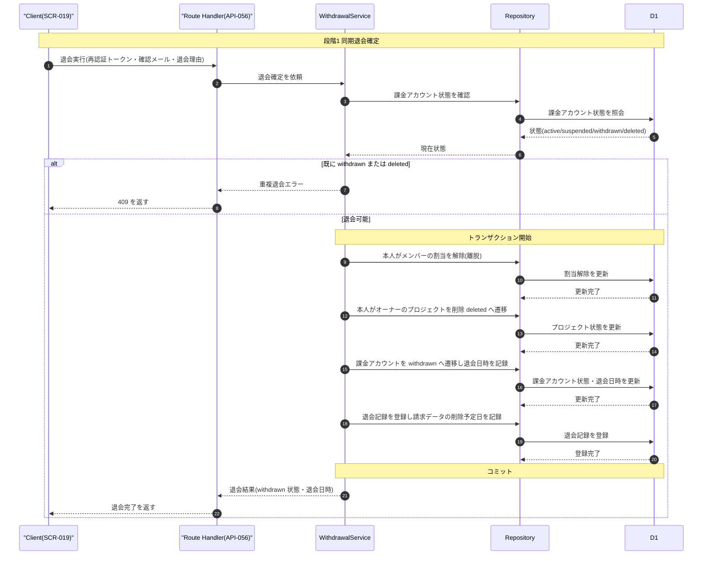
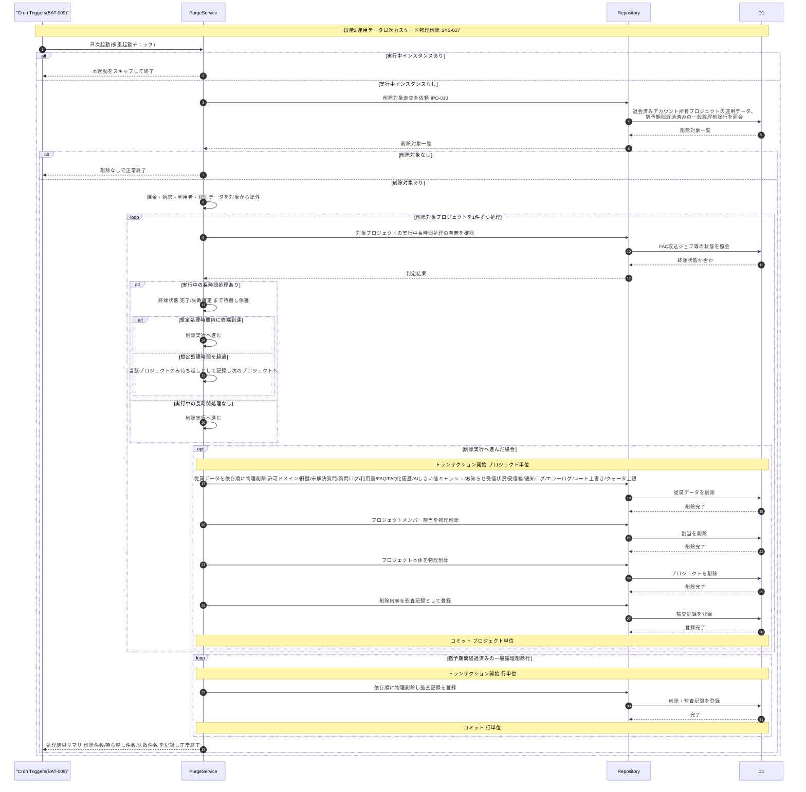
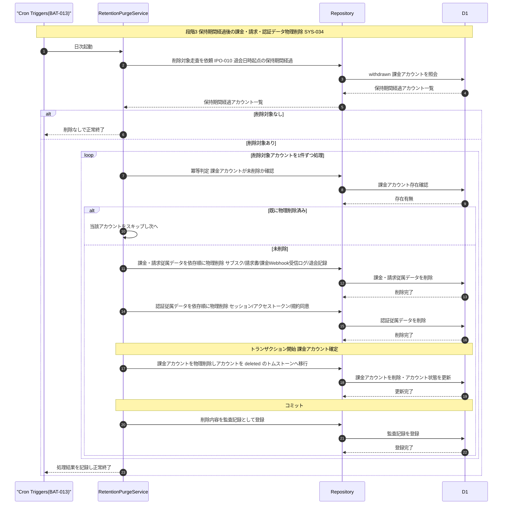

# DSQ-006: アカウント退会→カスケード削除 詳細シーケンス

> **この詳細シーケンスは「アカウント利用者本人による即時退会の同期確定から、退会済みアカウントが所有するプロジェクトの運用データの日次カスケード物理削除、保持期間経過後の課金・請求・認証データの物理削除までの内部コンポーネント連携とトランザクション境界」を定義します。**

*種別 詳細シーケンス図 ・ ステータス ドラフト*

## 1. 目的

本フローは、退会確定(同期 API 処理)・退会済みアカウントが所有するプロジェクトの運用データの日次カスケード物理削除(依存順の多段階削除・長時間ジョブ保護待機を伴う)・保持期間経過後の課金/請求/認証データの物理削除という 3 段階の高リスク破壊的操作を含み、各段のトランザクション境界・ロールバック戦略・待機/再評価分岐を実装粒度で確定する必要があるため詳細化する。詳細化元は退会済み・論理削除データの物理削除バッチ([SEQ-089](../../02_basic_design/03_sequences/SEQ-089.md#SEQ-089))であり、その「サーバー・DB」抽象を Route Handler / Service / Repository / D1 / Cron Triggers / Queue の連携へ写像する。同期退会確定は [API-056](../../02_basic_design/02_backend/03_apis/API-056.md#API-056)、削除対象か否かの判定ロジックは [IPO-010](../04_ipo/IPO-010.md#IPO-010)、日次バッチの実行機構は [BAT-009](../05_batch/BAT-009.md#BAT-009)(運用データ)・[BAT-013](../05_batch/BAT-013.md#BAT-013)(課金・請求・認証データ)を参照する。

## 2. 前提条件

本フローの利用者・開始条件・前提状態と、対象画面 / API / DB・外部 IF・参照する詳細設計を示す。3 段階(同期退会確定・運用データ日次削除・保持期間経過後削除)は開始条件・起動契機が異なる。

| 項目 | 値 |
|----|----|
| 利用者 | アカウント利用者本人(同期退会確定段階) ・ —(日次削除段階はシステム起点。契機は Cron Triggers) |
| 開始条件 | 退会確認ダイアログでメールアドレス一致確認・再認証を行い退会を確定したとき([SCR-019](../../02_basic_design/01_frontend/01_screens/SCR-019.md#SCR-019) EVT-03)。日次削除は各バッチの定時起動 |
| 前提状態 | 対象課金アカウントが退会前状態(`active`/`suspended`。意味は[状態モデル §2](../../02_basic_design/08_state-model.md#2-課金アカウント状態))・直近の再認証が成立していること。日次削除段階は課金アカウントが `withdrawn`(運用データ削除)、退会日時 `withdrawn_at` から保持期間を経過(課金・請求・認証データ削除) |
| 対象画面 | [SCR-019](../../02_basic_design/01_frontend/01_screens/SCR-019.md#SCR-019)(EVT-03 再認証・退会実行) |
| 対象 API | [API-056](../../02_basic_design/02_backend/03_apis/API-056.md#API-056)(`POST /withdrawals`)・[API-005](../../02_basic_design/02_backend/03_apis/API-005.md#API-005)(再認証・前段で完了済み) |
| 対象 DB | [TBL-002](../../02_basic_design/02_backend/04_database/TBL-002.md#TBL-002)(課金アカウント)・[TBL-003](../../02_basic_design/02_backend/04_database/TBL-003.md#TBL-003)(プロジェクトメンバー割当)・[TBL-004](../../02_basic_design/02_backend/04_database/TBL-004.md#TBL-004)(プロジェクト)・[TBL-023](../../02_basic_design/02_backend/04_database/TBL-023.md#TBL-023)(退会記録)・[TBL-001](../../02_basic_design/02_backend/04_database/TBL-001.md#TBL-001)(利用者)・[TBL-027](../../02_basic_design/02_backend/04_database/TBL-027.md#TBL-027)(監査ログ)、および運用データ多数([TBL-005](../../02_basic_design/02_backend/04_database/TBL-005.md#TBL-005)・[TBL-006](../../02_basic_design/02_backend/04_database/TBL-006.md#TBL-006)・[TBL-008](../../02_basic_design/02_backend/04_database/TBL-008.md#TBL-008)・[TBL-009](../../02_basic_design/02_backend/04_database/TBL-009.md#TBL-009)・[TBL-015](../../02_basic_design/02_backend/04_database/TBL-015.md#TBL-015)・[TBL-017](../../02_basic_design/02_backend/04_database/TBL-017.md#TBL-017)・[TBL-020](../../02_basic_design/02_backend/04_database/TBL-020.md#TBL-020)・[TBL-021](../../02_basic_design/02_backend/04_database/TBL-021.md#TBL-021)・[TBL-022](../../02_basic_design/02_backend/04_database/TBL-022.md#TBL-022)・[TBL-025](../../02_basic_design/02_backend/04_database/TBL-025.md#TBL-025)・[TBL-026](../../02_basic_design/02_backend/04_database/TBL-026.md#TBL-026)・[TBL-028](../../02_basic_design/02_backend/04_database/TBL-028.md#TBL-028)・[TBL-029](../../02_basic_design/02_backend/04_database/TBL-029.md#TBL-029)・[TBL-031](../../02_basic_design/02_backend/04_database/TBL-031.md#TBL-031)・[TBL-033](../../02_basic_design/02_backend/04_database/TBL-033.md#TBL-033))、課金・請求・認証データ([TBL-013](../../02_basic_design/02_backend/04_database/TBL-013.md#TBL-013)・[TBL-014](../../02_basic_design/02_backend/04_database/TBL-014.md#TBL-014)・[TBL-018](../../02_basic_design/02_backend/04_database/TBL-018.md#TBL-018)・[TBL-019](../../02_basic_design/02_backend/04_database/TBL-019.md#TBL-019)・[TBL-024](../../02_basic_design/02_backend/04_database/TBL-024.md#TBL-024)・[TBL-032](../../02_basic_design/02_backend/04_database/TBL-032.md#TBL-032)) |
| 詳細化元 SEQ | [SEQ-089](../../02_basic_design/03_sequences/SEQ-089.md#SEQ-089)(退会済み・論理削除データの物理削除バッチ・提示 [UC-066](../../01_requirements/04_business_usecases/UC-066.md#UC-066)) |
| 同期退会 UC / SYS | [UC-022](../../01_requirements/04_business_usecases/UC-022.md#UC-022)(ユーザーがアカウントを退会する) |
| 日次削除 SYS | [SYS-027](../../02_basic_design/02_backend/01_system/SYS-027.md#SYS-027)(退会済みアカウント・論理削除データの物理削除)・[SYS-034](../../02_basic_design/02_backend/01_system/SYS-034.md#SYS-034)(保持期間経過アカウントの物理削除) |
| 外部 IF | —(本フローは外部連携を持たない) |
| 参照 IPO | [IPO-010](../04_ipo/IPO-010.md#IPO-010)(保持期間超過削除判定ロジック) |
| 参照 BAT | [BAT-009](../05_batch/BAT-009.md#BAT-009)(退会済み・論理削除データの物理削除)・[BAT-013](../05_batch/BAT-013.md#BAT-013)(保持期間経過アカウントの物理削除) |

## 3. 正常系シーケンス

退会確定(同期)から、日次の運用データカスケード物理削除(長時間ジョブ保護待機を含む)、保持期間経過後の課金・請求・認証データ物理削除までを、各段のトランザクション境界とともに示す。運用データの物理削除は[SYS-027](../../02_basic_design/02_backend/01_system/SYS-027.md#SYS-027)の網羅順序(子→親)に従いプロジェクト単位で直列に進め、プロジェクトごとに個別コミットする。

## 4. 処理詳細

図の各ステップの実行主体・入出力・分岐・エラー時挙動を実装可能な粒度で示す(判定条件・疑似コードは可、SQL 本文・物理カラム名は書かない)。削除対象か否かの判定は [IPO-010](../04_ipo/IPO-010.md#IPO-010)、実行機構(排他・冪等・監視・異常終了時の扱い)は [BAT-009](../05_batch/BAT-009.md#BAT-009)・[BAT-013](../05_batch/BAT-013.md#BAT-013) を正本とする。

| No | 実行主体 | 処理内容 | 入力 | 出力 | 分岐・条件 | エラー時 |
|----|----|----|----|----|----|----|
| 1 | Route Handler / WithdrawalService | 退会実行を受け付け課金アカウントの現在状態を確認する([API-056](../../02_basic_design/02_backend/03_apis/API-056.md#API-056) P-03) | 再認証トークン・確認メール・退会理由 | 現在の課金アカウント状態 | 既に `withdrawn`/`deleted` なら重複退会として §5 No.1 へ分岐 | 状態照会失敗は処理エラーとして確定 |
| 2 | WithdrawalService | メンバー割当解除・オーナープロジェクトの削除・課金アカウントの `withdrawn` 遷移・退会記録登録を同一トランザクションで行う([API-056](../../02_basic_design/02_backend/03_apis/API-056.md#API-056) P-04〜P-08) | 課金アカウント識別子・本人の割当一覧・本人所有プロジェクト一覧 | 更新後の課金アカウント状態・退会日時・退会記録識別子 | 退会日時 `withdrawn_at` を保持期間の起算点として記録する([システム仕様書 §4](../../02_basic_design/07_system-spec.md#4-データ保持期間削除猶予)) | いずれかの更新失敗はロールバックし §5 No.2 へ |
| 3 | Cron Triggers / PurgeService | 日次起動時に多重起動チェックを行う([BAT-009](../05_batch/BAT-009.md#BAT-009) §4 No.1) | 起動時刻 | 実行可否 | 実行中インスタンスがあればスキップして終了 | — |
| 4 | PurgeService | 削除対象走査を [IPO-010](../04_ipo/IPO-010.md#IPO-010) の判定へ委ねる([SYS-027](../../02_basic_design/02_backend/01_system/SYS-027.md#SYS-027) PR-01) | 現在時刻 | 退会済みアカウント所有プロジェクトの運用データ、猶予期間経過済みの一般論理削除行 | 対象なしは削除を行わず正常終了 | 走査失敗はバッチ全体を異常終了とし当日は削除しない |
| 5 | PurgeService | 課金・請求・利用者・認証データを削除対象から除外する([SYS-027](../../02_basic_design/02_backend/01_system/SYS-027.md#SYS-027) PR-02) | 削除対象一覧 | 除外後の削除対象一覧 | 除外判定は [IPO-010](../04_ipo/IPO-010.md#IPO-010) No.5 の区分振り分けを正本とする | 除外判定失敗はバッチ全体を異常終了とする |
| 6 | PurgeService | プロジェクト単位で実行中の長時間処理(FAQ 一括取り込み等)の有無を確認する([SYS-027](../../02_basic_design/02_backend/01_system/SYS-027.md#SYS-027) PR-06) | 対象プロジェクト識別子・FAQ 取込ジョブ状態 | 終端状態到達可否 | 実行中なら終端状態(完了/失敗確定)まで待機。想定処理時間超過は当該プロジェクトのみ持ち越しとし他プロジェクトへ継続 | 待機超過は §5 No.3 へ |
| 7 | PurgeService | 保護通過プロジェクトについて従属データ→プロジェクトメンバー割当→プロジェクト本体の順にプロジェクト単位トランザクションで物理削除し監査記録を登録する([SYS-027](../../02_basic_design/02_backend/01_system/SYS-027.md#SYS-027) PR-03・PR-04) | 対象プロジェクトの従属データ一覧 | 削除完了・監査記録識別子 | 削除順序は [SYS-027](../../02_basic_design/02_backend/01_system/SYS-027.md#SYS-027) の網羅順序(設計値)に従う | 当該プロジェクトの削除失敗はロールバックし当該プロジェクトのみ失敗記録、他プロジェクトは継続(§5 No.4) |
| 8 | PurgeService | 猶予期間経過済みの一般論理削除行を行単位トランザクションで依存順に物理削除し監査記録を登録する([SYS-027](../../02_basic_design/02_backend/01_system/SYS-027.md#SYS-027) PR-03・PR-04) | 対象論理削除行一覧 | 削除完了・監査記録識別子 | 起算点・猶予期間は [IPO-010](../04_ipo/IPO-010.md#IPO-010) を正本とする | 当該行の削除失敗はロールバックし当該行のみ失敗記録、他行は継続(§5 No.5) |
| 9 | Cron Triggers / RetentionPurgeService | 日次起動し保持期間経過アカウントを走査する([SYS-034](../../02_basic_design/02_backend/01_system/SYS-034.md#SYS-034) PR-01) | 現在時刻・`withdrawn` 課金アカウント一覧 | 保持期間経過アカウント一覧 | 対象なしは削除を行わず正常終了 | 走査失敗はバッチ全体を異常終了とし次回起動で再評価 |
| 10 | RetentionPurgeService | アカウント単位で冪等判定を行う(課金アカウントが未削除か) | 削除対象アカウント識別子 | 処理継続可否 | 既に物理削除済みならスキップし次のアカウントへ | — |
| 11 | RetentionPurgeService | 課金・請求従属データ(サブスク・請求書・課金Webhook受信ログ・退会記録)を依存順に物理削除する([SYS-034](../../02_basic_design/02_backend/01_system/SYS-034.md#SYS-034) PR-02) | 対象アカウント識別子 | 削除完了 | 削除順序は子(参照する側)→親(参照される側) | 削除失敗は当該アカウントのみ失敗記録し他アカウントは継続。次回起動で再評価(§5 No.6) |
| 12 | RetentionPurgeService | 認証従属データ(セッション・アクセストークン・規約同意)を依存順に物理削除する([SYS-034](../../02_basic_design/02_backend/01_system/SYS-034.md#SYS-034) PR-03) | 対象アカウント識別子 | 削除完了 | No.11 完了後の同一アカウントに対して実行 | 削除失敗は当該アカウントのみ失敗記録し他アカウントは継続。中途状態(課金・請求従属削除済み・認証従属未削除)は次回起動で再評価(§5 No.7) |
| 13 | RetentionPurgeService | 課金アカウントを物理削除しアカウントを `deleted` のトムストーンへ移行する処理を単一トランザクションで行い、削除内容を監査記録として登録する([SYS-034](../../02_basic_design/02_backend/01_system/SYS-034.md#SYS-034) PR-04・PR-05) | 対象アカウント識別子 | 更新後のアカウント状態・監査記録識別子 | 識別子非再利用([NFR-051](../../01_requirements/03_non_functional_requirement/07_nfr.md#NFR-051))のため最小限のトムストーンとして残す | 確定失敗はロールバックし当該アカウントのみ失敗記録、他アカウントは継続。中途状態は次回起動で再評価(§5 No.8) |

## 5. 異常系・例外系

異常・例外の発生箇所と後続処理を示す。エラー内容は ERR ID、表示メッセージは画面 [SCR-019](../../02_basic_design/01_frontend/01_screens/SCR-019.md#SCR-019) §8 の `EM-NN` で参照する(文面を書かない)。バッチ段階の異常はいずれも運用通知が既定であり、リトライ方針は [BAT-009](../05_batch/BAT-009.md#BAT-009)・[BAT-013](../05_batch/BAT-013.md#BAT-013) を正本とする。

| No | 発生箇所 | 発生条件 | エラー内容(ERR ID) | 表示メッセージ(MSG ID) | 後続処理 |
|----|----|----|----|----|----|
| 1 | 同期退会確定(No.1) | 課金アカウントが既に `withdrawn`/`deleted` で重複退会 | [ERR-023](../../02_basic_design/05_errors/ERR-023.md#ERR-023)(409) | SCR-019 §8 `EM-06` | 確認ダイアログを閉じ、更新は行わない |
| 2 | 同期退会確定トランザクション(No.2) | 割当解除・プロジェクト削除・課金アカウント遷移・退会記録登録のいずれかで書込失敗 | —(標準エラー体系外の 500) | SCR-019 §8 `EM-05` | 同一トランザクションをロールバックし確認ダイアログへ戻す。退会は未確定のまま維持 |
| 3 | 長時間ジョブ保護待機(No.6) | 待機が [BAT-009](../05_batch/BAT-009.md#BAT-009) の想定処理時間を超過 | —(内部エラーではない) | —(画面表示なし・無人処理) | 当該プロジェクトのみ持ち越しとして記録し次回日次起動で再評価。他プロジェクトの処理は継続 |
| 4 | プロジェクト単位物理削除トランザクション(No.7) | 依存順削除中の書込失敗 | —(内部エラー) | —(画面表示なし・無人処理) | 当該プロジェクトのトランザクションをロールバックし失敗として記録。次回起動で当該プロジェクトが再抽出され再評価される([IPO-010](../04_ipo/IPO-010.md#IPO-010)) |
| 5 | 一般論理削除行の物理削除トランザクション(No.8) | 行単位削除中の書込失敗 | —(内部エラー) | —(画面表示なし・無人処理) | 当該行のトランザクションをロールバックし失敗として記録。次回起動で再評価 |
| 6 | 課金・請求従属の物理削除(No.11) | 依存順削除中の書込失敗 | —(内部エラー) | —(画面表示なし・無人処理) | 当該アカウントのみ失敗記録し他アカウントの処理を継続。次回起動で再評価([BAT-013](../05_batch/BAT-013.md#BAT-013)) |
| 7 | 認証従属の物理削除(No.12) | 依存順削除中の書込失敗 | —(内部エラー) | —(画面表示なし・無人処理) | 当該アカウントのみ失敗記録し他アカウントの処理を継続。中途状態(課金・請求従属削除済み・認証従属未削除)は次回起動で再評価 |
| 8 | 課金アカウント・アカウント確定トランザクション(No.13) | 単一トランザクション中の書込失敗 | —(内部エラー) | —(画面表示なし・無人処理) | ロールバックし課金アカウント・アカウントとも未確定のまま維持。次回起動で当該アカウントを再評価 |

## 6. 後続工程への引き継ぎ事項

テスト設計・詳細ロジック設計・DB 物理設計へ渡す観点を示す。

- 同期退会確定トランザクション(No.2)の境界値(割当解除件数 0 件・オーナープロジェクト 0 件のケースでも課金アカウント遷移・退会記録登録は必ず行われること)をテスト設計でケース化する。
- 段階2(運用データ日次削除)のプロジェクト単位トランザクションが個別コミットであり、一部プロジェクトの削除失敗が他プロジェクトの削除に波及しないことを検証する([BAT-009](../05_batch/BAT-009.md#BAT-009) §6)。
- 長時間ジョブ保護待機([SYS-027](../../02_basic_design/02_backend/01_system/SYS-027.md#SYS-027) PR-06)の終端状態到達・想定処理時間超過による持ち越しの双方の分岐をテスト設計でケース化する。
- 段階3(保持期間経過後削除)のアカウント単位処理で、課金・請求従属 → 認証従属 → 課金アカウント・アカウント確定の依存順が厳守され、中途状態(一部のみ削除済み)が放置されないことを検証する([BAT-013](../05_batch/BAT-013.md#BAT-013) §9)。
- 段階1〜3を通じた冪等性(同一日の再起動・多重起動抑止境界を含む)による二重削除・二重監査記録の防止を、[BAT-009](../05_batch/BAT-009.md#BAT-009) §6・[BAT-013](../05_batch/BAT-013.md#BAT-013) §6 の冪等キー方針に沿って検証する。
- 3 段階すべてで削除内容が監査記録([TBL-027](../../02_basic_design/02_backend/04_database/TBL-027.md#TBL-027))として漏れなく残り、監査記録書き込み失敗時に削除のみが先行して残る期間が滞留監視でアラートされることを確認する。
- 削除順序(FK 依存順・子→親)の実装が [DB 設計の ER 図](../../02_basic_design/02_backend/04_database/index.md) と齟齬なく、途中失敗時に中途半端な参照切れが残らないことをテストで検証する。
