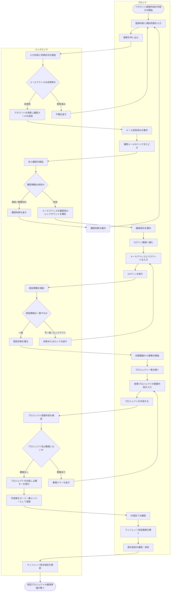

# ACT-001: アカウント登録〜初回プロジェクト作成

> **本アクティビティ図は「未認証ユーザーのアカウント新規作成からメール確認・ログイン・初回プロジェクト作成・ウィジェット設定までの一連の業務×システム処理」を俯瞰します。**

*種別 アクティビティ図 ・ ステータス ドラフト*

## 1. 目的

本フローが俯瞰する業務・システム処理と、詳細化元の業務ユースケース([UC-002](../../01_requirements/04_business_usecases/UC-002.md#UC-002) アカウント新規作成・[UC-003](../../01_requirements/04_business_usecases/UC-003.md#UC-003) 登録確認メール検証・[UC-001](../../01_requirements/04_business_usecases/UC-001.md#UC-001) ログイン)・シーケンス([SEQ-003](../../02_basic_design/03_sequences/SEQ-003.md#SEQ-003)・[SEQ-063](../../02_basic_design/03_sequences/SEQ-063.md#SEQ-063)・[SEQ-064](../../02_basic_design/03_sequences/SEQ-064.md#SEQ-064)・[SEQ-002](../../02_basic_design/03_sequences/SEQ-002.md#SEQ-002))との対応を示す。未認証ユーザーがアカウントを新規作成し、確認メールで本人確認を完了してログインし、初めてのプロジェクトを作成してウィジェット公開キーと表示設定を整えるまでを、業務主体をまたぐ一続きの流れとして俯瞰する。

## 2. 対象範囲

本フローの開始・終了条件と対象ロール・対象機能を示す。

| 項目 | 値 |
|----|----|
| 開始条件 | 未認証ユーザーがアカウント新規作成の手続きを開始したとき |
| 終了条件 | オーナーが初回プロジェクトのウィジェット公開キー・埋め込みコード・表示設定を確認できる状態になったとき |
| 対象ロール | 未認証ユーザー → アカウント作成後の一般ユーザー → プロジェクト作成後のオーナー |
| 対象機能 | アカウント新規作成・メール確認・ログイン・プロジェクト新規作成・ウィジェット設定 |

関連:

| 区分 | 参照 |
|----|----|
| 業務ユースケースID | [UC-002](../../01_requirements/04_business_usecases/UC-002.md#UC-002) ・ [UC-003](../../01_requirements/04_business_usecases/UC-003.md#UC-003) ・ [UC-001](../../01_requirements/04_business_usecases/UC-001.md#UC-001) |
| 関連 SEQ | [SEQ-003](../../02_basic_design/03_sequences/SEQ-003.md#SEQ-003) ・ [SEQ-063](../../02_basic_design/03_sequences/SEQ-063.md#SEQ-063) ・ [SEQ-064](../../02_basic_design/03_sequences/SEQ-064.md#SEQ-064) ・ [SEQ-002](../../02_basic_design/03_sequences/SEQ-002.md#SEQ-002) |
| 関連画面 | [SCR-002](../../02_basic_design/01_frontend/01_screens/SCR-002.md#SCR-002) ・ [SCR-018](../../02_basic_design/01_frontend/01_screens/SCR-018.md#SCR-018) ・ [SCR-001](../../02_basic_design/01_frontend/01_screens/SCR-001.md#SCR-001) ・ [SCR-004](../../02_basic_design/01_frontend/01_screens/SCR-004.md#SCR-004) ・ [SCR-005](../../02_basic_design/01_frontend/01_screens/SCR-005.md#SCR-005) ・ [SCR-011](../../02_basic_design/01_frontend/01_screens/SCR-011.md#SCR-011) |
| 関連 API / SYS | [API-001](../../02_basic_design/02_backend/03_apis/API-001.md#API-001) ・ [API-006](../../02_basic_design/02_backend/03_apis/API-006.md#API-006) ・ [API-002](../../02_basic_design/02_backend/03_apis/API-002.md#API-002) ・ [API-017](../../02_basic_design/02_backend/03_apis/API-017.md#API-017) ・ [API-018](../../02_basic_design/02_backend/03_apis/API-018.md#API-018) |

## 3. アクティビティ図

業務主体ごとのスイムレーンで、開始から終了までの処理と分岐を俯瞰する。

## 4. 処理フロー一覧

図の各処理を実行順に、実行主体と次処理・条件とともに一覧化する。

| No | 実行主体 | 処理 | 条件 | 次処理 | 備考 |
|----|----|----|----|----|----|
| 1 | 未認証ユーザー(Client Component) | アカウント新規作成の手続きを開始し、登録内容と規約同意を入力する | — | 2 | [SCR-002](../../02_basic_design/01_frontend/01_screens/SCR-002.md#SCR-002) |
| 2 | サーバー(Route Handler / Service 層) | 入力内容と同意状況を検証する | — | 3 | 検証内容は [API-001](../../02_basic_design/02_backend/03_apis/API-001.md#API-001) |
| 3 | サーバー(Service 層) | メールアドレスの未使用を判定する | — | 4 / 5 | 分岐は §5 |
| 4 | サーバー(Service 層) | アカウントを用意し確認メールを送信する | 未使用 | 6 | 個々の要求応答は [SEQ-003](../../02_basic_design/03_sequences/SEQ-003.md#SEQ-003) を参照 |
| 5 | サーバー(Service 層) | 不備の内容を返す | 使用済み / 入力不備 | 1 | 未認証ユーザーが再入力する |
| 6 | 未認証ユーザー(Client Component) | メール送信済みの案内を受け取り、確認メールのリンクをたどる | — | 7 | [SCR-018](../../02_basic_design/01_frontend/01_screens/SCR-018.md#SCR-018) |
| 7 | サーバー(Route Handler / Service 層) | 本人確認情報(確認トークン)の有効性を検証する | — | 8 | 検証内容は [API-006](../../02_basic_design/02_backend/03_apis/API-006.md#API-006) |
| 8 | サーバー(Service 層) | 確認情報の有効性を判定する | — | 9 / 10 | 分岐は §5 |
| 9 | サーバー(Service 層) | メールアドレスを確認済みにしアカウントを確定する | 有効 | 11 | 個々の要求応答は [SEQ-063](../../02_basic_design/03_sequences/SEQ-063.md#SEQ-063) を参照 |
| 10 | サーバー(Service 層) | 確認失敗を返す | 無効 / 期限切れ | 1 | 未認証ユーザーは新規登録からやり直す。再送は [SEQ-064](../../02_basic_design/03_sequences/SEQ-064.md#SEQ-064) を参照 |
| 11 | 未認証ユーザー(Client Component) | 確認成功の案内を受け取り、ログイン画面へ進んでメールアドレスとパスワードを入力する | — | 12 | [SCR-001](../../02_basic_design/01_frontend/01_screens/SCR-001.md#SCR-001) |
| 12 | サーバー(Route Handler / Service 層) | 認証情報を検証する | — | 13 | 検証内容は [API-002](../../02_basic_design/02_backend/03_apis/API-002.md#API-002) |
| 13 | サーバー(Service 層) | 認証情報の一致を判定する | — | 14 / 15 | 分岐は §5 |
| 14 | サーバー(Service 層) | 認証状態を確立する | 一致 | 16 | 個々の要求応答は [SEQ-002](../../02_basic_design/03_sequences/SEQ-002.md#SEQ-002) を参照 |
| 15 | サーバー(Service 層) | 失敗またはロックを返す | 不一致 / ロックアウト条件到達 | 11 | 未認証ユーザーが再入力する |
| 16 | ユーザー(Client Component) | 初期画面から業務を開始し、プロジェクト一覧を開く | — | 17 | [SCR-004](../../02_basic_design/01_frontend/01_screens/SCR-004.md#SCR-004) |
| 17 | ユーザー(Client Component) | 新規プロジェクトの登録内容(プロジェクト名・許可ドメイン・連絡先メール)を入力してプロジェクトを作成する | — | 18 | [SCR-005](../../02_basic_design/01_frontend/01_screens/SCR-005.md#SCR-005) |
| 18 | サーバー(Route Handler / Service 層) | プロジェクト登録内容を検証する | — | 19 | 検証内容は [API-017](../../02_basic_design/02_backend/03_apis/API-017.md#API-017) |
| 19 | サーバー(Service 層) | プロジェクト名の重複を判定する | — | 20 / 21 | 分岐は §5 |
| 20 | サーバー(Service 層) | プロジェクトを作成し公開キーを発行して作成者をオーナー兼メンバーとして登録する | 重複なし | 22 | 個々の要求応答は [API-017](../../02_basic_design/02_backend/03_apis/API-017.md#API-017) を参照 |
| 21 | サーバー(Service 層) | 重複エラーを返す | 重複あり | 17 | ユーザーが別名で再入力する |
| 22 | ユーザー(Client Component) | 作成完了を確認し、ウィジェット設定画面を開く | — | 23 | [SCR-011](../../02_basic_design/01_frontend/01_screens/SCR-011.md#SCR-011) |
| 23 | ユーザー(Client Component) | 表示設定(主色・表示位置・見出し・初期メッセージ)を確認・保存する | — | 24 | [SCR-011](../../02_basic_design/01_frontend/01_screens/SCR-011.md#SCR-011) |
| 24 | サーバー(Route Handler / Service 層) | ウィジェット表示設定を更新し公開中のウィジェットへ反映する | — | 終了 | 個々の要求応答は [API-018](../../02_basic_design/02_backend/03_apis/API-018.md#API-018) を参照 |

## 5. 分岐条件

図中の分岐ノードごとに、遷移先を決める条件を示す。

| 分岐 | 条件 | 遷移先 | 備考 |
|----|----|----|----|
| メールアドレス未使用判定 | 入力されたメールアドレスが未使用 | アカウントを用意し確認メール送信(No.4) | — |
| メールアドレス未使用判定 | 入力内容に不備、またはメールアドレスが使用済み | 不備を返し再入力(No.5) | 未認証ユーザーは別のメールアドレスの利用を促される |
| 確認情報の有効性判定 | 確認トークンが有効期限内かつ未使用 | 確認済みにしアカウント確定(No.9) | — |
| 確認情報の有効性判定 | 確認トークンが無効 / 期限切れ / 使用済み | 確認失敗を返す(No.10) | 未認証ユーザーは新規登録からやり直す、または再送を依頼できる |
| 認証情報の一致判定 | メールアドレスとパスワードが一致 | 認証状態を確立(No.14) | 未同意の規約改定がある場合は初期画面の前に再同意を求める |
| 認証情報の一致判定 | 認証情報が不一致 | 失敗を返す(No.15・ロックアウト条件未到達) | メールアドレスの存在有無は区別しない共通文言 |
| 認証情報の一致判定 | 短時間に認証失敗が一定回数継続 | 失敗を返す(No.15・ロックアウト) | ロックアウト条件・解除条件は [システム仕様書 §3](../../02_basic_design/07_system-spec.md#3-タイムアウトセッション認証) 参照 |
| プロジェクト名重複判定 | 入力されたプロジェクト名が重複しない | プロジェクトを作成し公開キー発行(No.20) | 作成者を当該プロジェクトのオーナー兼メンバーとして自動登録 |
| プロジェクト名重複判定 | 入力されたプロジェクト名が既存プロジェクトと重複 | 重複エラーを返す(No.21) | ユーザーは別名で再入力する |

## 6. 後続工程への引き継ぎ事項

詳細シーケンス(DSQ)・テスト設計へ渡す確認観点を箇条書きで示す。

- メール確認トークンの有効期限境界(期限直前 / 直後)と使用済みトークン再利用時の失敗種別の切り分け([システム仕様書 §4](../../02_basic_design/07_system-spec.md#4-データ保持期間削除猶予)を参照)。
- ログイン連続失敗によるロックアウトの到達判定と解除条件([システム仕様書 §3](../../02_basic_design/07_system-spec.md#3-タイムアウトセッション認証)を参照)、およびロック中に初回プロジェクト作成へ進めない状態の確認。
- プロジェクト新規作成時の信頼度・関連度しきい値未入力時にグローバル既定値が適用される経路と、ウィジェット設定画面での適用元表示の整合。
- アカウント新規作成〜初回プロジェクト作成〜ウィジェット設定の一連の流れが中断された場合(離脱・再ログイン)に、各工程の再開始点が正しく戻ることの確認。
