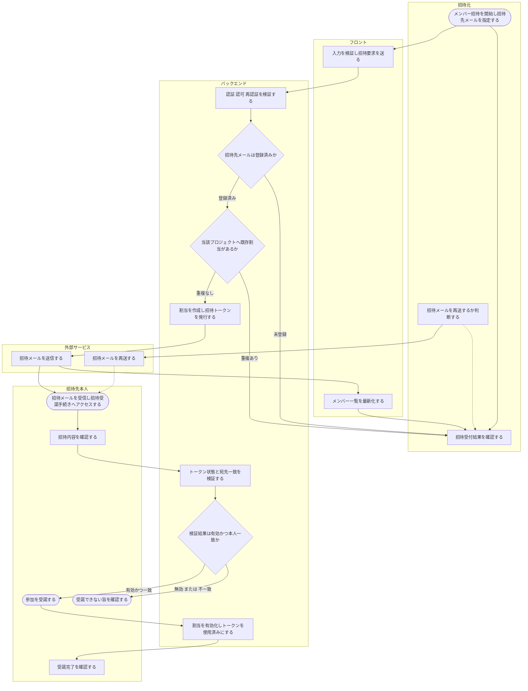

# ACT-003: メンバー招待〜有効化 アクティビティ

> **本アクティビティ図は「オーナー / メンバーによるメンバー招待の送信から、招待された本人による招待メール受信・トークン検証・プロジェクト参加受諾（割当有効化）まで」の業務×システム処理を俯瞰します。**

*種別 アクティビティ図 ・ ステータス ドラフト*

## 1. 目的

本フローが俯瞰する業務・システム処理と、詳細化元の業務ユースケース([UC-019](../../01_requirements/04_business_usecases/UC-019.md#UC-019) メンバー招待・[UC-006](../../01_requirements/04_business_usecases/UC-006.md#UC-006) 招待受諾)・シーケンス([SEQ-047](../../02_basic_design/03_sequences/SEQ-047.md#SEQ-047)・[SEQ-072](../../02_basic_design/03_sequences/SEQ-072.md#SEQ-072)・[SEQ-073](../../02_basic_design/03_sequences/SEQ-073.md#SEQ-073))との対応を示す。招待は登録済みユーザー限定であり、本フローはアカウント新規作成を含まず、対象プロジェクトへの参加割り当てのみを扱う。

## 2. 対象範囲

本フローの開始・終了条件と対象ロール・対象機能を示す。

| 項目 | 値 |
|----|----|
| 開始条件 | オーナー / メンバーがメンバー招待を開始し、招待先のメールアドレスを指定したとき |
| 終了条件 | 招待された本人が参加を受諾し、対象プロジェクトへの割当が有効になったとき(または、招待先未登録・重複・権限不足・トークン無効等で受諾に至らず終了したとき) |
| 対象ロール | オーナー / メンバー(招待元)・招待された既存ユーザー(招待先本人) |
| 対象機能 | メンバー招待送信・招待メール送信 / 再送・招待トークン検証・プロジェクト参加受諾(割当有効化) |

関連:

| 区分 | 参照 |
|----|----|
| 業務ユースケースID | [UC-019](../../01_requirements/04_business_usecases/UC-019.md#UC-019) ・ [UC-006](../../01_requirements/04_business_usecases/UC-006.md#UC-006) |
| 関連 SEQ | [SEQ-047](../../02_basic_design/03_sequences/SEQ-047.md#SEQ-047) ・ [SEQ-048](../../02_basic_design/03_sequences/SEQ-048.md#SEQ-048) ・ [SEQ-072](../../02_basic_design/03_sequences/SEQ-072.md#SEQ-072) ・ [SEQ-073](../../02_basic_design/03_sequences/SEQ-073.md#SEQ-073) |
| 関連画面 | [SCR-014](../../02_basic_design/01_frontend/01_screens/SCR-014.md#SCR-014) ・ [SCR-023](../../02_basic_design/01_frontend/01_screens/SCR-023.md#SCR-023) |
| 関連 API / SYS | [API-021](../../02_basic_design/02_backend/03_apis/API-021.md#API-021) ・ [API-007](../../02_basic_design/02_backend/03_apis/API-007.md#API-007) ・ [API-008](../../02_basic_design/02_backend/03_apis/API-008.md#API-008) |

## 3. アクティビティ図

業務主体ごとのスイムレーンで、招待送信から参加受諾までの処理と分岐を俯瞰する。

## 4. 処理フロー一覧

図の各処理を実行順に、実行主体と次処理・条件とともに一覧化する。

| No | 実行主体 | 処理 | 条件 | 次処理 | 備考 |
|----|----|----|----|----|----|
| 1 | オーナー / メンバー(招待元) | メンバー招待を開始し招待先メールアドレスを指定する | — | 2 | [SCR-014](../../02_basic_design/01_frontend/01_screens/SCR-014.md#SCR-014) EVT-03 |
| 2 | フロント(Client Component) | 入力を検証し招待要求を送る | 入力形式 OK | 3 | 検証 NG は受付を中止しその場で指摘 |
| 3 | サーバー(Route Handler / Service 層) | 認証・認可・再認証を検証する | — | 4 | 権限不足・再認証失敗は受付を中止 |
| 4 | サーバー(Service 層) | 招待先メールが登録済みユーザーに一致するか判定する | — | 5 / 9 | [API-021](../../02_basic_design/02_backend/03_apis/API-021.md#API-021) |
| 5 | サーバー(Service 層) | 当該プロジェクトへの既存割当(重複)を判定する | 招待先が登録済み | 6 / 9 | 分岐は §5 |
| 6 | サーバー(Service 層) | 対象プロジェクトへの割当を作成し招待トークンを発行する | 重複なし | 7 | 有効期限は[システム仕様書 §4](../../02_basic_design/07_system-spec.md#4-データ保持期間削除猶予) |
| 7 | 外部サービス(メール配信) | 招待先本人へ招待メールを送信する | — | 8, 12 | 個々の要求応答は [SEQ-047](../../02_basic_design/03_sequences/SEQ-047.md#SEQ-047) を参照 |
| 8 | フロント(Client Component) | メンバー一覧を最新化する | — | 9 | — |
| 9 | オーナー / メンバー(招待元) | 招待受付結果を確認する | — | 終了 / 10 | 成功・失敗いずれも本人が結果を確認して終了する |
| 10 | オーナー / メンバー(招待元) | 招待先本人が案内を未確認の場合、招待メールを再送するか判断する | 招待中(本人未有効化)のとき | 11 / 終了 | [SCR-014](../../02_basic_design/01_frontend/01_screens/SCR-014.md#SCR-014) EVT-04 |
| 11 | 外部サービス(メール配信) | 招待メールを再送する | 再送を指示した場合 | 12 | 個々の要求応答は [SEQ-048](../../02_basic_design/03_sequences/SEQ-048.md#SEQ-048) を参照 |
| 12 | 招待先本人 | 招待メールを受信し招待受諾手続きへアクセスする | — | 13 | [SCR-023](../../02_basic_design/01_frontend/01_screens/SCR-023.md#SCR-023) EVT-01 |
| 13 | 招待先本人 | 招待内容(プロジェクト名・招待元オーナー)を確認する | — | 14 | [API-007](../../02_basic_design/02_backend/03_apis/API-007.md#API-007) |
| 14 | サーバー(Service 層) | 招待トークンの状態(期限・使用済み)と宛先一致を検証する | — | 15 | [IPO-011](../04_ipo/IPO-011.md#IPO-011) |
| 15 | サーバー(Service 層) | 検証結果が有効かつ本人一致かを判定する | — | 16 / 18 | 分岐は §5 |
| 16 | 招待先本人 | 参加を受諾する | トークン有効かつ本人一致 | 17 | [SCR-023](../../02_basic_design/01_frontend/01_screens/SCR-023.md#SCR-023) EVT-04 |
| 17 | サーバー(Service 層) | 対象プロジェクトへの割当を有効化しトークンを使用済みにする | — | 終了 | [API-008](../../02_basic_design/02_backend/03_apis/API-008.md#API-008)。同一トランザクション |
| 18 | 招待先本人 | 受諾できない旨(トークン無効 / 期限切れ / 既使用 / 本人不一致)を確認する | トークン無効 または 本人不一致 | 終了 | 復旧手段(招待元への再送依頼)を案内 |

## 5. 分岐条件

図中の分岐ノードごとに、遷移先を決める条件を示す。

| 分岐 | 条件 | 遷移先 | 備考 |
|----|----|----|----|
| 招待先メールの登録有無 | 招待先メールに一致する登録済みユーザーが存在する | 重複判定へ(No.5) | [API-021](../../02_basic_design/02_backend/03_apis/API-021.md#API-021) |
| 招待先メールの登録有無 | 一致する登録済みユーザーが存在しない | 招待受付結果へ(No.9・招待未成立) | 先にアカウント登録(独立サインアップ)を促す。アカウント新規作成は本フローの対象外 |
| 既存割当の重複判定 | 当該プロジェクトへの割当が存在しない | 割当作成・招待メール送信へ(No.6) | — |
| 既存割当の重複判定 | 当該プロジェクトへの割当が既に存在する | 招待受付結果へ(No.9・招待未成立) | 重複した招待は成立させない |
| 招待トークン検証結果 | トークンが有効かつ宛先メールとログイン中ユーザーが一致する | 参加受諾へ(No.16) | [IPO-011](../04_ipo/IPO-011.md#IPO-011) |
| 招待トークン検証結果 | トークンが無効 / 期限切れ / 使用済み、または本人不一致 | 受諾不可の案内へ(No.18) | 未ログイン時は招待先メールでのログインを促し受諾手続きへ戻す |

## 6. 後続工程への引き継ぎ事項

詳細シーケンス(DSQ)・テスト設計へ渡す確認観点を箇条書きで示す。

- 招待メール送信直後に招待先本人が未ログインの場合の、ログイン誘導からの受諾手続き復帰(招待先メールアカウントでのログインを要する)の境界確認。
- 招待メール再送時に旧トークンを失効させたうえで新トークンを発行する順序と、再送前後で受諾手続き中の旧リンクを踏んだ場合の挙動確認。
- 招待トークンの状態検証における使用済み判定と期限切れ判定の優先順位(使用済みを先に評価する)の境界値確認([IPO-011](../04_ipo/IPO-011.md#IPO-011))。
- 招待作成(No.6)と参加受諾(No.17)の間でプロジェクトが削除された場合など、割当行が存在しない整合異常時の扱いの確認。
