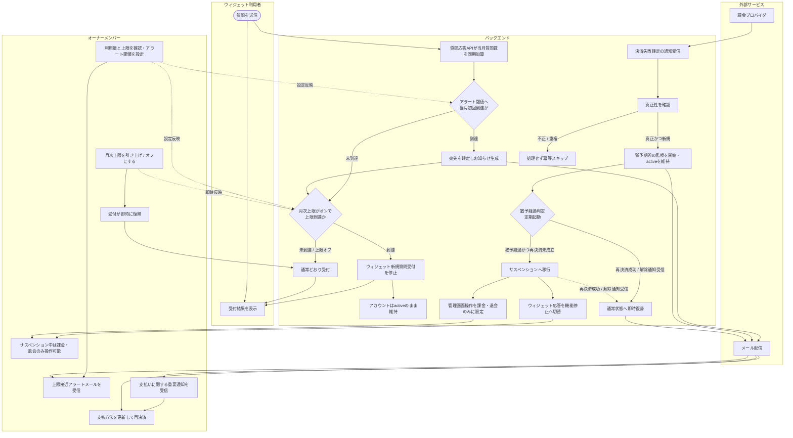

# ACT-004: 利用量超過〜上限対応 アクティビティ

> **本アクティビティ図は「質問数の利用量計測から上限接近アラート・上限到達によるウィジェット受付停止、決済失敗によるサスペンション移行、支払い回復による復旧まで」の業務×システム処理を俯瞰します。**

*種別 アクティビティ図 ・ ステータス ドラフト*

## 1. 目的

本フローが俯瞰する業務・システム処理と、詳細化元の業務ユースケース([UC-052](../../01_requirements/04_business_usecases/UC-052.md#UC-052)・[UC-053](../../01_requirements/04_business_usecases/UC-053.md#UC-053)・[UC-055](../../01_requirements/04_business_usecases/UC-055.md#UC-055))との対応を 1〜2 文で示す。質問応答 API による同期加算を起点に、上限接近アラート([SYS-017](../../02_basic_design/02_backend/01_system/SYS-017.md#SYS-017))・上限到達時のウィジェット受付停止([SYS-018](../../02_basic_design/02_backend/01_system/SYS-018.md#SYS-018))・決済失敗からサスペンションへの移行と復旧([SYS-020](../../02_basic_design/02_backend/01_system/SYS-020.md#SYS-020))を、オーナー・メンバー・ウィジェット利用者・システムの主体をまたいで 1 枚に俯瞰する。

## 2. 対象範囲

本フローの開始・終了条件と対象ロール・対象機能を示す。

| 項目 | 値 |
|----|----|
| 開始条件 | ウィジェット利用者の質問送信により当月質問数が加算されたとき、または課金プロバイダから決済失敗確定の通知を受信したとき |
| 終了条件 | 上限接近アラート通知・上限到達によるウィジェット受付停止・決済失敗によるサスペンション移行のいずれかが確定し、翌月リセット・上限設定変更・支払い回復のいずれかで通常状態へ復旧したとき |
| 対象ロール | オーナー、当該プロジェクトのメンバー、ウィジェット利用者(サイト訪問者) |
| 対象機能 | 利用量計測、上限接近アラート通知、上限到達時のウィジェット受付停止、決済失敗猶予監視、サスペンション移行、通常状態への復旧 |

関連:

| 区分 | 参照 |
|----|----|
| 業務ユースケースID | [UC-052](../../01_requirements/04_business_usecases/UC-052.md#UC-052)・[UC-053](../../01_requirements/04_business_usecases/UC-053.md#UC-053)・[UC-055](../../01_requirements/04_business_usecases/UC-055.md#UC-055) |
| 関連 SEQ | [SEQ-094](../../02_basic_design/03_sequences/SEQ-094.md#SEQ-094)・[SEQ-097](../../02_basic_design/03_sequences/SEQ-097.md#SEQ-097)・[SEQ-098](../../02_basic_design/03_sequences/SEQ-098.md#SEQ-098) |
| 関連画面 | [SCR-026](../../02_basic_design/01_frontend/01_screens/SCR-026.md#SCR-026)・[SCR-027](../../02_basic_design/01_frontend/01_screens/SCR-027.md#SCR-027)・[SCR-028](../../02_basic_design/01_frontend/01_screens/SCR-028.md#SCR-028) |
| 関連 API / SYS | [SYS-017](../../02_basic_design/02_backend/01_system/SYS-017.md#SYS-017)・[SYS-018](../../02_basic_design/02_backend/01_system/SYS-018.md#SYS-018)・[SYS-020](../../02_basic_design/02_backend/01_system/SYS-020.md#SYS-020)・[API-038](../../02_basic_design/02_backend/03_apis/API-038.md#API-038)・[API-045](../../02_basic_design/02_backend/03_apis/API-045.md#API-045)・[API-046](../../02_basic_design/02_backend/03_apis/API-046.md#API-046)・[API-047](../../02_basic_design/02_backend/03_apis/API-047.md#API-047) |

## 3. アクティビティ図

業務主体ごとのスイムレーンで、開始から終了までの処理と分岐を俯瞰する。

## 4. 処理フロー一覧

図の各処理を実行順に、実行主体と次処理・条件とともに一覧化する。

| No | 実行主体 | 処理 | 条件 | 次処理 | 備考 |
|----|----|----|----|----|----|
| 1 | ウィジェット利用者(Client Component) | 質問を送信する | — | 2 | — |
| 2 | サーバー(Route Handler / Service 層) | 質問応答 API が当月質問数を同期加算する | — | 3 / 5 | 個々の要求応答は [SEQ-097](../../02_basic_design/03_sequences/SEQ-097.md#SEQ-097) を参照 |
| 3 | サーバー(Service 層) | アラート閾値への当月初回到達を判定する | 選択済み閾値と当月質問数を照合 | 4 / 5 | 分岐は §5。個々の処理は [SYS-017](../../02_basic_design/02_backend/01_system/SYS-017.md#SYS-017) |
| 4 | サーバー(Service 層) | 宛先(オーナー + 有効メンバー)を確定し受信箱お知らせを生成する | 当月初回到達のとき | 5 | メール送信は外部サービス(No.10) |
| 5 | サーバー(Service 層) | 月次上限件数と当月の課金対象件数を照合し上限到達を判定する | 月次上限がオンのとき | 6 / 7 | 分岐は §5。個々の処理は [SYS-018](../../02_basic_design/02_backend/01_system/SYS-018.md#SYS-018) |
| 6 | サーバー(Service 層) | ウィジェット新規質問受付を停止し安全な定型文を返す | 上限到達のとき | 12 | 課金アカウントは `active` を維持 |
| 7 | サーバー(Service 層) | 通常どおり質問を受け付ける | 未到達 / 上限オフのとき | 12 | — |
| 8 | 外部サービス(課金プロバイダ) | 決済失敗確定の通知を送信する | — | 9 | — |
| 9 | サーバー(Service 層) | 通知の真正性・新規性を確認する | — | 10 / 通知なしで終了 | 検証不能 / 重複は処理せず冪等スキップ |
| 10 | サーバー(Service 層) | 猶予期間の監視を開始し課金アカウントを `active` のまま維持する | 真正かつ新規のとき | 11 | 個々の処理は [SYS-020](../../02_basic_design/02_backend/01_system/SYS-020.md#SYS-020) |
| 11 | サーバー(Service 層) | オーナーへ支払いに関する重要通知を送る | 猶予監視を開始したとき | 13 | メール配信は外部サービス |
| 12 | オーナー / 当該プロジェクトのメンバー | 利用量と上限を確認し、上限引き上げ / オフへ変更する | 上限接近アラートまたは受付停止を認識したとき | 7 | 反映は即時([SCR-026](../../02_basic_design/01_frontend/01_screens/SCR-026.md#SCR-026)・[SCR-027](../../02_basic_design/01_frontend/01_screens/SCR-027.md#SCR-027)) |
| 13 | サーバー(定期処理) | 猶予中の課金アカウントについて猶予経過を判定する | 定期起動時 | 14 / 15 | 分岐は §5 |
| 14 | サーバー(Service 層) | 課金アカウントをサスペンションへ移行する | 猶予経過かつ再決済未成立のとき | 16 | ウィジェット応答・管理画面操作範囲を切替 |
| 15 | サーバー(Service 層) | 通常状態へ即時復帰させる | 猶予中に再決済成功の通知を受けたとき | 終了 | 猶予を解除し `active` を維持 |
| 16 | サーバー(Service 層) | ウィジェット応答を機能停止へ切替え、管理画面操作を課金・退会のみへ限定する | サスペンション移行後 | 17 | 対象は当該オーナーが作成した全プロジェクト |
| 17 | オーナー | 支払方法を更新し再決済する | サスペンション中 | 18 | 操作可能範囲は課金・退会のみ |
| 18 | サーバー(Service 層) | 再決済成功または解除の通知を受け通常状態へ即時復帰させる | 検証を通過した新規通知のとき | 終了 | 猶予中・サスペンション中いずれからも即時復帰 |

## 5. 分岐条件

図中の分岐ノードごとに、遷移先を決める条件を示す。

| 分岐 | 条件 | 遷移先 | 備考 |
|----|----|----|----|
| アラート閾値到達判定 | 選択済みアラート閾値([システム仕様書 §2](../../02_basic_design/07_system-spec.md#2-課金利用量上限))へ当月初めて到達 | 宛先確定・お知らせ生成(No.4) | 当月内の再到達・閾値未選択は通知なし |
| アラート閾値到達判定 | 未到達、または既に当月通知済み | 上限到達判定(No.5)へ合流 | — |
| 上限到達判定 | 月次上限がオンで課金対象件数が上限件数(100%)に到達 | ウィジェット新規質問受付を停止(No.6) | しきい値の正本は [システム仕様書 §2](../../02_basic_design/07_system-spec.md#2-課金利用量上限)。支払方法の有無に関わらず停止 |
| 上限到達判定 | 未到達、または上限オフ | 通常受付を継続(No.7) | — |
| 受付停止の解除 | 翌月リセット / 上限引き上げ / 上限オフのいずれか | 通常受付を継続(No.7) | いずれも即時反映 |
| 決済通知の真正性・新規性判定 | 署名検証を通過した新規通知 | 猶予監視開始(No.10) | 検証不能 / 重複は処理せず冪等スキップ |
| 猶予経過判定 | 猶予期間([システム仕様書 §4](../../02_basic_design/07_system-spec.md#4-データ保持期間削除猶予))を経過し再決済未成立 | サスペンション移行(No.14) | 判定は定期起動 |
| 猶予経過判定 | 猶予中に再決済成功の通知を受信 | 通常状態へ復帰(No.15) | サスペンション移行前に復帰する場合を含む |
| サスペンション中の復帰判定 | 再決済成功または解除の通知を受信 | 通常状態へ即時復帰(No.18) | 猶予中・サスペンション中いずれからも同一契機で復帰 |

## 6. 後続工程への引き継ぎ事項

詳細シーケンス(DSQ)・テスト設計へ渡す確認観点を箇条書きで示す。

- 上限接近アラートの当月初回到達判定(受信者ごとの重複抑制)と、上限到達によるウィジェット受付停止判定がほぼ同時に発生した場合の処理順序・整合性の確認([IPO-005](../04_ipo/IPO-005.md#IPO-005)・[IPO-006](../04_ipo/IPO-006.md#IPO-006))。
- 猶予経過によるサスペンション移行確定と、再決済成功・解除通知による即時復帰確定がほぼ同時に到達した場合の競合制御(復帰を優先する順序の実装確認、[IPO-003](../04_ipo/IPO-003.md#IPO-003))。
- 上限到達によるウィジェット受付停止(課金アカウントは `active` を維持)と、決済失敗によるサスペンション(課金アカウントは `suspended` へ移行)が同一オーナー配下で重複して発生し得るケースの表示・応答整合の確認。
- サスペンション中の管理画面操作制限(課金・退会のみ)の範囲が [権限設計](../../02_basic_design/04_permissions/index.md) と一致することの確認。
