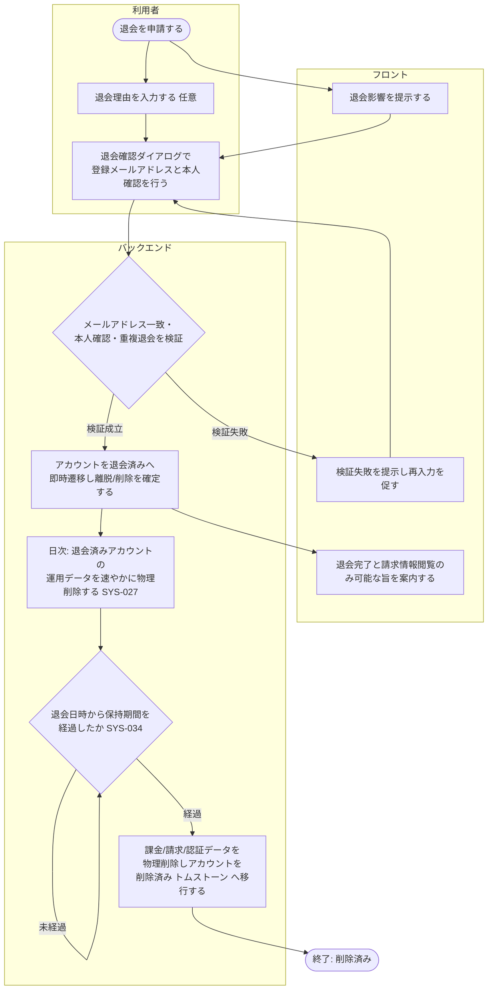

# ACT-005: 退会〜データ削除 アクティビティ

> **本アクティビティ図は「アカウント利用者の退会申請・確認・即時実行から、保持期間経過後の物理削除までの業務×システム処理」を俯瞰します。**

*種別 アクティビティ図 ・ ステータス ドラフト*

## 1. 目的

本フローが俯瞰する業務・システム処理と、詳細化元の業務ユースケース([UC-022](../../01_requirements/04_business_usecases/UC-022.md#UC-022)・[UC-066](../../01_requirements/04_business_usecases/UC-066.md#UC-066))・シーケンス([SEQ-065](../../02_basic_design/03_sequences/SEQ-065.md#SEQ-065)・[SEQ-089](../../02_basic_design/03_sequences/SEQ-089.md#SEQ-089))との対応を示す。アカウント利用者による退会の申請・影響確認・即時実行(同期)と、退会済みアカウントが所有するプロジェクトの運用データの速やかな物理削除・保持期間経過後の課金/請求/認証データの物理削除(日次バッチ)までを 1 枚で俯瞰し、個々の API 要求応答・DB 読み書きの詳細は [DSQ-006](../08_sequences/DSQ-006.md#DSQ-006) に委ねる。

## 2. 対象範囲

本フローの開始・終了条件と対象ロール・対象機能を示す。

| 項目 | 値 |
|----|----|
| 開始条件 | アカウント利用者が退会画面で退会を申請したとき |
| 終了条件 | 保持期間経過後の課金・請求・認証データの物理削除が完了し、アカウントが削除済み(トムストーン)へ移行したとき |
| 対象ロール | アカウント利用者(オーナー・メンバーいずれも対象) |
| 対象機能 | 退会申請・影響確認・本人確認・即時退会確定・運用データの速やかな物理削除・保持期間経過後の課金/請求/認証データの物理削除 |

関連:

| 区分 | 参照 |
|----|----|
| 業務ユースケースID | [UC-022](../../01_requirements/04_business_usecases/UC-022.md#UC-022) ・ [UC-066](../../01_requirements/04_business_usecases/UC-066.md#UC-066) |
| 関連 SEQ | [SEQ-065](../../02_basic_design/03_sequences/SEQ-065.md#SEQ-065) ・ [SEQ-089](../../02_basic_design/03_sequences/SEQ-089.md#SEQ-089) |
| 関連画面 | [SCR-019](../../02_basic_design/01_frontend/01_screens/SCR-019.md#SCR-019) |
| 関連 API / SYS | [API-056](../../02_basic_design/02_backend/03_apis/API-056.md#API-056) ・ [SYS-027](../../02_basic_design/02_backend/01_system/SYS-027.md#SYS-027) ・ [SYS-034](../../02_basic_design/02_backend/01_system/SYS-034.md#SYS-034) |

## 3. アクティビティ図

業務主体ごとのスイムレーンで、退会申請から保持期間経過後の物理削除完了までの処理と分岐を俯瞰する。

## 4. 処理フロー一覧

図の各処理を実行順に、実行主体と次処理・条件とともに一覧化する。

| No | 実行主体 | 処理 | 条件 | 次処理 | 備考 |
|----|----|----|----|----|----|
| 1 | 利用者(Client Component) | 退会を申請する | — | 2 | [SCR-019](../../02_basic_design/01_frontend/01_screens/SCR-019.md#SCR-019) EVT-02 |
| 2 | サーバー(Route Handler / Service 層) | 退会による影響(離脱・削除・請求情報閲覧のみ可能・取り消し不可)を提示する | — | 3 | — |
| 3 | 利用者(Client Component) | 退会理由(任意)を入力し、確認ダイアログで登録メールアドレス一致・本人確認(再認証)を行う | — | 4 | [SCR-019](../../02_basic_design/01_frontend/01_screens/SCR-019.md#SCR-019) EVT-03 |
| 4 | サーバー(Route Handler / Service 層) | メールアドレス一致・本人確認・重複退会を検証する | — | 5 / 6 | 分岐は §5。個々の要求応答は [DSQ-006](../08_sequences/DSQ-006.md#DSQ-006) を参照 |
| 5 | サーバー(Service 層) | アカウントを退会済みへ即時遷移し、参加プロジェクトからの離脱と作成プロジェクトの削除を確定する | 検証成立 | 7 | [API-056](../../02_basic_design/02_backend/03_apis/API-056.md#API-056) |
| 6 | フロント(Client Component) | 検証失敗を提示し再入力を促す | 検証失敗 | 3 | — |
| 7 | フロント(Client Component) | 退会完了と、以後は請求情報の閲覧のみ可能である旨を案内する | — | 終了(退会確定) | — |
| 8 | サーバー(Service 層・日次バッチ) | 退会済みアカウントが所有するプロジェクトの運用データを速やかに物理削除する | 日次起動 | 9 | [SYS-027](../../02_basic_design/02_backend/01_system/SYS-027.md#SYS-027) |
| 9 | サーバー(Service 層・日次バッチ) | 退会日時から保持期間を経過したかを判定する | 日次起動 | 10 / 9 | [SYS-034](../../02_basic_design/02_backend/01_system/SYS-034.md#SYS-034)。保持期間の正本は[システム仕様書 §4](../../02_basic_design/07_system-spec.md#4-データ保持期間削除猶予) |
| 10 | サーバー(Service 層・日次バッチ) | 課金・請求・認証データを物理削除し、アカウントを削除済み(トムストーン)へ移行する | 保持期間経過 | 終了(削除済み) | [SYS-034](../../02_basic_design/02_backend/01_system/SYS-034.md#SYS-034) |

## 5. 分岐条件

図中の分岐ノードごとに、遷移先を決める条件を示す。

| 分岐 | 条件 | 遷移先 | 備考 |
|----|----|----|----|
| メールアドレス一致・本人確認・重複退会の検証 | 登録メールアドレスと一致し、本人確認(再認証)が成立し、既に退会済み/削除済みでない | 退会確定(No.5) | [API-056](../../02_basic_design/02_backend/03_apis/API-056.md#API-056) |
| メールアドレス一致・本人確認・重複退会の検証 | メールアドレス不一致 / 本人確認失敗 / 既に退会済み・削除済みで重複 | 検証失敗を提示し再入力(No.6) | いずれの場合も退会は実行しない |
| 保持期間経過判定 | 退会日時から保持期間([システム仕様書 §4](../../02_basic_design/07_system-spec.md#4-データ保持期間削除猶予))を未経過 | 翌日以降の日次判定へ持ち越し(No.9) | 判定は日次で再実行 |
| 保持期間経過判定 | 退会日時から保持期間を経過 | 課金/請求/認証データの物理削除・トムストーン移行(No.10) | 課金アカウント状態の意味は[状態モデル §2](../../02_basic_design/08_state-model.md#2-課金アカウント状態) |

## 6. 後続工程への引き継ぎ事項

詳細シーケンス(DSQ)・テスト設計へ渡す確認観点を箇条書きで示す。

- 運用データの速やかな物理削除(SYS-027)と保持期間経過後の課金/請求/認証データ物理削除(SYS-034)の 2 段階のトランザクション境界・失敗時の再評価の扱いは [DSQ-006](../08_sequences/DSQ-006.md#DSQ-006) を参照。
- 退会確定(同期)から運用データ削除(日次)までの間に発生しうる長時間ジョブ(FAQ 一括取り込み等)の保護待機は [DSQ-006](../08_sequences/DSQ-006.md#DSQ-006) が保持する分岐であり本図では俯瞰のみに留める。
- 保持期間経過判定の境界値(等号の扱い)と、削除対象なしで正常終了するケースの確認。
