# CLS-001: ウィジェット回答機能 クラス図

> **本クラス図は「ウィジェット利用者の質問送信から AI 回答可否判定・回答/未解決登録・回答フィードバックまでを実装する Route Handler・Service・Gateway・Repository・DTO/Entity の構成と責務」を定義します。**

*種別 クラス図 ・ ステータス ドラフト*

| 項目 | 値 |
|----|----|
| CLS ID | CLS-001 |
| 業務ユースケースID | [UC-041](../../01_requirements/04_business_usecases/UC-041.md#UC-041) ・ [UC-042](../../01_requirements/04_business_usecases/UC-042.md#UC-042) ・ [UC-047](../../01_requirements/04_business_usecases/UC-047.md#UC-047) ・ [UC-048](../../01_requirements/04_business_usecases/UC-048.md#UC-048) ・ [UC-083](../../01_requirements/04_business_usecases/UC-083.md#UC-083) |
| 関連 API | [API-038](../../02_basic_design/02_backend/03_apis/API-038.md#API-038) ・ [API-039](../../02_basic_design/02_backend/03_apis/API-039.md#API-039) ・ [API-069](../../02_basic_design/02_backend/03_apis/API-069.md#API-069) ・ [API-057](../../02_basic_design/02_backend/03_apis/API-057.md#API-057) |
| 関連画面 | [SCR-030](../../02_basic_design/01_frontend/01_screens/SCR-030.md#SCR-030) |
| 関連テーブル | [TBL-025](../../02_basic_design/02_backend/04_database/TBL-025.md#TBL-025) ・ [TBL-016](../../02_basic_design/02_backend/04_database/TBL-016.md#TBL-016) ・ [TBL-017](../../02_basic_design/02_backend/04_database/TBL-017.md#TBL-017) ・ [TBL-006](../../02_basic_design/02_backend/04_database/TBL-006.md#TBL-006) ・ [TBL-020](../../02_basic_design/02_backend/04_database/TBL-020.md#TBL-020) ・ [TBL-031](../../02_basic_design/02_backend/04_database/TBL-031.md#TBL-031) |
| 関連 SYS | — |

## 1. 目的

本クラス図は、ウィジェット質問送信([API-038](../../02_basic_design/02_backend/03_apis/API-038.md#API-038))を中心とする回答機能を Next.js(App Router)+ Repository 層のレイヤーへ配置し、実装者がクラス構成・責務・シグネチャ・データ構造の境界を迷わず組み立てられる粒度を確定する。依存方向は内向き(Route Handler → Service → Gateway / Repository → D1)に固定し、逆流させない。

## 2. 対象範囲

本機能で扱うレイヤーと、別 CLS・別工程へ委ねる対象外を明示する。

| 区分 | 対象 |
|----|----|
| 対象機能 | 質問送信・AI 回答可否判定・回答/未解決登録([API-038](../../02_basic_design/02_backend/03_apis/API-038.md#API-038))・回答文 PII マスキング([RULE-024](../../01_requirements/01_business_requirement/08_rule.md#RULE-024))・未解決質問登録([API-039](../../02_basic_design/02_backend/03_apis/API-039.md#API-039))・回答フィードバック([API-069](../../02_basic_design/02_backend/03_apis/API-069.md#API-069))・AI 推論 IF([API-057](../../02_basic_design/02_backend/03_apis/API-057.md#API-057)) |
| 対象レイヤー | Route Handler / Service / Gateway(AI 連携境界)/ Repository / ガード / DTO / Entity |
| 対象外 | ウィジェット起動([API-037](../../02_basic_design/02_backend/03_apis/API-037.md#API-037))・ウィジェット UI Component(SCR-030 側の Client Component)・非同期後処理(参照 FAQ 記録・未解決記録・利用量集計の Queue Consumer は [BAT-001](../05_batch/BAT-001.md#BAT-001))・AI しきい値設定の取得/更新([API-067](../../02_basic_design/02_backend/03_apis/API-067.md#API-067))・PII 検出・スコア算出・矛盾検出の内部アルゴリズム([IPO-001](../04_ipo/IPO-001.md#IPO-001) が担う。回答文 PII マスキングは工程配置を本図で示し、検出パターンの詳細は IPO-001) |

## 3. クラス図

レイヤーごとのクラスと依存方向を示す。上位から下位への一方向依存とし、AI 連携は Gateway インターフェース `AnswerProvider` を境界とする。

```mermaid
classDiagram
    class AskRouteHandler {
        +post(AskRequestDto) AskResponseDto
    }
    class InquiryRouteHandler {
        +post(InquiryRequestDto) InquiryResponseDto
    }
    class FeedbackRouteHandler {
        +post(FeedbackRequestDto) FeedbackResponseDto
    }
    class AnswerService {
        +ask(AskInput) AnswerResult
        +registerInquiry(InquiryInput) InquiryResult
        +recordFeedback(FeedbackInput) FeedbackResult
    }
    class PiiMasker {
        +mask(answerText) MaskResult
    }
    class AnswerProvider {
        +generate(AnswerRequest) ProviderResult
        +healthcheck() ProviderHealth
    }
    class WorkersAIAnswerProvider {
        +generate(AnswerRequest) ProviderResult
        +healthcheck() ProviderHealth
    }
    class RateLimitGuard {
        +check(GuardContext) GuardVerdict
    }
    class DomainGuard {
        +check(GuardContext) GuardVerdict
    }
    class UsageLimitGuard {
        +check(GuardContext) GuardVerdict
    }
    class QuestionLogRepository {
        +create(QuestionLogEntity) QuestionLogEntity
        +updateFeedback(id, FeedbackResult) QuestionLogEntity
        +findById(id) QuestionLogEntity
        +saveFaqRefs(id, FaqRef[]) void
    }
    class InquiryRepository {
        +create(InquiryEntity) InquiryEntity
        +findByIdempotencyKey(key) InquiryEntity
    }
    class FaqRepository {
        +searchCandidates(projectId, question) FaqEntity[]
    }
    class UsageMeterRepository {
        +increment(projectId, billingYm) UsageMeterEntity
    }
    class AiThresholdCacheRepository {
        +findByProject(projectId) AiThresholdEntity
    }
    class AskRequestDto
    class AskResponseDto
    class AnswerResult
    AskRouteHandler --> AskRequestDto
    AskRouteHandler --> AskResponseDto
    AskRouteHandler --> AnswerService
    InquiryRouteHandler --> AnswerService
    FeedbackRouteHandler --> AnswerService
    AnswerService --> RateLimitGuard
    AnswerService --> DomainGuard
    AnswerService --> UsageLimitGuard
    AnswerService --> AnswerProvider
    AnswerService --> PiiMasker
    AnswerService --> QuestionLogRepository
    AnswerService --> InquiryRepository
    AnswerService --> FaqRepository
    AnswerService --> UsageMeterRepository
    AnswerService --> AiThresholdCacheRepository
    AnswerService --> AnswerResult
    WorkersAIAnswerProvider ..|> AnswerProvider
```

## 4. クラス一覧

各クラスの種別(レイヤー)・責務・主なメソッドを一覧化する。処理ロジックの詳細は [IPO-001](../04_ipo/IPO-001.md#IPO-001)、相互作用の詳細は詳細シーケンス([DSQ-001](../08_sequences/DSQ-001.md#DSQ-001))へ委ねる。

| クラス名 | 種別 | 責務 | 主なメソッド | 備考 |
|----|----|----|----|----|
| AskRouteHandler | Route Handler(Controller 相当) | 質問送信要求を受理し DTO 変換・Service 呼び出し・応答整形を行う。回答/未解決の判別レスポンスを組み立てる | `post` | `app/api/widget/v1/ask/route.ts` 相当([API-038](../../02_basic_design/02_backend/03_apis/API-038.md#API-038)) |
| InquiryRouteHandler | Route Handler(Controller 相当) | 未解決質問登録要求を受理し冪等キー付きで Service へ委譲する | `post` | `app/api/widget/v1/inquiries/route.ts` 相当([API-039](../../02_basic_design/02_backend/03_apis/API-039.md#API-039)) |
| FeedbackRouteHandler | Route Handler(Controller 相当) | 回答フィードバック要求を受理し Service へ委譲する | `post` | `app/api/widget/v1/feedback/route.ts` 相当([API-069](../../02_basic_design/02_backend/03_apis/API-069.md#API-069)) |
| AnswerService | Service | しきい値解決・AI 呼び出し・回答可否判定・回答文 PII マスキングの適用・質問ログ/未解決質問の永続化を統括する。回答可否は信頼度(`confidence`)と関連度(候補最上位の全文検索スコア=`relevance`)の双方がしきい値以上のときのみ `answered` とし、`answered` 時は応答整形前に PiiMasker で回答文をマスクする。未回答時は質問ログと未解決質問を同一トランザクションで生成する | `ask` / `registerInquiry` / `recordFeedback` | 判定条件・スコア比較・マスキング順序の詳細は [IPO-001](../04_ipo/IPO-001.md#IPO-001)。しきい値の正本は [システム仕様書 §1](../../02_basic_design/07_system-spec.md#1-aiしきい値) |
| PiiMasker | Service(部品) | AI 回答生成後の回答文からメールアドレス・電話番号・クレジットカード番号を検出し種別ラベル付き伏字へ置換する。検出有無・検出種別を呼び出し元へ返す(氏名・住所は MVP 対象外・[FUT-07](../../04_future/FUT-07.md#FUT-07))| `mask` | AnswerProvider の外(上位)。基準は [RULE-024](../../01_requirements/01_business_requirement/08_rule.md#RULE-024)。検出パターン詳細は [IPO-001](../04_ipo/IPO-001.md#IPO-001) |
| AnswerProvider | Gateway(AI 連携境界・インターフェース) | 質問と候補 FAQ から回答生成・稼働確認を行う内部抽象 IF | `generate` / `healthcheck` | [API-057](../../02_basic_design/02_backend/03_apis/API-057.md#API-057) の IF 定義 |
| WorkersAIAnswerProvider | Gateway(AI 連携境界・実装) | Cloudflare Workers AI 経由で `AnswerProvider` を実装する(MVP) | `generate` / `healthcheck` | タイムアウト・エラーの外部連携仕様は [EIF-001](../06_external_if/EIF-001.md#EIF-001) |
| RateLimitGuard | ガード | オーナー単位のレート制限超過を判定する | `check` | 超過時は [ERR-009](../../02_basic_design/05_errors/ERR-009.md#ERR-009)。制限値の正本は [システム仕様書 §5](../../02_basic_design/07_system-spec.md#5-レート制限キャパシティ目安) |
| DomainGuard | ガード | 許可ドメイン(オリジン)照合を判定する | `check` | 不許可時は [ERR-027](../../02_basic_design/05_errors/ERR-027.md#ERR-027) |
| UsageLimitGuard | ガード | プロジェクト月次上限到達・支払方法ゲートによる受付停止を判定する | `check` | 判定結果は受付停止理由へ写像。停止条件の正本は [課金・請求設計 §2.1](../../02_basic_design/05_billing-design.md#21-停止状態とウィジェット応答一覧) |
| QuestionLogRepository | Repository | 質問ログの生成・照会・フィードバック更新・参照 FAQ 保存(D1) | `create` / `updateFeedback` / `findById` / `saveFaqRefs` | 物理項目対応は [DBP-001](../07_db_physical/DBP-001.md#DBP-001)([TBL-025](../../02_basic_design/02_backend/04_database/TBL-025.md#TBL-025) / [TBL-016](../../02_basic_design/02_backend/04_database/TBL-016.md#TBL-016)) |
| InquiryRepository | Repository | 未解決質問の生成・冪等キー照会(D1) | `create` / `findByIdempotencyKey` | [TBL-017](../../02_basic_design/02_backend/04_database/TBL-017.md#TBL-017)。`inquiry_code` 採番は [DBP-008](../07_db_physical/DBP-008.md#DBP-008) |
| FaqRepository | Repository | 候補 FAQ の全文検索・照会(D1 / FTS)。公開かつ当該プロジェクトの FAQ を全文検索し、一致スコア降順で上位 N 件を関連度スコア付きで返す | `searchCandidates` | 公開状態の FAQ を対象([TBL-006](../../02_basic_design/02_backend/04_database/TBL-006.md#TBL-006))。FTS は [TBL-030 `TP_FAQ_FTS`](../../02_basic_design/02_backend/04_database/TBL-030.md#TBL-030)。上位件数 N の正本は [システム仕様書](../../02_basic_design/07_system-spec.md) |
| UsageMeterRepository | Repository | 利用量計測(質問数)の加算(D1) | `increment` | プロジェクト × 請求年月([TBL-020](../../02_basic_design/02_backend/04_database/TBL-020.md#TBL-020)) |
| AiThresholdCacheRepository | Repository | プロジェクト単位 AI しきい値設定の照会(D1) | `findByProject` | 未登録時は既定値を使用([システム仕様書 §1](../../02_basic_design/07_system-spec.md#1-aiしきい値) / [TBL-031](../../02_basic_design/02_backend/04_database/TBL-031.md#TBL-031)) |

## 5. メソッド一覧

主要メソッドの目的・入出力・例外をシグネチャ粒度で定義する(実装本体は書かない)。入出力は論理型で示し、DTO ↔ Entity の変換は §6 に従う。

| クラス名 | メソッド名 | 目的 | 入力 | 出力 | 例外 | 備考 |
|----|----|----|----|----|----|----|
| AskRouteHandler | `post` | 質問送信要求を受理し回答/未解決/受付停止応答を返す | AskRequestDto | AskResponseDto | 検証エラー([ERR-001](../../02_basic_design/05_errors/ERR-001.md#ERR-001))・レート制限([ERR-009](../../02_basic_design/05_errors/ERR-009.md#ERR-009))・ドメイン不許可([ERR-027](../../02_basic_design/05_errors/ERR-027.md#ERR-027))・AI 不通([ERR-036](../../02_basic_design/05_errors/ERR-036.md#ERR-036)) | HTTP 境界。入出力の項目定義は [IO-001](../03_io_specs/IO-001.md#IO-001) |
| InquiryRouteHandler | `post` | 未解決質問登録要求を受理し登録結果を返す | InquiryRequestDto | InquiryResponseDto | 検証エラー([ERR-001](../../02_basic_design/05_errors/ERR-001.md#ERR-001)) | 冪等キー(UUIDv4)必須 |
| FeedbackRouteHandler | `post` | 回答フィードバック要求を受理し記録結果・連絡先案内要否を返す | FeedbackRequestDto | FeedbackResponseDto | 検証エラー([ERR-001](../../02_basic_design/05_errors/ERR-001.md#ERR-001)) | `unhelpful` 時に未解決登録 |
| AnswerService | `ask` | しきい値解決・候補 FAQ 取得・AI 呼出・可否判定(信頼度 かつ 関連度=候補最上位 FTS スコア がしきい値以上で `answered`)・回答文 PII マスキング・永続化を統括する | AskInput(論理項目) | AnswerResult | AI 不通([ERR-036](../../02_basic_design/05_errors/ERR-036.md#ERR-036))・書込失敗([ERR-014](../../02_basic_design/05_errors/ERR-014.md#ERR-014) 系の一意制約含む) | 未回答時は質問ログ+未解決を同一 Tx で生成。判定順序・マスキング順序は [IPO-001](../04_ipo/IPO-001.md#IPO-001) |
| AnswerService | `registerInquiry` | 対象質問ログから未解決質問を冪等に登録する | InquiryInput(論理項目) | InquiryResult | 対象質問ログ不在 | チャット部屋は作成しない |
| AnswerService | `recordFeedback` | 質問ログにフィードバックを記録し未解決時は未解決登録する | FeedbackInput(論理項目) | FeedbackResult | 対象質問ログ不在 | `showContactGuide` 判定は確認完了済み連絡先要件([FR-044](../../01_requirements/02_functional_requirement/01_account-fr.md#FR-044)) |
| PiiMasker | `mask` | 回答文からメール・電話・カード番号を検出し種別ラベル付き伏字へ置換する | 回答文 | MaskResult(マスク済回答文・検出有無・検出種別) | — | 氏名・住所は対象外([FUT-07](../../04_future/FUT-07.md#FUT-07))。基準は [RULE-024](../../01_requirements/01_business_requirement/08_rule.md#RULE-024)。パターン詳細は [IPO-001](../04_ipo/IPO-001.md#IPO-001) |
| AnswerProvider | `generate` | 質問と候補 FAQ から回答を生成する | AnswerRequest(質問・候補 FAQ・ポリシー・ロケール・タイムアウト) | ProviderResult(answered / unanswerable / error) | タイムアウト・プロバイダエラーは `error` 種別で返却([ERR-036](../../02_basic_design/05_errors/ERR-036.md#ERR-036)) | タイムアウト値の正本は [システム仕様書 §3](../../02_basic_design/07_system-spec.md#3-タイムアウトセッション認証) |
| AnswerProvider | `healthcheck` | プロバイダ・モデルの稼働状態を返す | — | ProviderHealth(稼働可否・プロバイダ名・モデル名) | — | [API-057](../../02_basic_design/02_backend/03_apis/API-057.md#API-057) |
| QuestionLogRepository | `create` | 質問ログを永続化する | QuestionLogEntity | QuestionLogEntity | 一意制約違反 | 冪等性は質問ログ ID を基準に担保 |
| QuestionLogRepository | `updateFeedback` | 質問ログの結果種別・理由コードをフィードバックで更新する | 質問ログ ID・FeedbackResult | QuestionLogEntity | 対象不在 | `user_unresolved` の写像は [TBL-025](../../02_basic_design/02_backend/04_database/TBL-025.md#TBL-025) コード値 |
| QuestionLogRepository | `findById` | 質問ログを ID で照会する | 質問ログ ID | QuestionLogEntity / 該当なし | — | フィードバック・未解決登録の前提照会 |
| QuestionLogRepository | `saveFaqRefs` | 参照 FAQ の M:N 関係を保存する | 質問ログ ID・FaqRef 配列 | — | ペア一意制約違反 | [TBL-016](../../02_basic_design/02_backend/04_database/TBL-016.md#TBL-016) |
| InquiryRepository | `create` | 未解決質問を永続化する | InquiryEntity | InquiryEntity | `inquiry_code` 一意制約違反(再採番) | [TBL-017](../../02_basic_design/02_backend/04_database/TBL-017.md#TBL-017) |
| InquiryRepository | `findByIdempotencyKey` | 冪等キーで既存登録を照会する | 冪等キー | InquiryEntity / 該当なし | — | 重複登録の排除 |
| FaqRepository | `searchCandidates` | 公開かつ当該プロジェクトの FAQ を全文検索し一致スコア降順で上位 N 件を関連度スコア付きで返す | プロジェクト ID・質問文 | FaqEntity 配列(各要素に関連度スコアを含む・スコア降順) | — | 上位 N の正本は [システム仕様書](../../02_basic_design/07_system-spec.md)。FTS は [TBL-030](../../02_basic_design/02_backend/04_database/TBL-030.md#TBL-030)。対象は公開状態([TBL-006](../../02_basic_design/02_backend/04_database/TBL-006.md#TBL-006)) |
| UsageMeterRepository | `increment` | 質問数の月次計測を加算する | プロジェクト ID・請求年月 | UsageMeterEntity | — | プロジェクト × 月次一意([TBL-020](../../02_basic_design/02_backend/04_database/TBL-020.md#TBL-020)) |
| AiThresholdCacheRepository | `findByProject` | プロジェクト単位のしきい値設定を照会する | プロジェクト ID | AiThresholdEntity / 該当なし | — | 該当なし時は既定値を使用([システム仕様書 §1](../../02_basic_design/07_system-spec.md#1-aiしきい値)) |
| RateLimitGuard | `check` | レート制限超過を判定する | GuardContext | GuardVerdict(許可 / 拒否) | — | 拒否時 [ERR-009](../../02_basic_design/05_errors/ERR-009.md#ERR-009) |
| DomainGuard | `check` | 許可ドメイン照合を判定する | GuardContext | GuardVerdict(許可 / 拒否) | — | 拒否時 [ERR-027](../../02_basic_design/05_errors/ERR-027.md#ERR-027) |
| UsageLimitGuard | `check` | 上限到達・支払方法ゲートを判定する | GuardContext | GuardVerdict(許可 / 受付停止理由) | — | 受付停止は 200(graceful)で応答 |

## 6. 利用するデータ構造

クラス間で受け渡すデータ構造を DTO / Entity の境界で定義する。DTO は API 境界の入出力、Entity は永続ドメインモデル(TBL 由来)とし、変換は Route Handler(DTO ↔ 論理入力)と Service(論理入力 ↔ Entity)で行う。物理カラム対応・変換規則の詳細は [DBP-001](../07_db_physical/DBP-001.md#DBP-001) / [IO-001](../03_io_specs/IO-001.md#IO-001) へ委ねる。

| 名称 | 種別 | 主な項目 | 用途 |
|----|----|----|----|
| AskRequestDto | DTO | 質問本文・プロジェクト ID・冪等キー(任意) | 質問送信 API 境界の入力(AskRouteHandler で受領) |
| AskResponseDto | DTO | 回答種別による判別ユニオン(`answered` / `unanswered`)。`answered`: 回答本文・信頼度・参照 FAQ・関連質問サジェスト・質問ログ ID。`unanswered`: 未回答/受付停止理由・質問ログ ID・未解決質問 ID・管理識別子・連絡先メール | 質問送信 API 境界の出力 |
| AnswerResult | DTO(Service 内部結果) | 判別ユニオン(回答済 / 未解決 / 受付停止 / 処理エラー)。回答済: 回答本文・信頼度・参照 FAQ・サジェスト。未解決: 理由コード・未解決質問参照 | Service の可否判定結果(Route Handler で AskResponseDto へ整形) |
| AnswerRequest | DTO(Gateway 境界入力) | 質問文・候補 FAQ(ID・質問・回答)・ポリシー・ロケール・タイムアウト | AnswerProvider への入力([API-057](../../02_basic_design/02_backend/03_apis/API-057.md#API-057)) |
| ProviderResult | DTO(Gateway 境界出力) | 結果種別・回答本文・引用 FAQ ID・信頼度・理由コード | AnswerProvider の戻り値([API-057](../../02_basic_design/02_backend/03_apis/API-057.md#API-057) `AnswerResult`) |
| InquiryRequestDto | DTO | 対象質問ログ ID・冪等キー | 未解決質問登録 API 境界の入力 |
| InquiryResponseDto | DTO | 未解決質問 ID・管理識別子・状況 | 未解決質問登録 API 境界の出力 |
| FeedbackRequestDto | DTO | 対象質問ログ ID・フィードバック値・冪等キー | フィードバック API 境界の入力 |
| FeedbackResponseDto | DTO | 記録可否・結果・未解決質問 ID・連絡先メール・連絡先案内要否 | フィードバック API 境界の出力 |
| QuestionLogEntity | Entity | 質問ログ ID・プロジェクト ID・質問本文・AI 応答(マスク適用後)・解決フラグ・課金確定フラグ・信頼度スコア・関連度スコア(候補最上位 FTS スコア)・結果種別・結果理由コード・PII マスク済フラグ・PII 検出種別・有効フラグ | 永続ドメインモデル([TBL-025](../../02_basic_design/02_backend/04_database/TBL-025.md#TBL-025) 由来) |
| FaqRef | Entity | 質問ログ ID・FAQ ID・関連度スコア | 参照 FAQ の M:N 関係([TBL-016](../../02_basic_design/02_backend/04_database/TBL-016.md#TBL-016) 由来) |
| InquiryEntity | Entity | 未解決質問 ID・プロジェクト ID・問い合わせコード・元質問ログ ID・質問本文・状況 | 永続ドメインモデル([TBL-017](../../02_basic_design/02_backend/04_database/TBL-017.md#TBL-017) 由来) |
| FaqEntity | Entity | FAQ ID・プロジェクト ID・質問・回答・状態・関連度スコア(全文検索一致スコア) | 候補 FAQ の永続ドメインモデル([TBL-006](../../02_basic_design/02_backend/04_database/TBL-006.md#TBL-006) 由来。関連度スコアは [TBL-030](../../02_basic_design/02_backend/04_database/TBL-030.md#TBL-030) 検索由来) |
| UsageMeterEntity | Entity | プロジェクト ID・請求年月・質問数 | 利用量計測の永続ドメインモデル([TBL-020](../../02_basic_design/02_backend/04_database/TBL-020.md#TBL-020) 由来) |
| AiThresholdEntity | Entity | プロジェクト ID・信頼度しきい値・関連度しきい値・バージョン | しきい値設定の永続ドメインモデル([TBL-031](../../02_basic_design/02_backend/04_database/TBL-031.md#TBL-031) 由来) |
| MaskResult | DTO(Service 内部結果) | マスク適用後の回答文・PII 検出有無・検出種別(`email` / `phone` / `credit_card` のいずれか)| PiiMasker の戻り値(AnswerService が質問ログの PII マスク済フラグ・PII 検出種別へ写像) |

## 7. 後続工程への引き継ぎ事項

詳細ロジック設計(IPO)・詳細シーケンス(DSQ)・モジュール構造(MOD)・テスト設計へ引き継ぐ観点を挙げる。

- 回答可否判定(信頼度・関連度=候補最上位 FTS スコアの双方しきい値比較・未解決理由の写像・矛盾判定の順序)と、`answered` 時の回答文 PII マスキング適用位置(AnswerProvider の外・応答整形前)は [IPO-001](../04_ipo/IPO-001.md#IPO-001) で確定する。
- 未回答時の質問ログ+未解決質問の同一トランザクション境界、AI 不通時に未解決を登録しない分岐、冪等キーの所有(ウィジェット/サーバー)は詳細シーケンス([DSQ-001](../08_sequences/DSQ-001.md#DSQ-001))で確定する。
- クラスのモジュール配置(`app/api/widget/v1/**`・`lib/service`・`lib/gateway`・`lib/repository`・ガード)と依存境界は [MOD-001](../11_module/MOD-001.md#MOD-001) で確定する。
- DTO ↔ Entity の変換規則(変換レイヤーと欠損時の扱い)・論理項目 ↔ 物理カラムの対応は [IO-001](../03_io_specs/IO-001.md#IO-001) / [DBP-001](../07_db_physical/DBP-001.md#DBP-001) で確定する。
- レイヤー間の依存方向(逆流の有無)・例外の伝播境界(ガード拒否・AI 不通・書込失敗)をテスト設計でケース化する。
