# CLS-002: 認証・セッション クラス図

> **本クラス図は「新規登録・ログイン・ログアウト・再認証・メール確認・パスワード再設定・自己パスワード変更・セキュリティ設定更新を実装する Route Handler・Service・Repository・DTO/Entity の構成と責務」を定義します。**

*種別 クラス図 ・ ステータス ドラフト*

| 項目 | 値 |
|----|----|
| CLS ID | CLS-002 |
| 業務ユースケースID | [UC-001](../../01_requirements/04_business_usecases/UC-001.md#UC-001) ・ [UC-002](../../01_requirements/04_business_usecases/UC-002.md#UC-002) ・ [UC-003](../../01_requirements/04_business_usecases/UC-003.md#UC-003) ・ [UC-005](../../01_requirements/04_business_usecases/UC-005.md#UC-005) ・ [UC-009](../../01_requirements/04_business_usecases/UC-009.md#UC-009) ・ [UC-010](../../01_requirements/04_business_usecases/UC-010.md#UC-010) ・ [UC-067](../../01_requirements/04_business_usecases/UC-067.md#UC-067) ・ [UC-068](../../01_requirements/04_business_usecases/UC-068.md#UC-068) |
| 関連 API | [API-001](../../02_basic_design/02_backend/03_apis/API-001.md#API-001) ・ [API-002](../../02_basic_design/02_backend/03_apis/API-002.md#API-002) ・ [API-003](../../02_basic_design/02_backend/03_apis/API-003.md#API-003) ・ [API-005](../../02_basic_design/02_backend/03_apis/API-005.md#API-005) ・ [API-006](../../02_basic_design/02_backend/03_apis/API-006.md#API-006) ・ [API-010](../../02_basic_design/02_backend/03_apis/API-010.md#API-010) ・ [API-013](../../02_basic_design/02_backend/03_apis/API-013.md#API-013) ・ [API-015](../../02_basic_design/02_backend/03_apis/API-015.md#API-015) |
| 関連画面 | [SCR-001](../../02_basic_design/01_frontend/01_screens/SCR-001.md#SCR-001) ・ [SCR-002](../../02_basic_design/01_frontend/01_screens/SCR-002.md#SCR-002) ・ [SCR-003](../../02_basic_design/01_frontend/01_screens/SCR-003.md#SCR-003) ・ [SCR-034](../../02_basic_design/01_frontend/01_screens/SCR-034.md#SCR-034) |
| 関連テーブル | [TBL-001](../../02_basic_design/02_backend/04_database/TBL-001.md#TBL-001) ・ [TBL-013](../../02_basic_design/02_backend/04_database/TBL-013.md#TBL-013) ・ [TBL-014](../../02_basic_design/02_backend/04_database/TBL-014.md#TBL-014) |
| 関連 SYS | — |

## 1. 目的

本クラス図は、新規登録([API-001](../../02_basic_design/02_backend/03_apis/API-001.md#API-001))・ログイン/ログアウト([API-002](../../02_basic_design/02_backend/03_apis/API-002.md#API-002) ・ [API-003](../../02_basic_design/02_backend/03_apis/API-003.md#API-003))・再認証([API-005](../../02_basic_design/02_backend/03_apis/API-005.md#API-005))・メール確認([API-006](../../02_basic_design/02_backend/03_apis/API-006.md#API-006))・パスワード再設定確定([API-010](../../02_basic_design/02_backend/03_apis/API-010.md#API-010))・自己パスワード変更([API-013](../../02_basic_design/02_backend/03_apis/API-013.md#API-013))・セキュリティ設定更新([API-015](../../02_basic_design/02_backend/03_apis/API-015.md#API-015))を Next.js(App Router)+ Repository 層のレイヤーへ配置し、実装者がクラス構成・責務・シグネチャ・データ構造の境界を迷わず組み立てられる粒度を確定する。依存方向は内向き(Route Handler → Service → Repository → D1)に固定し、逆流させない。

## 2. 対象範囲

本機能で扱うレイヤーと、別 CLS・別工程へ委ねる対象外を明示する。

| 区分 | 対象 |
|----|----|
| 対象機能 | 新規登録・確認メール再送([API-001](../../02_basic_design/02_backend/03_apis/API-001.md#API-001))・ログイン([API-002](../../02_basic_design/02_backend/03_apis/API-002.md#API-002))・ログアウト([API-003](../../02_basic_design/02_backend/03_apis/API-003.md#API-003))・再認証([API-005](../../02_basic_design/02_backend/03_apis/API-005.md#API-005))・メール確認([API-006](../../02_basic_design/02_backend/03_apis/API-006.md#API-006))・パスワード再設定確定([API-010](../../02_basic_design/02_backend/03_apis/API-010.md#API-010))・自己パスワード変更([API-013](../../02_basic_design/02_backend/03_apis/API-013.md#API-013))・セキュリティ設定更新(メール / パスワード。[API-015](../../02_basic_design/02_backend/03_apis/API-015.md#API-015))・セッション失効判定・ログイン失敗ロックアウト判定 |
| 対象レイヤー | Route Handler / Service / Repository / ガード / DTO / Entity |
| 対象外 | パスワード再設定要求(再設定メール送信の別 API)・招待受諾によるアカウント有効化・表示名(プロフィール名)更新([API-012](../../02_basic_design/02_backend/03_apis/API-012.md#API-012) が担う。本 CLS では扱わない)・メール送信の外部連携([EIF-003](../06_external_if/EIF-003.md#EIF-003) が担う)・セッション/ロックアウト判定の詳細な条件式(判定条件は [IPO-013](../04_ipo/IPO-013.md#IPO-013) ・ [IPO-014](../04_ipo/IPO-014.md#IPO-014) が担う。本図は判定を担うクラスの配置と責務のみ示す) |

## 3. クラス図

レイヤーごとのクラスと依存方向を示す。上位から下位への一方向依存とし、セッション失効判定・ログイン失敗ロックアウト判定は `AuthService` が内部で用いるガードとして分離する。

```mermaid
classDiagram
    class SignupRouteHandler {
        +post(SignupRequestDto) SignupResponseDto
        +resendVerification(ResendVerificationRequestDto) SignupResponseDto
    }
    class LoginRouteHandler {
        +post(LoginRequestDto) LoginResponseDto
    }
    class LogoutRouteHandler {
        +post() LogoutResponseDto
    }
    class ReAuthRouteHandler {
        +post(ReAuthRequestDto) ReAuthResponseDto
    }
    class EmailVerificationRouteHandler {
        +post(token) EmailVerificationResponseDto
    }
    class PasswordResetRouteHandler {
        +post(PasswordResetRequestDto) PasswordResetResponseDto
    }
    class SelfPasswordChangeRouteHandler {
        +patch(SelfPasswordChangeRequestDto) SelfPasswordChangeResponseDto
    }
    class SecuritySettingsRouteHandler {
        +patch(SecuritySettingsRequestDto) SecuritySettingsResponseDto
    }
    class AuthService {
        +signup(SignupInput) SignupResult
        +resendVerification(ResendVerificationInput) SignupResult
        +login(LoginInput) LoginResult
        +logout(SessionContext) void
        +reAuthenticate(ReAuthInput) ReAuthResult
        +verifyEmail(token) EmailVerificationResult
        +resetPassword(PasswordResetInput) void
        +changeOwnPassword(SelfPasswordChangeInput) void
        +updateSecuritySettings(SecuritySettingsInput) SecuritySettingsResult
    }
    class SessionService {
        +checkValidity(SessionContext) SessionVerdict
        +issue(userId, ipAddress, userAgent) SessionEntity
        +revoke(sessionId) void
        +revokeAllForUser(userId) void
        +checkReAuthSatisfied(SessionContext, operation) GuardVerdict
    }
    class LockoutGuard {
        +check(userId) GuardVerdict
        +recordFailure(userId) LockoutState
        +reset(userId) void
    }
    class TokenService {
        +issue(userId, purpose, meta) TokenIssueResult
        +verify(tokenValue, purpose) TokenVerifyResult
        +markUsed(tokenId) void
        +revokeUnusedForUser(userId, purpose) void
    }
    class UserRepository {
        +create(UserEntity) UserEntity
        +findByEmail(email) UserEntity
        +findById(id) UserEntity
        +updatePasswordHash(id, passwordHash) UserEntity
        +updateEmail(id, email) UserEntity
        +updatePendingEmail(id, pendingEmail) UserEntity
        +updateLoginFailure(id, LockoutState) UserEntity
    }
    class SessionRepository {
        +create(SessionEntity) SessionEntity
        +findByToken(token) SessionEntity
        +findActiveByUser(userId) SessionEntity[]
        +updateLastAccessed(id, accessedAt) SessionEntity
        +revoke(id, revokedAt) SessionEntity
        +revokeAllForUser(userId, revokedAt) void
    }
    class AccessTokenRepository {
        +create(AccessTokenEntity) AccessTokenEntity
        +findByHash(tokenHash) AccessTokenEntity
        +markUsed(id, usedAt) AccessTokenEntity
        +revokeUnusedForUser(userId, purpose) void
    }
    class SignupRequestDto
    class LoginRequestDto
    class LoginResponseDto
    UserRepository --> UserEntity
    SessionRepository --> SessionEntity
    AccessTokenRepository --> AccessTokenEntity
    SignupRouteHandler --> SignupRequestDto
    SignupRouteHandler --> AuthService
    LoginRouteHandler --> LoginRequestDto
    LoginRouteHandler --> LoginResponseDto
    LoginRouteHandler --> AuthService
    LogoutRouteHandler --> AuthService
    ReAuthRouteHandler --> AuthService
    EmailVerificationRouteHandler --> AuthService
    PasswordResetRouteHandler --> AuthService
    SelfPasswordChangeRouteHandler --> AuthService
    SecuritySettingsRouteHandler --> AuthService
    AuthService --> SessionService
    AuthService --> LockoutGuard
    AuthService --> TokenService
    AuthService --> UserRepository
    SessionService --> SessionRepository
    LockoutGuard --> UserRepository
    TokenService --> AccessTokenRepository
```

## 4. クラス一覧

各クラスの種別(レイヤー)・責務・主なメソッドを一覧化する。処理ロジックの詳細は [IPO-013](../04_ipo/IPO-013.md#IPO-013)(セッション失効・再認証判定)・[IPO-014](../04_ipo/IPO-014.md#IPO-014)(ログイン失敗ロックアウト判定)へ委ねる。

| クラス名 | 種別 | 責務 | 主なメソッド | 備考 |
|----|----|----|----|----|
| SignupRouteHandler | Route Handler(Controller 相当) | 新規登録・確認メール再送要求を受理し DTO 変換・Service 呼び出し・応答整形を行う | `post` / `resendVerification` | `app/api/auth/signup/route.ts`・`app/api/auth/signup/email-verification/route.ts` 相当([API-001](../../02_basic_design/02_backend/03_apis/API-001.md#API-001)) |
| LoginRouteHandler | Route Handler(Controller 相当) | ログイン要求を受理し資格情報検証・セッション発行結果を応答整形する | `post` | `app/api/auth/login/route.ts` 相当([API-002](../../02_basic_design/02_backend/03_apis/API-002.md#API-002)) |
| LogoutRouteHandler | Route Handler(Controller 相当) | ログアウト要求を受理し現在セッションの失効を Service へ委譲する | `post` | `app/api/auth/logout/route.ts` 相当([API-003](../../02_basic_design/02_backend/03_apis/API-003.md#API-003)) |
| ReAuthRouteHandler | Route Handler(Controller 相当) | 再認証要求を受理しパスワード再照合・再認証トークン発行を Service へ委譲する | `post` | `app/api/auth/re-auth/route.ts` 相当([API-005](../../02_basic_design/02_backend/03_apis/API-005.md#API-005)) |
| EmailVerificationRouteHandler | Route Handler(Controller 相当) | メール確認要求を受理しトークン検証・確認確定を Service へ委譲する | `post` | `app/api/auth/email-verifications/[token]/route.ts` 相当([API-006](../../02_basic_design/02_backend/03_apis/API-006.md#API-006)) |
| PasswordResetRouteHandler | Route Handler(Controller 相当) | パスワード再設定確定要求を受理しトークン検証・パスワード更新・全セッション失効を Service へ委譲する | `post` | `app/api/auth/password-reset/route.ts` 相当([API-010](../../02_basic_design/02_backend/03_apis/API-010.md#API-010)) |
| SelfPasswordChangeRouteHandler | Route Handler(Controller 相当) | 認証済み利用者の自己パスワード変更要求を受理し再認証トークン検証・パスワード更新を Service へ委譲する | `patch` | `app/api/me/password/route.ts` 相当([API-013](../../02_basic_design/02_backend/03_apis/API-013.md#API-013)) |
| SecuritySettingsRouteHandler | Route Handler(Controller 相当) | セキュリティ設定(メール / パスワード)更新要求を受理し再認証トークン検証・更新を Service へ委譲する | `patch` | `app/api/me/settings/route.ts` 相当([API-015](../../02_basic_design/02_backend/03_apis/API-015.md#API-015)) |
| AuthService | Service | 新規登録・ログイン・ログアウト・再認証・メール確認・パスワード再設定・自己パスワード変更・セキュリティ設定更新の業務判定を統括する。判定の中で `SessionService`・`LockoutGuard`・`TokenService` を呼び出す | `signup` / `resendVerification` / `login` / `logout` / `reAuthenticate` / `verifyEmail` / `resetPassword` / `changeOwnPassword` / `updateSecuritySettings` | 各判定の詳細は [IPO-013](../04_ipo/IPO-013.md#IPO-013) ・ [IPO-014](../04_ipo/IPO-014.md#IPO-014) へ委譲 |
| SessionService | Service(部品) | セッションの有効性判定(失効優先順位・タイムアウト)・発行・失効・重要操作の再認証充足判定を担う | `checkValidity` / `issue` / `revoke` / `revokeAllForUser` / `checkReAuthSatisfied` | 判定条件は [IPO-013](../04_ipo/IPO-013.md#IPO-013)。タイムアウト正本は [システム仕様書 §3](../../02_basic_design/07_system-spec.md#3-タイムアウトセッション認証) |
| LockoutGuard | ガード | ログイン試行のロック中判定・失敗計上・しきい値到達によるロック発動・解除を担う | `check` / `recordFailure` / `reset` | 判定条件は [IPO-014](../04_ipo/IPO-014.md#IPO-014)。しきい値・ロック時間の正本は [システム仕様書 §3](../../02_basic_design/07_system-spec.md#3-タイムアウトセッション認証) |
| TokenService | Service(部品) | メール確認 / パスワード再設定 / メンバー有効化 / 連絡先確認の短期トークンの発行・検証・使用済み化・未使用トークン失効を担う | `issue` / `verify` / `markUsed` / `revokeUnusedForUser` | 用途(`purpose`)別の `meta` 構造は [TBL-014](../../02_basic_design/02_backend/04_database/TBL-014.md#TBL-014) |
| UserRepository | Repository | ユーザーの永続化・照会・パスワードハッシュ / メール / 未確認メール / ログイン失敗状態の更新(D1) | `create` / `findByEmail` / `findById` / `updatePasswordHash` / `updateEmail` / `updatePendingEmail` / `updateLoginFailure` | 物理項目対応は [DBP-002](../07_db_physical/DBP-002.md#DBP-002)([TBL-001](../../02_basic_design/02_backend/04_database/TBL-001.md#TBL-001)) |
| SessionRepository | Repository | セッションの生成・照会・最終アクセス更新・失効(単体 / 全件)を担う(D1) | `create` / `findByToken` / `findActiveByUser` / `updateLastAccessed` / `revoke` / `revokeAllForUser` | [TBL-013](../../02_basic_design/02_backend/04_database/TBL-013.md#TBL-013)。物理項目対応は [DBP-002](../07_db_physical/DBP-002.md#DBP-002) |
| AccessTokenRepository | Repository | 短期トークンの生成・ハッシュ照会・使用済み化・利用者別未使用トークン失効を担う(D1) | `create` / `findByHash` / `markUsed` / `revokeUnusedForUser` | [TBL-014](../../02_basic_design/02_backend/04_database/TBL-014.md#TBL-014)。物理項目対応は [DBP-002](../07_db_physical/DBP-002.md#DBP-002) |

## 5. メソッド一覧

主要メソッドの目的・入出力・例外をシグネチャ粒度で定義する(実装本体は書かない)。入出力は論理型で示し、DTO ↔ Entity の変換は §6 に従う。

| クラス名 | メソッド名 | 目的 | 入力 | 出力 | 例外 | 備考 |
|----|----|----|----|----|----|----|
| SignupRouteHandler | `post` | 新規登録要求を受理し受付結果を返す | SignupRequestDto | SignupResponseDto | 検証エラー([ERR-001](../../02_basic_design/05_errors/ERR-001.md#ERR-001))・メール重複([ERR-014](../../02_basic_design/05_errors/ERR-014.md#ERR-014)) | HTTP 境界。パスワード強度は [FR-006](../../01_requirements/02_functional_requirement/01_account-fr.md#FR-006) |
| SignupRouteHandler | `resendVerification` | 確認メール再送要求を受理し受付結果を返す | ResendVerificationRequestDto | SignupResponseDto | 再送間隔未到達([ERR-009](../../02_basic_design/05_errors/ERR-009.md#ERR-009)) | 既存未使用確認トークンを失効し新規発行 |
| LoginRouteHandler | `post` | ログイン要求を受理しセッション発行結果を返す | LoginRequestDto | LoginResponseDto | 検証エラー([ERR-001](../../02_basic_design/05_errors/ERR-001.md#ERR-001))・認証情報不正([ERR-002](../../02_basic_design/05_errors/ERR-002.md#ERR-002))・ロック中([ERR-003](../../02_basic_design/05_errors/ERR-003.md#ERR-003))・アカウント停止([ERR-004](../../02_basic_design/05_errors/ERR-004.md#ERR-004))・退会済み([ERR-034](../../02_basic_design/05_errors/ERR-034.md#ERR-034)) | HTTP 境界 |
| LogoutRouteHandler | `post` | ログアウト要求を受理し失効結果を返す | — | LogoutResponseDto | — | 対象は現在のセッションのみ |
| ReAuthRouteHandler | `post` | 再認証要求を受理し再認証トークンを返す | ReAuthRequestDto | ReAuthResponseDto | パスワード不正([ERR-005](../../02_basic_design/05_errors/ERR-005.md#ERR-005)) | HTTP 境界 |
| EmailVerificationRouteHandler | `post` | メール確認要求を受理し確認結果を返す | 確認トークン(パス) | EmailVerificationResponseDto | 検証エラー([ERR-001](../../02_basic_design/05_errors/ERR-001.md#ERR-001))・期限切れ([ERR-006](../../02_basic_design/05_errors/ERR-006.md#ERR-006))・使用済み([ERR-007](../../02_basic_design/05_errors/ERR-007.md#ERR-007))・不存在([ERR-008](../../02_basic_design/05_errors/ERR-008.md#ERR-008)) | HTTP 境界 |
| PasswordResetRouteHandler | `post` | パスワード再設定確定要求を受理し確定結果を返す | PasswordResetRequestDto | PasswordResetResponseDto | 期限切れ([ERR-006](../../02_basic_design/05_errors/ERR-006.md#ERR-006))・使用済み([ERR-007](../../02_basic_design/05_errors/ERR-007.md#ERR-007))・不存在([ERR-008](../../02_basic_design/05_errors/ERR-008.md#ERR-008))・検証エラー([ERR-001](../../02_basic_design/05_errors/ERR-001.md#ERR-001)) | 確定後に当該ユーザーの全セッションを失効 |
| SelfPasswordChangeRouteHandler | `patch` | 自己パスワード変更要求を受理し更新結果を返す | SelfPasswordChangeRequestDto | SelfPasswordChangeResponseDto | 再認証未充足([ERR-013](../../02_basic_design/05_errors/ERR-013.md#ERR-013))・検証エラー([ERR-001](../../02_basic_design/05_errors/ERR-001.md#ERR-001)) | HTTP 境界 |
| SecuritySettingsRouteHandler | `patch` | セキュリティ設定更新要求を受理し更新後の値を返す | SecuritySettingsRequestDto | SecuritySettingsResponseDto | 検証エラー([ERR-001](../../02_basic_design/05_errors/ERR-001.md#ERR-001))・再認証未充足([ERR-013](../../02_basic_design/05_errors/ERR-013.md#ERR-013))・メール重複([ERR-014](../../02_basic_design/05_errors/ERR-014.md#ERR-014)) | メール変更は `pending_email` へ保持(即時反映しない) |
| AuthService | `signup` | 利用者本体を作成し規約同意を記録し確認メールを送信する | SignupInput(論理項目) | SignupResult | メール重複 | `TokenService.issue` で確認トークン発行 |
| AuthService | `resendVerification` | 未確認アカウントの確認トークンを再発行し確認メールを再送する | ResendVerificationInput(論理項目) | SignupResult | 再送間隔未到達 | 既存未使用トークンは `TokenService.revokeUnusedForUser` で失効 |
| AuthService | `login` | 資格情報を照合しセッションを発行する | LoginInput(論理項目) | LoginResult | 認証情報不正・ロック中・アカウント停止・退会済み | `LockoutGuard.check`/`recordFailure`/`reset` と `SessionService.issue` を呼び出す |
| AuthService | `logout` | 現在のセッションを失効する | SessionContext | — | — | `SessionService.revoke` に委譲 |
| AuthService | `reAuthenticate` | パスワードを再照合し再認証トークンを発行する | ReAuthInput(論理項目) | ReAuthResult | パスワード不正 | 再認証トークンの発行は `TokenService.issue` |
| AuthService | `verifyEmail` | 確認トークンを検証し対象アカウントのメールアドレスを確認済みにする | 確認トークン(平文) | EmailVerificationResult | 期限切れ・使用済み・不存在 | `TokenService.verify`/`markUsed` を呼び出す |
| AuthService | `resetPassword` | 再設定トークンを検証しパスワードハッシュを更新し全セッションを失効する | PasswordResetInput(論理項目) | — | 期限切れ・使用済み・不存在・検証エラー | `SessionService.revokeAllForUser` を呼び出す |
| AuthService | `changeOwnPassword` | 再認証トークンを検証し自身のパスワードを変更する | SelfPasswordChangeInput(論理項目) | — | 再認証未充足・検証エラー | `SessionService.checkReAuthSatisfied` を先行判定 |
| AuthService | `updateSecuritySettings` | 再認証トークンを検証しメール / パスワードを更新する | SecuritySettingsInput(論理項目) | SecuritySettingsResult | 検証エラー・再認証未充足・メール重複 | メール変更時は `pending_email` へ保持し `TokenService.issue` で確認トークン発行 |
| SessionService | `checkValidity` | セッションの有効性(失効優先順位・タイムアウト)を判定する | SessionContext | SessionVerdict(有効 / 失効理由) | — | 判定条件は [IPO-013](../04_ipo/IPO-013.md#IPO-013) No.1〜4 |
| SessionService | `issue` | セッションを発行する | ユーザーID・IPアドレス・ユーザーエージェント | SessionEntity | — | `SessionRepository.create` |
| SessionService | `revoke` | 指定セッションを失効する | セッションID | — | 対象不在 | 冪等(既失効は再失効しない) |
| SessionService | `revokeAllForUser` | 指定ユーザーの全セッションを失効する | ユーザーID | — | — | パスワード再設定確定時に使用 |
| SessionService | `checkReAuthSatisfied` | 重要操作に対する直近の再認証充足を判定する | SessionContext・対象操作 | GuardVerdict(充足 / 未充足 / 省略) | — | 対象操作・有効範囲は [PERM-006](../../02_basic_design/04_permissions/PERM-006.md#PERM-006)。判定条件は [IPO-013](../04_ipo/IPO-013.md#IPO-013) No.5〜6 |
| LockoutGuard | `check` | ログイン試行対象アカウントがロック中か判定する | ユーザーID | GuardVerdict(ロック中 / ロック中でない) | — | 判定条件は [IPO-014](../04_ipo/IPO-014.md#IPO-014) No.1 |
| LockoutGuard | `recordFailure` | 認証失敗を計上し、しきい値到達時はロックを発動する | ユーザーID | LockoutState(加算後の失敗回数・ロック発動有無) | — | 判定条件は [IPO-014](../04_ipo/IPO-014.md#IPO-014) No.3〜4 |
| LockoutGuard | `reset` | 失敗回数を初期化しロックを解除する | ユーザーID | — | — | 認証成功時・ロック解除時に使用(冪等) |
| TokenService | `issue` | 指定用途の短期トークンを発行する | ユーザーID(任意)・用途・付随情報 | TokenIssueResult(トークン平文・Entity) | — | `meta` 構造は [TBL-014](../../02_basic_design/02_backend/04_database/TBL-014.md#TBL-014) |
| TokenService | `verify` | トークンの有効性(期限・使用済み)を検証する | トークン平文・用途 | TokenVerifyResult(有効 / 期限切れ / 使用済み / 不存在) | — | ハッシュ照合は `AccessTokenRepository.findByHash` |
| TokenService | `markUsed` | トークンを使用済みにする | トークンID | — | 対象不在 | — |
| TokenService | `revokeUnusedForUser` | 指定ユーザー・用途の未使用トークンを一括失効する | ユーザーID・用途 | — | — | 確認メール再送時に使用 |
| UserRepository | `create` | ユーザーを永続化する | UserEntity | UserEntity | メールアドレス一意制約違反 | — |
| UserRepository | `findByEmail` | メールでユーザーを照会する | メールアドレス | UserEntity / 該当なし | — | ログイン照合の前提照会 |
| UserRepository | `findById` | IDでユーザーを照会する | ユーザーID | UserEntity / 該当なし | — | — |
| UserRepository | `updatePasswordHash` | パスワードハッシュを更新する | ユーザーID・パスワードハッシュ | UserEntity | 対象不在 | — |
| UserRepository | `updateEmail` | ログインメールアドレスを確定反映する | ユーザーID・メールアドレス | UserEntity | 対象不在 | メール確認完了時に使用 |
| UserRepository | `updatePendingEmail` | 未確認の変更中メールアドレスを保持する | ユーザーID・未確認メールアドレス | UserEntity | 対象不在 | セキュリティ設定更新時に使用 |
| UserRepository | `updateLoginFailure` | ログイン連続失敗回数・ロック解除予定日時を更新する | ユーザーID・LockoutState | UserEntity | 対象不在 | [TBL-001](../../02_basic_design/02_backend/04_database/TBL-001.md#TBL-001) `login_failed_count` / `locked_until` |
| SessionRepository | `create` | セッションを永続化する | SessionEntity | SessionEntity | — | — |
| SessionRepository | `findByToken` | セッショントークンでセッションを照会する | セッショントークン | SessionEntity / 該当なし | — | セッション検証の前提照会 |
| SessionRepository | `findActiveByUser` | ユーザーの有効セッション一覧を照会する | ユーザーID | SessionEntity 配列 | — | ログイン応答の `activeSessions` |
| SessionRepository | `updateLastAccessed` | 最終アクセス日時を更新する | セッションID・アクセス日時 | SessionEntity | 対象不在 | 無操作タイムアウト判定に使用 |
| SessionRepository | `revoke` | セッションを失効する | セッションID・失効日時 | SessionEntity | 対象不在 | 冪等(既失効は上書きしない) |
| SessionRepository | `revokeAllForUser` | ユーザーの全セッションを一括失効する | ユーザーID・失効日時 | — | — | パスワード再設定確定時に使用 |
| AccessTokenRepository | `create` | 短期トークンを永続化する | AccessTokenEntity | AccessTokenEntity | トークンハッシュ一意制約違反 | — |
| AccessTokenRepository | `findByHash` | トークンハッシュでトークンを照会する | トークンハッシュ | AccessTokenEntity / 該当なし | — | トークン検証の前提照会 |
| AccessTokenRepository | `markUsed` | トークンを使用済みにする | トークンID・使用日時 | AccessTokenEntity | 対象不在 | — |
| AccessTokenRepository | `revokeUnusedForUser` | ユーザー・用途別の未使用トークンを一括失効する | ユーザーID・用途 | — | — | 確認メール再送時に使用 |

## 6. 利用するデータ構造

クラス間で受け渡すデータ構造を DTO / Entity の境界で定義する。DTO は API 境界の入出力、Entity は永続ドメインモデル(TBL 由来)とし、変換は Route Handler(DTO ↔ 論理入力)と Service(論理入力 ↔ Entity)で行う。物理カラム対応・変換規則の詳細は [DBP-002](../07_db_physical/DBP-002.md#DBP-002) へ委ねる。

| 名称 | 種別 | 主な項目 | 用途 |
|----|----|----|----|
| SignupRequestDto | DTO | 表示名・メールアドレス・パスワード・規約同意・プライバシー同意 | 新規登録 API 境界の入力([API-001](../../02_basic_design/02_backend/03_apis/API-001.md#API-001)) |
| ResendVerificationRequestDto | DTO | メールアドレス | 確認メール再送 API 境界の入力([API-001](../../02_basic_design/02_backend/03_apis/API-001.md#API-001)) |
| SignupResponseDto | DTO | 受付結果 | 新規登録 / 確認メール再送 API 境界の出力 |
| LoginRequestDto | DTO | メールアドレス・パスワード | ログイン API 境界の入力([API-002](../../02_basic_design/02_backend/03_apis/API-002.md#API-002)) |
| LoginResponseDto | DTO | ユーザーID・再規約同意要否・有効セッション一覧(ID・IPアドレス・ユーザーエージェント・作成日時) | ログイン API 境界の出力 |
| LogoutResponseDto | DTO | 失効の成否 | ログアウト API 境界の出力([API-003](../../02_basic_design/02_backend/03_apis/API-003.md#API-003)) |
| ReAuthRequestDto | DTO | パスワード | 再認証 API 境界の入力([API-005](../../02_basic_design/02_backend/03_apis/API-005.md#API-005)) |
| ReAuthResponseDto | DTO | 成否・再認証トークン | 再認証 API 境界の出力 |
| EmailVerificationResponseDto | DTO | 対象ユーザーID・確認日時 | メール確認 API 境界の出力([API-006](../../02_basic_design/02_backend/03_apis/API-006.md#API-006)) |
| PasswordResetRequestDto | DTO | 再設定トークン・新パスワード・新パスワード確認 | パスワード再設定確定 API 境界の入力([API-010](../../02_basic_design/02_backend/03_apis/API-010.md#API-010)) |
| PasswordResetResponseDto | DTO | 確定の成否 | パスワード再設定確定 API 境界の出力 |
| SelfPasswordChangeRequestDto | DTO | 再認証トークン・新パスワード・新パスワード確認 | 自己パスワード変更 API 境界の入力([API-013](../../02_basic_design/02_backend/03_apis/API-013.md#API-013)) |
| SelfPasswordChangeResponseDto | DTO | 変更の成否 | 自己パスワード変更 API 境界の出力 |
| SecuritySettingsRequestDto | DTO | メールアドレス(任意)・新パスワード(任意)・新パスワード確認・再認証トークン | セキュリティ設定更新 API 境界の入力([API-015](../../02_basic_design/02_backend/03_apis/API-015.md#API-015)) |
| SecuritySettingsResponseDto | DTO | 現在のログインメールアドレス・未確認の変更中メールアドレス・確認待ちフラグ | セキュリティ設定更新 API 境界の出力 |
| SessionContext | DTO(Service 内部入力) | セッション識別情報(セッショントークン)・対象操作種別 | `SessionService`/`AuthService` の内部入力(セッション検証・再認証判定) |
| SessionVerdict | DTO(Service 内部結果) | 有効性判定結果(有効 / 失効理由) | `SessionService.checkValidity` の戻り値 |
| GuardVerdict | DTO(Service 内部結果) | 許可 / 拒否(またはロック中 / 未充足等の理由) | `LockoutGuard.check` / `SessionService.checkReAuthSatisfied` の戻り値 |
| LockoutState | DTO(Service 内部結果) | 加算後の失敗回数・ロック解除予定日時・ロック発動有無 | `LockoutGuard.recordFailure` の戻り値・`UserRepository.updateLoginFailure` の入力 |
| TokenIssueResult | DTO(Service 内部結果) | トークン平文(呼び出し元経由でメール送信に渡す)・発行済み Entity | `TokenService.issue` の戻り値 |
| TokenVerifyResult | DTO(Service 内部結果) | 検証結果種別(有効 / 期限切れ / 使用済み / 不存在)・対象 Entity | `TokenService.verify` の戻り値 |
| UserEntity | Entity | ユーザーID・メールアドレス・パスワードハッシュ・表示名・メール確認日時・未確認メールアドレス・状態・ログイン連続失敗回数・ロック解除予定日時 | 永続ドメインモデル([TBL-001](../../02_basic_design/02_backend/04_database/TBL-001.md#TBL-001) 由来) |
| SessionEntity | Entity | セッションID・ユーザーID・IPアドレス・ユーザーエージェント・作成日時・最終アクセス日時・有効期限・失効日時 | 永続ドメインモデル([TBL-013](../../02_basic_design/02_backend/04_database/TBL-013.md#TBL-013) 由来) |
| AccessTokenEntity | Entity | トークンID・ユーザーID(用途により NULL 可)・トークンハッシュ・用途・メタ情報・作成日時・有効期限・使用日時 | 永続ドメインモデル([TBL-014](../../02_basic_design/02_backend/04_database/TBL-014.md#TBL-014) 由来) |

## 7. 後続工程への引き継ぎ事項

詳細ロジック設計(IPO)・詳細シーケンス(DSQ)・モジュール構造(MOD)・テスト設計へ引き継ぐ観点を挙げる。

- セッション失効優先順位(強制失効 → 絶対タイムアウト → 無操作タイムアウト)・重要操作の再認証充足判定の詳細条件は [IPO-013](../04_ipo/IPO-013.md#IPO-013) で確定済み。`SessionService` の実装はこれに従う。
- ログイン失敗ロックアウトの判定順序(ロック中判定 → 資格情報照合 → 失敗計上 → しきい値到達判定)・解除契機(自動 / 手動)の詳細条件は [IPO-014](../04_ipo/IPO-014.md#IPO-014) で確定済み。`LockoutGuard` の実装はこれに従う。権限者による手動解除の受付経路は [IPO-014](../04_ipo/IPO-014.md#IPO-014) 側の課題候補として未確定であり、対応する Route Handler / Service メソッドは本図に含めない。
- クラスのモジュール配置(`app/api/auth/**`・`app/api/me/**`・`lib/service`・`lib/repository`)と依存境界のモジュール分割は [MOD-002](../11_module/MOD-002.md#MOD-002) を参照。
- DTO ↔ Entity の変換規則(変換レイヤーと欠損時の扱い)・論理項目 ↔ 物理カラムの対応は [DBP-002](../07_db_physical/DBP-002.md#DBP-002) で確定済み。入出力設計書(IO)未整備の API 境界は別途整合を確認する。
- レイヤー間の依存方向(逆流の有無)・例外の伝播境界(ロック中拒否・再認証未充足・トークン期限切れ/使用済み)をテスト設計でケース化する。
- `TokenService` は用途(`purpose`)横断の単一クラスとして設計しているが、用途別のトークン発行契機(招待・連絡先確認は本 CLS の対象外 API から呼ばれる)との責務境界は、対応する CLS(メンバー管理・プロジェクト設定系)との整合を確認する。
