# CLS-003: プロジェクト管理 クラス図

> **本クラス図は「プロジェクトの一覧・作成・更新・削除・ウィジェット公開鍵ローテーション・削除影響プレビュー・データ概要取得を実装する Route Handler・Service・Repository・DTO/Entity の構成と責務」を定義します。**

*種別 クラス図 ・ ステータス ドラフト*

| 項目 | 値 |
|----|----|
| CLS ID | CLS-003 |
| 業務ユースケースID | [UC-014](../../01_requirements/04_business_usecases/UC-014.md#UC-014) ・ [UC-015](../../01_requirements/04_business_usecases/UC-015.md#UC-015) ・ [UC-016](../../01_requirements/04_business_usecases/UC-016.md#UC-016) ・ [UC-017](../../01_requirements/04_business_usecases/UC-017.md#UC-017) ・ [UC-038](../../01_requirements/04_business_usecases/UC-038.md#UC-038) ・ [UC-039](../../01_requirements/04_business_usecases/UC-039.md#UC-039) ・ [UC-073](../../01_requirements/04_business_usecases/UC-073.md#UC-073) ・ [UC-074](../../01_requirements/04_business_usecases/UC-074.md#UC-074) ・ [UC-082](../../01_requirements/04_business_usecases/UC-082.md#UC-082) |
| 関連 API | [API-016](../../02_basic_design/02_backend/03_apis/API-016.md#API-016) ・ [API-017](../../02_basic_design/02_backend/03_apis/API-017.md#API-017) ・ [API-018](../../02_basic_design/02_backend/03_apis/API-018.md#API-018) ・ [API-019](../../02_basic_design/02_backend/03_apis/API-019.md#API-019) ・ [API-065](../../02_basic_design/02_backend/03_apis/API-065.md#API-065) ・ [API-066](../../02_basic_design/02_backend/03_apis/API-066.md#API-066) |
| 関連画面 | [SCR-004](../../02_basic_design/01_frontend/01_screens/SCR-004.md#SCR-004) ・ [SCR-005](../../02_basic_design/01_frontend/01_screens/SCR-005.md#SCR-005) ・ [SCR-012](../../02_basic_design/01_frontend/01_screens/SCR-012.md#SCR-012) |
| 関連テーブル | [TBL-004](../../02_basic_design/02_backend/04_database/TBL-004.md#TBL-004) ・ [TBL-005](../../02_basic_design/02_backend/04_database/TBL-005.md#TBL-005) ・ [TBL-015](../../02_basic_design/02_backend/04_database/TBL-015.md#TBL-015) |
| 関連 SYS | — |

## 1. 目的

本クラス図は、プロジェクト一覧([API-016](../../02_basic_design/02_backend/03_apis/API-016.md#API-016))・新規作成([API-017](../../02_basic_design/02_backend/03_apis/API-017.md#API-017))・更新/削除([API-018](../../02_basic_design/02_backend/03_apis/API-018.md#API-018))・ウィジェット鍵ローテーション([API-019](../../02_basic_design/02_backend/03_apis/API-019.md#API-019))・データ概要/削除影響プレビュー取得([API-065](../../02_basic_design/02_backend/03_apis/API-065.md#API-065) / [API-066](../../02_basic_design/02_backend/03_apis/API-066.md#API-066))を Next.js(App Router)+ Repository 層のレイヤーへ配置し、実装者がクラス構成・責務・シグネチャ・データ構造の境界を迷わず組み立てられる粒度を確定する。依存方向は内向き(Route Handler → Service → Repository → D1)に固定し、逆流させない。

## 2. 対象範囲

本機能で扱うレイヤーと、別 CLS・別工程へ委ねる対象外を明示する。

| 区分 | 対象 |
|----|----|
| 対象機能 | プロジェクト一覧取得([API-016](../../02_basic_design/02_backend/03_apis/API-016.md#API-016))・新規作成([API-017](../../02_basic_design/02_backend/03_apis/API-017.md#API-017))・更新/論理削除([API-018](../../02_basic_design/02_backend/03_apis/API-018.md#API-018))・ウィジェット公開鍵ローテーション([API-019](../../02_basic_design/02_backend/03_apis/API-019.md#API-019))・プロジェクト範囲データ概要取得([API-065](../../02_basic_design/02_backend/03_apis/API-065.md#API-065))・削除影響プレビュー取得([API-066](../../02_basic_design/02_backend/03_apis/API-066.md#API-066)) |
| 対象レイヤー | Route Handler / Service / Repository / ガード / DTO / Entity |
| 対象外 | AI しきい値設定の取得/更新([API-067](../../02_basic_design/02_backend/03_apis/API-067.md#API-067)、しきい値伝播ロジックは [IPO-004](../04_ipo/IPO-004.md#IPO-004))・メンバー招待/割当解除([API-021](../../02_basic_design/02_backend/03_apis/API-021.md#API-021) 系、別 CLS)・再認証発行([API-005](../../02_basic_design/02_backend/03_apis/API-005.md#API-005)、別 CLS)・削除猶予経過後の物理削除バッチ([SYS-027](../../02_basic_design/02_backend/01_system/SYS-027.md#SYS-027)、別 BAT)・ウィジェット起動時の鍵/旧鍵照合([API-037](../../02_basic_design/02_backend/03_apis/API-037.md#API-037)、[CLS-001](CLS-001.md#CLS-001) が担う) |

## 3. クラス図

レイヤーごとのクラスと依存方向を示す。上位から下位への一方向依存とし、プロジェクトの所有境界判定はガード `ProjectOwnershipGuard` / `ProjectMembershipGuard` を通過点として明示する。

```mermaid
classDiagram
    class ProjectListRouteHandler {
        +get(ProjectListQueryDto) ProjectListResponseDto
    }
    class ProjectCreateRouteHandler {
        +post(ProjectCreateRequestDto) ProjectCreateResponseDto
    }
    class ProjectUpdateRouteHandler {
        +patch(id, ProjectUpdateRequestDto) ProjectUpdateResponseDto
        +delete(id, ProjectDeleteRequestDto) ProjectDeleteResponseDto
    }
    class WidgetKeyRotateRouteHandler {
        +post(id, WidgetKeyRotateRequestDto) WidgetKeyRotateResponseDto
    }
    class ProjectOverviewRouteHandler {
        +get(id) ProjectOverviewResponseDto
    }
    class ProjectDeletionImpactRouteHandler {
        +get(id) ProjectDeletionImpactResponseDto
    }
    class ProjectService {
        +list(ProjectListInput) ProjectListResult
        +create(ProjectCreateInput) ProjectCreateResult
        +update(id, ProjectUpdateInput) ProjectUpdateResult
        +delete(id, ProjectDeleteInput) ProjectDeleteResult
        +getOverview(id, requesterId) ProjectOverviewResult
        +getDeletionImpact(id, requesterId) ProjectDeletionImpactResult
    }
    class WidgetKeyService {
        +rotate(id, requesterId) WidgetKeyRotateResult
    }
    class ProjectOwnershipGuard {
        +check(GuardContext) GuardVerdict
    }
    class ProjectMembershipGuard {
        +check(GuardContext) GuardVerdict
    }
    class ReauthGuard {
        +check(GuardContext) GuardVerdict
    }
    class ProjectRepository {
        +create(ProjectEntity) ProjectEntity
        +findById(id) ProjectEntity
        +findByOwner(ownerUserId) ProjectEntity[]
        +findByMembership(userId) ProjectEntity[]
        +update(id, ProjectEntity) ProjectEntity
        +softDelete(id) ProjectEntity
        +rotateWidgetKey(id, newKey) ProjectEntity
        +existsByName(name) boolean
    }
    class AllowedDomainRepository {
        +replaceForProject(projectId, domains) AllowedDomainEntity[]
        +findByProject(projectId) AllowedDomainEntity[]
        +softDeleteByProject(projectId) void
    }
    class LegacyWidgetKeyRepository {
        +create(LegacyWidgetKeyEntity) LegacyWidgetKeyEntity
    }
    class ProjectUsageOverviewRepository {
        +summarize(projectId) ProjectUsageOverviewEntity
    }
    class ProjectDeletionImpactRepository {
        +summarize(projectId) ProjectDeletionImpactEntity
    }
    class ProjectMemberRepository {
        +autoAssignOwner(projectId, ownerUserId) void
        +softDeleteAllByProject(projectId) void
        +countValidByUser(userId) number
    }
    class BillingAccountRepository {
        +findByUser(userId) BillingAccountEntity
        +createIfAbsent(userId) BillingAccountEntity
    }
    class ProjectCreateRequestDto
    class ProjectListResponseDto
    ProjectListRouteHandler --> ProjectListResponseDto
    ProjectListRouteHandler --> ProjectService
    ProjectCreateRouteHandler --> ProjectCreateRequestDto
    ProjectCreateRouteHandler --> ProjectService
    ProjectUpdateRouteHandler --> ProjectService
    ProjectUpdateRouteHandler --> ReauthGuard
    WidgetKeyRotateRouteHandler --> WidgetKeyService
    WidgetKeyRotateRouteHandler --> ReauthGuard
    ProjectOverviewRouteHandler --> ProjectService
    ProjectDeletionImpactRouteHandler --> ProjectService
    ProjectService --> ProjectOwnershipGuard
    ProjectService --> ProjectMembershipGuard
    ProjectService --> ProjectRepository
    ProjectService --> AllowedDomainRepository
    ProjectService --> ProjectMemberRepository
    ProjectService --> BillingAccountRepository
    ProjectService --> ProjectUsageOverviewRepository
    ProjectService --> ProjectDeletionImpactRepository
    WidgetKeyService --> ProjectOwnershipGuard
    WidgetKeyService --> ProjectMembershipGuard
    WidgetKeyService --> ProjectRepository
    WidgetKeyService --> LegacyWidgetKeyRepository
```

## 4. クラス一覧

各クラスの種別(レイヤー)・責務・主なメソッドを一覧化する。処理ロジックの詳細は各 API の処理概要へ、相互作用の詳細は詳細シーケンス設計へ委ねる。

| クラス名 | 種別 | 責務 | 主なメソッド | 備考 |
|----|----|----|----|----|
| ProjectListRouteHandler | Route Handler(Controller 相当) | プロジェクト一覧要求を受理し `scope` に応じた DTO 変換・Service 呼び出し・応答整形を行う | `get` | `app/api/projects/route.ts`(GET)相当([API-016](../../02_basic_design/02_backend/03_apis/API-016.md#API-016)) |
| ProjectCreateRouteHandler | Route Handler(Controller 相当) | プロジェクト新規作成要求を受理し DTO 変換・Service 呼び出し・応答整形を行う | `post` | `app/api/projects/route.ts`(POST)相当([API-017](../../02_basic_design/02_backend/03_apis/API-017.md#API-017)) |
| ProjectUpdateRouteHandler | Route Handler(Controller 相当) | プロジェクト部分更新/論理削除要求を受理し、削除時は再認証検証を先行させる | `patch` / `delete` | `app/api/projects/[id]/route.ts` 相当([API-018](../../02_basic_design/02_backend/03_apis/API-018.md#API-018)) |
| WidgetKeyRotateRouteHandler | Route Handler(Controller 相当) | ウィジェット公開鍵ローテーション要求を受理し、再認証検証を先行させる | `post` | `app/api/projects/[id]/widget-key/rotate/route.ts` 相当([API-019](../../02_basic_design/02_backend/03_apis/API-019.md#API-019)) |
| ProjectOverviewRouteHandler | Route Handler(Controller 相当) | プロジェクト範囲データ概要取得要求を受理する | `get` | `app/api/projects/[id]/overview/route.ts` 相当([API-065](../../02_basic_design/02_backend/03_apis/API-065.md#API-065)) |
| ProjectDeletionImpactRouteHandler | Route Handler(Controller 相当) | プロジェクト削除影響プレビュー取得要求を受理する | `get` | `app/api/projects/[id]/deletion-impact/route.ts` 相当([API-066](../../02_basic_design/02_backend/03_apis/API-066.md#API-066)) |
| ProjectService | Service | 一覧絞り込み(`scope`)・作成(オーナー設定・許可ドメイン保存・課金アカウント遅延作成・作成者メンバー自動登録)・更新(コア項目/`settings` の権限分岐)・論理削除(関連データへの論理削除伝播・メンバー割当解除)・概要/削除影響の集計統括を担う | `list` / `create` / `update` / `delete` / `getOverview` / `getDeletionImpact` | 削除時のメンバー整理・関連データ論理削除の順序は [API-018](../../02_basic_design/02_backend/03_apis/API-018.md#API-018) 処理概要 P-01〜P-05 に従う。しきい値保存分岐(任意指定)は [システム仕様書 §1](../../02_basic_design/07_system-spec.md#1-aiしきい値) |
| WidgetKeyService | Service | ウィジェット公開鍵の再発行・旧鍵の猶予失効予約(`grace_until` 設定)を統括する | `rotate` | 猶予期間の正本は [システム仕様書 §4](../../02_basic_design/07_system-spec.md#4-データ保持期間削除猶予)。失効判定自体は本図の対象外(ウィジェット起動側 [CLS-001](CLS-001.md#CLS-001) が担う) |
| ProjectOwnershipGuard | ガード | 対象プロジェクトの `owner_user_id` が要求元と一致するかを判定する(コア項目更新・削除・鍵ローテーション・削除影響プレビューの権限境界) | `check` | 不一致時は境界秘匿([ERR-017](../../02_basic_design/05_errors/ERR-017.md#ERR-017))またはオーナー限定拒否([ERR-015](../../02_basic_design/05_errors/ERR-015.md#ERR-015))。判定の使い分けは API ごとの許容範囲に従う |
| ProjectMembershipGuard | ガード | 対象プロジェクトへの有効なメンバー割当(オーナー含む)があるかを判定する(`settings` のみの更新・データ概要取得・鍵ローテーションの権限境界) | `check` | 割当なしは [ERR-019](../../02_basic_design/05_errors/ERR-019.md#ERR-019) または [ERR-011](../../02_basic_design/05_errors/ERR-011.md#ERR-011) |
| ReauthGuard | ガード | 直近の再認証状態(`reauthToken`)を検証する(削除・鍵ローテーションの前提条件) | `check` | 不備時は [ERR-013](../../02_basic_design/05_errors/ERR-013.md#ERR-013)。再認証発行は [API-005](../../02_basic_design/02_backend/03_apis/API-005.md#API-005)(別 CLS) |
| ProjectRepository | Repository | プロジェクト本体の生成・照会(オーナー別/メンバー別)・更新・論理削除・鍵ローテーション・名称重複判定(D1) | `create` / `findById` / `findByOwner` / `findByMembership` / `update` / `softDelete` / `rotateWidgetKey` / `existsByName` | 物理項目対応は [DBP-006](../07_db_physical/DBP-006.md#DBP-006)([TBL-004](../../02_basic_design/02_backend/04_database/TBL-004.md#TBL-004)) |
| AllowedDomainRepository | Repository | 許可ドメインの一括置換(作成/更新時)・照会・プロジェクト単位論理削除伝播(D1) | `replaceForProject` / `findByProject` / `softDeleteByProject` | [TBL-005](../../02_basic_design/02_backend/04_database/TBL-005.md#TBL-005)。物理項目対応は [DBP-006](../07_db_physical/DBP-006.md#DBP-006) |
| LegacyWidgetKeyRepository | Repository | 鍵ローテーション時の旧公開鍵を猶予期限付きで生成する(D1) | `create` | [TBL-015](../../02_basic_design/02_backend/04_database/TBL-015.md#TBL-015)。物理項目対応は [DBP-006](../07_db_physical/DBP-006.md#DBP-006) |
| ProjectUsageOverviewRepository | Repository | 当該プロジェクトに範囲を限定した FAQ・質問ログ・未解決質問の件数集計(D1) | `summarize` | [API-065](../../02_basic_design/02_backend/03_apis/API-065.md#API-065)。集計元は [TBL-006](../../02_basic_design/02_backend/04_database/TBL-006.md#TBL-006) / [TBL-025](../../02_basic_design/02_backend/04_database/TBL-025.md#TBL-025) / [TBL-017](../../02_basic_design/02_backend/04_database/TBL-017.md#TBL-017) |
| ProjectDeletionImpactRepository | Repository | プロジェクト削除で論理削除される FAQ・質問ログ・未解決質問・メンバー割当の件数集計(D1) | `summarize` | [API-066](../../02_basic_design/02_backend/03_apis/API-066.md#API-066)。集計元は [TBL-006](../../02_basic_design/02_backend/04_database/TBL-006.md#TBL-006) / [TBL-025](../../02_basic_design/02_backend/04_database/TBL-025.md#TBL-025) / [TBL-017](../../02_basic_design/02_backend/04_database/TBL-017.md#TBL-017) / [TBL-003](../../02_basic_design/02_backend/04_database/TBL-003.md#TBL-003) |
| ProjectMemberRepository | Repository | プロジェクトメンバー割当の自動登録(作成者)・プロジェクト単位一括論理削除・ユーザー単位有効割当数照会(D1) | `autoAssignOwner` / `softDeleteAllByProject` / `countValidByUser` | [TBL-003](../../02_basic_design/02_backend/04_database/TBL-003.md#TBL-003)。物理項目対応は [DBP-005](../07_db_physical/DBP-005.md#DBP-005) |
| BillingAccountRepository | Repository | 作成者の課金アカウント照会・未作成時の遅延作成(D1) | `findByUser` / `createIfAbsent` | [TBL-002](../../02_basic_design/02_backend/04_database/TBL-002.md#TBL-002)。物理項目対応は [DBP-004](../07_db_physical/DBP-004.md#DBP-004) |

## 5. メソッド一覧

主要メソッドの目的・入出力・例外をシグネチャ粒度で定義する(実装本体は書かない)。入出力は論理型で示し、DTO ↔ Entity の変換は §6 に従う。

| クラス名 | メソッド名 | 目的 | 入力 | 出力 | 例外 | 備考 |
|----|----|----|----|----|----|----|
| ProjectListRouteHandler | `get` | プロジェクト一覧要求を受理し `scope` 別の一覧を返す | ProjectListQueryDto | ProjectListResponseDto | 検証エラー([ERR-001](../../02_basic_design/05_errors/ERR-001.md#ERR-001)) | HTTP 境界。既定 `scope=my` |
| ProjectCreateRouteHandler | `post` | プロジェクト新規作成要求を受理し作成結果を返す | ProjectCreateRequestDto | ProjectCreateResponseDto | 検証エラー([ERR-001](../../02_basic_design/05_errors/ERR-001.md#ERR-001))・名称重複([ERR-016](../../02_basic_design/05_errors/ERR-016.md#ERR-016)) | HTTP 境界 |
| ProjectUpdateRouteHandler | `patch` | プロジェクト部分更新要求を受理し更新後のプロジェクトを返す | id・ProjectUpdateRequestDto | ProjectUpdateResponseDto | 検証エラー([ERR-001](../../02_basic_design/05_errors/ERR-001.md#ERR-001))・境界秘匿([ERR-017](../../02_basic_design/05_errors/ERR-017.md#ERR-017)) | コア項目とウィジェット表示設定(`settings`)で権限分岐 |
| ProjectUpdateRouteHandler | `delete` | プロジェクト論理削除要求を受理し削除結果を返す | id・ProjectDeleteRequestDto | ProjectDeleteResponseDto | 再認証不備([ERR-013](../../02_basic_design/05_errors/ERR-013.md#ERR-013))・オーナー限定([ERR-015](../../02_basic_design/05_errors/ERR-015.md#ERR-015)) | 再認証必須。`ReauthGuard` を先行実行 |
| WidgetKeyRotateRouteHandler | `post` | ウィジェット公開鍵ローテーション要求を受理し新鍵と失効予告を返す | id・WidgetKeyRotateRequestDto | WidgetKeyRotateResponseDto | 再認証不備([ERR-013](../../02_basic_design/05_errors/ERR-013.md#ERR-013)) | 再認証必須。`ReauthGuard` を先行実行 |
| ProjectOverviewRouteHandler | `get` | プロジェクト範囲データ概要取得要求を受理し件数・概要を返す | id | ProjectOverviewResponseDto | 割当なし([ERR-019](../../02_basic_design/05_errors/ERR-019.md#ERR-019))・対象なし([ERR-011](../../02_basic_design/05_errors/ERR-011.md#ERR-011)) | 参照系(CSRF 不要) |
| ProjectDeletionImpactRouteHandler | `get` | プロジェクト削除影響プレビュー取得要求を受理し削除影響件数を返す | id | ProjectDeletionImpactResponseDto | オーナー限定([ERR-015](../../02_basic_design/05_errors/ERR-015.md#ERR-015))・対象なし([ERR-011](../../02_basic_design/05_errors/ERR-011.md#ERR-011)) | 参照系(CSRF 不要)。実削除は行わない |
| ProjectService | `list` | `scope`(`my` / `join`)に応じて対象プロジェクトを絞り込み、稼働ステータス・件数系項目を付帯して返す | ProjectListInput(論理項目) | ProjectListResult | — | `operationalStatus` 判定は上限到達/課金アカウント制限を参照([課金・請求設計 §2.1](../../02_basic_design/05_billing-design.md#21-停止状態とウィジェット応答一覧)) |
| ProjectService | `create` | プロジェクトを作成し、許可ドメイン保存・課金アカウント遅延作成・作成者のメンバー自動登録・しきい値任意保存を統括する | ProjectCreateInput(論理項目) | ProjectCreateResult | 名称重複([ERR-016](../../02_basic_design/05_errors/ERR-016.md#ERR-016)) | しきい値は指定時のみ保存([システム仕様書 §1](../../02_basic_design/07_system-spec.md#1-aiしきい値)) |
| ProjectService | `update` | コア項目(名称・説明・許可ドメイン・連絡先)または `settings` を部分更新する。更新対象に応じて `ProjectOwnershipGuard` / `ProjectMembershipGuard` を使い分ける | id・ProjectUpdateInput(論理項目) | ProjectUpdateResult | 境界秘匿([ERR-017](../../02_basic_design/05_errors/ERR-017.md#ERR-017)) | コア項目はオーナーのみ、`settings` のみは有効メンバー(オーナー含む)を許可 |
| ProjectService | `delete` | プロジェクトを論理削除し、メンバー割当解除・関連データ(許可ドメイン/FAQ/未解決質問/質問ログ)への論理削除伝播・他プロジェクト割当ゼロかつ非オーナー利用者のアカウント論理削除・監査ログ記録を同一トランザクションで行う | id・ProjectDeleteInput(論理項目) | ProjectDeleteResult | オーナー限定([ERR-015](../../02_basic_design/05_errors/ERR-015.md#ERR-015)) | 実行中の長時間非同期ジョブ([SYS-014](../../02_basic_design/02_backend/01_system/SYS-014.md#SYS-014) 等)は論理削除を妨げず、物理削除は [SYS-027](../../02_basic_design/02_backend/01_system/SYS-027.md#SYS-027) がジョブ終端後に保護実施。伝播順序は [API-018](../../02_basic_design/02_backend/03_apis/API-018.md#API-018) 処理概要 P-01〜P-05 |
| ProjectService | `getOverview` | 当該プロジェクトに範囲を限定した FAQ・質問ログ・未解決質問の件数と概要を集計する | id・requesterId | ProjectOverviewResult | 割当なし([ERR-019](../../02_basic_design/05_errors/ERR-019.md#ERR-019)) | 他プロジェクトのデータを混在させない(プロジェクト単位のデータ分離) |
| ProjectService | `getDeletionImpact` | プロジェクト削除で自動的に論理削除される関連データの件数を集計する(削除は実行しない) | id・requesterId | ProjectDeletionImpactResult | オーナー限定([ERR-015](../../02_basic_design/05_errors/ERR-015.md#ERR-015)) | 実削除は [API-018](../../02_basic_design/02_backend/03_apis/API-018.md#API-018) が担う |
| WidgetKeyService | `rotate` | 新しいウィジェット公開鍵を発行し、旧鍵を猶予期限付きで失効予約する | id・requesterId | WidgetKeyRotateResult | — | 猶予期限の正本は [システム仕様書 §4](../../02_basic_design/07_system-spec.md#4-データ保持期間削除猶予)。失効判定は遅延失効方式([API-037](../../02_basic_design/02_backend/03_apis/API-037.md#API-037) 側) |
| ProjectRepository | `existsByName` | プロジェクト名の重複有無を判定する | プロジェクト名 | boolean | — | 作成時の名称重複判定に使用 |
| ProjectRepository | `findByOwner` | オーナー(`owner_user_id` 一致)のプロジェクト一覧を照会する | オーナーユーザー ID | ProjectEntity 配列 | — | `scope=my` |
| ProjectRepository | `findByMembership` | 有効割当かつ非オーナーのプロジェクト一覧を照会する | ユーザー ID | ProjectEntity 配列 | — | `scope=join` |
| ProjectRepository | `softDelete` | プロジェクトを削除状態にする | プロジェクト ID | ProjectEntity | 対象不在 | `deleted_at` セット。物理削除は対象外 |
| ProjectRepository | `rotateWidgetKey` | プロジェクトの公開鍵を新鍵へ更新する | プロジェクト ID・新公開鍵 | ProjectEntity | 対象不在 | 旧鍵の退避は `LegacyWidgetKeyRepository` が担う |
| AllowedDomainRepository | `replaceForProject` | プロジェクトの許可ドメインを一括置換する | プロジェクト ID・ドメイン配列 | AllowedDomainEntity 配列 | 一意制約違反(`project_id, domain`) | 作成時は新規保存、更新時は既存を置換 |
| AllowedDomainRepository | `softDeleteByProject` | プロジェクト単位で許可ドメインを一括論理削除する | プロジェクト ID | — | — | プロジェクト削除の関連データ論理削除伝播に使用 |
| LegacyWidgetKeyRepository | `create` | 旧公開鍵を猶予期限付きで永続化する | LegacyWidgetKeyEntity | LegacyWidgetKeyEntity | — | 猶予期限算出は [システム仕様書 §4](../../02_basic_design/07_system-spec.md#4-データ保持期間削除猶予) |
| ProjectUsageOverviewRepository | `summarize` | 当該プロジェクトに範囲を限定して FAQ・質問ログ・未解決質問の件数を集計する | プロジェクト ID | ProjectUsageOverviewEntity | — | 他プロジェクトのデータを含めない |
| ProjectDeletionImpactRepository | `summarize` | 当該プロジェクトの削除で論理削除される関連データ件数を集計する | プロジェクト ID | ProjectDeletionImpactEntity | — | 実際の削除操作は行わない(参照のみ) |
| ProjectMemberRepository | `autoAssignOwner` | 作成者を当該プロジェクトのメンバーとして自動登録する | プロジェクト ID・オーナーユーザー ID | — | — | 一覧表示・通知宛先網羅用。認可権威は `owner_user_id` |
| ProjectMemberRepository | `softDeleteAllByProject` | 当該プロジェクトの全メンバー割当を論理削除する | プロジェクト ID | — | — | オーナー自身の自動メンバー割当を含む |
| ProjectMemberRepository | `countValidByUser` | ユーザーの他プロジェクトでの有効割当数を数える | ユーザー ID | number | — | アカウント論理削除要否判定に使用 |
| BillingAccountRepository | `createIfAbsent` | 課金アカウントが未作成であれば作成する | ユーザー ID | BillingAccountEntity | — | `user_id` UNIQUE(1 ユーザー 1 課金アカウント) |

## 6. 利用するデータ構造

クラス間で受け渡すデータ構造を DTO / Entity の境界で定義する。DTO は API 境界の入出力、Entity は永続ドメインモデル(TBL 由来)とし、変換は Route Handler(DTO ↔ 論理入力)と Service(論理入力 ↔ Entity)で行う。物理カラム対応・変換規則の詳細は [DBP-006](../07_db_physical/DBP-006.md#DBP-006) / [DBP-005](../07_db_physical/DBP-005.md#DBP-005) / [IO-010](../03_io_specs/IO-010.md#IO-010) / [IO-011](../03_io_specs/IO-011.md#IO-011) へ委ねる。

| 名称 | 種別 | 主な項目 | 用途 |
|----|----|----|----|
| ProjectListQueryDto | DTO | `scope`(`my` / `join`)・カーソル・件数上限 | 一覧 API 境界の入力(ProjectListRouteHandler で受領) |
| ProjectListResponseDto | DTO | プロジェクト配列(ID・名称・状態・稼働ステータス・自身の立場・FAQ 件数・質問数・未解決件数・メンバー数・公開キー・許可ドメイン・連絡先メール・連絡先確認日時)・次ページカーソル | 一覧 API 境界の出力 |
| ProjectCreateRequestDto | DTO | 名称・説明・許可ドメイン配列・連絡先メール・信頼度しきい値(任意)・関連度しきい値(任意) | 新規作成 API 境界の入力 |
| ProjectCreateResponseDto | DTO | プロジェクト ID・ウィジェット公開キー | 新規作成 API 境界の出力 |
| ProjectUpdateRequestDto | DTO | 名称・許可ドメイン配列・連絡先メール・`settings`(主色・表示位置・見出し・初期メッセージ)のうち更新対象キーのみ | 更新 API 境界の入力(部分更新) |
| ProjectUpdateResponseDto | DTO | プロジェクト ID・更新後の名称・許可ドメイン・連絡先メール・`settings` | 更新 API 境界の出力 |
| ProjectDeleteRequestDto | DTO | 再認証トークン | 削除 API 境界の入力 |
| ProjectDeleteResponseDto | DTO | 削除成否・削除後状態(`deleted`) | 削除 API 境界の出力 |
| WidgetKeyRotateRequestDto | DTO | 再認証トークン | 鍵ローテーション API 境界の入力 |
| WidgetKeyRotateResponseDto | DTO | 新公開キー・旧キー失効予告メッセージ | 鍵ローテーション API 境界の出力 |
| ProjectOverviewResponseDto | DTO | プロジェクト ID・FAQ 件数・質問ログ件数・未解決質問件数 | データ概要 API 境界の出力 |
| ProjectDeletionImpactResponseDto | DTO | プロジェクト ID・削除影響(FAQ 件数・質問ログ件数・未解決質問件数・メンバー割当件数) | 削除影響プレビュー API 境界の出力 |
| ProjectEntity | Entity | プロジェクト ID・オーナーユーザー ID・名称・説明・状態・ウィジェット公開鍵・連絡先メール・連絡先確認日時・`settings`・有効フラグ・削除日時 | 永続ドメインモデル([TBL-004](../../02_basic_design/02_backend/04_database/TBL-004.md#TBL-004) 由来) |
| AllowedDomainEntity | Entity | ID・プロジェクト ID・ドメイン・有効フラグ | 許可ドメインの永続ドメインモデル([TBL-005](../../02_basic_design/02_backend/04_database/TBL-005.md#TBL-005) 由来) |
| LegacyWidgetKeyEntity | Entity | ID・プロジェクト ID・旧公開鍵・猶予期限 | 旧公開鍵の永続ドメインモデル([TBL-015](../../02_basic_design/02_backend/04_database/TBL-015.md#TBL-015) 由来) |
| ProjectUsageOverviewEntity | Entity(集計結果) | プロジェクト ID・FAQ 件数・質問ログ件数・未解決質問件数 | プロジェクト範囲データ概要の集計結果(ProjectOverviewResponseDto へ変換) |
| ProjectDeletionImpactEntity | Entity(集計結果) | プロジェクト ID・FAQ 件数・質問ログ件数・未解決質問件数・メンバー割当件数 | 削除影響集計結果(ProjectDeletionImpactResponseDto へ変換) |

## 7. 後続工程への引き継ぎ事項

詳細ロジック設計(IPO)・詳細シーケンス(DSQ)・モジュール構造(MOD)・テスト設計へ引き継ぐ観点を挙げる。

- プロジェクト削除時の処理順序(メンバー割当解除 → アカウント論理削除判定 → プロジェクト論理削除 → 関連データ(許可ドメイン/FAQ/未解決質問/質問ログ)への論理削除伝播)とトランザクション境界は詳細シーケンス設計で確定する([API-018](../../02_basic_design/02_backend/03_apis/API-018.md#API-018) 処理概要 P-01〜P-05 を出発点とする)。
- 削除時に実行中の長時間非同期ジョブ(例 [SYS-014](../../02_basic_design/02_backend/01_system/SYS-014.md#SYS-014))を待機・保護する境界(論理削除は妨げず物理削除のみ後送りする分岐)は詳細シーケンス設計で確定する。
- `ProjectOwnershipGuard` と `ProjectMembershipGuard` の使い分け(コア項目更新/削除/鍵ローテーション/削除影響プレビューはオーナー限定、`settings` のみの更新とデータ概要取得は有効メンバー許可)をテスト設計でケース化する。
- クラスのモジュール配置(`app/api/projects/**`・`lib/service`・`lib/repository`・ガード)と依存境界は同ドメインのモジュール構造設計(MOD)で確定する(未作成の場合は新規起票)。
- DTO ↔ Entity の変換規則(変換レイヤーと欠損時の扱い)・論理項目 ↔ 物理カラムの対応は [IO-010](../03_io_specs/IO-010.md#IO-010) / [IO-011](../03_io_specs/IO-011.md#IO-011) / [DBP-006](../07_db_physical/DBP-006.md#DBP-006) / [DBP-005](../07_db_physical/DBP-005.md#DBP-005) で確定する。
- レイヤー間の依存方向(逆流の有無)・例外の伝播境界(ガード拒否・再認証不備・名称重複・境界秘匿)をテスト設計でケース化する。
