# CLS-004: メンバー招待・割当 クラス図

> **本クラス図は「プロジェクトメンバーの一覧・招待・招待受諾(割当有効化)・情報更新・割当解除・招待メール再送を実装する Route Handler・Service・Repository・DTO/Entity の構成と責務」を定義します。**

*種別 クラス図 ・ ステータス ドラフト*

| 項目 | 値 |
|----|----|
| CLS ID | CLS-004 |
| 業務ユースケースID | [UC-006](../../01_requirements/04_business_usecases/UC-006.md#UC-006) ・ [UC-018](../../01_requirements/04_business_usecases/UC-018.md#UC-018) ・ [UC-019](../../01_requirements/04_business_usecases/UC-019.md#UC-019) ・ [UC-020](../../01_requirements/04_business_usecases/UC-020.md#UC-020) ・ [UC-021](../../01_requirements/04_business_usecases/UC-021.md#UC-021) |
| 関連 API | [API-007](../../02_basic_design/02_backend/03_apis/API-007.md#API-007) ・ [API-008](../../02_basic_design/02_backend/03_apis/API-008.md#API-008) ・ [API-020](../../02_basic_design/02_backend/03_apis/API-020.md#API-020) ・ [API-021](../../02_basic_design/02_backend/03_apis/API-021.md#API-021) ・ [API-022](../../02_basic_design/02_backend/03_apis/API-022.md#API-022) ・ [API-023](../../02_basic_design/02_backend/03_apis/API-023.md#API-023) ・ [API-024](../../02_basic_design/02_backend/03_apis/API-024.md#API-024) |
| 関連画面 | [SCR-013](../../02_basic_design/01_frontend/01_screens/SCR-013.md#SCR-013) ・ [SCR-014](../../02_basic_design/01_frontend/01_screens/SCR-014.md#SCR-014) ・ [SCR-023](../../02_basic_design/01_frontend/01_screens/SCR-023.md#SCR-023) |
| 関連テーブル | [TBL-001](../../02_basic_design/02_backend/04_database/TBL-001.md#TBL-001) ・ [TBL-003](../../02_basic_design/02_backend/04_database/TBL-003.md#TBL-003) ・ [TBL-004](../../02_basic_design/02_backend/04_database/TBL-004.md#TBL-004) ・ [TBL-013](../../02_basic_design/02_backend/04_database/TBL-013.md#TBL-013) ・ [TBL-014](../../02_basic_design/02_backend/04_database/TBL-014.md#TBL-014) ・ [TBL-026](../../02_basic_design/02_backend/04_database/TBL-026.md#TBL-026) ・ [TBL-027](../../02_basic_design/02_backend/04_database/TBL-027.md#TBL-027) |
| 関連 SYS | — |

## 1. 目的

本クラス図は、プロジェクトメンバーの一覧表示([API-020](../../02_basic_design/02_backend/03_apis/API-020.md#API-020))を起点に、招待([API-021](../../02_basic_design/02_backend/03_apis/API-021.md#API-021))・招待トークン検証/受諾([API-007](../../02_basic_design/02_backend/03_apis/API-007.md#API-007)・[API-008](../../02_basic_design/02_backend/03_apis/API-008.md#API-008))・情報更新([API-022](../../02_basic_design/02_backend/03_apis/API-022.md#API-022))・割当解除([API-023](../../02_basic_design/02_backend/03_apis/API-023.md#API-023))・招待メール再送([API-024](../../02_basic_design/02_backend/03_apis/API-024.md#API-024))までを Next.js(App Router)+ Repository 層のレイヤーへ配置し、実装者がクラス構成・責務・シグネチャ・データ構造の境界を迷わず組み立てられる粒度を確定する。依存方向は内向き(Route Handler → Service → Repository → D1)に固定し、逆流させない。

## 2. 対象範囲

本機能で扱うレイヤーと、別 CLS・別工程へ委ねる対象外を明示する。

| 区分 | 対象 |
|----|----|
| 対象機能 | メンバー一覧([API-020](../../02_basic_design/02_backend/03_apis/API-020.md#API-020))・メンバー招待([API-021](../../02_basic_design/02_backend/03_apis/API-021.md#API-021))・招待トークン検証・プレビュー([API-007](../../02_basic_design/02_backend/03_apis/API-007.md#API-007))・招待受諾(割当有効化)([API-008](../../02_basic_design/02_backend/03_apis/API-008.md#API-008))・メンバー情報更新([API-022](../../02_basic_design/02_backend/03_apis/API-022.md#API-022))・プロジェクト割当解除([API-023](../../02_basic_design/02_backend/03_apis/API-023.md#API-023))・招待メール再送([API-024](../../02_basic_design/02_backend/03_apis/API-024.md#API-024)) |
| 対象レイヤー | Route Handler / Service / Repository / ガード / DTO / Entity |
| 対象外 | メンバー本人のアカウント新規作成(独立サインアップ [API-001](../../02_basic_design/02_backend/03_apis/API-001.md#API-001) が担う。本図は表示名・パスワード登録を扱わない)・プロジェクト削除に伴う一括割当解除の起動元処理([SYS-010](../../02_basic_design/02_backend/01_system/SYS-010.md#SYS-010) が担う。本図は単体割当解除 API-023 のみを扱う)・招待メール/通知メールの外部配信連携([EIF](../06_external_if/index.md) が担う)・トークン照会/状態判定・宛先一致・重複割当確認の判定順序の内部ロジック([IPO-011](../04_ipo/IPO-011.md#IPO-011) が担う。本図は工程配置のみを示す) |

## 3. クラス図

レイヤーごとのクラスと依存方向を示す。上位から下位への一方向依存とし、招待受諾・情報更新・割当解除・招待メール再送は共通の `ReauthGuard` を前段に経由する。

```mermaid
classDiagram
    class MemberListRouteHandler {
        +get(projectId) MemberListResponseDto
    }
    class InvitationPreviewRouteHandler {
        +post(token) InvitationPreviewResponseDto
    }
    class InvitationAcceptRouteHandler {
        +post(token) InvitationAcceptResponseDto
    }
    class MemberInviteRouteHandler {
        +post(projectId, MemberInviteRequestDto) MemberInviteResponseDto
    }
    class MemberUpdateRouteHandler {
        +patch(projectId, userId, MemberUpdateRequestDto) MemberUpdateResponseDto
    }
    class MemberRemoveRouteHandler {
        +delete(projectId, userId, MemberRemoveRequestDto) MemberRemoveResponseDto
    }
    class InvitationResendRouteHandler {
        +post(userId, InvitationResendRequestDto) InvitationResendResponseDto
    }
    class MemberService {
        +listMembers(ListMembersInput) MemberListResult
        +inviteMember(InviteInput) InviteResult
        +previewInvitation(token) InvitationPreviewResult
        +acceptInvitation(AcceptInput) InvitationAcceptResult
        +updateMember(UpdateMemberInput) UpdateMemberResult
        +removeMember(RemoveMemberInput) RemoveMemberResult
        +resendInvitation(ResendInput) ResendResult
    }
    class ReauthGuard {
        +check(GuardContext) GuardVerdict
    }
    class SelfMutationGuard {
        +check(GuardContext) GuardVerdict
    }
    class OwnerProtectionGuard {
        +check(GuardContext) GuardVerdict
    }
    class PrjUserRepository {
        +findActiveAssignments(projectId, filter) PrjUserEntity[]
        +findByProjectAndUser(projectId, userId) PrjUserEntity
        +create(PrjUserEntity) PrjUserEntity
        +updateEmail(id, email) PrjUserEntity
        +deactivate(id) PrjUserEntity
        +countActiveByUser(userId) integer
    }
    class UserRepository {
        +findByEmail(email) UserEntity
        +findById(id) UserEntity
        +deactivate(id) UserEntity
    }
    class TokenRepository {
        +createActivationToken(ActivationTokenInput) AccessTokenEntity
        +findByHash(tokenHash, purpose) AccessTokenEntity
        +markUsed(id) AccessTokenEntity
        +invalidateUnusedByUserAndPurpose(userId, purpose) void
    }
    class SessionRepository {
        +invalidateAllByUser(userId) void
    }
    class NotifLogRepository {
        +create(NotifLogEntity) NotifLogEntity
    }
    class AuditLogRepository {
        +create(AuditLogEntity) AuditLogEntity
    }
    class InvitationMailGateway {
        +sendInvitation(InvitationMailInput) void
        +sendMemberUpdated(MemberUpdatedMailInput) void
        +sendMemberRemoved(MemberRemovedMailInput) void
    }
    class MemberInviteRequestDto
    class MemberListResponseDto
    MemberListRouteHandler --> MemberService
    MemberListRouteHandler --> MemberListResponseDto
    InvitationPreviewRouteHandler --> MemberService
    InvitationAcceptRouteHandler --> MemberService
    MemberInviteRouteHandler --> ReauthGuard
    MemberInviteRouteHandler --> MemberInviteRequestDto
    MemberInviteRouteHandler --> MemberService
    MemberUpdateRouteHandler --> ReauthGuard
    MemberUpdateRouteHandler --> MemberService
    MemberRemoveRouteHandler --> ReauthGuard
    MemberRemoveRouteHandler --> SelfMutationGuard
    MemberRemoveRouteHandler --> OwnerProtectionGuard
    MemberRemoveRouteHandler --> MemberService
    InvitationResendRouteHandler --> ReauthGuard
    InvitationResendRouteHandler --> SelfMutationGuard
    InvitationResendRouteHandler --> OwnerProtectionGuard
    InvitationResendRouteHandler --> MemberService
    MemberService --> PrjUserRepository
    MemberService --> UserRepository
    MemberService --> TokenRepository
    MemberService --> SessionRepository
    MemberService --> NotifLogRepository
    MemberService --> AuditLogRepository
    MemberService --> InvitationMailGateway
```

## 4. クラス一覧

各クラスの種別(レイヤー)・責務・主なメソッドを一覧化する。処理ロジックの詳細は [IPO-011](../04_ipo/IPO-011.md#IPO-011)へ委ねる。

| クラス名 | 種別 | 責務 | 主なメソッド | 備考 |
|----|----|----|----|----|
| MemberListRouteHandler | Route Handler(Controller 相当) | メンバー一覧要求を受理し検索/フィルタ条件を Service へ委譲し応答整形する | `get` | `app/api/projects/[id]/members/route.ts`(GET)相当([API-020](../../02_basic_design/02_backend/03_apis/API-020.md#API-020)) |
| InvitationPreviewRouteHandler | Route Handler(Controller 相当) | 招待トークン検証・プレビュー要求を受理し Service へ委譲する(状態変更なし) | `post` | `app/api/auth/invitations/[token]/preview/route.ts` 相当([API-007](../../02_basic_design/02_backend/03_apis/API-007.md#API-007)) |
| InvitationAcceptRouteHandler | Route Handler(Controller 相当) | 招待受諾要求を受理し Service へ委譲する | `post` | `app/api/projects/invitations/[token]/accept/route.ts` 相当([API-008](../../02_basic_design/02_backend/03_apis/API-008.md#API-008)) |
| MemberInviteRouteHandler | Route Handler(Controller 相当) | メンバー招待要求を受理し再認証ガードを適用のうえ Service へ委譲する | `post` | `app/api/projects/[id]/members/route.ts`(POST)相当([API-021](../../02_basic_design/02_backend/03_apis/API-021.md#API-021)) |
| MemberUpdateRouteHandler | Route Handler(Controller 相当) | メンバー情報更新要求を受理し再認証ガードを適用のうえ Service へ委譲する | `patch` | `app/api/projects/[id]/members/[userId]/route.ts`(PATCH)相当([API-022](../../02_basic_design/02_backend/03_apis/API-022.md#API-022)) |
| MemberRemoveRouteHandler | Route Handler(Controller 相当) | プロジェクト割当解除要求を受理し再認証・自己操作禁止・オーナー保護の各ガードを適用のうえ Service へ委譲する | `delete` | `app/api/projects/[id]/members/[userId]/route.ts`(DELETE)相当([API-023](../../02_basic_design/02_backend/03_apis/API-023.md#API-023)) |
| InvitationResendRouteHandler | Route Handler(Controller 相当) | 招待メール再送要求を受理し再認証・自己操作禁止・オーナー保護の各ガードを適用のうえ Service へ委譲する | `post` | `app/api/members/[id]/resend-invitation/route.ts` 相当([API-024](../../02_basic_design/02_backend/03_apis/API-024.md#API-024)) |
| MemberService | Service | メンバー一覧取得・招待発行・招待トークン検証/受諾判定・情報更新・割当解除・招待メール再送の業務処理を統括する。招待受諾の判定順序(トークン照会 → 状態検証 → 宛先一致 → 重複割当確認 → 受諾確定)は [IPO-011](../04_ipo/IPO-011.md#IPO-011) に従う | `listMembers` / `inviteMember` / `previewInvitation` / `acceptInvitation` / `updateMember` / `removeMember` / `resendInvitation` | 割当解除時の他プロジェクト有効割当 0 件判定によるアカウント論理削除・全セッション失効・未使用招待トークン失効の統括を含む([API-023](../../02_basic_design/02_backend/03_apis/API-023.md#API-023) P-04) |
| ReauthGuard | ガード | 直近の再認証([API-005](../../02_basic_design/02_backend/03_apis/API-005.md#API-005))で得た再認証トークンの有効性を判定する | `check` | 招待・情報更新・割当解除・招待メール再送に適用。不成立時 [ERR-013](../../02_basic_design/05_errors/ERR-013.md#ERR-013) |
| SelfMutationGuard | ガード | 操作対象が自分自身かどうかを判定する | `check` | 割当解除・招待メール再送に適用。該当時 [ERR-022](../../02_basic_design/05_errors/ERR-022.md#ERR-022) |
| OwnerProtectionGuard | ガード | 操作対象が当該プロジェクトのオーナー(作成者)かどうかを判定する | `check` | 割当解除・招待メール再送に適用。該当時 [ERR-021](../../02_basic_design/05_errors/ERR-021.md#ERR-021) |
| PrjUserRepository | Repository | プロジェクトメンバー割当の照会・生成・更新・論理削除(D1) | `findActiveAssignments` / `findByProjectAndUser` / `create` / `updateEmail` / `deactivate` / `countActiveByUser` | ユーザー基本情報との結合を含む。物理項目対応は [DBP-005](../07_db_physical/DBP-005.md#DBP-005)([TBL-003](../../02_basic_design/02_backend/04_database/TBL-003.md#TBL-003)) |
| UserRepository | Repository | 利用者(認証情報)の照会・論理削除(D1) | `findByEmail` / `findById` / `deactivate` | [TBL-001](../../02_basic_design/02_backend/04_database/TBL-001.md#TBL-001)。招待先メール照合・アカウント論理削除に用いる |
| TokenRepository | Repository | 招待用アクセストークン(用途: 招待有効化)の発行・照会・使用済み化・失効(D1) | `createActivationToken` / `findByHash` / `markUsed` / `invalidateUnusedByUserAndPurpose` | [TBL-014](../../02_basic_design/02_backend/04_database/TBL-014.md#TBL-014)。トークンハッシュ照会・状態検証の判定条件は [IPO-011](../04_ipo/IPO-011.md#IPO-011) |
| SessionRepository | Repository | 割当解除に伴うアカウント論理削除時の全セッション失効(D1) | `invalidateAllByUser` | [TBL-013](../../02_basic_design/02_backend/04_database/TBL-013.md#TBL-013)。他プロジェクトの有効割当が 0 件となる場合のみ実行([API-023](../../02_basic_design/02_backend/03_apis/API-023.md#API-023) P-04) |
| NotifLogRepository | Repository | 招待メール・メンバー通知の送信履歴記録(D1) | `create` | [TBL-026](../../02_basic_design/02_backend/04_database/TBL-026.md#TBL-026) |
| AuditLogRepository | Repository | 招待受諾・割当有効化完了等の監査ログ記録(D1) | `create` | [TBL-027](../../02_basic_design/02_backend/04_database/TBL-027.md#TBL-027)。記録契機は [IPO-011](../04_ipo/IPO-011.md#IPO-011) No.6 |
| InvitationMailGateway | Gateway(メール配信境界) | 招待メール・メンバー情報更新通知・割当解除通知の送信を外部メール配信サービスへ委譲する | `sendInvitation` / `sendMemberUpdated` / `sendMemberRemoved` | 配信仕様は [外部インターフェース設計(EIF)](../06_external_if/index.md) |

## 5. メソッド一覧

主要メソッドの目的・入出力・例外をシグネチャ粒度で定義する(実装本体は書かない)。入出力は論理型で示し、DTO ↔ Entity の変換は §6 に従う。

| クラス名 | メソッド名 | 目的 | 入力 | 出力 | 例外 | 備考 |
|----|----|----|----|----|----|----|
| MemberListRouteHandler | `get` | 指定プロジェクトのメンバー割当一覧を返す | プロジェクト ID・検索/フィルタ条件・ページングカーソル | MemberListResponseDto | — | 入出力の項目定義は [API-020](../../02_basic_design/02_backend/03_apis/API-020.md#API-020) |
| InvitationPreviewRouteHandler | `post` | 招待トークンを検証し参加先プロジェクトのプレビューを返す | 招待トークン(URL パス) | InvitationPreviewResponseDto | トークン期限切れ([ERR-006](../../02_basic_design/05_errors/ERR-006.md#ERR-006))・使用済み([ERR-007](../../02_basic_design/05_errors/ERR-007.md#ERR-007))・不存在([ERR-008](../../02_basic_design/05_errors/ERR-008.md#ERR-008)) | 状態変更を行わない読み取り専用経路 |
| InvitationAcceptRouteHandler | `post` | 招待トークンを検証し受諾者本人の割当を有効化する | 招待トークン(URL パス)・ログイン中ユーザー | InvitationAcceptResponseDto | トークン期限切れ([ERR-006](../../02_basic_design/05_errors/ERR-006.md#ERR-006))・使用済み([ERR-007](../../02_basic_design/05_errors/ERR-007.md#ERR-007))・本人不一致([ERR-030](../../02_basic_design/05_errors/ERR-030.md#ERR-030)) | 1 トランザクション([API-008](../../02_basic_design/02_backend/03_apis/API-008.md#API-008)) |
| MemberInviteRouteHandler | `post` | 登録済みユーザー 1 名を対象プロジェクトへ招待する | プロジェクト ID・MemberInviteRequestDto | MemberInviteResponseDto | 再認証未済([ERR-013](../../02_basic_design/05_errors/ERR-013.md#ERR-013))・招待先未登録([ERR-035](../../02_basic_design/05_errors/ERR-035.md#ERR-035))・重複割当([ERR-018](../../02_basic_design/05_errors/ERR-018.md#ERR-018))・検証エラー([ERR-001](../../02_basic_design/05_errors/ERR-001.md#ERR-001))・権限なし([ERR-019](../../02_basic_design/05_errors/ERR-019.md#ERR-019)) | HTTP 境界 |
| MemberUpdateRouteHandler | `patch` | 対象メンバーのメールアドレスを更新する | プロジェクト ID・対象ユーザー ID・MemberUpdateRequestDto | MemberUpdateResponseDto | 再認証未済([ERR-013](../../02_basic_design/05_errors/ERR-013.md#ERR-013))・対象不在([ERR-017](../../02_basic_design/05_errors/ERR-017.md#ERR-017))・権限なし([ERR-019](../../02_basic_design/05_errors/ERR-019.md#ERR-019))・メール重複([ERR-020](../../02_basic_design/05_errors/ERR-020.md#ERR-020)) | 表示名は本 API では受け付けない |
| MemberRemoveRouteHandler | `delete` | 対象プロジェクトの割当を解除する | プロジェクト ID・対象ユーザー ID・MemberRemoveRequestDto | MemberRemoveResponseDto | 再認証未済([ERR-013](../../02_basic_design/05_errors/ERR-013.md#ERR-013))・オーナー保護([ERR-021](../../02_basic_design/05_errors/ERR-021.md#ERR-021))・自己操作禁止([ERR-022](../../02_basic_design/05_errors/ERR-022.md#ERR-022))・対象不在([ERR-017](../../02_basic_design/05_errors/ERR-017.md#ERR-017)) | 他プロジェクト有効割当 0 件時はアカウントも論理削除 |
| InvitationResendRouteHandler | `post` | 未有効化メンバーへ招待メールを再送する | 対象ユーザー ID・InvitationResendRequestDto | InvitationResendResponseDto | 再認証未済([ERR-013](../../02_basic_design/05_errors/ERR-013.md#ERR-013))・オーナー保護([ERR-021](../../02_basic_design/05_errors/ERR-021.md#ERR-021))・自己操作禁止([ERR-022](../../02_basic_design/05_errors/ERR-022.md#ERR-022))・対象不在([ERR-017](../../02_basic_design/05_errors/ERR-017.md#ERR-017)) | 旧トークンを失効させ新規発行 |
| MemberService | `listMembers` | 指定プロジェクトの有効割当を検索/フィルタ/ページングして返す | ListMembersInput(プロジェクト ID・検索文字列・状態フィルタ・カーソル) | MemberListResult | — | オーナー判定は当該プロジェクトの作成者との一致で付与 |
| MemberService | `inviteMember` | 招待先メールの登録済みユーザーを検索し重複割当を確認のうえ割当を作成し招待メールを送信する | InviteInput(プロジェクト ID・招待先メール) | InviteResult | 招待先未登録・重複割当 | 招待先が `pending_activation` の場合も割当は即時作成([STS-004](../01_state_transitions/STS-004.md#STS-004)) |
| MemberService | `previewInvitation` | 招待トークンを検証し参加先プロジェクトの情報を返す(状態変更なし) | 招待トークン(平文) | InvitationPreviewResult | トークン不存在/期限切れ/使用済み | [IPO-011](../04_ipo/IPO-011.md#IPO-011) No.1〜3 |
| MemberService | `acceptInvitation` | 招待トークンを検証し宛先一致・重複割当確認を経て割当を有効化する | AcceptInput(招待トークン・ログイン中ユーザー) | InvitationAcceptResult | トークン不存在/期限切れ/使用済み・宛先不一致・重複割当不整合 | [IPO-011](../04_ipo/IPO-011.md#IPO-011) No.1〜6 |
| MemberService | `updateMember` | 対象メンバーのメールアドレスをメール重複確認のうえ更新する | UpdateMemberInput(プロジェクト ID・対象ユーザー ID・新メール) | UpdateMemberResult | 対象不在・メール重複 | 更新後に当該メンバーへ通知 |
| MemberService | `removeMember` | 対象プロジェクトの割当を論理削除し、他プロジェクトの有効割当が 0 件になる場合はアカウントも論理削除する | RemoveMemberInput(プロジェクト ID・対象ユーザー ID) | RemoveMemberResult | 対象不在 | アカウント論理削除時は全セッション失効・未使用招待トークン失効を伴う。実行中の長時間処理保護は [API-023](../../02_basic_design/02_backend/03_apis/API-023.md#API-023) P-04b |
| MemberService | `resendInvitation` | 対象メンバーの旧有効化トークンを失効させ新規トークンを再発行し招待メールを再送する | ResendInput(対象ユーザー ID) | ResendResult | 対象不在 | 対象は未有効化(`pending_activation`)のみ |
| PrjUserRepository | `findActiveAssignments` | 指定プロジェクトの割当(検索/状態フィルタ/ページング条件付き)を照会する | プロジェクト ID・フィルタ条件 | PrjUserEntity 配列 | — | ユーザー基本情報(メールアドレス・表示名・状態・参加日)と結合して取得。物理項目対応は [DBP-005](../07_db_physical/DBP-005.md#DBP-005) |
| PrjUserRepository | `findByProjectAndUser` | プロジェクトとユーザーの組で割当を照会する | プロジェクト ID・ユーザー ID | PrjUserEntity / 該当なし | — | 重複割当判定・対象存在確認に用いる |
| PrjUserRepository | `create` | 割当を新規作成する | PrjUserEntity | PrjUserEntity | 同一プロジェクトへの重複割当違反 | 招待時に有効状態で作成。一意制約定義は [DBP-005](../07_db_physical/DBP-005.md#DBP-005) |
| PrjUserRepository | `updateEmail` | 対象割当に紐づくユーザーのメールアドレスを更新する | 割当 ID・新メール | PrjUserEntity | 対象不在 | 実体更新は UserRepository と整合させる |
| PrjUserRepository | `deactivate` | 割当を論理削除する | 割当 ID | PrjUserEntity | 対象不在 | 行削除は行わない([DBP-005](../07_db_physical/DBP-005.md#DBP-005)) |
| PrjUserRepository | `countActiveByUser` | 指定ユーザーの他プロジェクトを含む有効割当件数を数える | ユーザー ID | 件数 | — | アカウント論理削除要否の判定に用いる([API-023](../../02_basic_design/02_backend/03_apis/API-023.md#API-023) P-04) |
| UserRepository | `findByEmail` | メールで登録済みユーザーを照会する | メールアドレス | UserEntity / 該当なし | — | 招待先の存在確認に用いる |
| UserRepository | `findById` | ユーザー ID で照会する | ユーザー ID | UserEntity / 該当なし | — | 招待内容解決・宛先一致確認に用いる([IPO-011](../04_ipo/IPO-011.md#IPO-011) No.3・No.4) |
| UserRepository | `deactivate` | ユーザーを論理削除する | ユーザー ID | UserEntity | 対象不在 | 他プロジェクトの有効割当が 0 件のときのみ呼び出す |
| TokenRepository | `createActivationToken` | 招待用アクセストークンを発行する | ActivationTokenInput(ユーザー ID・プロジェクト ID・招待先メール・有効期限) | AccessTokenEntity | — | 有効期限の正本は[システム仕様書 §4](../../02_basic_design/07_system-spec.md#4-データ保持期間削除猶予) |
| TokenRepository | `findByHash` | トークンハッシュと用途でトークンを照会する | トークンハッシュ・用途(招待有効化) | AccessTokenEntity / 該当なし | — | [IPO-011](../04_ipo/IPO-011.md#IPO-011) No.1 |
| TokenRepository | `markUsed` | トークンを使用済みにする | トークン ID | AccessTokenEntity | 対象不在 | 受諾確定と同一トランザクション |
| TokenRepository | `invalidateUnusedByUserAndPurpose` | 指定ユーザー・用途の未使用トークンを一括失効させる | ユーザー ID・用途 | — | — | 招待メール再送・アカウント論理削除時に使用 |
| SessionRepository | `invalidateAllByUser` | 指定ユーザーの全セッションを失効させる | ユーザー ID | — | — | アカウント論理削除に連動([API-023](../../02_basic_design/02_backend/03_apis/API-023.md#API-023) P-04) |
| NotifLogRepository | `create` | 通知送信履歴を記録する | NotifLogEntity | NotifLogEntity | — | 招待メール・情報更新通知・割当解除通知で共通利用 |
| AuditLogRepository | `create` | 監査ログを記録する | AuditLogEntity | AuditLogEntity | — | 招待受諾・割当有効化完了時に記録([IPO-011](../04_ipo/IPO-011.md#IPO-011) No.6) |
| InvitationMailGateway | `sendInvitation` | 招待メールを送信する | InvitationMailInput(宛先・プロジェクト名・招待リンク) | — | 配信失敗は [ERR](../../02_basic_design/05_errors/index.md) 系で扱う | 招待・招待メール再送で共通利用 |
| InvitationMailGateway | `sendMemberUpdated` | メンバー情報更新の通知メールを送信する | MemberUpdatedMailInput | — | — | — |
| InvitationMailGateway | `sendMemberRemoved` | 割当解除の通知メールを送信する | MemberRemovedMailInput | — | — | — |

## 6. 利用するデータ構造

クラス間で受け渡すデータ構造を DTO / Entity の境界で定義する。DTO は API 境界の入出力、Entity は永続ドメインモデル(TBL 由来)とし、変換は Route Handler(DTO ↔ 論理入力)と Service(論理入力 ↔ Entity)で行う。物理カラム対応・変換規則の詳細は [DBP-005](../07_db_physical/DBP-005.md#DBP-005) へ委ねる。

| 名称 | 種別 | 主な項目 | 用途 |
|----|----|----|----|
| MemberListResponseDto | DTO | メンバー割当一覧(ID・メール・表示名・状態・オーナー判定・参加日・招待有効期限)・次ページカーソル | メンバー一覧 API 境界の出力([API-020](../../02_basic_design/02_backend/03_apis/API-020.md#API-020)) |
| InvitationPreviewResponseDto | DTO | 招待先ユーザー ID・メール・プロジェクト ID/名・招待元オーナー名・トークン有効期限 | 招待プレビュー API 境界の出力([API-007](../../02_basic_design/02_backend/03_apis/API-007.md#API-007)) |
| InvitationAcceptResponseDto | DTO | プロジェクト ID・利用者 ID・受諾完了後の遷移先 URL | 招待受諾 API 境界の出力([API-008](../../02_basic_design/02_backend/03_apis/API-008.md#API-008)) |
| MemberInviteRequestDto | DTO | 再認証トークン・招待先メールアドレス | メンバー招待 API 境界の入力([API-021](../../02_basic_design/02_backend/03_apis/API-021.md#API-021)) |
| MemberInviteResponseDto | DTO | 招待した利用者 ID・アカウント状態・招待トークン有効期限 | メンバー招待 API 境界の出力 |
| MemberUpdateRequestDto | DTO | 再認証トークン・更新後メールアドレス | メンバー情報更新 API 境界の入力([API-022](../../02_basic_design/02_backend/03_apis/API-022.md#API-022)) |
| MemberUpdateResponseDto | DTO | 対象利用者 ID・プロジェクト ID・更新後メールアドレス・更新日時 | メンバー情報更新 API 境界の出力 |
| MemberRemoveRequestDto | DTO | 再認証トークン | プロジェクト割当解除 API 境界の入力([API-023](../../02_basic_design/02_backend/03_apis/API-023.md#API-023)) |
| MemberRemoveResponseDto | DTO | 対象利用者 ID・プロジェクト ID・アカウント論理削除の有無 | プロジェクト割当解除 API 境界の出力 |
| InvitationResendRequestDto | DTO | 再認証トークン | 招待メール再送 API 境界の入力([API-024](../../02_basic_design/02_backend/03_apis/API-024.md#API-024)) |
| InvitationResendResponseDto | DTO | 再送成否・再発行トークン有効期限 | 招待メール再送 API 境界の出力 |
| PrjUserEntity | Entity | 割当 ID・プロジェクト ID・ユーザー ID・付与日時・有効フラグ | 永続ドメインモデル([TBL-003](../../02_basic_design/02_backend/04_database/TBL-003.md#TBL-003) 由来) |
| UserEntity | Entity | ユーザー ID・メールアドレス・表示名・状態・有効フラグ | 永続ドメインモデル([TBL-001](../../02_basic_design/02_backend/04_database/TBL-001.md#TBL-001) 由来) |
| AccessTokenEntity | Entity | トークン ID・ユーザー ID・トークンハッシュ・用途・メタ情報(プロジェクト ID・招待先メール)・有効期限・使用日時 | 永続ドメインモデル([TBL-014](../../02_basic_design/02_backend/04_database/TBL-014.md#TBL-014) 由来。用途は招待有効化) |
| NotifLogEntity | Entity | ID・プロジェクト ID・通知種別・配信状態・試行回数 | 永続ドメインモデル([TBL-026](../../02_basic_design/02_backend/04_database/TBL-026.md#TBL-026) 由来) |
| AuditLogEntity | Entity | ID・プロジェクト ID・操作者種別・操作者 ID・アクション・対象種別・対象 ID | 永続ドメインモデル([TBL-027](../../02_basic_design/02_backend/04_database/TBL-027.md#TBL-027) 由来) |
| GuardContext | DTO(Service 内部入力) | 操作者ユーザー ID・対象プロジェクト ID・対象ユーザー ID・再認証トークン | ReauthGuard / SelfMutationGuard / OwnerProtectionGuard への入力 |
| GuardVerdict | DTO(Service 内部結果) | 許可 / 拒否(理由コード) | 各ガードの戻り値 |

## 7. 後続工程への引き継ぎ事項

詳細ロジック設計(IPO)・詳細シーケンス(DSQ)・モジュール構造(MOD)・テスト設計へ引き継ぐ観点を挙げる。

- 招待トークンの照会・状態検証(使用済み優先判定)・宛先一致・重複割当確認の判定順序とエラー写像は [IPO-011](../04_ipo/IPO-011.md#IPO-011) で確定済み。プレビュー(`previewInvitation`)と受諾(`acceptInvitation`)で共有するロジック境界(No.1〜3 共通/No.4〜6 受諾専用)をテスト設計でケース化する。
- 割当解除時の「他プロジェクトの有効割当 0 件判定 → アカウント論理削除 → 全セッション失効 → 未使用招待トークン失効」の一連処理の同一トランザクション境界、および実行中の長時間処理保護([API-023](../../02_basic_design/02_backend/03_apis/API-023.md#API-023) P-04b)との整合は詳細シーケンス(DSQ)で確定する。
- クラスのモジュール配置(`app/api/projects/**/members/**`・`app/api/auth/invitations/**`・`lib/service`・`lib/repository`・`lib/gateway`・ガード)と依存境界は [MOD-005](../11_module/MOD-005.md#MOD-005) で確定済み。
- DTO ↔ Entity の変換規則(変換レイヤーと欠損時の扱い)・論理項目 ↔ 物理カラムの対応は [DBP-005](../07_db_physical/DBP-005.md#DBP-005) と突き合わせて確定する。
- レイヤー間の依存方向(逆流の有無)・ガード適用順序(再認証 → 自己操作禁止 → オーナー保護)・例外の伝播境界をテスト設計でケース化する。
