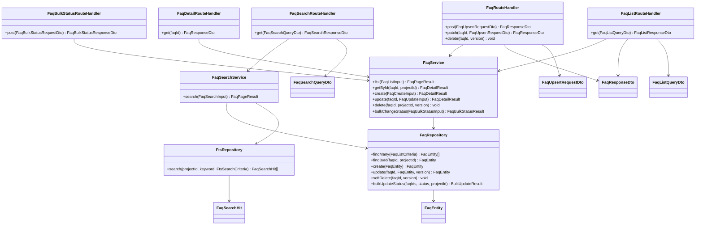

# CLS-005: FAQ管理(CRUD・検索) クラス図

> **本クラス図は「FAQ の一覧・検索・個別取得・作成・更新・削除・一括状態変更を実装する Route Handler・Service・Repository・DTO/Entity の構成と責務」を定義します。**

*種別 クラス図 ・ ステータス ドラフト*

| 項目 | 値 |
|----|----|
| CLS ID | CLS-005 |
| 業務ユースケースID | [UC-023](../../01_requirements/04_business_usecases/UC-023.md#UC-023) ・ [UC-024](../../01_requirements/04_business_usecases/UC-024.md#UC-024) ・ [UC-025](../../01_requirements/04_business_usecases/UC-025.md#UC-025) ・ [UC-026](../../01_requirements/04_business_usecases/UC-026.md#UC-026) |
| 関連 API | [API-025](../../02_basic_design/02_backend/03_apis/API-025.md#API-025) ・ [API-026](../../02_basic_design/02_backend/03_apis/API-026.md#API-026) ・ [API-027](../../02_basic_design/02_backend/03_apis/API-027.md#API-027) ・ [API-031](../../02_basic_design/02_backend/03_apis/API-031.md#API-031) ・ [API-033](../../02_basic_design/02_backend/03_apis/API-033.md#API-033) |
| 関連画面 | [SCR-008](../../02_basic_design/01_frontend/01_screens/SCR-008.md#SCR-008) ・ [SCR-009](../../02_basic_design/01_frontend/01_screens/SCR-009.md#SCR-009) |
| 関連テーブル | [TBL-006](../../02_basic_design/02_backend/04_database/TBL-006.md#TBL-006) ・ [TBL-030](../../02_basic_design/02_backend/04_database/TBL-030.md#TBL-030) |
| 関連 SYS | — |

## 1. 目的

本クラス図は、FAQ 一覧([API-025](../../02_basic_design/02_backend/03_apis/API-025.md#API-025))・FAQ 全文検索([API-031](../../02_basic_design/02_backend/03_apis/API-031.md#API-031))・FAQ 個別取得([API-033](../../02_basic_design/02_backend/03_apis/API-033.md#API-033))・FAQ 作成・更新・削除([API-026](../../02_basic_design/02_backend/03_apis/API-026.md#API-026))・FAQ 一括状態変更([API-027](../../02_basic_design/02_backend/03_apis/API-027.md#API-027))を Next.js(App Router)+ Repository 層のレイヤーへ配置し、実装者がクラス構成・責務・シグネチャ・データ構造の境界を迷わず組み立てられる粒度を確定する。依存方向は内向き(Route Handler → Service → Repository → D1)に固定し、逆流させない。

## 2. 対象範囲

本機能で扱うレイヤーと、別 CLS・別工程へ委ねる対象外を明示する。

| 区分 | 対象 |
|----|----|
| 対象機能 | FAQ 一覧([API-025](../../02_basic_design/02_backend/03_apis/API-025.md#API-025))・FAQ 全文検索([API-031](../../02_basic_design/02_backend/03_apis/API-031.md#API-031))・FAQ 個別取得([API-033](../../02_basic_design/02_backend/03_apis/API-033.md#API-033))・FAQ 作成・更新・削除([API-026](../../02_basic_design/02_backend/03_apis/API-026.md#API-026))・FAQ 一括状態変更([API-027](../../02_basic_design/02_backend/03_apis/API-027.md#API-027))・FAQ 一覧画面([SCR-008](../../02_basic_design/01_frontend/01_screens/SCR-008.md#SCR-008))・FAQ 編集画面([SCR-009](../../02_basic_design/01_frontend/01_screens/SCR-009.md#SCR-009)) |
| 対象レイヤー | Route Handler / Service / Repository / DTO / Entity |
| 対象外 | AI 回答経路での候補 FAQ 全文検索・参照 FAQ 記録([CLS-001](CLS-001.md#CLS-001) `FaqRepository` が担う。本図の `FaqRepository` は管理画面 CRUD・検索を担当する別クラスとして分離する)・CSV インポート/エクスポート(別 CLS)・状態遷移の判定条件詳細([STS-005](../01_state_transitions/STS-005.md#STS-005))・検索スコア算出やページング構築の内部アルゴリズム([IPO](../04_ipo/index.md) が担う) |

## 3. クラス図

レイヤーごとのクラスと依存方向を示す。上位から下位への一方向依存とし、全文検索は `FaqSearchService` が `FtsRepository` を介して `TP_FAQ_FTS` を扱う。

## 4. クラス一覧

各クラスの種別(レイヤー)・責務・主なメソッドを一覧化する。処理ロジックの詳細は [IPO](../04_ipo/index.md)、相互作用の詳細は詳細シーケンス([DSQ](../08_sequences/index.md))へ委ねる。

| クラス名 | 種別 | 責務 | 主なメソッド | 備考 |
|----|----|----|----|----|
| FaqListRouteHandler | Route Handler(Controller 相当) | FAQ 一覧要求を受理し DTO 変換・Service 呼び出し・応答整形を行う | `get` | `app/api/faqs/route.ts`(GET)相当([API-025](../../02_basic_design/02_backend/03_apis/API-025.md#API-025)) |
| FaqSearchRouteHandler | Route Handler(Controller 相当) | FAQ 全文検索要求を受理し DTO 変換・Service 呼び出し・応答整形を行う | `get` | `app/api/projects/[id]/faqs/search/route.ts` 相当([API-031](../../02_basic_design/02_backend/03_apis/API-031.md#API-031)) |
| FaqDetailRouteHandler | Route Handler(Controller 相当) | FAQ 個別取得要求を受理しテナント境界検証後に Service へ委譲する | `get` | `app/api/faqs/[id]/route.ts`(GET)相当([API-033](../../02_basic_design/02_backend/03_apis/API-033.md#API-033)) |
| FaqRouteHandler | Route Handler(Controller 相当) | FAQ 作成 / 更新 / 削除要求を受理し DTO 変換・Service 呼び出し・応答整形を行う | `post` / `patch` / `delete` | `app/api/faqs/route.ts`(POST)・`app/api/faqs/[id]/route.ts`(PATCH / DELETE)相当([API-026](../../02_basic_design/02_backend/03_apis/API-026.md#API-026)) |
| FaqBulkStatusRouteHandler | Route Handler(Controller 相当) | FAQ 一括状態変更要求を受理し件数上限検証後に Service へ委譲する | `post` | `app/api/faqs/bulk-status/route.ts` 相当([API-027](../../02_basic_design/02_backend/03_apis/API-027.md#API-027)) |
| FaqService | Service | FAQ の一覧・個別取得・作成・更新・削除・一括状態変更の業務処理を統括する。楽観ロック(`version`)判定・状態遷移の可否判定・`draft`/`published` での必須項目切替を担う | `list` / `getById` / `create` / `update` / `delete` / `bulkChangeStatus` | 状態遷移の許可条件は [STS-005](../01_state_transitions/STS-005.md#STS-005)。判定詳細は [IPO](../04_ipo/index.md) へ委譲 |
| FaqSearchService | Service | FAQ 全文検索の業務処理を統括する。テナント境界(`projectId`)・カテゴリ絞り込みを適用し `FtsRepository` の一致結果を `FaqRepository` の永続項目と結合してページングする | `search` | 二段構成(FTS 一致 → `M_FAQS` 結合)の実装方針は [DBP-007 §4](../07_db_physical/DBP-007.md#DBP-007) |
| FaqRepository | Repository | FAQ の一覧照会・個別照会・作成・更新・論理削除・一括状態更新(D1) | `findMany` / `findById` / `create` / `update` / `softDelete` / `bulkUpdateStatus` | 物理項目対応は [DBP-007](../07_db_physical/DBP-007.md#DBP-007)([TBL-006](../../02_basic_design/02_backend/04_database/TBL-006.md#TBL-006)) |
| FtsRepository | Repository | FAQ 全文検索(FTS5・trigram)の一致検索(D1)。管理画面検索専用であり、AI 回答経路の候補抽出は [CLS-001](CLS-001.md#CLS-001) `FaqRepository` が別途担う | `search` | [TBL-030](../../02_basic_design/02_backend/04_database/TBL-030.md#TBL-030)。プロジェクト境界の結合は `FaqSearchService` が担う([DBP-007 §4](../07_db_physical/DBP-007.md#DBP-007)) |

## 5. メソッド一覧

主要メソッドの目的・入出力・例外をシグネチャ粒度で定義する(実装本体は書かない)。入出力は論理型で示し、DTO ↔ Entity の変換は §6 に従う。

| クラス名 | メソッド名 | 目的 | 入力 | 出力 | 例外 | 備考 |
|----|----|----|----|----|----|----|
| FaqListRouteHandler | `get` | 状態 / プロジェクト / カテゴリで絞り込んだ FAQ 一覧を返す | FaqListQueryDto | FaqListResponseDto | 権限なし([ERR-019](../../02_basic_design/05_errors/ERR-019.md#ERR-019)) | HTTP 境界。項目定義は [IO-019](../03_io_specs/IO-019.md#IO-019) |
| FaqSearchRouteHandler | `get` | 当該プロジェクトの FAQ をキーワードで全文検索する | FaqSearchQueryDto | FaqSearchResponseDto | 権限なし([ERR-019](../../02_basic_design/05_errors/ERR-019.md#ERR-019)) | HTTP 境界。項目定義は [IO-019](../03_io_specs/IO-019.md#IO-019) |
| FaqDetailRouteHandler | `get` | 指定 FAQ ID の詳細情報を 1 件取得する | faqId | FaqResponseDto | 権限なし([ERR-019](../../02_basic_design/05_errors/ERR-019.md#ERR-019))・対象なし([ERR-017](../../02_basic_design/05_errors/ERR-017.md#ERR-017)) | HTTP 境界。項目定義は [IO-020](../03_io_specs/IO-020.md#IO-020) |
| FaqRouteHandler | `post` | FAQ を新規作成する(`draft` 保存 / 即時公開のいずれも扱う) | FaqUpsertRequestDto | FaqResponseDto | 検証エラー([ERR-001](../../02_basic_design/05_errors/ERR-001.md#ERR-001)) | HTTP 境界。項目定義は [IO-020](../03_io_specs/IO-020.md#IO-020) |
| FaqRouteHandler | `patch` | FAQ を更新し状態遷移を反映する | faqId・FaqUpsertRequestDto | FaqResponseDto | 検証エラー([ERR-001](../../02_basic_design/05_errors/ERR-001.md#ERR-001))・楽観ロック競合([ERR-023](../../02_basic_design/05_errors/ERR-023.md#ERR-023)) | 状態遷移の許可条件は [STS-005](../01_state_transitions/STS-005.md#STS-005) |
| FaqRouteHandler | `delete` | FAQ を論理削除する | faqId・version | — | 楽観ロック競合 / 削除済み対象([ERR-023](../../02_basic_design/05_errors/ERR-023.md#ERR-023)) | 復旧はサポート窓口経由のみ([STS-005](../01_state_transitions/STS-005.md#STS-005)) |
| FaqBulkStatusRouteHandler | `post` | 選択した複数 FAQ の状態を一括変更する | FaqBulkStatusRequestDto | FaqBulkStatusResponseDto | 件数上限超過 / ID 形式不正([ERR-001](../../02_basic_design/05_errors/ERR-001.md#ERR-001))・権限なし([ERR-019](../../02_basic_design/05_errors/ERR-019.md#ERR-019)) | 件数上限は [RULE-019](../../01_requirements/01_business_requirement/08_rule.md#RULE-019)。`deleted` は対象外([STS-005](../01_state_transitions/STS-005.md#STS-005)) |
| FaqService | `list` | フィルタ・並び順・ページングで FAQ 一覧を取得する | FaqListInput(論理項目) | FaqPageResult | — | 並び順は `relevance` / `updated_at` / `created_at` |
| FaqService | `getById` | プロジェクト境界を検証し FAQ を 1 件取得する | faqId・projectId | FaqDetailResult | 対象なし | テナント境界検証(`project_id`) |
| FaqService | `create` | FAQ を新規作成する。`published` 遷移時は質問・回答必須を判定する | FaqCreateInput(論理項目) | FaqDetailResult | 必須項目未充足([ERR-001](../../02_basic_design/05_errors/ERR-001.md#ERR-001)) | `published` 化時は `publishedAt` を記録 |
| FaqService | `update` | FAQ を更新し状態遷移を判定する | faqId・FaqUpdateInput(論理項目) | FaqDetailResult | 必須項目未充足([ERR-001](../../02_basic_design/05_errors/ERR-001.md#ERR-001))・`version` 不一致([ERR-023](../../02_basic_design/05_errors/ERR-023.md#ERR-023)) | 判定順序は [IPO](../04_ipo/index.md) |
| FaqService | `delete` | FAQ を論理削除する | faqId・projectId・version | — | `version` 不一致・削除済み対象([ERR-023](../../02_basic_design/05_errors/ERR-023.md#ERR-023)) | 取り消し不可([STS-005](../01_state_transitions/STS-005.md#STS-005)) |
| FaqService | `bulkChangeStatus` | 複数 FAQ の状態を行単位で評価し一括変更する | FaqBulkStatusInput(論理項目) | FaqBulkStatusResult | 件数上限超過([ERR-001](../../02_basic_design/05_errors/ERR-001.md#ERR-001)) | 対象外行(他プロジェクト / 削除済み)は行単位失敗として集計 |
| FaqSearchService | `search` | テナント境界・カテゴリで絞り込んだキーワード全文検索を行う | FaqSearchInput(論理項目) | FaqPageResult | — | AI 回答候補抽出とは別経路([CLS-001](CLS-001.md#CLS-001)) |
| FaqRepository | `findMany` | フィルタ条件で FAQ を照会する | FaqListCriteria | FaqEntity 配列 | — | インデックスは [TBL-006](../../02_basic_design/02_backend/04_database/TBL-006.md#TBL-006) |
| FaqRepository | `findById` | FAQ を ID とプロジェクト境界で照会する | faqId・projectId | FaqEntity / 該当なし | — | テナント境界検証 |
| FaqRepository | `create` | FAQ を永続化する | FaqEntity | FaqEntity | — | ID 採番は [DBP-007](../07_db_physical/DBP-007.md#DBP-007) |
| FaqRepository | `update` | FAQ を楽観ロック付きで更新する | faqId・FaqEntity・version | FaqEntity | `version` 不一致 | `published` 化時は `publishedAt` を更新 |
| FaqRepository | `softDelete` | FAQ を論理削除する(`status='deleted'`・削除日時記録) | faqId・version | — | `version` 不一致 | 有効フラグとの整合は [STS-005](../01_state_transitions/STS-005.md#STS-005) |
| FaqRepository | `bulkUpdateStatus` | 複数 FAQ の状態を行単位で更新する | faqIds・status・projectId | BulkUpdateResult(成功件数・失敗明細) | — | 対象外は行単位で失敗集計 |
| FtsRepository | `search` | FTS5(trigram)でキーワード一致検索する | projectId・keyword・FtsSearchCriteria | FaqSearchHit 配列(一致スコア付き) | — | [TBL-030](../../02_basic_design/02_backend/04_database/TBL-030.md#TBL-030) |

## 6. 利用するデータ構造

クラス間で受け渡すデータ構造を DTO / Entity の境界で定義する。DTO は API 境界の入出力、Entity は永続ドメインモデル(TBL 由来)とし、変換は Route Handler(DTO ↔ 論理入力)と Service(論理入力 ↔ Entity)で行う。物理カラム対応・変換規則の詳細は [DBP-007](../07_db_physical/DBP-007.md#DBP-007) / [IO-019](../03_io_specs/IO-019.md#IO-019) / [IO-020](../03_io_specs/IO-020.md#IO-020) へ委ねる。

| 名称 | 種別 | 主な項目 | 用途 |
|----|----|----|----|
| FaqListQueryDto | DTO | 状態・プロジェクト ID・カテゴリ・並び順・カーソル・取得件数 | FAQ 一覧 API 境界の入力(FaqListRouteHandler で受領) |
| FaqSearchQueryDto | DTO | キーワード・プロジェクト ID・状態・カテゴリ・並び順・カーソル・取得件数 | FAQ 全文検索 API 境界の入力(FaqSearchRouteHandler で受領) |
| FaqListResponseDto | DTO | FAQ 一覧(各要素は FaqSearchResponseDto の要素構造に準ずる)・次ページカーソル | FAQ 一覧 API 境界の出力 |
| FaqSearchResponseDto | DTO | FAQ 一覧(ID・質問・回答・状態・カテゴリ・関連度スコア・更新日時)・次ページカーソル | FAQ 全文検索 API 境界の出力 |
| FaqUpsertRequestDto | DTO | 質問・回答・カテゴリ・状態・バージョン | FAQ 作成・更新 API 境界の入力(FaqRouteHandler で受領) |
| FaqResponseDto | DTO | ID・質問・回答・カテゴリ・状態・バージョン・公開日時 | FAQ 個別取得 / 作成・更新 API 境界の出力 |
| FaqBulkStatusRequestDto | DTO | 対象 FAQ ID リスト・変更後状態 | FAQ 一括状態変更 API 境界の入力(FaqBulkStatusRouteHandler で受領) |
| FaqBulkStatusResponseDto | DTO | 成功件数・失敗明細(ID・エラーコード) | FAQ 一括状態変更 API 境界の出力 |
| FaqListInput / FaqCreateInput / FaqUpdateInput / FaqSearchInput / FaqBulkStatusInput | DTO(Service 内部入力) | Route Handler から Service への論理項目(DTO を業務入力へ変換した形) | Service メソッドの入力(Route Handler で DTO から変換) |
| FaqDetailResult / FaqPageResult / FaqBulkStatusResult | DTO(Service 内部結果) | 個別 FAQ / ページ結果(一覧・カーソル)/ 一括変更結果(成功件数・失敗明細) | Service の戻り値(Route Handler で各 ResponseDto へ整形) |
| FaqEntity | Entity | FAQ ID・プロジェクト ID・質問(タイトル)・回答(本文)・カテゴリ・状態・バージョン・タグ・有効フラグ・作成者/更新者・削除日時・作成日時・更新日時 | 永続ドメインモデル([TBL-006](../../02_basic_design/02_backend/04_database/TBL-006.md#TBL-006) 由来) |
| FaqSearchHit | Entity(検索結果) | FAQ ID・一致スコア | FTS5 一致検索結果([TBL-030](../../02_basic_design/02_backend/04_database/TBL-030.md#TBL-030) 由来。`FaqSearchService` が `FaqEntity` と結合) |
| BulkUpdateResult | DTO(Repository 内部結果) | 成功件数・失敗明細(ID・エラーコード) | `FaqRepository.bulkUpdateStatus` の戻り値(Service が FaqBulkStatusResult へ整形) |

## 7. 後続工程への引き継ぎ事項

詳細ロジック設計(IPO)・詳細シーケンス(DSQ)・モジュール構造(MOD)・テスト設計へ引き継ぐ観点を挙げる。

- 状態遷移の許可条件(`draft`/`published`/`hidden` 間の遷移・`published` 遷移時の必須項目判定・全状態から `deleted` への遷移)は [STS-005](../01_state_transitions/STS-005.md#STS-005) に従い、判定順序の実装詳細は IPO で確定する。
- `FaqSearchService` の二段構成(FTS5 一致検索 → `M_FAQS` へのプロジェクト境界・状態結合)の具体的なクエリ構成は [DBP-007 §4](../07_db_physical/DBP-007.md#DBP-007) と整合させ、詳細ロジック設計(IPO)へ引き継ぐ。
- 一括状態変更の行単位成否判定(対象外行のみ失敗集計・他行の成功に影響しない)と件数上限([RULE-019](../../01_requirements/01_business_requirement/08_rule.md#RULE-019))は詳細シーケンス(DSQ)でケース化する。
- 本図のクラスのモジュール配置(`app/api/faqs/**`・`lib/service/faq`・`lib/repository/faq`)と、[CLS-001](CLS-001.md#CLS-001) `FaqRepository`(AI 回答候補抽出専用)との命名衝突回避・責務分離は対応するモジュール構造設計(MOD)で確定する。
- 楽観ロック(`version` 不一致検出)と論理削除時の有効フラグ([`valid`](../../02_basic_design/02_backend/04_database/TBL-006.md#カラム定義))更新順序の実装方針は [DBP-007 §7](../07_db_physical/DBP-007.md#DBP-007) と合わせてテスト設計でケース化する。
