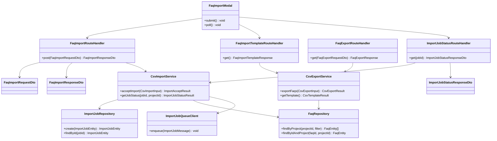

# CLS-006: FAQ CSV入出力 クラス図

> **本クラス図は「FAQ の CSV 一括インポート受付・取込ジョブ状態照会・インポートテンプレート取得・CSV エクスポートを実装する Route Handler・Service・Repository・DTO/Entity の構成と責務」を定義します。**

*種別 クラス図 ・ ステータス ドラフト*

| 項目 | 値 |
|----|----|
| CLS ID | CLS-006 |
| 業務ユースケースID | [UC-027](../../01_requirements/04_business_usecases/UC-027.md#UC-027) ・ [UC-046](../../01_requirements/04_business_usecases/UC-046.md#UC-046) ・ [UC-028](../../01_requirements/04_business_usecases/UC-028.md#UC-028) |
| 関連 API | [API-028](../../02_basic_design/02_backend/03_apis/API-028.md#API-028) ・ [API-029](../../02_basic_design/02_backend/03_apis/API-029.md#API-029) ・ [API-030](../../02_basic_design/02_backend/03_apis/API-030.md#API-030) ・ [API-067](../../02_basic_design/02_backend/03_apis/API-067.md#API-067) |
| 関連画面 | [SCR-010](../../02_basic_design/01_frontend/01_screens/SCR-010.md#SCR-010) |
| 関連テーブル | [TBL-006](../../02_basic_design/02_backend/04_database/TBL-006.md#TBL-006) ・ [TBL-033](../../02_basic_design/02_backend/04_database/TBL-033.md#TBL-033) |
| 関連 SYS | [SYS-014](../../02_basic_design/02_backend/01_system/SYS-014.md#SYS-014) |

## 1. 目的

本クラス図は、FAQ CSV インポート([API-028](../../02_basic_design/02_backend/03_apis/API-028.md#API-028))・インポートテンプレート取得([API-029](../../02_basic_design/02_backend/03_apis/API-029.md#API-029))・CSV エクスポート([API-030](../../02_basic_design/02_backend/03_apis/API-030.md#API-030))・取込ジョブ状態取得([API-067](../../02_basic_design/02_backend/03_apis/API-067.md#API-067))を Next.js(App Router)+ Repository 層のレイヤーへ配置し、実装者がクラス構成・責務・シグネチャ・データ構造の境界を迷わず組み立てられる粒度を確定する。依存方向は内向き(Route Handler → Service → Repository → D1)に固定し、逆流させない。取込の非同期実行本体([SYS-014](../../02_basic_design/02_backend/01_system/SYS-014.md#SYS-014)・[BAT-003](../05_batch/BAT-003.md#BAT-003))を起動する境界(Queues への投入)までを本図の対象とする。

## 2. 対象範囲

本機能で扱うレイヤーと、別 CLS・別工程へ委ねる対象外を明示する。

| 区分 | 対象 |
|----|----|
| 対象機能 | CSV インポート受付([API-028](../../02_basic_design/02_backend/03_apis/API-028.md#API-028))・インポートテンプレート取得([API-029](../../02_basic_design/02_backend/03_apis/API-029.md#API-029))・CSV エクスポート([API-030](../../02_basic_design/02_backend/03_apis/API-030.md#API-030))・取込ジョブ状態取得([API-067](../../02_basic_design/02_backend/03_apis/API-067.md#API-067))・CSV インポートモーダル([SCR-010](../../02_basic_design/01_frontend/01_screens/SCR-010.md#SCR-010)) |
| 対象レイヤー | Route Handler / Client Component / Service / Repository / DTO / Entity |
| 対象外 | 取込ジョブ非同期実行の行単位ループ本体([BAT-003](../05_batch/BAT-003.md#BAT-003)・[IPO-015](../04_ipo/IPO-015.md#IPO-015) が担う。本図は Queues への投入までを Service の責務として示す)・FAQ 一覧画面([SCR-008](../../02_basic_design/01_frontend/01_screens/SCR-008.md#SCR-008) 側の Client Component、別 CLS)・行単位バリデーション判定条件の内部アルゴリズム([IPO-015](../04_ipo/IPO-015.md#IPO-015) が担う) |

## 3. クラス図

レイヤーごとのクラスと依存方向を示す。上位から下位への一方向依存とし、取込ジョブの非同期実行起動は Queues 境界の `ImportJobQueueClient` を介す。

## 4. クラス一覧

各クラスの種別(レイヤー)・責務・主なメソッドを一覧化する。行単位の判定・反映ロジックの詳細は [IPO-015](../04_ipo/IPO-015.md#IPO-015)、取込ジョブ非同期実行の詳細は [BAT-003](../05_batch/BAT-003.md#BAT-003) へ委ねる。

| クラス名 | 種別 | 責務 | 主なメソッド | 備考 |
|----|----|----|----|----|
| FaqImportRouteHandler | Route Handler(Controller 相当) | CSV インポート要求を受理し、受付形式検証・DTO 変換・Service 呼び出し・取込ジョブ受付応答(202)を整形する | `post` | `app/api/faqs/import/route.ts` 相当([API-028](../../02_basic_design/02_backend/03_apis/API-028.md#API-028)) |
| FaqImportTemplateRouteHandler | Route Handler(Controller 相当) | インポートテンプレート CSV の取得要求を受理し、Service から取得した CSV をダウンロード応答として返す | `get` | `app/api/faqs/import/template/route.ts` 相当([API-029](../../02_basic_design/02_backend/03_apis/API-029.md#API-029)) |
| FaqExportRouteHandler | Route Handler(Controller 相当) | CSV エクスポート要求を受理し、一覧フィルタ条件を DTO 変換して Service へ委譲し CSV ダウンロード応答を返す | `get` | `app/api/faqs/export/route.ts` 相当([API-030](../../02_basic_design/02_backend/03_apis/API-030.md#API-030)) |
| ImportJobStatusRouteHandler | Route Handler(Controller 相当) | 取込ジョブ状態取得要求を受理し、対象ジョブのプロジェクト所属検証を経て状態・進捗・失敗明細の応答を返す | `get` | `app/api/faqs/import/[jobId]/route.ts` 相当([API-067](../../02_basic_design/02_backend/03_apis/API-067.md#API-067)) |
| FaqImportModal | Client Component | CSV インポートモーダルの表示・ファイル選択検証・取込要求送信・取込ジョブ状態のポーリングを担う | `submit` / `poll` | 検証仕様は [SCR-010](../../02_basic_design/01_frontend/01_screens/SCR-010.md#SCR-010) §5 |
| CsvImportService | Service | CSV の受付形式検証・取込ジョブ生成・非同期実行起動(Queues 投入)・取込ジョブ状態照会を統括する | `acceptImport` / `getJobStatus` | 受付形式検証の判定条件は [API-028](../../02_basic_design/02_backend/03_apis/API-028.md#API-028)。行単位の判定・反映は [IPO-015](../04_ipo/IPO-015.md#IPO-015) |
| CsvExportService | Service | 一覧フィルタ条件による対象 FAQ の取得・CSV 整形、およびインポートテンプレート CSV の生成を担う | `exportFaqs` / `getTemplate` | CSV 列構成は [API-028](../../02_basic_design/02_backend/03_apis/API-028.md#API-028) 本文の CSV 列構成に準ずる |
| ImportJobQueueClient | Gateway(Queues 投入境界) | 取込ジョブ受付イベントを Cloudflare Queues へ投入する内部境界 | `enqueue` | 投入後の消費・行単位実行は [BAT-003](../05_batch/BAT-003.md#BAT-003) が担う |
| ImportJobRepository | Repository | 取込ジョブの生成・照会(D1) | `create` / `findById` | 物理項目対応は [DBP-008](../07_db_physical/DBP-008.md#DBP-008)([TBL-033](../../02_basic_design/02_backend/04_database/TBL-033.md#TBL-033)) |
| FaqRepository | Repository | プロジェクト単位の FAQ 一覧取得(エクスポート・フィルタ適用)・ID 指定照会(インポートの既存 FAQ 照合用)を D1 へ行う | `findByProject` / `findByIdAndProject` | [TBL-006](../../02_basic_design/02_backend/04_database/TBL-006.md#TBL-006)。取込時の新規/上書き判定は [IPO-015](../04_ipo/IPO-015.md#IPO-015) |

## 5. メソッド一覧

主要メソッドの目的・入出力・例外をシグネチャ粒度で定義する(実装本体は書かない)。入出力は論理型で示し、DTO ↔ Entity の変換は §6 に従う。

| クラス名 | メソッド名 | 目的 | 入力 | 出力 | 例外 | 備考 |
|----|----|----|----|----|----|----|
| FaqImportRouteHandler | `post` | CSV インポート要求を受理し取込ジョブ受付応答を返す | FaqImportRequestDto | FaqImportResponseDto(202) | 検証エラー(形式不正・サイズ超過・文字数超過。[ERR-024](../../02_basic_design/05_errors/ERR-024.md#ERR-024)) | HTTP 境界。CSV 受理形式の判定条件は [API-028](../../02_basic_design/02_backend/03_apis/API-028.md#API-028) |
| FaqImportTemplateRouteHandler | `get` | インポートテンプレート CSV を取得しダウンロード応答として返す | — | FaqImportTemplateResponse(CSV 本体) | — | HTTP 境界。JSON 本体は返さない |
| FaqExportRouteHandler | `get` | 一覧フィルタ条件で対象 FAQ を取得し CSV ダウンロード応答を返す | FaqExportRequestDto(状態・プロジェクト ID・キーワード・カテゴリ) | FaqExportResponse(CSV 本体) | — | HTTP 境界。JSON 本体は返さない |
| ImportJobStatusRouteHandler | `get` | 指定ジョブの状態・進捗・失敗明細を返す | jobId | ImportJobStatusResponseDto | プロジェクト不一致([ERR-019](../../02_basic_design/05_errors/ERR-019.md#ERR-019))・ジョブ不在([ERR-017](../../02_basic_design/05_errors/ERR-017.md#ERR-017)) | HTTP 境界。ポーリング元は [SCR-010](../../02_basic_design/01_frontend/01_screens/SCR-010.md#SCR-010) |
| CsvImportService | `acceptImport` | 受付形式(CSV・UTF-8・ヘッダ行・件数上限・サイズ上限・行文字数)を検証し取込ジョブを生成、Queues へ投入する | CsvImportInput(CSV ファイル・対象プロジェクト) | ImportAcceptResult(ジョブ ID・受付状態) | 形式不正・サイズ超過・文字数超過([ERR-024](../../02_basic_design/05_errors/ERR-024.md#ERR-024)) | ジョブ生成とキュー投入の順序・Tx 境界は [BAT-003](../05_batch/BAT-003.md#BAT-003) §3 入力に接続 |
| CsvImportService | `getJobStatus` | 指定ジョブが対象プロジェクトに属するか検証し状態・進捗・失敗明細を返す | jobId・対象プロジェクト ID | ImportJobStatusResult | プロジェクト不一致・ジョブ不在 | 進捗値は [BAT-003](../05_batch/BAT-003.md#BAT-003) が中間反映した値を参照 |
| CsvExportService | `exportFaqs` | 一覧フィルタ条件に合致する FAQ を取得し CSV へ整形する | CsvExportInput(状態・プロジェクト ID・キーワード・カテゴリ) | CsvExportResult(CSV 本体) | — | フィルタ条件は一覧表示条件に準ずる |
| CsvExportService | `getTemplate` | ヘッダ行のみのインポートテンプレート CSV を生成する | — | CsvTemplateResult(CSV 本体) | — | CSV 列構成 `FAQ ID, 質問, 回答, カテゴリ` |
| ImportJobQueueClient | `enqueue` | 取込ジョブ受付イベントを Queues へ投入する | ImportJobMessage(ジョブ ID・対象プロジェクト ID) | — | 投入失敗 | 消費側は [BAT-003](../05_batch/BAT-003.md#BAT-003) |
| ImportJobRepository | `create` | 取込ジョブを `queued` 状態で永続化する | ImportJobEntity | ImportJobEntity | — | [TBL-033](../../02_basic_design/02_backend/04_database/TBL-033.md#TBL-033)。既定状態は [状態モデル §6](../../02_basic_design/08_state-model.md#6-faq取込ジョブ状態) |
| ImportJobRepository | `findById` | 取込ジョブを ID で照会する | jobId | ImportJobEntity / 該当なし | — | 状態・進捗・失敗明細の照会元 |
| FaqRepository | `findByProject` | プロジェクト単位でフィルタ条件に合致する FAQ 一覧を取得する | プロジェクト ID・フィルタ条件(状態・キーワード・カテゴリ) | FaqEntity 配列 | — | エクスポート対象取得用 |
| FaqRepository | `findByIdAndProject` | FAQ ID と対象プロジェクトで既存 FAQ を照合する | FAQ ID・プロジェクト ID | FaqEntity / 該当なし | — | インポート行の新規/上書き判定の入力([IPO-015](../04_ipo/IPO-015.md#IPO-015) No.2) |

## 6. 利用するデータ構造

クラス間で受け渡すデータ構造を DTO / Entity の境界で定義する。DTO は API 境界の入出力、Entity は永続ドメインモデル(TBL 由来)とし、変換は Route Handler(DTO ↔ 論理入力)と Service(論理入力 ↔ Entity)で行う。物理カラム対応・変換規則の詳細は [DBP-008](../07_db_physical/DBP-008.md#DBP-008) へ委ねる。

| 名称 | 種別 | 主な項目 | 用途 |
|----|----|----|----|
| FaqImportRequestDto | DTO | CSV ファイル(`multipart/form-data`) | CSV インポート API 境界の入力(FaqImportRouteHandler で受領) |
| FaqImportResponseDto | DTO | 取込ジョブ ID・受付状態(`processing`) | CSV インポート API 境界の出力(202) |
| FaqImportTemplateResponse | DTO(Route Handler 出力) | ヘッダ行のみの CSV 本体 | インポートテンプレート API 境界の出力 |
| FaqExportRequestDto | DTO | 状態・プロジェクト ID・キーワード・カテゴリ(いずれも一覧フィルタに準ずる) | CSV エクスポート API 境界の入力 |
| FaqExportResponse | DTO(Route Handler 出力) | フィルタ適用結果の CSV 本体 | CSV エクスポート API 境界の出力 |
| ImportJobStatusResponseDto | DTO | ジョブ ID・状態・総行数・処理済み/成功/失敗行数・失敗明細配列 | 取込ジョブ状態取得 API 境界の出力([API-067](../../02_basic_design/02_backend/03_apis/API-067.md#API-067)) |
| CsvImportInput | DTO(Service 内部入力) | CSV ファイル本体・対象プロジェクト ID | CsvImportService の入力(論理項目) |
| ImportAcceptResult | DTO(Service 内部結果) | 取込ジョブ ID・受付状態 | CsvImportService の出力(Route Handler で FaqImportResponseDto へ整形) |
| ImportJobStatusResult | DTO(Service 内部結果) | 状態・総行数・処理済み/成功/失敗行数・失敗明細配列 | CsvImportService の出力(Route Handler で ImportJobStatusResponseDto へ整形) |
| CsvExportInput | DTO(Service 内部入力) | 状態・プロジェクト ID・キーワード・カテゴリ | CsvExportService の入力(論理項目) |
| CsvExportResult | DTO(Service 内部結果) | CSV 本体 | CsvExportService の出力 |
| CsvTemplateResult | DTO(Service 内部結果) | ヘッダ行のみの CSV 本体 | CsvExportService の出力 |
| ImportJobMessage | DTO(Queues 境界) | 取込ジョブ ID・対象プロジェクト ID | ImportJobQueueClient への入力([BAT-003](../05_batch/BAT-003.md#BAT-003) §3 入力の投入元) |
| ImportJobEntity | Entity | ジョブ ID・プロジェクト ID・状態・総行数・処理済み/成功/失敗行数・失敗明細・作成/更新日時 | 永続ドメインモデル([TBL-033](../../02_basic_design/02_backend/04_database/TBL-033.md#TBL-033) 由来) |
| FaqEntity | Entity | FAQ ID・プロジェクト ID・質問・回答・カテゴリ・状態 | 永続ドメインモデル([TBL-006](../../02_basic_design/02_backend/04_database/TBL-006.md#TBL-006) 由来) |

## 7. 後続工程への引き継ぎ事項

詳細ロジック設計(IPO)・詳細シーケンス(DSQ)・モジュール構造(MOD)・テスト設計へ引き継ぐ観点を挙げる。

- 行単位の判定(新規/上書き/行失敗)・反映・失敗記録・件数集計の処理ロジックは [IPO-015](../04_ipo/IPO-015.md#IPO-015) で確定済み。本図の `CsvImportService.acceptImport` はジョブ生成と Queues 投入までの責務境界であることをテスト設計で確認する。
- ジョブ生成(`ImportJobRepository.create`)と Queues 投入(`ImportJobQueueClient.enqueue`。§5)の実行順序・Tx 境界・投入失敗時のジョブ状態の扱いは詳細シーケンスで確定する(対応する DSQ は未起票)。
- 本機能領域(CSV インポート/エクスポート/テンプレート/ジョブ状態照会)のモジュール配置(`app/api/faqs/import/**`・`app/api/faqs/export/**`・`lib/service`・`lib/repository`・`lib/gateway`)と依存境界は [MOD-006](../11_module/MOD-006.md#MOD-006) が定義する。
- DTO ↔ Entity の変換規則(変換レイヤーと欠損時の扱い)・論理項目 ↔ 物理カラムの対応は [DBP-008](../07_db_physical/DBP-008.md#DBP-008) と突き合わせて確定する。
- レイヤー間の依存方向(逆流の有無)・例外の伝播境界(受付形式検証エラー・プロジェクト不一致・ジョブ不在)をテスト設計でケース化する。
