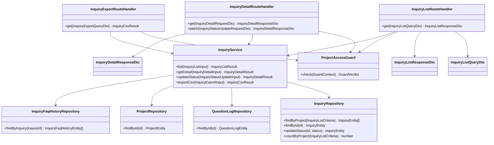

# CLS-007: 未解決質問管理 クラス図

> **本クラス図は「オーナー / メンバーが未解決質問を一覧・詳細確認し、対応状況を切り替え、CSV エクスポートする」管理機能を実装する Route Handler・Service・Repository・DTO/Entity の構成と責務を定義します。**

*種別 クラス図 ・ ステータス ドラフト*

| 項目 | 値 |
|----|----|
| CLS ID | CLS-007 |
| 業務ユースケースID | [UC-029](../../01_requirements/04_business_usecases/UC-029.md#UC-029) ・ [UC-030](../../01_requirements/04_business_usecases/UC-030.md#UC-030) ・ [UC-031](../../01_requirements/04_business_usecases/UC-031.md#UC-031) |
| 関連 API | [API-034](../../02_basic_design/02_backend/03_apis/API-034.md#API-034) ・ [API-035](../../02_basic_design/02_backend/03_apis/API-035.md#API-035) ・ [API-036](../../02_basic_design/02_backend/03_apis/API-036.md#API-036) |
| 関連画面 | [SCR-006](../../02_basic_design/01_frontend/01_screens/SCR-006.md#SCR-006) ・ [SCR-007](../../02_basic_design/01_frontend/01_screens/SCR-007.md#SCR-007) |
| 関連テーブル | [TBL-017](../../02_basic_design/02_backend/04_database/TBL-017.md#TBL-017) ・ [TBL-025](../../02_basic_design/02_backend/04_database/TBL-025.md#TBL-025) ・ [TBL-004](../../02_basic_design/02_backend/04_database/TBL-004.md#TBL-004) ・ [TBL-029](../../02_basic_design/02_backend/04_database/TBL-029.md#TBL-029) |
| 関連 SYS | — |

## 1. 目的

本クラス図は、オーナー / メンバーが未解決質問(`T_INQUIRIES`)を一覧・詳細確認し([API-034](../../02_basic_design/02_backend/03_apis/API-034.md#API-034)・[API-035](../../02_basic_design/02_backend/03_apis/API-035.md#API-035))、対応状況(`open` ↔ `closed`)を手動で切り替え、現在の絞り込み条件で CSV エクスポートする([API-036](../../02_basic_design/02_backend/03_apis/API-036.md#API-036))管理機能を Next.js(App Router)+ Repository 層のレイヤーへ配置し、実装者がクラス構成・責務・シグネチャ・データ構造の境界を迷わず組み立てられる粒度を確定する。依存方向は内向き(Route Handler → Service → Repository → D1)に固定し、逆流させない。

## 2. 対象範囲

本機能で扱うレイヤーと、別 CLS・別工程へ委ねる対象外を明示する。

| 区分 | 対象 |
|----|----|
| 対象機能 | 未解決質問一覧取得([API-034](../../02_basic_design/02_backend/03_apis/API-034.md#API-034))・未解決質問詳細取得/状況切替([API-035](../../02_basic_design/02_backend/03_apis/API-035.md#API-035))・未解決質問 CSV エクスポート([API-036](../../02_basic_design/02_backend/03_apis/API-036.md#API-036)) |
| 対象レイヤー | Route Handler / Service / Repository / ガード / DTO / Entity |
| 対象外 | ウィジェット側の未解決質問登録(`InquiryRouteHandler` の `post`・`InquiryRepository` の `create` / `findByIdempotencyKey` は [CLS-001](CLS-001.md#CLS-001) が定義。本書はその `InquiryRepository` に一覧・詳細・状況更新のメソッドを追加する形で共有する)・元質問ログの記録/フィードバック([CLS-001](CLS-001.md#CLS-001) が担う)・未解決質問から FAQ への移行操作そのもの(`M_FAQS` への作成は [API-026](../../02_basic_design/02_backend/03_apis/API-026.md#API-026) が担い別 CLS の対象。本書は `H_INQUIRY_FAQ` 履歴テーブルの Repository 配置のみを示す)・状態遷移の契機/ガード条件の詳細([STS-001](../01_state_transitions/STS-001.md#STS-001))・論理項目 ↔ 物理カラム対応([DBP-008](../07_db_physical/DBP-008.md#DBP-008)) |

## 3. クラス図

レイヤーごとのクラスと依存方向を示す。`InquiryRepository` は [CLS-001](CLS-001.md#CLS-001) で定義済みのクラスを共有し、本書では管理機能向けメソッドを追加する。

## 4. クラス一覧

各クラスの種別(レイヤー)・責務・主なメソッドを一覧化する。処理ロジックの詳細は該当 IPO、相互作用の詳細は詳細シーケンスへ委ねる。

| クラス名 | 種別 | 責務 | 主なメソッド | 備考 |
|----|----|----|----|----|
| InquiryListRouteHandler | Route Handler(Controller 相当) | 未解決質問一覧要求を受理し DTO 変換・Service 呼び出し・応答整形を行う | `get` | `app/api/inquiries/route.ts` 相当([API-034](../../02_basic_design/02_backend/03_apis/API-034.md#API-034)) |
| InquiryDetailRouteHandler | Route Handler(Controller 相当) | 未解決質問詳細取得・状況切替要求を受理し Service へ委譲する | `get` / `patch` | `app/api/inquiries/[id]/route.ts` 相当([API-035](../../02_basic_design/02_backend/03_apis/API-035.md#API-035))。`patch` は CSRF 検証を伴う |
| InquiryExportRouteHandler | Route Handler(Controller 相当) | CSV エクスポート要求を受理し Service へ委譲し添付ファイル応答を組み立てる | `get` | `app/api/inquiries/export/route.ts` 相当([API-036](../../02_basic_design/02_backend/03_apis/API-036.md#API-036)) |
| InquiryService | Service | 未解決質問の一覧抽出(状況・期間・フリーワード条件)・詳細取得(元質問ログ結合)・状況切替・CSV 整形を統括する | `list` / `getDetail` / `updateStatus` / `exportCsv` | 一覧の状況・理由コード → ラベル変換は Route Handler 応答整形前に実施。詳細の理由コードの意味は [状態モデル §4.2](../../02_basic_design/08_state-model.md#42-未解決質問状態) |
| ProjectAccessGuard | ガード | 対象プロジェクトへの所有権または有効な割当(境界判定)を検証する | `check` | 割当なし・部外者は 404 偽装([PERM-005](../../02_basic_design/04_permissions/PERM-005.md#PERM-005)) |
| InquiryRepository | Repository | 未解決質問の一覧抽出・ID 照会・状況更新(D1)。生成・冪等キー照会は [CLS-001](CLS-001.md#CLS-001) が定義するメソッドを共有 | `findByProject` / `findById` / `updateStatus` / `countByProject` | [TBL-017](../../02_basic_design/02_backend/04_database/TBL-017.md#TBL-017)。物理項目対応は [DBP-008](../07_db_physical/DBP-008.md#DBP-008) |
| QuestionLogRepository | Repository | 未解決質問の詳細表示に必要な元質問ログ(応答ログ・信頼度・未解決理由)を照会する(D1) | `findById` | [TBL-025](../../02_basic_design/02_backend/04_database/TBL-025.md#TBL-025)。生成・フィードバック更新は [CLS-001](CLS-001.md#CLS-001) が定義するメソッドを共有 |
| ProjectRepository | Repository | 詳細画面のチャネル付随表示に用いるプロジェクト名を照会する(D1) | `findById` | [TBL-004](../../02_basic_design/02_backend/04_database/TBL-004.md#TBL-004) |
| InquiryFaqHistoryRepository | Repository | 未解決質問から FAQ への移行履歴を未解決質問 ID で照会する(D1) | `findByInquiry` | [TBL-029](../../02_basic_design/02_backend/04_database/TBL-029.md#TBL-029)。移行履歴の書き込み経路(FAQ 化操作起点)は基本設計未確定(`## 7.` 課題候補) |

## 5. メソッド一覧

主要メソッドの目的・入出力・例外をシグネチャ粒度で定義する(実装本体は書かない)。入出力は論理型で示し、DTO ↔ Entity の変換は §6 に従う。

| クラス名 | メソッド名 | 目的 | 入力 | 出力 | 例外 | 備考 |
|----|----|----|----|----|----|----|
| InquiryListRouteHandler | `get` | 状況・プロジェクト・期間・フリーワードの条件で未解決質問一覧を返す | InquiryListQueryDto | InquiryListResponseDto | 検証エラー([ERR-001](../../02_basic_design/05_errors/ERR-001.md#ERR-001)) | カーソルページネーションは共通仕様に従う。入出力の項目定義は [IO-017](../03_io_specs/IO-017.md#IO-017) |
| InquiryDetailRouteHandler | `get` | 対象未解決質問の詳細(応答ログ・信頼度・未解決理由・チャネル)を返す | InquiryDetailRequestDto | InquiryDetailResponseDto | 境界判定不通過([ERR-001](../../02_basic_design/05_errors/ERR-001.md#ERR-001)・404 偽装) | 入出力の項目定義は [IO-018](../03_io_specs/IO-018.md#IO-018) |
| InquiryDetailRouteHandler | `patch` | 対応状況(`open` ↔ `closed`)を更新する | InquiryStatusUpdateRequestDto | InquiryDetailResponseDto | 検証エラー([ERR-001](../../02_basic_design/05_errors/ERR-001.md#ERR-001))・境界判定不通過(404 偽装) | CSRF・冪等キー(任意)を伴う。担当者概念・状態変更履歴は持たない |
| InquiryExportRouteHandler | `get` | 現在の絞り込み条件に一致する未解決質問を CSV で返す | InquiryExportQueryDto | InquiryCsvResult | 検証エラー([ERR-001](../../02_basic_design/05_errors/ERR-001.md#ERR-001)) | `Content-Disposition: attachment` で返却。列構成は [API-036](../../02_basic_design/02_backend/03_apis/API-036.md#API-036) |
| InquiryService | `list` | 状況・プロジェクト・期間・フリーワードで未解決質問を抽出し元質問ログの理由コード・信頼度を付帯する | InquiryListInput(論理項目) | InquiryListResult | — | 理由コードの全集合は [API-034](../../02_basic_design/02_backend/03_apis/API-034.md#API-034)。`ai_unavailable` は処理エラーのため対象に現れない |
| InquiryService | `getDetail` | 対象未解決質問を元質問ログと結合し詳細(応答ログ・信頼度・理由・チャネル・プロジェクト名)を返す | InquiryDetailInput(論理項目) | InquiryDetailResult | 対象不在(境界判定不通過) | チャネルは現 MVP 定数(`widget`) |
| InquiryService | `updateStatus` | 対応状況を `open` ↔ `closed` へ更新する | InquiryStatusUpdateInput(論理項目) | InquiryDetailResult | 対象不在(境界判定不通過) | 双方向遷移許容(再オープン制限なし)。FAQ 下書き保存・公開と連動しない |
| InquiryService | `exportCsv` | 絞り込み条件に一致する未解決質問を全件抽出し CSV へ整形する | InquiryExportInput(論理項目) | InquiryCsvResult | — | 列構成は問い合わせID・状況・質問・未解決理由・最終更新日時 |
| ProjectAccessGuard | `check` | 対象プロジェクトへの所有権または有効な割当を判定する | GuardContext | GuardVerdict(許可 / 404 偽装) | — | 判定条件は [PERM-005](../../02_basic_design/04_permissions/PERM-005.md#PERM-005) |
| InquiryRepository | `findByProject` | 条件(状況・プロジェクト・期間・フリーワード)で未解決質問を抽出する | InquiryListCriteria | InquiryEntity 配列 | — | フリーワードは `inquiry_code` / `user_question` 部分一致 |
| InquiryRepository | `findById` | 未解決質問を ID で照会する | 未解決質問 ID | InquiryEntity / 該当なし | — | 詳細取得・状況更新の前提照会 |
| InquiryRepository | `updateStatus` | 未解決質問の状況を更新する | 未解決質問 ID・更新後状況 | InquiryEntity | 対象不在 | 履歴は永続化しない |
| InquiryRepository | `countByProject` | 条件に一致する未解決質問の件数を返す | InquiryListCriteria | 件数 | — | 一覧の件数表示・CSV 全件抽出前の規模確認に使用 |
| QuestionLogRepository | `findById` | 未解決質問の元質問ログを ID で照会する | 質問ログ ID | QuestionLogEntity / 該当なし | — | 応答ログ・信頼度・理由コードの供給元 |
| ProjectRepository | `findById` | プロジェクトを ID で照会する | プロジェクト ID | ProjectEntity / 該当なし | — | 詳細画面のチャネル付随表示用プロジェクト名の供給元 |
| InquiryFaqHistoryRepository | `findByInquiry` | 未解決質問 ID で FAQ 化履歴を照会する | 未解決質問 ID | InquiryFaqHistoryEntity 配列 | — | 現行 API 経路からの参照はなし(`## 7.` 課題候補) |

## 6. 利用するデータ構造

クラス間で受け渡すデータ構造を DTO / Entity の境界で定義する。DTO は API 境界の入出力、Entity は永続ドメインモデル(TBL 由来)とし、変換は Route Handler(DTO ↔ 論理項目)と Service(論理項目 ↔ Entity)で行う。物理カラム対応・変換規則の詳細は [DBP-008](../07_db_physical/DBP-008.md#DBP-008) / [IO-017](../03_io_specs/IO-017.md#IO-017) / [IO-018](../03_io_specs/IO-018.md#IO-018) へ委ねる。

| 名称 | 種別 | 主な項目 | 用途 |
|----|----|----|----|
| InquiryListQueryDto | DTO | 状況・プロジェクト ID・期間(`dateFrom`/`dateTo`)・フリーワード・カーソル・件数上限 | 一覧取得 API 境界の入力(InquiryListRouteHandler で受領) |
| InquiryListResponseDto | DTO | 未解決質問の配列(ID・問い合わせコード・質問・状況・プロジェクト ID・未解決理由・信頼度・作成/更新日時)・次ページカーソル | 一覧取得 API 境界の出力 |
| InquiryDetailRequestDto | DTO | 対象未解決質問 ID | 詳細取得 API 境界の入力(InquiryDetailRouteHandler で受領) |
| InquiryStatusUpdateRequestDto | DTO | 更新後状況・CSRF トークン・冪等キー(任意) | 状況切替 API 境界の入力 |
| InquiryDetailResponseDto | DTO | ID・問い合わせコード・質問・状況・プロジェクト ID・チャネル・チャネルラベル・プロジェクト名・信頼度・未解決理由・理由ラベル・応答ログ・作成/更新日時 | 詳細取得/状況切替 API 境界の出力 |
| InquiryExportQueryDto | DTO | 状況・プロジェクト ID・期間・フリーワード | CSV エクスポート API 境界の入力(InquiryExportRouteHandler で受領) |
| InquiryCsvResult | DTO(Service 出力) | CSV バイト列・ファイル名・Content-Type | CSV エクスポート API 境界の出力 |
| InquiryListInput | DTO(Service 内部入力) | 状況・プロジェクト ID・期間・フリーワード・カーソル・件数上限(論理項目) | InquiryService.list への入力 |
| InquiryListResult | DTO(Service 内部結果) | 未解決質問エントリ(理由ラベル変換前後の両方を保持)配列・次ページカーソル | InquiryService.list の戻り値(Route Handler で InquiryListResponseDto へ整形) |
| InquiryDetailInput | DTO(Service 内部入力) | 対象未解決質問 ID(論理項目) | InquiryService.getDetail への入力 |
| InquiryStatusUpdateInput | DTO(Service 内部入力) | 対象未解決質問 ID・更新後状況(論理項目) | InquiryService.updateStatus への入力 |
| InquiryDetailResult | DTO(Service 内部結果) | 詳細項目一式(理由ラベル変換前後の両方を保持) | getDetail / updateStatus の戻り値(Route Handler で InquiryDetailResponseDto へ整形) |
| InquiryExportInput | DTO(Service 内部入力) | 状況・プロジェクト ID・期間・フリーワード(論理項目) | InquiryService.exportCsv への入力 |
| InquiryEntity | Entity | 未解決質問 ID・プロジェクト ID・問い合わせコード・元質問ログ ID・質問本文・状況・有効フラグ・作成/更新日時 | 永続ドメインモデル([TBL-017](../../02_basic_design/02_backend/04_database/TBL-017.md#TBL-017) 由来。[CLS-001](CLS-001.md#CLS-001) と共有) |
| QuestionLogEntity | Entity | 質問ログ ID・質問本文・AI 応答・信頼度スコア・結果種別・結果理由コード・作成日時 | 永続ドメインモデル([TBL-025](../../02_basic_design/02_backend/04_database/TBL-025.md#TBL-025) 由来。詳細表示用に参照するサブセットは [CLS-001](CLS-001.md#CLS-001) の QuestionLogEntity と同一クラス) |
| ProjectEntity | Entity | プロジェクト ID・プロジェクト名 | 永続ドメインモデル([TBL-004](../../02_basic_design/02_backend/04_database/TBL-004.md#TBL-004) 由来。詳細画面のチャネル付随表示に用いる項目のみ参照) |
| InquiryFaqHistoryEntity | Entity | ID・プロジェクト ID・元未解決質問 ID・作成 FAQ ID・質問スナップショット・実行者種別・実行者 ID・移行日時 | 永続ドメインモデル([TBL-029](../../02_basic_design/02_backend/04_database/TBL-029.md#TBL-029) 由来) |

## 7. 後続工程への引き継ぎ事項

詳細ロジック設計(IPO)・詳細シーケンス(DSQ)・モジュール構造(MOD)・テスト設計へ引き継ぐ観点を挙げる。

- 一覧の状況・未解決理由コード → 表示用ラベルの変換位置(サーバー / クライアントいずれで行うか)は [IO-017](../03_io_specs/IO-017.md#IO-017)・[IO-018](../03_io_specs/IO-018.md#IO-018) の記載と整合させ、後続の IPO で確定する。
- `InquiryRepository`・`QuestionLogRepository` は [CLS-001](CLS-001.md#CLS-001) と本書とで同一クラスを共有するため、両 CLS のメソッド一覧を合算した完全なインターフェースは [MOD-007](../11_module/MOD-007.md#MOD-007) で確定する。
- `InquiryFaqHistoryRepository`(`H_INQUIRY_FAQ`)は本書で Repository 配置のみ示したが、これへ書き込む API 経路が基本設計([API-026](../../02_basic_design/02_backend/03_apis/API-026.md#API-026) 含む)に存在せず、未解決質問から FAQ への移行時に本テーブルへ記録する処理主体・トランザクション境界が未確定である。関係者確認のうえ基本設計側の反映要否を判断する(課題候補)。
- 対応状況の双方向遷移(`open` ↔ `closed`)のガード条件・実行可能ロールの詳細は [STS-001](../01_state_transitions/STS-001.md#STS-001) を正本として整合を確認する。
- 境界判定(404 偽装)の適用範囲(一覧 / 詳細 / エクスポートの三者で同一の判定結果とすること)をテスト設計でケース化する。
- DTO ↔ Entity の変換規則(変換レイヤーと欠損時の扱い)・論理項目 ↔ 物理カラムの対応は [IO-017](../03_io_specs/IO-017.md#IO-017) / [IO-018](../03_io_specs/IO-018.md#IO-018) / [DBP-008](../07_db_physical/DBP-008.md#DBP-008) で確定する。
