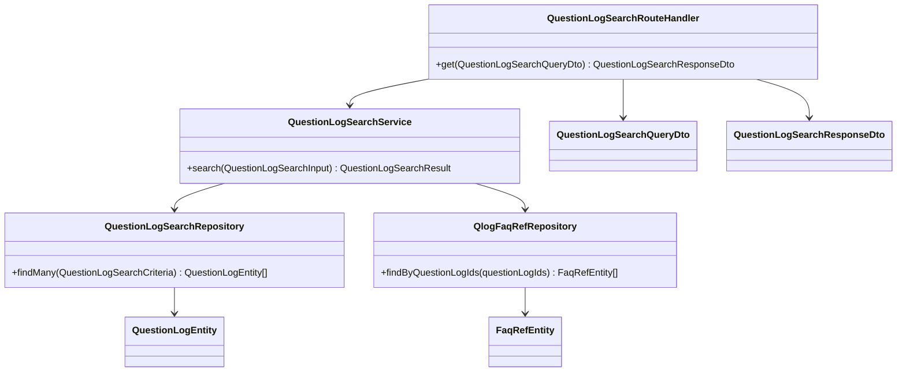

# CLS-008: 質問ログ・AI判定(管理側) クラス図

> **本クラス図は「オーナー / メンバーが質問ログをキーワード・期間・回答有無で検索し AI 判定結果(回答有無・信頼度・参照 FAQ)を確認する管理側機能を実装する Route Handler・Service・Repository・DTO/Entity の構成と責務」を定義します。**

*種別 クラス図 ・ ステータス ドラフト*

| 項目 | 値 |
|----|----|
| CLS ID | CLS-008 |
| 業務ユースケースID | [UC-076](../../01_requirements/04_business_usecases/UC-076.md#UC-076) |
| 関連 API | [API-032](../../02_basic_design/02_backend/03_apis/API-032.md#API-032) |
| 関連画面 | [SCR-032](../../02_basic_design/01_frontend/01_screens/SCR-032.md#SCR-032) |
| 関連テーブル | [TBL-025](../../02_basic_design/02_backend/04_database/TBL-025.md#TBL-025) ・ [TBL-016](../../02_basic_design/02_backend/04_database/TBL-016.md#TBL-016) |
| 関連 SYS | — |

## 1. 目的

本クラス図は、質問ログ検索([API-032](../../02_basic_design/02_backend/03_apis/API-032.md#API-032))を中心とする管理側参照機能を Next.js(App Router)+ Repository 層のレイヤーへ配置し、実装者がクラス構成・責務・シグネチャ・データ構造の境界を迷わず組み立てられる粒度を確定する。依存方向は内向き(Route Handler → Service → Repository → D1)に固定し、逆流させない。

## 2. 対象範囲

本機能で扱うレイヤーと、別 CLS・別工程へ委ねる対象外を明示する。

| 区分 | 対象 |
|----|----|
| 対象機能 | 質問ログ検索([API-032](../../02_basic_design/02_backend/03_apis/API-032.md#API-032))・質問ログ一覧画面([SCR-032](../../02_basic_design/01_frontend/01_screens/SCR-032.md#SCR-032)) |
| 対象レイヤー | Route Handler / Service / Repository / DTO / Entity |
| 対象外 | 質問ログの生成・AI 判定・回答文 PII マスキング・回答フィードバック記録([API-069](../../02_basic_design/02_backend/03_apis/API-069.md#API-069))は [CLS-001](CLS-001.md#CLS-001) の `AnswerService` / `QuestionLogRepository` / `FeedbackRouteHandler` が担う(本図は読み取り専用の参照側)。FAQ 全文検索([API-031](../../02_basic_design/02_backend/03_apis/API-031.md#API-031))は [CLS-005](CLS-005.md#CLS-005) が担う。検索スコア算出・ページング構築の内部アルゴリズムは [IPO](../04_ipo/index.md) が担う |

## 3. クラス図

レイヤーごとのクラスと依存方向を示す。質問ログ検索は `QuestionLogSearchService` が `QuestionLogSearchRepository` の検索結果へ参照 FAQ の紐づけを結合する。

## 4. クラス一覧

各クラスの種別(レイヤー)・責務・主なメソッドを一覧化する。処理ロジックの詳細は [IPO](../04_ipo/index.md)、相互作用の詳細は詳細シーケンス([DSQ](../08_sequences/index.md))へ委ねる。

| クラス名 | 種別 | 責務 | 主なメソッド | 備考 |
|----|----|----|----|----|
| QuestionLogSearchRouteHandler | Route Handler(Controller 相当) | 質問ログ検索要求を受理しテナント境界検証後に DTO 変換・Service 呼び出し・応答整形を行う | `get` | `app/api/projects/[id]/question-logs/search/route.ts` 相当([API-032](../../02_basic_design/02_backend/03_apis/API-032.md#API-032)) |
| QuestionLogSearchService | Service | 質問ログ検索の業務処理を統括する。テナント境界(`projectId`)・キーワード・期間・回答有無での絞り込みを適用し、検索結果へ関連する未解決質問参照を結合してページングする | `search` | 判定・結合順序の詳細は [IPO](../04_ipo/index.md) へ委譲 |
| QuestionLogSearchRepository | Repository | 質問ログの検索・照会(D1)。当該プロジェクトの質問ログをキーワード・期間・回答有無で絞り込み、作成日時降順で返す | `findMany` | 物理項目対応は [DBP-001](../07_db_physical/DBP-001.md#DBP-001)([TBL-025](../../02_basic_design/02_backend/04_database/TBL-025.md#TBL-025))。書込は行わない(参照専用) |
| QlogFaqRefRepository | Repository | 質問ログに紐づく参照 FAQ の照会(D1) | `findByQuestionLogIds` | [DBP-009](../07_db_physical/DBP-009.md#DBP-009)([TBL-016](../../02_basic_design/02_backend/04_database/TBL-016.md#TBL-016))。書込は [CLS-001](CLS-001.md#CLS-001) `QuestionLogRepository.saveFaqRefs` が担う |

## 5. メソッド一覧

主要メソッドの目的・入出力・例外をシグネチャ粒度で定義する(実装本体は書かない)。入出力は論理型で示し、DTO ↔ Entity の変換は §6 に従う。

| クラス名 | メソッド名 | 目的 | 入力 | 出力 | 例外 | 備考 |
|----|----|----|----|----|----|----|
| QuestionLogSearchRouteHandler | `get` | 当該プロジェクトの質問ログをキーワード・期間・回答有無で検索する | QuestionLogSearchQueryDto | QuestionLogSearchResponseDto | 権限なし([ERR-019](../../02_basic_design/05_errors/ERR-019.md#ERR-019)) | HTTP 境界。項目定義は [IO-028](../03_io_specs/IO-028.md#IO-028) |
| QuestionLogSearchService | `search` | テナント境界・キーワード・期間・回答有無で絞り込んだ質問ログをページングして取得する | QuestionLogSearchInput(論理項目) | QuestionLogSearchResult | — | 並び順は作成日時降順(既定) |
| QuestionLogSearchRepository | `findMany` | フィルタ条件で質問ログを照会する | QuestionLogSearchCriteria | QuestionLogEntity 配列 | — | インデックスは [TBL-025](../../02_basic_design/02_backend/04_database/TBL-025.md#TBL-025) `idx_qlog_project_created` |
| QlogFaqRefRepository | `findByQuestionLogIds` | 質問ログ ID 群に紐づく参照 FAQ を照会する | 質問ログ ID 配列 | FaqRefEntity 配列 | — | [TBL-016](../../02_basic_design/02_backend/04_database/TBL-016.md#TBL-016) |

## 6. 利用するデータ構造

クラス間で受け渡すデータ構造を DTO / Entity の境界で定義する。DTO は API 境界の入出力、Entity は永続ドメインモデル(TBL 由来)とし、変換は Route Handler(DTO ↔ 論理入力)と Service(論理入力 ↔ Entity)で行う。物理カラム対応・変換規則の詳細は [DBP-001](../07_db_physical/DBP-001.md#DBP-001) / [DBP-009](../07_db_physical/DBP-009.md#DBP-009) / [IO-028](../03_io_specs/IO-028.md#IO-028) へ委ねる。

| 名称 | 種別 | 主な項目 | 用途 |
|----|----|----|----|
| QuestionLogSearchQueryDto | DTO | プロジェクト ID・キーワード・期間(開始/終了)・回答有無・並び順・カーソル・取得件数 | 質問ログ検索 API 境界の入力(QuestionLogSearchRouteHandler で受領) |
| QuestionLogSearchResponseDto | DTO | 質問ログ一覧(ID・質問・回答有無・信頼度・関連する未解決質問 ID・作成日時)・次ページカーソル | 質問ログ検索 API 境界の出力 |
| QuestionLogSearchInput | DTO(Service 内部入力) | Route Handler から Service への論理項目(DTO を業務入力へ変換した形) | Service メソッドの入力(Route Handler で DTO から変換) |
| QuestionLogSearchResult | DTO(Service 内部結果) | 質問ログ一覧(参照 FAQ 結合済み)・次ページカーソル | Service の戻り値(Route Handler で QuestionLogSearchResponseDto へ整形) |
| QuestionLogEntity | Entity | 質問ログ ID・プロジェクト ID・質問本文・AI 応答・解決フラグ・信頼度スコア・関連度スコア・結果種別・結果理由コード・有効フラグ | 永続ドメインモデル([TBL-025](../../02_basic_design/02_backend/04_database/TBL-025.md#TBL-025) 由来。生成・更新は [CLS-001](CLS-001.md#CLS-001) が担う) |
| FaqRefEntity | Entity | 質問ログ ID・FAQ ID・関連度スコア | 参照 FAQ の M:N 関係([TBL-016](../../02_basic_design/02_backend/04_database/TBL-016.md#TBL-016) 由来) |

## 7. 後続工程への引き継ぎ事項

詳細ロジック設計(IPO)・詳細シーケンス(DSQ)・モジュール構造(MOD)・テスト設計へ引き継ぐ観点を挙げる。

- キーワード・期間・回答有無の絞り込み条件の組み合わせ判定、検索結果への参照 FAQ 結合順序は [IPO](../04_ipo/index.md) で確定する。
- ページング(カーソル)の構築規則・既定並び順(作成日時降順)の実装方針は詳細シーケンス([DSQ](../08_sequences/index.md))でケース化する。
- 本図のクラス(`app/api/projects/[id]/question-logs/search`・`lib/service/question-log`・`lib/repository/question-log`)と、[CLS-001](CLS-001.md#CLS-001) の書込側クラス(`QuestionLogRepository` 等)との命名・責務分離(参照専用 `QuestionLogSearchRepository` と書込専用 `QuestionLogRepository` を同一モジュールに配置するか分離するか)は対応するモジュール構造設計(MOD)で確定する。
- 論理項目 ↔ 物理カラムの対応は [DBP-001](../07_db_physical/DBP-001.md#DBP-001) / [DBP-009](../07_db_physical/DBP-009.md#DBP-009) / [IO-028](../03_io_specs/IO-028.md#IO-028) と突き合わせて整合を確認する。
- テナント境界検証(`project_id` によるプロジェクト範囲限定)・権限なし([ERR-019](../../02_basic_design/05_errors/ERR-019.md#ERR-019))の判定境界をテスト設計でケース化する。
