# CLS-009: 利用量・上限管理 クラス図

> **本クラス図は「ダッシュボードサマリ・利用量サマリ(プロジェクト / オーナー)・プロジェクト上限アラート取得・更新を実装する Route Handler・Service・Repository・DTO/Entity の構成と責務」を定義します。**

*種別 クラス図 ・ ステータス ドラフト*

| 項目 | 値 |
|----|----|
| CLS ID | CLS-009 |
| 業務ユースケースID | [UC-032](../../01_requirements/04_business_usecases/UC-032.md#UC-032) ・ [UC-033](../../01_requirements/04_business_usecases/UC-033.md#UC-033) ・ [UC-034](../../01_requirements/04_business_usecases/UC-034.md#UC-034) ・ [UC-035](../../01_requirements/04_business_usecases/UC-035.md#UC-035) ・ [UC-051](../../01_requirements/04_business_usecases/UC-051.md#UC-051) ・ [UC-052](../../01_requirements/04_business_usecases/UC-052.md#UC-052) ・ [UC-053](../../01_requirements/04_business_usecases/UC-053.md#UC-053) |
| 関連 API | [API-040](../../02_basic_design/02_backend/03_apis/API-040.md#API-040) ・ [API-041](../../02_basic_design/02_backend/03_apis/API-041.md#API-041) ・ [API-042](../../02_basic_design/02_backend/03_apis/API-042.md#API-042) ・ [API-046](../../02_basic_design/02_backend/03_apis/API-046.md#API-046) ・ [API-047](../../02_basic_design/02_backend/03_apis/API-047.md#API-047) ・ [API-062](../../02_basic_design/02_backend/03_apis/API-062.md#API-062) |
| 関連画面 | [SCR-021](../../02_basic_design/01_frontend/01_screens/SCR-021.md#SCR-021) ・ [SCR-026](../../02_basic_design/01_frontend/01_screens/SCR-026.md#SCR-026) ・ [SCR-027](../../02_basic_design/01_frontend/01_screens/SCR-027.md#SCR-027) ・ [SCR-033](../../02_basic_design/01_frontend/01_screens/SCR-033.md#SCR-033) |
| 関連テーブル | [TBL-020](../../02_basic_design/02_backend/04_database/TBL-020.md#TBL-020) ・ [TBL-009](../../02_basic_design/02_backend/04_database/TBL-009.md#TBL-009) ・ [TBL-008](../../02_basic_design/02_backend/04_database/TBL-008.md#TBL-008) ・ [TBL-006](../../02_basic_design/02_backend/04_database/TBL-006.md#TBL-006) ・ [TBL-017](../../02_basic_design/02_backend/04_database/TBL-017.md#TBL-017) ・ [TBL-025](../../02_basic_design/02_backend/04_database/TBL-025.md#TBL-025) ・ [TBL-026](../../02_basic_design/02_backend/04_database/TBL-026.md#TBL-026) |
| 関連 SYS | — |

## 1. 目的

本クラス図は、ダッシュボードサマリ([API-040](../../02_basic_design/02_backend/03_apis/API-040.md#API-040))・ダッシュボード集計取得([API-062](../../02_basic_design/02_backend/03_apis/API-062.md#API-062))・利用量サマリ(プロジェクト / オーナー、[API-041](../../02_basic_design/02_backend/03_apis/API-041.md#API-041) / [API-042](../../02_basic_design/02_backend/03_apis/API-042.md#API-042))・プロジェクト上限・アラート取得/更新([API-046](../../02_basic_design/02_backend/03_apis/API-046.md#API-046) / [API-047](../../02_basic_design/02_backend/03_apis/API-047.md#API-047))を Next.js(App Router)+ Repository 層のレイヤーへ配置し、実装者がクラス構成・責務・シグネチャ・データ構造の境界を迷わず組み立てられる粒度を確定する。依存方向は内向き(Route Handler → Service → Repository → D1)に固定し、逆流させない。利用量計測の永続化(D1)そのものは [CLS-001](CLS-001.md#CLS-001) の `UsageMeterRepository` を共用し、本図では参照系メソッドを追加する形で境界を明確化する。

## 2. 対象範囲

本機能で扱うレイヤーと、別 CLS・別工程へ委ねる対象外を明示する。

| 区分 | 対象 |
|----|----|
| 対象機能 | ダッシュボードサマリ([API-040](../../02_basic_design/02_backend/03_apis/API-040.md#API-040))・ダッシュボード集計取得([API-062](../../02_basic_design/02_backend/03_apis/API-062.md#API-062))・利用量サマリ(プロジェクト)([API-041](../../02_basic_design/02_backend/03_apis/API-041.md#API-041))・利用量サマリ(オーナー)([API-042](../../02_basic_design/02_backend/03_apis/API-042.md#API-042))・プロジェクト上限・アラート取得([API-046](../../02_basic_design/02_backend/03_apis/API-046.md#API-046))・プロジェクト上限・アラート更新([API-047](../../02_basic_design/02_backend/03_apis/API-047.md#API-047)) |
| 対象レイヤー | Route Handler / Service / Repository / DTO / Entity |
| 対象外 | ウィジェット質問送信時の当月利用量の同期加算・受付停止判定(質問数上限到達によるガード)は [CLS-001](CLS-001.md#CLS-001) の `AnswerService` / `UsageLimitGuard` / `UsageMeterRepository.increment` が担う([IPO-006](../04_ipo/IPO-006.md#IPO-006))・上限アラート閾値到達の通知判定/配信(受信者解決・メール送信)は別 SYS/BAT が担う([IPO-005](../04_ipo/IPO-005.md#IPO-005)・[SYS-017](../../02_basic_design/02_backend/01_system/SYS-017.md#SYS-017))・オーナー単位のレート制限判定(`widget_ask_per_min` 等)は横断ガードが担う([IPO-007](../04_ipo/IPO-007.md#IPO-007)・[TBL-008](../../02_basic_design/02_backend/04_database/TBL-008.md#TBL-008) は参照専用データとして本図に含める)・請求金額/支払方法/請求履歴の表示([SCR-028](../../02_basic_design/01_frontend/01_screens/SCR-028.md#SCR-028) 側)・画面 Client Component(SCR-021/026/027/033 側の表示・入力制御) |

## 3. クラス図

レイヤーごとのクラスと依存方向を示す。参照系(サマリ取得)と更新系(上限・アラート設定)を同一 Service 内の異なるメソッドとして扱う。

```mermaid
classDiagram
    class DashboardSummaryRouteHandler {
        +get(DashboardSummaryQueryDto) DashboardSummaryResponseDto
    }
    class DashboardOverviewRouteHandler {
        +get(DashboardOverviewQueryDto) DashboardOverviewResponseDto
    }
    class ProjectUsageRouteHandler {
        +get(ProjectUsageQueryDto) ProjectUsageResponseDto
    }
    class OwnerUsageRouteHandler {
        +get(OwnerUsageQueryDto) OwnerUsageResponseDto
    }
    class QuotaLimitRouteHandler {
        +get(QuotaLimitQueryDto) QuotaLimitResponseDto
        +patch(QuotaLimitUpdateRequestDto) QuotaLimitResponseDto
    }
    class UsageMeterService {
        +getDashboardSummary(DashboardSummaryInput) DashboardSummaryResult
        +getDashboardOverview(DashboardOverviewInput) DashboardOverviewResult
        +getProjectUsage(ProjectUsageInput) ProjectUsageResult
        +getOwnerUsage(OwnerUsageInput) OwnerUsageResult
    }
    class QuotaLimitService {
        +getQuotaLimit(QuotaLimitInput) QuotaLimitResult
        +updateQuotaLimit(QuotaLimitUpdateInput) QuotaLimitResult
    }
    class UsageMeterRepository {
        +increment(projectId, billingYm) UsageMeterEntity
        +findByProjectAndMonth(projectId, billingYm) UsageMeterEntity
        +sumByOwnerAndMonth(ownerUserId, billingYm) UsageMeterEntity[]
        +sumDailyTrend(projectId, from, to) UsageMeterDailyPoint[]
    }
    class QuotaLimitRepository {
        +findByProjectAndKind(projectId, resourceKind) QuotaLimitEntity
        +upsert(QuotaLimitEntity) QuotaLimitEntity
    }
    class ReauthVerifier {
        +verify(reauthToken, userId) ReauthVerdict
    }
    class DashboardSummaryQueryDto
    class DashboardSummaryResponseDto
    class QuotaLimitUpdateRequestDto
    DashboardSummaryRouteHandler --> DashboardSummaryQueryDto
    DashboardSummaryRouteHandler --> DashboardSummaryResponseDto
    DashboardSummaryRouteHandler --> UsageMeterService
    DashboardOverviewRouteHandler --> UsageMeterService
    ProjectUsageRouteHandler --> UsageMeterService
    OwnerUsageRouteHandler --> UsageMeterService
    QuotaLimitRouteHandler --> QuotaLimitUpdateRequestDto
    QuotaLimitRouteHandler --> QuotaLimitService
    QuotaLimitRouteHandler --> ReauthVerifier
    UsageMeterService --> UsageMeterRepository
    QuotaLimitService --> QuotaLimitRepository
    QuotaLimitService --> UsageMeterRepository
```

## 4. クラス一覧

各クラスの種別(レイヤー)・責務・主なメソッドを一覧化する。処理ロジックの詳細は [IPO-005](../04_ipo/IPO-005.md#IPO-005)・[IPO-006](../04_ipo/IPO-006.md#IPO-006)、相互作用の詳細は詳細シーケンス設計へ委ねる。

| クラス名 | 種別 | 責務 | 主なメソッド | 備考 |
|----|----|----|----|----|
| DashboardSummaryRouteHandler | Route Handler(Controller 相当) | ダッシュボードサマリ要求を受理し DTO 変換・Service 呼び出し・応答整形を行う | `get` | `app/api/dashboard/summary/route.ts` 相当([API-040](../../02_basic_design/02_backend/03_apis/API-040.md#API-040)) |
| DashboardOverviewRouteHandler | Route Handler(Controller 相当) | My集計 / プロジェクト指定のダッシュボード集計要求を受理する | `get` | `app/api/dashboard/overview/route.ts` 相当([API-062](../../02_basic_design/02_backend/03_apis/API-062.md#API-062)) |
| ProjectUsageRouteHandler | Route Handler(Controller 相当) | プロジェクト単位の利用量サマリ要求を受理する | `get` | `app/api/usage/route.ts` 相当([API-041](../../02_basic_design/02_backend/03_apis/API-041.md#API-041)) |
| OwnerUsageRouteHandler | Route Handler(Controller 相当) | オーナー単位(自分が作成した全プロジェクト)の利用量サマリ要求を受理する | `get` | `app/api/owner/projects/usage/route.ts` 相当([API-042](../../02_basic_design/02_backend/03_apis/API-042.md#API-042)) |
| QuotaLimitRouteHandler | Route Handler(Controller 相当) | プロジェクト上限・アラート設定の取得/更新要求を受理する。更新時は再認証検証を Service 呼び出し前に行う | `get` / `patch` | `app/api/projects/[id]/quota-limits/route.ts`・`app/api/projects/[id]/quota-limits/questions/route.ts` 相当([API-046](../../02_basic_design/02_backend/03_apis/API-046.md#API-046) / [API-047](../../02_basic_design/02_backend/03_apis/API-047.md#API-047)) |
| UsageMeterService | Service | 期間解決・集計対象(プロジェクト単位 / オーナー単位 / My集計)の判定・利用率/参考課金額算出を統括し、ダッシュボード/利用量サマリ系 4 API の集計結果を組み立てる | `getDashboardSummary` / `getDashboardOverview` / `getProjectUsage` / `getOwnerUsage` | 期間解決・集計範囲判定の詳細は各 API 処理概要。参考課金額算出式は [API-046](../../02_basic_design/02_backend/03_apis/API-046.md#API-046) |
| QuotaLimitService | Service | 質問数月次上限(`q_monthly_limit`)の取得・入力検証(範囲・アラート閾値の許可値/重複/昇順正規化)・更新・参考課金額再算出を統括する | `getQuotaLimit` / `updateQuotaLimit` | 到達判定そのものは受付ガード側([IPO-006](../04_ipo/IPO-006.md#IPO-006))が担い、本 Service は設定の取得・更新のみを担う |
| UsageMeterRepository | Repository | 利用量計測(質問数・課金対象外質問数)の加算・照会(D1)。プロジェクト単位、オーナー単位(所有プロジェクト群の合算)、日次推移の参照系メソッドを提供する | `increment` / `findByProjectAndMonth` / `sumByOwnerAndMonth` / `sumDailyTrend` | `increment` は [CLS-001](CLS-001.md#CLS-001) と共用。物理項目対応は [DBP-010](../07_db_physical/DBP-010.md#DBP-010)([TBL-020](../../02_basic_design/02_backend/04_database/TBL-020.md#TBL-020)) |
| QuotaLimitRepository | Repository | プロジェクト別利用設定(質問数月次上限・アラート閾値)の照会・作成/更新(D1) | `findByProjectAndKind` / `upsert` | 物理項目対応は [DBP-010](../07_db_physical/DBP-010.md#DBP-010)([TBL-009](../../02_basic_design/02_backend/04_database/TBL-009.md#TBL-009)) |
| ReauthVerifier | ガード | 状態変更操作(上限・アラート更新)の再認証トークンを検証する | `verify` | 未検証時 [ERR-013](../../02_basic_design/05_errors/ERR-013.md#ERR-013)。再認証発行は [API-005](../../02_basic_design/02_backend/03_apis/API-005.md#API-005) |

## 5. メソッド一覧

主要メソッドの目的・入出力・例外をシグネチャ粒度で定義する(実装本体は書かない)。入出力は論理型で示し、DTO ↔ Entity の変換は §6 に従う。

| クラス名 | メソッド名 | 目的 | 入力 | 出力 | 例外 | 備考 |
|----|----|----|----|----|----|----|
| DashboardSummaryRouteHandler | `get` | ダッシュボードサマリを返す | DashboardSummaryQueryDto | DashboardSummaryResponseDto | 検証エラー([ERR-001](../../02_basic_design/05_errors/ERR-001.md#ERR-001))・権限なし([ERR-019](../../02_basic_design/05_errors/ERR-019.md#ERR-019)) | メンバーは `projectId` 必須 |
| DashboardOverviewRouteHandler | `get` | My集計 / プロジェクト指定の主要指標を返す | DashboardOverviewQueryDto | DashboardOverviewResponseDto | 検証エラー([ERR-001](../../02_basic_design/05_errors/ERR-001.md#ERR-001))・権限なし([ERR-019](../../02_basic_design/05_errors/ERR-019.md#ERR-019)) | 所有プロジェクトを持たず参加のみのユーザーは `projectId` 必須 |
| ProjectUsageRouteHandler | `get` | プロジェクト単位の質問数/FAQ 利用状況を返す | ProjectUsageQueryDto | ProjectUsageResponseDto | 標準エラー体系のみ | `projectId` 必須 |
| OwnerUsageRouteHandler | `get` | 自分が作成した全プロジェクトのサマリーとプロジェクト別内訳を返す | OwnerUsageQueryDto | OwnerUsageResponseDto | 標準エラー体系のみ | 当月固定集計 |
| QuotaLimitRouteHandler | `get` | 当該プロジェクトの質問数上限・アラート設定・参考課金額を返す | QuotaLimitQueryDto | QuotaLimitResponseDto | 標準エラー体系のみ | `id` はパスパラメータ |
| QuotaLimitRouteHandler | `patch` | 質問数上限 ON/OFF・件数・アラート閾値を更新する | QuotaLimitUpdateRequestDto | QuotaLimitResponseDto | 再認証無効([ERR-013](../../02_basic_design/05_errors/ERR-013.md#ERR-013))・未サポート項目([ERR-029](../../02_basic_design/05_errors/ERR-029.md#ERR-029))・権限なし([ERR-030](../../02_basic_design/05_errors/ERR-030.md#ERR-030)) | 再認証必須([API-005](../../02_basic_design/02_backend/03_apis/API-005.md#API-005)) |
| UsageMeterService | `getDashboardSummary` | 期間・プロジェクトの質問数/未解決/日次推移/要対応新着/公開 FAQ 件数と通知失敗集計を組み立てる | DashboardSummaryInput(論理項目) | DashboardSummaryResult | — | `notification` はオーナーのみ算出、メンバー指定時は `null` |
| UsageMeterService | `getDashboardOverview` | 期間・集計範囲(My集計 / プロジェクト指定)の質問数・未解決数・公開 FAQ 数・利用率・頻出質問を組み立てる | DashboardOverviewInput(論理項目) | DashboardOverviewResult | — | 利用率は当月基準で算出([API-062](../../02_basic_design/02_backend/03_apis/API-062.md#API-062)) |
| UsageMeterService | `getProjectUsage` | プロジェクト単位の質問数・FAQ 件数の利用状況(上限・無料枠・利用率)を組み立てる | ProjectUsageInput(論理項目) | ProjectUsageResult | — | — |
| UsageMeterService | `getOwnerUsage` | 自分が作成した全プロジェクトのサマリー(質問数・公開 FAQ 数・解決率・AI 推論コスト・制限中プロジェクト数・前月実績)とプロジェクト別内訳を組み立てる | OwnerUsageInput(論理項目) | OwnerUsageResult | — | 解決率算出は [API-042](../../02_basic_design/02_backend/03_apis/API-042.md#API-042) の定義に従う |
| QuotaLimitService | `getQuotaLimit` | 質問数の利用状況・月次上限・アラート設定・参考課金額を取得する | QuotaLimitInput(論理項目) | QuotaLimitResult | — | 上限 OFF 時は上限関連項目を空値で返す |
| QuotaLimitService | `updateQuotaLimit` | 入力(上限 ON/OFF・件数・アラート閾値)を検証・正規化し設定を更新、参考課金額を再算出する | QuotaLimitUpdateInput(論理項目) | QuotaLimitResult | 範囲外件数・許可値外閾値([ERR-001](../../02_basic_design/05_errors/ERR-001.md#ERR-001))・未サポート項目([ERR-029](../../02_basic_design/05_errors/ERR-029.md#ERR-029)) | 件数の最小/最大は [TBL-009 コード値・区分値](../../02_basic_design/02_backend/04_database/TBL-009.md#コード値区分値) |
| UsageMeterRepository | `findByProjectAndMonth` | プロジェクト・請求年月で利用量計測行を照会する | プロジェクト ID・請求年月 | UsageMeterEntity / 該当なし | — | 該当なしは未計測(0 件)として扱う |
| UsageMeterRepository | `sumByOwnerAndMonth` | オーナーが所有する全プロジェクトの当月利用量計測行を照会する | オーナー ID・請求年月 | UsageMeterEntity 配列 | — | プロジェクト別内訳の算出元 |
| UsageMeterRepository | `sumDailyTrend` | プロジェクトの日次質問数推移を期間指定で照会する | プロジェクト ID・期間(from / to) | UsageMeterDailyPoint 配列 | — | 集計元は [TBL-025](../../02_basic_design/02_backend/04_database/TBL-025.md#TBL-025)(質問ログ日次集計) |
| QuotaLimitRepository | `findByProjectAndKind` | プロジェクト・リソース種別で有効な利用設定行を照会する | プロジェクト ID・リソース種別 | QuotaLimitEntity / 該当なし | — | 該当なしは未設定として既定値解決へ委ねる |
| QuotaLimitRepository | `upsert` | 質問数月次上限設定(`source='owner'`)を作成 / 更新する | QuotaLimitEntity | QuotaLimitEntity | 一意制約違反(`project_id, resource_kind, source`) | [TBL-009](../../02_basic_design/02_backend/04_database/TBL-009.md#TBL-009) |
| ReauthVerifier | `verify` | 再認証トークンの有効性を検証する | 再認証トークン・利用者 ID | ReauthVerdict(有効 / 無効) | — | 無効時 [ERR-013](../../02_basic_design/05_errors/ERR-013.md#ERR-013) |

## 6. 利用するデータ構造

クラス間で受け渡すデータ構造を DTO / Entity の境界で定義する。DTO は API 境界の入出力、Entity は永続ドメインモデル(TBL 由来)とし、変換は Route Handler(DTO ↔ 論理入力)と Service(論理入力 ↔ Entity)で行う。物理カラム対応・変換規則の詳細は [DBP-010](../07_db_physical/DBP-010.md#DBP-010) へ委ねる。

| 名称 | 種別 | 主な項目 | 用途 |
|----|----|----|----|
| DashboardSummaryQueryDto | DTO | `period` / `projectId` / `from` / `to` | ダッシュボードサマリ API 境界の入力 |
| DashboardSummaryResponseDto | DTO | 期間・質問数・未解決状況・頻出質問・日次推移・要対応新着・公開 FAQ 件数・集計完了時刻・通知失敗/バウンス集計 | ダッシュボードサマリ API 境界の出力 |
| DashboardOverviewQueryDto | DTO | `period` / `projectId` | ダッシュボード集計取得 API 境界の入力 |
| DashboardOverviewResponseDto | DTO | 期間・質問数・未解決数・公開 FAQ 数・利用率・頻出質問 | ダッシュボード集計取得 API 境界の出力 |
| ProjectUsageQueryDto | DTO | `period` / `viewMode` / `projectId` | 利用量サマリ(プロジェクト)API 境界の入力 |
| ProjectUsageResponseDto | DTO | 期間・プロジェクト ID・質問数利用状況(使用数/上限/無料枠/利用率/リセット日時)・FAQ 利用状況 | 利用量サマリ(プロジェクト)API 境界の出力 |
| OwnerUsageQueryDto | DTO | `period` | 利用量サマリ(オーナー)API 境界の入力 |
| OwnerUsageResponseDto | DTO | 期間・全体サマリー(プロジェクト数/質問数/公開 FAQ 数/解決率/AI 推論コスト/制限中プロジェクト数/前月実績)・プロジェクト別内訳・更新日時 | 利用量サマリ(オーナー)API 境界の出力 |
| QuotaLimitQueryDto | DTO | パスパラメータ `id`(プロジェクト ID) | プロジェクト上限・アラート取得 API 境界の入力 |
| QuotaLimitResponseDto | DTO | プロジェクト ID・期間起点・質問数利用状況(使用数/上限有効/上限件数/最小最大件数/利用率/アラート閾値/参考課金額/設定元) | プロジェクト上限・アラート取得/更新 API 境界の出力 |
| QuotaLimitUpdateRequestDto | DTO | `reauthToken` / `limitEnabled` / `limit` / `alertThresholds` | プロジェクト上限・アラート更新 API 境界の入力 |
| UsageMeterEntity | Entity | プロジェクト ID・請求年月・質問数・課金対象外質問数・FAQ 数スナップショット・AI トークン数/コスト・確定日時 | 永続ドメインモデル([TBL-020](../../02_basic_design/02_backend/04_database/TBL-020.md#TBL-020) 由来) |
| UsageMeterDailyPoint | Entity(集計結果) | 集計日・当日質問数 | 日次推移表示用の集計結果([TBL-025](../../02_basic_design/02_backend/04_database/TBL-025.md#TBL-025) 由来の日次 GROUP BY 結果) |
| QuotaLimitEntity | Entity | プロジェクト ID・リソース種別・月次上限件数・月次無料枠・アラート閾値・設定元・有効フラグ | 永続ドメインモデル([TBL-009](../../02_basic_design/02_backend/04_database/TBL-009.md#TBL-009) 由来) |
| OwnerRateLimitOverrideEntity | Entity(参照専用) | オーナー ID・リソース種別・しきい値・窓秒・有効期限 | オーナー単位レート制限上書きの参照専用データ([TBL-008](../../02_basic_design/02_backend/04_database/TBL-008.md#TBL-008) 由来。判定ロジックは [IPO-007](../04_ipo/IPO-007.md#IPO-007) が担い本図では参照しない) |

## 7. 後続工程への引き継ぎ事項

詳細ロジック設計(IPO)・詳細シーケンス(DSQ)・モジュール構造(MOD)・テスト設計へ引き継ぐ観点を挙げる。

- ダッシュボードサマリ・利用量サマリ各 API の期間解決(`current_month` / `last_month` / `custom` / `last_30d`)・集計範囲判定(My集計 / プロジェクト指定 / オーナー単位合算)の分岐条件は、各 API の処理概要をもとに IPO で確定する(本図はクラス構成の確定に留める)。
- 質問数月次上限の到達判定(受付停止)は本 CLS の対象外であり、[CLS-001](CLS-001.md#CLS-001) の `UsageLimitGuard` および [IPO-006](../04_ipo/IPO-006.md#IPO-006) との整合(参照する当月利用量が同一の `UsageMeterRepository` 経由であること)をテスト設計で確認する。
- 利用量・上限ドメイン(ダッシュボード/利用量サマリ/上限設定)のモジュール配置(`app/api/dashboard/**`・`app/api/usage/**`・`app/api/owner/projects/usage/**`・`app/api/projects/[id]/quota-limits/**`)を扱う MOD ファイルは未作成であり、後続のモジュール構造設計で新規起票する(既存 [MOD-001](../11_module/MOD-001.md#MOD-001) はウィジェット/AI 回答ドメインのため対象外)。
- `alert_thresholds` の許可値・重複排除・昇順正規化(API 層検証)の実装位置(QuotaLimitService 内か専用バリデータか)は詳細ロジック設計で確定する。
- DTO ↔ Entity の変換規則(変換レイヤーと欠損時の扱い)・論理項目 ↔ 物理カラムの対応は [DBP-010](../07_db_physical/DBP-010.md#DBP-010) で確定する。
- レイヤー間の依存方向(逆流の有無)・例外の伝播境界(検証エラー・権限なし・再認証無効・未サポート項目)をテスト設計でケース化する。
