# CLS-010: 課金・請求 クラス図

> **本クラス図は「請求サマリ・請求書一覧の照会、支払方法の取得・登録・更新、課金プロバイダ Webhook の受信・検証・取込を実装する Route Handler・Service・Gateway・Repository・DTO/Entity の構成と責務」を定義します。**

*種別 クラス図 ・ ステータス ドラフト*

| 項目 | 値 |
|----|----|
| CLS ID | CLS-010 |
| 業務ユースケースID | [UC-036](../../01_requirements/04_business_usecases/UC-036.md#UC-036) ・ [UC-037](../../01_requirements/04_business_usecases/UC-037.md#UC-037) ・ [UC-054](../../01_requirements/04_business_usecases/UC-054.md#UC-054) ・ [UC-055](../../01_requirements/04_business_usecases/UC-055.md#UC-055) ・ [UC-056](../../01_requirements/04_business_usecases/UC-056.md#UC-056) ・ [UC-081](../../01_requirements/04_business_usecases/UC-081.md#UC-081) |
| 関連 API | [API-043](../../02_basic_design/02_backend/03_apis/API-043.md#API-043) ・ [API-044](../../02_basic_design/02_backend/03_apis/API-044.md#API-044) ・ [API-045](../../02_basic_design/02_backend/03_apis/API-045.md#API-045) ・ [API-060](../../02_basic_design/02_backend/03_apis/API-060.md#API-060) |
| 関連画面 | [SCR-028](../../02_basic_design/01_frontend/01_screens/SCR-028.md#SCR-028) |
| 関連テーブル | [TBL-002](../../02_basic_design/02_backend/04_database/TBL-002.md#TBL-002) ・ [TBL-018](../../02_basic_design/02_backend/04_database/TBL-018.md#TBL-018) ・ [TBL-019](../../02_basic_design/02_backend/04_database/TBL-019.md#TBL-019) ・ [TBL-032](../../02_basic_design/02_backend/04_database/TBL-032.md#TBL-032) |
| 関連 SYS | [SYS-004](../../02_basic_design/02_backend/01_system/SYS-004.md#SYS-004) |

## 1. 目的

本クラス図は、請求サマリ・請求書一覧の照会([API-043](../../02_basic_design/02_backend/03_apis/API-043.md#API-043)・[API-044](../../02_basic_design/02_backend/03_apis/API-044.md#API-044))、支払方法の取得・登録・更新([API-045](../../02_basic_design/02_backend/03_apis/API-045.md#API-045))、課金プロバイダ(Stripe)Webhook の受信・検証・取込([API-060](../../02_basic_design/02_backend/03_apis/API-060.md#API-060))を Next.js(App Router)+ Repository 層のレイヤーへ配置し、実装者がクラス構成・責務・シグネチャ・データ構造の境界を迷わず組み立てられる粒度を確定する。依存方向は内向き(Route Handler → Service → Gateway / Repository → D1)に固定し、外部課金プロバイダとの連携は Gateway インターフェース `PaymentGateway` を境界とする。

## 2. 対象範囲

本機能で扱うレイヤーと、別 CLS・別工程へ委ねる対象外を明示する。

| 区分 | 対象 |
|----|----|
| 対象機能 | 請求サマリ取得([API-043](../../02_basic_design/02_backend/03_apis/API-043.md#API-043))・請求書一覧取得([API-044](../../02_basic_design/02_backend/03_apis/API-044.md#API-044))・支払方法の取得/登録/更新([API-045](../../02_basic_design/02_backend/03_apis/API-045.md#API-045))・課金プロバイダ Webhook 受信([API-060](../../02_basic_design/02_backend/03_apis/API-060.md#API-060)) |
| 対象レイヤー | Route Handler / Service / Gateway(課金プロバイダ連携境界)/ Repository / DTO / Entity |
| 対象外 | 請求管理画面([SCR-028](../../02_basic_design/01_frontend/01_screens/SCR-028.md#SCR-028))の Client Component・再認証([API-005](../../02_basic_design/02_backend/03_apis/API-005.md#API-005)、別 CLS の `AuthService` が担う)・月次請求確定の集計ロジック([IPO-002](../04_ipo/IPO-002.md#IPO-002) が担い、実行機構は [BAT-005](../05_batch/BAT-005.md#BAT-005))・決済失敗猶予/サスペンション判定ロジック([IPO-003](../04_ipo/IPO-003.md#IPO-003) が担い、実行機構は [BAT-006](../05_batch/BAT-006.md#BAT-006))・Webhook 取込失敗の再処理バッチ([BAT-012](../05_batch/BAT-012.md#BAT-012)) |

## 3. クラス図

レイヤーごとのクラスと依存方向を示す。上位から下位への一方向依存とし、課金プロバイダ連携は Gateway インターフェース `PaymentGateway` を境界とする。

```mermaid
classDiagram
    class BillingSummaryRouteHandler {
        +get() BillingSummaryResponseDto
    }
    class InvoiceListRouteHandler {
        +get(InvoiceListQueryDto) InvoiceListResponseDto
    }
    class PaymentMethodRouteHandler {
        +get() PaymentMethodResponseDto
        +put(PaymentMethodRequestDto) PaymentMethodResponseDto
    }
    class BillingWebhookRouteHandler {
        +post(WebhookRawRequest) WebhookAckResponse
    }
    class BillingService {
        +getSummary(ownerUserId) BillingSummaryResult
        +listInvoices(ownerUserId, limit) InvoiceListResult
        +getPaymentMethod(ownerUserId) PaymentMethodResult
        +updatePaymentMethod(PaymentMethodInput) PaymentMethodResult
    }
    class WebhookIngestService {
        +ingest(WebhookIngestInput) WebhookIngestResult
    }
    class PaymentGateway {
        +verifySignature(payload, signatureHeader) SignatureVerifyResult
        +attachPaymentMethod(AttachPaymentMethodRequest) PaymentMethodResult
        +getPaymentMethod(customerRef) PaymentMethodResult
    }
    class StripeGateway {
        +verifySignature(payload, signatureHeader) SignatureVerifyResult
        +attachPaymentMethod(AttachPaymentMethodRequest) PaymentMethodResult
        +getPaymentMethod(customerRef) PaymentMethodResult
    }
    class BillingAccountRepository {
        +findByUserId(userId) BillingAccountEntity
        +updatePaymentMethod(id, PaymentMethodInfo) BillingAccountEntity
    }
    class SubscriptionRepository {
        +findByBillingAccountId(billingAccountId) SubscriptionEntity
        +upsertFromWebhook(SubscriptionEntity) SubscriptionEntity
    }
    class InvoiceRepository {
        +listByBillingAccountId(billingAccountId, limit) InvoiceEntity[]
        +findByBillingAccountIdAndYm(billingAccountId, billingYm) InvoiceEntity
        +upsertFromWebhook(InvoiceEntity) InvoiceEntity
    }
    class WebhookLogRepository {
        +findByIdempotencyKey(provider, eventId) WebhookLogEntity
        +create(WebhookLogEntity) WebhookLogEntity
        +updateStatus(id, status, detail) WebhookLogEntity
    }
    class BillingSummaryResponseDto
    class InvoiceListResponseDto
    class PaymentMethodResponseDto
    class WebhookAckResponse
    BillingSummaryRouteHandler --> BillingSummaryResponseDto
    BillingSummaryRouteHandler --> BillingService
    InvoiceListRouteHandler --> InvoiceListResponseDto
    InvoiceListRouteHandler --> BillingService
    PaymentMethodRouteHandler --> PaymentMethodResponseDto
    PaymentMethodRouteHandler --> BillingService
    BillingWebhookRouteHandler --> WebhookAckResponse
    BillingWebhookRouteHandler --> WebhookIngestService
    BillingService --> BillingAccountRepository
    BillingService --> SubscriptionRepository
    BillingService --> InvoiceRepository
    BillingService --> PaymentGateway
    WebhookIngestService --> PaymentGateway
    WebhookIngestService --> WebhookLogRepository
    WebhookIngestService --> BillingAccountRepository
    WebhookIngestService --> SubscriptionRepository
    WebhookIngestService --> InvoiceRepository
    StripeGateway ..|> PaymentGateway
```

## 4. クラス一覧

各クラスの種別(レイヤー)・責務・主なメソッドを一覧化する。処理ロジックの詳細は [IPO-002](../04_ipo/IPO-002.md#IPO-002)・[IPO-003](../04_ipo/IPO-003.md#IPO-003)、相互作用の詳細は詳細シーケンス([DSQ-002](../08_sequences/DSQ-002.md#DSQ-002))へ委ねる。

| クラス名 | 種別 | 責務 | 主なメソッド | 備考 |
|----|----|----|----|----|
| BillingSummaryRouteHandler | Route Handler(Controller 相当) | 請求サマリ要求を受理し Service 呼び出し・応答整形を行う | `get` | `app/api/billing/summary/route.ts` 相当([API-043](../../02_basic_design/02_backend/03_apis/API-043.md#API-043)) |
| InvoiceListRouteHandler | Route Handler(Controller 相当) | 請求書一覧要求を受理し取得件数を検証したうえで Service 呼び出し・応答整形を行う | `get` | `app/api/billing/invoices/route.ts` 相当([API-044](../../02_basic_design/02_backend/03_apis/API-044.md#API-044)) |
| PaymentMethodRouteHandler | Route Handler(Controller 相当) | 支払方法の取得/登録・更新要求を受理する。登録・更新(PUT)は再認証トークン([API-005](../../02_basic_design/02_backend/03_apis/API-005.md#API-005))・CSRF トークンの検証を経て Service へ委譲する | `get` / `put` | `app/api/billing/payment-method/route.ts` 相当([API-045](../../02_basic_design/02_backend/03_apis/API-045.md#API-045)) |
| BillingWebhookRouteHandler | Route Handler(Controller 相当) | 課金プロバイダからの Webhook 通知を受理し `WebhookIngestService` へ委譲する。認可を持たず署名検証は Service/Gateway 側に委ねる | `post` | `app/api/webhooks/billing/route.ts` 相当([API-060](../../02_basic_design/02_backend/03_apis/API-060.md#API-060)) |
| BillingService | Service | オーナー単位(課金アカウント単位)の請求サマリ算出・請求書一覧整形・支払方法の取得/登録・更新を統括する。登録・更新時は `PaymentGateway` へトークンを渡し、生データを保持しない | `getSummary` / `listInvoices` / `getPaymentMethod` / `updatePaymentMethod` | プロジェクト別内訳の集計元は [TBL-020](../../02_basic_design/02_backend/04_database/TBL-020.md#TBL-020)(利用テーブルは [API-043](../../02_basic_design/02_backend/03_apis/API-043.md#API-043) 参照)。カード拒否時は [ERR-028](../../02_basic_design/05_errors/ERR-028.md#ERR-028) |
| WebhookIngestService | Service | 課金プロバイダ Webhook の署名検証依頼・冪等キー照合・受信ログ記録・通知種別に応じた課金アカウント/サブスクリプション/請求書への反映を統括する([SYS-004](../../02_basic_design/02_backend/01_system/SYS-004.md#SYS-004)) | `ingest` | 内部連携順・トランザクション境界は [DSQ-002](../08_sequences/DSQ-002.md#DSQ-002) |
| PaymentGateway | Gateway(課金プロバイダ連携境界・インターフェース) | Webhook 署名検証・支払方法の照会/登録を行う内部抽象 IF | `verifySignature` / `attachPaymentMethod` / `getPaymentMethod` | 連携仕様は [EIF-002](../06_external_if/EIF-002.md#EIF-002) |
| StripeGateway | Gateway(課金プロバイダ連携境界・実装) | Stripe SDK 経由で `PaymentGateway` を実装する | `verifySignature` / `attachPaymentMethod` / `getPaymentMethod` | 署名検証方式(HMAC-SHA256)・データマッピングは [EIF-002](../06_external_if/EIF-002.md#EIF-002) |
| BillingAccountRepository | Repository | 課金アカウントの照会・支払方法情報の更新(D1) | `findByUserId` / `updatePaymentMethod` | 物理項目対応は [DBP-004](../07_db_physical/DBP-004.md#DBP-004)([TBL-002](../../02_basic_design/02_backend/04_database/TBL-002.md#TBL-002)) |
| SubscriptionRepository | Repository | 課金サブスクリプションの照会・Webhook 反映による更新(D1) | `findByBillingAccountId` / `upsertFromWebhook` | 物理項目対応は [DBP-011](../07_db_physical/DBP-011.md#DBP-011)([TBL-018](../../02_basic_design/02_backend/04_database/TBL-018.md#TBL-018)) |
| InvoiceRepository | Repository | 請求書の一覧照会・月次一意照会・Webhook 反映による更新(D1) | `listByBillingAccountId` / `findByBillingAccountIdAndYm` / `upsertFromWebhook` | 物理項目対応は [DBP-011](../07_db_physical/DBP-011.md#DBP-011)([TBL-019](../../02_basic_design/02_backend/04_database/TBL-019.md#TBL-019))。月次一意は `uq_billing_invoices_owner_month` |
| WebhookLogRepository | Repository | Webhook 受信ログの冪等キー照会・生成・取込状態更新(D1) | `findByIdempotencyKey` / `create` / `updateStatus` | 物理項目対応は [DBP-011](../07_db_physical/DBP-011.md#DBP-011)([TBL-032](../../02_basic_design/02_backend/04_database/TBL-032.md#TBL-032))。冪等キーは `(provider, event_id)`(`uq_billing_wh_event`) |

## 5. メソッド一覧

主要メソッドの目的・入出力・例外をシグネチャ粒度で定義する(実装本体は書かない)。入出力は論理型で示し、DTO ↔ Entity の変換は §6 に従う。

| クラス名 | メソッド名 | 目的 | 入力 | 出力 | 例外 | 備考 |
|----|----|----|----|----|----|----|
| BillingSummaryRouteHandler | `get` | 請求サマリ要求を受理し当月請求見込み・支払方法登録状態を返す | —(認証セッションのみ) | BillingSummaryResponseDto | 未認証([ERR-001](../../02_basic_design/05_errors/ERR-001.md#ERR-001) 系の認証エラー) | HTTP 境界。入出力の項目定義は [IO-012](../03_io_specs/IO-012.md#IO-012) |
| InvoiceListRouteHandler | `get` | 請求書一覧要求を受理し新しい順の請求書配列を返す | InvoiceListQueryDto(取得件数) | InvoiceListResponseDto | 検証エラー([ERR-001](../../02_basic_design/05_errors/ERR-001.md#ERR-001)) | 入出力の項目定義は [IO-012](../03_io_specs/IO-012.md#IO-012) |
| PaymentMethodRouteHandler | `get` | 登録済み支払方法(ブランド・下 4 桁・有効期限)を返す | —(認証セッションのみ) | PaymentMethodResponseDto | 未認証 | 未登録時は登録状態のみを返す |
| PaymentMethodRouteHandler | `put` | 支払方法トークンを検証し登録・更新する | PaymentMethodRequestDto(再認証トークン・支払方法トークン) | PaymentMethodResponseDto | 再認証エラー([ERR-013](../../02_basic_design/05_errors/ERR-013.md#ERR-013))・検証エラー([ERR-001](../../02_basic_design/05_errors/ERR-001.md#ERR-001))・カード拒否([ERR-028](../../02_basic_design/05_errors/ERR-028.md#ERR-028)) | 再認証は [API-005](../../02_basic_design/02_backend/03_apis/API-005.md#API-005) で発行したトークンを検証 |
| BillingWebhookRouteHandler | `post` | Webhook 通知を受理し受領応答(200/401)を返す | WebhookRawRequest(署名ヘッダ・生ペイロード) | WebhookAckResponse | — | 認可なし。応答判定は `WebhookIngestService.ingest` の結果に従う |
| BillingService | `getSummary` | オーナー単位の当月請求見込み合計・次回請求日・請求状態・プロジェクト別内訳・支払方法登録状態を算出する | オーナーのユーザー ID | BillingSummaryResult | — | 集計対象は当該ユーザーがオーナーの全プロジェクト |
| BillingService | `listInvoices` | 課金アカウントに紐づく過去請求書を新しい順に取得し PDF 署名 URL を付与する | オーナーのユーザー ID・取得件数 | InvoiceListResult | — | PDF 署名 URL の有効期限は [システム仕様書 §4](../../02_basic_design/07_system-spec.md#4-データ保持期間削除猶予) |
| BillingService | `getPaymentMethod` | 本人の課金アカウントに登録済みの支払方法を取得する | オーナーのユーザー ID | PaymentMethodResult | — | 未登録時は登録状態のみを返す |
| BillingService | `updatePaymentMethod` | 課金プロバイダのトークンを検証し支払方法を登録・更新する | PaymentMethodInput(ユーザー ID・支払方法トークン) | PaymentMethodResult | カード拒否([ERR-028](../../02_basic_design/05_errors/ERR-028.md#ERR-028)) | `PaymentGateway.attachPaymentMethod` を呼び出し生データは保持しない |
| WebhookIngestService | `ingest` | 署名検証・冪等キー照合・受信ログ記録・課金アカウント/サブスクリプション/請求書への反映を一連で行う | WebhookIngestInput(署名ヘッダ・生ペイロード) | WebhookIngestResult(不正受信 / 冪等リプレイ / 取込完了 / 取込失敗) | 署名不正([ERR-031](../../02_basic_design/05_errors/ERR-031.md#ERR-031))・冪等リプレイ([ERR-032](../../02_basic_design/05_errors/ERR-032.md#ERR-032)) | 受信ログ新規作成と反映確定は同一トランザクション([DSQ-002](../08_sequences/DSQ-002.md#DSQ-002)) |
| PaymentGateway | `verifySignature` | Webhook ペイロードの送信元署名を検証する | ペイロード・署名ヘッダ | SignatureVerifyResult(成功/失敗) | — | HMAC-SHA256([EIF-002](../06_external_if/EIF-002.md#EIF-002)) |
| PaymentGateway | `attachPaymentMethod` | 支払方法トークンを課金プロバイダの顧客へ紐付ける | AttachPaymentMethodRequest(顧客参照・支払方法トークン) | PaymentMethodResult | カード拒否 | 生カード情報は自システムで保持しない |
| PaymentGateway | `getPaymentMethod` | 課金プロバイダ側の登録済み支払方法を照会する | 顧客参照 | PaymentMethodResult | — | GET 経路で利用 |
| BillingAccountRepository | `findByUserId` | ユーザー ID から課金アカウントを照会する | ユーザー ID | BillingAccountEntity / 該当なし | — | `user_id` UNIQUE([TBL-002](../../02_basic_design/02_backend/04_database/TBL-002.md#TBL-002)) |
| BillingAccountRepository | `updatePaymentMethod` | 課金アカウントの支払方法登録状態を更新する | 課金アカウント ID・PaymentMethodInfo | BillingAccountEntity | 対象不在 | 生カード情報は保持しない(ブランド・下 4 桁・有効期限のみ) |
| SubscriptionRepository | `findByBillingAccountId` | 課金アカウント ID からサブスクリプションを照会する | 課金アカウント ID | SubscriptionEntity / 該当なし | — | [TBL-018](../../02_basic_design/02_backend/04_database/TBL-018.md#TBL-018) |
| SubscriptionRepository | `upsertFromWebhook` | Webhook 反映内容でサブスクリプション状態を更新する | SubscriptionEntity | SubscriptionEntity | 対象不在は反映失敗 | 反映内容は [EIF-002 §5.1](../06_external_if/EIF-002.md#EIF-002) データマッピング |
| InvoiceRepository | `listByBillingAccountId` | 課金アカウントに紐づく請求書を新しい順に取得する | 課金アカウント ID・取得件数 | InvoiceEntity 配列 | — | [TBL-019](../../02_basic_design/02_backend/04_database/TBL-019.md#TBL-019) |
| InvoiceRepository | `findByBillingAccountIdAndYm` | 課金アカウント ID と請求年月で請求書を照会する(月次一意) | 課金アカウント ID・請求年月 | InvoiceEntity / 該当なし | — | `uq_billing_invoices_owner_month` |
| InvoiceRepository | `upsertFromWebhook` | Webhook 反映内容で請求書を新規登録または更新する | InvoiceEntity | InvoiceEntity | 月次一意制約違反 | 反映内容は [EIF-002 §5.1](../06_external_if/EIF-002.md#EIF-002) データマッピング |
| WebhookLogRepository | `findByIdempotencyKey` | 冪等キー `(provider, event_id)` で既存受信ログを照会する | プロバイダ・イベント ID | WebhookLogEntity / 該当なし | — | `uq_billing_wh_event`([TBL-032](../../02_basic_design/02_backend/04_database/TBL-032.md#TBL-032)) |
| WebhookLogRepository | `create` | 受信ログを永続化する | WebhookLogEntity | WebhookLogEntity | 冪等キー一意制約違反(重複と同一に扱う) | 既定状態は `received` |
| WebhookLogRepository | `updateStatus` | 受信ログの取込状態・失敗内容を更新する | 受信ログ ID・状態・失敗内容 | WebhookLogEntity | 対象不在 | 状態遷移の契機は [STS-010](../01_state_transitions/STS-010.md#STS-010) |

## 6. 利用するデータ構造

クラス間で受け渡すデータ構造を DTO / Entity の境界で定義する。DTO は API 境界の入出力、Entity は永続ドメインモデル(TBL 由来)とし、変換は Route Handler(DTO ↔ 論理入力)と Service(論理入力 ↔ Entity)で行う。物理カラム対応・変換規則の詳細は [DBP-004](../07_db_physical/DBP-004.md#DBP-004) / [DBP-011](../07_db_physical/DBP-011.md#DBP-011) / [IO-012](../03_io_specs/IO-012.md#IO-012) へ委ねる。

| 名称 | 種別 | 主な項目 | 用途 |
|----|----|----|----|
| BillingSummaryResponseDto | DTO | 当月請求見込み合計・通貨・次回請求日・請求状態・支払方法登録状態・プロジェクト別内訳 | 請求サマリ API 境界の出力([API-043](../../02_basic_design/02_backend/03_apis/API-043.md#API-043)) |
| InvoiceListQueryDto | DTO | 取得件数(任意) | 請求書一覧 API 境界の入力([API-044](../../02_basic_design/02_backend/03_apis/API-044.md#API-044)) |
| InvoiceListResponseDto | DTO | 請求書配列(請求 ID・請求日・請求内容表示文字列・金額・通貨・状態・PDF 署名 URL) | 請求書一覧 API 境界の出力([API-044](../../02_basic_design/02_backend/03_apis/API-044.md#API-044)) |
| PaymentMethodRequestDto | DTO | 再認証トークン・支払方法トークン(PUT 時) | 支払方法 API 境界の入力([API-045](../../02_basic_design/02_backend/03_apis/API-045.md#API-045)) |
| PaymentMethodResponseDto | DTO | 登録状態・カードブランド・下 4 桁・有効期限(月/年) | 支払方法 API 境界の出力([API-045](../../02_basic_design/02_backend/03_apis/API-045.md#API-045)) |
| WebhookRawRequest | DTO | 署名ヘッダ(`Stripe-Signature`)・生ペイロード | Webhook API 境界の入力([API-060](../../02_basic_design/02_backend/03_apis/API-060.md#API-060)) |
| WebhookAckResponse | DTO | 受領結果種別(取込完了 / 冪等リプレイ / 不正受信 / 取込失敗) | Webhook API 境界の出力([API-060](../../02_basic_design/02_backend/03_apis/API-060.md#API-060)) |
| BillingSummaryResult | DTO(Service 内部結果) | 請求見込み合計・次回請求日・請求状態・プロジェクト別内訳(内訳明細を含む)・支払方法登録状態 | `BillingService.getSummary` の戻り値(Route Handler で BillingSummaryResponseDto へ整形) |
| InvoiceListResult | DTO(Service 内部結果) | 請求書一覧(表示用に整形済みの請求内容表示文字列を含む) | `BillingService.listInvoices` の戻り値 |
| PaymentMethodResult | DTO(Service/Gateway 共通結果) | 登録状態・カードブランド・下 4 桁・有効期限 | `BillingService`/`PaymentGateway` の支払方法操作の戻り値 |
| PaymentMethodInput | DTO(Service 内部入力) | ユーザー ID・支払方法トークン | `BillingService.updatePaymentMethod` の入力(論理項目) |
| AttachPaymentMethodRequest | DTO(Gateway 境界入力) | 課金プロバイダ顧客参照・支払方法トークン | `PaymentGateway.attachPaymentMethod` への入力 |
| WebhookIngestInput | DTO(Service 内部入力) | 署名ヘッダ・生ペイロード | `WebhookIngestService.ingest` の入力(論理項目) |
| WebhookIngestResult | DTO(Service 内部結果) | 取込結果種別(不正受信 / 冪等リプレイ / 取込完了 / 取込失敗)・対象受信ログ参照 | `WebhookIngestService.ingest` の戻り値(Route Handler で WebhookAckResponse へ整形) |
| SignatureVerifyResult | DTO(Gateway 境界出力) | 検証結果(成功/失敗) | `PaymentGateway.verifySignature` の戻り値 |
| BillingAccountEntity | Entity | 課金アカウント ID・ユーザー ID・課金状態・支払方法登録状態情報 | 永続ドメインモデル([TBL-002](../../02_basic_design/02_backend/04_database/TBL-002.md#TBL-002) 由来) |
| SubscriptionEntity | Entity | サブスクリプション ID・課金アカウント ID・Stripe サブスク ID・状態・プラン ID・当期開始/終了・解約予定日 | 永続ドメインモデル([TBL-018](../../02_basic_design/02_backend/04_database/TBL-018.md#TBL-018) 由来) |
| InvoiceEntity | Entity | 請求書 ID・課金アカウント ID・請求年月・状態・合計金額・税額・通貨・Stripe 請求書 ID・PDF R2 キー・発行/支払/返金日時 | 永続ドメインモデル([TBL-019](../../02_basic_design/02_backend/04_database/TBL-019.md#TBL-019) 由来) |
| WebhookLogEntity | Entity | 受信ログ ID・プロバイダ・イベント ID・イベント種別・課金アカウント ID・署名検証結果・取込状態・受信ペイロード・失敗内容・受信/取込日時 | 永続ドメインモデル([TBL-032](../../02_basic_design/02_backend/04_database/TBL-032.md#TBL-032) 由来) |

## 7. 後続工程への引き継ぎ事項

詳細ロジック設計(IPO)・詳細シーケンス(DSQ)・モジュール構造(MOD)・テスト設計へ引き継ぐ観点を挙げる。

- 月次請求確定([IPO-002](../04_ipo/IPO-002.md#IPO-002))・決済失敗猶予/サスペンション判定([IPO-003](../04_ipo/IPO-003.md#IPO-003))は `BillingAccountRepository` / `SubscriptionRepository` / `InvoiceRepository` を共有する Service 層ロジックとして扱い、本図の Route Handler 経由フローとは起動契機が異なる([BAT-005](../05_batch/BAT-005.md#BAT-005) / [BAT-006](../05_batch/BAT-006.md#BAT-006))ことをモジュール分割(MOD)で明示する。
- 課金プロバイダ Webhook 受信の内部連携順・トランザクション境界(受信ログの新規作成と反映確定を同一トランザクションで行う境界)は [DSQ-002](../08_sequences/DSQ-002.md#DSQ-002) で確定済みであり、`WebhookIngestService` のクラス名・責務分担はこれに整合させる。
- クラスのモジュール配置(`app/api/billing/**`・`app/api/webhooks/billing`・`lib/service`・`lib/gateway`・`lib/repository`)と依存境界は [MOD-009](../11_module/MOD-009.md#MOD-009) で確定する。
- DTO ↔ Entity の変換規則(変換レイヤーと欠損時の扱い)・論理項目 ↔ 物理カラムの対応は [IO-012](../03_io_specs/IO-012.md#IO-012) / [DBP-004](../07_db_physical/DBP-004.md#DBP-004) / [DBP-011](../07_db_physical/DBP-011.md#DBP-011) で確定する。
- レイヤー間の依存方向(逆流の有無)・例外の伝播境界(署名検証失敗・冪等リプレイ・反映失敗・カード拒否)をテスト設計でケース化する。
