# CLS-011: お知らせ・通知配信 クラス図

> **本クラス図は「アカウント利用者のお知らせ受信箱閲覧・既読化と、プロジェクト単位の通知配信状態サマリ参照を実装する Route Handler・Service・Gateway・Repository・DTO/Entity の構成と責務」を定義します。**

*種別 クラス図 ・ ステータス ドラフト*

| 項目 | 値 |
|----|----|
| CLS ID | CLS-011 |
| 業務ユースケースID | [UC-043](../../01_requirements/04_business_usecases/UC-043.md#UC-043) ・ [UC-044](../../01_requirements/04_business_usecases/UC-044.md#UC-044) ・ [UC-045](../../01_requirements/04_business_usecases/UC-045.md#UC-045) ・ [UC-077](../../01_requirements/04_business_usecases/UC-077.md#UC-077) ・ [UC-080](../../01_requirements/04_business_usecases/UC-080.md#UC-080) |
| 関連 API | [API-048](../../02_basic_design/02_backend/03_apis/API-048.md#API-048) ・ [API-049](../../02_basic_design/02_backend/03_apis/API-049.md#API-049) ・ [API-050](../../02_basic_design/02_backend/03_apis/API-050.md#API-050) ・ [API-051](../../02_basic_design/02_backend/03_apis/API-051.md#API-051) ・ [API-061](../../02_basic_design/02_backend/03_apis/API-061.md#API-061) |
| 関連画面 | [SCR-016](../../02_basic_design/01_frontend/01_screens/SCR-016.md#SCR-016) ・ [SCR-017](../../02_basic_design/01_frontend/01_screens/SCR-017.md#SCR-017) ・ [SCR-031](../../02_basic_design/01_frontend/01_screens/SCR-031.md#SCR-031) |
| 関連テーブル | [TBL-010](../../02_basic_design/02_backend/04_database/TBL-010.md#TBL-010) ・ [TBL-011](../../02_basic_design/02_backend/04_database/TBL-011.md#TBL-011) ・ [TBL-021](../../02_basic_design/02_backend/04_database/TBL-021.md#TBL-021) ・ [TBL-022](../../02_basic_design/02_backend/04_database/TBL-022.md#TBL-022) ・ [TBL-026](../../02_basic_design/02_backend/04_database/TBL-026.md#TBL-026) ・ [TBL-007](../../02_basic_design/02_backend/04_database/TBL-007.md#TBL-007) |
| 関連 SYS | [SYS-013](../../02_basic_design/02_backend/01_system/SYS-013.md#SYS-013) ・ [SYS-022](../../02_basic_design/02_backend/01_system/SYS-022.md#SYS-022) ・ [SYS-026](../../02_basic_design/02_backend/01_system/SYS-026.md#SYS-026) |

## 1. 目的

本クラス図は、アカウント利用者(オーナー / メンバー)向けのお知らせ受信箱閲覧・既読化([API-048](../../02_basic_design/02_backend/03_apis/API-048.md#API-048)〜[API-051](../../02_basic_design/02_backend/03_apis/API-051.md#API-051))と、プロジェクト単位の通知配信状態サマリ参照([API-061](../../02_basic_design/02_backend/03_apis/API-061.md#API-061))を Next.js(App Router)+ Repository 層のレイヤーへ配置し、実装者がクラス構成・責務・シグネチャ・データ構造の境界を迷わず組み立てられる粒度を確定する。依存方向は内向き(Route Handler → Service → Gateway / Repository → D1)に固定し、逆流させない。

## 2. 対象範囲

本機能で扱うレイヤーと、別 CLS・別工程へ委ねる対象外を明示する。

| 区分 | 対象 |
|----|----|
| 対象機能 | お知らせ一覧([API-048](../../02_basic_design/02_backend/03_apis/API-048.md#API-048))・お知らせ個別既読([API-049](../../02_basic_design/02_backend/03_apis/API-049.md#API-049))・お知らせ一括既読([API-050](../../02_basic_design/02_backend/03_apis/API-050.md#API-050))・お知らせ未読件数([API-051](../../02_basic_design/02_backend/03_apis/API-051.md#API-051))・通知配信状態サマリ([API-061](../../02_basic_design/02_backend/03_apis/API-061.md#API-061)) |
| 対象レイヤー | Route Handler / Service / Gateway(メール配信連携境界)/ Repository / DTO / Entity |
| 対象外 | 運営お知らせの配信生成・受信箱 fan-out・重複集約([SYS-022](../../02_basic_design/02_backend/01_system/SYS-022.md#SYS-022) ・ [SYS-026](../../02_basic_design/02_backend/01_system/SYS-026.md#SYS-026)。集約判定ロジックは [IPO-008](../04_ipo/IPO-008.md#IPO-008))・お知らせ配信管理画面(運営側)・メール送信抑制判定([IPO-016](../04_ipo/IPO-016.md#IPO-016))・メール配信結果 Webhook 受信([API-059](../../02_basic_design/02_backend/03_apis/API-059.md#API-059))の内部処理 |

## 3. クラス図

レイヤーごとのクラスと依存方向を示す。上位から下位への一方向依存とし、メール配信連携は Gateway インターフェース `EmailProvider` を境界とする。

```mermaid
classDiagram
    class AnnouncementRouteHandler {
        +listAnnouncements(ListAnnouncementsRequestDto) ListAnnouncementsResponseDto
        +getUnreadSummary() UnreadSummaryResponseDto
        +markRead(AnnouncementIdParam) MarkReadResponseDto
        +markReadBulk(MarkReadBulkRequestDto) MarkReadBulkResponseDto
    }
    class NotificationStatusRouteHandler {
        +getDeliveryStatus(DeliveryStatusRequestDto) DeliveryStatusResponseDto
    }
    class InboxService {
        +list(ListAnnouncementsInput) AnnouncementListResult
        +getUnreadSummary(userId) UnreadSummaryResult
        +markRead(userId, announcementId) MarkReadResult
        +markReadBulk(MarkReadBulkInput) MarkReadBulkResult
    }
    class NotificationDispatchService {
        +getDeliveryStatusSummary(projectId, period) DeliveryStatusSummaryResult
    }
    class EmailProvider {
        +send(EmailSendRequest) EmailSendResult
        +verifyWebhook(WebhookPayload) WebhookVerifyResult
    }
    class ResendEmailProvider {
        +send(EmailSendRequest) EmailSendResult
        +verifyWebhook(WebhookPayload) WebhookVerifyResult
    }
    class InboxRepository {
        +findByUser(userId, InboxQuery) InboxMsgEntity[]
        +countUnread(userId) integer
        +markRead(userId, announcementId) InboxMsgEntity
        +markReadBulk(userId, MarkReadBulkQuery) integer
    }
    class AnnouncementRepository {
        +findById(announcementId) AnnouncementEntity
    }
    class NotifLogRepository {
        +aggregateByProject(projectId, period) NotifLogAggregateEntity[]
    }
    class EmailSuppressRepository {
        +findByHmac(emailHmac) EmailSuppressEntity
    }
    class ListAnnouncementsRequestDto
    class ListAnnouncementsResponseDto
    class AnnouncementListResult
    AnnouncementRouteHandler --> ListAnnouncementsRequestDto
    AnnouncementRouteHandler --> ListAnnouncementsResponseDto
    AnnouncementRouteHandler --> InboxService
    NotificationStatusRouteHandler --> NotificationDispatchService
    InboxService --> InboxRepository
    InboxService --> AnnouncementRepository
    InboxService --> AnnouncementListResult
    NotificationDispatchService --> NotifLogRepository
    NotificationDispatchService --> EmailSuppressRepository
    NotificationDispatchService --> EmailProvider
    ResendEmailProvider ..|> EmailProvider
```

## 4. クラス一覧

各クラスの種別(レイヤー)・責務・主なメソッドを一覧化する。処理ロジックの詳細は [IPO-008](../04_ipo/IPO-008.md#IPO-008)([SYS-013](../../02_basic_design/02_backend/01_system/SYS-013.md#SYS-013) の未読件数取得・更新に対応)へ委ねる。

| クラス名 | 種別 | 責務 | 主なメソッド | 備考 |
|----|----|----|----|----|
| AnnouncementRouteHandler | Route Handler(Controller 相当) | お知らせ一覧・未読件数・個別既読・一括既読の要求を受理し DTO 変換・Service 呼び出し・応答整形を行う | `listAnnouncements` / `getUnreadSummary` / `markRead` / `markReadBulk` | `app/api/me/announcements/**` 相当([API-048](../../02_basic_design/02_backend/03_apis/API-048.md#API-048)〜[API-051](../../02_basic_design/02_backend/03_apis/API-051.md#API-051)) |
| NotificationStatusRouteHandler | Route Handler(Controller 相当) | プロジェクト単位の通知配信状態サマリ要求を受理し Service へ委譲する | `getDeliveryStatus` | `app/api/notifications/delivery-status/route.ts` 相当([API-061](../../02_basic_design/02_backend/03_apis/API-061.md#API-061)) |
| InboxService | Service | 受信箱の一覧取得(フィルタ・カーソルページネーション)・未読件数集計・個別既読/一括既読(件数上限検証・監査記録)を統括する | `list` / `getUnreadSummary` / `markRead` / `markReadBulk` | 未読件数の集約・再計算は [IPO-008](../04_ipo/IPO-008.md#IPO-008)。一括既読の件数上限は [RULE-019](../../01_requirements/01_business_requirement/08_rule.md#RULE-019) |
| NotificationDispatchService | Service | プロジェクトの通知ログを集計対象期間で集計し、送信停止(抑制)対象を加味して通知種別ごとの配信状態内訳・件数サマリを算定する | `getDeliveryStatusSummary` | [API-061](../../02_basic_design/02_backend/03_apis/API-061.md#API-061) P-02〜P-04。配信状態の意味は [状態モデル §8.2](../../02_basic_design/08_state-model.md#82-通知配信状態) |
| EmailProvider | Gateway(メール配信連携境界・インターフェース) | メール送信・Webhook 署名検証の内部抽象 IF | `send` / `verifyWebhook` | [EIF-003](../06_external_if/EIF-003.md#EIF-003) の IF 定義。本図では NotificationDispatchService が抑制対象照会の文脈で参照する境界としてのみ扱う |
| ResendEmailProvider | Gateway(メール配信連携境界・実装) | Resend 経由で `EmailProvider` を実装する(MVP) | `send` / `verifyWebhook` | 送信項目・受信項目・例外処理は [EIF-003](../06_external_if/EIF-003.md#EIF-003) |
| InboxRepository | Repository | 受信箱(D1)の一覧照会・未読件数集計・既読更新(個別 / 一括) | `findByUser` / `countUnread` / `markRead` / `markReadBulk` | 物理項目対応は [DBP-012](../07_db_physical/DBP-012.md#DBP-012)([TBL-022](../../02_basic_design/02_backend/04_database/TBL-022.md#TBL-022)) |
| AnnouncementRepository | Repository | お知らせ本体の照会(D1) | `findById` | [TBL-010](../../02_basic_design/02_backend/04_database/TBL-010.md#TBL-010) |
| NotifLogRepository | Repository | 通知ログのプロジェクト別・配信状態別集計(D1) | `aggregateByProject` | [TBL-026](../../02_basic_design/02_backend/04_database/TBL-026.md#TBL-026)。物理項目対応は [DBP-012](../07_db_physical/DBP-012.md#DBP-012) |
| EmailSuppressRepository | Repository | メールサプレスリストの照会(D1) | `findByHmac` | [TBL-007](../../02_basic_design/02_backend/04_database/TBL-007.md#TBL-007)。送信停止(抑制)対象の判定入力は [IPO-016](../04_ipo/IPO-016.md#IPO-016) |

## 5. メソッド一覧

主要メソッドの目的・入出力・例外をシグネチャ粒度で定義する(実装本体は書かない)。入出力は論理型で示し、DTO ↔ Entity の変換は §6 に従う。

| クラス名 | メソッド名 | 目的 | 入力 | 出力 | 例外 | 備考 |
|----|----|----|----|----|----|----|
| AnnouncementRouteHandler | `listAnnouncements` | お知らせ一覧要求を受理しフィルタ・カーソル条件で一覧を返す | ListAnnouncementsRequestDto | ListAnnouncementsResponseDto | 検証エラー([ERR-001](../../02_basic_design/05_errors/ERR-001.md#ERR-001)) | HTTP 境界 |
| AnnouncementRouteHandler | `getUnreadSummary` | 未読件数と直近お知らせを返す | — | UnreadSummaryResponseDto | — | [API-051](../../02_basic_design/02_backend/03_apis/API-051.md#API-051) |
| AnnouncementRouteHandler | `markRead` | 対象お知らせ 1 件を既読にする(冪等) | AnnouncementIdParam | MarkReadResponseDto | 検証エラー([ERR-001](../../02_basic_design/05_errors/ERR-001.md#ERR-001)) | CSRF 必須([API-049](../../02_basic_design/02_backend/03_apis/API-049.md#API-049)) |
| AnnouncementRouteHandler | `markReadBulk` | 複数お知らせを一括既読にする | MarkReadBulkRequestDto | MarkReadBulkResponseDto | 上限超過([ERR-001](../../02_basic_design/05_errors/ERR-001.md#ERR-001)) | 件数上限は [RULE-019](../../01_requirements/01_business_requirement/08_rule.md#RULE-019) |
| NotificationStatusRouteHandler | `getDeliveryStatus` | プロジェクト単位の通知配信状態サマリ要求を受理し集計結果を返す | DeliveryStatusRequestDto | DeliveryStatusResponseDto | 割当なし([ERR-030](../../02_basic_design/05_errors/ERR-030.md#ERR-030))・対象不在([ERR-011](../../02_basic_design/05_errors/ERR-011.md#ERR-011)) | HTTP 境界 |
| InboxService | `list` | フィルタ・カーソル条件で受信箱一覧を取得する | ListAnnouncementsInput(論理項目) | AnnouncementListResult | — | 読了状態・期間・タイトル検索の絞り込みは [API-048](../../02_basic_design/02_backend/03_apis/API-048.md#API-048) |
| InboxService | `getUnreadSummary` | 当人宛の未読件数と直近お知らせを取得する | userId | UnreadSummaryResult | — | 未読件数の集約判定は [IPO-008](../04_ipo/IPO-008.md#IPO-008) |
| InboxService | `markRead` | 対象お知らせ 1 件を既読にする(既読済みは冪等) | userId・announcementId | MarkReadResult | 対象不在時も冪等に成功扱い | — |
| InboxService | `markReadBulk` | 指定 ID または全件(種別絞り込み任意)を一括既読にし監査記録する | MarkReadBulkInput(論理項目) | MarkReadBulkResult | 件数上限超過([ERR-001](../../02_basic_design/05_errors/ERR-001.md#ERR-001)) | 監査記録は [TBL-027](../../02_basic_design/02_backend/04_database/TBL-027.md#TBL-027) |
| NotificationDispatchService | `getDeliveryStatusSummary` | 対象期間の通知ログを通知種別ごとに区分集計し件数サマリー・内訳を返す | projectId・period | DeliveryStatusSummaryResult | 割当なし([ERR-030](../../02_basic_design/05_errors/ERR-030.md#ERR-030)) | 抑制対象の加味は [IPO-016](../04_ipo/IPO-016.md#IPO-016) |
| EmailProvider | `send` | メールを送信する | EmailSendRequest | EmailSendResult | タイムアウト・プロバイダエラー | [EIF-003](../06_external_if/EIF-003.md#EIF-003) §4 送信項目 |
| EmailProvider | `verifyWebhook` | Webhook 署名を検証し配信結果を取り出す | WebhookPayload | WebhookVerifyResult | 署名検証失敗 | [EIF-003](../06_external_if/EIF-003.md#EIF-003) §5 受信項目 |
| InboxRepository | `findByUser` | 受信者・フィルタ条件で受信箱一覧を照会する | userId・InboxQuery | InboxMsgEntity 配列 | — | 索引 `idx_inbox_user_unread`([DBP-012](../07_db_physical/DBP-012.md#DBP-012)) |
| InboxRepository | `countUnread` | 受信者の未読件数を集計する | userId | integer | — | 索引 `idx_inbox_user_unread` |
| InboxRepository | `markRead` | 対象お知らせ 1 件の既読日時を更新する | userId・announcementId | InboxMsgEntity | 対象不在 | — |
| InboxRepository | `markReadBulk` | 指定 ID 集合または全件(種別絞り込み任意)の既読日時を一括更新する | userId・MarkReadBulkQuery | integer(更新件数) | — | — |
| AnnouncementRepository | `findById` | お知らせ本体を ID で照会する | announcementId | AnnouncementEntity / 該当なし | — | [TBL-010](../../02_basic_design/02_backend/04_database/TBL-010.md#TBL-010) |
| NotifLogRepository | `aggregateByProject` | プロジェクト・集計期間で通知ログを配信状態別に集計する | projectId・period | NotifLogAggregateEntity 配列 | — | [TBL-026](../../02_basic_design/02_backend/04_database/TBL-026.md#TBL-026) |
| EmailSuppressRepository | `findByHmac` | 宛先メール HMAC でサプレスリストを照会する | emailHmac | EmailSuppressEntity / 該当なし | — | [TBL-007](../../02_basic_design/02_backend/04_database/TBL-007.md#TBL-007) |

## 6. 利用するデータ構造

クラス間で受け渡すデータ構造を DTO / Entity の境界で定義する。DTO は API 境界の入出力、Entity は永続ドメインモデル(TBL 由来)とし、変換は Route Handler(DTO ↔ 論理入力)と Service(論理入力 ↔ Entity)で行う。物理カラム対応の詳細は [DBP-012](../07_db_physical/DBP-012.md#DBP-012) へ委ねる。

| 名称 | 種別 | 主な項目 | 用途 |
|----|----|----|----|
| ListAnnouncementsRequestDto | DTO | 読了状態フィルタ・カーソル・取得件数 | お知らせ一覧 API 境界の入力([API-048](../../02_basic_design/02_backend/03_apis/API-048.md#API-048)) |
| ListAnnouncementsResponseDto | DTO | お知らせ配列(ID・タイトル・カテゴリ・重要度・本文・CTA 文言/遷移先・既読日時・配信日時)・次ページカーソル | お知らせ一覧 API 境界の出力 |
| AnnouncementListResult | DTO(Service 内部結果) | 受信箱レコード配列・次ページカーソル | InboxService の一覧取得結果(Route Handler で ListAnnouncementsResponseDto へ整形) |
| UnreadSummaryResponseDto | DTO | 未読件数・直近お知らせ配列 | 未読件数 API 境界の出力([API-051](../../02_basic_design/02_backend/03_apis/API-051.md#API-051)) |
| UnreadSummaryResult | DTO(Service 内部結果) | 未読件数・直近お知らせ Entity 配列 | InboxService の集計結果 |
| AnnouncementIdParam | DTO | 対象お知らせ ID | 個別既読 API 境界の入力([API-049](../../02_basic_design/02_backend/03_apis/API-049.md#API-049)) |
| MarkReadResponseDto | DTO | 既読にしたお知らせ ID・既読日時 | 個別既読 API 境界の出力 |
| MarkReadBulkRequestDto | DTO | 既読対象 ID 配列・全件既読フラグ・カテゴリ絞り込み | 一括既読 API 境界の入力([API-050](../../02_basic_design/02_backend/03_apis/API-050.md#API-050)) |
| MarkReadBulkResponseDto | DTO | 既読件数・実行日時 | 一括既読 API 境界の出力 |
| MarkReadBulkResult | DTO(Service 内部結果) | 既読件数・実行日時 | InboxService の一括既読結果 |
| DeliveryStatusRequestDto | DTO | 対象プロジェクト ID・集計対象期間 | 通知配信状態サマリ API 境界の入力([API-061](../../02_basic_design/02_backend/03_apis/API-061.md#API-061)) |
| DeliveryStatusResponseDto | DTO | 集計対象期間・件数サマリー(送信済み/配信済み/失敗/バウンス)・通知種別別の配信状態内訳 | 通知配信状態サマリ API 境界の出力 |
| DeliveryStatusSummaryResult | DTO(Service 内部結果) | 件数サマリー・通知種別別内訳 | NotificationDispatchService の集計結果(Route Handler で DeliveryStatusResponseDto へ整形) |
| EmailSendRequest | DTO(Gateway 境界入力) | 宛先・送信元・件名・本文・冪等キー | EmailProvider への入力([EIF-003](../06_external_if/EIF-003.md#EIF-003) §4) |
| EmailSendResult | DTO(Gateway 境界出力) | メッセージ ID・送信結果 | EmailProvider の戻り値 |
| WebhookPayload | DTO(Gateway 境界入力) | 署名ヘッダ・イベント本文 | EmailProvider `verifyWebhook` への入力 |
| WebhookVerifyResult | DTO(Gateway 境界出力) | 検証可否・配信イベント種別・メッセージ ID | EmailProvider `verifyWebhook` の戻り値([EIF-003](../06_external_if/EIF-003.md#EIF-003) §5) |
| InboxMsgEntity | Entity | 受信箱 ID・受信者ユーザー ID・カテゴリ・優先度・タイトル・本文・由来種別/ID・重複キー・既読日時・CTA 文言/遷移先・作成日時 | 永続ドメインモデル([TBL-022](../../02_basic_design/02_backend/04_database/TBL-022.md#TBL-022) 由来) |
| AnnouncementEntity | Entity | お知らせ ID・タイトル・本文・重要度・公開日時・CTA 文言/遷移先 | 永続ドメインモデル([TBL-010](../../02_basic_design/02_backend/04_database/TBL-010.md#TBL-010) 由来) |
| NotifLogAggregateEntity | Entity | 通知種別・配信状態・件数 | 通知ログの集計結果ドメインモデル([TBL-026](../../02_basic_design/02_backend/04_database/TBL-026.md#TBL-026) 由来) |
| EmailSuppressEntity | Entity | メール HMAC・理由・永久フラグ | 永続ドメインモデル([TBL-007](../../02_basic_design/02_backend/04_database/TBL-007.md#TBL-007) 由来) |

## 7. 後続工程への引き継ぎ事項

詳細ロジック設計(IPO)・詳細シーケンス(DSQ)・モジュール構造(MOD)・テスト設計へ引き継ぐ観点を挙げる。

- 未読お知らせの集約判定(受信者・対象範囲・イベント種別一致 かつ 集約時間窓内の既存お知らせへの集約 / 新規生成の分岐)と未読件数の再計算順序は [IPO-008](../04_ipo/IPO-008.md#IPO-008) で確定済み。`InboxService.getUnreadSummary` の実装はこれに従う。
- 通知送信抑制(プロジェクト単位の送信品質監視・送信時サプレス照合)の判定枠組みは [IPO-016](../04_ipo/IPO-016.md#IPO-016) で確定済みだが、許容水準の具体値・集計対象期間の分母定義は正本未確定([IPO-016](../04_ipo/IPO-016.md#IPO-016) §5 課題)であり、`NotificationDispatchService.getDeliveryStatusSummary` の抑制対象加味ロジックはこの確定を待って詳細化する。
- クラスのモジュール配置(`app/api/me/announcements/**`・`app/api/notifications/**`・`lib/service`・`lib/gateway`・`lib/repository`)と依存境界は [MOD-010](../11_module/MOD-010.md#MOD-010) で確定済み。
- DTO ↔ Entity の変換規則(変換レイヤーと欠損時の扱い)・論理項目 ↔ 物理カラムの対応は [DBP-012](../07_db_physical/DBP-012.md#DBP-012) で確定済み。入出力設計書(IO)未整備の API 境界は別途整合を確認する。
- レイヤー間の依存方向(逆流の有無)・例外の伝播境界(件数上限超過・割当なし・対象不在・Webhook 署名検証失敗)をテスト設計でケース化する。
