# CLS-012: 規約・退会・監査 クラス図

> **本クラス図は「利用規約・プライバシーポリシーの閲覧/同意、アカウント即時退会、監査ログ記録、および自己プロフィール取得・セットアップ進捗取得の参照系を実装する Route Handler・Service・Repository・DTO/Entity の構成と責務」を定義します。**

*種別 クラス図 ・ ステータス ドラフト*

| 項目 | 値 |
|----|----|
| CLS ID | CLS-012 |
| 業務ユースケースID | [UC-011](../../01_requirements/04_business_usecases/UC-011.md#UC-011) ・ [UC-012](../../01_requirements/04_business_usecases/UC-012.md#UC-012) ・ [UC-013](../../01_requirements/04_business_usecases/UC-013.md#UC-013) ・ [UC-022](../../01_requirements/04_business_usecases/UC-022.md#UC-022) ・ [UC-079](../../01_requirements/04_business_usecases/UC-079.md#UC-079) ・ [UC-008](../../01_requirements/04_business_usecases/UC-008.md#UC-008) ・ [UC-032](../../01_requirements/04_business_usecases/UC-032.md#UC-032) ・ [UC-035](../../01_requirements/04_business_usecases/UC-035.md#UC-035) |
| 関連 API | [API-052](../../02_basic_design/02_backend/03_apis/API-052.md#API-052) ・ [API-053](../../02_basic_design/02_backend/03_apis/API-053.md#API-053) ・ [API-054](../../02_basic_design/02_backend/03_apis/API-054.md#API-054) ・ [API-055](../../02_basic_design/02_backend/03_apis/API-055.md#API-055) ・ [API-056](../../02_basic_design/02_backend/03_apis/API-056.md#API-056) ・ [API-063](../../02_basic_design/02_backend/03_apis/API-063.md#API-063) ・ [API-064](../../02_basic_design/02_backend/03_apis/API-064.md#API-064) |
| 関連画面 | [SCR-015](../../02_basic_design/01_frontend/01_screens/SCR-015.md#SCR-015) ・ [SCR-019](../../02_basic_design/01_frontend/01_screens/SCR-019.md#SCR-019) ・ [SCR-020](../../02_basic_design/01_frontend/01_screens/SCR-020.md#SCR-020) ・ [SCR-025](../../02_basic_design/01_frontend/01_screens/SCR-025.md#SCR-025) |
| 関連テーブル | [TBL-012](../../02_basic_design/02_backend/04_database/TBL-012.md#TBL-012) ・ [TBL-024](../../02_basic_design/02_backend/04_database/TBL-024.md#TBL-024) ・ [TBL-023](../../02_basic_design/02_backend/04_database/TBL-023.md#TBL-023) ・ [TBL-027](../../02_basic_design/02_backend/04_database/TBL-027.md#TBL-027) ・ [TBL-001](../../02_basic_design/02_backend/04_database/TBL-001.md#TBL-001) ・ [TBL-002](../../02_basic_design/02_backend/04_database/TBL-002.md#TBL-002) ・ [TBL-003](../../02_basic_design/02_backend/04_database/TBL-003.md#TBL-003) ・ [TBL-004](../../02_basic_design/02_backend/04_database/TBL-004.md#TBL-004) ・ [TBL-006](../../02_basic_design/02_backend/04_database/TBL-006.md#TBL-006) ・ [TBL-005](../../02_basic_design/02_backend/04_database/TBL-005.md#TBL-005) |
| 関連 SYS | — |

## 1. 目的

本クラス図は、利用規約・プライバシーポリシーの閲覧/同意([API-052](../../02_basic_design/02_backend/03_apis/API-052.md#API-052)〜[API-055](../../02_basic_design/02_backend/03_apis/API-055.md#API-055))、アカウント即時退会([API-056](../../02_basic_design/02_backend/03_apis/API-056.md#API-056))、横断的関心事である監査ログ記録、および自己プロフィール取得([API-064](../../02_basic_design/02_backend/03_apis/API-064.md#API-064))・セットアップ進捗取得([API-063](../../02_basic_design/02_backend/03_apis/API-063.md#API-063))の参照系 Route Handler を Next.js(App Router)+ Repository 層のレイヤーへ配置し、実装者がクラス構成・責務・シグネチャ・データ構造の境界を迷わず組み立てられる粒度を確定する。依存方向は内向き(Route Handler → Service → Repository → D1)に固定し、逆流させない。

## 2. 対象範囲

本機能で扱うレイヤーと、別 CLS・別工程へ委ねる対象外を明示する。

| 区分 | 対象 |
|----|----|
| 対象機能 | 利用規約/プライバシーポリシー最新版取得([API-052](../../02_basic_design/02_backend/03_apis/API-052.md#API-052)・[API-053](../../02_basic_design/02_backend/03_apis/API-053.md#API-053))・利用規約/プライバシーポリシー同意([API-054](../../02_basic_design/02_backend/03_apis/API-054.md#API-054)・[API-055](../../02_basic_design/02_backend/03_apis/API-055.md#API-055))・アカウント即時退会([API-056](../../02_basic_design/02_backend/03_apis/API-056.md#API-056))・監査ログ記録(退会/規約同意契機分)・自己プロフィール取得([API-064](../../02_basic_design/02_backend/03_apis/API-064.md#API-064))・セットアップ進捗取得([API-063](../../02_basic_design/02_backend/03_apis/API-063.md#API-063)) |
| 対象レイヤー | Route Handler / Service / Repository / DTO / Entity |
| 対象外 | 規約再同意要否判定・ログイン時の割込み発火ロジック([IPO-012](../04_ipo/IPO-012.md#IPO-012) が担う。本図は同意記録の永続化までを扱う)・監査ログ整合性検証バッチ([SYS-031](../../02_basic_design/02_backend/01_system/SYS-031.md#SYS-031)・[IPO-009](../04_ipo/IPO-009.md#IPO-009) が担う。本図は記録側のみ)・保持期間超過後の物理削除([SYS-027](../../02_basic_design/02_backend/01_system/SYS-027.md#SYS-027)・[IPO-010](../04_ipo/IPO-010.md#IPO-010) が担う)・退会以外の契機([API-020](../../02_basic_design/02_backend/03_apis/API-020.md#API-020)〜[API-024](../../02_basic_design/02_backend/03_apis/API-024.md#API-024) 招待受諾等)による監査ログ記録([CLS-004](CLS-004.md#CLS-004) が担う)・再認証発行([API-005](../../02_basic_design/02_backend/03_apis/API-005.md#API-005))・パスワード変更等の個人設定系機能([CLS-002](CLS-002.md#CLS-002) が担う)・ダッシュボード主要指標([API-040](../../02_basic_design/02_backend/03_apis/API-040.md#API-040) 等)・請求管理集計(別 CLS が担う。本図は API-063 のセットアップ進捗判定のみを対象とする) |

## 3. クラス図

レイヤーごとのクラスと依存方向を示す。監査ログ記録は複数の Service(TermsService / WithdrawalService)が共通の `AuditLogService` を呼び出す横断コンポーネントとして配置する。

```mermaid
classDiagram
    class TermsRouteHandler {
        +getTerms() TermsDocResponseDto
        +getPrivacy() PrivacyDocResponseDto
        +agreeTerms(TermsAgreeRequestDto) AgreeResponseDto
        +agreePrivacy(PrivacyAgreeRequestDto) AgreeResponseDto
    }
    class WithdrawalRouteHandler {
        +post(WithdrawalRequestDto) WithdrawalResponseDto
    }
    class ProfileRouteHandler {
        +get() ProfileResponseDto
    }
    class OnboardingProgressRouteHandler {
        +get() OnboardingProgressResponseDto
    }
    class TermsService {
        +getCurrentDoc(docType) TermsDocResult
        +recordAgreement(AgreeInput) AgreeResult
    }
    class WithdrawalService {
        +withdraw(WithdrawalInput) WithdrawalResult
    }
    class ProfileService {
        +getProfile(userId) ProfileResult
    }
    class OnboardingProgressService {
        +getProgress(userId) ProgressResult
    }
    class AuditLogService {
        +record(AuditLogInput) AuditLogEntity
    }
    class TermsVerRepository {
        +findLatest(docType) TermsVerEntity
    }
    class TermsAgreeRepository {
        +findAgreement(userId, docType, version) TermsAgreeEntity
        +create(TermsAgreeEntity) TermsAgreeEntity
    }
    class WithdrawRequestRepository {
        +create(WithdrawRequestEntity) WithdrawRequestEntity
        +findActiveByUserId(userId) WithdrawRequestEntity
    }
    class AuditLogRepository {
        +findLastRowHash() rowHash
        +create(AuditLogEntity) AuditLogEntity
    }
    class UserRepository {
        +findById(userId) UserEntity
    }
    class BillingAccountRepository {
        +findByUserId(userId) BillingAccountEntity
        +updateStatus(userId, status) BillingAccountEntity
    }
    class ProjectMembershipRepository {
        +releaseAllByUserId(userId) void
        +findOwnedProjects(userId) ProjectEntity[]
    }
    class ProjectRepository {
        +suspendOwned(projectIds) void
        +findByOwner(userId) ProjectEntity[]
        +findMemberships(userId) ProjectEntity[]
    }
    class FaqRepository {
        +existsByProject(projectId) boolean
    }
    class AllowedDomainRepository {
        +existsByProject(projectId) boolean
    }
    TermsRouteHandler --> TermsService
    WithdrawalRouteHandler --> WithdrawalService
    ProfileRouteHandler --> ProfileService
    OnboardingProgressRouteHandler --> OnboardingProgressService
    TermsService --> TermsVerRepository
    TermsService --> TermsAgreeRepository
    TermsService --> AuditLogService
    WithdrawalService --> UserRepository
    WithdrawalService --> BillingAccountRepository
    WithdrawalService --> ProjectMembershipRepository
    WithdrawalService --> ProjectRepository
    WithdrawalService --> WithdrawRequestRepository
    WithdrawalService --> AuditLogService
    ProfileService --> UserRepository
    ProfileService --> ProjectRepository
    OnboardingProgressService --> ProjectRepository
    OnboardingProgressService --> FaqRepository
    OnboardingProgressService --> AllowedDomainRepository
    AuditLogService --> AuditLogRepository
```

## 4. クラス一覧

各クラスの種別(レイヤー)・責務・主なメソッドを一覧化する。処理ロジックの詳細は [IPO-009](../04_ipo/IPO-009.md#IPO-009)・[IPO-010](../04_ipo/IPO-010.md#IPO-010)・[IPO-012](../04_ipo/IPO-012.md#IPO-012) へ委ねる。

| クラス名 | 種別 | 責務 | 主なメソッド | 備考 |
|----|----|----|----|----|
| TermsRouteHandler | Route Handler(Controller 相当) | 利用規約/プライバシーポリシーの最新版取得要求・同意要求を受理し DTO 変換・Service 呼び出し・応答整形を行う | `getTerms` / `getPrivacy` / `agreeTerms` / `agreePrivacy` | `app/api/terms/current`・`app/api/privacy/current`・`app/api/terms/agree`・`app/api/privacy/agree` 相当([API-052](../../02_basic_design/02_backend/03_apis/API-052.md#API-052)〜[API-055](../../02_basic_design/02_backend/03_apis/API-055.md#API-055)) |
| WithdrawalRouteHandler | Route Handler(Controller 相当) | アカウント即時退会要求を受理し再認証状態の伴いを前提に Service 呼び出し・応答整形を行う | `post` | `app/api/withdrawals/route.ts` 相当([API-056](../../02_basic_design/02_backend/03_apis/API-056.md#API-056)) |
| ProfileRouteHandler | Route Handler(Controller 相当) | 自己プロフィール取得要求を受理し Service 呼び出し・応答整形を行う | `get` | `app/api/me/profile/route.ts` 相当([API-064](../../02_basic_design/02_backend/03_apis/API-064.md#API-064)) |
| OnboardingProgressRouteHandler | Route Handler(Controller 相当) | セットアップ進捗取得要求を受理し Service 呼び出し・応答整形を行う | `get` | `app/api/onboarding/progress/route.ts` 相当([API-063](../../02_basic_design/02_backend/03_apis/API-063.md#API-063)) |
| TermsService | Service | 文書種別ごとの最新版取得、認証済み時の同意状態照合([API-053](../../02_basic_design/02_backend/03_apis/API-053.md#API-053) `consentStatus`)、同意記録(冪等)を統括する | `getCurrentDoc` / `recordAgreement` | 同意記録時に `AuditLogService` を呼び出す |
| WithdrawalService | Service | 再認証・退会確認メール一致・重複退会検証、参加プロジェクト離脱、作成プロジェクト削除(運用停止)、課金アカウントの `withdrawn` 遷移、運用データ削除起動、退会記録・削除予定日記録を統括する | `withdraw` | 判定順序・削除予定日算出は [API-056](../../02_basic_design/02_backend/03_apis/API-056.md#API-056) `P-00`〜`P-09`。同一 Tx 境界・削除起動の詳細シーケンスは後続工程([DSQ](../08_sequences/index.md))で確定 |
| ProfileService | Service | 認証中利用者の表示名・連絡先メール(確認状態)・参加プロジェクト一覧(プロジェクトごとの立場)を統括する | `getProfile` | 立場判定はプロジェクトの作成者(オーナー)か割当参加者(メンバー)かで判定([API-064](../../02_basic_design/02_backend/03_apis/API-064.md#API-064) `P-03`) |
| OnboardingProgressService | Service | 自分が作成したプロジェクト(Myプロジェクト)基準でセットアップ 3 ステップ(プロジェクト作成・FAQ 登録・ウィジェット埋め込み)の完了状態と全体完了状態を判定する | `getProgress` | 判定条件は [API-063](../../02_basic_design/02_backend/03_apis/API-063.md#API-063) `P-02`〜`P-04` |
| AuditLogService | Service(横断コンポーネント) | 呼び出し元(TermsService / WithdrawalService 等)から受け取った操作情報から監査ログ 1 行を組み立て、直前行 `row_hash`(先頭行は固定シード)とハッシュ連鎖を計算して永続化を委譲する | `record` | 正規化対象項目・順序・固定シード値は検証側([IPO-009](../04_ipo/IPO-009.md#IPO-009) `## 4.` No.2・No.3)と同一仕様を用いる。同一ドメインの他契機([招待受諾等](CLS-004.md#CLS-004))からも共通利用する想定の横断責務 |
| TermsVerRepository | Repository | 規約版数の最新版照会(D1) | `findLatest` | [TBL-012](../../02_basic_design/02_backend/04_database/TBL-012.md#TBL-012)。文書種別(`doc_type`)× 版(`version`)の複合主キー |
| TermsAgreeRepository | Repository | 規約同意履歴の照会・追記(D1) | `findAgreement` / `create` | [TBL-024](../../02_basic_design/02_backend/04_database/TBL-024.md#TBL-024)。`(user_id, doc_type, terms_version)` 一意制約を前提に冪等挿入 |
| WithdrawRequestRepository | Repository | 退会記録の追記(D1) | `create` / `findActiveByUserId` | [TBL-023](../../02_basic_design/02_backend/04_database/TBL-023.md#TBL-023)。削除予定日は正本([システム仕様書 §4](../../02_basic_design/07_system-spec.md#4-データ保持期間削除猶予))に基づき算出済みの値を受け取る |
| AuditLogRepository | Repository | 監査ログの直前行ハッシュ照会・追記専用永続化(D1) | `findLastRowHash` / `create` | [TBL-027](../../02_basic_design/02_backend/04_database/TBL-027.md#TBL-027)。`UPDATE`/`DELETE` は行わない([CLS-004](CLS-004.md#CLS-004) の `AuditLogRepository` と同一責務・同一 Repository を共用する想定) |
| UserRepository | Repository | アカウント(利用者)の照会(D1) | `findById` | [TBL-001](../../02_basic_design/02_backend/04_database/TBL-001.md#TBL-001)。退会確認のメールアドレス一致検証・プロフィール取得の照会元 |
| BillingAccountRepository | Repository | 課金アカウントの照会・状態更新(D1) | `findByUserId` / `updateStatus` | [TBL-002](../../02_basic_design/02_backend/04_database/TBL-002.md#TBL-002)。退会時の重複判定(`withdrawn`/`deleted`)と `withdrawn` 遷移・`withdrawn_at` 記録に用いる |
| ProjectMembershipRepository | Repository | 本人のプロジェクト割当の一括解除・所有プロジェクト照会(D1) | `releaseAllByUserId` / `findOwnedProjects` | [TBL-003](../../02_basic_design/02_backend/04_database/TBL-003.md#TBL-003)。退会時の離脱処理に用いる |
| ProjectRepository | Repository | プロジェクトの運用停止・照会(D1) | `suspendOwned` / `findByOwner` / `findMemberships` | [TBL-004](../../02_basic_design/02_backend/04_database/TBL-004.md#TBL-004)。退会時の作成プロジェクト削除(運用停止)、プロフィール/セットアップ進捗の参加・所有プロジェクト照会に用いる |
| FaqRepository | Repository | 対象プロジェクトの FAQ 登録有無の照会(D1) | `existsByProject` | [TBL-006](../../02_basic_design/02_backend/04_database/TBL-006.md#TBL-006)。セットアップ進捗の `faq_registered` 判定に用いる |
| AllowedDomainRepository | Repository | 対象プロジェクトの許可ドメイン登録有無の照会(D1) | `existsByProject` | [TBL-005](../../02_basic_design/02_backend/04_database/TBL-005.md#TBL-005)。セットアップ進捗の `widget_embedded` 判定に用いる |

## 5. メソッド一覧

主要メソッドの目的・入出力・例外をシグネチャ粒度で定義する(実装本体は書かない)。入出力は論理型で示し、DTO ↔ Entity の変換は §6 に従う。

| クラス名 | メソッド名 | 目的 | 入力 | 出力 | 例外 | 備考 |
|----|----|----|----|----|----|----|
| TermsRouteHandler | `getTerms` | 利用規約最新版を返す(公開・認証不要) | — | TermsDocResponseDto | — | [API-052](../../02_basic_design/02_backend/03_apis/API-052.md#API-052) |
| TermsRouteHandler | `getPrivacy` | プライバシーポリシー最新版と、認証済み時は同意状態を返す | — (認証ヘッダは任意) | PrivacyDocResponseDto | — | [API-053](../../02_basic_design/02_backend/03_apis/API-053.md#API-053) |
| TermsRouteHandler | `agreeTerms` | 利用規約への同意を記録する(冪等) | TermsAgreeRequestDto | AgreeResponseDto | 検証エラー([ERR-001](../../02_basic_design/05_errors/ERR-001.md#ERR-001)) | [API-054](../../02_basic_design/02_backend/03_apis/API-054.md#API-054) |
| TermsRouteHandler | `agreePrivacy` | プライバシーポリシーへの同意を記録する(冪等) | PrivacyAgreeRequestDto | AgreeResponseDto | 検証エラー([ERR-001](../../02_basic_design/05_errors/ERR-001.md#ERR-001)) | [API-055](../../02_basic_design/02_backend/03_apis/API-055.md#API-055) |
| WithdrawalRouteHandler | `post` | アカウント即時退会要求を受理し退会結果を返す | WithdrawalRequestDto | WithdrawalResponseDto | 再認証不備([ERR-013](../../02_basic_design/05_errors/ERR-013.md#ERR-013))・検証エラー([ERR-001](../../02_basic_design/05_errors/ERR-001.md#ERR-001))・重複退会([ERR-023](../../02_basic_design/05_errors/ERR-023.md#ERR-023)) | [API-056](../../02_basic_design/02_backend/03_apis/API-056.md#API-056)。入出力の項目定義は [IO](../03_io_specs/index.md) |
| ProfileRouteHandler | `get` | 認証中利用者のプロフィールと参加プロジェクト一覧を返す | — | ProfileResponseDto | セッション失効([ERR-033](../../02_basic_design/05_errors/ERR-033.md#ERR-033)) | [API-064](../../02_basic_design/02_backend/03_apis/API-064.md#API-064) |
| OnboardingProgressRouteHandler | `get` | セットアップ 3 ステップの完了状態と全体完了状態を返す | — | OnboardingProgressResponseDto | — | [API-063](../../02_basic_design/02_backend/03_apis/API-063.md#API-063) |
| TermsService | `getCurrentDoc` | 指定文書種別の最新版を取得し、プライバシーポリシーは認証済み時の同意状態を併せて返す | docType(論理値)・認証済み利用者 ID(任意) | TermsDocResult | — | `sections`(目次)構成は本文 HTML 由来([API-053](../../02_basic_design/02_backend/03_apis/API-053.md#API-053)) |
| TermsService | `recordAgreement` | 指定バージョンへの同意を冪等に記録し監査ログへ委譲する | AgreeInput(利用者 ID・文書種別・版) | AgreeResult | 一意制約は冪等吸収(例外化しない) | 記録後に `AuditLogService.record` を呼び出す |
| WithdrawalService | `withdraw` | 再認証・確認メール一致・重複退会を検証し、離脱・削除(運用停止)・課金アカウント遷移・削除起動・退会記録・監査ログ記録を統括する | WithdrawalInput(利用者 ID・確認メール・退会理由(任意)) | WithdrawalResult | 再認証不備([ERR-013](../../02_basic_design/05_errors/ERR-013.md#ERR-013))・メール不一致([ERR-001](../../02_basic_design/05_errors/ERR-001.md#ERR-001))・重複退会([ERR-023](../../02_basic_design/05_errors/ERR-023.md#ERR-023)) | 運用データの物理削除起動先は [SYS-027](../../02_basic_design/02_backend/01_system/SYS-027.md#SYS-027) |
| ProfileService | `getProfile` | 表示名・連絡先メール(確認状態)・参加プロジェクト一覧(立場付き)を取得する | 利用者 ID | ProfileResult | — | 立場はプロジェクトごとに判定(オーナー/メンバー固定でない) |
| OnboardingProgressService | `getProgress` | Myプロジェクト基準でステップ完了状態・全体完了状態を判定する | 利用者 ID | ProgressResult | — | ステップ順序は `project_created` → `faq_registered` → `widget_embedded` |
| AuditLogService | `record` | 監査ログ 1 行を組み立て、直前行ハッシュとの連鎖を計算し永続化する | AuditLogInput(プロジェクト ID(任意)・操作者種別・操作者 ID・アクション・対象種別・対象 ID・IP(マスク済)・UA・メタデータ) | AuditLogEntity | — | ハッシュ生成の正規化仕様は [IPO-009](../04_ipo/IPO-009.md#IPO-009) `## 4.` No.2・No.3 と同一 |
| TermsVerRepository | `findLatest` | 文書種別の最新版を照会する | 文書種別 | TermsVerEntity / 該当なし | — | 発効日降順の最新 1 件 |
| TermsAgreeRepository | `findAgreement` | 利用者 × 文書種別 × 版で同意有無を照会する | 利用者 ID・文書種別・版 | TermsAgreeEntity / 該当なし | — | 同意状態(`consentStatus`)照合に用いる |
| TermsAgreeRepository | `create` | 同意記録を追記する | TermsAgreeEntity | TermsAgreeEntity | 一意制約違反(冪等: 既存行を返す) | `(user_id, doc_type, terms_version)` 一意 |
| WithdrawRequestRepository | `create` | 退会記録を追記する | WithdrawRequestEntity | WithdrawRequestEntity | — | 削除予定日は算出済みの値を受け取り保存するのみ |
| WithdrawRequestRepository | `findActiveByUserId` | 利用者の既存退会記録有無を照会する | 利用者 ID | WithdrawRequestEntity / 該当なし | — | 重複退会判定の補助(主判定は課金アカウント状態) |
| AuditLogRepository | `findLastRowHash` | 直前行の `row_hash` を照会する | — | 直前行 `row_hash`(64 文字) / 先頭行時は固定シード | — | ハッシュ連鎖の起点取得 |
| AuditLogRepository | `create` | 監査ログ 1 行を追記する | AuditLogEntity | AuditLogEntity | — | `UPDATE`/`DELETE` は行わない(追記専用) |
| UserRepository | `findById` | 利用者を ID で照会する | 利用者 ID | UserEntity / 該当なし | — | メールアドレス一致検証・プロフィール取得の前提照会 |
| BillingAccountRepository | `findByUserId` | 利用者の課金アカウントを照会する | 利用者 ID | BillingAccountEntity / 該当なし | — | 状態確認(重複退会判定)に用いる |
| BillingAccountRepository | `updateStatus` | 課金アカウントの状態を更新する | 利用者 ID・遷移後状態 | BillingAccountEntity | — | `withdrawn` 遷移・`withdrawn_at` 記録に用いる。状態遷移の正本は [状態モデル](../../02_basic_design/08_state-model.md) |
| ProjectMembershipRepository | `releaseAllByUserId` | 本人のプロジェクト割当を一括解除する | 利用者 ID | — | — | 退会時のメンバー離脱に用いる |
| ProjectMembershipRepository | `findOwnedProjects` | 本人が作成したプロジェクトを照会する | 利用者 ID | ProjectEntity 配列 | — | 退会時の削除対象特定・プロフィールの立場判定に用いる |
| ProjectRepository | `suspendOwned` | 指定プロジェクトを削除(運用停止)へ遷移する | プロジェクト ID 配列 | — | — | 物理削除は行わない([SYS-027](../../02_basic_design/02_backend/01_system/SYS-027.md#SYS-027)) |
| ProjectRepository | `findByOwner` | 利用者が作成したプロジェクトを照会する | 利用者 ID | ProjectEntity 配列 | — | セットアップ進捗の Myプロジェクト基準判定に用いる |
| ProjectRepository | `findMemberships` | 利用者が参加するプロジェクト(立場付き)を照会する | 利用者 ID | ProjectEntity 配列 | — | プロフィールの参加プロジェクト一覧に用いる |
| FaqRepository | `existsByProject` | 対象プロジェクトに FAQ が 1 件以上あるかを照会する | プロジェクト ID | boolean | — | セットアップ進捗の `faq_registered` 判定 |
| AllowedDomainRepository | `existsByProject` | 対象プロジェクトに許可ドメインが 1 件以上あるかを照会する | プロジェクト ID | boolean | — | セットアップ進捗の `widget_embedded` 判定 |

## 6. 利用するデータ構造

クラス間で受け渡すデータ構造を DTO / Entity の境界で定義する。DTO は API 境界の入出力、Entity は永続ドメインモデル(TBL 由来)とし、変換は Route Handler(DTO ↔ 論理入力)と Service(論理入力 ↔ Entity)で行う。物理カラム対応・変換規則の詳細は [DBP-003](../07_db_physical/DBP-003.md#DBP-003) / [DBP-013](../07_db_physical/DBP-013.md#DBP-013) へ委ねる。

| 名称 | 種別 | 主な項目 | 用途 |
|----|----|----|----|
| TermsDocResponseDto | DTO | 文書種別・版・施行日・本文 HTML・主な変更点 | 利用規約最新版取得 API 境界の出力([API-052](../../02_basic_design/02_backend/03_apis/API-052.md#API-052)) |
| PrivacyDocResponseDto | DTO | 文書種別・版・施行日・本文 HTML・主な変更点・目次(見出し構造)・同意状態(認証済み時のみ) | プライバシーポリシー最新版取得 API 境界の出力([API-053](../../02_basic_design/02_backend/03_apis/API-053.md#API-053)) |
| TermsAgreeRequestDto | DTO | 同意対象の利用規約バージョン | 利用規約同意 API 境界の入力([API-054](../../02_basic_design/02_backend/03_apis/API-054.md#API-054)) |
| PrivacyAgreeRequestDto | DTO | 同意対象のプライバシーポリシーバージョン | プライバシーポリシー同意 API 境界の入力([API-055](../../02_basic_design/02_backend/03_apis/API-055.md#API-055)) |
| AgreeResponseDto | DTO | 同意記録結果 | 規約同意 API 境界の出力(共通) |
| WithdrawalRequestDto | DTO | 再認証トークン・退会確認メールアドレス・退会理由(任意) | アカウント即時退会 API 境界の入力([API-056](../../02_basic_design/02_backend/03_apis/API-056.md#API-056)) |
| WithdrawalResponseDto | DTO | 退会実行結果(遷移後の課金アカウント状態・退会日時) | アカウント即時退会 API 境界の出力 |
| ProfileResponseDto | DTO | 表示名・連絡先メール・確認状態・参加プロジェクト一覧(ID・名称・立場) | 自己プロフィール取得 API 境界の出力([API-064](../../02_basic_design/02_backend/03_apis/API-064.md#API-064)) |
| OnboardingProgressResponseDto | DTO | ステップ配列(識別子・表示名・完了状態)・全体完了状態 | セットアップ進捗取得 API 境界の出力([API-063](../../02_basic_design/02_backend/03_apis/API-063.md#API-063)) |
| TermsVerEntity | Entity | 文書種別・版・発効日・本文 HTML・差分サマリ・通知送信日時・同意期限日数 | 永続ドメインモデル([TBL-012](../../02_basic_design/02_backend/04_database/TBL-012.md#TBL-012) 由来) |
| TermsAgreeEntity | Entity | ID・利用者 ID・文書種別・規約版・同意日時・同意 IP(マスク済) | 永続ドメインモデル([TBL-024](../../02_basic_design/02_backend/04_database/TBL-024.md#TBL-024) 由来) |
| WithdrawRequestEntity | Entity | ID・利用者 ID・退会日時・退会者 ID・理由・削除予定日 | 永続ドメインモデル([TBL-023](../../02_basic_design/02_backend/04_database/TBL-023.md#TBL-023) 由来) |
| AuditLogEntity | Entity | ID・プロジェクト ID(任意)・操作者種別・操作者 ID・操作者ロール・アクション・対象種別・対象 ID・IP(マスク済)・UA・メタデータ・保持クラス・作成日時・行ハッシュ・直前行ハッシュ | 永続ドメインモデル([TBL-027](../../02_basic_design/02_backend/04_database/TBL-027.md#TBL-027) 由来。CLS-004 の `AuditLogEntity` と同一定義を共用) |
| UserEntity | Entity | 利用者 ID・メールアドレス・表示名・状態 | 永続ドメインモデル([TBL-001](../../02_basic_design/02_backend/04_database/TBL-001.md#TBL-001) 由来) |
| BillingAccountEntity | Entity | 利用者 ID・状態・退会日時 | 永続ドメインモデル([TBL-002](../../02_basic_design/02_backend/04_database/TBL-002.md#TBL-002) 由来)。状態の意味は [状態モデル](../../02_basic_design/08_state-model.md) |
| ProjectEntity | Entity | プロジェクト ID・名称・作成者 ID・状態 | 永続ドメインモデル([TBL-004](../../02_basic_design/02_backend/04_database/TBL-004.md#TBL-004) 由来) |

## 7. 後続工程への引き継ぎ事項

詳細ロジック設計(IPO)・詳細シーケンス(DSQ)・モジュール構造(MOD)・テスト設計へ引き継ぐ観点を挙げる。

- 監査ログ書込み側(`AuditLogService.record`)のハッシュ連鎖生成が、検証側([IPO-009](../04_ipo/IPO-009.md#IPO-009))と同一の正規化項目順序・固定シード値を用いることの整合確認(不一致は全件偽陽性の原因となる)。
- 退会時の「参加プロジェクト離脱」「作成プロジェクト削除(運用停止)」「課金アカウント `withdrawn` 遷移」「運用データ削除起動」「退会記録・監査ログ記録」の間のトランザクション境界・部分失敗時の扱いは詳細シーケンス(DSQ)で確定する。
- 規約・退会・監査ドメインのモジュール分割は [MOD-011](../11_module/MOD-011.md#MOD-011)(platform=監査ログ等の横断コンポーネント)ほかを参照する。`AuditLogService` / `AuditLogRepository` は本図・[CLS-004](CLS-004.md#CLS-004)・[MOD-011](../11_module/MOD-011.md#MOD-011) にまたがり個別定義済みであり、その共用集約要否は [MOD-011](../11_module/MOD-011.md#MOD-011) §6 が課題として自認している。
- DTO ↔ Entity の変換規則(変換レイヤーと欠損時の扱い)・論理項目 ↔ 物理カラムの対応は [DBP-003](../07_db_physical/DBP-003.md#DBP-003) / [DBP-013](../07_db_physical/DBP-013.md#DBP-013) で確定する。
- セットアップ進捗取得([API-063](../../02_basic_design/02_backend/03_apis/API-063.md#API-063))・自己プロフィール取得([API-064](../../02_basic_design/02_backend/03_apis/API-064.md#API-064))は規約・退会・監査と機能的に独立するため、実装配置(モジュール分割単位)を別ドメインとするかは [MOD](../11_module/index.md) で確定する。
