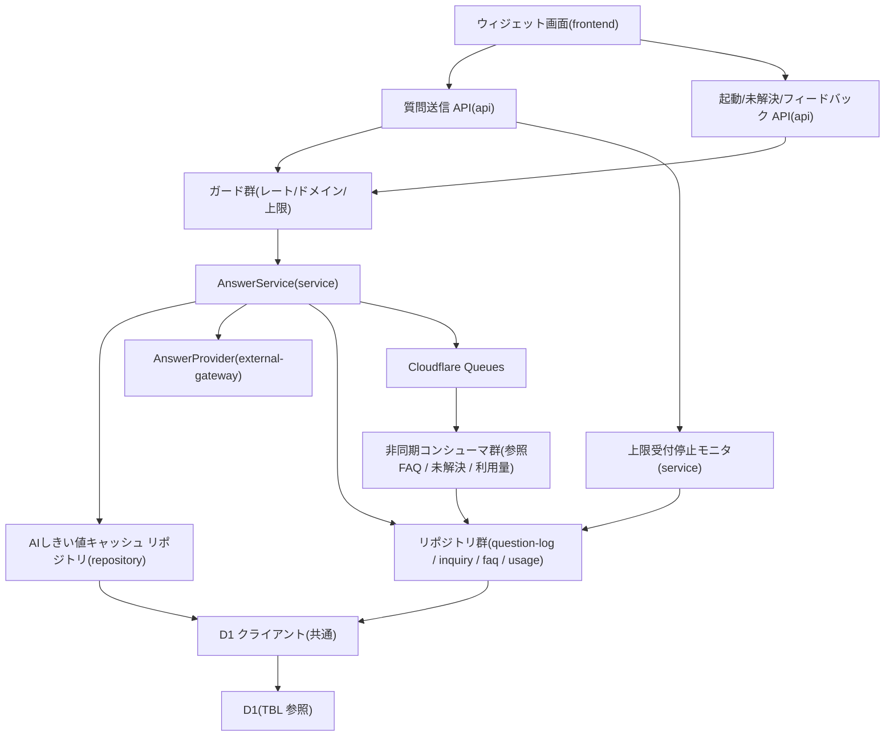

# MOD-001: ウィジェット/AI回答 モジュール構造

> **本構造図は「ウィジェット質問送信 → AI 回答可否判定 → 回答/未解決登録」機能領域のモジュール分割と内向き依存の方向を定義します。**

*種別 モジュール構造図 ・ ステータス ドラフト*

| 項目 | 値 |
|----|----|
| MOD ID | MOD-001 |
| 業務ユースケースID | [UC-041](../../01_requirements/04_business_usecases/UC-041.md#UC-041) ・ [UC-042](../../01_requirements/04_business_usecases/UC-042.md#UC-042) ・ [UC-048](../../01_requirements/04_business_usecases/UC-048.md#UC-048) ・ [UC-050](../../01_requirements/04_business_usecases/UC-050.md#UC-050) ・ [UC-051](../../01_requirements/04_business_usecases/UC-051.md#UC-051) ・ [UC-053](../../01_requirements/04_business_usecases/UC-053.md#UC-053) ・ [UC-057](../../01_requirements/04_business_usecases/UC-057.md#UC-057) ・ [UC-071](../../01_requirements/04_business_usecases/UC-071.md#UC-071) |
| 関連 API / SYS | [API-037](../../02_basic_design/02_backend/03_apis/API-037.md#API-037) ・ [API-038](../../02_basic_design/02_backend/03_apis/API-038.md#API-038) ・ [API-039](../../02_basic_design/02_backend/03_apis/API-039.md#API-039) ・ [API-057](../../02_basic_design/02_backend/03_apis/API-057.md#API-057) ・ [API-069](../../02_basic_design/02_backend/03_apis/API-069.md#API-069) ・ [SYS-001](../../02_basic_design/02_backend/01_system/SYS-001.md#SYS-001) ・ [SYS-003](../../02_basic_design/02_backend/01_system/SYS-003.md#SYS-003) ・ [SYS-005](../../02_basic_design/02_backend/01_system/SYS-005.md#SYS-005) ・ [SYS-008](../../02_basic_design/02_backend/01_system/SYS-008.md#SYS-008) ・ [SYS-016](../../02_basic_design/02_backend/01_system/SYS-016.md#SYS-016) ・ [SYS-018](../../02_basic_design/02_backend/01_system/SYS-018.md#SYS-018) |
| 関連画面 | [SCR-030](../../02_basic_design/01_frontend/01_screens/SCR-030.md#SCR-030) |
| 関連テーブル | [TBL-006](../../02_basic_design/02_backend/04_database/TBL-006.md#TBL-006) ・ [TBL-016](../../02_basic_design/02_backend/04_database/TBL-016.md#TBL-016) ・ [TBL-017](../../02_basic_design/02_backend/04_database/TBL-017.md#TBL-017) ・ [TBL-020](../../02_basic_design/02_backend/04_database/TBL-020.md#TBL-020) ・ [TBL-025](../../02_basic_design/02_backend/04_database/TBL-025.md#TBL-025) ・ [TBL-031](../../02_basic_design/02_backend/04_database/TBL-031.md#TBL-031) |

## 1. 目的

本機能領域は、設置サイトのウィジェットから届いた質問を受け取り、AI 推論で回答可否を判定して回答または未解決案内を返し、非同期に後処理(参照 FAQ 記録・未解決記録・利用量集計)を進める一連の実装単位を定義する。モジュール分割は Next.js on Cloudflare の物理配置(`app/`・`lib/service`・`lib/repository`・`lib/gateway`・`workers/queues`・横断ガード)へ写像し、依存は内向き(frontend → api → service → repository、AI 連携は service → external-gateway)に統一して逆依存・循環依存を作らない。

## 2. モジュール一覧

本機能領域を構成するモジュールを物理配置・種別・責務・入出力で一覧化する。同期経路(Route Handler → Service → Repository)と非同期経路(Service が Queues へ投入 → コンシューマが消費)を分けて配置する。

| モジュールID | モジュール名 | 種別 | 責務 | 主な入力 | 主な出力 |
|----|----|----|----|----|----|
| M-01 | `app/widget`(ウィジェット画面) | frontend | 質問入力・送信、回答/参照 FAQ/サジェスト表示、回答不可・受付停止の案内表示を担う([SCR-030](../../02_basic_design/01_frontend/01_screens/SCR-030.md#SCR-030)) | 利用者操作(質問文・フィードバック) | ウィジェット API 呼び出し |
| M-02 | `app/api/widget/ask/route.ts` | api | 質問送信の受付。認証・入力検証を経て Service へ委譲し回答/未解決/処理エラーを応答する([API-038](../../02_basic_design/02_backend/03_apis/API-038.md#API-038)) | HTTP リクエスト(質問文・対象プロジェクト・セッション) | Service 呼び出し・HTTP レスポンス |
| M-03 | `app/api/widget/bootstrap/route.ts` ・ `app/api/widget/inquiries/route.ts` ・ `app/api/widget/feedback/route.ts` | api | ウィジェット起動・未解決申告登録・回答フィードバックの受付と Service 委譲([API-037](../../02_basic_design/02_backend/03_apis/API-037.md#API-037) ・ [API-039](../../02_basic_design/02_backend/03_apis/API-039.md#API-039) ・ [API-069](../../02_basic_design/02_backend/03_apis/API-069.md#API-069)) | HTTP リクエスト | Service 呼び出し・HTTP レスポンス |
| M-04 | `lib/service/answer`(`AnswerService`) | service | 回答可否判定の中核。しきい値解決・AI 推論呼出・結果判定・質問ログ記録・未回答時の未解決同一 Tx 生成・非同期後処理の投入を統括する([IPO-001](../04_ipo/IPO-001.md#IPO-001)) | 検証済み質問要求・適用しきい値 | Repository/Gateway 呼び出し・Queues 投入・応答 DTO |
| M-05 | `lib/gateway/ai`(`AnswerProvider`) | external-gateway | AI 推論 LLM への回答生成・ヘルスチェック連携。`generate` をタイムアウト付きで呼び出し `AnswerResult` を返す([API-057](../../02_basic_design/02_backend/03_apis/API-057.md#API-057) ・ [EIF-001](../06_external_if/EIF-001.md#EIF-001)) | 質問文・候補 FAQ・ポリシー・しきい値・タイムアウト | `AnswerResult`(`answered` / `unanswerable` / `error`) |
| M-06 | `lib/repository/question-log`(`QuestionLogRepository`) | repository | 質問ログの記録(結果種別・結果理由・スコア・課金対象区分)を D1 へ書き込む | Service からの記録要求 | 記録結果([TBL-025](../../02_basic_design/02_backend/04_database/TBL-025.md#TBL-025)) |
| M-07 | `lib/repository/inquiry`(`InquiryRepository`) | repository | 未解決質問の生成(追跡用識別子付与・元やり取り紐づけ)を D1 へ書き込む | Service からの生成要求 | 記録結果([TBL-017](../../02_basic_design/02_backend/04_database/TBL-017.md#TBL-017)) |
| M-08 | `lib/repository/faq`(`FaqRepository`) | repository | 候補 FAQ(公開分)の参照と参照 FAQ 紐づけの記録を D1 へ行う | Service からの参照/記録要求 | FAQ 取得結果・紐づけ記録([TBL-006](../../02_basic_design/02_backend/04_database/TBL-006.md#TBL-006) ・ [TBL-016](../../02_basic_design/02_backend/04_database/TBL-016.md#TBL-016)) |
| M-09 | `lib/repository/usage`(`UsageMeterRepository`) | repository | 当月利用量計測の参照・更新を D1 へ行う(上限判定・集計の読み書き) | Service/Guard/コンシューマからの参照・更新要求 | 利用量取得/更新結果([TBL-020](../../02_basic_design/02_backend/04_database/TBL-020.md#TBL-020)) |
| M-10 | `lib/db`(D1 クライアント) | 共通 | D1 への接続・トランザクション境界の提供。Repository のみが利用する | Repository からのクエリ・Tx 要求 | D1 実行結果 |
| M-11 | `lib/repository/ai-threshold`(`AiThresholdCacheRepository`) | repository | プロジェクト単位 AI しきい値設定(信頼度・関連度)の照会を D1 へ行う。未登録/取得不能時のグローバル既定へのフォールバックは AnswerService(M-04)が担う([SYS-015](../../02_basic_design/02_backend/01_system/SYS-015.md#SYS-015) ・ [IPO-001](../04_ipo/IPO-001.md#IPO-001)) | 対象プロジェクト | しきい値設定の照会結果([TBL-031](../../02_basic_design/02_backend/04_database/TBL-031.md#TBL-031)) |
| M-12 | `lib/guard/rate-limit`(レート制限ガード) | 共通 | オーナー単位レート制限をゲートウェイ層で全 API 横断に評価し超過を抑制する([SYS-008](../../02_basic_design/02_backend/01_system/SYS-008.md#SYS-008)) | 機能リクエスト(オーナー・機能種別) | 許可 / 抑制([ERR-009](../../02_basic_design/05_errors/ERR-009.md#ERR-009) 429) |
| M-13 | `lib/guard/domain`(許可ドメインガード) | 共通 | 読み込み元ドメインを対象プロジェクトの許可ドメインと照合し起動可否を判定する([SYS-005](../../02_basic_design/02_backend/01_system/SYS-005.md#SYS-005)) | 読み込み元ドメイン・対象プロジェクト | 起動許可 / 拒否([ERR-027](../../02_basic_design/05_errors/ERR-027.md#ERR-027) 403) |
| M-14 | `lib/guard/usage-limit`(上限受付停止モニタ) | service | 質問送信時に当月上限到達を同期判定し受付停止を確定する([SYS-018](../../02_basic_design/02_backend/01_system/SYS-018.md#SYS-018)) | 対象プロジェクトの上限件数・当月利用量 | 受付可 / 受付停止(`usage_limit_reached`) |
| M-15 | `workers/queues/faq-ref-consumer` | batch | 参照 FAQ 記録の非同期後処理を消費する([SYS-001](../../02_basic_design/02_backend/01_system/SYS-001.md#SYS-001)) | Queues メッセージ(回答・根拠 FAQ) | Repository 呼び出し(参照 FAQ 記録) |
| M-16 | `workers/queues/inquiry-consumer` | batch | 未解決質問記録の非同期後処理を消費する([SYS-003](../../02_basic_design/02_backend/01_system/SYS-003.md#SYS-003)) | Queues メッセージ(未解決契機) | Repository 呼び出し(未解決記録) |
| M-17 | `workers/queues/metering-consumer` | batch | 利用量リアルタイム集計の非同期後処理を消費する([SYS-016](../../02_basic_design/02_backend/01_system/SYS-016.md#SYS-016) ・ [BAT-001](../05_batch/BAT-001.md#BAT-001)) | Queues メッセージ(質問到達イベント) | Repository 呼び出し(利用量更新)・後続契機引き渡し |

## 3. モジュール構造図

モジュール間の依存を内向き(上位 → 下位)で示す。ガードは Route Handler の前段に作用し、AI 連携は外部ノードとして分離、非同期後処理は Service からの Queues 投入をコンシューマが消費する。

## 4. 依存関係一覧

呼び出し元・呼び出し先の依存を、同期/非同期の別と用途で一覧化する。非同期は写像先(Queues 経由)を明示する。

| 呼び出し元 | 呼び出し先 | 用途 | 同期/非同期 | 備考 |
|----|----|----|----|----|
| M-01 ウィジェット画面 | M-02 質問送信 API | 質問送信・回答/未解決応答の取得 | 同期 | 入出力契約は [IO-001](../03_io_specs/IO-001.md#IO-001) |
| M-01 ウィジェット画面 | M-03 起動/未解決/フィードバック API | 起動トークン取得・未解決申告・回答フィードバック送信 | 同期 | — |
| M-02 質問送信 API | M-12 レート制限ガード | オーナー単位レート制限の評価 | 同期 | 超過は 429([ERR-009](../../02_basic_design/05_errors/ERR-009.md#ERR-009)) |
| M-02 質問送信 API | M-13 許可ドメインガード | 読み込み元ドメイン照合 | 同期 | 不一致は 403([ERR-027](../../02_basic_design/05_errors/ERR-027.md#ERR-027)) |
| M-02 質問送信 API | M-14 上限受付停止モニタ | 当月上限到達の同期判定 | 同期 | 到達時 200 `unanswered`(`usage_limit_reached`)で graceful 応答([API-038](../../02_basic_design/02_backend/03_apis/API-038.md#API-038)) |
| M-02 質問送信 API | M-04 AnswerService | 回答可否判定の委譲 | 同期 | 判定ロジックは [IPO-001](../04_ipo/IPO-001.md#IPO-001) |
| M-04 AnswerService | M-11 AIしきい値キャッシュリポジトリ | プロジェクト設定しきい値の照会(未登録時は AnswerService がグローバル既定へフォールバック) | 同期 | フォールバック伝播は [SYS-015](../../02_basic_design/02_backend/01_system/SYS-015.md#SYS-015)。値の正本は [システム仕様書 §1](../../02_basic_design/07_system-spec.md#1-aiしきい値) |
| M-04 AnswerService | M-05 AnswerProvider | AI 推論による回答生成 | 同期 | タイムアウトは [システム仕様書 §3](../../02_basic_design/07_system-spec.md#3-タイムアウトセッション認証)。連携仕様は [EIF-001](../06_external_if/EIF-001.md#EIF-001) |
| M-04 AnswerService | M-06 質問ログリポジトリ | 質問ログの記録(回答/未回答/処理エラー) | 同期 | 物理カラムは [DBP-001](../07_db_physical/DBP-001.md#DBP-001) |
| M-04 AnswerService | M-07 未解決リポジトリ | 未回答時の未解決質問を同一 Tx で生成 | 同期 | 未回答 4 理由のみ。処理エラー時は生成しない([FR-082](../../01_requirements/02_functional_requirement/02_faq-ai-fr.md#FR-082)) |
| M-04 AnswerService | M-08 FAQ リポジトリ | 候補 FAQ(公開分)の参照 | 同期 | 参照 FAQ 紐づけ記録は非同期後処理で実施([SYS-001](../../02_basic_design/02_backend/01_system/SYS-001.md#SYS-001)) |
| M-04 AnswerService | Cloudflare Queues | 参照 FAQ 記録・未解決記録・利用量集計の後処理投入 | 非同期(Queues 経由) | 投入先コンシューマは M-15/M-16/M-17 |
| M-06〜M-09 各リポジトリ | M-10 D1 クライアント | クエリ実行・トランザクション境界 | 同期 | Repository のみが D1 を利用(内向き依存) |
| M-14 上限受付停止モニタ | M-09 利用量リポジトリ | 当月利用量・上限設定の参照 | 同期 | [TBL-020](../../02_basic_design/02_backend/04_database/TBL-020.md#TBL-020) ・ [TBL-009](../../02_basic_design/02_backend/04_database/TBL-009.md#TBL-009) |
| M-11 しきい値解決 | M-10 D1 クライアント | プロジェクト設定値の取得 | 同期 | [TBL-031](../../02_basic_design/02_backend/04_database/TBL-031.md#TBL-031) |
| M-15 参照 FAQ コンシューマ | M-08 FAQ リポジトリ | 参照 FAQ 紐づけの記録 | 非同期(Queues 経由) | [SYS-001](../../02_basic_design/02_backend/01_system/SYS-001.md#SYS-001) |
| M-16 未解決コンシューマ | M-07 未解決リポジトリ | 未解決質問記録の追跡起点整備 | 非同期(Queues 経由) | [SYS-003](../../02_basic_design/02_backend/01_system/SYS-003.md#SYS-003) |
| M-17 利用量コンシューマ | M-09 利用量リポジトリ | 当月利用量の集計・更新 | 非同期(Queues 経由) | 集計・契機引き渡しは [BAT-001](../05_batch/BAT-001.md#BAT-001)。上限超過分は DLQ へ退避 |

## 5. モジュール別処理概要

各モジュールの処理概要と例外処理の方針を示す。実装コード本文・SQL 本文は書かない。しきい値・タイムアウト・上限の具体値は正本へ委ねる。

| モジュール | 処理概要 | 例外処理 | 備考 |
|----|----|----|----|
| M-02 質問送信 API | 認証・入力検証を行い、ガード群(レート/ドメイン/上限)通過後に AnswerService へ委譲、回答/未解決/処理エラーを応答へ写像する | DB 書き込み失敗時はエラー識別子を生成し 500 で返す([FR-084](../../01_requirements/02_functional_requirement/02_faq-ai-fr.md#FR-084)) | 受付停止は 200 graceful([API-038](../../02_basic_design/02_backend/03_apis/API-038.md#API-038)) |
| M-04 AnswerService | 適用しきい値を解決し AI 推論を呼び出して結果を判定、`answered` は提示・`unanswered` は質問ログと未解決を同一 Tx で生成・`error` は処理エラーとして確定し後処理を Queues へ投入する | AI タイムアウト/プロバイダエラーは処理エラーとして未解決を生成しない([FR-082](../../01_requirements/02_functional_requirement/02_faq-ai-fr.md#FR-082)) | 判定詳細は [IPO-001](../04_ipo/IPO-001.md#IPO-001) |
| M-05 AnswerProvider | 質問文・候補 FAQ・ポリシー・しきい値を渡してタイムアウト付きで推論を呼び出し `AnswerResult` を返す | タイムアウト/プロバイダエラー/レート制限はリクエスト内リトライせず `kind=error` で即時打ち切り([ERR-036](../../02_basic_design/05_errors/ERR-036.md#ERR-036) 503) | 連携仕様は [EIF-001](../06_external_if/EIF-001.md#EIF-001) |
| M-06〜M-09 リポジトリ群 | 質問ログ・未解決・FAQ・利用量の D1 アクセスを担い、Service/Guard/コンシューマからの参照・更新要求を実行する | 一時障害は呼び出し元へ伝播し Tx をロールバック | 物理設計は [DBP-001](../07_db_physical/DBP-001.md#DBP-001) |
| M-11 AIしきい値キャッシュリポジトリ | プロジェクト設定しきい値を D1 から照会する(未登録/取得不能時のグローバル既定フォールバックは M-04 が実施) | 取得不能時は M-04 がグローバル既定で継続しアラート通知([SYS-015](../../02_basic_design/02_backend/01_system/SYS-015.md#SYS-015)) | 値の正本は [システム仕様書 §1](../../02_basic_design/07_system-spec.md#1-aiしきい値) |
| M-12 レート制限ガード | オーナー・機能種別ごとの上限を全 API 横断で評価し、範囲内は後段へ渡し超過は抑制する | 超過は後段へ渡さず 429 で応答し記録([ERR-009](../../02_basic_design/05_errors/ERR-009.md#ERR-009)) | 上限の正本は [システム仕様書](../../02_basic_design/07_system-spec.md) |
| M-13 許可ドメインガード | 読み込み元ドメインを許可ドメインと照合し、一致時のみ起動を許可する | 不一致・未設定は起動拒否 403([ERR-027](../../02_basic_design/05_errors/ERR-027.md#ERR-027)) | [SYS-005](../../02_basic_design/02_backend/01_system/SYS-005.md#SYS-005) |
| M-14 上限受付停止モニタ | 当該プロジェクトの上限件数と当月利用量を同期照合し、到達済みなら受付停止を確定する | 到達時は課金アカウント状態を有効のまま維持し受付のみ停止 | 状態名は [状態モデル](../../02_basic_design/08_state-model.md)。[SYS-018](../../02_basic_design/02_backend/01_system/SYS-018.md#SYS-018) |
| M-15〜M-17 非同期コンシューマ群 | 参照 FAQ 記録・未解決記録・利用量集計を Queues メッセージから消費して Repository を起動する | 消費失敗は自動リトライ、上限超過分は DLQ へ退避 | 冪等キーで二重処理を抑止([BAT-001](../05_batch/BAT-001.md#BAT-001)) |

## 6. 後続工程への引き継ぎ事項

実装・テスト設計へ引き継ぐ観点(依存方向の逸脱検出・非同期境界・外部連携の切り離しテスト)を箇条書きで示す。

- 内向き依存の逸脱検証: D1 クライアント(M-10)を利用するのは Repository 群のみで、Service/Guard/API から直接 D1 を触らないこと。逆依存(Repository → Service)・循環依存が生じていないこと。
- 同期経路の境界検証: Route Handler → ガード群 → AnswerService → Repository の順序が保たれ、上限受付停止モニタ(M-14)が AI 推論呼出より前に評価されること。
- 非同期境界の検証: AnswerService からの Queues 投入(参照 FAQ 記録・未解決記録・利用量集計)と各コンシューマ消費の投入・消費・冪等・DLQ 滞留([BAT-001](../05_batch/BAT-001.md#BAT-001))。
- external-gateway スタブ化: AnswerProvider(M-05)をスタブ化した AnswerService 単体テストで `answered` / `unanswerable` / `error` の各分岐を分離検証すること。
- モジュール境界の契約整合: 質問送信 API と AnswerService 間、AnswerService と各 Repository 間の入出力契約が [IO-001](../03_io_specs/IO-001.md#IO-001) ・ [IPO-001](../04_ipo/IPO-001.md#IPO-001) と一致すること。
- 未解決同一 Tx の境界: 未回答 4 理由時に質問ログ(M-06)と未解決(M-07)を同一トランザクションで生成し、処理エラー時は未解決を生成しないモジュール分担([FR-082](../../01_requirements/02_functional_requirement/02_faq-ai-fr.md#FR-082))。
