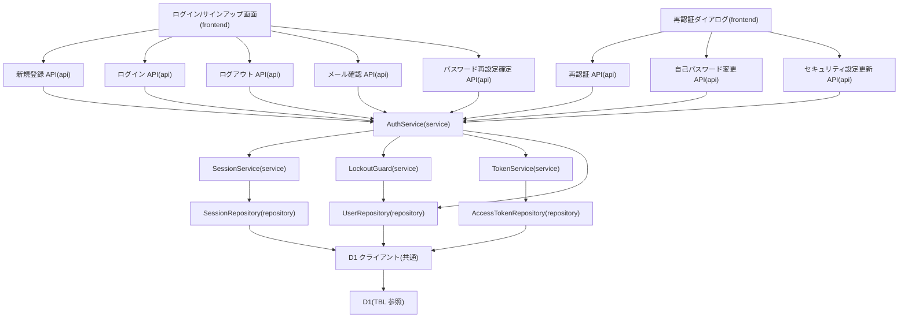

# MOD-002: auth モジュール構造

> **本構造図は「新規登録・ログイン・ログアウト・パスワード再設定・トークン発行検証・再認証」機能領域のモジュール分割と内向き依存の方向を定義します。**

*種別 モジュール構造図 ・ ステータス ドラフト*

| 項目 | 値 |
|----|----|
| MOD ID | MOD-002 |
| 業務ユースケースID | [UC-001](../../01_requirements/04_business_usecases/UC-001.md#UC-001) ・ [UC-002](../../01_requirements/04_business_usecases/UC-002.md#UC-002) ・ [UC-003](../../01_requirements/04_business_usecases/UC-003.md#UC-003) ・ [UC-005](../../01_requirements/04_business_usecases/UC-005.md#UC-005) ・ [UC-009](../../01_requirements/04_business_usecases/UC-009.md#UC-009) ・ [UC-010](../../01_requirements/04_business_usecases/UC-010.md#UC-010) ・ [UC-067](../../01_requirements/04_business_usecases/UC-067.md#UC-067) ・ [UC-068](../../01_requirements/04_business_usecases/UC-068.md#UC-068) |
| 関連 API / SYS | [API-001](../../02_basic_design/02_backend/03_apis/API-001.md#API-001) ・ [API-002](../../02_basic_design/02_backend/03_apis/API-002.md#API-002) ・ [API-003](../../02_basic_design/02_backend/03_apis/API-003.md#API-003) ・ [API-005](../../02_basic_design/02_backend/03_apis/API-005.md#API-005) ・ [API-006](../../02_basic_design/02_backend/03_apis/API-006.md#API-006) ・ [API-010](../../02_basic_design/02_backend/03_apis/API-010.md#API-010) ・ [API-013](../../02_basic_design/02_backend/03_apis/API-013.md#API-013) ・ [API-015](../../02_basic_design/02_backend/03_apis/API-015.md#API-015) ・ [SYS-028](../../02_basic_design/02_backend/01_system/SYS-028.md#SYS-028) ・ [SYS-029](../../02_basic_design/02_backend/01_system/SYS-029.md#SYS-029) |
| 関連画面 | [SCR-001](../../02_basic_design/01_frontend/01_screens/SCR-001.md#SCR-001) ・ [SCR-002](../../02_basic_design/01_frontend/01_screens/SCR-002.md#SCR-002) ・ [SCR-003](../../02_basic_design/01_frontend/01_screens/SCR-003.md#SCR-003) ・ [SCR-034](../../02_basic_design/01_frontend/01_screens/SCR-034.md#SCR-034) |
| 関連テーブル | [TBL-001](../../02_basic_design/02_backend/04_database/TBL-001.md#TBL-001) ・ [TBL-013](../../02_basic_design/02_backend/04_database/TBL-013.md#TBL-013) ・ [TBL-014](../../02_basic_design/02_backend/04_database/TBL-014.md#TBL-014) |

## 1. 目的

本機能領域は、新規登録・ログイン・ログアウト・再認証・メール確認・パスワード再設定・自己パスワード変更・セキュリティ設定更新の各操作を受け付け、セッションの発行・有効性判定・失効、短期トークン(確認 / 再設定 / 再認証等)の発行・検証、ログイン失敗ロックアウトの判定までを一貫して担う実装単位を定義する。モジュール分割は Next.js on Cloudflare の物理配置(`app/api/auth/**`・`app/api/me/**`・`lib/service`・`lib/repository`)へ写像し、依存は内向き(frontend → api → service → repository)に統一して逆依存・循環依存を作らない。本機能領域は完全同期処理で完結し、Queues・Cron を用いる非同期後処理・外部連携(external-gateway)は持たない。

## 2. モジュール一覧

本機能領域を構成するモジュールを物理配置・種別・責務・入出力で一覧化する。クラス構造は [CLS-002](../10_class/CLS-002.md#CLS-002) と整合させ、Route Handler と Service の対応を 1 対 1 で維持する。

| モジュールID | モジュール名 | 種別 | 責務 | 主な入力 | 主な出力 |
|----|----|----|----|----|----|
| M-01 | `app/(auth)`(ログイン / サインアップ画面) | frontend | メールアドレス・パスワードの入力受付、ログイン/新規登録の送信、認証エラー表示を担う([SCR-001](../../02_basic_design/01_frontend/01_screens/SCR-001.md#SCR-001) ・ [SCR-002](../../02_basic_design/01_frontend/01_screens/SCR-002.md#SCR-002) ・ [SCR-003](../../02_basic_design/01_frontend/01_screens/SCR-003.md#SCR-003)) | 利用者操作(メールアドレス・パスワード・規約同意) | auth API 呼び出し |
| M-02 | `app/(auth)/re-auth-dialog`(再認証ダイアログ) | frontend | 重要操作前のパスワード再入力を受け付け、再認証トークン取得後に呼出元操作を続行させる([SCR-034](../../02_basic_design/01_frontend/01_screens/SCR-034.md#SCR-034)) | 利用者操作(パスワード) | re-auth API 呼び出し |
| M-03 | `app/api/auth/signup/route.ts` ・ `app/api/auth/signup/email-verification/route.ts` | api | 新規登録・確認メール再送要求の受付、入力検証、Service 呼び出し([API-001](../../02_basic_design/02_backend/03_apis/API-001.md#API-001)) | HTTP リクエスト(表示名・メール・パスワード・同意) | Service 呼び出し・HTTP レスポンス |
| M-04 | `app/api/auth/login/route.ts` | api | ログイン要求の受付、入力検証、Service 呼び出し([API-002](../../02_basic_design/02_backend/03_apis/API-002.md#API-002)) | HTTP リクエスト(メール・パスワード) | Service 呼び出し・HTTP レスポンス |
| M-05 | `app/api/auth/logout/route.ts` | api | ログアウト要求の受付、現在セッションの失効を Service へ委譲([API-003](../../02_basic_design/02_backend/03_apis/API-003.md#API-003)) | HTTP リクエスト(セッション識別情報) | Service 呼び出し・HTTP レスポンス |
| M-06 | `app/api/auth/re-auth/route.ts` | api | 再認証要求の受付、パスワード再照合・再認証トークン発行を Service へ委譲([API-005](../../02_basic_design/02_backend/03_apis/API-005.md#API-005)) | HTTP リクエスト(パスワード) | Service 呼び出し・HTTP レスポンス |
| M-07 | `app/api/auth/email-verifications/[token]/route.ts` | api | メール確認要求の受付、トークン検証・確認確定を Service へ委譲([API-006](../../02_basic_design/02_backend/03_apis/API-006.md#API-006)) | HTTP リクエスト(確認トークン) | Service 呼び出し・HTTP レスポンス |
| M-08 | `app/api/auth/password-reset/route.ts` | api | パスワード再設定確定要求の受付、トークン検証・更新を Service へ委譲([API-010](../../02_basic_design/02_backend/03_apis/API-010.md#API-010)) | HTTP リクエスト(再設定トークン・新パスワード) | Service 呼び出し・HTTP レスポンス |
| M-09 | `app/api/me/password/route.ts` | api | 認証済み利用者の自己パスワード変更要求の受付、再認証トークン検証を Service へ委譲([API-013](../../02_basic_design/02_backend/03_apis/API-013.md#API-013)) | HTTP リクエスト(再認証トークン・新パスワード) | Service 呼び出し・HTTP レスポンス |
| M-10 | `app/api/me/settings/route.ts` | api | セキュリティ設定(メール / パスワード)更新要求の受付、再認証トークン検証を Service へ委譲([API-015](../../02_basic_design/02_backend/03_apis/API-015.md#API-015)) | HTTP リクエスト(メール / パスワード・再認証トークン) | Service 呼び出し・HTTP レスポンス |
| M-11 | `lib/service/auth`(`AuthService`) | service | 新規登録・ログイン・ログアウト・再認証・メール確認・パスワード再設定・自己パスワード変更・セキュリティ設定更新の業務判定を統括し、`SessionService`・`LockoutGuard`・`TokenService` を呼び出す([CLS-002](../10_class/CLS-002.md#CLS-002)) | 検証済み各操作の論理入力 | Repository/Service(部品) 呼び出し・応答 DTO |
| M-12 | `lib/service/auth/session`(`SessionService`) | service | セッションの有効性判定(失効優先順位・タイムアウト)・発行・失効(単体 / 全件)・重要操作の再認証充足判定を担う([IPO-013](../04_ipo/IPO-013.md#IPO-013)) | セッション識別情報・対象操作種別 | 判定結果(`SessionVerdict` / `GuardVerdict`)・Repository 呼び出し |
| M-13 | `lib/service/auth/lockout-guard`(`LockoutGuard`) | service | ログイン試行のロック中判定・失敗計上・しきい値到達によるロック発動・解除を担う([IPO-014](../04_ipo/IPO-014.md#IPO-014)) | ユーザーID | 判定結果(`GuardVerdict` / `LockoutState`)・Repository 呼び出し |
| M-14 | `lib/service/auth/token`(`TokenService`) | service | メール確認 / パスワード再設定 / 再認証等の短期トークンの発行・検証・使用済み化・未使用トークン一括失効を担う | ユーザーID(任意)・用途・付随情報 | `TokenIssueResult` / `TokenVerifyResult`・Repository 呼び出し |
| M-15 | `lib/repository/user`(`UserRepository`) | repository | ユーザーの永続化・照会・パスワードハッシュ / メール / 未確認メール / ログイン失敗状態の更新を D1 へ行う | Service からの取得 / 更新要求 | 取得結果 / 更新結果([TBL-001](../../02_basic_design/02_backend/04_database/TBL-001.md#TBL-001)) |
| M-16 | `lib/repository/session`(`SessionRepository`) | repository | セッションの生成・照会・最終アクセス更新・失効(単体 / 全件)を D1 へ行う | Service からの取得 / 更新要求 | 取得結果 / 更新結果([TBL-013](../../02_basic_design/02_backend/04_database/TBL-013.md#TBL-013)) |
| M-17 | `lib/repository/access-token`(`AccessTokenRepository`) | repository | 短期トークンの生成・ハッシュ照会・使用済み化・利用者別未使用トークン一括失効を D1 へ行う | Service からの取得 / 更新要求 | 取得結果 / 更新結果([TBL-014](../../02_basic_design/02_backend/04_database/TBL-014.md#TBL-014)) |
| M-18 | `lib/db`(D1 クライアント) | 共通 | D1 への接続・トランザクション境界の提供。Repository のみが利用する | Repository からのクエリ・Tx 要求 | D1 実行結果 |

## 3. モジュール構造図

モジュール間の依存を内向き(上位 → 下位)で示す。Route Handler は用途別に分離しつつ単一の `AuthService` へ委譲し、`AuthService` はセッション・ロックアウト・トークンの各部品 Service を呼び出す。本機能領域は外部連携(external-gateway)・非同期処理(Queues/Cron)を持たない。

## 4. 依存関係一覧

呼び出し元・呼び出し先の依存を、同期/非同期の別と用途で一覧化する。本機能領域はすべて同期呼び出しで完結する。

| 呼び出し元 | 呼び出し先 | 用途 | 同期/非同期 | 備考 |
|----|----|----|----|----|
| M-01 ログイン/サインアップ画面 | M-03 新規登録 API | 新規登録・確認メール再送の送信 | 同期 | — |
| M-01 ログイン/サインアップ画面 | M-04 ログイン API | ログイン送信 | 同期 | — |
| M-01 ログイン/サインアップ画面 | M-05 ログアウト API | ログアウト送信 | 同期 | — |
| M-01 ログイン/サインアップ画面 | M-07 メール確認 API | メール確認トークン送信 | 同期 | — |
| M-01 ログイン/サインアップ画面 | M-08 パスワード再設定確定 API | 再設定トークン・新パスワード送信 | 同期 | — |
| M-02 再認証ダイアログ | M-06 再認証 API | パスワード再照合・再認証トークン取得 | 同期 | — |
| M-02 再認証ダイアログ | M-09 自己パスワード変更 API | 再認証トークン付き新パスワード送信 | 同期 | 呼出元操作の一種 |
| M-02 再認証ダイアログ | M-10 セキュリティ設定更新 API | 再認証トークン付きメール / パスワード送信 | 同期 | 呼出元操作の一種 |
| M-03〜M-10 各 API | M-11 AuthService | 各操作の業務判定委譲 | 同期 | クラス対応は [CLS-002](../10_class/CLS-002.md#CLS-002) |
| M-11 AuthService | M-12 SessionService | セッション有効性判定・発行・失効・再認証充足判定 | 同期 | 判定条件は [IPO-013](../04_ipo/IPO-013.md#IPO-013) |
| M-11 AuthService | M-13 LockoutGuard | ログイン試行のロック中判定・失敗計上・ロック発動・解除 | 同期 | 判定条件は [IPO-014](../04_ipo/IPO-014.md#IPO-014) |
| M-11 AuthService | M-14 TokenService | 確認 / 再設定 / 再認証トークンの発行・検証・使用済み化 | 同期 | `meta` 構造は [TBL-014](../../02_basic_design/02_backend/04_database/TBL-014.md#TBL-014) |
| M-11 AuthService | M-15 UserRepository | ユーザーの参照・更新(登録・パスワード・メール・ログイン失敗状態) | 同期 | [TBL-001](../../02_basic_design/02_backend/04_database/TBL-001.md#TBL-001) |
| M-12 SessionService | M-16 SessionRepository | セッションの参照・更新(発行・最終アクセス・失効) | 同期 | [TBL-013](../../02_basic_design/02_backend/04_database/TBL-013.md#TBL-013) |
| M-13 LockoutGuard | M-15 UserRepository | ログイン連続失敗回数・ロック解除予定日時の参照・更新 | 同期 | [TBL-001](../../02_basic_design/02_backend/04_database/TBL-001.md#TBL-001) `login_failed_count` / `locked_until` |
| M-14 TokenService | M-17 AccessTokenRepository | 短期トークンの参照・更新(発行・ハッシュ照会・使用済み化・一括失効) | 同期 | [TBL-014](../../02_basic_design/02_backend/04_database/TBL-014.md#TBL-014) |
| M-15〜M-17 各リポジトリ | M-18 D1 クライアント | クエリ実行・トランザクション境界 | 同期 | Repository のみが D1 を利用(内向き依存) |

## 5. モジュール別処理概要

各モジュールの処理概要と例外処理の方針を示す。実装コード本文・SQL 本文は書かない。しきい値・タイムアウトの具体値は正本へ委ねる。

| モジュール | 処理概要 | 例外処理 | 備考 |
|----|----|----|----|
| M-04 ログイン API | 入力検証を経て AuthService へ委譲し、セッション発行結果を応答へ写像する | 検証エラーは 400([ERR-001](../../02_basic_design/05_errors/ERR-001.md#ERR-001))、ロック中は 423([ERR-003](../../02_basic_design/05_errors/ERR-003.md#ERR-003)) | [API-002](../../02_basic_design/02_backend/03_apis/API-002.md#API-002) |
| M-11 AuthService | 各操作(登録/ログイン/ログアウト/再認証/メール確認/パスワード再設定/自己パスワード変更/セキュリティ設定更新)の業務判定を統括し、部品 Service(セッション・ロックアウト・トークン)を呼び出して Repository へ反映する | 資格情報不正・メール重複・トークン期限切れ/使用済み等は各 API のエラー応答へ写像([CLS-002](../10_class/CLS-002.md#CLS-002) §5 メソッド一覧) | 判定ロジック詳細は [IPO-013](../04_ipo/IPO-013.md#IPO-013) ・ [IPO-014](../04_ipo/IPO-014.md#IPO-014) |
| M-12 SessionService | 失効優先順位(強制失効 → 絶対タイムアウト → 無操作タイムアウト)でセッション有効性を判定し、失効時は無効化・再ログイン誘導、重要操作時は再認証充足を判定する | 判定不能時はセッション無効相当として扱い操作を許可しない | タイムアウト正本は [システム仕様書 §3](../../02_basic_design/07_system-spec.md#3-タイムアウトセッション認証) |
| M-13 LockoutGuard | ロック中はログイン試行を認証せず一律拒否し、認証失敗ごとに連続失敗回数を加算、しきい値到達でロックを発動、認証成功で回数を初期化する | ロック中拒否は 423([ERR-003](../../02_basic_design/05_errors/ERR-003.md#ERR-003)) | しきい値・ロック時間の正本は [システム仕様書 §3](../../02_basic_design/07_system-spec.md#3-タイムアウトセッション認証) |
| M-14 TokenService | 用途別(確認 / 再設定 / 再認証等)の短期トークンを発行しハッシュで永続化、検証時は期限切れ・使用済み・不存在を判定する | 期限切れ・使用済み・不存在はそれぞれ対応するエラー応答へ写像 | `meta` 構造は [TBL-014](../../02_basic_design/02_backend/04_database/TBL-014.md#TBL-014) |
| M-15〜M-17 リポジトリ群 | ユーザー・セッション・短期トークンの D1 アクセスを担い、Service からの参照・更新要求を実行する | 一時障害は呼び出し元へ伝播し Tx をロールバック | 物理設計は [DBP-002](../07_db_physical/DBP-002.md#DBP-002) |

## 6. 後続工程への引き継ぎ事項

実装・テスト設計へ引き継ぐ観点(依存方向の逸脱検出・同期境界・部品 Service 分離テスト)を箇条書きで示す。

- 内向き依存の逸脱検証: D1 クライアント(M-18)を利用するのは Repository 群のみで、Service/API から直接 D1 を触らないこと。逆依存(Repository → Service)・循環依存が生じていないこと。
- 同期経路の境界検証: Route Handler → AuthService → 部品 Service(SessionService/LockoutGuard/TokenService)→ Repository の順序が保たれ、ロック中判定([IPO-014](../04_ipo/IPO-014.md#IPO-014))が資格情報照合より前に評価されること。
- 部品 Service 単体テストの分離: SessionService(セッション失効・再認証判定)・LockoutGuard(ロックアウト判定)・TokenService(トークン発行検証)をそれぞれスタブ化した AuthService 単体テストで各分岐を分離検証すること。
- モジュール境界の契約整合: 各 Route Handler と AuthService 間、AuthService と各 Repository 間の入出力契約が [CLS-002](../10_class/CLS-002.md#CLS-002) §5〜§6 と一致すること。
- パスワード再設定確定後の全セッション失効(M-12 経由)、確認メール再送時の未使用トークン一括失効(M-14 経由)がそれぞれ対応する API 経路で確実に呼び出されるモジュール分担であることをテスト設計でケース化する。
- 権限者による手動ロック解除の受付経路は [IPO-014](../04_ipo/IPO-014.md#IPO-014) 側で未確定(課題候補)であり、対応する Route Handler / Service メソッドは本図に含めていない。確定後にモジュール一覧・依存関係を追補すること。
