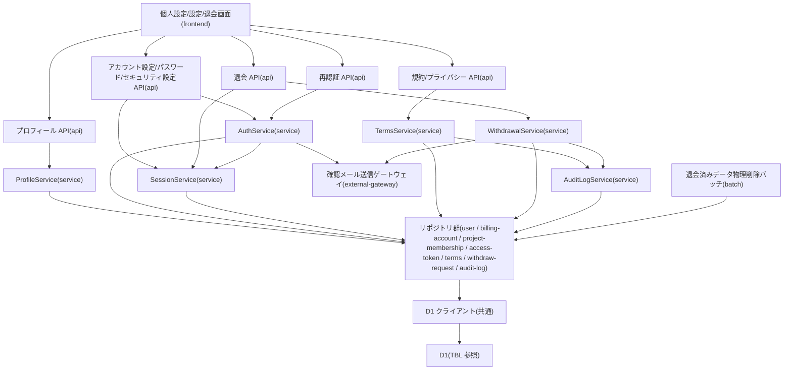

# MOD-003: account モジュール構造

> **本構造図は「自己プロフィール参照・表示名更新・セキュリティ設定(メール/パスワード)更新・利用規約/プライバシーポリシー同意・アカウント即時退会」機能領域のモジュール分割と内向き依存の方向を定義します。**

*種別 モジュール構造図 ・ ステータス ドラフト*

| 項目 | 値 |
|----|----|
| MOD ID | MOD-003 |
| 業務ユースケースID | [UC-008](../../01_requirements/04_business_usecases/UC-008.md#UC-008) ・ [UC-009](../../01_requirements/04_business_usecases/UC-009.md#UC-009) ・ [UC-010](../../01_requirements/04_business_usecases/UC-010.md#UC-010) ・ [UC-012](../../01_requirements/04_business_usecases/UC-012.md#UC-012) ・ [UC-013](../../01_requirements/04_business_usecases/UC-013.md#UC-013) ・ [UC-022](../../01_requirements/04_business_usecases/UC-022.md#UC-022) ・ [UC-079](../../01_requirements/04_business_usecases/UC-079.md#UC-079) |
| 関連 API / SYS | [API-005](../../02_basic_design/02_backend/03_apis/API-005.md#API-005) ・ [API-012](../../02_basic_design/02_backend/03_apis/API-012.md#API-012) ・ [API-013](../../02_basic_design/02_backend/03_apis/API-013.md#API-013) ・ [API-014](../../02_basic_design/02_backend/03_apis/API-014.md#API-014) ・ [API-015](../../02_basic_design/02_backend/03_apis/API-015.md#API-015) ・ [API-052](../../02_basic_design/02_backend/03_apis/API-052.md#API-052) ・ [API-053](../../02_basic_design/02_backend/03_apis/API-053.md#API-053) ・ [API-054](../../02_basic_design/02_backend/03_apis/API-054.md#API-054) ・ [API-055](../../02_basic_design/02_backend/03_apis/API-055.md#API-055) ・ [API-056](../../02_basic_design/02_backend/03_apis/API-056.md#API-056) ・ [API-064](../../02_basic_design/02_backend/03_apis/API-064.md#API-064) ・ [SYS-027](../../02_basic_design/02_backend/01_system/SYS-027.md#SYS-027) |
| 関連画面 | [SCR-019](../../02_basic_design/01_frontend/01_screens/SCR-019.md#SCR-019) ・ [SCR-022](../../02_basic_design/01_frontend/01_screens/SCR-022.md#SCR-022) ・ [SCR-029](../../02_basic_design/01_frontend/01_screens/SCR-029.md#SCR-029) |
| 関連テーブル | [TBL-001](../../02_basic_design/02_backend/04_database/TBL-001.md#TBL-001) ・ [TBL-002](../../02_basic_design/02_backend/04_database/TBL-002.md#TBL-002) ・ [TBL-003](../../02_basic_design/02_backend/04_database/TBL-003.md#TBL-003) ・ [TBL-012](../../02_basic_design/02_backend/04_database/TBL-012.md#TBL-012) ・ [TBL-014](../../02_basic_design/02_backend/04_database/TBL-014.md#TBL-014) ・ [TBL-023](../../02_basic_design/02_backend/04_database/TBL-023.md#TBL-023) ・ [TBL-024](../../02_basic_design/02_backend/04_database/TBL-024.md#TBL-024) ・ [TBL-027](../../02_basic_design/02_backend/04_database/TBL-027.md#TBL-027) |

## 1. 目的

本機能領域は、認証済みアカウント利用者が自身のプロフィール(表示名)・セキュリティ設定(メールアドレス・パスワード)を参照・変更し、利用規約・プライバシーポリシーへ同意し、アカウントを即時退会するまでの実装単位を定義する。モジュール分割は Next.js on Cloudflare の物理配置(`app/account`・`app/api/me/**`・`app/api/terms|privacy/**`・`app/api/withdrawals/route.ts`・`lib/service`・`lib/repository`)へ写像し、依存は内向き(frontend → api → service → repository)に統一する。重要操作(パスワード変更・セキュリティ設定更新・退会)は再認証済みであることを前段のガードで確認し、退会に伴う運用データの物理削除は非同期バッチへ引き継ぐ。

## 2. モジュール一覧

本機能領域を構成するモジュールを物理配置・種別・責務・入出力で一覧化する。同期経路(Route Handler → Service → Repository)を主とし、退会後の運用データ削除のみ非同期バッチへ引き継ぐ。

| モジュールID | モジュール名 | 種別 | 責務 | 主な入力 | 主な出力 |
|----|----|----|----|----|----|
| M-01 | `app/account`(個人設定/設定/退会画面) | frontend | プロフィール・セキュリティ・参加プロジェクトの表示編集、支払方法/退会セクションの表示、退会確認の受付を担う([SCR-022](../../02_basic_design/01_frontend/01_screens/SCR-022.md#SCR-022) ・ [SCR-029](../../02_basic_design/01_frontend/01_screens/SCR-029.md#SCR-029) ・ [SCR-019](../../02_basic_design/01_frontend/01_screens/SCR-019.md#SCR-019)) | 利用者操作(表示名・メール・パスワード・退会確認メール) | アカウント API 呼び出し |
| M-02 | `app/api/me/profile/route.ts` | api | 自己プロフィールの取得(GET)・表示名更新(PATCH)の受付、認証・入力検証を経て Service へ委譲する([API-064](../../02_basic_design/02_backend/03_apis/API-064.md#API-064) ・ [API-012](../../02_basic_design/02_backend/03_apis/API-012.md#API-012)) | HTTP リクエスト | Service 呼び出し・HTTP レスポンス |
| M-03 | `app/api/owner/settings/route.ts` ・ `app/api/me/password/route.ts` ・ `app/api/me/settings/route.ts` | api | アカウント設定取得([API-014](../../02_basic_design/02_backend/03_apis/API-014.md#API-014))・自己パスワード変更([API-013](../../02_basic_design/02_backend/03_apis/API-013.md#API-013))・セキュリティ設定(メール/パスワード)更新([API-015](../../02_basic_design/02_backend/03_apis/API-015.md#API-015))の受付と Service 委譲 | HTTP リクエスト(新メール/新パスワード・再認証トークン) | Service 呼び出し・HTTP レスポンス |
| M-04 | `app/api/terms/current/route.ts` ・ `app/api/privacy/current/route.ts` ・ `app/api/terms/agree/route.ts` ・ `app/api/privacy/agree/route.ts` | api | 利用規約/プライバシーポリシーの最新版取得・同意登録の受付と Service 委譲([API-052](../../02_basic_design/02_backend/03_apis/API-052.md#API-052)〜[API-055](../../02_basic_design/02_backend/03_apis/API-055.md#API-055)) | HTTP リクエスト | Service 呼び出し・HTTP レスポンス |
| M-05 | `app/api/withdrawals/route.ts` | api | アカウント即時退会要求の受付。再認証済みであることの前提確認を経て Service へ委譲する([API-056](../../02_basic_design/02_backend/03_apis/API-056.md#API-056)) | HTTP リクエスト(退会確認メール・退会理由(任意)・再認証トークン) | Service 呼び出し・HTTP レスポンス |
| M-06 | `app/api/auth/re-auth/route.ts` | api | 重要操作(パスワード変更・セキュリティ設定更新・退会)前のパスワード再照合・再認証トークン発行の受付([API-005](../../02_basic_design/02_backend/03_apis/API-005.md#API-005)) | HTTP リクエスト(パスワード) | Service 呼び出し・HTTP レスポンス |
| M-07 | `lib/service/profile`(`ProfileService`) | service | 表示名・連絡先メール(確認状態)・参加プロジェクト一覧(立場付き)の参照、表示名更新を統括する | 利用者 ID・更新要求 | Repository 呼び出し・応答 DTO |
| M-08 | `lib/service/account-security`(`AuthService`) | service | メールアドレス変更(未確認保持・確認メール送信起動)・パスワード変更を統括する。更新前に再認証充足を確認する([CLS-002](../10_class/CLS-002.md#CLS-002) `AuthService.updateSecuritySettings`/`changeOwnPassword`) | セキュリティ設定更新要求・再認証トークン | Repository/Gateway 呼び出し・応答 DTO |
| M-09 | `lib/service/reauth`(`SessionService`) | service | 重要操作の前段で再認証充足を判定する。未充足時はパスワード再照合・再認証トークン発行を `AuthService.reAuthenticate` へ委譲する([CLS-002](../10_class/CLS-002.md#CLS-002) `SessionService.checkReAuthSatisfied`・[IPO-013](../04_ipo/IPO-013.md#IPO-013)) | パスワード・対象操作・再認証トークン | 再認証トークン・充足判定結果 |
| M-10 | `lib/service/terms`(`TermsService`) | service | 文書種別ごとの最新版取得・認証済み時の同意状態照合・同意記録(冪等)を統括する | 文書種別・利用者 ID(任意)・同意要求 | Repository 呼び出し・応答 DTO |
| M-11 | `lib/service/withdrawal`(`WithdrawalService`) | service | 再認証・確認メール一致・重複退会の検証、参加プロジェクト離脱、作成プロジェクト削除(運用停止)、課金アカウントの `withdrawn` 遷移、運用データ削除起動、退会記録を統括する | WithdrawalInput(利用者 ID・確認メール・退会理由(任意)) | Repository 呼び出し・応答 DTO |
| M-12 | `lib/service/audit-log`(`AuditLogService`) | service | 規約同意・退会契機の監査ログ 1 行を組み立て、直前行ハッシュとの連鎖を計算し永続化を委譲する横断コンポーネント | AuditLogInput(操作情報) | Repository 呼び出し・記録結果 |
| M-13 | `lib/repository/user`(`UserRepository`) | repository | アカウント(利用者)の照会・表示名/メール/未確認メール/パスワードハッシュの更新を D1 へ行う | Service からの参照・更新要求 | 取得結果 / 更新結果([TBL-001](../../02_basic_design/02_backend/04_database/TBL-001.md#TBL-001)) |
| M-14 | `lib/repository/billing-account`(`BillingAccountRepository`) | repository | 課金アカウントの照会・状態更新(退会時の `withdrawn` 遷移)を D1 へ行う | Service からの参照・更新要求 | 取得結果 / 更新結果([TBL-002](../../02_basic_design/02_backend/04_database/TBL-002.md#TBL-002)) |
| M-15 | `lib/repository/project-membership`(`ProjectMembershipRepository`) | repository | プロジェクト割当の一括解除・所有/参加プロジェクト照会を D1 へ行う | Service からの参照・更新要求 | 取得結果 / 更新結果([TBL-003](../../02_basic_design/02_backend/04_database/TBL-003.md#TBL-003)) |
| M-16 | `lib/repository/access-token`(`AccessTokenRepository`) | repository | メール確認/再認証等の短期トークンの発行・照会・使用済み化を D1 へ行う | Service からの発行・検証要求 | 発行結果 / 検証結果([TBL-014](../../02_basic_design/02_backend/04_database/TBL-014.md#TBL-014)) |
| M-17 | `lib/repository/terms`(`TermsVerRepository` ・ `TermsAgreeRepository`) | repository | 規約版数の最新版照会、規約同意履歴の照会・追記を D1 へ行う | Service からの参照・追記要求 | 取得結果 / 追記結果([TBL-012](../../02_basic_design/02_backend/04_database/TBL-012.md#TBL-012) ・ [TBL-024](../../02_basic_design/02_backend/04_database/TBL-024.md#TBL-024)) |
| M-18 | `lib/repository/withdraw-request`(`WithdrawRequestRepository`) | repository | 退会記録の追記・本人の既存退会記録照会を D1 へ行う | Service からの追記・参照要求 | 追記結果 / 参照結果([TBL-023](../../02_basic_design/02_backend/04_database/TBL-023.md#TBL-023)) |
| M-19 | `lib/repository/audit-log`(`AuditLogRepository`) | repository | 監査ログの直前行ハッシュ照会・追記専用永続化を D1 へ行う | Service からの追記要求 | 追記結果([TBL-027](../../02_basic_design/02_backend/04_database/TBL-027.md#TBL-027)) |
| M-20 | `lib/gateway/mail`(確認メール送信ゲートウェイ) | external-gateway | メールアドレス変更時の確認メール送信・退会通知メール送信を外部メール送信サービス経由で行う([EIF-003](../06_external_if/EIF-003.md#EIF-003)) | 送信要求(宛先・テンプレート) | 送信結果 |
| M-21 | `lib/db`(D1 クライアント) | 共通 | D1 への接続・トランザクション境界の提供。Repository のみが利用する | Repository からのクエリ・Tx 要求 | D1 実行結果 |
| M-22 | `workers/cron/withdrawn-data-purge`(退会済みデータ物理削除バッチ) | batch | 退会済みアカウントが所有する運用データを日次で走査し依存順に物理削除する([SYS-027](../../02_basic_design/02_backend/01_system/SYS-027.md#SYS-027)) | Cron Triggers 起動 | Repository 群への削除要求・監査記録 |

## 3. モジュール構造図

モジュール間の依存を内向き(上位 → 下位)で示す。再認証ガードは重要操作系 Service から共通利用し、外部メール連携・退会データ削除バッチは独立ノードとして分離する。

## 4. 依存関係一覧

呼び出し元・呼び出し先の依存を、同期/非同期の別と用途で一覧化する。非同期は写像先(Cron Triggers 起動)を明示する。

| 呼び出し元 | 呼び出し先 | 用途 | 同期/非同期 | 備考 |
|----|----|----|----|----|
| M-01 個人設定/設定/退会画面 | M-02 プロフィール API | 表示名・参加プロジェクト一覧の取得/更新 | 同期 | — |
| M-01 個人設定/設定/退会画面 | M-03 アカウント設定/パスワード/セキュリティ設定 API | 連絡先メール取得・パスワード変更・メール変更 | 同期 | — |
| M-01 個人設定/設定/退会画面 | M-04 規約/プライバシー API | 規約・プライバシーポリシー閲覧/同意 | 同期 | — |
| M-01 個人設定/設定/退会画面 | M-05 退会 API | アカウント即時退会の実行 | 同期 | — |
| M-01 個人設定/設定/退会画面 | M-06 再認証 API | 重要操作前のパスワード再照合・再認証トークン取得 | 同期 | — |
| M-02 プロフィール API | M-07 ProfileService | プロフィール参照・表示名更新の委譲 | 同期 | — |
| M-03 アカウント設定/パスワード/セキュリティ設定 API | M-08 AuthService | メール/パスワード更新の委譲 | 同期 | — |
| M-03 アカウント設定/パスワード/セキュリティ設定 API | M-09 SessionService | 再認証充足の事前確認 | 同期 | 未充足は 403([ERR-013](../../02_basic_design/05_errors/ERR-013.md#ERR-013)) |
| M-04 規約/プライバシー API | M-10 TermsService | 最新版取得・同意記録の委譲 | 同期 | — |
| M-05 退会 API | M-09 SessionService | 再認証充足の事前確認 | 同期 | 未充足は 403([ERR-013](../../02_basic_design/05_errors/ERR-013.md#ERR-013)) |
| M-05 退会 API | M-11 WithdrawalService | 退会実行の委譲 | 同期 | 判定順序は [API-056](../../02_basic_design/02_backend/03_apis/API-056.md#API-056) `P-00`〜`P-09` |
| M-06 再認証 API | M-08 AuthService | パスワード再照合・再認証トークン発行の委譲 | 同期 | 判定条件は [IPO-013](../04_ipo/IPO-013.md#IPO-013) |
| M-07 ProfileService | リポジトリ群(M-13 / M-15) | 表示名・参加/所有プロジェクトの参照・更新 | 同期 | [TBL-001](../../02_basic_design/02_backend/04_database/TBL-001.md#TBL-001) ・ [TBL-003](../../02_basic_design/02_backend/04_database/TBL-003.md#TBL-003) |
| M-08 AuthService | M-09 SessionService | 更新前の再認証充足確認 | 同期 | — |
| M-08 AuthService | リポジトリ群(M-13 / M-16) | パスワード照合、メール(未確認保持)/パスワードハッシュ更新、確認メール用トークン発行 | 同期 | [TBL-001](../../02_basic_design/02_backend/04_database/TBL-001.md#TBL-001) ・ [TBL-014](../../02_basic_design/02_backend/04_database/TBL-014.md#TBL-014) |
| M-08 AuthService | M-20 確認メール送信ゲートウェイ | メール変更時の新アドレスへの確認メール送信 | 同期 | 連携仕様は [EIF-003](../06_external_if/EIF-003.md#EIF-003) |
| M-09 SessionService | リポジトリ群(M-16) | 再認証充足判定に用いる再認証トークンの検証 | 同期 | [TBL-014](../../02_basic_design/02_backend/04_database/TBL-014.md#TBL-014) |
| M-10 TermsService | リポジトリ群(M-17) | 最新版照会・同意記録(冪等) | 同期 | [TBL-012](../../02_basic_design/02_backend/04_database/TBL-012.md#TBL-012) ・ [TBL-024](../../02_basic_design/02_backend/04_database/TBL-024.md#TBL-024) |
| M-10 TermsService | M-12 AuditLogService | 同意記録契機の監査ログ記録 | 同期 | — |
| M-11 WithdrawalService | リポジトリ群(M-13 / M-14 / M-15 / M-18) | 離脱・削除(運用停止)・課金アカウント遷移・退会記録 | 同期 | [TBL-002](../../02_basic_design/02_backend/04_database/TBL-002.md#TBL-002) ・ [TBL-003](../../02_basic_design/02_backend/04_database/TBL-003.md#TBL-003) ・ [TBL-023](../../02_basic_design/02_backend/04_database/TBL-023.md#TBL-023) |
| M-11 WithdrawalService | M-12 AuditLogService | 退会契機の監査ログ記録 | 同期 | — |
| M-11 WithdrawalService | M-20 確認メール送信ゲートウェイ | 退会確定通知の送信 | 同期 | 連携仕様は [EIF-003](../06_external_if/EIF-003.md#EIF-003) |
| M-12 AuditLogService | M-19 監査ログリポジトリ | 監査ログ 1 行の追記(直前行ハッシュ連鎖) | 同期 | `UPDATE`/`DELETE` は行わない |
| M-13〜M-19 各リポジトリ | M-21 D1 クライアント | クエリ実行・トランザクション境界 | 同期 | Repository のみが D1 を利用(内向き依存) |
| M-22 退会済みデータ物理削除バッチ | リポジトリ群(M-13〜M-15 等) | 退会済みアカウントが所有する運用データの依存順削除 | 非同期(Cron Triggers 起動) | 猶予期間は [システム仕様書 §4](../../02_basic_design/07_system-spec.md#4-データ保持期間削除猶予) |

## 5. モジュール別処理概要

各モジュールの処理概要と例外処理の方針を示す。実装コード本文・SQL 本文は書かない。しきい値・タイムアウト・保持期間の具体値は正本へ委ねる。

| モジュール | 処理概要 | 例外処理 | 備考 |
|----|----|----|----|
| M-08 AuthService | 再認証充足を確認したうえでメールアドレス(未確認として保持)・パスワードを更新し、メール変更時は新アドレスへ確認メールを送信する | 再認証未充足は 403([ERR-013](../../02_basic_design/05_errors/ERR-013.md#ERR-013))。メール重複は 409([ERR-014](../../02_basic_design/05_errors/ERR-014.md#ERR-014)) | 現行ログインメールは即時上書きしない([API-015](../../02_basic_design/02_backend/03_apis/API-015.md#API-015)) |
| M-09 SessionService | 対象操作に対する直近の再認証充足を判定し、未充足時はパスワード再照合・再認証トークン発行を `AuthService.reAuthenticate` へ委譲する | パスワード不正は 401([ERR-005](../../02_basic_design/05_errors/ERR-005.md#ERR-005)) | 判定条件・対象操作範囲は [IPO-013](../04_ipo/IPO-013.md#IPO-013) ・ [PERM-006](../../02_basic_design/04_permissions/PERM-006.md#PERM-006) |
| M-10 TermsService | 文書種別ごとの最新版を取得し、認証済み時は同意状態を照合、同意要求は冪等に記録して監査ログへ委譲する | 一意制約違反は冪等吸収(例外化しない) | 再同意要否判定(ログイン割込み)は [IPO-012](../04_ipo/IPO-012.md#IPO-012) が担う(本モジュールの対象外) |
| M-11 WithdrawalService | 再認証・確認メール一致・重複退会を検証し、参加プロジェクト離脱・作成プロジェクト削除(運用停止)・課金アカウント `withdrawn` 遷移・退会記録・監査ログ記録を行い、運用データの物理削除を非同期バッチへ引き継ぐ | 再認証不備は 403([ERR-013](../../02_basic_design/05_errors/ERR-013.md#ERR-013))。メール不一致は 400([ERR-001](../../02_basic_design/05_errors/ERR-001.md#ERR-001))。重複退会は 409([ERR-023](../../02_basic_design/05_errors/ERR-023.md#ERR-023)) | 判定順序は [API-056](../../02_basic_design/02_backend/03_apis/API-056.md#API-056) `P-00`〜`P-09`。削除起動先は [SYS-027](../../02_basic_design/02_backend/01_system/SYS-027.md#SYS-027) |
| M-12 AuditLogService | 呼び出し元(TermsService / WithdrawalService)から受け取った操作情報から監査ログ 1 行を組み立て、直前行ハッシュとのハッシュ連鎖を計算して永続化する | — | 正規化仕様は [IPO-009](../04_ipo/IPO-009.md#IPO-009)。プロジェクトメンバー管理ドメイン([MOD](../11_module/index.md) 未作成)からも共通利用する想定の横断コンポーネント |
| M-20 確認メール送信ゲートウェイ | メール変更確認・退会確定通知のメール送信要求を外部メール送信サービスへ送出する | 送信失敗はリトライ・アラート([EIF-003](../06_external_if/EIF-003.md#EIF-003)) | — |
| M-22 退会済みデータ物理削除バッチ | 退会済みアカウントが所有する運用データを依存順に日次で物理削除し、削除内容を監査記録として残す | 対象なしは正常終了。削除失敗は当該アカウントを次回実行へ持ち越し | 猶予期間・対象範囲は [SYS-027](../../02_basic_design/02_backend/01_system/SYS-027.md#SYS-027) |

## 6. 後続工程への引き継ぎ事項

実装・テスト設計へ引き継ぐ観点(依存方向の逸脱検出・非同期境界・外部連携の切り離しテスト)を箇条書きで示す。

- 内向き依存の逸脱検証: D1 クライアント(M-21)を利用するのは Repository 群のみで、Service/API から直接 D1 を触らないこと。逆依存(Repository → Service)・循環依存が生じていないこと。
- 再認証境界の検証: セキュリティ設定更新(M-08)・退会(M-11)がいずれも SessionService(M-09)による再認証充足確認を先行させ、未充足時は後段の更新処理へ進まないこと。
- 監査ログ横断コンポーネントの整合: AuditLogService(M-12)/AuditLogRepository(M-19)を本モジュールとプロジェクトメンバー管理ドメイン(招待受諾等)の双方から共用する場合、ハッシュ連鎖の正規化項目順序・固定シード値が一致すること([IPO-009](../04_ipo/IPO-009.md#IPO-009))。
- 退会トランザクション境界の検証: 参加プロジェクト離脱・作成プロジェクト削除(運用停止)・課金アカウント `withdrawn` 遷移・退会記録・監査ログ記録の間のトランザクション境界と部分失敗時の扱いは詳細シーケンス(DSQ)で確定する。
- 非同期境界の検証: 退会確定から退会済みデータ物理削除バッチ(M-22)への引き継ぎ(Cron Triggers 起動・猶予期間経過後の物理削除・監査記録)の投入・実行・再試行観点([SYS-027](../../02_basic_design/02_backend/01_system/SYS-027.md#SYS-027))。
- external-gateway スタブ化: 確認メール送信ゲートウェイ(M-20)をスタブ化した AuthService / WithdrawalService 単体テストで送信要求内容・失敗時の扱いを分離検証すること。
- モジュール境界の契約整合: プロフィール/セキュリティ設定/規約同意/退会の各 API と対応 Service 間の入出力契約が [CLS-002](../10_class/CLS-002.md#CLS-002) ・ [CLS-012](../10_class/CLS-012.md#CLS-012) のメソッドシグネチャと一致すること。
