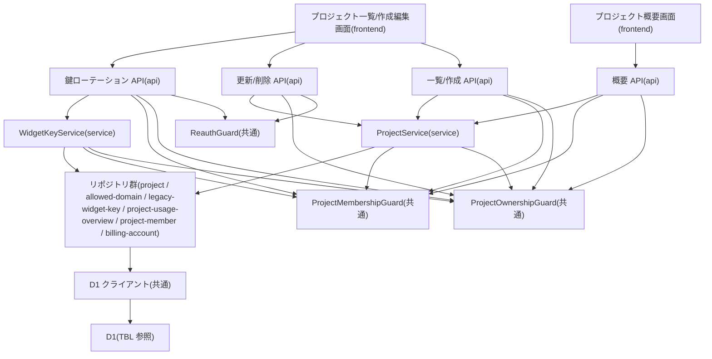

# MOD-004: project モジュール構造

> **本構造図は「プロジェクトの一覧・作成・更新・削除・許可ドメイン管理・ウィジェット公開鍵ローテーション・データ概要取得」機能領域のモジュール分割と内向き依存の方向を定義します。**

*種別 モジュール構造図 ・ ステータス ドラフト*

| 項目 | 値 |
|----|----|
| MOD ID | MOD-004 |
| 業務ユースケースID | [UC-014](../../01_requirements/04_business_usecases/UC-014.md#UC-014) ・ [UC-015](../../01_requirements/04_business_usecases/UC-015.md#UC-015) ・ [UC-016](../../01_requirements/04_business_usecases/UC-016.md#UC-016) ・ [UC-017](../../01_requirements/04_business_usecases/UC-017.md#UC-017) ・ [UC-038](../../01_requirements/04_business_usecases/UC-038.md#UC-038) ・ [UC-039](../../01_requirements/04_business_usecases/UC-039.md#UC-039) ・ [UC-073](../../01_requirements/04_business_usecases/UC-073.md#UC-073) ・ [UC-074](../../01_requirements/04_business_usecases/UC-074.md#UC-074) ・ [UC-082](../../01_requirements/04_business_usecases/UC-082.md#UC-082) |
| 関連 API / SYS | [API-016](../../02_basic_design/02_backend/03_apis/API-016.md#API-016) ・ [API-017](../../02_basic_design/02_backend/03_apis/API-017.md#API-017) ・ [API-018](../../02_basic_design/02_backend/03_apis/API-018.md#API-018) ・ [API-019](../../02_basic_design/02_backend/03_apis/API-019.md#API-019) ・ [API-065](../../02_basic_design/02_backend/03_apis/API-065.md#API-065) |
| 関連画面 | [SCR-004](../../02_basic_design/01_frontend/01_screens/SCR-004.md#SCR-004) ・ [SCR-005](../../02_basic_design/01_frontend/01_screens/SCR-005.md#SCR-005) ・ [SCR-012](../../02_basic_design/01_frontend/01_screens/SCR-012.md#SCR-012) |
| 関連テーブル | [TBL-004](../../02_basic_design/02_backend/04_database/TBL-004.md#TBL-004) ・ [TBL-005](../../02_basic_design/02_backend/04_database/TBL-005.md#TBL-005) ・ [TBL-015](../../02_basic_design/02_backend/04_database/TBL-015.md#TBL-015) |

## 1. 目的

本機能領域は、プロジェクトの一覧・新規作成・更新(コア項目 / ウィジェット表示設定)・論理削除・許可ドメイン管理・ウィジェット公開鍵ローテーション・プロジェクト範囲データ概要取得の一連の実装単位を定義する。モジュール分割は Next.js on Cloudflare の物理配置(`app/api/projects/**`・`lib/service/project`・`lib/repository/project`・横断ガード)へ写像し、依存は内向き(frontend → api → service → repository)に統一して逆依存・循環依存を作らない。所有境界判定([`ProjectOwnershipGuard`](../10_class/CLS-003.md#CLS-003) / [`ProjectMembershipGuard`](../10_class/CLS-003.md#CLS-003))はガード層として Route Handler の前段に置き、削除・鍵ローテーションの再認証検証(`ReauthGuard`)は同層で別モジュールに分離する。

## 2. モジュール一覧

本機能領域を構成するモジュールを物理配置・種別・責務・入出力で一覧化する。同期経路(Route Handler → Service → Repository)のみで構成し、非同期後処理は持たない(猶予期限経過後の物理削除は別モジュール [SYS-027](../../02_basic_design/02_backend/01_system/SYS-027.md#SYS-027) が担う)。

| モジュールID | モジュール名 | 種別 | 責務 | 主な入力 | 主な出力 |
|----|----|----|----|----|----|
| M-01 | `app/(dashboard)/projects`(プロジェクト一覧・作成/編集モーダル画面) | frontend | プロジェクト一覧表示、作成/編集モーダルでの入力受付、削除・鍵ローテーション操作の起点を担う([SCR-004](../../02_basic_design/01_frontend/01_screens/SCR-004.md#SCR-004) ・ [SCR-005](../../02_basic_design/01_frontend/01_screens/SCR-005.md#SCR-005)) | 利用者操作(検索条件・入力項目) | プロジェクト API 呼び出し |
| M-02 | `app/(dashboard)/projects/[id]`(プロジェクト概要画面) | frontend | プロジェクト範囲データ概要の表示を担う([SCR-012](../../02_basic_design/01_frontend/01_screens/SCR-012.md#SCR-012)) | 利用者操作(画面遷移) | プロジェクト API 呼び出し |
| M-03 | `app/api/projects/route.ts` | api | プロジェクト一覧取得(GET)・新規作成(POST)の受付。認証検証・入力検証を経て Service へ委譲する([API-016](../../02_basic_design/02_backend/03_apis/API-016.md#API-016) ・ [API-017](../../02_basic_design/02_backend/03_apis/API-017.md#API-017)) | HTTP リクエスト(`scope`・作成項目) | Service 呼び出し・HTTP レスポンス |
| M-04 | `app/api/projects/[id]/route.ts` | api | プロジェクト部分更新(PATCH)・論理削除(DELETE)の受付。DELETE は再認証検証を先行させる([API-018](../../02_basic_design/02_backend/03_apis/API-018.md#API-018)) | HTTP リクエスト(更新項目・再認証トークン) | Service 呼び出し・HTTP レスポンス |
| M-05 | `app/api/projects/[id]/widget-key/rotate/route.ts` | api | ウィジェット公開鍵ローテーションの受付。再認証検証を先行させる([API-019](../../02_basic_design/02_backend/03_apis/API-019.md#API-019)) | HTTP リクエスト(再認証トークン) | Service 呼び出し・HTTP レスポンス |
| M-06 | `app/api/projects/[id]/overview/route.ts` | api | プロジェクト範囲データ概要の受付(参照系)([API-065](../../02_basic_design/02_backend/03_apis/API-065.md#API-065)) | HTTP リクエスト(プロジェクト ID) | Service 呼び出し・HTTP レスポンス |
| M-07 | `lib/service/project`(`ProjectService`) | service | 一覧絞り込み(`scope`)・作成(オーナー設定・許可ドメイン保存・課金アカウント遅延作成・作成者メンバー自動登録・しきい値任意保存)・更新(コア項目 / `settings` の権限分岐)・論理削除(メンバー割当解除・アカウント論理削除判定・関連データ論理削除伝播・監査記録)・データ概要集計を統括する([CLS-003](../10_class/CLS-003.md#CLS-003)) | 検証済みプロジェクト操作要求 | Repository 呼び出し・応答 DTO |
| M-08 | `lib/service/project/widget-key`(`WidgetKeyService`) | service | ウィジェット公開鍵の再発行・旧鍵の猶予失効予約(`grace_until` 設定)を統括する([CLS-003](../10_class/CLS-003.md#CLS-003)) | 検証済み鍵ローテーション要求 | Repository 呼び出し・応答 DTO |
| M-09 | `lib/guard/project-ownership`(`ProjectOwnershipGuard`) | 共通 | 対象プロジェクトの `owner_user_id` が要求元と一致するかを判定する(コア項目更新・削除・鍵ローテーションの権限境界) | 要求元・対象プロジェクト | 許可 / 拒否(境界秘匿 or オーナー限定) |
| M-10 | `lib/guard/project-membership`(`ProjectMembershipGuard`) | 共通 | 対象プロジェクトへの有効なメンバー割当(オーナー含む)があるかを判定する(`settings` のみの更新・データ概要取得・鍵ローテーションの権限境界) | 要求元・対象プロジェクト | 許可 / 拒否 |
| M-11 | `lib/guard/reauth`(`ReauthGuard`) | 共通 | 直近の再認証状態(`reauthToken`)を検証する(削除・鍵ローテーションの前提条件) | 再認証トークン | 許可 / 拒否 |
| M-12 | `lib/repository/project`(`ProjectRepository`) | repository | プロジェクト本体の生成・照会(オーナー別/メンバー別)・更新・論理削除・鍵ローテーション・名称重複判定を D1 へ行う | Service からの参照・更新要求 | 取得結果 / 更新結果([TBL-004](../../02_basic_design/02_backend/04_database/TBL-004.md#TBL-004)) |
| M-13 | `lib/repository/allowed-domain`(`AllowedDomainRepository`) | repository | 許可ドメインの一括置換(作成/更新時)・照会・プロジェクト単位論理削除伝播を D1 へ行う | Service からの参照・更新要求 | 取得結果 / 更新結果([TBL-005](../../02_basic_design/02_backend/04_database/TBL-005.md#TBL-005)) |
| M-14 | `lib/repository/legacy-widget-key`(`LegacyWidgetKeyRepository`) | repository | 鍵ローテーション時の旧公開鍵を猶予期限付きで D1 へ生成する | Service からの生成要求 | 記録結果([TBL-015](../../02_basic_design/02_backend/04_database/TBL-015.md#TBL-015)) |
| M-15 | `lib/repository/project-usage-overview`(`ProjectUsageOverviewRepository`) | repository | 当該プロジェクトに範囲を限定した FAQ・質問ログ・未解決質問の件数集計を D1 へ行う | Service からの集計要求 | 集計結果 |
| M-16 | `lib/repository/project-member`(`ProjectMemberRepository`) | repository | プロジェクトメンバー割当の自動登録(作成者)・プロジェクト単位一括論理削除・ユーザー単位有効割当数照会を D1 へ行う | Service からの参照・更新要求 | 取得結果 / 更新結果 |
| M-17 | `lib/repository/billing-account`(`BillingAccountRepository`) | repository | 作成者の課金アカウント照会・未作成時の遅延作成を D1 へ行う | Service からの参照・更新要求 | 取得結果 / 更新結果 |
| M-18 | `lib/db`(D1 クライアント) | 共通 | D1 への接続・トランザクション境界の提供。Repository のみが利用する | Repository からのクエリ・Tx 要求 | D1 実行結果 |

## 3. モジュール構造図

モジュール間の依存を内向き(上位 → 下位)で示す。ガードは Route Handler の前段に作用し、削除・鍵ローテーションの再認証検証は独立モジュールとして分離する。

## 4. 依存関係一覧

呼び出し元・呼び出し先の依存を、同期/非同期の別と用途で一覧化する。本機能領域はすべて同期経路であり、非同期境界は持たない。

| 呼び出し元 | 呼び出し先 | 用途 | 同期/非同期 | 備考 |
|----|----|----|----|----|
| M-01 プロジェクト一覧/作成編集画面 | M-03 一覧/作成 API | 一覧取得・新規作成の送信 | 同期 | 入出力契約は [IO-010](../03_io_specs/IO-010.md#IO-010) ・ [IO-011](../03_io_specs/IO-011.md#IO-011) |
| M-01 プロジェクト一覧/作成編集画面 | M-04 更新/削除 API | コア項目/`settings` 更新・論理削除の送信 | 同期 | — |
| M-01 プロジェクト一覧/作成編集画面 | M-05 鍵ローテーション API | ウィジェット公開鍵ローテーションの送信 | 同期 | — |
| M-02 プロジェクト概要画面 | M-06 概要 API | データ概要の取得 | 同期 | — |
| M-03 一覧/作成 API | M-09 ProjectOwnershipGuard | 作成時のオーナー判定前提の要求元検証 | 同期 | 一覧はガード判定を伴わず `scope` 絞り込みで完結 |
| M-03 一覧/作成 API | M-10 ProjectMembershipGuard | 一覧 `scope=join` の割当判定 | 同期 | — |
| M-04 更新/削除 API | M-11 ReauthGuard | DELETE 時の再認証検証(先行実行) | 同期 | 不備時は 401([ERR-013](../../02_basic_design/05_errors/ERR-013.md#ERR-013)) |
| M-04 更新/削除 API | M-09 ProjectOwnershipGuard | コア項目更新・削除の所有境界判定 | 同期 | 不一致時は 404 境界秘匿([ERR-017](../../02_basic_design/05_errors/ERR-017.md#ERR-017))または 403([ERR-015](../../02_basic_design/05_errors/ERR-015.md#ERR-015)) |
| M-05 鍵ローテーション API | M-11 ReauthGuard | 再認証検証(先行実行) | 同期 | 不備時は 401([ERR-013](../../02_basic_design/05_errors/ERR-013.md#ERR-013)) |
| M-05 鍵ローテーション API | M-09 ProjectOwnershipGuard ・ M-10 ProjectMembershipGuard | オーナー/メンバーの権限境界判定 | 同期 | — |
| M-06 概要 API | M-10 ProjectMembershipGuard | データ概要取得の割当判定 | 同期 | 割当なしは 403([ERR-019](../../02_basic_design/05_errors/ERR-019.md#ERR-019)) |
| M-07 ProjectService | M-09 ProjectOwnershipGuard ・ M-10 ProjectMembershipGuard | 更新・削除・データ概要の権限境界判定 | 同期 | — |
| M-07 ProjectService | M-12 プロジェクトリポジトリ | プロジェクト本体の生成・照会・更新・論理削除・名称重複判定 | 同期 | 物理項目対応は [DBP-006](../07_db_physical/DBP-006.md#DBP-006) |
| M-07 ProjectService | M-13 許可ドメインリポジトリ | 許可ドメインの一括置換・照会・論理削除伝播 | 同期 | [TBL-005](../../02_basic_design/02_backend/04_database/TBL-005.md#TBL-005) |
| M-07 ProjectService | M-16 プロジェクトメンバーリポジトリ | 作成者のメンバー自動登録・全メンバー割当論理削除・有効割当数照会 | 同期 | [TBL-003](../../02_basic_design/02_backend/04_database/TBL-003.md#TBL-003)。物理項目対応は [DBP-005](../07_db_physical/DBP-005.md#DBP-005) |
| M-07 ProjectService | M-17 課金アカウントリポジトリ | 作成者の課金アカウント照会・未作成時の遅延作成 | 同期 | [TBL-002](../../02_basic_design/02_backend/04_database/TBL-002.md#TBL-002)。物理項目対応は [DBP-004](../07_db_physical/DBP-004.md#DBP-004) |
| M-07 ProjectService | M-15 プロジェクト利用概要リポジトリ | データ概要取得のための FAQ・質問ログ・未解決質問件数集計 | 同期 | [API-065](../../02_basic_design/02_backend/03_apis/API-065.md#API-065) |
| M-08 WidgetKeyService | M-09 ProjectOwnershipGuard ・ M-10 ProjectMembershipGuard | 鍵ローテーションの権限境界判定 | 同期 | — |
| M-08 WidgetKeyService | M-12 プロジェクトリポジトリ | 新公開鍵への更新 | 同期 | [TBL-004](../../02_basic_design/02_backend/04_database/TBL-004.md#TBL-004) |
| M-08 WidgetKeyService | M-14 旧鍵リポジトリ | 旧公開鍵の猶予期限付き退避生成 | 同期 | [TBL-015](../../02_basic_design/02_backend/04_database/TBL-015.md#TBL-015) |
| M-12〜M-17 各リポジトリ | M-18 D1 クライアント | クエリ実行・トランザクション境界 | 同期 | Repository のみが D1 を利用(内向き依存) |

## 5. モジュール別処理概要

各モジュールの処理概要と例外処理の方針を示す。実装コード本文・SQL 本文は書かない。しきい値・猶予期間の具体値は正本へ委ねる。

| モジュール | 処理概要 | 例外処理 | 備考 |
|----|----|----|----|
| M-03 一覧/作成 API | 認証を検証し、一覧は `scope` 別に絞り込み、作成は入力検証・名称重複判定を経て Service へ委譲する | 検証エラーは 400([ERR-001](../../02_basic_design/05_errors/ERR-001.md#ERR-001))、名称重複は 409([ERR-016](../../02_basic_design/05_errors/ERR-016.md#ERR-016)) | 作成時のしきい値は指定時のみ保存(未指定はグローバル既定を適用) |
| M-04 更新/削除 API | コア項目/`settings` を権限分岐で部分更新し、DELETE は再認証検証後に論理削除・メンバー割当解除・関連データ論理削除伝播・監査記録を同一トランザクションで行う | 再認証不備は 401([ERR-013](../../02_basic_design/05_errors/ERR-013.md#ERR-013))、境界秘匿は 404([ERR-017](../../02_basic_design/05_errors/ERR-017.md#ERR-017))、オーナー限定違反は 403([ERR-015](../../02_basic_design/05_errors/ERR-015.md#ERR-015)) | 削除時の処理順序は [API-018](../../02_basic_design/02_backend/03_apis/API-018.md#API-018) 処理概要 P-01〜P-05。実行中の長時間非同期ジョブは論理削除を妨げず、物理削除は [SYS-027](../../02_basic_design/02_backend/01_system/SYS-027.md#SYS-027) が終端後に実施 |
| M-05 鍵ローテーション API | 再認証検証・権限境界判定を経て WidgetKeyService へ委譲し、新鍵と失効予告を返す | 再認証不備は 401([ERR-013](../../02_basic_design/05_errors/ERR-013.md#ERR-013)) | 旧鍵は遅延失効方式(起動時キー判定で猶予期限超過を失効として扱う) |
| M-06 概要 API | 権限境界判定を経て当該プロジェクトに範囲を限定した集計結果を返す(参照のみ) | 割当なしは 403([ERR-019](../../02_basic_design/05_errors/ERR-019.md#ERR-019))、対象なしは 404([ERR-011](../../02_basic_design/05_errors/ERR-011.md#ERR-011)) | 他プロジェクトのデータを混在させない(プロジェクト単位のデータ分離) |
| M-07 ProjectService | 一覧絞り込み・作成(許可ドメイン保存・課金アカウント遅延作成・作成者メンバー自動登録・しきい値任意保存)・更新・論理削除(伝播順序を含む)・データ概要集計を統括する | 名称重複は作成を中断し 409 を返す | 詳細ロジックは [CLS-003](../10_class/CLS-003.md#CLS-003) §5 メソッド一覧 |
| M-08 WidgetKeyService | 新しいウィジェット公開鍵を発行し、旧鍵を猶予期限付きで失効予約する | — | 猶予期限の正本は [システム仕様書 §4](../../02_basic_design/07_system-spec.md#4-データ保持期間削除猶予) |
| M-09〜M-11 ガード群 | 所有境界・メンバー割当・再認証状態を判定し、不一致は後段へ渡さず拒否応答する | 拒否時は境界秘匿(404)またはオーナー限定(403)・再認証不備(401)で応答 | ガードの使い分けは操作種別ごとに [CLS-003](../10_class/CLS-003.md#CLS-003) §4 依存関係に従う |
| M-12〜M-17 リポジトリ群 | プロジェクト・許可ドメイン・旧公開鍵・データ概要集計・メンバー・課金アカウントの D1 アクセスを担い、Service からの参照・更新要求を実行する | 一時障害は呼び出し元へ伝播し Tx をロールバック | 物理設計は [DBP-006](../07_db_physical/DBP-006.md#DBP-006) ・ [DBP-005](../07_db_physical/DBP-005.md#DBP-005) ・ [DBP-004](../07_db_physical/DBP-004.md#DBP-004) |

## 6. 後続工程への引き継ぎ事項

実装・テスト設計へ引き継ぐ観点(依存方向の逸脱検出・非同期境界・外部連携の切り離しテスト)を箇条書きで示す。

- 内向き依存の逸脱検証: D1 クライアント(M-18)を利用するのは Repository 群のみで、Service/Guard/API から直接 D1 を触らないこと。逆依存(Repository → Service)・循環依存が生じていないこと。
- 同期経路の境界検証: Route Handler → ガード群(ProjectOwnershipGuard / ProjectMembershipGuard / ReauthGuard)→ Service → Repository の順序が保たれ、DELETE・鍵ローテーションでは ReauthGuard が権限境界判定より先に評価されること。
- ガード使い分けの境界検証: コア項目更新・削除・鍵ローテーションはオーナー限定(M-09)、`settings` のみの更新とデータ概要取得は有効メンバー許可(M-10)である分岐をテスト設計でケース化すること。
- 削除時のトランザクション境界: メンバー割当解除 → アカウント論理削除判定 → プロジェクト論理削除 → 関連データ(許可ドメイン/FAQ/未解決質問/質問ログ)論理削除伝播 → 監査記録の順序([API-018](../../02_basic_design/02_backend/03_apis/API-018.md#API-018) 処理概要 P-01〜P-05)が同一トランザクションで一貫すること。実行中の長時間非同期ジョブは論理削除を妨げず、物理削除は別モジュール([SYS-027](../../02_basic_design/02_backend/01_system/SYS-027.md#SYS-027))が終端後に実施する境界を確認すること。
- モジュール境界の契約整合: 一覧/作成 API と ProjectService 間、ProjectService と各 Repository 間の入出力契約が [IO-010](../03_io_specs/IO-010.md#IO-010) ・ [IO-011](../03_io_specs/IO-011.md#IO-011) ・ [CLS-003](../10_class/CLS-003.md#CLS-003) と一致すること。
- 非同期境界を持たない構成の確認: 本機能領域は同期経路のみで完結し、Queues 投入・DLQ 滞留の対象がないことをテスト設計で明示すること(猶予期限経過後の物理削除は別モジュール [SYS-027](../../02_basic_design/02_backend/01_system/SYS-027.md#SYS-027) が Cron Triggers で担う)。
