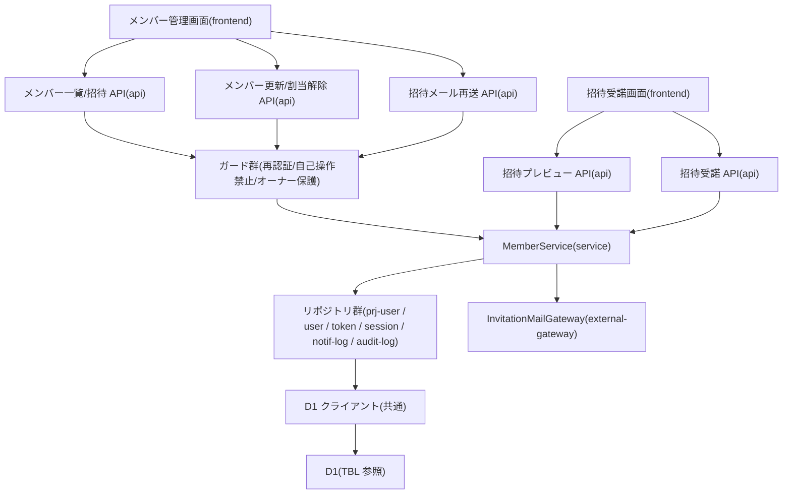

# MOD-005: member モジュール構造

> **本構造図は「プロジェクトメンバーの一覧・招待・招待受諾(割当有効化)・情報更新・割当解除・招待メール再送」機能領域のモジュール分割と内向き依存の方向を定義します。**

*種別 モジュール構造図 ・ ステータス ドラフト*

| 項目 | 値 |
|----|----|
| MOD ID | MOD-005 |
| 業務ユースケースID | [UC-006](../../01_requirements/04_business_usecases/UC-006.md#UC-006) ・ [UC-018](../../01_requirements/04_business_usecases/UC-018.md#UC-018) ・ [UC-019](../../01_requirements/04_business_usecases/UC-019.md#UC-019) ・ [UC-020](../../01_requirements/04_business_usecases/UC-020.md#UC-020) ・ [UC-021](../../01_requirements/04_business_usecases/UC-021.md#UC-021) |
| 関連 API / SYS | [API-007](../../02_basic_design/02_backend/03_apis/API-007.md#API-007) ・ [API-008](../../02_basic_design/02_backend/03_apis/API-008.md#API-008) ・ [API-020](../../02_basic_design/02_backend/03_apis/API-020.md#API-020) ・ [API-021](../../02_basic_design/02_backend/03_apis/API-021.md#API-021) ・ [API-022](../../02_basic_design/02_backend/03_apis/API-022.md#API-022) ・ [API-023](../../02_basic_design/02_backend/03_apis/API-023.md#API-023) ・ [API-024](../../02_basic_design/02_backend/03_apis/API-024.md#API-024) |
| 関連画面 | [SCR-013](../../02_basic_design/01_frontend/01_screens/SCR-013.md#SCR-013) ・ [SCR-014](../../02_basic_design/01_frontend/01_screens/SCR-014.md#SCR-014) ・ [SCR-023](../../02_basic_design/01_frontend/01_screens/SCR-023.md#SCR-023) |
| 関連テーブル | [TBL-001](../../02_basic_design/02_backend/04_database/TBL-001.md#TBL-001) ・ [TBL-003](../../02_basic_design/02_backend/04_database/TBL-003.md#TBL-003) ・ [TBL-004](../../02_basic_design/02_backend/04_database/TBL-004.md#TBL-004) ・ [TBL-013](../../02_basic_design/02_backend/04_database/TBL-013.md#TBL-013) ・ [TBL-014](../../02_basic_design/02_backend/04_database/TBL-014.md#TBL-014) ・ [TBL-026](../../02_basic_design/02_backend/04_database/TBL-026.md#TBL-026) ・ [TBL-027](../../02_basic_design/02_backend/04_database/TBL-027.md#TBL-027) |

## 1. 目的

本機能領域は、プロジェクトメンバーの一覧表示を起点に、招待発行・招待トークン検証/プレビュー・招待受諾(割当有効化)・メンバー情報更新・プロジェクト割当解除・招待メール再送までを一連の実装単位として扱う。モジュール分割は Next.js on Cloudflare の物理配置(`app/api/projects/**/members/**`・`app/api/auth/invitations/**`・`lib/service`・`lib/repository`・`lib/gateway`・`lib/guard`)へ写像し、依存は内向き(frontend → api → service → repository、メール配信は service → external-gateway)に統一して逆依存・循環依存を作らない。クラス構造は [CLS-004](../10_class/CLS-004.md#CLS-004) と整合させる。

## 2. モジュール一覧

本機能領域を構成するモジュールを物理配置・種別・責務・入出力で一覧化する。招待受諾・情報更新・割当解除・招待メール再送はガード群を前段に経由する同期経路のみで構成し、非同期経路は持たない。

| モジュールID | モジュール名 | 種別 | 責務 | 主な入力 | 主な出力 |
|----|----|----|----|----|----|
| M-01 | `app/projects/[id]/members`(メンバー管理画面) | frontend | メンバー一覧表示、招待・情報更新・割当解除・招待メール再送の操作を受け付ける([SCR-013](../../02_basic_design/01_frontend/01_screens/SCR-013.md#SCR-013) ・ [SCR-014](../../02_basic_design/01_frontend/01_screens/SCR-014.md#SCR-014)) | 利用者操作 | メンバー API 呼び出し |
| M-02 | `app/invitations/[token]`(招待受諾画面) | frontend | 招待トークンのプレビュー表示と受諾操作を受け付ける([SCR-023](../../02_basic_design/01_frontend/01_screens/SCR-023.md#SCR-023)) | 利用者操作(招待トークン) | 招待 API 呼び出し |
| M-03 | `app/api/projects/[id]/members/route.ts` | api | メンバー一覧取得(GET)・メンバー招待(POST)の受付。認証・入力検証を経て Service へ委譲する([API-020](../../02_basic_design/02_backend/03_apis/API-020.md#API-020) ・ [API-021](../../02_basic_design/02_backend/03_apis/API-021.md#API-021)) | HTTP リクエスト | Service 呼び出し・HTTP レスポンス |
| M-04 | `app/api/projects/[id]/members/[userId]/route.ts` | api | メンバー情報更新(PATCH)・プロジェクト割当解除(DELETE)の受付。ガード群通過後に Service へ委譲する([API-022](../../02_basic_design/02_backend/03_apis/API-022.md#API-022) ・ [API-023](../../02_basic_design/02_backend/03_apis/API-023.md#API-023)) | HTTP リクエスト | Service 呼び出し・HTTP レスポンス |
| M-05 | `app/api/auth/invitations/[token]/preview/route.ts` | api | 招待トークン検証・プレビューの受付(状態変更なし)。Service へ委譲する([API-007](../../02_basic_design/02_backend/03_apis/API-007.md#API-007)) | HTTP リクエスト(招待トークン) | Service 呼び出し・HTTP レスポンス |
| M-06 | `app/api/projects/invitations/[token]/accept/route.ts` | api | 招待受諾(割当有効化)の受付。Service へ委譲する([API-008](../../02_basic_design/02_backend/03_apis/API-008.md#API-008)) | HTTP リクエスト(招待トークン・ログイン中ユーザー) | Service 呼び出し・HTTP レスポンス |
| M-07 | `app/api/members/[id]/resend-invitation/route.ts` | api | 招待メール再送の受付。ガード群通過後に Service へ委譲する([API-024](../../02_basic_design/02_backend/03_apis/API-024.md#API-024)) | HTTP リクエスト | Service 呼び出し・HTTP レスポンス |
| M-08 | `lib/guard/reauth`(`ReauthGuard`) | 共通 | 直近の再認証で得た再認証トークンの有効性を判定する。招待・情報更新・割当解除・招待メール再送に適用 | GuardContext | GuardVerdict([ERR-013](../../02_basic_design/05_errors/ERR-013.md#ERR-013)) |
| M-09 | `lib/guard/self-mutation`(`SelfMutationGuard`) | 共通 | 操作対象が自分自身かどうかを判定する。割当解除・招待メール再送に適用 | GuardContext | GuardVerdict([ERR-022](../../02_basic_design/05_errors/ERR-022.md#ERR-022)) |
| M-10 | `lib/guard/owner-protection`(`OwnerProtectionGuard`) | 共通 | 操作対象が当該プロジェクトのオーナー(作成者)かどうかを判定する。割当解除・招待メール再送に適用 | GuardContext | GuardVerdict([ERR-021](../../02_basic_design/05_errors/ERR-021.md#ERR-021)) |
| M-11 | `lib/service/member`(`MemberService`) | service | メンバー一覧取得・招待発行・招待トークン検証/受諾判定・情報更新・割当解除・招待メール再送の業務ロジックを統括する([IPO-011](../04_ipo/IPO-011.md#IPO-011)) | 検証済み要求(ListMembersInput / InviteInput / AcceptInput 等) | Repository/Gateway 呼び出し・応答 DTO |
| M-12 | `lib/repository/prj-user`(`PrjUserRepository`) | repository | プロジェクトメンバー割当の照会・生成・更新・論理削除を D1 へ行う | Service からの参照・更新要求 | 取得結果 / 更新結果([TBL-003](../../02_basic_design/02_backend/04_database/TBL-003.md#TBL-003)) |
| M-13 | `lib/repository/user`(`UserRepository`) | repository | 利用者(認証情報)の照会・論理削除を D1 へ行う | Service からの参照・更新要求 | 取得結果 / 更新結果([TBL-001](../../02_basic_design/02_backend/04_database/TBL-001.md#TBL-001)) |
| M-14 | `lib/repository/token`(`TokenRepository`) | repository | 招待用アクセストークン(用途: 招待有効化)の発行・照会・使用済み化・失効を D1 へ行う | Service からの発行・照会・更新要求 | 取得結果 / 更新結果([TBL-014](../../02_basic_design/02_backend/04_database/TBL-014.md#TBL-014)) |
| M-15 | `lib/repository/session`(`SessionRepository`) | repository | 割当解除に伴うアカウント論理削除時の全セッション失効を D1 へ行う | Service からの失効要求 | 更新結果([TBL-013](../../02_basic_design/02_backend/04_database/TBL-013.md#TBL-013)) |
| M-16 | `lib/repository/notif-log`(`NotifLogRepository`) | repository | 招待メール・メンバー通知の送信履歴記録を D1 へ行う | Service からの記録要求 | 記録結果([TBL-026](../../02_basic_design/02_backend/04_database/TBL-026.md#TBL-026)) |
| M-17 | `lib/repository/audit-log`(`AuditLogRepository`) | repository | 招待受諾・割当有効化完了等の監査ログ記録を D1 へ行う | Service からの記録要求 | 記録結果([TBL-027](../../02_basic_design/02_backend/04_database/TBL-027.md#TBL-027)) |
| M-18 | `lib/gateway/mail`(`InvitationMailGateway` / `EmailProvider` 実装 `ResendEmailProvider`) | external-gateway | 招待メール・メンバー情報更新通知・割当解除通知の送信を外部メール配信サービス(Resend)へ委譲する([EIF-003](../06_external_if/EIF-003.md#EIF-003)) | 招待/通知メール送信要求 | 送信結果 |
| M-19 | `lib/db`(D1 クライアント) | 共通 | D1 への接続・トランザクション境界の提供。Repository のみが利用する | Repository からのクエリ・Tx 要求 | D1 実行結果 |

## 3. モジュール構造図

モジュール間の依存を内向き(上位 → 下位)で示す。ガードは招待・情報更新・割当解除・招待メール再送を扱う Route Handler の前段に作用し、メール配信は外部ノードとして分離する。本機能領域は非同期経路を持たない。

## 4. 依存関係一覧

呼び出し元・呼び出し先の依存を、同期/非同期の別と用途で一覧化する。本機能領域はすべて同期呼び出しであり、非同期経路は持たない。

| 呼び出し元 | 呼び出し先 | 用途 | 同期/非同期 | 備考 |
|----|----|----|----|----|
| M-01 メンバー管理画面 | M-03 メンバー一覧/招待 API | メンバー一覧取得・メンバー招待 | 同期 | — |
| M-01 メンバー管理画面 | M-04 メンバー更新/割当解除 API | メンバー情報更新・プロジェクト割当解除 | 同期 | — |
| M-01 メンバー管理画面 | M-07 招待メール再送 API | 招待メール再送 | 同期 | — |
| M-02 招待受諾画面 | M-05 招待プレビュー API | 招待トークン検証・プレビュー | 同期 | 状態変更を行わない読み取り専用経路 |
| M-02 招待受諾画面 | M-06 招待受諾 API | 招待受諾(割当有効化) | 同期 | — |
| M-03 メンバー一覧/招待 API | M-08 再認証ガード | メンバー招待時の再認証トークン有効性判定 | 同期 | 不成立時 [ERR-013](../../02_basic_design/05_errors/ERR-013.md#ERR-013) |
| M-04 メンバー更新/割当解除 API | M-08 再認証ガード | 再認証トークン有効性判定 | 同期 | 不成立時 [ERR-013](../../02_basic_design/05_errors/ERR-013.md#ERR-013) |
| M-04 メンバー更新/割当解除 API | M-09 自己操作禁止ガード | 割当解除時の対象が自分自身かどうかの判定 | 同期 | 該当時 [ERR-022](../../02_basic_design/05_errors/ERR-022.md#ERR-022) |
| M-04 メンバー更新/割当解除 API | M-10 オーナー保護ガード | 割当解除時の対象がオーナーかどうかの判定 | 同期 | 該当時 [ERR-021](../../02_basic_design/05_errors/ERR-021.md#ERR-021) |
| M-07 招待メール再送 API | M-08〜M-10 ガード群 | 再認証・自己操作禁止・オーナー保護の判定 | 同期 | [ERR-013](../../02_basic_design/05_errors/ERR-013.md#ERR-013) ・ [ERR-021](../../02_basic_design/05_errors/ERR-021.md#ERR-021) ・ [ERR-022](../../02_basic_design/05_errors/ERR-022.md#ERR-022) |
| M-03〜M-07 各 API | M-11 MemberService | 業務ロジック委譲 | 同期 | 判定順序は [IPO-011](../04_ipo/IPO-011.md#IPO-011) |
| M-11 MemberService | M-12 プロジェクトメンバーリポジトリ | 割当の照会・生成・更新・論理削除 | 同期 | [TBL-003](../../02_basic_design/02_backend/04_database/TBL-003.md#TBL-003) |
| M-11 MemberService | M-13 ユーザーリポジトリ | 招待先照会・アカウント論理削除 | 同期 | [TBL-001](../../02_basic_design/02_backend/04_database/TBL-001.md#TBL-001) |
| M-11 MemberService | M-14 トークンリポジトリ | 招待用アクセストークンの発行・照会・使用済み化・失効 | 同期 | [TBL-014](../../02_basic_design/02_backend/04_database/TBL-014.md#TBL-014) |
| M-11 MemberService | M-15 セッションリポジトリ | アカウント論理削除時の全セッション失効 | 同期 | 他プロジェクトの有効割当が 0 件となる場合のみ実行([API-023](../../02_basic_design/02_backend/03_apis/API-023.md#API-023) P-04) |
| M-11 MemberService | M-16 通知ログリポジトリ | 招待メール・メンバー通知の送信履歴記録 | 同期 | [TBL-026](../../02_basic_design/02_backend/04_database/TBL-026.md#TBL-026) |
| M-11 MemberService | M-17 監査ログリポジトリ | 招待受諾・割当有効化完了等の監査ログ記録 | 同期 | [TBL-027](../../02_basic_design/02_backend/04_database/TBL-027.md#TBL-027) |
| M-11 MemberService | M-18 InvitationMailGateway | 招待メール・メンバー情報更新通知・割当解除通知の送信 | 同期 | 連携仕様は [EIF-003](../06_external_if/EIF-003.md#EIF-003) |
| M-12〜M-17 各リポジトリ | M-19 D1 クライアント | クエリ実行・トランザクション境界 | 同期 | Repository のみが D1 を利用(内向き依存) |

## 5. モジュール別処理概要

各モジュールの処理概要と例外処理の方針を示す。実装コード本文・SQL 本文は書かない。

| モジュール | 処理概要 | 例外処理 | 備考 |
|----|----|----|----|
| M-11 MemberService | メンバー一覧の検索/フィルタ/ページング、招待先の重複割当確認と割当作成・招待メール送信、招待トークンの照会・状態検証・宛先一致・重複割当確認を経た受諾確定、メンバー情報更新、割当解除(他プロジェクト有効割当 0 件時のアカウント論理削除・全セッション失効・未使用招待トークン失効を含む)、招待メール再送(旧トークン失効・新規発行)を担う | トークン不存在/期限切れ/使用済みは受諾・プレビューを拒否([ERR-006](../../02_basic_design/05_errors/ERR-006.md#ERR-006) ・ [ERR-007](../../02_basic_design/05_errors/ERR-007.md#ERR-007) ・ [ERR-008](../../02_basic_design/05_errors/ERR-008.md#ERR-008))。招待先未登録は招待不可([ERR-035](../../02_basic_design/05_errors/ERR-035.md#ERR-035))。重複割当は不可([ERR-018](../../02_basic_design/05_errors/ERR-018.md#ERR-018)) | 判定順序の詳細は [IPO-011](../04_ipo/IPO-011.md#IPO-011) |
| M-08 再認証ガード | 直近の再認証で得た再認証トークンの有効性を判定する | 不成立時は後段へ渡さず [ERR-013](../../02_basic_design/05_errors/ERR-013.md#ERR-013) で拒否 | 招待・情報更新・割当解除・招待メール再送に適用 |
| M-09 自己操作禁止ガード | 操作対象が操作者自身かどうかを判定する | 該当時は後段へ渡さず [ERR-022](../../02_basic_design/05_errors/ERR-022.md#ERR-022) で拒否 | 割当解除・招待メール再送に適用 |
| M-10 オーナー保護ガード | 操作対象が当該プロジェクトのオーナー(作成者)かどうかを判定する | 該当時は後段へ渡さず [ERR-021](../../02_basic_design/05_errors/ERR-021.md#ERR-021) で拒否 | 割当解除・招待メール再送に適用 |
| M-12〜M-17 リポジトリ群 | プロジェクトメンバー割当・ユーザー・トークン・セッション・通知ログ・監査ログの D1 アクセスを担い、Service からの参照・更新要求を実行する | 一時障害は呼び出し元へ伝播し Tx をロールバック | 物理設計は [DBP-005](../07_db_physical/DBP-005.md#DBP-005) |
| M-18 InvitationMailGateway | 招待メール・メンバー情報更新通知・割当解除通知を `EmailProvider`(`ResendEmailProvider`)経由で送信する | 配信失敗は通知ログへ反映し呼び出し元へ伝播 | 連携仕様・Webhook 反映は [EIF-003](../06_external_if/EIF-003.md#EIF-003) |

## 6. 後続工程への引き継ぎ事項

実装・テスト設計へ引き継ぐ観点(依存方向の逸脱検出・非同期境界・外部連携の切り離しテスト等)を箇条書きで示す。

- 内向き依存の逸脱検証: D1 クライアント(M-19)を利用するのは Repository 群のみで、Service/ガード/API から直接 D1 を触らないこと。逆依存(Repository → Service)・循環依存が生じていないこと。
- ガード適用順序の境界検証: 割当解除・招待メール再送の経路で再認証 → 自己操作禁止 → オーナー保護の順にガードが評価され、いずれかの不成立で MemberService(M-11)へ到達しないこと。
- 割当解除時のトランザクション境界: 「他プロジェクトの有効割当 0 件判定 → アカウント論理削除 → 全セッション失効(M-15)→ 未使用招待トークン失効(M-14)」の一連処理が単一トランザクションで完結すること([API-023](../../02_basic_design/02_backend/03_apis/API-023.md#API-023) P-04・P-04b)。
- 招待受諾の判定順序の境界検証: トークン照会 → 状態検証 → 宛先一致 → 重複割当確認 → 受諾確定の順序と、プレビュー(M-05)/受諾(M-06)で共有するロジック境界([IPO-011](../04_ipo/IPO-011.md#IPO-011))がモジュール分割を跨いで一致すること。
- external-gateway スタブ化: InvitationMailGateway(M-18)をスタブ化した MemberService 単体テストで招待・情報更新通知・割当解除通知の送信呼び出しを分離検証すること。
- モジュール境界の契約整合: 各 API モジュールと MemberService(M-11)間、MemberService と各 Repository 間の入出力契約が [CLS-004](../10_class/CLS-004.md#CLS-004) ・ [IPO-011](../04_ipo/IPO-011.md#IPO-011) と一致すること。
