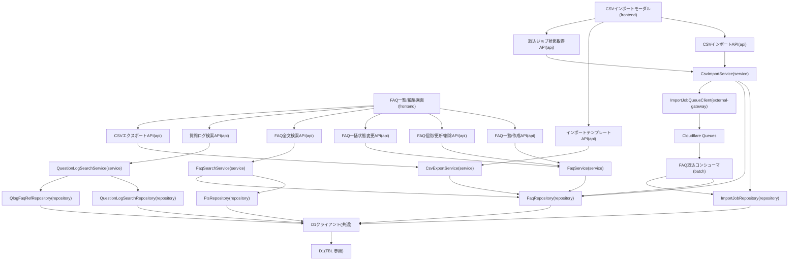

# MOD-006: faq モジュール構造

> **本構造図は「FAQ の一覧・全文検索・個別取得・作成/更新/削除・一括状態変更・質問ログ検索・CSV 一括インポート/エクスポート」機能領域のモジュール分割と内向き依存の方向を定義します。**

*種別 モジュール構造図 ・ ステータス ドラフト*

| 項目 | 値 |
|----|----|
| MOD ID | MOD-006 |
| 業務ユースケースID | [UC-023](../../01_requirements/04_business_usecases/UC-023.md#UC-023) ・ [UC-024](../../01_requirements/04_business_usecases/UC-024.md#UC-024) ・ [UC-025](../../01_requirements/04_business_usecases/UC-025.md#UC-025) ・ [UC-026](../../01_requirements/04_business_usecases/UC-026.md#UC-026) ・ [UC-027](../../01_requirements/04_business_usecases/UC-027.md#UC-027) ・ [UC-028](../../01_requirements/04_business_usecases/UC-028.md#UC-028) ・ [UC-046](../../01_requirements/04_business_usecases/UC-046.md#UC-046) ・ [UC-076](../../01_requirements/04_business_usecases/UC-076.md#UC-076) |
| 関連 API / SYS | [API-025](../../02_basic_design/02_backend/03_apis/API-025.md#API-025) ・ [API-026](../../02_basic_design/02_backend/03_apis/API-026.md#API-026) ・ [API-027](../../02_basic_design/02_backend/03_apis/API-027.md#API-027) ・ [API-028](../../02_basic_design/02_backend/03_apis/API-028.md#API-028) ・ [API-029](../../02_basic_design/02_backend/03_apis/API-029.md#API-029) ・ [API-030](../../02_basic_design/02_backend/03_apis/API-030.md#API-030) ・ [API-031](../../02_basic_design/02_backend/03_apis/API-031.md#API-031) ・ [API-032](../../02_basic_design/02_backend/03_apis/API-032.md#API-032) ・ [API-033](../../02_basic_design/02_backend/03_apis/API-033.md#API-033) ・ [API-068](../../02_basic_design/02_backend/03_apis/API-068.md#API-068) ・ [SYS-014](../../02_basic_design/02_backend/01_system/SYS-014.md#SYS-014) |
| 関連画面 | [SCR-008](../../02_basic_design/01_frontend/01_screens/SCR-008.md#SCR-008) ・ [SCR-009](../../02_basic_design/01_frontend/01_screens/SCR-009.md#SCR-009) ・ [SCR-010](../../02_basic_design/01_frontend/01_screens/SCR-010.md#SCR-010) |
| 関連テーブル | [TBL-006](../../02_basic_design/02_backend/04_database/TBL-006.md#TBL-006) ・ [TBL-016](../../02_basic_design/02_backend/04_database/TBL-016.md#TBL-016) ・ [TBL-025](../../02_basic_design/02_backend/04_database/TBL-025.md#TBL-025) ・ [TBL-030](../../02_basic_design/02_backend/04_database/TBL-030.md#TBL-030) ・ [TBL-033](../../02_basic_design/02_backend/04_database/TBL-033.md#TBL-033) |

## 1. 目的

本機能領域は、FAQ 管理画面から呼び出される FAQ の一覧・全文検索・個別取得・作成/更新/削除・一括状態変更・質問ログ検索と、FAQ の CSV 一括インポート/エクスポート(取込ジョブの非同期実行を含む)を実装する一連の実装単位を定義する。モジュール分割は [CLS-005](../10_class/CLS-005.md#CLS-005)(FAQ 管理 CRUD・検索)・[CLS-006](../10_class/CLS-006.md#CLS-006)(FAQ CSV 入出力)のクラス構成を Next.js on Cloudflare の物理配置(`app/`・`lib/service`・`lib/repository`・`workers/queues`)へ写像し、依存は内向き(frontend → api → service → repository)に統一して逆依存・循環依存を作らない。全文検索(FTS5)を扱う検索経路は AI 回答経路([MOD-001](MOD-001.md#MOD-001) `FaqRepository`)とは別モジュールとして分離する。

## 2. モジュール一覧

本機能領域を構成するモジュールを物理配置・種別・責務・入出力で一覧化する。同期経路(Route Handler → Service → Repository)と、CSV インポートの非同期経路(Service が Queues へ投入 → コンシューマが消費)を分けて配置する。

| モジュールID | モジュール名 | 種別 | 責務 | 主な入力 | 主な出力 |
|----|----|----|----|----|----|
| M-01 | `app/faqs`(FAQ 一覧・編集画面) | frontend | FAQ 一覧表示・絞り込み・作成/編集フォーム・一括状態変更操作を担う([SCR-008](../../02_basic_design/01_frontend/01_screens/SCR-008.md#SCR-008) ・ [SCR-009](../../02_basic_design/01_frontend/01_screens/SCR-009.md#SCR-009)) | 利用者操作 | FAQ API 呼び出し |
| M-02 | `app/faqs/import`(CSV インポートモーダル。`FaqImportModal`) | frontend | CSV ファイル選択検証・取込要求送信・取込ジョブ状態のポーリング表示を担う([SCR-010](../../02_basic_design/01_frontend/01_screens/SCR-010.md#SCR-010)) | 利用者操作(CSV ファイル) | CSV インポート API 呼び出し |
| M-03 | `app/api/faqs/route.ts` | api | FAQ 一覧取得(GET)・新規作成(POST)を受理し認証・入力検証を経て Service へ委譲する([API-025](../../02_basic_design/02_backend/03_apis/API-025.md#API-025) ・ [API-026](../../02_basic_design/02_backend/03_apis/API-026.md#API-026)) | HTTP リクエスト | Service 呼び出し・HTTP レスポンス |
| M-04 | `app/api/faqs/[id]/route.ts` | api | FAQ 個別取得(GET)・更新(PATCH)・削除(DELETE)を受理し認証・楽観ロック検証を経て Service へ委譲する([API-026](../../02_basic_design/02_backend/03_apis/API-026.md#API-026) ・ [API-033](../../02_basic_design/02_backend/03_apis/API-033.md#API-033)) | HTTP リクエスト | Service 呼び出し・HTTP レスポンス |
| M-05 | `app/api/faqs/bulk-status/route.ts` | api | FAQ 一括状態変更を受理し件数上限検証を経て Service へ委譲する([API-027](../../02_basic_design/02_backend/03_apis/API-027.md#API-027)) | HTTP リクエスト | Service 呼び出し・HTTP レスポンス |
| M-06 | `app/api/projects/[id]/faqs/search/route.ts` | api | 当該プロジェクトの FAQ 全文検索を受理し Service へ委譲する([API-031](../../02_basic_design/02_backend/03_apis/API-031.md#API-031)) | HTTP リクエスト | Service 呼び出し・HTTP レスポンス |
| M-07 | `app/api/projects/[id]/question-logs/search/route.ts` | api | 当該プロジェクトの質問ログをキーワード・期間・回答有無で検索する要求を受理し Service へ委譲する([API-032](../../02_basic_design/02_backend/03_apis/API-032.md#API-032)) | HTTP リクエスト | Service 呼び出し・HTTP レスポンス |
| M-08 | `app/api/faqs/import/route.ts` | api | CSV インポート要求を受理し受付形式検証を経て Service へ委譲し取込ジョブ受付応答(202)を返す([API-028](../../02_basic_design/02_backend/03_apis/API-028.md#API-028)) | HTTP リクエスト(CSV ファイル) | Service 呼び出し・HTTP レスポンス |
| M-09 | `app/api/faqs/import/template/route.ts` | api | インポートテンプレート CSV の取得要求を受理し Service から取得した CSV を返す([API-029](../../02_basic_design/02_backend/03_apis/API-029.md#API-029)) | HTTP リクエスト | Service 呼び出し・CSV レスポンス |
| M-10 | `app/api/faqs/export/route.ts` | api | 一覧フィルタ条件による CSV エクスポート要求を受理し Service へ委譲する([API-030](../../02_basic_design/02_backend/03_apis/API-030.md#API-030)) | HTTP リクエスト | Service 呼び出し・CSV レスポンス |
| M-11 | `app/api/faqs/import/[jobId]/route.ts` | api | 取込ジョブ状態取得要求を受理しプロジェクト所属検証を経て Service へ委譲する([API-068](../../02_basic_design/02_backend/03_apis/API-068.md#API-068)) | HTTP リクエスト | Service 呼び出し・HTTP レスポンス |
| M-12 | `lib/service/faq`(`FaqService`) | service | FAQ の一覧・個別取得・作成・更新・削除・一括状態変更の業務処理を統括する。楽観ロック判定・状態遷移可否判定を担う([CLS-005](../10_class/CLS-005.md#CLS-005)) | 検証済み要求(論理項目) | Repository 呼び出し・結果 DTO |
| M-13 | `lib/service/faq-search`(`FaqSearchService`) | service | FAQ 全文検索の業務処理を統括する。テナント境界・カテゴリ絞り込みを適用し全文検索一致結果と永続項目を結合してページングする([CLS-005](../10_class/CLS-005.md#CLS-005)) | 検証済み検索要求(論理項目) | Repository 呼び出し・結果 DTO |
| M-14 | `lib/service/question-log-search`(`QuestionLogSearchService`) | service | 当該プロジェクトの質問ログをキーワード・期間・回答有無で検索し、検索結果へ参照 FAQ の紐づけを結合してページングする業務処理を統括する([CLS-008](../10_class/CLS-008.md#CLS-008)) | 検証済み検索要求(論理項目) | Repository 呼び出し・結果 DTO |
| M-15 | `lib/service/csv-import`(`CsvImportService`) | service | CSV の受付形式検証・取込ジョブ生成・非同期実行起動(Queues 投入)・取込ジョブ状態照会を統括する([CLS-006](../10_class/CLS-006.md#CLS-006)) | 検証済み CSV・対象プロジェクト | Repository 呼び出し・Queues 投入・結果 DTO |
| M-16 | `lib/service/csv-export`(`CsvExportService`) | service | 一覧フィルタ条件による対象 FAQ の取得・CSV 整形、インポートテンプレート CSV の生成を担う([CLS-006](../10_class/CLS-006.md#CLS-006)) | フィルタ条件(論理項目) | CSV 本体 |
| M-17 | `lib/repository/faq`(`FaqRepository`) | repository | FAQ の一覧照会・個別照会・作成・更新・論理削除・一括状態更新、プロジェクト単位一覧取得(エクスポート/インポート照合用)を D1 へ行う。AI 回答経路の候補抽出用 `FaqRepository`([MOD-001](MOD-001.md#MOD-001))とは別モジュール | Service からの参照・更新要求 | 取得/更新結果([TBL-006](../../02_basic_design/02_backend/04_database/TBL-006.md#TBL-006)) |
| M-18 | `lib/repository/faq-fts`(`FtsRepository`) | repository | FAQ 全文検索(FTS5・trigram)の一致検索を D1 へ行う。管理画面検索専用([CLS-005](../10_class/CLS-005.md#CLS-005)) | Service からの検索要求 | 一致検索結果([TBL-030](../../02_basic_design/02_backend/04_database/TBL-030.md#TBL-030)) |
| M-19 | `lib/repository/question-log`(`QuestionLogSearchRepository`) | repository | 質問ログのキーワード・期間・回答有無による検索を D1 へ行う。AI 回答経路での質問ログ記録用 `QuestionLogRepository`([MOD-001](MOD-001.md#MOD-001))とは責務を分離した参照専用の検索経路([CLS-008](../10_class/CLS-008.md#CLS-008)) | Service からの検索要求 | 検索結果([TBL-025](../../02_basic_design/02_backend/04_database/TBL-025.md#TBL-025)) |
| M-19b | `lib/repository/qlog-faq-ref`(`QlogFaqRefRepository`) | repository | 質問ログに紐づく参照 FAQ の照会を D1 へ行う([CLS-008](../10_class/CLS-008.md#CLS-008)) | Service からの照会要求 | 参照 FAQ 照会結果([TBL-016](../../02_basic_design/02_backend/04_database/TBL-016.md#TBL-016)) |
| M-20 | `lib/repository/import-job`(`ImportJobRepository`) | repository | 取込ジョブの生成・照会を D1 へ行う([CLS-006](../10_class/CLS-006.md#CLS-006)) | Service/コンシューマからの生成・参照・更新要求 | 取込ジョブ取得/更新結果([TBL-033](../../02_basic_design/02_backend/04_database/TBL-033.md#TBL-033)) |
| M-21 | `lib/db`(D1 クライアント) | 共通 | D1 への接続・トランザクション境界の提供。Repository のみが利用する | Repository からのクエリ・Tx 要求 | D1 実行結果 |
| M-22 | `lib/gateway/import-job-queue`(`ImportJobQueueClient`) | external-gateway | 取込ジョブ受付イベントを Cloudflare Queues へ投入する境界([CLS-006](../10_class/CLS-006.md#CLS-006)) | 取込ジョブ ID・対象プロジェクト ID | Queues 投入結果 |
| M-23 | `workers/queues/faq-import-consumer` | batch | 取込ジョブ受付イベントを消費し、取込対象を行単位に読み込み新規登録/既存上書き/行失敗へ反映、全行処理後に件数集計・完了通知まで実行する([SYS-014](../../02_basic_design/02_backend/01_system/SYS-014.md#SYS-014) ・ [BAT-003](../05_batch/BAT-003.md#BAT-003)) | Queues メッセージ(取込ジョブ ID・対象プロジェクト ID) | Repository 呼び出し(FAQ 反映・ジョブ状態更新)・完了通知 |

## 3. モジュール構造図

モジュール間の依存を内向き(上位 → 下位)で示す。CSV インポートは Service からの Queues 投入をコンシューマが消費する非同期経路として分離する。

## 4. 依存関係一覧

呼び出し元・呼び出し先の依存を、同期/非同期の別と用途で一覧化する。非同期は写像先(Queues 経由)を明示する。

| 呼び出し元 | 呼び出し先 | 用途 | 同期/非同期 | 備考 |
|----|----|----|----|----|
| M-01 FAQ一覧/編集画面 | M-03 FAQ一覧/作成API | FAQ 一覧取得・新規作成 | 同期 | 項目定義は [IO-019](../03_io_specs/IO-019.md#IO-019) ・ [IO-020](../03_io_specs/IO-020.md#IO-020) |
| M-01 FAQ一覧/編集画面 | M-04 FAQ個別/更新/削除API | FAQ 個別取得・更新・削除 | 同期 | 楽観ロック(`version`)は [CLS-005](../10_class/CLS-005.md#CLS-005) |
| M-01 FAQ一覧/編集画面 | M-05 FAQ一括状態変更API | 選択 FAQ の状態一括変更 | 同期 | 件数上限は [RULE-019](../../01_requirements/01_business_requirement/08_rule.md#RULE-019) |
| M-01 FAQ一覧/編集画面 | M-06 FAQ全文検索API | キーワードによる FAQ 検索 | 同期 | — |
| M-01 FAQ一覧/編集画面 | M-07 質問ログ検索API | キーワード・期間・回答有無による質問ログ検索 | 同期 | [API-032](../../02_basic_design/02_backend/03_apis/API-032.md#API-032) |
| M-01 FAQ一覧/編集画面 | M-10 CSVエクスポートAPI | 一覧フィルタ条件での CSV エクスポート | 同期 | — |
| M-02 CSVインポートモーダル | M-08 CSVインポートAPI | CSV 取込要求送信 | 同期 | 受付応答は 202([API-028](../../02_basic_design/02_backend/03_apis/API-028.md#API-028)) |
| M-02 CSVインポートモーダル | M-09 インポートテンプレートAPI | インポートテンプレート CSV 取得 | 同期 | — |
| M-02 CSVインポートモーダル | M-11 取込ジョブ状態取得API | 取込ジョブ状態のポーリング | 同期 | [SCR-010](../../02_basic_design/01_frontend/01_screens/SCR-010.md#SCR-010) |
| M-03 FAQ一覧/作成API | M-12 FaqService | 一覧取得・新規作成の業務ロジック委譲 | 同期 | — |
| M-04 FAQ個別/更新/削除API | M-12 FaqService | 個別取得・更新・削除の業務ロジック委譲 | 同期 | 状態遷移の許可条件は [STS-005](../01_state_transitions/STS-005.md#STS-005) |
| M-05 FAQ一括状態変更API | M-12 FaqService | 一括状態変更の業務ロジック委譲 | 同期 | 対象外行は行単位失敗として集計 |
| M-06 FAQ全文検索API | M-13 FaqSearchService | 全文検索の業務ロジック委譲 | 同期 | 二段構成は [DBP-007 §4](../07_db_physical/DBP-007.md#DBP-007) |
| M-07 質問ログ検索API | M-14 QuestionLogSearchService | 質問ログ検索の業務ロジック委譲 | 同期 | — |
| M-08 CSVインポートAPI | M-15 CsvImportService | 受付形式検証・取込ジョブ生成の業務ロジック委譲 | 同期 | 検証エラーは [ERR-024](../../02_basic_design/05_errors/ERR-024.md#ERR-024) |
| M-09 インポートテンプレートAPI | M-16 CsvExportService | テンプレート CSV 生成の業務ロジック委譲 | 同期 | — |
| M-10 CSVエクスポートAPI | M-16 CsvExportService | フィルタ適用 CSV 整形の業務ロジック委譲 | 同期 | — |
| M-11 取込ジョブ状態取得API | M-15 CsvImportService | 取込ジョブ状態照会の業務ロジック委譲 | 同期 | プロジェクト所属検証を含む |
| M-12 FaqService | M-17 FaqRepository | FAQ の照会・作成・更新・論理削除・一括状態更新 | 同期 | 物理項目対応は [DBP-007](../07_db_physical/DBP-007.md#DBP-007) |
| M-13 FaqSearchService | M-18 FtsRepository | 全文検索(FTS5)の一致検索 | 同期 | [TBL-030](../../02_basic_design/02_backend/04_database/TBL-030.md#TBL-030) |
| M-13 FaqSearchService | M-17 FaqRepository | 一致結果とプロジェクト境界・状態の結合 | 同期 | [DBP-007 §4](../07_db_physical/DBP-007.md#DBP-007) |
| M-14 QuestionLogSearchService | M-19 QuestionLogSearchRepository | 質問ログのキーワード・期間・回答有無検索 | 同期 | [TBL-025](../../02_basic_design/02_backend/04_database/TBL-025.md#TBL-025) |
| M-14 QuestionLogSearchService | M-19b QlogFaqRefRepository | 検索結果への参照 FAQ 紐づけ結合 | 同期 | [TBL-016](../../02_basic_design/02_backend/04_database/TBL-016.md#TBL-016) |
| M-15 CsvImportService | M-20 ImportJobRepository | 取込ジョブの生成・照会 | 同期 | [TBL-033](../../02_basic_design/02_backend/04_database/TBL-033.md#TBL-033) |
| M-15 CsvImportService | M-17 FaqRepository | 取込行の既存 FAQ 照合(新規/上書き判定用) | 同期 | 判定条件は [IPO-015](../04_ipo/IPO-015.md#IPO-015) |
| M-15 CsvImportService | M-22 ImportJobQueueClient | 取込ジョブ受付イベントの投入 | 同期 | 投入までが本モジュールの責務境界([CLS-006](../10_class/CLS-006.md#CLS-006)) |
| M-16 CsvExportService | M-17 FaqRepository | エクスポート対象 FAQ の取得 | 同期 | [TBL-006](../../02_basic_design/02_backend/04_database/TBL-006.md#TBL-006) |
| M-17〜M-20・M-19b 各リポジトリ | M-21 D1 クライアント | クエリ実行・トランザクション境界 | 同期 | Repository のみが D1 を利用(内向き依存) |
| M-22 ImportJobQueueClient | Cloudflare Queues | 取込ジョブ受付イベントの投入 | 非同期(Queues 経由) | 消費側は M-23 |
| M-23 FAQ取込コンシューマ | M-17 FaqRepository | 行単位の新規登録/既存上書き反映 | 非同期(Queues 経由) | [BAT-003](../05_batch/BAT-003.md#BAT-003)。1 行の失敗は他行に影響しない |
| M-23 FAQ取込コンシューマ | M-20 ImportJobRepository | 総行数・進捗・成功/失敗件数・失敗明細・状態の記録 | 非同期(Queues 経由) | 状態遷移は [STS-006](../01_state_transitions/STS-006.md#STS-006) |

## 5. モジュール別処理概要

各モジュールの処理概要と例外処理の方針を示す。実装コード本文・SQL 本文は書かない。

| モジュール | 処理概要 | 例外処理 | 備考 |
|----|----|----|----|
| M-12 FaqService | フィルタ・並び順・ページングで一覧を取得し、楽観ロック(`version`)判定・状態遷移可否判定・`published` 遷移時の必須項目判定を行って作成・更新・削除・一括状態変更を統括する | `version` 不一致は更新を拒否([ERR-023](../../02_basic_design/05_errors/ERR-023.md#ERR-023))。必須項目未充足は作成/更新を拒否([ERR-001](../../02_basic_design/05_errors/ERR-001.md#ERR-001)) | 状態遷移の許可条件は [STS-005](../01_state_transitions/STS-005.md#STS-005)。判定順序は [IPO](../04_ipo/index.md) |
| M-13 FaqSearchService | テナント境界・カテゴリで絞り込んだキーワード全文検索を行い、FTS5 一致結果を永続項目と結合してページングする | 一致 0 件は空配列で正常応答 | AI 回答候補抽出とは別経路([MOD-001](MOD-001.md#MOD-001)) |
| M-14 QuestionLogSearchService | 当該プロジェクトの質問ログをキーワード・期間・回答有無で絞り込み、検索結果へ参照 FAQ の紐づけを結合して作成日時降順でページングする | 一致 0 件は空配列で正常応答 | [CLS-008](../10_class/CLS-008.md#CLS-008) |
| M-15 CsvImportService | CSV の受付形式(形式・文字コード・ヘッダ行・件数上限・サイズ上限・行文字数)を検証し取込ジョブを生成、Queues へ投入する。取込ジョブ状態照会ではプロジェクト所属を検証する | 形式不正・サイズ超過・文字数超過は受付を拒否([ERR-024](../../02_basic_design/05_errors/ERR-024.md#ERR-024)) | ジョブ生成と投入までの責務境界は [CLS-006](../10_class/CLS-006.md#CLS-006)。行単位判定は [IPO-015](../04_ipo/IPO-015.md#IPO-015) |
| M-16 CsvExportService | 一覧フィルタ条件に合致する FAQ を取得し CSV へ整形する。ヘッダ行のみのインポートテンプレート CSV も生成する | — | CSV 列構成は [API-028](../../02_basic_design/02_backend/03_apis/API-028.md#API-028) 本文に準ずる |
| M-17〜M-20・M-19b リポジトリ群 | FAQ・全文検索・質問ログ・参照 FAQ 紐づけ・取込ジョブの D1 アクセスを担い、Service/コンシューマからの参照・更新要求を実行する | 一時障害は呼び出し元へ伝播し Tx をロールバック | 物理設計は [DBP-007](../07_db_physical/DBP-007.md#DBP-007) ・ [DBP-008](../07_db_physical/DBP-008.md#DBP-008) ・ [DBP-009](../07_db_physical/DBP-009.md#DBP-009) |
| M-23 FAQ取込コンシューマ | 取込ジョブ受付イベントを消費し、行単位に新規登録(`draft`)/既存上書き/行失敗を判定・反映、進捗を中間記録し全行処理後に件数集計・状態確定・完了通知を行う | 冪等チェックで多重配信をスキップ。行単位の反映失敗は当該行のみ失敗記録し継続、回復不能な例外はジョブを `failed` へ確定 | 処理詳細・排他制御は [BAT-003](../05_batch/BAT-003.md#BAT-003) |

## 6. 後続工程への引き継ぎ事項

実装・テスト設計へ引き継ぐ観点(依存方向の逸脱検出・非同期境界・外部連携の切り離しテスト)を箇条書きで示す。

- 内向き依存の逸脱検証: D1 クライアント(M-21)を利用するのは Repository 群のみで、Service/API から直接 D1 を触らないこと。逆依存(Repository → Service)・循環依存が生じていないこと。
- FaqRepository の分離境界: 本モジュールの `FaqRepository`(M-17、管理画面 CRUD・検索用)と AI 回答経路の `FaqRepository`([MOD-001](MOD-001.md#MOD-001)、候補抽出用)が別クラス・別モジュールとして命名衝突なく分離配置されていること。QuestionLogSearchRepository(M-19、検索専用)と AI 回答経路の記録用 `QuestionLogRepository`([MOD-001](MOD-001.md#MOD-001))についても同様に責務分離を確認すること。
- 非同期境界の検証: CsvImportService(M-15)からの Queues 投入と FAQ 取込コンシューマ(M-23)の消費における投入・消費・冪等(取込ジョブ ID 単位)・DLQ 滞留の検証([BAT-003](../05_batch/BAT-003.md#BAT-003))。
- ジョブ生成と Queues 投入の順序・Tx 境界: `ImportJobRepository.create` と `ImportJobQueueClient.enqueue` の実行順序・投入失敗時のジョブ状態の扱いは対応する詳細シーケンス(DSQ、未起票)で確定すること。
- 一括状態変更・CSV 取込の行単位境界検証: 一括状態変更([RULE-019](../../01_requirements/01_business_requirement/08_rule.md#RULE-019))・CSV 取込([IPO-015](../04_ipo/IPO-015.md#IPO-015))とも対象外行/失敗行のみが行単位失敗として集計され、他行の成功に影響しないこと。
- モジュール境界の契約整合: 各 API と対応 Service 間、Service と各 Repository 間の入出力契約が [CLS-005](../10_class/CLS-005.md#CLS-005) ・ [CLS-006](../10_class/CLS-006.md#CLS-006) ・ [IO-019](../03_io_specs/IO-019.md#IO-019) ・ [IO-020](../03_io_specs/IO-020.md#IO-020) と一致すること。
