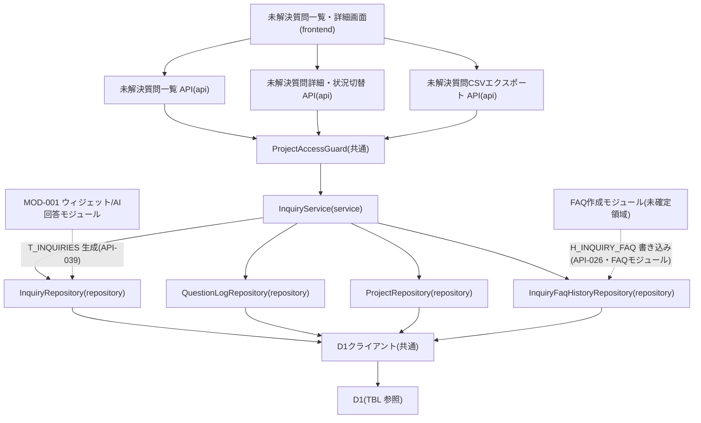

# MOD-007: inquiry モジュール構造

> **本構造図は「オーナー / メンバーが未解決質問を一覧・詳細確認し、対応状況を切り替え、CSV エクスポートする」管理機能領域のモジュール分割と内向き依存の方向を定義します。**

*種別 モジュール構造図 ・ ステータス ドラフト*

| 項目 | 値 |
|----|----|
| MOD ID | MOD-007 |
| 業務ユースケースID | [UC-029](../../01_requirements/04_business_usecases/UC-029.md#UC-029) ・ [UC-030](../../01_requirements/04_business_usecases/UC-030.md#UC-030) ・ [UC-031](../../01_requirements/04_business_usecases/UC-031.md#UC-031) |
| 関連 API / SYS | [API-034](../../02_basic_design/02_backend/03_apis/API-034.md#API-034) ・ [API-035](../../02_basic_design/02_backend/03_apis/API-035.md#API-035) ・ [API-036](../../02_basic_design/02_backend/03_apis/API-036.md#API-036) ・ [API-039](../../02_basic_design/02_backend/03_apis/API-039.md#API-039) |
| 関連画面 | [SCR-006](../../02_basic_design/01_frontend/01_screens/SCR-006.md#SCR-006) ・ [SCR-007](../../02_basic_design/01_frontend/01_screens/SCR-007.md#SCR-007) |
| 関連テーブル | [TBL-017](../../02_basic_design/02_backend/04_database/TBL-017.md#TBL-017) ・ [TBL-025](../../02_basic_design/02_backend/04_database/TBL-025.md#TBL-025) ・ [TBL-004](../../02_basic_design/02_backend/04_database/TBL-004.md#TBL-004) ・ [TBL-029](../../02_basic_design/02_backend/04_database/TBL-029.md#TBL-029) |

## 1. 目的

本機能領域は、オーナー / メンバーが担当プロジェクトの未解決質問(`T_INQUIRIES`)を状況・期間・フリーワードで一覧・詳細確認し、対応状況(`open` ↔ `closed`)を手動で切り替え、現在の絞り込み条件で CSV エクスポートする実装単位を定義する。未解決質問データそのものの生成(ウィジェット側登録 [API-039](../../02_basic_design/02_backend/03_apis/API-039.md#API-039))は [MOD-001](MOD-001.md#MOD-001) が担い、本モジュールはその成果物(`T_INQUIRIES`)を読み取り専用の入力として管理・可視化する側に責務を絞る。モジュール分割は Next.js on Cloudflare の物理配置(`app/`・`lib/service`・`lib/repository`)へ写像し、依存は内向き(frontend → api → service → repository)に統一して逆依存・循環依存を作らない。

## 2. モジュール一覧

本機能領域を構成するモジュールを物理配置・種別・責務・入出力で一覧化する。全モジュールが同期経路(Route Handler → Service → Repository)であり、非同期経路・外部連携は持たない。

| モジュールID | モジュール名 | 種別 | 責務 | 主な入力 | 主な出力 |
|----|----|----|----|----|----|
| M-01 | `app/inquiries`(未解決質問一覧・詳細画面) | frontend | 未解決質問の一覧表示・絞り込み・詳細表示・対応状況切替操作・CSV エクスポート操作を担う([SCR-006](../../02_basic_design/01_frontend/01_screens/SCR-006.md#SCR-006) ・ [SCR-007](../../02_basic_design/01_frontend/01_screens/SCR-007.md#SCR-007)) | 利用者操作(絞り込み条件・状況切替) | 未解決質問 API 呼び出し |
| M-02 | `app/api/inquiries/route.ts` | api | 未解決質問一覧要求の受付。認証・境界判定を経て Service へ委譲しカーソルページネーション結果を応答する([API-034](../../02_basic_design/02_backend/03_apis/API-034.md#API-034)) | HTTP リクエスト(状況・プロジェクト・期間・フリーワード・カーソル) | Service 呼び出し・HTTP レスポンス |
| M-03 | `app/api/inquiries/[id]/route.ts` | api | 未解決質問詳細取得・対応状況切替要求の受付。CSRF 検証を伴う `patch` を含め Service へ委譲する([API-035](../../02_basic_design/02_backend/03_apis/API-035.md#API-035)) | HTTP リクエスト(未解決質問 ID・更新後状況) | Service 呼び出し・HTTP レスポンス |
| M-04 | `app/api/inquiries/export/route.ts` | api | CSV エクスポート要求の受付。Service へ委譲し添付ファイル応答を組み立てる([API-036](../../02_basic_design/02_backend/03_apis/API-036.md#API-036)) | HTTP リクエスト(状況・プロジェクト・期間・フリーワード) | Service 呼び出し・HTTP レスポンス(CSV 添付) |
| M-05 | `lib/guard/project-access`(`ProjectAccessGuard`) | 共通 | 対象プロジェクトへの所有権または有効な割当(境界判定・第2層)を検証し、割当なし・部外者は 404 偽装で除外する([PERM-005](../../02_basic_design/04_permissions/PERM-005.md#PERM-005)) | 対象プロジェクト・呼び出し利用者 | 通過 / 404 偽装 |
| M-06 | `lib/service/inquiry`(`InquiryService`) | service | 未解決質問の一覧抽出(状況・期間・フリーワード条件)・詳細取得(元質問ログ結合)・対応状況切替・CSV 整形を統括する | 検証済み要求(論理項目) | Repository 呼び出し・応答 DTO |
| M-07 | `lib/repository/inquiry`(`InquiryRepository`) | repository | 未解決質問の一覧抽出・ID 照会・状況更新を D1 へ行う。生成・冪等キー照会([MOD-001](MOD-001.md#MOD-001) が利用)と同一クラスを共有する | Service からの参照・更新要求 | 未解決質問取得/更新結果([TBL-017](../../02_basic_design/02_backend/04_database/TBL-017.md#TBL-017)) |
| M-08 | `lib/repository/question-log`(`QuestionLogRepository`) | repository | 未解決質問の詳細表示に必要な元質問ログ(応答ログ・信頼度・未解決理由)を D1 から照会する。生成・フィードバック更新([MOD-001](MOD-001.md#MOD-001) が利用)と同一クラスを共有する | Service からの参照要求 | 質問ログ取得結果([TBL-025](../../02_basic_design/02_backend/04_database/TBL-025.md#TBL-025)) |
| M-09 | `lib/repository/project`(`ProjectRepository`) | repository | 詳細画面のチャネル付随表示に用いるプロジェクト名を D1 から照会する | Service からの参照要求 | プロジェクト取得結果([TBL-004](../../02_basic_design/02_backend/04_database/TBL-004.md#TBL-004)) |
| M-10 | `lib/repository/inquiry-faq-history`(`InquiryFaqHistoryRepository`) | repository | 未解決質問から FAQ への移行履歴を未解決質問 ID で D1 から照会する(書き込みは対象外) | Service からの参照要求 | 移行履歴取得結果([TBL-029](../../02_basic_design/02_backend/04_database/TBL-029.md#TBL-029)) |
| M-11 | `lib/db`(D1 クライアント) | 共通 | D1 への接続・トランザクション境界の提供。Repository のみが利用する | Repository からのクエリ要求 | D1 実行結果 |

## 3. モジュール構造図

モジュール間の依存を内向き(上位 → 下位)で示す。境界判定ガードは Route Handler の前段に作用し、FAQ 化(FAQ 作成モジュール)と未解決質問生成(ウィジェット登録モジュール)は別領域として分離する。

## 4. 依存関係一覧

呼び出し元・呼び出し先の依存を、同期/非同期の別と用途で一覧化する。本機能領域はすべて同期経路であり非同期境界を持たない。

| 呼び出し元 | 呼び出し先 | 用途 | 同期/非同期 | 備考 |
|----|----|----|----|----|
| M-01 未解決質問一覧・詳細画面 | M-02 未解決質問一覧 API | 一覧取得・絞り込み | 同期 | 入出力契約は [IO-017](../03_io_specs/IO-017.md#IO-017) |
| M-01 未解決質問一覧・詳細画面 | M-03 未解決質問詳細・状況切替 API | 詳細取得・対応状況切替 | 同期 | 入出力契約は [IO-018](../03_io_specs/IO-018.md#IO-018) |
| M-01 未解決質問一覧・詳細画面 | M-04 未解決質問 CSV エクスポート API | 絞り込み条件一致分の CSV 取得 | 同期 | `Content-Disposition: attachment` 応答([API-036](../../02_basic_design/02_backend/03_apis/API-036.md#API-036)) |
| M-02 未解決質問一覧 API | M-05 ProjectAccessGuard | 境界判定(所有 / 割当) | 同期 | 不通過は 404 偽装([PERM-005](../../02_basic_design/04_permissions/PERM-005.md#PERM-005)) |
| M-03 未解決質問詳細・状況切替 API | M-05 ProjectAccessGuard | 境界判定(所有 / 割当) | 同期 | `patch` は CSRF 検証も併用([API-035](../../02_basic_design/02_backend/03_apis/API-035.md#API-035)) |
| M-04 未解決質問 CSV エクスポート API | M-05 ProjectAccessGuard | 境界判定(所有 / 割当) | 同期 | 不通過は 404 偽装([PERM-005](../../02_basic_design/04_permissions/PERM-005.md#PERM-005)) |
| M-05 ProjectAccessGuard | M-06 InquiryService | 境界判定通過後の業務ロジック委譲 | 同期 | — |
| M-06 InquiryService | M-07 InquiryRepository | 未解決質問の一覧抽出・詳細照会・状況更新 | 同期 | 物理項目対応は [DBP-008](../07_db_physical/DBP-008.md#DBP-008) |
| M-06 InquiryService | M-08 質問ログリポジトリ | 詳細表示用の元質問ログ(応答ログ・信頼度・理由)照会 | 同期 | [TBL-025](../../02_basic_design/02_backend/04_database/TBL-025.md#TBL-025) |
| M-06 InquiryService | M-09 プロジェクトリポジトリ | 詳細画面のチャネル付随表示用プロジェクト名照会 | 同期 | [TBL-004](../../02_basic_design/02_backend/04_database/TBL-004.md#TBL-004) |
| M-06 InquiryService | M-10 FAQ 化履歴リポジトリ | 未解決質問から FAQ への移行履歴照会 | 同期 | 現行 API 経路からの参照はなし(§6 課題候補) |
| M-07〜M-10 各リポジトリ | M-11 D1 クライアント | クエリ実行・トランザクション境界 | 同期 | Repository のみが D1 を利用(内向き依存) |
| MOD-001 ウィジェット/AI回答モジュール | M-07 InquiryRepository | 未解決質問の生成([API-039](../../02_basic_design/02_backend/03_apis/API-039.md#API-039)。`create` / `findByIdempotencyKey`) | 同期 | 生成側の実体は [MOD-001](MOD-001.md#MOD-001)。本モジュールは `InquiryRepository` クラスを共有し参照系メソッドのみ追加する |
| FAQ 作成モジュール(未確定領域) | M-10 FAQ 化履歴リポジトリ | 未解決質問から FAQ への移行時の履歴記録 | 未確定 | 書き込み処理主体・トランザクション境界が基本設計未確定(§6 課題候補) |

## 5. モジュール別処理概要

各モジュールの処理概要と例外処理の方針を示す。実装コード本文・SQL 本文は書かない。

| モジュール | 処理概要 | 例外処理 | 備考 |
|----|----|----|----|
| M-02 未解決質問一覧 API | 境界判定通過後、状況・プロジェクト・期間・フリーワードの条件で InquiryService へ委譲しカーソルページネーション結果を応答する | 検証エラーは標準エラー体系で応答([ERR-001](../../02_basic_design/05_errors/ERR-001.md#ERR-001)) | — |
| M-03 未解決質問詳細・状況切替 API | 境界判定通過後、`get` は詳細(応答ログ・信頼度・理由・チャネル・プロジェクト名)を取得し、`patch` は対応状況(`open` ↔ `closed`)を更新する | 対象不在・境界判定不通過は 404 偽装。検証エラーは標準エラー体系で応答([ERR-001](../../02_basic_design/05_errors/ERR-001.md#ERR-001)) | 双方向遷移許容(再オープン制限なし)。担当者概念・状態変更履歴は持たない |
| M-04 未解決質問 CSV エクスポート API | 境界判定通過後、絞り込み条件に一致する未解決質問を全件取得し CSV 形式へ整形して添付応答する | 検証エラーは標準エラー体系で応答([ERR-001](../../02_basic_design/05_errors/ERR-001.md#ERR-001)) | 列構成は問い合わせID・状況・質問・未解決理由・最終更新日時 |
| M-05 ProjectAccessGuard | 対象プロジェクトへの所有権または有効な割当を判定し、いずれも満たさない場合は 404 偽装で応答する | 判定不通過は後段(InquiryService)へ処理を渡さない | 判定条件は [PERM-005](../../02_basic_design/04_permissions/PERM-005.md#PERM-005) |
| M-06 InquiryService | 一覧抽出時は元質問ログを結合し未解決理由・信頼度を付帯、詳細取得時はチャネル付随のプロジェクト名を付帯、状況切替は `open` ↔ `closed` の双方向更新を行い、CSV エクスポート時は絞り込み一致分を CSV へ整形する | 対象不在は境界判定不通過相当として扱う | 理由コード → 表示ラベル変換は Route Handler 応答整形前に実施。理由コードの意味は [状態モデル §4.2](../../02_basic_design/08_state-model.md#42-未解決質問状態) |
| M-07〜M-10 リポジトリ群 | 未解決質問・質問ログ・プロジェクト・FAQ 化履歴の D1 アクセスを担い、Service からの参照・更新要求を実行する | 一時障害は呼び出し元へ伝播 | 物理設計は [DBP-008](../07_db_physical/DBP-008.md#DBP-008) |

## 6. 後続工程への引き継ぎ事項

実装・テスト設計へ引き継ぐ観点(依存方向の逸脱検出・共有クラスの整合・境界判定の一貫性)を箇条書きで示す。

- 内向き依存の逸脱検証: D1 クライアント(M-11)を利用するのは Repository 群のみで、Service/Guard/API から直接 D1 を触らないこと。逆依存(Repository → Service)・循環依存が生じていないこと。
- 共有クラスの整合検証: `InquiryRepository`(M-07)・`QuestionLogRepository`(M-08)は [MOD-001](MOD-001.md#MOD-001) と本書とで同一クラスを共有するため、両モジュール構造で定義するメソッド一覧を合算した完全なインターフェースを実装時に確定すること。
- 境界判定(404 偽装)の一貫性検証: 一覧(M-02)・詳細(M-03)・CSV エクスポート(M-04)の三経路で ProjectAccessGuard(M-05)の判定結果が同一であること。
- FAQ 化履歴の書き込み担当: `H_INQUIRY_FAQ` への移行履歴の書き込みは FAQ 作成([API-026](../../02_basic_design/02_backend/03_apis/API-026.md#API-026) P-06・FAQ モジュール `InquiryFaqHistoryRepository.create`)が担い、本モジュールの `InquiryFaqHistoryRepository`(M-10)は参照メソッド(`findByInquiry` 等)のみを提供する。FAQ 作成トランザクション内での書き込みと本モジュール参照の整合を実装時に確認する。
- モジュール境界の契約整合: 未解決質問一覧・詳細 API と InquiryService 間の入出力契約が [IO-017](../03_io_specs/IO-017.md#IO-017) ・ [IO-018](../03_io_specs/IO-018.md#IO-018) と一致すること。
- CSV エクスポート全件抽出時の規模検証: 絞り込み条件に一致する件数が大きい場合の応答時間・メモリ境界をテスト設計でケース化すること。
