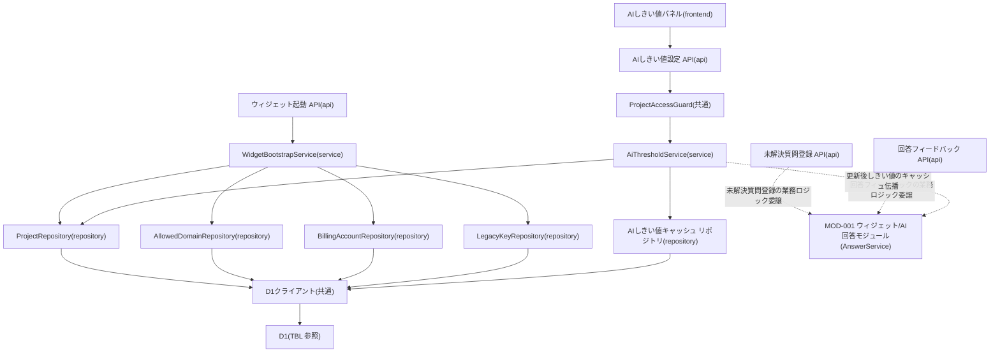

# MOD-008: widget(管理系境界) モジュール構造

> **本構造図は「ウィジェット起動(セッション確立)・未解決質問/回答フィードバックの受付境界・AIしきい値設定の管理連携」という、ウィジェット質問応答の実行系を取り巻く管理系境界のモジュール分割と内向き依存の方向を定義します。**

*種別 モジュール構造図 ・ ステータス ドラフト*

| 項目 | 値 |
|----|----|
| MOD ID | MOD-008 |
| 業務ユースケースID | [UC-040](../../01_requirements/04_business_usecases/UC-040.md#UC-040) ・ [UC-042](../../01_requirements/04_business_usecases/UC-042.md#UC-042) ・ [UC-047](../../01_requirements/04_business_usecases/UC-047.md#UC-047) ・ [UC-049](../../01_requirements/04_business_usecases/UC-049.md#UC-049) ・ [UC-050](../../01_requirements/04_business_usecases/UC-050.md#UC-050) ・ [UC-057](../../01_requirements/04_business_usecases/UC-057.md#UC-057) ・ [UC-075](../../01_requirements/04_business_usecases/UC-075.md#UC-075) ・ [UC-083](../../01_requirements/04_business_usecases/UC-083.md#UC-083) |
| 関連 API / SYS | [API-037](../../02_basic_design/02_backend/03_apis/API-037.md#API-037) ・ [API-039](../../02_basic_design/02_backend/03_apis/API-039.md#API-039) ・ [API-067](../../02_basic_design/02_backend/03_apis/API-067.md#API-067) ・ [API-069](../../02_basic_design/02_backend/03_apis/API-069.md#API-069) ・ [SYS-015](../../02_basic_design/02_backend/01_system/SYS-015.md#SYS-015) |
| 関連画面 | [SCR-011](../../02_basic_design/01_frontend/01_screens/SCR-011.md#SCR-011) ・ [SCR-030](../../02_basic_design/01_frontend/01_screens/SCR-030.md#SCR-030) |
| 関連テーブル | [TBL-002](../../02_basic_design/02_backend/04_database/TBL-002.md#TBL-002) ・ [TBL-004](../../02_basic_design/02_backend/04_database/TBL-004.md#TBL-004) ・ [TBL-005](../../02_basic_design/02_backend/04_database/TBL-005.md#TBL-005) ・ [TBL-015](../../02_basic_design/02_backend/04_database/TBL-015.md#TBL-015) ・ [TBL-017](../../02_basic_design/02_backend/04_database/TBL-017.md#TBL-017) ・ [TBL-025](../../02_basic_design/02_backend/04_database/TBL-025.md#TBL-025) ・ [TBL-031](../../02_basic_design/02_backend/04_database/TBL-031.md#TBL-031) |

## 1. 目的

本機能領域は、[MOD-001](MOD-001.md#MOD-001)(ウィジェット/AI回答=質問送信・回答可否判定の実行系)を取り巻く 3 つの管理系境界を実装単位として定義する。第 1 に、ウィジェット利用者が設置サイトでチャットを開く際の公開キー・許可ドメイン検証とセッション確立(起動、[API-037](../../02_basic_design/02_backend/03_apis/API-037.md#API-037))。第 2 に、未解決質問登録・回答フィードバックの受付境界(Route Handler、[API-039](../../02_basic_design/02_backend/03_apis/API-039.md#API-039) ・ [API-069](../../02_basic_design/02_backend/03_apis/API-069.md#API-069))で、業務ロジック本体は [MOD-001](MOD-001.md#MOD-001) の `AnswerService` を共有利用する。第 3 に、オーナー / メンバーが管理画面([SCR-011](../../02_basic_design/01_frontend/01_screens/SCR-011.md#SCR-011))からプロジェクト単位の AI しきい値(信頼度・関連度)を取得・更新・削除し、以降の推論へ伝播する設定連携([API-067](../../02_basic_design/02_backend/03_apis/API-067.md#API-067) ・ [SYS-015](../../02_basic_design/02_backend/01_system/SYS-015.md#SYS-015))。モジュール分割は Next.js on Cloudflare の物理配置(`app/`・`lib/service`・`lib/repository`)へ写像し、依存は内向き(frontend → api → service → repository)に統一して逆依存・循環依存を作らない。

## 2. モジュール一覧

本機能領域を構成するモジュールを物理配置・種別・責務・入出力で一覧化する。起動・しきい値設定は同期経路のみを持ち、未解決/フィードバックの受付は Route Handler を本モジュールで定義しつつ業務ロジックは [MOD-001](MOD-001.md#MOD-001) の `AnswerService` を共有する。

| モジュールID | モジュール名 | 種別 | 責務 | 主な入力 | 主な出力 |
|----|----|----|----|----|----|
| M-01 | `app/api/widget/bootstrap/route.ts` | api | ウィジェット起動要求の受付。公開キー・オリジン検証、旧キー猶予期限判定、課金状態確認を経てセッショントークンとプロジェクト表示設定を返す([API-037](../../02_basic_design/02_backend/03_apis/API-037.md#API-037)) | HTTP リクエスト(公開キー・オリジン) | Service 呼び出し・HTTP レスポンス |
| M-02 | `app/api/widget/inquiries/route.ts` | api | 未解決質問登録要求の受付。冪等キー付きで [MOD-001](MOD-001.md#MOD-001) の `AnswerService` へ委譲する([API-039](../../02_basic_design/02_backend/03_apis/API-039.md#API-039)) | HTTP リクエスト(質問ログ ID・冪等キー) | Service 呼び出し・HTTP レスポンス |
| M-03 | `app/api/widget/feedback/route.ts` | api | 回答フィードバック要求の受付。[MOD-001](MOD-001.md#MOD-001) の `AnswerService` へ委譲する([API-069](../../02_basic_design/02_backend/03_apis/API-069.md#API-069)) | HTTP リクエスト(質問ログ ID・フィードバック値・冪等キー) | Service 呼び出し・HTTP レスポンス |
| M-04 | `app/settings/widget`(ウィジェット設定画面の AI しきい値パネル) | frontend | 信頼度・関連度しきい値の現在値表示・入力・保存/リセット操作を担う([SCR-011](../../02_basic_design/01_frontend/01_screens/SCR-011.md#SCR-011)) | 利用者操作(しきい値入力・保存/リセット) | AI しきい値設定 API 呼び出し |
| M-05 | `app/api/projects/[id]/ai-thresholds/route.ts` | api | AI しきい値の取得・更新・削除要求の受付。境界判定を経て Service へ委譲する([API-067](../../02_basic_design/02_backend/03_apis/API-067.md#API-067)) | HTTP リクエスト(信頼度・関連度、または削除要求) | Service 呼び出し・HTTP レスポンス |
| M-06 | `lib/guard/project-access`(`ProjectAccessGuard`) | 共通 | 対象プロジェクトへの所有権または有効な割当(境界判定・第 2 層)を検証する([PERM-005](../../02_basic_design/04_permissions/PERM-005.md#PERM-005)) | 対象プロジェクト・呼び出し利用者 | 通過 / 拒否 |
| M-07 | `lib/service/widget-bootstrap`(`WidgetBootstrapService`) | service | 公開キー / 旧キー照合、許可ドメイン照合、課金状態(サスペンション)確認を統括しセッショントークンを発行する | 公開キー・オリジン(論理項目) | セッション発行結果・プロジェクト表示設定 |
| M-08 | `lib/service/ai-threshold`(`AiThresholdService`) | service | AI しきい値のプロジェクト設定値・グローバル既定値の優先順位判定([IPO-004](../04_ipo/IPO-004.md#IPO-004))、登録・更新・削除確定、変更後状態のキャッシュ伝播を統括する | しきい値入力値(論理項目)、または削除要求 | Repository 呼び出し・応答 DTO |
| M-09 | `lib/repository/project`(`ProjectRepository`) | repository | 起動時の対象プロジェクト特定・表示設定照会、しきい値設定時の対象プロジェクト存在確認を D1 へ行う | Service からの参照要求 | プロジェクト取得結果([TBL-004](../../02_basic_design/02_backend/04_database/TBL-004.md#TBL-004)) |
| M-10 | `lib/repository/allowed-domain`(`AllowedDomainRepository`) | repository | 許可ドメインの照会を D1 へ行う | Service からの参照要求 | 許可ドメイン取得結果([TBL-005](../../02_basic_design/02_backend/04_database/TBL-005.md#TBL-005)) |
| M-11 | `lib/repository/billing-account`(`BillingAccountRepository`) | repository | 課金状態(サスペンション判定)の照会を D1 へ行う | Service からの参照要求 | 課金アカウント取得結果([TBL-002](../../02_basic_design/02_backend/04_database/TBL-002.md#TBL-002)) |
| M-12 | `lib/repository/legacy-key`(`LegacyKeyRepository`) | repository | 旧公開キーと猶予期限の照会を D1 へ行う | Service からの参照要求 | 旧キー取得結果([TBL-015](../../02_basic_design/02_backend/04_database/TBL-015.md#TBL-015)) |
| M-13 | `lib/repository/ai-threshold`(`AiThresholdCacheRepository`) | repository | プロジェクト単位 AI しきい値設定の照会・登録・更新・削除を D1 へ行う。[MOD-001](MOD-001.md#MOD-001) の同名クラス(照会専用 `findByProject`)と同一クラスを共有し、本モジュールが登録・更新・削除メソッドを追加する | Service からの参照・更新・削除要求 | しきい値設定の取得/更新/削除結果([TBL-031](../../02_basic_design/02_backend/04_database/TBL-031.md#TBL-031)) |
| M-14 | `lib/db`(D1 クライアント) | 共通 | D1 への接続・トランザクション境界の提供。Repository のみが利用する | Repository からのクエリ要求 | D1 実行結果 |

## 3. モジュール構造図

モジュール間の依存を内向き(上位 → 下位)で示す。未解決質問登録・回答フィードバックの Route Handler は [MOD-001](MOD-001.md#MOD-001) の `AnswerService` を破線で参照し、業務ロジックの二重実装を作らない。

## 4. 依存関係一覧

呼び出し元・呼び出し先の依存を、同期/非同期の別と用途で一覧化する。本機能領域は非同期境界を持たず、外部連携も持たない。

| 呼び出し元 | 呼び出し先 | 用途 | 同期/非同期 | 備考 |
|----|----|----|----|----|
| M-01 ウィジェット起動 API | M-07 WidgetBootstrapService | 起動要求の業務ロジック委譲 | 同期 | 入出力契約は [IO-033](../03_io_specs/IO-033.md#IO-033) |
| M-02 未解決質問登録 API | MOD-001 `AnswerService` | 未解決質問登録の業務ロジック委譲(`registerInquiry`) | 同期 | Route Handler は本モジュールで定義し業務ロジックは共有([MOD-001](MOD-001.md#MOD-001)) |
| M-03 回答フィードバック API | MOD-001 `AnswerService` | 回答フィードバック記録の業務ロジック委譲(`recordFeedback`) | 同期 | Route Handler は本モジュールで定義し業務ロジックは共有([MOD-001](MOD-001.md#MOD-001)) |
| M-04 AIしきい値パネル | M-05 AIしきい値設定 API | しきい値の取得・保存・リセット | 同期 | — |
| M-05 AIしきい値設定 API | M-06 ProjectAccessGuard | 境界判定(所有 / 割当) | 同期 | 不通過は [ERR-019](../../02_basic_design/05_errors/ERR-019.md#ERR-019) |
| M-06 ProjectAccessGuard | M-08 AiThresholdService | 境界判定通過後の業務ロジック委譲 | 同期 | — |
| M-07 WidgetBootstrapService | M-09 ProjectRepository | 対象プロジェクトの特定・表示設定照会 | 同期 | [TBL-004](../../02_basic_design/02_backend/04_database/TBL-004.md#TBL-004) |
| M-07 WidgetBootstrapService | M-10 AllowedDomainRepository | 許可ドメイン照合 | 同期 | 不一致は [ERR-027](../../02_basic_design/05_errors/ERR-027.md#ERR-027) |
| M-07 WidgetBootstrapService | M-11 BillingAccountRepository | 課金状態(サスペンション)確認 | 同期 | サスペンション時は [ERR-004](../../02_basic_design/05_errors/ERR-004.md#ERR-004)。状態名は [状態モデル](../../02_basic_design/08_state-model.md) |
| M-07 WidgetBootstrapService | M-12 LegacyKeyRepository | 旧公開キー・猶予期限照合(遅延失効) | 同期 | 不一致・期限超過は [ERR-026](../../02_basic_design/05_errors/ERR-026.md#ERR-026) |
| M-08 AiThresholdService | M-09 ProjectRepository | 対象プロジェクトの存在確認 | 同期 | 不在は [ERR-011](../../02_basic_design/05_errors/ERR-011.md#ERR-011) |
| M-08 AiThresholdService | M-13 AIしきい値キャッシュリポジトリ | プロジェクト設定値の取得・登録・更新・削除 | 同期 | 優先順位判定は [IPO-004](../04_ipo/IPO-004.md#IPO-004)。値の正本は [システム仕様書 §1](../../02_basic_design/07_system-spec.md#1-aiしきい値) |
| M-08 AiThresholdService | MOD-001 `AiThresholdCacheRepository.findByProject` | 更新後しきい値の以降推論への伝播([SYS-015](../../02_basic_design/02_backend/01_system/SYS-015.md#SYS-015)) | 同期 | 同一クラス(M-13)を共有するため、書込確定後は次回照会から即時反映 |
| M-09〜M-13 各リポジトリ | M-14 D1 クライアント | クエリ実行・トランザクション境界 | 同期 | Repository のみが D1 を利用(内向き依存) |

## 5. モジュール別処理概要

各モジュールの処理概要と例外処理の方針を示す。実装コード本文・SQL 本文は書かない。

| モジュール | 処理概要 | 例外処理 | 備考 |
|----|----|----|----|
| M-01 ウィジェット起動 API | 公開キー・オリジンを受理し WidgetBootstrapService へ委譲、セッショントークンとプロジェクト表示設定を応答する | 検証エラーは標準エラー体系で応答([ERR-001](../../02_basic_design/05_errors/ERR-001.md#ERR-001)) | — |
| M-02 未解決質問登録 API / M-03 回答フィードバック API | 冪等キー付きで受理し MOD-001 `AnswerService` の対応メソッドへ委譲、結果を応答へ写像する | 検証エラーは標準エラー体系で応答([ERR-001](../../02_basic_design/05_errors/ERR-001.md#ERR-001)) | 業務ロジック・例外分岐の詳細は [MOD-001](MOD-001.md#MOD-001) を正本とする |
| M-05 AIしきい値設定 API | 境界判定通過後、`get` は適用しきい値(プロジェクト設定値 / グローバル既定値)を返し、`put` は信頼度・関連度を 1 セットで検証して更新または削除する | 片方のみ指定・範囲外は 400([ERR-001](../../02_basic_design/05_errors/ERR-001.md#ERR-001))。境界判定不通過は 403([ERR-019](../../02_basic_design/05_errors/ERR-019.md#ERR-019)) | 検証規則は [API-067](../../02_basic_design/02_backend/03_apis/API-067.md#API-067) |
| M-06 ProjectAccessGuard | 対象プロジェクトへの所有権または有効な割当を判定し、いずれも満たさない場合は後段へ処理を渡さない | 判定不通過は 403 で応答([ERR-019](../../02_basic_design/05_errors/ERR-019.md#ERR-019)) | 判定条件は [PERM-005](../../02_basic_design/04_permissions/PERM-005.md#PERM-005) |
| M-07 WidgetBootstrapService | 現行公開キー照合を優先し、不一致時は旧キー(猶予期限内)を照合、許可ドメイン照合、課金状態確認を経てセッショントークンを発行する | いずれかの検証に失敗した場合はセッションを発行しない([ERR-026](../../02_basic_design/05_errors/ERR-026.md#ERR-026) / [ERR-027](../../02_basic_design/05_errors/ERR-027.md#ERR-027) / [ERR-004](../../02_basic_design/05_errors/ERR-004.md#ERR-004)) | 遅延失効の判定順序は [API-037](../../02_basic_design/02_backend/03_apis/API-037.md#API-037) P-01〜P-02 |
| M-08 AiThresholdService | プロジェクト設定値の登録有無・取得可否を判定し適用しきい値を確定、更新・削除確定後は変更後状態を以降の推論が参照できる状態へ伝播する | プロジェクト設定値取得不能時はグローバル既定値へ直接フォールバックしアラート通知([SYS-015](../../02_basic_design/02_backend/01_system/SYS-015.md#SYS-015) [MSG-013](../../02_basic_design/06_messages/MSG-013.md#MSG-013)) | 判定順序の詳細は [IPO-004](../04_ipo/IPO-004.md#IPO-004) |
| M-09〜M-13 リポジトリ群 | プロジェクト・許可ドメイン・課金アカウント・旧キー・AI しきい値の D1 アクセスを担い、Service からの参照・更新・削除要求を実行する | 一時障害は呼び出し元へ伝播 | 物理設計は [DBP-001](../07_db_physical/DBP-001.md#DBP-001) 等の対応 DBP を参照 |

## 6. 後続工程への引き継ぎ事項

実装・テスト設計へ引き継ぐ観点(依存方向の逸脱検出・共有クラスの整合・境界判定の一貫性)を箇条書きで示す。

- 内向き依存の逸脱検証: D1 クライアント(M-14)を利用するのは Repository 群のみで、Service/Guard/API から直接 D1 を触らないこと。逆依存(Repository → Service)・循環依存が生じていないこと。
- 共有クラスの整合検証: `AiThresholdCacheRepository`(M-13)は [MOD-001](MOD-001.md#MOD-001) の照会専用メソッド(`findByProject`)と本書の登録・更新・削除メソッドを合算した完全なインターフェースを実装時に確定すること。書込後の即時反映(同一クラス共有によるキャッシュ整合)をテスト設計でケース化すること。
- 業務ロジック二重実装の防止: 未解決質問登録(M-02)・回答フィードバック(M-03)の Route Handler は本モジュールで定義するが、業務ロジックは [MOD-001](MOD-001.md#MOD-001) の `AnswerService`(`registerInquiry` / `recordFeedback`)を呼び出すのみとし、判定・永続化ロジックを本モジュール側に複製しないこと。
- 起動境界の順序検証: 公開キー照合(現行 → 旧キー猶予期限)→ 許可ドメイン照合 → 課金状態確認の順序([API-037](../../02_basic_design/02_backend/03_apis/API-037.md#API-037) P-01〜P-04)が実装で保たれること。
- しきい値伝播境界の検証: AI しきい値の登録・更新・削除確定([API-067](../../02_basic_design/02_backend/03_apis/API-067.md#API-067))から、以降の推論([MOD-001](MOD-001.md#MOD-001) `AnswerService.ask`)が変更後の値を参照するまでの反映遅延・フォールバックアラート発火条件を [SYS-015](../../02_basic_design/02_backend/01_system/SYS-015.md#SYS-015) ・ [IPO-004](../04_ipo/IPO-004.md#IPO-004) と突き合わせてケース化すること。
- モジュール境界の契約整合: ウィジェット起動 API と WidgetBootstrapService 間の入出力契約が [IO-033](../03_io_specs/IO-033.md#IO-033) と一致すること。
- 境界判定(403)の一貫性検証: AI しきい値設定 API(M-05)における ProjectAccessGuard(M-06)の判定結果が、同ガードを利用する他モジュール(プロジェクト管理系)と一致すること。
