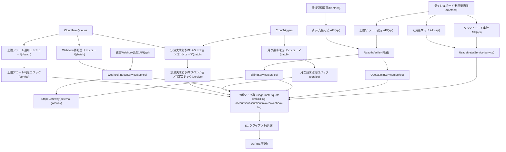

# MOD-009: usage-billing モジュール構造

> **本構造図は「利用量計測・ダッシュボード/利用量サマリ・プロジェクト上限アラート設定・月次請求確定・支払方法/請求書照会・決済失敗猶予/サスペンション判定・課金プロバイダ連携」機能領域のモジュール分割と内向き依存の方向を定義します。**

*種別 モジュール構造図 ・ ステータス ドラフト*

| 項目 | 値 |
|----|----|
| MOD ID | MOD-009 |
| 業務ユースケースID | [UC-032](../../01_requirements/04_business_usecases/UC-032.md#UC-032) ・ [UC-033](../../01_requirements/04_business_usecases/UC-033.md#UC-033) ・ [UC-034](../../01_requirements/04_business_usecases/UC-034.md#UC-034) ・ [UC-035](../../01_requirements/04_business_usecases/UC-035.md#UC-035) ・ [UC-036](../../01_requirements/04_business_usecases/UC-036.md#UC-036) ・ [UC-037](../../01_requirements/04_business_usecases/UC-037.md#UC-037) ・ [UC-051](../../01_requirements/04_business_usecases/UC-051.md#UC-051) ・ [UC-052](../../01_requirements/04_business_usecases/UC-052.md#UC-052) ・ [UC-053](../../01_requirements/04_business_usecases/UC-053.md#UC-053) ・ [UC-054](../../01_requirements/04_business_usecases/UC-054.md#UC-054) ・ [UC-055](../../01_requirements/04_business_usecases/UC-055.md#UC-055) ・ [UC-056](../../01_requirements/04_business_usecases/UC-056.md#UC-056) ・ [UC-081](../../01_requirements/04_business_usecases/UC-081.md#UC-081) |
| 関連 API / SYS | [API-040](../../02_basic_design/02_backend/03_apis/API-040.md#API-040) ・ [API-041](../../02_basic_design/02_backend/03_apis/API-041.md#API-041) ・ [API-042](../../02_basic_design/02_backend/03_apis/API-042.md#API-042) ・ [API-043](../../02_basic_design/02_backend/03_apis/API-043.md#API-043) ・ [API-044](../../02_basic_design/02_backend/03_apis/API-044.md#API-044) ・ [API-045](../../02_basic_design/02_backend/03_apis/API-045.md#API-045) ・ [API-046](../../02_basic_design/02_backend/03_apis/API-046.md#API-046) ・ [API-047](../../02_basic_design/02_backend/03_apis/API-047.md#API-047) ・ [API-060](../../02_basic_design/02_backend/03_apis/API-060.md#API-060) ・ [API-062](../../02_basic_design/02_backend/03_apis/API-062.md#API-062) ・ [SYS-004](../../02_basic_design/02_backend/01_system/SYS-004.md#SYS-004) ・ [SYS-017](../../02_basic_design/02_backend/01_system/SYS-017.md#SYS-017) ・ [SYS-019](../../02_basic_design/02_backend/01_system/SYS-019.md#SYS-019) ・ [SYS-020](../../02_basic_design/02_backend/01_system/SYS-020.md#SYS-020) |
| 関連画面 | [SCR-021](../../02_basic_design/01_frontend/01_screens/SCR-021.md#SCR-021) ・ [SCR-026](../../02_basic_design/01_frontend/01_screens/SCR-026.md#SCR-026) ・ [SCR-027](../../02_basic_design/01_frontend/01_screens/SCR-027.md#SCR-027) ・ [SCR-028](../../02_basic_design/01_frontend/01_screens/SCR-028.md#SCR-028) ・ [SCR-033](../../02_basic_design/01_frontend/01_screens/SCR-033.md#SCR-033) |
| 関連テーブル | [TBL-002](../../02_basic_design/02_backend/04_database/TBL-002.md#TBL-002) ・ [TBL-006](../../02_basic_design/02_backend/04_database/TBL-006.md#TBL-006) ・ [TBL-008](../../02_basic_design/02_backend/04_database/TBL-008.md#TBL-008) ・ [TBL-009](../../02_basic_design/02_backend/04_database/TBL-009.md#TBL-009) ・ [TBL-017](../../02_basic_design/02_backend/04_database/TBL-017.md#TBL-017) ・ [TBL-018](../../02_basic_design/02_backend/04_database/TBL-018.md#TBL-018) ・ [TBL-019](../../02_basic_design/02_backend/04_database/TBL-019.md#TBL-019) ・ [TBL-020](../../02_basic_design/02_backend/04_database/TBL-020.md#TBL-020) ・ [TBL-022](../../02_basic_design/02_backend/04_database/TBL-022.md#TBL-022) ・ [TBL-025](../../02_basic_design/02_backend/04_database/TBL-025.md#TBL-025) ・ [TBL-026](../../02_basic_design/02_backend/04_database/TBL-026.md#TBL-026) ・ [TBL-032](../../02_basic_design/02_backend/04_database/TBL-032.md#TBL-032) |

## 1. 目的

本機能領域は、質問数計測結果([TBL-020](../../02_basic_design/02_backend/04_database/TBL-020.md#TBL-020))を起点に、ダッシュボード/利用量サマリの参照・プロジェクト上限/アラート設定の取得・更新・月次請求確定・請求サマリ/請求書/支払方法の照会・課金プロバイダ(Stripe)Webhook 取込・決済失敗猶予/サスペンション判定までを一貫して扱う実装単位を定義する。モジュール分割は Next.js on Cloudflare の物理配置(`app/`・`lib/service`・`lib/repository`・`lib/gateway`・`workers/queues`・`workers/cron`)へ写像し、依存は内向き(frontend → api → service → repository、課金プロバイダ連携は service → external-gateway)に統一して逆依存・循環依存を作らない。ウィジェット質問送信時の当月利用量の同期加算・受付停止判定(質問数上限到達ガード)は [MOD-001](MOD-001.md#MOD-001) の `AnswerService` / `UsageLimitGuard` / `UsageMeterRepository.increment` が担い([IPO-006](../04_ipo/IPO-006.md#IPO-006))、本モジュールは同一の `UsageMeterRepository` を参照系メソッドで共用する。

## 2. モジュール一覧

本機能領域を構成するモジュールを物理配置・種別・責務・入出力で一覧化する。同期経路(Route Handler → Service → Repository/Gateway)と非同期経路(Cron Triggers による月次確定・Queues によるアラート通知/決済失敗猶予判定/Webhook 反映)を分けて配置する。

| モジュールID | モジュール名 | 種別 | 責務 | 主な入力 | 主な出力 |
|----|----|----|----|----|----|
| M-01 | `app/dashboard`・`app/usage`(ダッシュボード/利用量画面) | frontend | ダッシュボードサマリ・利用量サマリ(プロジェクト/オーナー)・プロジェクト上限/アラート設定の表示と操作を担う([SCR-021](../../02_basic_design/01_frontend/01_screens/SCR-021.md#SCR-021) ・ [SCR-026](../../02_basic_design/01_frontend/01_screens/SCR-026.md#SCR-026) ・ [SCR-027](../../02_basic_design/01_frontend/01_screens/SCR-027.md#SCR-027) ・ [SCR-033](../../02_basic_design/01_frontend/01_screens/SCR-033.md#SCR-033)) | 利用者操作(期間・集計範囲選択、上限/アラート入力) | 利用量系 API 呼び出し |
| M-02 | `app/billing`(請求管理画面) | frontend | 請求サマリ・請求書一覧・支払方法の表示と登録/更新操作を担う([SCR-028](../../02_basic_design/01_frontend/01_screens/SCR-028.md#SCR-028)) | 利用者操作(支払方法トークン・再認証) | 課金系 API 呼び出し |
| M-03 | `app/api/dashboard/summary/route.ts`・`app/api/dashboard/overview/route.ts` | api | ダッシュボードサマリ・ダッシュボード集計取得の受付([API-040](../../02_basic_design/02_backend/03_apis/API-040.md#API-040) ・ [API-062](../../02_basic_design/02_backend/03_apis/API-062.md#API-062)) | HTTP リクエスト(期間・プロジェクト) | Service 呼び出し・HTTP レスポンス |
| M-04 | `app/api/usage/route.ts`・`app/api/owner/projects/usage/route.ts` | api | 利用量サマリ(プロジェクト/オーナー)の受付([API-041](../../02_basic_design/02_backend/03_apis/API-041.md#API-041) ・ [API-042](../../02_basic_design/02_backend/03_apis/API-042.md#API-042)) | HTTP リクエスト(期間・集計範囲) | Service 呼び出し・HTTP レスポンス |
| M-05 | `app/api/projects/[id]/quota-limits/route.ts`・`app/api/projects/[id]/quota-limits/questions/route.ts` | api | プロジェクト上限・アラート設定の取得/更新受付。更新時は再認証検証を Service 呼び出し前に行う([API-046](../../02_basic_design/02_backend/03_apis/API-046.md#API-046) ・ [API-047](../../02_basic_design/02_backend/03_apis/API-047.md#API-047)) | HTTP リクエスト(上限 ON/OFF・件数・アラート閾値・再認証トークン) | Service 呼び出し・HTTP レスポンス |
| M-06 | `app/api/billing/summary/route.ts`・`app/api/billing/invoices/route.ts`・`app/api/billing/payment-method/route.ts` | api | 請求サマリ・請求書一覧の照会、支払方法の取得/登録・更新の受付([API-043](../../02_basic_design/02_backend/03_apis/API-043.md#API-043) ・ [API-044](../../02_basic_design/02_backend/03_apis/API-044.md#API-044) ・ [API-045](../../02_basic_design/02_backend/03_apis/API-045.md#API-045)) | HTTP リクエスト(取得件数・支払方法トークン・再認証/CSRF トークン) | Service 呼び出し・HTTP レスポンス |
| M-07 | `app/api/webhooks/billing/route.ts` | api | 課金プロバイダ Webhook 通知の受理。認可を持たず署名検証は Service/Gateway 側へ委譲する([API-060](../../02_basic_design/02_backend/03_apis/API-060.md#API-060)) | HTTP リクエスト(署名ヘッダ・生ペイロード) | Service 呼び出し・受領応答(200/401) |
| M-08 | `lib/service/usage-meter`(`UsageMeterService`) | service | 期間解決・集計範囲(プロジェクト単位/オーナー単位/My集計)判定・利用率/参考課金額算出を統括し、ダッシュボード/利用量サマリ系 4 API の集計結果を組み立てる([IPO-005](../04_ipo/IPO-005.md#IPO-005) が参照する当月質問数の算出元と同一集計を用いる) | 期間・プロジェクト/オーナー指定 | 集計結果 DTO |
| M-09 | `lib/service/quota-limit`(`QuotaLimitService`) | service | 質問数月次上限の取得・入力検証(範囲・アラート閾値の許可値/重複/昇順正規化)・更新・参考課金額再算出を統括する | 上限 ON/OFF・件数・アラート閾値 | 更新結果 DTO |
| M-10 | `lib/service/billing`(`BillingService`) | service | オーナー単位(課金アカウント単位)の請求サマリ算出・請求書一覧整形・支払方法の取得/登録・更新を統括する。登録・更新時は Gateway へトークンを渡し生データを保持しない | オーナーのユーザー ID・支払方法トークン | 請求系結果 DTO |
| M-11 | `lib/service/webhook-ingest`(`WebhookIngestService`) | service | 課金プロバイダ Webhook の署名検証依頼・冪等キー照合・受信ログ記録・通知種別に応じた課金アカウント/サブスクリプション/請求書への反映を統括する([SYS-004](../../02_basic_design/02_backend/01_system/SYS-004.md#SYS-004)) | 署名ヘッダ・生ペイロード | 取込結果(不正受信/冪等リプレイ/取込完了/取込失敗) |
| M-12 | `lib/service/monthly-billing`(月次請求確定ロジック) | service | 対象月の課金対象件数を無料枠・超過単価と突き合わせてプロジェクト単位の超過分を算定し、オーナー単位へ集約して請求書を確定・通知する([IPO-002](../04_ipo/IPO-002.md#IPO-002)) | 対象月・請求対象オーナー一覧 | 確定請求書・通知結果 |
| M-13 | `lib/service/payment-suspension`(決済失敗猶予・サスペンション判定ロジック) | service | 決済失敗確定通知で猶予監視を開始し、猶予経過判定でサスペンション移行可否を確定し、再決済成功・解除通知で即時復帰を確定する([IPO-003](../04_ipo/IPO-003.md#IPO-003)) | 決済失敗確定/再決済成功/解除通知・猶予経過判定契機 | 課金アカウント状態確定・重要通知契機 |
| M-14 | `lib/service/quota-alert`(質問数上限アラート判定ロジック) | service | アラート閾値到達契機を受け取り、当月内で受信者ごとに未通知であることを判定し通知先(オーナー+有効メンバー)を確定する([IPO-005](../04_ipo/IPO-005.md#IPO-005)) | 対象プロジェクト・請求年月・到達閾値 | 通知要(宛先リスト)/ 通知不要 |
| M-15 | `lib/gateway/stripe`(`PaymentGateway` インターフェース / `StripeGateway` 実装) | external-gateway | Stripe SDK 経由で Webhook 署名検証・支払方法の照会/登録を行う([EIF-002](../06_external_if/EIF-002.md#EIF-002)) | 署名ペイロード・支払方法トークン・顧客参照 | 検証結果・支払方法操作結果 |
| M-16 | `lib/repository/usage-meter`(`UsageMeterRepository`) | repository | 利用量計測(質問数・課金対象外件数)の照会(D1)。プロジェクト単位・オーナー単位(所有プロジェクト群の合算)・日次推移の参照系メソッドを提供する。加算(`increment`)は [MOD-001](MOD-001.md#MOD-001) M-09 と共用 | Service からの参照要求 | 利用量取得結果([TBL-020](../../02_basic_design/02_backend/04_database/TBL-020.md#TBL-020)) |
| M-17 | `lib/repository/quota-limit`(`QuotaLimitRepository`) | repository | プロジェクト別利用設定(質問数月次上限・アラート閾値・無料枠)の照会・作成/更新を D1 へ行う | Service からの参照/更新要求 | 設定取得/更新結果([TBL-009](../../02_basic_design/02_backend/04_database/TBL-009.md#TBL-009)) |
| M-18 | `lib/repository/billing-account`(`BillingAccountRepository`) | repository | 課金アカウントの照会・支払方法登録状態の更新を D1 へ行う | Service からの参照/更新要求 | 課金アカウント取得/更新結果([TBL-002](../../02_basic_design/02_backend/04_database/TBL-002.md#TBL-002)) |
| M-19 | `lib/repository/subscription`(`SubscriptionRepository`) | repository | 課金サブスクリプションの照会・Webhook 反映による更新を D1 へ行う | Service からの参照/更新要求 | サブスクリプション取得/更新結果([TBL-018](../../02_basic_design/02_backend/04_database/TBL-018.md#TBL-018)) |
| M-20 | `lib/repository/invoice`(`InvoiceRepository`) | repository | 請求書の一覧照会・月次一意照会・Webhook 反映による更新を D1 へ行う | Service からの参照/更新要求 | 請求書取得/更新結果([TBL-019](../../02_basic_design/02_backend/04_database/TBL-019.md#TBL-019)) |
| M-21 | `lib/repository/billing-webhook-log`(`WebhookLogRepository`) | repository | Webhook 受信ログの冪等キー照会・生成・取込状態更新を D1 へ行う | Service からの参照/更新要求 | 受信ログ取得/更新結果([TBL-032](../../02_basic_design/02_backend/04_database/TBL-032.md#TBL-032)) |
| M-22 | `lib/db`(D1 クライアント) | 共通 | D1 への接続・トランザクション境界の提供。Repository のみが利用する | Repository からのクエリ・Tx 要求 | D1 実行結果 |
| M-23 | `lib/guard/reauth`(`ReauthVerifier`) | 共通 | 状態変更操作(上限・アラート更新、支払方法登録・更新)の再認証トークンを検証する | 再認証トークン・利用者 ID | 有効/無効判定 |
| M-24 | `workers/cron/monthly-billing-consumer` | batch | 月初の定期起動を消費し、対象月・請求対象オーナー一覧を確定して月次請求確定ロジック(M-12)をオーナー単位に呼び出す([BAT-005](../05_batch/BAT-005.md#BAT-005)) | Cron Triggers 起動イベント | 月次請求確定ロジック呼び出し・処理結果サマリ |
| M-25 | `workers/queues/payment-suspension-consumer` | batch | 決済失敗確定/再決済成功/解除の通知メッセージと猶予経過判定の定期起動を振り分け、決済失敗猶予・サスペンション判定ロジック(M-13)を呼び出す([BAT-006](../05_batch/BAT-006.md#BAT-006)) | Queues メッセージ(通知契機)・Cron Triggers 起動信号(猶予経過判定契機) | 判定ロジック呼び出し・状態確定の記録 |
| M-26 | `workers/queues/quota-alert-consumer` | batch | 質問数上限アラート判定ロジック(M-14)が確定した宛先リストを消費し、受信箱お知らせ生成・メール送信・送信結果記録を行う([BAT-004](../05_batch/BAT-004.md#BAT-004)) | Queues メッセージ(通知要確定イベント) | 受信箱お知らせ・メール送信・通知ログ記録 |
| M-27 | `workers/queues/billing-webhook-consumer` | batch | 課金プロバイダ Webhook 取込失敗分の再処理を消費し `WebhookIngestService`(M-11)を再起動する([BAT-012](../05_batch/BAT-012.md#BAT-012)) | Queues メッセージ(取込失敗の再処理契機) | 取込再実行・受信ログ更新 |

## 3. モジュール構造図

モジュール間の依存を内向き(上位 → 下位)で示す。課金プロバイダ連携は外部ノードとして分離し、非同期処理は Cron Triggers 起動または Queues 投入をコンシューマが消費する構成とする。

## 4. 依存関係一覧

呼び出し元・呼び出し先の依存を、同期/非同期の別と用途で一覧化する。非同期は写像先(Queues 経由・Cron Triggers 起動)を明示する。

| 呼び出し元 | 呼び出し先 | 用途 | 同期/非同期 | 備考 |
|----|----|----|----|----|
| M-01 ダッシュボード/利用量画面 | M-03 ダッシュボード集計 API / M-04 利用量サマリ API / M-05 上限/アラート設定 API | サマリ・上限設定の取得/更新 | 同期 | — |
| M-02 請求管理画面 | M-06 請求/支払方法 API | 請求サマリ・請求書・支払方法の取得/登録・更新 | 同期 | — |
| M-03 ダッシュボード集計 API | M-08 UsageMeterService | サマリ集計の委譲 | 同期 | クラス構成は [CLS-009](../10_class/CLS-009.md#CLS-009) |
| M-04 利用量サマリ API | M-08 UsageMeterService | プロジェクト/オーナー単位の利用量サマリ委譲 | 同期 | — |
| M-05 上限/アラート設定 API | M-23 ReauthVerifier | 更新操作前の再認証検証 | 同期 | 未検証時 [ERR-013](../../02_basic_design/05_errors/ERR-013.md#ERR-013) |
| M-05 上限/アラート設定 API | M-09 QuotaLimitService | 上限・アラート設定の取得/更新委譲 | 同期 | — |
| M-06 請求/支払方法 API | M-23 ReauthVerifier | 支払方法登録・更新前の再認証検証 | 同期 | 未検証時 [ERR-013](../../02_basic_design/05_errors/ERR-013.md#ERR-013) |
| M-06 請求/支払方法 API | M-10 BillingService | 請求サマリ・請求書一覧・支払方法操作の委譲 | 同期 | クラス構成は [CLS-010](../10_class/CLS-010.md#CLS-010) |
| M-07 課金Webhook受信 API | M-11 WebhookIngestService | Webhook 取込の委譲(認可なし) | 同期 | 内部連携順は [DSQ-002](../08_sequences/DSQ-002.md#DSQ-002) |
| M-08 UsageMeterService | M-16 UsageMeterRepository | プロジェクト単位/オーナー単位/日次推移の利用量参照 | 同期 | `increment` は [MOD-001](MOD-001.md#MOD-001) M-09 と共用 |
| M-09 QuotaLimitService | M-17 QuotaLimitRepository / M-16 UsageMeterRepository | 上限・アラート設定の照会/更新、参考課金額算出のための利用量参照 | 同期 | 到達判定そのものは [MOD-001](MOD-001.md#MOD-001) M-14 が担う([IPO-006](../04_ipo/IPO-006.md#IPO-006)) |
| M-10 BillingService | M-18 BillingAccountRepository / M-19 SubscriptionRepository / M-20 InvoiceRepository | 課金アカウント・サブスクリプション・請求書の参照/更新 | 同期 | — |
| M-10 BillingService | M-15 StripeGateway | 支払方法トークンの検証・課金プロバイダへの紐付け | 同期 | 生カード情報は保持しない([EIF-002](../06_external_if/EIF-002.md#EIF-002)) |
| M-11 WebhookIngestService | M-15 StripeGateway | Webhook 署名検証依頼 | 同期 | HMAC-SHA256([EIF-002](../06_external_if/EIF-002.md#EIF-002)) |
| M-11 WebhookIngestService | M-21 WebhookLogRepository / M-18 BillingAccountRepository / M-19 SubscriptionRepository / M-20 InvoiceRepository | 冪等キー照合・受信ログ記録・状態反映 | 同期 | 受信ログ新規作成と反映確定は同一トランザクション([DSQ-002](../08_sequences/DSQ-002.md#DSQ-002)) |
| M-16〜M-21 各リポジトリ | M-22 D1 クライアント | クエリ実行・トランザクション境界 | 同期 | Repository のみが D1 を利用(内向き依存) |
| Cloudflare Cron Triggers | M-24 月次請求確定コンシューマ | 月初定時起動 | 非同期(Cron Triggers 起動) | 起動方式・排他は [BAT-005](../05_batch/BAT-005.md#BAT-005) |
| M-24 月次請求確定コンシューマ | M-12 月次請求確定ロジック | 対象月・請求対象オーナー一覧を渡し確定処理を委譲 | 同期(バッチ内呼び出し) | 算定内容は [IPO-002](../04_ipo/IPO-002.md#IPO-002) |
| M-12 月次請求確定ロジック | M-17 QuotaLimitRepository / M-16 UsageMeterRepository / M-18 BillingAccountRepository / M-20 InvoiceRepository | 無料枠・超過単価算定と請求書確定 | 同期 | — |
| Cloudflare Queues / Cron Triggers | M-25 決済失敗猶予/サスペンションコンシューマ | 通知受信契機(Queues)と猶予経過判定契機(Cron Triggers)の複合トリガー | 非同期(Queues 経由 / Cron Triggers 起動) | 起動方式・排他は [BAT-006](../05_batch/BAT-006.md#BAT-006) |
| M-25 決済失敗猶予/サスペンションコンシューマ | M-13 決済失敗猶予・サスペンション判定ロジック | 通知種別・定期判定の振り分け呼び出し | 同期(バッチ内呼び出し) | 判定内容は [IPO-003](../04_ipo/IPO-003.md#IPO-003) |
| M-13 決済失敗猶予・サスペンション判定ロジック | M-18 BillingAccountRepository | 課金アカウント状態の参照・更新 | 同期 | 状態遷移は [STS-003](../01_state_transitions/STS-003.md#STS-003) |
| Cloudflare Queues | M-26 上限アラート通知コンシューマ | 上限アラート判定ロジック(M-14)からの通知要確定イベント投入 | 非同期(Queues 経由) | 起動方式・冪等キーは [BAT-004](../05_batch/BAT-004.md#BAT-004) |
| M-14 上限アラート判定ロジック | M-17 QuotaLimitRepository / M-16 UsageMeterRepository / M-21(通知ログ相当参照) | 閾値設定照合・当月未通知判定・宛先解決 | 同期 | 判定内容は [IPO-005](../04_ipo/IPO-005.md#IPO-005) |
| M-26 上限アラート通知コンシューマ | M-14 上限アラート判定ロジックが確定した宛先リスト | 受信箱お知らせ生成・メール送信・送信結果記録 | 非同期(Queues 経由) | 実行機構は [BAT-004](../05_batch/BAT-004.md#BAT-004) |
| Cloudflare Queues | M-27 Webhook再処理コンシューマ | 取込失敗分の再処理契機投入 | 非同期(Queues 経由) | 実行機構は [BAT-012](../05_batch/BAT-012.md#BAT-012) |
| M-27 Webhook再処理コンシューマ | M-11 WebhookIngestService | 取込失敗分の再実行 | 非同期(Queues 経由) | 上限回数到達分は運用者へエスカレーション通知([MSG-013](../../02_basic_design/06_messages/MSG-013.md#MSG-013)) |

## 5. モジュール別処理概要

各モジュールの処理概要と例外処理の方針を示す。実装コード本文・SQL 本文は書かない。しきい値・単価・無料枠・猶予期間の具体値は正本へ委ねる。

| モジュール | 処理概要 | 例外処理 | 備考 |
|----|----|----|----|
| M-08 UsageMeterService | 期間解決(当月/前月/カスタム/直近30日)・集計範囲(My集計/プロジェクト指定/オーナー単位合算)を判定し、質問数・未解決数・公開 FAQ 件数・利用率・参考課金額を組み立てる | 集計対象データ欠損時は 0 件として継続 | 詳細分岐は IPO で確定([CLS-009](../10_class/CLS-009.md#CLS-009) 引き継ぎ) |
| M-09 QuotaLimitService | 上限 ON/OFF・件数・アラート閾値(許可値/重複排除/昇順正規化)を検証し設定を更新、参考課金額を再算出する | 範囲外件数・許可値外閾値は検証エラー([ERR-001](../../02_basic_design/05_errors/ERR-001.md#ERR-001)) | 到達判定(受付停止)は本モジュールの対象外([MOD-001](MOD-001.md#MOD-001) M-14 が担当) |
| M-10 BillingService | オーナー単位の当月請求見込み・請求書一覧・支払方法を取得し、登録・更新時は Gateway へトークンを渡し生データを保持しない | カード拒否は [ERR-028](../../02_basic_design/05_errors/ERR-028.md#ERR-028) | PDF 署名 URL 等の保持期間は[システム仕様書 §4](../../02_basic_design/07_system-spec.md#4-データ保持期間削除猶予) |
| M-11 WebhookIngestService | 署名検証・冪等キー照合・受信ログ記録・通知種別に応じた課金アカウント/サブスクリプション/請求書への反映を一連で行う | 署名不正は [ERR-031](../../02_basic_design/05_errors/ERR-031.md#ERR-031)、冪等リプレイは [ERR-032](../../02_basic_design/05_errors/ERR-032.md#ERR-032) | 連携仕様は [EIF-002](../06_external_if/EIF-002.md#EIF-002) |
| M-12 月次請求確定ロジック | 課金対象件数(総質問数−推論失敗件数)から無料枠控除・超過単価計算を行いプロジェクト別課金額を算定、オーナー単位へ集約して冪等判定のうえ請求確定・通知する | 記録失敗時は当該オーナーの確定を行わず後続オーナーの処理は継続 | 分母・算定式は[課金・請求設計書 §6](../../02_basic_design/05_billing-design.md#6-利用量集計方針)、詳細は [IPO-002](../04_ipo/IPO-002.md#IPO-002) |
| M-13 決済失敗猶予・サスペンション判定ロジック | 決済失敗確定通知で猶予監視を開始し、定期判定で猶予経過かつ再決済未成立ならサスペンション移行、再決済成功・解除通知で即時復帰させる | 検証不能/重複受信は冪等スキップ | 猶予期間の正本は[システム仕様書 §4](../../02_basic_design/07_system-spec.md#4-データ保持期間削除猶予)、詳細は [IPO-003](../04_ipo/IPO-003.md#IPO-003) |
| M-14 上限アラート判定ロジック | アラート閾値到達契機を受け、選択済み閾値との照合・当月内受信者ごとの未通知判定・宛先(オーナー+有効メンバー)解決を行う | 設定取得不能時は通知を行わず異常ログへ記録 | 閾値の値集合正本は [RULE-014](../../01_requirements/01_business_requirement/08_rule.md#RULE-014)、詳細は [IPO-005](../04_ipo/IPO-005.md#IPO-005) |
| M-15 StripeGateway | Webhook 署名検証(HMAC-SHA256)、支払方法トークンの紐付け・照会を Stripe SDK 経由で行う | 検証失敗・カード拒否は取り込まず/登録せずエラー応答 | 連携仕様・データマッピングは [EIF-002](../06_external_if/EIF-002.md#EIF-002) |
| M-16〜M-21 リポジトリ群 | 利用量・上限設定・課金アカウント・サブスクリプション・請求書・Webhook 受信ログの D1 アクセスを担う | 一時障害は呼び出し元へ伝播し Tx をロールバック | 物理設計は [DBP-010](../07_db_physical/DBP-010.md#DBP-010)([TBL-009](../../02_basic_design/02_backend/04_database/TBL-009.md#TBL-009)・[TBL-020](../../02_basic_design/02_backend/04_database/TBL-020.md#TBL-020))・[DBP-004](../07_db_physical/DBP-004.md#DBP-004)([TBL-002](../../02_basic_design/02_backend/04_database/TBL-002.md#TBL-002))・[DBP-011](../07_db_physical/DBP-011.md#DBP-011)([TBL-018](../../02_basic_design/02_backend/04_database/TBL-018.md#TBL-018)・[TBL-019](../../02_basic_design/02_backend/04_database/TBL-019.md#TBL-019)・[TBL-032](../../02_basic_design/02_backend/04_database/TBL-032.md#TBL-032)) |
| M-24 月次請求確定コンシューマ | 月初 Cron Triggers 起動を受け、多重起動チェック・請求対象オーナー一覧取得・オーナー単位の冪等判定を経て月次請求確定ロジックを呼び出す | 実行中インスタンスがあれば当該起動をスキップ | 実行機構は [BAT-005](../05_batch/BAT-005.md#BAT-005) |
| M-25 決済失敗猶予/サスペンションコンシューマ | 通知メッセージ種別(決済失敗確定/再決済成功・解除)と Cron Triggers 起動(猶予経過判定)を振り分け、決済失敗猶予・サスペンション判定ロジックを呼び出す | 種別判別不能なメッセージは処理せず失敗として記録 | 実行機構は [BAT-006](../05_batch/BAT-006.md#BAT-006) |
| M-26 上限アラート通知コンシューマ | 通知要確定イベントを消費し冪等チェック後、受信箱お知らせ生成・メール送信・送信結果記録を行う | 各処理失敗時は当該メッセージのみ失敗としてリトライ、上限超過分は DLQ | 実行機構は [BAT-004](../05_batch/BAT-004.md#BAT-004) |
| M-27 Webhook再処理コンシューマ | 取込失敗分の再処理契機を消費し WebhookIngestService を再起動する | 再処理上限到達分は運用者へエスカレーション通知 | 実行機構は [BAT-012](../05_batch/BAT-012.md#BAT-012) |

## 6. 後続工程への引き継ぎ事項

実装・テスト設計へ引き継ぐ観点(依存方向の逸脱検出・非同期境界・外部連携の切り離しテスト)を箇条書きで示す。

- 内向き依存の逸脱検証: D1 クライアント(M-22)を利用するのは Repository 群のみで、Service/Guard/API から直接 D1 を触らないこと。逆依存(Repository → Service)・循環依存が生じていないこと。
- `UsageMeterRepository` の共用境界検証: 本モジュール(M-16、参照系)と [MOD-001](MOD-001.md#MOD-001) M-09(加算系 `increment`)が同一物理テーブル([TBL-020](../../02_basic_design/02_backend/04_database/TBL-020.md#TBL-020))を参照することの整合、および到達判定(受付停止)は [MOD-001](MOD-001.md#MOD-001) M-14 `UsageLimitGuard` が担い本モジュールでは再判定しないことの確認。
- 非同期境界の検証: Cron Triggers(月次請求確定・猶予経過判定)と Queues(通知受信・上限アラート通知・Webhook 再処理)の投入・消費・冪等・DLQ 滞留([BAT-004](../05_batch/BAT-004.md#BAT-004) / [BAT-005](../05_batch/BAT-005.md#BAT-005) / [BAT-006](../05_batch/BAT-006.md#BAT-006) / [BAT-012](../05_batch/BAT-012.md#BAT-012))。
- 判定ロジックとバッチ実行機構の責務分離: 月次請求確定(M-12/[IPO-002](../04_ipo/IPO-002.md#IPO-002))・決済失敗猶予/サスペンション判定(M-13/[IPO-003](../04_ipo/IPO-003.md#IPO-003))・上限アラート判定(M-14/[IPO-005](../04_ipo/IPO-005.md#IPO-005))は判定ロジックのみを担い、起動契機・スケジュール・排他制御・リトライは対応する BAT が担う分離境界のテスト観点。
- external-gateway スタブ化: `StripeGateway`(M-15)をスタブ化した `BillingService`/`WebhookIngestService` 単体テストで、署名検証成功/失敗・冪等リプレイ・カード拒否の各分岐を分離検証すること。
- モジュール境界の契約整合: 上限/アラート設定 API と QuotaLimitService 間、請求/支払方法 API と BillingService 間の入出力契約が [CLS-009](../10_class/CLS-009.md#CLS-009) ・ [CLS-010](../10_class/CLS-010.md#CLS-010) と一致すること。
- 猶予起点の保持先([IPO-003](../04_ipo/IPO-003.md#IPO-003) §5 引き継ぎ)が DBP で確定した後、M-13/M-18 の入出力契約を合わせて更新すること。
