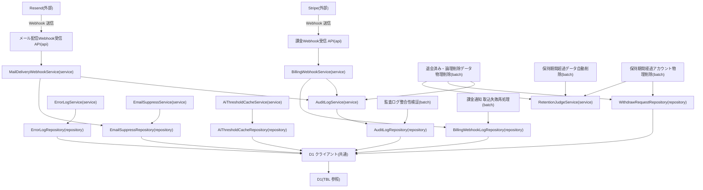

# MOD-011: platform(共通基盤) モジュール構造

> **本構造図は「監査ログ記録・エラーログ記録・メールサプレスリスト管理・外部 Webhook 受信(課金/メール配信)・AI しきい値キャッシュ・保持期間超過データの削除」機能領域のモジュール分割と内向き依存の方向を定義します。**

*種別 モジュール構造図 ・ ステータス ドラフト*

| 項目 | 値 |
|----|----|
| MOD ID | MOD-011 |
| 業務ユースケースID | [UC-047](../../01_requirements/04_business_usecases/UC-047.md#UC-047) ・ [UC-056](../../01_requirements/04_business_usecases/UC-056.md#UC-056) ・ [UC-058](../../01_requirements/04_business_usecases/UC-058.md#UC-058) ・ [UC-065](../../01_requirements/04_business_usecases/UC-065.md#UC-065) ・ [UC-066](../../01_requirements/04_business_usecases/UC-066.md#UC-066) ・ [UC-070](../../01_requirements/04_business_usecases/UC-070.md#UC-070) |
| 関連 API / SYS | [API-059](../../02_basic_design/02_backend/03_apis/API-059.md#API-059) ・ [API-060](../../02_basic_design/02_backend/03_apis/API-060.md#API-060) ・ [SYS-004](../../02_basic_design/02_backend/01_system/SYS-004.md#SYS-004) ・ [SYS-015](../../02_basic_design/02_backend/01_system/SYS-015.md#SYS-015) ・ [SYS-021](../../02_basic_design/02_backend/01_system/SYS-021.md#SYS-021) ・ [SYS-027](../../02_basic_design/02_backend/01_system/SYS-027.md#SYS-027) ・ [SYS-031](../../02_basic_design/02_backend/01_system/SYS-031.md#SYS-031) ・ [SYS-032](../../02_basic_design/02_backend/01_system/SYS-032.md#SYS-032) ・ [SYS-033](../../02_basic_design/02_backend/01_system/SYS-033.md#SYS-033) ・ [SYS-034](../../02_basic_design/02_backend/01_system/SYS-034.md#SYS-034) |
| 関連画面 | — |
| 関連テーブル | [TBL-007](../../02_basic_design/02_backend/04_database/TBL-007.md#TBL-007) ・ [TBL-023](../../02_basic_design/02_backend/04_database/TBL-023.md#TBL-023) ・ [TBL-027](../../02_basic_design/02_backend/04_database/TBL-027.md#TBL-027) ・ [TBL-028](../../02_basic_design/02_backend/04_database/TBL-028.md#TBL-028) ・ [TBL-031](../../02_basic_design/02_backend/04_database/TBL-031.md#TBL-031) ・ [TBL-032](../../02_basic_design/02_backend/04_database/TBL-032.md#TBL-032) |

## 1. 目的

本機能領域は、他の機能領域から横断的に呼び出される共通基盤(監査ログ記録・エラーログ記録・メールサプレスリスト管理)と、外部からの受動的な連携窓口(課金プロバイダ Webhook 受信・メール配信状態 Webhook 受信)、およびシステム内部の横断的な非機能処理(AI しきい値キャッシュの照会・保持期間超過データの日次削除)を担う実装単位を定義する。モジュール分割は Next.js on Cloudflare の物理配置(`lib/service`・`lib/repository`・`app/api`・`workers/cron`)へ写像し、依存は内向き(api → service → repository)に統一する。監査ログ記録(`AuditLogService`/`AuditLogRepository`)は本機能領域内の Webhook 取込系サービス(M-08・M-11)および削除系バッチ(M-14)から共通利用される横断コンポーネントである。

## 2. モジュール一覧

本機能領域を構成するモジュールを物理配置・種別・責務・入出力で一覧化する。監査ログ・エラーログ・メールサプレスは横断コンポーネントとして api を持たず、呼び出し元(他モジュールの service)から直接利用される。

| モジュールID | モジュール名 | 種別 | 責務 | 主な入力 | 主な出力 |
|----|----|----|----|----|----|
| M-01 | `lib/service/platform/audit-log`(`AuditLogService`) | service | 呼び出し元から受け取った操作情報から監査ログ 1 行を組み立て、直前行ハッシュとの連鎖を計算して永続化を委譲する横断コンポーネント(本機能領域内の M-08・M-11・M-14 から共通利用) | 呼び出し元からの操作記録要求(プロジェクト ID(任意)・操作者種別・操作者 ID・アクション・対象種別・対象 ID・IP(マスク済)・UA・メタデータ) | 監査ログ記録結果 |
| M-02 | `lib/repository/platform/audit-log`(`AuditLogRepository`) | repository | 監査ログの直前行ハッシュ照会・追記専用永続化を D1 へ行う(`UPDATE`/`DELETE` は行わない) | Service からの照会・記録要求 | 直前行ハッシュ・記録結果([TBL-027](../../02_basic_design/02_backend/04_database/TBL-027.md#TBL-027)) |
| M-03 | `lib/service/platform/error-log`(`ErrorLogService`) | service | サーバーエラー発生時にエラー内容を受け取りエラーログとして記録する | 呼び出し元からのエラー記録要求(プロジェクト ID(任意)・操作者種別/ID(任意)・URL・エラー種別・スタック・発生日時) | エラーログ記録結果 |
| M-04 | `lib/repository/platform/error-log`(`ErrorLogRepository`) | repository | エラーログの永続化を D1 へ行う | Service からの記録要求 | 記録結果([TBL-028](../../02_basic_design/02_backend/04_database/TBL-028.md#TBL-028)) |
| M-05 | `lib/service/platform/email-suppress`(`EmailSuppressService`) | service | メールアドレスのサプレス登録(バウンス/苦情検知契機)・サプレス状態照会・解除を統括する([EIF-003](../06_external_if/EIF-003.md#EIF-003) からの登録要求、[SYS-007](../../02_basic_design/02_backend/01_system/SYS-007.md#SYS-007) からの照会要求を受ける) | サプレス登録/照会/解除要求(メールアドレス・理由) | サプレス状態・登録/解除結果 |
| M-06 | `lib/repository/platform/email-suppress`(`EmailSuppressRepository`) | repository | メール HMAC による一致照会・永久/一時別の抽出、サプレスレコードの登録・解除を D1 へ行う | Service からの照会・登録・解除要求 | 照会結果・登録/解除結果([TBL-007](../../02_basic_design/02_backend/04_database/TBL-007.md#TBL-007)) |
| M-07 | `app/api/webhooks/billing/route.ts` | api | 課金プロバイダ Webhook を受信し署名検証・重複排除のうえ Service へ委譲する([API-060](../../02_basic_design/02_backend/03_apis/API-060.md#API-060)) | HTTP リクエスト(Stripe 署名・通知本文) | Service 呼び出し・HTTP レスポンス(200/401) |
| M-08 | `lib/service/platform/billing-webhook`(`BillingWebhookService`) | service | 課金プロバイダ通知の検証結果に応じて受信ログを記録し、課金アカウント・サブスクリプション・請求書の状態へ反映する([SYS-004](../../02_basic_design/02_backend/01_system/SYS-004.md#SYS-004)) | 検証済み通知(イベント種別・ペイロード) | 反映結果・取込状態 |
| M-09 | `lib/repository/platform/billing-webhook`(`BillingWebhookLogRepository`) | repository | 課金 Webhook 受信ログ(冪等キー `(provider, event_id)`)の照会・記録・状態更新を D1 へ行う | Service からの照会・記録・更新要求 | 受信ログ取得/更新結果([TBL-032](../../02_basic_design/02_backend/04_database/TBL-032.md#TBL-032)) |
| M-10 | `app/api/webhooks/resend/route.ts` | api | メール配信事業者 Webhook を受信し署名検証のうえ Service へ委譲する([API-059](../../02_basic_design/02_backend/03_apis/API-059.md#API-059)) | HTTP リクエスト(Resend 署名・通知本文) | Service 呼び出し・HTTP レスポンス(200/401) |
| M-11 | `lib/service/platform/mail-delivery-webhook`(`MailDeliveryWebhookService`) | service | メール配信状態通知(配信成功/バウンス/苦情)を判定し配信状態を反映、必要に応じて M-05 サプレスサービスへ登録を委譲する([SYS-021](../../02_basic_design/02_backend/01_system/SYS-021.md#SYS-021)) | 検証済み通知(イベント種別・宛先・メッセージ ID) | 配信状態反映結果 |
| M-12 | `lib/service/platform/ai-threshold-cache`(`AiThresholdCacheService`) | service | プロジェクト単位 AI しきい値設定の照会・登録・更新・削除の伝播を統括し、未登録/取得不能時はグローバル既定へのフォールバックをアラート通知とともに確定する([SYS-015](../../02_basic_design/02_backend/01_system/SYS-015.md#SYS-015)) | しきい値照会/変更要求(対象プロジェクト) | しきい値解決結果(設定値 / グローバル既定フォールバック) |
| M-13 | `lib/repository/platform/ai-threshold-cache`(`AiThresholdCacheRepository`) | repository | プロジェクト単位 AI しきい値設定値の照会・登録・更新・削除を D1 へ行う | Service からの照会・更新要求 | しきい値設定の取得/更新結果([TBL-031](../../02_basic_design/02_backend/04_database/TBL-031.md#TBL-031)) |
| M-14 | `workers/cron/withdrawn-data-purge`(退会済み・論理削除データの物理削除) | batch | 退会済みアカウントの運用データと論理削除確定後の猶予期間経過行を依存順(子→親)に物理削除し監査記録を残す([SYS-027](../../02_basic_design/02_backend/01_system/SYS-027.md#SYS-027) ・ [BAT-009](../05_batch/BAT-009.md#BAT-009)) | Cron Triggers 起動 | 削除実行結果・監査記録 |
| M-15 | `workers/cron/audit-log-integrity-check`(監査ログ整合性検証) | batch | 監査ログ全件を走査しハッシュ連鎖を再計算・突合して違反対象を検出し担当者へ通知する([SYS-031](../../02_basic_design/02_backend/01_system/SYS-031.md#SYS-031) ・ [BAT-010](../05_batch/BAT-010.md#BAT-010)) | Cron Triggers 起動 | 検証結果・アラート通知 |
| M-16 | `workers/cron/retention-expired-purge`(保持期間超過データの自動削除) | batch | 保持期間を超過した質問ログ・未解決質問・通知ログ・お知らせ受信箱を抽出し論理削除または物理削除する([SYS-032](../../02_basic_design/02_backend/01_system/SYS-032.md#SYS-032) ・ [BAT-011](../05_batch/BAT-011.md#BAT-011)) | Cron Triggers 起動 | 削除実行結果 |
| M-17 | `workers/cron/billing-webhook-retry`(課金通知 取込失敗の再処理) | batch | 取込失敗として記録された課金 Webhook 受信ログを定期スケジュールで拾い直し再取込・再反映し、上限到達分を運用者へエスカレーションする([SYS-033](../../02_basic_design/02_backend/01_system/SYS-033.md#SYS-033) ・ [BAT-012](../05_batch/BAT-012.md#BAT-012)) | Cron Triggers 起動 | 再取込結果・エスカレーション通知 |
| M-18 | `workers/cron/withdrawn-account-purge`(保持期間経過アカウントの物理削除) | batch | 退会から保持期間を経過した課金アカウントの課金・請求・認証従属データを依存順に物理削除しアカウントをトムストーンへ移行する([SYS-034](../../02_basic_design/02_backend/01_system/SYS-034.md#SYS-034) ・ [BAT-013](../05_batch/BAT-013.md#BAT-013)) | Cron Triggers 起動 | 削除実行結果・トムストーン移行結果 |
| M-19 | `lib/service/platform/retention-judge`(`RetentionJudgeService`) | service | テーブル種別ごとの起算点(`deleted_at` / `valid=0` 確定時刻 / `created_at`)を判定し、保持期間・猶予期間との比較により削除対象を確定する共通判定ロジック(M-14・M-16・M-18 が共通利用・[IPO-010](../04_ipo/IPO-010.md#IPO-010)) | 対象テーブル・対象行 | 削除対象(論理削除対象 / 物理削除対象)/ 対象外の判定結果 |
| M-20 | `lib/repository/platform/withdraw-request`(`WithdrawRequestRepository`) | repository | 退会実行記録(削除予定日を含む)の照会を D1 へ行う(記録の追記自体は [MOD-003](MOD-003.md#MOD-003) が担う) | M-14・M-18 からの照会要求 | 退会記録取得結果([TBL-023](../../02_basic_design/02_backend/04_database/TBL-023.md#TBL-023)) |
| M-21 | `lib/db`(D1 クライアント) | 共通 | D1 への接続・トランザクション境界の提供。Repository のみが利用する | Repository からのクエリ・Tx 要求 | D1 実行結果 |

## 3. モジュール構造図

モジュール間の依存を内向き(上位 → 下位)で示す。外部連携(Stripe/Resend)は Webhook 受信 api から独立ノードとして分離し、削除系バッチは共通判定ロジック(M-19)を介して各リポジトリへ依存する。

## 4. 依存関係一覧

呼び出し元・呼び出し先の依存を、同期/非同期の別と用途で一覧化する。非同期は写像先(Cron Triggers 起動)を明示する。

| 呼び出し元 | 呼び出し先 | 用途 | 同期/非同期 | 備考 |
|----|----|----|----|----|
| Stripe(外部) | M-07 課金Webhook受信 API | 決済・課金状態通知の送信 | 同期(HTTPS Webhook) | 連携仕様は [EIF-002](../06_external_if/EIF-002.md#EIF-002) |
| Resend(外部) | M-10 メール配信Webhook受信 API | 配信状態通知の送信 | 同期(HTTPS Webhook) | 連携仕様は [EIF-003](../06_external_if/EIF-003.md#EIF-003) |
| M-07 課金Webhook受信 API | M-08 BillingWebhookService | 署名検証済み通知の取込委譲 | 同期 | 署名検証失敗は 401 で即応答([API-060](../../02_basic_design/02_backend/03_apis/API-060.md#API-060)) |
| M-10 メール配信Webhook受信 API | M-11 MailDeliveryWebhookService | 署名検証済み通知の反映委譲 | 同期 | 署名検証失敗は 401 で即応答([API-059](../../02_basic_design/02_backend/03_apis/API-059.md#API-059)) |
| M-08 BillingWebhookService | M-09 課金Webhookログリポジトリ | 冪等キー `(provider, event_id)` による重複判定・受信ログ記録/状態更新 | 同期 | [TBL-032](../../02_basic_design/02_backend/04_database/TBL-032.md#TBL-032) |
| M-08 BillingWebhookService | M-01 AuditLogService | 課金状態反映の監査ログ記録 | 同期 | — |
| M-11 MailDeliveryWebhookService | M-06 メールサプレスリポジトリ | バウンス/苦情検知時のサプレス登録・更新 | 同期 | [TBL-007](../../02_basic_design/02_backend/04_database/TBL-007.md#TBL-007) |
| M-11 MailDeliveryWebhookService | M-01 AuditLogService | 配信状態反映の監査ログ記録 | 同期 | — |
| 他機能領域の Service | M-03 ErrorLogService | サーバーエラー発生時のエラーログ記録委譲 | 同期 | — |
| M-01 AuditLogService | M-02 監査ログリポジトリ | 直前行ハッシュ照会・追記専用永続化 | 同期 | ハッシュ連鎖の正規化仕様は [IPO-009](../04_ipo/IPO-009.md#IPO-009) と同一仕様を用いる |
| M-03 ErrorLogService | M-04 エラーログリポジトリ | エラーログの永続化 | 同期 | [TBL-028](../../02_basic_design/02_backend/04_database/TBL-028.md#TBL-028) |
| M-05 EmailSuppressService | M-06 メールサプレスリポジトリ | サプレス登録/照会/解除 | 同期 | [SYS-007](../../02_basic_design/02_backend/01_system/SYS-007.md#SYS-007) からの送信抑制照会にも用いる |
| M-12 AiThresholdCacheService | M-13 AIしきい値キャッシュリポジトリ | プロジェクト設定しきい値の照会・登録・更新・削除 | 同期 | 未登録/取得不能時のグローバル既定フォールバックは M-12 が確定。値の正本は [システム仕様書 §1](../../02_basic_design/07_system-spec.md#1-aiしきい値) |
| M-12 AiThresholdCacheService | [MOD-001](MOD-001.md#MOD-001) M-04 AnswerService | しきい値解決結果の提供(推論時の照会経路) | 同期 | [MOD-001](MOD-001.md#MOD-001) M-11 は本モジュールの M-13 と同一 Repository を指す |
| M-02〜M-06・M-09・M-13・M-20 各リポジトリ | M-21 D1 クライアント | クエリ実行・トランザクション境界 | 同期 | Repository のみが D1 を利用(内向き依存) |
| M-14 退会済み・論理削除データ物理削除 | M-19 RetentionJudgeService | 削除対象か否かの判定 | 同期 | 判定ロジックは [IPO-010](../04_ipo/IPO-010.md#IPO-010) |
| M-14 退会済み・論理削除データ物理削除 | M-20 退会記録リポジトリ | 削除予定日の照会 | 同期 | [TBL-023](../../02_basic_design/02_backend/04_database/TBL-023.md#TBL-023) |
| M-14 退会済み・論理削除データ物理削除 | M-01 AuditLogService | 削除内容の監査記録 | 同期 | [BAT-009](../05_batch/BAT-009.md#BAT-009) |
| M-15 監査ログ整合性検証 | M-02 監査ログリポジトリ | 監査ログ全件の走査・突合 | 同期 | 検証アルゴリズムは [IPO-009](../04_ipo/IPO-009.md#IPO-009)。読み取りのみで監査ログを変更しない |
| M-16 保持期間超過データ自動削除 | M-19 RetentionJudgeService | 削除対象か否かの判定 | 同期 | [BAT-011](../05_batch/BAT-011.md#BAT-011) |
| M-17 課金通知 取込失敗再処理 | M-09 課金Webhookログリポジトリ | 取込失敗(`status = 'failed'`)受信ログの拾い直し・再取込・状態更新 | 同期 | [BAT-012](../05_batch/BAT-012.md#BAT-012) |
| M-18 保持期間経過アカウント物理削除 | M-19 RetentionJudgeService | 削除対象か否かの判定 | 同期 | [BAT-013](../05_batch/BAT-013.md#BAT-013) |
| M-18 保持期間経過アカウント物理削除 | M-20 退会記録リポジトリ | 退会日時起点の保持期間経過判定に用いる削除予定日の照会 | 同期 | [TBL-023](../../02_basic_design/02_backend/04_database/TBL-023.md#TBL-023) |
| Cloudflare Cron Triggers | M-14・M-15・M-16・M-17・M-18 各バッチ | 定期起動 | 非同期(Cron Triggers 起動) | 起動タイミングは各 BAT を参照 |

## 5. モジュール別処理概要

各モジュールの処理概要と例外処理の方針を示す。実装コード本文・SQL 本文は書かない。しきい値・保持期間・猶予期間の具体値は正本へ委ねる。

| モジュール | 処理概要 | 例外処理 | 備考 |
|----|----|----|----|
| M-01 AuditLogService | 呼び出し元の操作情報から監査ログ 1 行を組み立て、直前行ハッシュ(先頭行は固定シード)との連鎖を計算し永続化を委譲する | — | ハッシュ生成の正規化仕様は [IPO-009](../04_ipo/IPO-009.md#IPO-009) `## 4.` No.2・No.3 と同一。書込み側・検証側の不一致は全件偽陽性の原因となるため整合させる |
| M-03 ErrorLogService | サーバーエラー発生時にエラー内容(URL・種別・スタック・発生日時)を受け取り記録する | 記録自体の失敗は元の処理継続を妨げない(ベストエフォート記録) | [TBL-028](../../02_basic_design/02_backend/04_database/TBL-028.md#TBL-028) |
| M-05 EmailSuppressService | バウンス・苦情検知契機のサプレス登録、送信前のサプレス状態照会、個別解除を統括する | 登録済みメールアドレスへの重複登録は冪等に吸収 | 理由区分・永久/一時の意味は [TBL-007 §コード値・区分値](../../02_basic_design/02_backend/04_database/TBL-007.md#TBL-007) |
| M-08 BillingWebhookService | 署名検証済み通知のイベント種別を判定し、課金アカウント・サブスクリプション・請求書の状態へ反映、受信ログへ取込状態を記録する | 反映失敗は受信ログを `failed` として記録し再処理対象とする([BAT-012](../05_batch/BAT-012.md#BAT-012) が拾う) | 冪等キーは `(provider, event_id)`。反映対象イベント種別は [API-060 §列挙値](../../02_basic_design/02_backend/03_apis/API-060.md#API-060) が正本 |
| M-11 MailDeliveryWebhookService | 配信成功/バウンス/苦情のイベント種別を判定し配信状態を反映、バウンス/苦情検知時は EmailSuppressService へ登録を委譲する | 未知のイベント種別は状態反映なしで冪等に応答 | [SYS-021](../../02_basic_design/02_backend/01_system/SYS-021.md#SYS-021) |
| M-12 AiThresholdCacheService | プロジェクト単位しきい値設定の照会・登録・更新・削除を伝播し、未登録/取得不能時はグローバル既定へフォールバックしてアラート通知する | 取得不能時はエラーとせずグローバル既定で推論を継続しアラート通知 | フォールバック方針・伝播タイミングは [SYS-015](../../02_basic_design/02_backend/01_system/SYS-015.md#SYS-015) |
| M-14・M-16・M-18 削除系バッチ | 対象範囲(退会済み運用データ / ログ系保持期間 / 退会アカウント課金・請求・認証)を走査し RetentionJudgeService の判定結果に従って依存順(子→親)に論理削除または物理削除を実行する | 多重起動抑止・長時間ジョブ保護・部分失敗時の扱いは各 BAT を正本とする | [BAT-009](../05_batch/BAT-009.md#BAT-009) ・ [BAT-011](../05_batch/BAT-011.md#BAT-011) ・ [BAT-013](../05_batch/BAT-013.md#BAT-013) |
| M-15 監査ログ整合性検証 | 監査ログ全件を作成日時昇順で走査し `row_hash`/`prev_hash` を再計算・突合、不一致を違反対象として検出し担当者へアラート通知する | 不一致検出時も走査を中断せず継続 | [IPO-009](../04_ipo/IPO-009.md#IPO-009) ・ [BAT-010](../05_batch/BAT-010.md#BAT-010) |
| M-17 課金通知 取込失敗再処理 | 取込失敗として記録された受信ログを定期スケジュールで拾い直し再取込・再反映し、成功分は取込完了へ更新、上限回数到達分は運用者エスカレーションする | 再処理を繰り返しても成功しない場合は上限回数でエスカレーションへ切替 | [BAT-012](../05_batch/BAT-012.md#BAT-012) |
| M-19 RetentionJudgeService | 対象テーブルの論理削除列の持ち方(`deleted_at` / `valid` / 追記専用)で起算点を判定し、区分別の保持期間・猶予期間との経過日数比較により削除対象を確定する | 課金・請求関連データおよび `M_USER` は退会運用データ削除・ログ系保持期間削除の対象から除外 | [IPO-010](../04_ipo/IPO-010.md#IPO-010)。保持期間・猶予期間の正本は [システム仕様書 §4](../../02_basic_design/07_system-spec.md#4-データ保持期間削除猶予) |

## 6. 後続工程への引き継ぎ事項

実装・テスト設計へ引き継ぐ観点(依存方向の逸脱検出・非同期境界・外部連携の切り離しテスト)を箇条書きで示す。

- 内向き依存の逸脱検証: D1 クライアント(M-21)を利用するのは Repository 群のみで、Service/api から直接 D1 を触らないこと。逆依存(Repository → Service)・循環依存が生じていないこと。
- 横断コンポーネントの単一実装検証: `AuditLogService`(M-01)/`AuditLogRepository`(M-02)を本機能領域内の M-08・M-11・M-14 が同一インスタンス相当として共用し、重複実装しないこと。[MOD-003](MOD-003.md#MOD-003) M-12/M-19・[MOD-005](MOD-005.md#MOD-005) M-17 が別に定義する同名コンポーネントとの集約要否は未整理であり、後続で解消すること。
- ハッシュ連鎖の書込み/検証整合: 監査ログ書込み側(M-01)のハッシュ生成が、検証バッチ(M-15・[IPO-009](../04_ipo/IPO-009.md#IPO-009))と同一の正規化項目順序・固定シード値を用いることの整合確認。
- 外部連携のスタブ化: Stripe/Resend からの Webhook 受信(M-07・M-10)を、署名検証成功/失敗・冪等リプレイの各ケースでスタブ化してテストする分離観点([EIF-002](../06_external_if/EIF-002.md#EIF-002) ・ [EIF-003](../06_external_if/EIF-003.md#EIF-003))。
- 削除系バッチの共通判定ロジック検証: RetentionJudgeService(M-19)を M-14・M-16・M-18 の 3 バッチが共通利用し判定条件の重複定義が生じていないこと([IPO-010](../04_ipo/IPO-010.md#IPO-010))。退会アカウント課金・請求・認証データが M-14・M-16 の削除対象から除外され M-18 のみが扱うことのテストケース化。
- Cron Triggers 起動境界: 多重起動抑止・長時間ジョブ保護・異常終了時の扱いが各 BAT(BAT-009〜013)の定義と一致すること。
- しきい値伝播境界: AiThresholdCacheService(M-12)の伝播結果を [MOD-001](MOD-001.md#MOD-001) の AnswerService が参照する経路(M-12/M-13 と MOD-001 M-11 の対応)が齟齬なく結線されること。