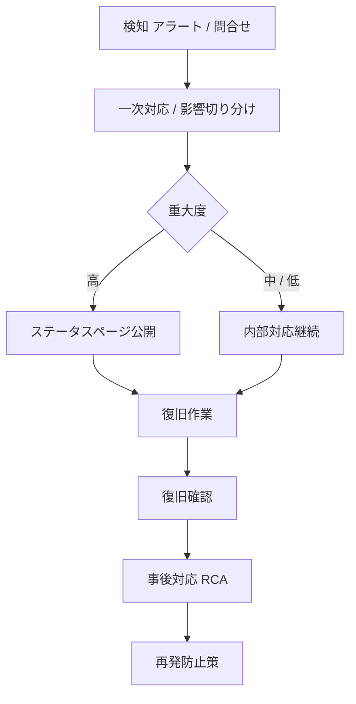

# FAQ AIウィジェット SaaS 運用ドキュメント

| 項目 | 内容 |
|---|---|
| 文書種別 | 運用ドキュメント |
| 版 | v1.0 |
| 対象システム | FAQ AIウィジェット SaaS(open-faq) |
| 作成日 | 2026-05-14 |
| 最終改訂日 | 2026-05-14 |

---

## 0. 位置づけ

本書は、要件定義・基本設計・詳細設計に分散していた運用関連の記載を集約した正本である。各設計書では機能・方式・実装の責務を中心に扱い、監視、障害対応、Runbook、オンコール、デプロイ、バックアップ、ログ管理、SLA / SLO、リリース運用、Future の運用候補は本書で管理する。

## 1. 移管元一覧

| 移管元 | 本書の節 |
|---|---|
| 01_main/01_requirements.md §14 | §2. メインシステム 要件定義由来 |
| 01_main/02_basic_design.md §12 | §3. メインシステム 基本設計由来 |
| 01_main/03_detailed_design.md §16 | §4. メインシステム 監視・アラート詳細由来 |
| 01_main/03_detailed_design.md §18 | §5. メインシステム 移行・リリース詳細由来 |
| 02_admin/01_requirements.md §14 | §6. 顧客管理システム 要件定義由来 |
| 02_admin/02_basic_design.md §12 | §7. 顧客管理システム 基本設計由来 |
| 02_admin/03_detailed_design.md §13 | §8. 顧客管理システム 非機能・運用詳細由来 |
| 02_admin/03_detailed_design.md §18 | §9. 顧客管理システム リリース戦略由来 |
| future_requirements.md §2.6 | §10. Future 要件 運用・SLA・法務候補 |
| future_basic_design.md §1.6 | §11. Future 基本設計 運用・SLA・法務候補 |
| future_detailed_design.md §6 | §12. Future 詳細設計 Runbook 候補 |
| 01_main/01_requirements.md §10.8 | §13. メインシステム 非機能要件 障害対応・運用由来 |
| 02_admin/01_requirements.md §10.8 | §14. 顧客管理システム 非機能要件 障害対応・運用由来 |
| 01_main/02_basic_design.md §11.3 | §15. メインシステム 基本設計 監視・観測性由来 |
| 01_main/02_basic_design.md §11.5 | §16. メインシステム 基本設計 バックアップ・復旧由来 |
| 01_main/02_basic_design.md §11.9 | §17. メインシステム 基本設計 DLQ 運用由来 |
| 01_main/02_basic_design.md §13 | §18. メインシステム 基本設計 リリース戦略由来 |
| 02_admin/02_basic_design.md §8.6 | §19. 顧客管理システム 基本設計 Resend Webhook 監視由来 |
| 02_admin/02_basic_design.md §11.3 | §20. 顧客管理システム 基本設計 監視・観測性由来 |
| 02_admin/02_basic_design.md §11.5 | §21. 顧客管理システム 基本設計 バックアップ・復旧由来 |
| 02_admin/02_basic_design.md §11.9 | §22. 顧客管理システム 基本設計 オンコール SLA 由来 |
| 02_admin/02_basic_design.md §13 | §23. 顧客管理システム 基本設計 リリース戦略由来 |
| future_detailed_design.md §4 | §24. Future 詳細設計 移行・リリース候補 |
| 01_main/01_requirements.md §18 | §25. メインシステム 要件定義 リリース計画由来 |
| 02_admin/01_requirements.md §18 | §26. 顧客管理システム 要件定義 リリース計画由来 |

---

## 2. メインシステム 要件定義由来

> 移管元: 01_main/01_requirements.md §14

### 14. 運用要件

#### 14.1 サービス運営者の主な作業

| 作業 | 内容 |
|---|---|
| 監視 | KPI、エラー率、Queue滞留、通知バウンス・苦情を監視 |
| アラート対応 | しきい値超過時の対応 |
| 障害対応 | 障害発生時の調査、復旧、ステータス公開 |
| バックアップ | 定期バックアップの取得・整合性確認 |
| 監査対応 | 監査ログ参照、外部監査対応 |
| 不正利用対応 | 大量送信、Bot、規約違反の検知と対応 |
| 利用しきい値・課金設定変更対応 | 上限設定や予算アラート設定の変更、解約処理への対応 |
| AI モデル切替時の回帰テスト実施 | 標準テストデータセットに対する回答品質の劣化チェック(FR-059 と整合) |
| オーナー境界によるデータ分離テストの定期実行 | 自動テスト + 年次手動レビュー(AC-017 と整合) |

#### 14.2 障害対応プロセス要件

| 段階 | 要件 |
|---|---|
| 検知 | 自動アラートまたは利用者からの報告で検知できること |
| 一次対応 | 対応着手までの目標時間を定めること |
| 切り分け | 影響範囲(全契約/特定契約/特定機能)を判定できること |
| 復旧 | バックアップ、再起動、デプロイロールバックなどの手段を持つこと |
| 事後対応 | 原因分析、再発防止策の策定、関係者への報告 |
| ステータス公開 | 障害状態を利用者に告知できる手段を用意すること。手段は **公開ステータスページ + 管理画面のお知らせ受信箱(system 種別) + 重大障害時のメール通知** の 3 経路を併用すること。ステータスページは Cloudflare 提供サービスまたは同等の SaaS の利用を可とする(基本設計で確定) |

#### 14.3 サポート対応要件

| 項目 | 要件 |
|---|---|
| 問い合わせ窓口 | 管理者からの問い合わせ窓口を用意すること |
| 対応時間 | サポートは平日9:00〜18:00(JST)にメールおよびチャットで対応すること。土日祝・年末年始は対応外。ただし §6.2.1 区分3(セキュリティインシデント)に該当し §6.2.2 発動条件が成立する場合に限り、運営者の判断で時間外対応を行うこと |
| FAQ/ヘルプ | サービス自身のヘルプドキュメントを整備すること |
| エンドユーザー対応 | エンドユーザーは原則として管理者経由で対応 |

#### 14.4 オンボーディング要件

| 項目 | 要件 |
|---|---|
| 初回登録ガイド | 登録〜FAQ登録〜ウィジェット設置までの初回フローを案内 |
| サンプルFAQ | 検証用サンプルを提供 |
| 設置確認 | 埋め込みコードが正しく動作するか確認できる |

#### 14.5 環境分離・リリース管理

本サービスの実行環境は以下のとおり分離する。本節はメインシステム / 顧客管理システムで対称配置する(両書同一内容)。

| 環境 | Workers / D1 / R2 / KV | データ | デプロイ権限 |
|---|---|---|---|
| dev | 開発者個別 | 合成データ | 全開発者 |
| staging | 共有 | **本番マスキング済みダンプ**(週次更新) | 開発者 |
| prod | 共有 | 本番 | **2 名承認**(GitHub OIDC + Environment Protection Rules) |

- **本番データのマスキング**: メールアドレスは SHA-256 ハッシュ化、氏名・住所はダミー値、本文は先頭 100 文字 + `…` でトリミング
- **本番直接変更**: §6.2.1 緊急区分発動時に限り、対応チケット ID と監査ログ記録を必須とすること(具体記録方法・action コードは詳細設計)
- **マイグレーション**: スキーマバージョン管理を必須とし、ダウンタイム無しのスキーマ変更は **expand/contract 二段階**(まず追加、移行後に削除)で実施(R-013 と整合、採用マイグレーションツールは詳細設計)
- **デプロイ権限**: 本番への書き込み権限(Workers デプロイ、D1 マイグレーション、R2 オブジェクト変更)を持つアカウントを最小化し、定期棚卸しを実施

#### 14.6 テスト戦略

本節はテストの最低要求を定義する。具体ツール選定は基本設計で確定するが、本書では MVP 採用ツールの目安を示す。本節はメインシステム / 顧客管理システムで対称配置する(両書同一内容)。

| 種別 | 範囲 | MVP 採用ツール(目安) | 実施タイミング |
|---|---|---|---|
| ユニットテスト | Workers ハンドラ・ドメインロジック | Vitest | コミット毎 |
| 結合テスト | D1 / R2 / KV を含む | Miniflare + Vitest | PR 毎 |
| E2E テスト(管理画面) | SCR-001〜027 主要フロー | Playwright | nightly + リリース前 |
| E2E テスト(ウィジェット) | 質問送信〜回答〜未解決〜チャット | Playwright | nightly |
| E2E テスト(運営画面) | SCR-090〜097 + 連携 IF #1〜12 | Playwright | nightly |
| 負荷試験 | 100 RPS / 契約 200 / FAQ 1 万 | k6 | 月次 + 主要リリース前 |
| オーナー境界によるデータ分離検証 | クロス契約アクセス試行(自動 50 ケース + 手動 5 ケース) | カスタムスイート | 月次自動 + 年次手動レビュー(AC-017 と整合) |
| AI 品質回帰 | FAQ × 想定質問のペア(MVP **50 組以上**) | カスタムバッチ | モデル更新時・プロンプト変更時 |
| プロンプト注入回帰 | 攻撃 20 ケース以上(役割再定義 / タグ脱出 / コード注入 / 言語切替誘導) | カスタムスイート | 四半期(顧客管理システム FR-063 と整合) |
| ペネトレーションテスト | 全エンドポイント | 外部委託または社内 | MVP リリース前に 1 回以上(AC-017 と整合) |

#### 14.7 契約フロー(申込み・退会・規約改定)

本節は申込みから利用開始、退会、規約改定までの運用フローを定義する。本節はメインシステム / 顧客管理システムで対称配置する(両書同一内容)。

##### 14.7.1 オンボーディング(新規申込み)

| ステップ | 内容 | 関連 FR |
|---|---|---|
| 1 メール仮登録 | 規約・プライバシーポリシー同意取得 | FR-001, FR-002 |
| 2 メール確認 | 24h 確認リンクで本人確認 | FR-003, NFR-401 |
| 3 契約情報入力 | 法人名・所在地・代表者名(任意) | — |
| 4 プロジェクト作成 | プロジェクト名・許可ドメイン設定 | FR-030〜034 |
| 5 FAQ 登録(任意) | サンプル FAQ 取り込みまたは手動 | FR-040, FR-046 |
| 6 ウィジェット設置確認 | 埋込みコード生成 + テスト送信 | FR-150〜159 |
| 7 支払方法登録 | Stripe Checkout でカード/口座登録 | FR-148, FR-136〜139(課金プロバイダ連携) |

- 改正電気通信事業法 外部送信規律: ウィジェット初期表示で利用目的および第三者送信先を明示する(FR-168 と整合)

##### 14.7.2 退会・解約フロー

| ステップ | 内容 | 期間 |
|---|---|---|
| 1 退会申請(SCR-024) | 再認証 → 申請理由(任意)→ 受付 | — |
| 2 解約予告期間 | **当月末まで利用可、月末締めで停止**(予告期間なし) | 月末まで |
| 3 データエクスポート猶予 | 退会確定から **30 日**、SCR-016 から JSON / CSV エクスポート可 | 30 日 |
| 4 論理削除 | `accounts.status=deleted_pending`、ウィジェット停止 | 猶予中 |
| 5 物理削除 | 30 日経過後にバッチで物理削除(NFR-704 と整合) | — |

- **未請求残高(クレジット)返金**: 返金しない旨を利用規約に明記
- **クーリングオフ**: B2B サービスのため特商法適用外(§16.1)。利用規約に明示
- **月途中の日割り**: しない(FR-125 (c))

#### 14.7.3 規約改定フロー

| 項目 | 値 |
|---|---|
| 通知タイミング | 改定発効日の **30 日前** |
| 通知経路 | inbox/announcement(high) + メール + ステータスページ |
| 同意期限 | 発効日 + 14 日(計 44 日の余裕) |
| 同意期限超過時の挙動 | SCR-025 強制割込み。ログイン自体は可能、**機能制限**(FAQ 編集とウィジェット稼働は継続、課金画面操作と新規プロジェクト作成は不可) |
| 段階的実施 | 契約単位で発効日を分散させる(全契約同日強制ではない) |
| 非同意時の挙動 | オーナー / メンバー(ユーザー管理権限保持)が「不同意」を明示した場合は退会フロー(SCR-024)へ誘導 |

#### 14.8 ログ管理要件

| 項目 | 要件 |
|---|---|
| ログレベル | **ERROR / WARN / INFO / DEBUG** の 4 段階。本番は INFO 以上を保管、staging は DEBUG まで保管 |
| ログ保管先 | アプリケーションログはオブジェクトストレージ、構造化検索はクラウドプロバイダの解析エンジン(具体製品名は基本設計参照) |
| ログ形式 | JSON Lines(構造化)。必須フィールド = `timestamp`(ISO 8601 / UTC)、`level`、`owner_account_id`(該当時)、`request_id`、`actor_account_id`(該当時)、`action`(監査ログのみ)、`message` |
| 保持期間 | アプリケーションログ = 90 日(R2)、エラーログ = 180 日(NFR-704 と整合)、監査ログ = NFR-602a / NFR-602b に従う |
| PII 含有禁止 | FR-114 と整合。エンドユーザー入力は先頭 100 文字 + ハッシュのみ、認証情報・カード情報・トークンは絶対に含めない |
| 検索性能 | 1 契約 7 日分のログ検索を 30 秒以内(管理画面の運営者用ログビューア)。それ以上は非同期エクスポート |
| ローテーション | R2 オブジェクトは日次でローテーション(`logs/YYYY/MM/DD/<service>.jsonl.gz`) |

#### 14.9 オンコール体制

| 項目 | 要件 |
|---|---|
| MVP 体制 | 運営者 1 名(オンコール 24/7)。PagerDuty で受信、平日昼帯(9:00〜18:00 JST)は日中業務として一次受け、夜間 / 休日は PagerDuty オンコールで対応 |
| エスカレーション層 | (一次)オンコール運営者 → (二次)PO + 開発リード → (三次)経営層。NFR-804 の重要度別ルーティング(normal = Slack のみ / high = Slack + メール / critical = PagerDuty 即時 + オンコール 1 名)に従う |
| Runbook | 次の項目を必須整備: (a) 障害種別ごとの一次切り分け手順、(b) 主要アラート(NFR-804 (a)〜(i))ごとの即応手順、(c) 連絡先一覧、(d) 過去の重大障害の RCA |
| 復旧訓練 | 年 1 回以上の本番障害訓練(NFR-803 のバックアップ復旧訓練と並行実施)。訓練結果はオンコール体制に反映 |

---

---

## 3. メインシステム 基本設計由来

> 移管元: 01_main/02_basic_design.md §12

### 12. 運用設計概要

#### 12.1 運用作業一覧

| 作業 | 頻度 | 内容 |
|---|---|---|
| 監視 | 常時 | KPI、アラート対応(NFR-804 9 項目) |
| デプロイ | 適時 | 段階的リリース、ロールバック、2 名承認 |
| バックアップ確認 | 日次 | R2 上のエクスポート復元テスト、整合性確認 |
| 退会処理 | 自動 + 確認 | 猶予期間後の物理削除 |
| 利用しきい値・課金設定変更対応 | 適時 | 上限設定や予算アラート設定の変更 |
| 定期削除 | 日次 | 保持期間超過データ削除 |
| **AI しきい値 fallback 検知通知** | 自動 | KV 失効時 → 連携 IF #6 失敗時の運営者通知運用(FR-341) |
| **tombstone バッチ** | 日次 | NFR-602a / b / d 保持期間経過時の tombstone 化(§10.6.3) |
| **自動クローズ 6 段階バッチ** | 5 分間隔 | `chat_rooms.reminder_state` を評価(FR-089 / §6.2.6) |
| **`pending_close` 7 日リマインド** | 日次 | admin への inbox(system / normal)送信 |
| **永久保持フェイルセーフ** | 日次 | `case_status=open/pending_close` のまま 730 日経過 → 強制 `closed`(NFR-706) |
| **月次集計バッチ** | 月次(UTC 15:00) | 契約利用量集計、`usage_metering` 更新 |
| **月次確定 cron** | 月次(JST 02:00) | 請求書発行、idempotent key `(owner_account_id, billing_year_month)`(FR-148) |
| **トライアル終了判定** | 日次(JST 00:00) | `trial_ends_at` 経過 + 支払方法未登録で自動サスペンション(FR-129) |
| **監査ログ完全性検証** | 日次(JST 03:00) | ハッシュチェーン再計算、不整合検出時 critical アラート(NFR-602c / NFR-604) |
| 監査対応 | 適時 | 監査ログ抽出 |
| 不正利用対応 | 適時 | 検知・調査・対処(FR-195) |
| AI モデル切替時の回帰テスト | モデル更新時 | 標準テストデータセットに対する回答品質劣化チェック(FR-059 / §6.4.5) |
| オーナー境界によるデータ分離テスト | 月次自動 + 年次手動 | クロス契約アクセス試行(AC-017 / §14.3) |

#### 12.2 障害対応プロセス



| 段階 | 要件 |
|---|---|
| 検知 | 自動アラート(NFR-804)または利用者からの報告で検知 |
| 一次対応 | 対応着手までの目標時間を定める(オンコール体制 §12.6) |
| 切り分け | 影響範囲(全契約 / 特定契約 / 特定機能)を判定 |
| 復旧 | バックアップ、再起動、デプロイロールバックなどの手段を持つ |
| 事後対応 | 原因分析、再発防止策の策定、関係者への報告 |
| ステータス公開 | §12.8 障害告知 3 経路 |

#### 12.3 リリースプロセス

| 段階 | 内容 |
|---|---|
| 開発(dev) | feature branch + PR、開発者個別の dev 環境(合成データ) |
| レビュー | コードレビュー、テスト追加、§14 テスト戦略に従う |
| ステージング(staging) | E2E、回帰テスト、本番マスキング済みダンプ週次更新 |
| カナリア | 一部トラフィックでリリース |
| 本番展開(prod) | **2 名承認**(GitHub OIDC + Environment Protection Rules、要件 §14.5) |
| ロールバック | 不具合検知時に直前バージョンへ戻す |
| 本番直接変更 | 緊急時のみ運営者の対応チケット ID 必須、全クエリを監査ログに記録(`db.query.execute`、§10.6.5) |
| マイグレーション | **expand/contract 二段階**(まず追加、移行後に削除)で実施、ダウンタイムゼロ(R-013) |

#### 12.4 監視ダッシュボード(運営者向け)

| 指標 | 内容 |
|---|---|
| 稼働状態 | サービス稼働状況 |
| API 成功率 | 5xx 率、4xx 率(NFR-804 (a)) |
| レイテンシ | API 別 p50 / p95(NFR-101〜106) |
| Queue 滞留 | バックログ件数(NFR-804 (c)) |
| 通知配信状況 | 送信数、失敗、バウンス、苦情(NFR-804 (d) (e)) |
| 契約別利用量 | 質問数、チャット数 |
| 不正検知 | 許可ドメイン外、レート超過(FR-195) |
| レート制限上書き状況 | `owner_quota_overrides` の有効件数、しきい値超過契約、有効期限切迫の上書き |
| AI 品質メトリクス | 回答可能率・解決率・矛盾理由コード分布・PII 検出件数(NFR-804 (g)) |
| D1 容量 | NFR-804 (h)、8GB 警告 |
| 連携 IF 状況 | IF #1〜#12 の送受信成功率、DLQ 滞留、リプレイ実行数 |

#### 12.5 ログ管理(参照: 要件 §14.8)

| 項目 | 要件 |
|---|---|
| ログレベル | **ERROR / WARN / INFO / DEBUG** の 4 段階。本番は INFO 以上、staging は DEBUG まで |
| ログ保管先 | アプリケーションログ = R2(Cloudflare Logpush 経由)、構造化検索は Cloudflare Workers Analytics Engine |
| ログ形式 | JSON Lines(構造化)。必須フィールド = `timestamp`(ISO 8601 / UTC)、`level`、`owner_account_id`(該当時)、`request_id`、`actor_account_id`(該当時)、`action`(監査ログのみ)、`message` |
| 保持期間 | アプリケーションログ = **90 日**(R2)、エラーログ = **180 日**(NFR-704)、監査ログ = NFR-602a / NFR-602b / NFR-602d に従う |
| PII 含有禁止 | FR-114 と整合。エンドユーザー入力は先頭 100 文字 + ハッシュのみ、認証情報・カード情報・トークンは絶対に含めない |
| 検索性能 | 1 契約 7 日分のログ検索を **30 秒以内**(管理画面の運営者用ログビューア)。それ以上は非同期エクスポート |
| ローテーション | R2 オブジェクトは日次でローテーション(`logs/YYYY/MM/DD/<service>.jsonl.gz`) |

#### 12.6 オンコール体制(参照: 要件 §14.9)

| 項目 | 要件 |
|---|---|
| 体制 | 運営者 **1 名(オンコール 24/7)**。PagerDuty で受信、平日昼帯(9:00〜18:00 JST)は日中業務、夜間 / 休日は PagerDuty オンコール |
| エスカレーション層 | (一次)オンコール運営者 → (二次)PO + 開発リード → (三次)経営層。NFR-804 重要度別ルーティング |
| Runbook | (a) 障害種別ごとの一次切り分け手順、(b) 主要アラート(NFR-804 (a)〜(i))ごとの即応手順、(c) 連絡先一覧、(d) 過去の重大障害の RCA |
| 復旧訓練 | 年 1 回以上の本番障害訓練(NFR-803 のバックアップ復旧訓練と並行実施) |

#### 12.7 環境分離・本番直接変更(参照: 要件 §14.5)

§2.5 の補足として、本節では運用の詳細を定義する。

| 観点 | 仕様 |
|---|---|
| 本番データのマスキング | メールアドレスは SHA-256 ハッシュ化、氏名・住所はダミー値、本文は先頭 100 文字 + `…` でトリミング |
| 本番直接変更 | 緊急時のみ運営者の対応チケット ID 必須、全クエリを監査ログに記録(`db.query.execute` action コード、§10.6.5) |
| マイグレーション | Wrangler D1 migrations を採用、スキーマバージョン管理必須、expand/contract 二段階 |
| デプロイ権限 | 本番への書き込み権限(Workers デプロイ、D1 マイグレーション、R2 オブジェクト変更)を持つアカウントを最小化、定期棚卸し |
| DB 操作者ロール | NFR-319 補完策に従い 2 名以下に限定、月次棚卸しで PO 承認 |

#### 12.8 障害対応の 3 経路告知(参照: 要件 §14.2)

| 経路 | 用途 |
|---|---|
| 公開ステータスページ | サービス全体の稼働状況。**Cloudflare 提供サービスまたは同等の SaaS** を採用(具体選定は基本設計で確定、本書 v2.0 では Cloudflare Status Page を MVP 採用とする) |
| 管理画面のお知らせ受信箱(system 種別) | オーナー / メンバー(ユーザー管理権限保持)向けの個別通知 |
| 重大障害時のメール通知 | 全オーナー / メンバー(ユーザー管理権限保持)・運営者へ |

3 経路を併用し、重大障害(`critical` 重要度)時には全経路を活用する。インシデント自動生成は NFR-804 critical アラートと連動。

---

---

## 4. メインシステム 監視・アラート詳細由来

> 移管元: 01_main/03_detailed_design.md §16

### 16. 監視・アラート設計

#### 16.1 SLO 目標再掲

§13.2.1 と同じ。

#### 16.2 KPI 監視 9 項目

| KPI | しきい値 | 通知先 | 重要度 |
|-----|---------|-------|--------|
| (a) 契約別 5xx 率 | > 1% (5 分窓) | Slack `#ops-warn` | normal |
| (b) AI 推論 p95 | > 2.5s | Slack `#ops-warn` | normal |
| (b') AI 推論 p95 | > 5s | PagerDuty | high |
| (c) Queue DLQ 滞留 | > 100 件 | PagerDuty | high |
| (d) 通知バウンス率 | > 5% (1h) | Slack + メール | normal |
| (e) 通知苦情率 | > 0.1% (1h) | PagerDuty | high |
| (f) 課金 Webhook 失敗 | 連続 3 件 | PagerDuty | critical |
| (g) AI 回答可能率 | 直前比 -5pt | Slack `#ai-quality` | high |
| (h) D1 容量 | > 80% (8GB) | Slack `#ops-warn` | normal |

#### 16.3 エスカレーション 3 段階

| 重要度 | 通知方法 | 一次対応 |
|-------|---------|---------|
| normal | Slack #ops-warn | 営業時間内対応 |
| high | Slack + メール（オンコール宛） | 30 分以内対応 |
| critical | PagerDuty 即時 + 電話 | 15 分以内対応 |

##### 16.3.1 エスカレーションパス (意思決定責任者)

未対応時間が一定を超えた場合、自動でエスカレーション。PagerDuty の Escalation Policy で実装。

```text
critical 検知
   ↓ 即時
   on-call (第 1 階層) 個人携帯 + PagerDuty
   ↓ 15 分未対応 / 拒否
   on-call backup (第 2 階層) 個人携帯
   ↓ さらに 15 分未対応
   on-call manager (第 3 階層) + 経営陣 (CTO / SRE Lead)
   ↓ さらに 30 分未対応
   全社オンコール (Slack #incident-all-hands) + 外部監視ベンダー連絡

high 検知
   ↓ 即時
   on-call (第 1 階層) Slack + メール
   ↓ 30 分未対応
   on-call backup + on-call manager
   ↓ さらに 60 分未対応
   経営陣エスカレーション
```

| 階層 | 役割 | 意思決定責任 |
|---|---|---|
| 第 1 階層 (on-call) | 一次切り分け / runbook 実行 | 5 分以内に Ack、原因切り分け開始 |
| 第 2 階層 (on-call backup) | 第 1 階層が応答しない場合の代替 | 同上 (一次対応の継続) |
| 第 3 階層 (on-call manager) | リソース調整 / 外部連絡可否 | サービス縮退 / 計画停止判断、契約周知の判断 |
| 経営陣 (CTO / SRE Lead) | 重大インシデント対応・ステークホルダー報告 | データ損失リスク評価、顧客告知のトーン決定 |

- **手順書**: PagerDuty の Escalation Policy 設定は `infra/pagerduty/escalation-policy.tf` (Terraform) で IaC 化し、MVP 環境へ適用する。
- **重要度の昇格基準**: high が 90 分継続 → critical に手動昇格 (on-call manager の判断)
- **回復通知**: 解決時は同一チャネルに `RESOLVED:` プレフィクス付きで告知、`incident-id` で紐付け

#### 16.4 ログ retention 整合性検証

ログ種別ごとに retention が異なるため (`question_logs` 1 年 / `error_logs` 180 日 / `audit_logs` 1y/5y/7y 区分)、削除タイミング不整合が検知できるよう **retention purge cron が両者を同期削除**し、不整合検知時にアラート発火する。

- **同期削除**: §14.1.9 `retentionCleanup` で `question_logs` / `chat_messages` / `notification_logs` / `error_logs` / `access_tokens` を同一ジョブ内で削除 (1 transaction)
- **不整合検知バッチ**: 日次 JST 04:30 `RetentionConsistencyChecker` (新設):
  - `question_logs` 中で 365 日超過の行が残っていないか
  - `error_logs` 中で 180 日超過の行が残っていないか
  - `chat_rooms` (1 年) と `chat_messages` (孤児チェック) の親子整合
  - `audit_logs` の `retention_class='1y'` で 1 年超過行が残っていないか
- **検知時のアクション**: `audit_logs` に `retention.inconsistency.detected` (5y) を記録、`#ops-warn` に normal 重要度で通知、運営者 inbox に詳細
- **テスト**: Integration テストで `it-retention-consistency-001` を整備し、意図的な不整合を検知できることを確認

#### 16.4 ダッシュボード設計

- Grafana（外部）に Cloudflare Workers Analytics + IF #8 メトリクスを集約
- 主要パネル: SLO 達成率 / 5xx 率 / AI p95 / Queue 滞留 / 通知配信率 / DB 容量

#### 16.5 アラートルール定義

Cloudflare Workers Analytics + 外部監視（Datadog 等）でメトリクスを集約。アラートルール例:

```yaml
- alert: TenantErrorRateHigh
  expr: rate(http_requests_total{status=~"5.."}[5m]) / rate(http_requests_total[5m]) > 0.01
  for: 5m
  labels: { severity: normal }
  annotations: { summary: "契約 {{$labels.owner_account_id}} の 5xx 率 > 1%" }

- alert: AiP95Critical
  expr: histogram_quantile(0.95, ai_inference_duration_seconds_bucket) > 5.0
  for: 5m
  labels: { severity: high }
  ...
```

#### 16.6 オンコール体制

NFR-810 に従い、24/7 オンコールを 2 名以上配置。シフトはローテーション。連休前の引継ぎ runbook を整備。

> **関連参照**: 基本設計 §11.3 / NFR-803〜810 / AC-020 / AC-029

---

---

## 5. メインシステム 移行・リリース詳細由来

> 移管元: 01_main/03_detailed_design.md §18

### 18. 移行・リリース設計

#### 18.1 初期リリース

移行データなし（新規 SaaS）。テスト用シードデータのみ。

#### 18.2 MVP リリース判定

| 段階 | 期間 | 対象 | 判定 KPI |
|-----|------|------|---------|
| MVP リリース判定期間 | 4 週間 | 本番環境の招待オーナー / 招待契約 | §18.3 参照 |

#### 18.3 リリース判定 KPI

要件 §13.3 と整合:

- (a) ウィジェット可用性 99.9%
- (b) API 5xx 率 < 0.5%
- (c) AI 推論 p95 < 2.5s
- (d) 通知配信率 > 99%

#### 18.4 デプロイ手順

##### 18.4.1 Cloudflare Workers / Pages

###### 18.4.1.a Wrangler 典型コマンドフロー

D1 マイグレーション新規作成から本番反映までの典型フロー。`forward-only` 原則 (§13.12) を遵守。

```bash
# (1) マイグレーションファイル作成 (連番で命名、シャープ禁止)
wrangler d1 migrations create main-db "0042_add_accounts_timezone_column"
# → migrations/0042_add_accounts_timezone_column.sql が生成される

# (2) ローカル D1 で適用 + 単体テスト
wrangler d1 migrations apply main-db --local
pnpm --filter '@faq-saas/main-api' test

# (3) staging 適用
wrangler d1 migrations apply main-db-staging --remote
pnpm test:integration -- --env=staging

# (4) 本番適用 (PR マージ後 / CI 経由を推奨。手動時は 4-eyes)
wrangler d1 migrations apply main-db-prod --remote

# (5) 適用済確認 (適用済 migration 一覧)
wrangler d1 migrations list main-db-prod --remote

# (6) 単発 SQL 実行 (緊急時のみ。原則 migration ファイル経由)
wrangler d1 execute main-db-prod --remote --command="ANALYZE audit_logs;"

# (7) ロールバック (forward-only のため、新規 migration で前進修正)
wrangler d1 migrations create main-db "0043_rollback_accounts_timezone"
# → 0043 で前進修正の SQL を書き、(1)〜(4) を繰り返す
```

###### 18.4.1.b 通常デプロイ手順

```bash
# 1. D1 マイグレーション (forward-only)
wrangler d1 migrations apply main-db-prod --remote

# 2. Workers デプロイ (順序: shared → consumer/cron → API)
pnpm --filter '@faq-saas/shared' build
pnpm --filter '@faq-saas/queue-consumer' build && cd app/workers/queue-consumer && wrangler deploy --env prod
pnpm --filter '@faq-saas/cron' build && cd app/workers/cron && wrangler deploy --env prod
pnpm --filter '@faq-saas/main-api' build && cd app/workers/main-api && wrangler deploy --env prod
pnpm --filter '@faq-saas/widget-api' build && cd app/workers/widget-api && wrangler deploy --env prod
pnpm --filter '@faq-saas/internal-api' build && cd app/workers/internal-api && wrangler deploy --env prod
pnpm --filter '@faq-saas/webhook' build && cd app/workers/webhook && wrangler deploy --env prod

# 3. Pages デプロイ
pnpm --filter '@faq-saas/admin' build && cd app/admin && wrangler pages deploy dist --project-name=faq-admin-prod
pnpm --filter '@faq-saas/widget' build && cd app/widget && wrangler pages deploy dist --project-name=faq-widget-prod
pnpm --filter '@faq-saas/public' build && cd app/public && wrangler pages deploy dist --project-name=faq-public-prod

# 4. スモークテスト
pnpm test:smoke -- --env=prod
```

##### 18.4.2 シークレットローテーション

```bash
# Master Key 年次ローテーション (§10.9.1 の段階手順を実施)
wrangler secret put MASTER_KEY_NEXT --env prod
# → アプリ側のデュアル読み取り版をデプロイ
# → バックフィルジョブで再暗号化
# → MASTER_KEY を新キーに上書き、旧キーを MASTER_KEY_PREV に
# → 1 年後 MASTER_KEY_PREV 削除
```

#### 18.5 ロールバック手順

マイグレーションは forward-only のため、ロールバックは新規 migration で前進修正。

- アプリレベル: `wrangler rollback` で直前のデプロイにロールバック可能（DB スキーマと不整合な場合は手動修正）
- DB レベル: D1 Time Travel で巻き戻し（最大 30 日）

##### 18.5.1 ロールバック後の状態キャッシュ整合性検証 (runbook RB-008)

`wrangler rollback` はアプリコードを巻き戻すが、**KV / R2 はロールバックされない**。アプリの新版で書き込んだ KV キーや R2 オブジェクトが旧版で解釈できないと、キャッシュ汚染やデータ参照不整合が発生する。

| 領域 | ロールバック影響 | 検証手順 |
|---|---|---|
| **KV 共通キャッシュ** (`project_key:*` / `ai-params:*` 等、TTL 60s 系) | TTL 60s で自然失効するので大局影響なし。ただしロールバック直後 60s は新版で書き込んだ値を旧版が読む可能性 | ロールバック直後に `wrangler kv key delete --binding=KV_CACHE --bulk` で関連プレフィックスを明示削除 (RB-008 §A) |
| **KV 設定キー** (`feature:*` / `ai-cost:unit-prices` 等、永続) | 旧版でフィールドが認識できない場合は default fallback で動作。新フィールド追加なら影響なし、削除なら旧版が undefined を null 扱いするか確認 | RB-008 §B チェックリストで旧版互換性確認 |
| **KV 冪等性ストア** (`idempotency:*` / `webhook:idempotency:*`) | 24 時間〜30 日の TTL で残存、redeploy 後の同一キーで前回結果を返してしまうリスク | rollback 直後 24h 以内に冪等性キャッシュをクリア (RB-008 §C) |
| **R2 オブジェクト** (`audit-archive/*` / `backups/*` / `dlq/*`) | 永続。旧版で書き込み形式が異なると整合性破綻 | R2 lifecycle で新版オブジェクトを識別 (オブジェクト名に YYYY-MM-DD 含む)、ロールバック後は新版書込済オブジェクトを R2 から手動移動 |
| **D1 schema** | Time Travel で 30 日以内に巻き戻し可能。ただし KV / R2 の整合性は別途確認 | `wrangler d1 time-travel restore main-db-prod --timestamp=<rollback時刻>` |

###### ロールバック手順 (高レベル)

```bash
# 1. アプリロールバック
wrangler rollback --env prod  # 直前デプロイへ

# 2. DB schema 影響あれば D1 Time Travel
wrangler d1 time-travel info main-db-prod
wrangler d1 time-travel restore main-db-prod --timestamp=2026-05-13T10:00:00Z

# 3. KV キャッシュクリア (RB-008 §A 関連プレフィックス)
wrangler kv key list --binding=KV_CACHE --prefix=project_key: | xargs -I {} wrangler kv key delete --binding=KV_CACHE {}

# 4. 冪等性キャッシュクリア
wrangler kv key list --binding=KV_CACHE --prefix=idempotency: | xargs ...

# 5. スモークテスト
pnpm test:smoke -- --env=prod

# 6. 監査ログ記録 (4-eyes)
# → audit_logs に prod.rollback (5y 保持) を記録
```

###### 必須事後検証

- D1 スキーマ ↔ アプリコード版整合性 (`wrangler d1 migrations list` の最終 migration がアプリ要求バージョン以下か)
- KV キーカウント (`wrangler kv key list --binding=KV_CACHE | wc -l`) のロールバック前後差分
- R2 オブジェクトリスト (`wrangler r2 object list <bucket>`) の不整合チェック
- スモークテスト全 PASS

##### 18.5.2 API v1 → v2 移行時のクライアント周知

v2 (breaking change) リリース時の **ウィジェット埋込先契約への周知** プロトコル:

| タイミング | チャネル | 内容 |
|---|---|---|
| 60 日前 | 開発者ブログ (`https://docs.example.com/changelog/v2-migration`) | 概要 + 移行ガイド公開 |
| 30 日前 | オーナー / メンバー(ユーザー管理権限保持)宛 **in-app 通知** (重要度 high) | 期限 + 移行リンク + 影響範囲 |
| 30 日前 | メール (オーナー(オーナーアカウント)宛、Resend 送信) | 同上 |
| 7 日前 | オーナー / メンバー(ユーザー管理権限保持)宛 **in-app 通知 (critical)** + メール | 最終警告 |
| 廃止日前日 | オーナー / メンバー(ユーザー管理権限保持)宛 **in-app 通知 (critical)** + メール + ウィジェット側の sentry 風バナー (本番 v1 アクセス時に「24h 後に廃止」表示) | 翌日廃止 |
| 廃止日 | v1 エンドポイントを `410 GONE` で返却 | `Sunset` / `Link` ヘッダで v2 のドキュメント URL を提示 |
| 廃止後 30 日 | v1 ルーティング自体を Worker から削除 | 完全撤去 |

- **テスト**: 移行期間中の v1 / v2 並走を `it-api-v1v2-coexist-001` で検証 (同一エンドポイントへの v1 / v2 リクエストが独立した response schema で返ることを確認)
- **メトリクス**: v1 利用率を `sli_api_v1_usage_rate` で監視 (廃止 7 日前で 10% 未満になっていないとリスケ判断)

#### 18.6 災害復旧手順

§13.6.3 runbook 参照。

#### 18.7 試験データ生成スクリプト

```ts
// scripts/seed-staging.ts
import { D1Database } from '@cloudflare/workers-types';
async function seed(db: D1Database) {
  const ownerAccountId = 'owner_test_001';
  await db.prepare(`INSERT INTO accounts (... oner row attributes ...) VALUES (?1, ...)`).bind(ownerAccountId, ...).run();
  for (let i = 0; i < 100; i++) {
    await db.prepare(`INSERT INTO faqs (...) VALUES (?1, ...)`).bind(...).run();
  }
  // ... 全テーブルにテストデータ投入
}
```

実行: `pnpm tsx scripts/seed-staging.ts --env staging`

> **関連参照**: 基本設計 §13 / §18 / NFR-802 / NFR-803 / AC-029

---

---

## 6. 顧客管理システム 要件定義由来

> 移管元: 02_admin/01_requirements.md §14

### 14. 運用要件

#### 14.1 サービス運営者の主な作業

| 作業 | 内容 |
|---|---|
| 監視 | KPI、エラー率、Queue滞留、通知バウンス・苦情を監視 |
| アラート対応 | しきい値超過時の対応 |
| 障害対応 | 障害発生時の調査、復旧、ステータス公開 |
| バックアップ | 定期バックアップの取得・整合性確認 |
| 監査対応 | 監査ログ参照、外部監査対応 |
| 不正利用対応 | 大量送信、Bot、規約違反の検知と対応 |
| 利用しきい値・課金設定変更対応 | 上限設定や予算アラート設定の変更、解約処理への対応 |

#### 14.2 障害対応プロセス要件

| 段階 | 要件 |
|---|---|
| 検知 | 自動アラートまたは利用者からの報告で検知できること |
| 一次対応 | 対応着手までの目標時間を定めること(NFR-820 で重大度別に SLA 定義: P1=15 分以内アサイン/30 分以内着手、P2=1 時間以内、P3=営業日内) |
| 切り分け | 影響範囲(全契約/特定契約/特定機能)を判定できること。判定手順は §14.8 Runbook で定義 |
| 復旧 | バックアップ、再起動、デプロイロールバックなどの手段を持つこと。デプロイロールバックは **Wrangler 直前バージョンへの即時切替**(p95 5 分以内)、データ復元は §10.8 NFR-803 の RTO 4 時間以内 |
| 事後対応 | 原因分析(ポストモーテム文書)、再発防止策の策定、関係者への報告。重大障害(P1)発生時は 5 営業日以内にポストモーテムを公開すること |
| ステータス公開 | 障害状態を利用者に告知できる手段(ステータスページおよび管理者向けお知らせ受信箱)を用意すること |

#### 14.3 サポート対応要件

| 項目 | 要件 |
|---|---|
| 問い合わせ窓口 | 管理者からの問い合わせ窓口を用意すること |
| 対応時間 | サポートは平日9:00〜18:00(JST)にメールおよびチャットで対応すること |
| FAQ/ヘルプ | サービス自身のヘルプドキュメントを整備すること |
| エンドユーザー対応 | エンドユーザーは原則として管理者経由で対応 |

#### 14.4 オンボーディング要件

| 項目 | 要件 |
|---|---|
| 初回登録ガイド | 登録〜FAQ登録〜ウィジェット設置までの初回フローを案内 |
| サンプルFAQ | 検証用サンプルを提供 |
| 設置確認 | 埋め込みコードが正しく動作するか確認できる |

#### 14.5 環境分離・リリース管理

本サービスの実行環境は以下のとおり分離する。本節はメインシステム §14.5 と完全同一とし、両書で対称配置する。

| 環境 | Workers / D1 / R2 / KV | データ | デプロイ権限 |
|---|---|---|---|
| dev | 開発者個別 | 合成データ | 全開発者 |
| staging | 共有 | **本番マスキング済みダンプ**(週次更新) | 開発者 |
| prod | 共有 | 本番 | **2 名承認**(GitHub OIDC + Environment Protection Rules) |

- **本番データのマスキング**: メールアドレスは SHA-256 ハッシュ化、氏名・住所はダミー値、本文は先頭 100 文字 + `…` でトリミング
- **本番直接変更**: 緊急時のみ運営者の対応チケット ID 必須、全クエリを監査ログに記録(FR-229 と整合)
- **マイグレーション**: Wrangler D1 migrations、ダウンタイム無しのスキーマ変更は **expand/contract 二段階**
- **デプロイ権限**: 本番への書き込み権限を持つアカウントを最小化し、定期棚卸しを実施

#### 14.6 テスト戦略

本節はテストの最低要求を定義する。本節はメインシステム §14.6 と完全同一とし、両書で対称配置する。

| 種別 | 範囲 | MVP 採用ツール(目安) | 実施タイミング |
|---|---|---|---|
| ユニットテスト | Workers ハンドラ・ドメインロジック | Vitest | コミット毎 |
| 結合テスト | D1 / R2 / KV を含む | Miniflare + Vitest | PR 毎 |
| E2E テスト(管理画面) | SCR-001〜027 主要フロー | Playwright | nightly + リリース前 |
| E2E テスト(ウィジェット) | 質問送信〜回答〜未解決〜チャット | Playwright | nightly |
| E2E テスト(運営画面) | SCR-090〜097 + 連携 IF #1〜12 | Playwright | nightly |
| 負荷試験 | 100 RPS / 契約 200 / FAQ 1 万 | k6 | 月次 + 主要リリース前 |
| オーナー境界によるデータ分離検証 | クロス契約アクセス試行(自動 50 + 手動 5) | カスタムスイート | 月次自動 + 年次手動レビュー |
| AI 品質回帰 | FAQ × 想定質問のペア(MVP **50 組以上**) | カスタムバッチ | モデル更新時・プロンプト変更時 |
| プロンプト注入回帰 | 攻撃 20 ケース以上 | カスタムスイート | 四半期(FR-063 と整合) |
| ペネトレーションテスト | 全エンドポイント | 外部委託または社内 | MVP リリース前に 1 回以上 |

#### 14.7 契約フロー(申込み・退会・規約改定)

本節は申込みから利用開始、退会、規約改定までの運用フローを定義する。本節はメインシステム §14.7 と完全同一とし、両書で対称配置する。

##### 14.7.1 オンボーディング(新規申込み)

| ステップ | 内容 | 関連 FR |
|---|---|---|
| 1 メール仮登録 | 規約・プライバシーポリシー同意取得 | FR-001, FR-002 |
| 2 メール確認 | 24h 確認リンクで本人確認 | FR-003, NFR-401 |
| 3 契約情報入力 | 法人名・所在地・代表者名(任意) | — |
| 4 プロジェクト作成 | プロジェクト名・許可ドメイン設定 | FR-030〜034 |
| 5 FAQ 登録(任意) | サンプル FAQ 取り込みまたは手動 | FR-040, FR-046 |
| 6 ウィジェット設置確認 | 埋込みコード生成 + テスト送信 | FR-150〜159 |
| 7 支払方法登録 | Stripe Checkout でカード/口座登録 | メインシステム §14.7.1 ステップ 7 を参照(両書同期) |

- 改正電気通信事業法 外部送信規律: ウィジェット初期表示で利用目的および第三者送信先を明示する

##### 14.7.2 退会・解約フロー

| ステップ | 内容 | 期間 |
|---|---|---|
| 1 退会申請(SCR-024) | 再認証 → 申請理由(任意)→ 受付 | — |
| 2 解約予告期間 | **当月末まで利用可、月末締めで停止**(予告期間なし) | 月末まで |
| 3 データエクスポート猶予 | 退会確定から **30 日**、SCR-016 から JSON / CSV エクスポート可 | 30 日 |
| 4 論理削除 | `accounts.status=deleted_pending`、ウィジェット停止 | 猶予中 |
| 5 物理削除 | 30 日経過後にバッチで物理削除(NFR-704 と整合) | — |

- **未請求残高(クレジット)返金**: MVP では返金しない、利用規約に明記。
- **クーリングオフ**: B2B サービスのため特商法適用外
- **月途中の日割り**: しない

##### 14.7.3 規約改定フロー

| 項目 | 値 |
|---|---|
| 通知タイミング | 改定発効日の **30 日前** |
| 通知経路 | inbox/announcement(high) + メール + ステータスページ |
| 同意期限 | 発効日 + 14 日 |
| 同意期限超過時の挙動 | SCR-025 強制割込み。ログイン可・**機能制限**(FAQ 編集とウィジェット稼働は継続、課金画面操作と新規プロジェクト作成は不可) |
| 実施方式 | 契約単位で発効日を分散させる |
| 非同意時の挙動 | オーナー / メンバー(ユーザー管理権限保持)が「不同意」を明示した場合は退会フロー(SCR-024)へ誘導 |

#### 14.8 Runbook 要件

サービス運営の属人化を排除し、検知から復旧までの手順を文書化する。本節では MVP で最低限整備する Runbook を定義する。

| Runbook ID | 対象シナリオ | 想定検知契機 | 対応概略 | 参照 NFR/FR |
|---|---|---|---|---|
| RB-001 | 課金プロバイダ Webhook 滞留 | NFR-808 アラート(直近 1 時間で受信失敗率 5% 超過、または 30 分以上未処理) | (1) DLQ 状況確認 (SCR-097) → (2) 課金プロバイダ側ステータス確認 → (3) 自動リトライ完了待機 → (4) 1 時間経過後は手動リプレイ判断(NFR-809) | FR-302 / NFR-808 / NFR-809 |
| RB-002 | AI 推論基盤の品質劣化 | NFR-807 アラート(回答可能率の急落、矛盾率急増) | (1) 直近 1 時間の質問ログサンプル抽出 → (2) モデル切替判断(SCR-092) → (3) 信頼度しきい値の一時引上げ → (4) ポストモーテム作成 | NFR-807 / FR-061 |
| RB-003 | D1 容量逼迫 | NFR-115 アラート(8GB / 80% 到達) | (1) NFR-115 自動緩和の実行状況確認 → (2) シャーディング設計起動判断 → (3) 古データのアーカイブ進捗確認 → (4) 必要に応じ新規契約受付一時停止(NFR-110) | NFR-110 / NFR-115 |
| RB-004 | 運営者アカウント侵害疑義 | NFR-311 異常検知(IP 許可リスト外アクセス、運営者操作頻度異常) / R-015 | (1) 該当運営者セッション全無効化 → (2) MFA 強制再設定要求 → (3) 全運営者操作ログを直近 30 日に渡って洗出し → (4) 影響契約へ inbox/high 通知 → (5) ポストモーテム + 法務報告判断 | NFR-311 / R-015 / FR-211 |
| RB-005 | バウンス率・苦情率の急増 | NFR-503 / NFR-504 アラート | (1) 急増対象契約の絞込み → (2) 必要に応じ契約別送信一時停止 → (3) サプレスリスト確認 → (4) DKIM/SPF/DMARC 状態確認 → (5) Resend 側状況確認 | NFR-503 / NFR-504 / FR-230 |
| RB-006 | 契約緊急停止(規約違反、要件 §6.2.1 区分3 セキュリティインシデント発動時など) | 通報 / 自動検知 / FR-224 | (1) 4-eyes 承認(§6.2.3) → (2) `accounts.status='suspended'` 遷移 → (3) ウィジェット強制停止 → (4) オーナー / メンバー(ユーザー管理権限保持)へ通知(FR-211) → (5) 異議受付窓口の用意 | FR-224 / FR-211 / §6.2.3 |
| RB-007 | バックアップ復元 | データ毀損 / RTO 4 時間以内 | (1) 影響範囲特定 → (2) 復元ポイント選定(NFR-803 三層スナップショット)→ (3) staging で復元検証 → (4) 本番適用 → (5) 整合性検証(NFR-803 4 項目)→ (6) ポストモーテム | NFR-803 / NFR-820 |

**Runbook の維持**:
- 各 Runbook は対応履歴(直近 5 件)を末尾に追記して陳腐化を防ぐ
- 年 1 回以上、机上演習(table-top exercise)で手順を検証
- 改訂時は監査ログに記録し、運営者間で共有

#### 14.9 ログ管理要件

本節は運営者スコープでのログ管理要件を定義する。本節はメインシステム §14.8 と対称配置し、運営者側固有の補足を加える。

| 項目 | 要件 |
|---|---|
| ログレベル | **ERROR / WARN / INFO / DEBUG** の 4 段階。本番は INFO 以上を保管、staging は DEBUG まで保管(メインシステム §14.8 と同一) |
| ログ保管先 | アプリケーションログはオブジェクトストレージ、構造化検索はクラウドプロバイダの解析エンジン(具体製品名は基本設計参照)に保管する(メインシステム §14.8 と同一) |
| ログ形式 | JSON Lines(構造化)。必須フィールド = `timestamp`(ISO 8601 / UTC)、`level`、`owner_account_id`(該当時)、`request_id`、`actor_account_id`(該当時)、`action`(監査ログのみ)、`message`(メインシステム §14.8 と同一) |
| 保持期間 | アプリケーションログ = 90 日(R2)、エラーログ = 180 日(NFR-704 と整合)、監査ログ = NFR-602a / NFR-602b / NFR-602d に従う |
| PII 含有禁止 | エンドユーザー入力は先頭 100 文字 + ハッシュのみ、認証情報・カード情報・トークンは絶対に含めない(メインシステム §14.8 と同一) |
| 検索性能 | 運営者ダッシュボード経由で 1 契約 7 日分のログ検索を 30 秒以内、全契約横断の検索は非同期エクスポートで対応(メインシステム §14.8 と整合) |
| ローテーション | R2 オブジェクトは日次でローテーション(`logs/YYYY/MM/DD/<service>.jsonl.gz`)(メインシステム §14.8 と同一) |
| 運営者固有の補足 | 運営者高権限操作ログは NFR-602d により 5 年保持。SCR-096 監査ログ閲覧画面から CSV/JSONL エクスポート可。エクスポート操作自体も監査ログに記録(NFR-605 と整合) |

---

---

## 7. 顧客管理システム 基本設計由来

> 移管元: 02_admin/02_basic_design.md §12

### 12. 運用設計

#### 12.1 運営者作業一覧

| 作業 | 内容 | 関連 SCR |
|---|---|---|
| 監視 | KPI、エラー率、Queue 滞留、通知バウンス・苦情を監視 | SCR-096 |
| アラート対応 | しきい値超過時の対応 | SCR-096 |
| 障害対応 | 障害発生時の調査、復旧、ステータス公開 | 全 SCR |
| バックアップ | 定期バックアップの取得・整合性確認 | - |
| 監査対応 | 監査ログ参照、外部監査対応 | SCR-096 |
| 不正利用対応 | 大量送信、Bot、規約違反の検知と対応 | SCR-093 |
| 利用しきい値・課金設定変更対応 | 上限設定や予算アラート設定の変更、解約処理への対応 | SCR-093 |
| 4-eyes 承認対応 | 別運営者の申請を確認・承認 | 承認待ち一覧 |
| PII 誤検出ルール更新 | 報告対応 + KV ルール更新 | SCR-098 |
| Webhook リプレイ | DLQ 滞留分の手動リプレイ判断 | SCR-097 |
| ペイロード差分対応 | 差分検出時の手動再処理判断 | SCR-099 |

#### 12.2 障害対応プロセス

| 段階 | 仕様 |
|---|---|
| 検知 | 自動アラート(NFR-804 (a)〜(l))または利用者報告 |
| 一次対応 SLA | NFR-820(P1=15 分アサイン/30 分着手、P2=1h、P3=翌営業日) |
| 切り分け | 影響範囲判定(全契約/特定契約/特定機能)、手順は §12.3 Runbook |
| 復旧手段 | バックアップ復元(RTO 4h)、Wrangler 直前バージョンへ即時切替(p95 5 分以内)、デプロイロールバック |
| 事後対応 | ポストモーテム(P1 は 5 営業日以内に公開)、再発防止策、関係者報告 |
| ステータス公開 | ステータスページ + 管理者 inbox + メール |

#### 12.3 Runbook 引継ぎ(RB-001〜RB-023)

本書では概要のみ、詳細手順は別 Runbook ドキュメントへ。MVP 必須 Runbook は要件 §14.8 を正本とする。

| RB | 対象シナリオ | 検知契機 | 対応概略 | 優先度 |
|---|---|---|---|---|
| RB-001 | 課金プロバイダ Webhook 滞留 | NFR-808 アラート | DLQ 状況確認(SCR-097)→ Stripe 側ステータス → 自動 BO 完了待機 → 手動リプレイ判断 | P0 |
| RB-002 | AI 推論基盤の品質劣化 | NFR-807 アラート | 質問ログサンプル抽出 → モデル切替判断(SCR-092)→ しきい値一時引上げ → ポストモーテム | P0 |
| RB-003 | D1 容量逼迫 | NFR-115 アラート | 自動緩和状況確認 → シャーディング起動判断 → 古データアーカイブ進捗 → 新規受付停止判断 | P0 |
| RB-004 | 運営者アカウント侵害疑義 | NFR-311 異常検知 / R-015 | セッション全無効化 → MFA 強制再設定 → 30 日操作ログ洗出し → 影響契約通知 → ポストモーテム+法務報告 | P0 |
| RB-005 | バウンス率・苦情率の急増 | NFR-503 / NFR-504 アラート | 契約絞込 → 送信一時停止 → サプレスリスト確認 → DKIM/SPF/DMARC 確認 → Resend 状況 | P0 |
| RB-006 | 契約緊急停止(規約違反) | 通報 / 自動検知 / FR-224 | 4-eyes 承認(MVP は Log Only)→ `suspended` 遷移 → ウィジェット停止 → オーナー / メンバー(ユーザー管理権限保持)通知 → 異議受付 | P0 |
| RB-007 | バックアップ復元 | データ毀損 / RTO 4h | 影響範囲特定 → 復元ポイント選定 → staging 検証 → 本番適用 → 整合性 4 項目検証 → ポストモーテム | P0 |
| RB-009 | AI 誤回答に関する重大苦情対応 | サポート問い合わせ | 個別事案調査、原因 FAQ 修正提案、運営者 inbox に集約 | P0 |
| RB-010 | サスペンション解除フロー | 課金 Webhook(支払成功)/ 手動解除 | 支払完了確認 → `active` 復帰 → オーナー / メンバー(ユーザー管理権限保持)通知 | P0 |
| RB-011 | 削除データ復元と物理削除ジョブの競合 | FR-204 異常系 | ロック取得失敗時のロールバック、運営者 high 通知、再試行判断 | P0 |
| RB-012 | 規約改定 14 日不同意契約の強制制限移行 | バッチ起動 | SCR-025 割込制御、機能制限の自動適用 | P1 |
| RB-013 | DKIM/SPF/DMARC レコード変更時の段階展開 | DNS 変更計画 | テスト送信 → 部分契約先行 → 全体展開 | P1 |
| RB-014 | 4-eyes 二人承認バイパスの緊急申請 | メイン要件 §6.2.1 緊急区分のいずれか + §6.2.2 (2) 2 名承認が成立不能 | **MVP**: マスター鍵保管庫(物理金庫)からの紙ベース回復コード使用、その場で 2 名以上の運営者立会・記録、事後 5 営業日以内のポストモーテム公開、`master_key.emergency_bypass` action コード(`retention_class='5y'`)で記録 | P1 |
| RB-015 | Webhook ペイロード差分検出時の再処理判断 | FR-302 異常系 / SCR-099 | 差分内容確認 → メイン側影響範囲確認 → 手動再処理 or dismiss | P0 |
| RB-016 | PII 誤検出報告の急増対応 | SCR-098 集約しきい値 | ルール改修判定、ロールアウト計画、過去データは修正なし | P1 |
| RB-017 | 監査ログ改ざん検知時の対応 | 日次バッチアラート | 不一致範囲特定 → 法務・運営判断 → 監査ログ R2 アーカイブ参照 → 業務継続判断 | P0 |
| RB-018 | 監査ログ保持期間切替時の移行(1y→5y) | 既存ログ再分類 | 該当 action 一覧確認 → retention_class 更新 → 物理削除バッチ調整 | P2 |
| RB-020 | 緊急ペネトレーションテスト | NFR-330 Critical 検出 | 外部委託調整 → 範囲確定 → 実施 → 修正 → 再テスト → 5 年保持記録 | P0 |
| RB-021 | メインシステム障害時の運営者側縮退運転 | 連携 IF #2 ヘルスチェック 5s タイムアウト × 3 回連続、または `monitoring:main_outage=true` 手動セット | (1) `monitoring:main_outage` フラグ立て + SCR-096 バナー + 運営者 inbox(system/critical)、(2) §11.5.1 表に基づき不可機能ボタン disabled 化、(3) 復旧検知時(ヘルスチェック 3 回連続成功)で `integration.replay.batch` を自動起動(連携 IF #10 / #1 / #12 / #5 / #6 の未送信キュー消化)、(4) `audit_logs(monitoring.main_outage.start/end, retention_class='5y')` に記録、(5) 復旧後 5 営業日以内にポストモーテム公開 | P0 |
| RB-023 | EU 顧客の登録試行検知 | 契約登録時の §1.5.1 EU/EEA/UK 国コード判定ヒット | (1) `accounts.status='pending_legal_review'` 保留、(2) 運営者 inbox(legal/high)+ メール通知、(3) 法務担当エスカレーション、(4) 受入判定: 拒否 or 個別契約締結後の承認、(5) 同意取得書面 ID を `audit_logs(owner.legal_review.approve, retention_class='5y')` に記録 | P0 |

#### 12.4 デプロイプロセス

| 項目 | 仕様 |
|---|---|
| 本番デプロイ | 2 名承認(GitHub OIDC + Environment Protection Rules) |
| マイグレーション | Wrangler D1 migrations、expand/contract 二段階 |
| 本番直接変更 | 緊急時のみ、対応チケット ID 必須、全クエリを `audit_logs(prod.direct_change, retention_class=5y)` に記録 |
| デプロイロールバック | Wrangler 直前バージョンへの即時切替(p95 5 分以内) |
| 運営者 Worker デプロイ | メイン Worker と独立(別 wrangler プロジェクト、D-02) |

#### 12.5 マイグレーション方針

要件 §14.5 と整合。

| 段階 | 内容 |
|---|---|
| expand | 新カラム・新テーブル追加、旧コードは旧スキーマで動作可 |
| dual-write | 新旧両方に書込、新規読出は新スキーマ |
| contract | 旧カラム・旧テーブル削除 |

例: `user_type` rename(R-013)、`retention_class` 列追加、`accounts_retired`(オーナー行スナップショット) 新設。

#### 12.7 オンコール体制(MVP)

MVP は営業時間 + 緊急時ベストエフォートを前提に、NFR-820 の重大度別通知と着手記録を運営者ダッシュボードで確認できるようにする。

#### 12.8 監視ダッシュボード(SCR-090 系)

| ダッシュボード | 表示内容 |
|---|---|
| ホーム | サイドメニューのバッジ集約、KPI ハイライト、未承認件数、SLA 違反、DLQ 滞留 |
| SCR-096 KPI セクション | NFR-804 (a)〜(l)、グラフ + 直近 30 日履歴 |
| SCR-097 | DLQ 滞留状況、Webhook 受信失敗率、自動 BO 進捗 |
| SCR-099 | ペイロード差分検出件数 |
| SCR-098 | PII 誤検出報告状態別カウンタ、3 営業日タイマー |

---

---

## 8. 顧客管理システム 非機能・運用詳細由来

> 移管元: 02_admin/03_detailed_design.md §13

### 13. 非機能・運用詳細設計

基本設計 §11 / §12 を物理化し、SLA 計測ロジック(D-16)を SQL レベルで確定する。

#### 13.1 性能設計

##### 13.1.0 要件 NFR ↔ 詳細設計 数値トレース表

| NFR ID | 要件側の目標 | 詳細設計の該当 API / 数値 | 測定ツール | 達成判定 SLI 名 |
|--------|--------------|---------------------------|------------|---------------------|
| NFR-101〜104 | メイン主管 (参照のみ) | — | — | — |
| NFR-105 | 管理画面一覧 p95 ≤ 800ms | 運営者画面一覧も同基準 | <!-- TBD: Cloudflare Workers Analytics Engine 等 --> | <!-- TBD: sli_admin_list_p95 --> |
| NFR-106 | お知らせ一覧 API p95 ≤ 800ms、未読件数 API p95 ≤ 200ms | 運営者 inbox 一覧 / バッジも同基準 | <!-- TBD --> | <!-- TBD: sli_inbox_unread_p95 --> |
| 本書独自 | — | 監査ログ検索 p95 ≤ 1000ms (100 万件以下) | <!-- TBD --> | <!-- TBD: sli_audit_search_p95 --> |
| 本書独自 | — | 監査ログエクスポート 10 万行/ファイル ≤ 60s | <!-- TBD --> | <!-- TBD: sli_audit_export_duration --> |
| 本書独自 | — | <!-- TBD: 4-eyes 承認 API レイテンシ --> | <!-- TBD --> | <!-- TBD --> |

<!-- TBD: 測定ツールの最終選定、SLI 名規約。担当: PO + SRE -->

###### p99 / p999 目標とアラート閾値 (顧管側)

メイン §13.1.0 と同方針。p99 / p999 を補助指標として計測。

| 指標 | p95 目標 | p99 目標 | p999 目標 | アラート対象 | アラート閾値 |
|---|---|---|---|---|---|
| 監査ログ検索 (`GET /audit-logs`) | < 1000ms | < 1500ms | < 3000ms | p95 / p99 | p95 5 分連続超過 / p99 30 分連続超過 |
| 監査ログエクスポート開始 (`POST /audit-logs/exports`) | < 500ms | < 750ms | < 1500ms | p95 | 5 分連続超過 |
| 監査ログエクスポート完了時間 (10 万行) | < 60s | < 90s | < 120s | p99 | 1 回連続 (個別ジョブ単位) |
| 4-eyes 申請 (`POST /approvals`) | < 500ms | < 750ms | < 1500ms | p95 | 5 分連続超過 |
| 4-eyes 承認 (`POST /approvals/{id}/approve`) | < 500ms | < 750ms | < 1500ms | p95 | 5 分連続超過 |
| 4-eyes 実行 (`POST /approvals/{id}/execute`) | < 2000ms (内部 IF 呼出込み) | < 3000ms | < 5000ms | p95 / p99 | 同上 |
| Webhook リプレイ起動 | < 500ms | < 750ms | < 1500ms | p95 | 5 分連続超過 |
| DLQ 一覧 (`GET /webhooks/stripe/events`) | < 800ms | < 1200ms | < 2000ms | p95 | 5 分連続超過 |

- **目安式**: p99 ≤ p95 × 1.5、p999 ≤ p95 × 2.5（外れ値が極端な API は個別緩和）
- **計測ツール**: Cloudflare Workers Analytics Engine（`approx_quantile(response_ms, 0.95/0.99/0.999)`）
- **アラート対象**: p95 を主、p99 を従。p999 は外れ値分析専用で個別アラート化せず、週次レビューで傾向把握

##### 13.1.1 元の性能目標 (上記トレース表で要件 ID と紐付け)

| ID | 目標 | 計測対象 |
|---|---|---|
| NFR-101〜104 | メイン主管(参照のみ) | - |
| NFR-105 | 管理画面一覧 p95 ≤ 800ms | 運営者画面一覧も同基準 |
| NFR-106 | お知らせ一覧 API p95 ≤ 800ms、未読件数 API p95 ≤ 200ms | 運営者 inbox 一覧 / バッジも同基準 |
| 本書独自 | 監査ログ検索 p95 ≤ 1000ms(100 万件以下) | SCR-096 |
| 本書独自 | 監査ログエクスポート 10 万行/ファイル ≤ 60s | SCR-096 |

実装上の留意点:
- `audit_logs` は actor / target / action / owner_account_id / retention_class の 5 軸インデックス(§8.4)で網羅
- カーソル方式(`occurred_at + id` 複合キー)で安定ページング
- エクスポートはストリーミング処理(全件メモリ展開禁止、メモリ使用上限 **128MB** を遵守)

###### 13.1.1.1 監査ログエクスポート 10 万行/60s の方式・前提・代替案

| 観点 | 設計値 | 根拠 |
|---|---|---|
| 採用方式 | **ストリーミング ReadableStream** → R2 へ chunk PUT (1MB chunk × 50〜100 個) | Workers の 128MB メモリ上限内で 10 万行 × 平均 1.2KB ≈ 120MB を扱う唯一の手段 (一括 JSON 展開不可) |
| メモリ上限 | 128MB (Cloudflare Workers の標準上限) | Workers Hard Limit |
| 想定行平均サイズ | 1.2KB (action / actor / target / before_after_diff 含む) | MVP モック実測値 |
| 60s 目標の根拠 | R2 chunk PUT ≈ 200ms × 50 chunk + D1 SELECT カーソルページング 2000 件 × 50 ループ × ≈ 50ms = 約 15s + ストリーム書込 10s + 暗号化オーバーヘッド 10s + 余裕 25s | 内訳積算 |
| 代替案 (採用しない理由) | (a) **R2 一括 PUT**: メモリ展開で 128MB 超過リスクが高い (10 万行で約 120MB)。Object Lifecycle にも非対応 / (b) **D1 → 直接 ダウンロード レスポンス**: 60s タイムアウトを超過しやすく、再試行不可 |
| 失敗時の挙動 | エクスポートジョブを `state=failed` に遷移、R2 の部分書込済オブジェクトを削除し、運営者 inbox に通知 |
| 監視 SLI | `sli_audit_export_duration` (p95 ≤ 60s)、`sli_audit_export_memory_peak` (≤ 128MB)、`sli_audit_export_failure_rate` (≤ 1%) |

#### 13.2 可用性

| ID | 目標 |
|---|---|
| NFR-201 | 公開ウィジェット/API 月次 99.9%(メイン主管) |
| NFR-202 | **管理画面(運営者含む)月次 99.5%** |
| NFR-203 | 個別チャット 月次 99.9%(メイン主管) |
| NFR-204 | メール通知 遅延しても確実に送達優先 |
| NFR-205 | 計画停止 事前告知のうえ実施 |

冗長化: Cloudflare Workers + D1 + KV + R2 は Cloudflare 基盤で冗長化し、MVP は apac リージョンを利用する。

###### 13.2.0 99.5% の根拠と計画停止の境界

- **99.5% の意味**: 月次稼働率。エラーバジェット = 約 **3.6 時間/月** (= 30.5 日 × 24h × 0.005)。
- **NFR-205 計画停止との関係**: 計画停止 (D-09 / NFR-205) は **事前告知 (運営者 inbox + オーナー / メンバー(ユーザー管理権限保持)宛 in-app 通知 7 日前)** のうえ実施し、**SLO 計測対象外** とする。
- **計画停止の上限枠**: 月次合計 **2 時間まで** を計画停止枠とし、これを超過する場合は事前告知期間を 30 日 + 運営合議で別途定める。複数日に分散する場合は **1 回あたり 60 分以内** が原則 (深夜 02:00-03:00 JST)。
- **D1 シャード再マッピング** (§13.3 / メイン §13.3.1.1) は **計画停止枠を消費**。
- **計画停止と非計画停止の判定**: SLA エンジン (§13.3.1) が `excluded_windows.reason='planned'` で計画停止を識別。未告知の停止は **すべて非計画停止 (= SLO 計測対象)** とし、エラーバジェット消費。
- **緊急メンテナンス** (急性インシデント対応で計画外に発生する停止) も SLO 計測対象。事後監査で運営合議。

##### 13.2.2 顧管側サーキットブレーカ / リトライ戦略 (メイン §13.2.3 と対称形)

メインのサーキットブレーカ (`closed / open / half_open` 3 状態) と同設計を本書側でも採用。連携 IF #1〜#12 の双方向リトライで雪崩が起きないことを担保する。

- **対象**: 本書 → メイン宛の連携 IF (`#1` suspend / `#1` resume / `#2` forced-logout / `#4` restore / `#5` rate-limit override / `#6` threshold update / `#7` announcement inbound / `#12` operator operation)
- **発動条件 (open)**: HTTP 5xx / タイムアウトが **連続 5 回 60 秒以内** に発生した宛先 (= メイン側エンドポイント単位)
- **open 維持時間**: 60 秒。経過後 `half_open` で 1 回のみテストリクエスト送信、成功で `closed` に復帰、失敗で再度 60 秒 `open`
- **状態保存**: KV `cb:internal-api:<endpoint_key>` に `{state, openedAt, failureCount}` を保持。TTL 60s (`open` の場合)、`closed` は明示 DELETE
- **open 中の挙動**:
  - **書込系 IF (#1/#2/#4/#5/#6)**: DLQ (R2 退避 `dlq/internal-api/<if_num>/<date>/`) に投入し、`AdminConsoleNotifier` で運営者 inbox に critical 通知
  - **読込系 IF (#11 受信側)**: メインから受信する側なので逆方向。本書は受信失敗で 5xx を返却し、メイン側のサーキットブレーカが発動
- **半開状態のテスト**: 100ms タイムアウトでヘルスチェック (`GET /internal/admin-integration/v1/healthz`)、200 OK で復帰判定
- **メイン (99.9%) と顧管 (99.5%) の SLO 差を吸収**: 顧管が一時的に劣化してもメインに影響を波及させない。逆もまた然り
- **監査ログ**: サーキットブレーカ open / close 遷移時に `audit_logs` に `circuit_breaker.opened` / `circuit_breaker.closed` を retention_class=`5y` で記録
- **メトリクス**: `sli_circuit_breaker_open_count` (1h ウィンドウで > 3 回で warn、> 10 回で critical)

```ts
// app/workers/admin-api/src/lib/circuit-breaker.ts (概念実装)
async function callMainApi(env: Env, endpoint: string, payload: unknown) {
  const cbKey = `cb:internal-api:${endpoint}`;
  const state = await env.KV_CACHE.get<CBState>(cbKey, 'json');
  if (state?.state === 'open' && Date.now() - state.openedAt < 60000) {
    await enqueueDlq(env, endpoint, payload, 'circuit_open');
    throw new HTTPException(503, { message: 'UPSTREAM_CIRCUIT_OPEN' });
  }
  try {
    const res = await fetchWithJwt(env, endpoint, payload);
    if (state?.state === 'half_open' || state?.state === 'open') {
      await env.KV_CACHE.delete(cbKey); // closed に復帰
      await writeAuditLog(env, 'circuit_breaker.closed', { endpoint });
    }
    return res;
  } catch (e) {
    const failures = (state?.failureCount ?? 0) + 1;
    if (failures >= 5) {
      await env.KV_CACHE.put(cbKey, JSON.stringify({ state: 'open', openedAt: Date.now(), failureCount: failures }), { expirationTtl: 60 });
      await writeAuditLog(env, 'circuit_breaker.opened', { endpoint, failures });
    } else {
      await env.KV_CACHE.put(cbKey, JSON.stringify({ state: 'closed', failureCount: failures }), { expirationTtl: 60 });
    }
    throw e;
  }
}
```

##### 13.2.1 SLI 計測ツール × メトリクス対応表 (顧管側)

| SLO 指標 | 計測ツール (一次) | メトリクス名 / クエリ | 補助計測 | ダッシュボード責任者 |
|---|---|---|---|---|
| 運営者画面可用性 (NFR-202) | Cloudflare Workers Analytics Engine | `admin_console_success_rate` = success / total (5 分窓) | Cloudflare ダッシュボード Health | SRE |
| 監査ログ検索 p95 | Workers Analytics Engine | `audit_search_p95_ms` (quantile 0.95) | D1 `EXPLAIN QUERY PLAN` 監視 | バックエンド |
| 監査ログエクスポート所要時間 | Workers Analytics Engine | `audit_export_duration_ms` | R2 PUT 完了ログ | バックエンド |
| 運営者操作頻度異常 (KPI(k)) | D1 (audit_logs) | actor_id × 1h 集計 (Analytics Engine) | — | セキュリティ |
| Webhook 受信失敗率 (NFR-808) | D1 (webhook_events) | 1h 集計、5% 超で `high` | Stripe ダッシュボード | バックエンド |
| DLQ 滞留 (NFR-808) | D1 (webhook_events) | 30 分以上未処理件数 | R2 DLQ ファイル数 | SRE |
| 監査ハッシュチェーン不一致 | D1 (audit_logs) | AuditChainVerifierWorker の不一致件数 | — | セキュリティ |
| AI 内部原価集計遅延 (FR-304) | D1 (analytics_kpi_daily) <!-- TBD: §8.3 DDL 追加 --> | 集計遅延 24h 超で normal、72h 超で high | KV `ai-cost:unit-prices` | 運営 |

計測基盤の正本は Cloudflare Workers Analytics Engine、5 分窓集計、日次評価。<!-- TBD: ダッシュボード実装責任者の最終アサインと外部出力 (Grafana / Datadog) 可否は §20.2 T3 で確定。担当: PO + SRE -->

#### 13.3 監視・観測性

KPI 一覧(メイン NFR-804 (a)〜(h) を正本参照 + 本書独自 (k)(l)):

| KPI | 主管 | しきい値 / 重大度 | 通知先 | データソース |
|---|---|---|---|---|
| (a)〜(h) | メイン | メイン NFR-804 | - | メイン |
| (k) 運営者操作頻度異常 | 本書 | 同一運営者 1h で 50 件超 | 全運営者 | `audit_logs(actor_id, occurred_at)` |
| (l) 全契約横断 MAU・解決率 | 本書 | 急減で `high`(直近 7 日平均から 20pt 低下) | 運営者 inbox | メイン側集計を参照 |
| Webhook 受信失敗率(NFR-808) | 本書 | 1h で 5% 超 | 運営者 high | `webhook_events` |
| DLQ 滞留(NFR-808) | 本書 | 30 分以上未処理 | 運営者 high | `webhook_events` |
| AI 推論基盤の品質劣化(NFR-807) | 本書 | 1h 回答可能率が 7d 平均から 20pt 低下 | 運営者 high | メイン側集計 |
| 監査ハッシュチェーン不一致 | 本書 | 検出時即時 | 運営者 high | AuditChainVerifierWorker |
| **AI 内部原価(FR-304)** | 本書 | 月次集計、契約別、Workers AI 実績 token 数 × 単価。集計遅延 24h 超で normal、72h 超で high | 運営者 inbox(SCR-096) | `question_logs.ai_token_count_input` / `question_logs.ai_token_count_output` + KV `ai-cost:unit-prices` |

計測基盤: Cloudflare Workers Analytics Engine、5 分窓集計、日次評価。

AI 内部原価集計仕様(FR-304):
- 集計粒度: 契約別月次(粗利分析用)、グローバル日次(運用監視用)
- 表示先: SCR-096 KPI セクション、SCR-093 契約別利用状況参考値
- 用途制限: 契約請求には含めない(FR-304(d))

##### 13.3.1 AC-046 達成判定 SLA エンジン仕様

AC-046(MVP リリース判定期間 NFR-101〜106 p95 4 週間連続達成、メイン主管)を本書側 SCR-096 で観測する際の **除外条件と判定主体**:

| 除外条件 | 判定主体 | 検知方法 | 集計時の扱い |
|---|---|---|---|
| DDoS 防御発動 | AdminConsoleWorker | Cloudflare Workers の `cf.bot_management.ja3_hash` が当該 5 分窓で非空、または `cf.threat_score > 50` のリクエストが全体の 30% 超 | 該当 5 分窓を `excluded_windows` テーブルに記録、集計時 WHERE で除外 |
| 上流障害(Cloudflare 部分断) | SREWorker | Cloudflare Status API(`https://www.cloudflarestatus.com/api/v2/status.json`)を 1 分間隔ポーリング、`status.indicator IN ('minor','major','critical')` を検出 | 該当期間を `excluded_windows(reason='cf_outage')` に記録 |
| 上流障害(Resend 全断) | SREWorker | Resend Status API 監視、メール送信失敗率 > 90% で疑い | 通知系 KPI のみ除外、API レイテンシ判定には影響なし |
| 上流障害(Stripe 全断) | SREWorker | Stripe Status API 監視 | Webhook 受信成功率判定から除外、`webhook_events` 集計時 WHERE で除外 |
| 計画停止 | SREWorker | `maintenance_windows` テーブル(MVP は KV `sre:planned-outage:<id>` でも可)を参照 | 該当期間を `excluded_windows(reason='planned')` に記録 |

**Analytics Engine クエリ例**(NFR-103 p95 レイテンシ判定):

```sql
-- AC-046 達成判定: 4 週間連続で p95 ≤ NFR-103 を満たすか
SELECT
  date_trunc('day', timestamp) AS day,
  approx_quantile(response_ms, 0.95) AS p95_ms
FROM workers_analytics
WHERE service = 'admin-console'
  AND timestamp >= now() - INTERVAL '28 days'
  -- 除外窓を JOIN で除外
  AND NOT EXISTS (
    SELECT 1 FROM excluded_windows ew
    WHERE workers_analytics.timestamp BETWEEN ew.start_at AND ew.end_at
  )
GROUP BY day
HAVING p95_ms > 500  -- NFR-103 SLO
ORDER BY day DESC;
-- 結果が 0 行であれば AC-046 達成
```

**判定主体の分担**:
- `AdminConsoleWorker`: 短時間(5 分窓)の DDoS / 攻撃検知、`excluded_windows` への即時 INSERT
- `SREWorker`(別 Worker、Cron 1 分間隔): 上流ステータス API ポーリング、計画停止反映
- 集計バッチ(`AnalyticsBatchWorker`、日次 04:00 JST): SCR-096 ダッシュボード用に AC-046 達成可否を `analytics_kpi_daily` テーブルへ書き出し

**しきい値の動的管理**: 監視 KPI しきい値(「直近 7 日平均から 20pt 低下」など)は KV `monitoring:thresholds:<kpi_id>` で動的管理。変更時は `monitoring.threshold.update` action コード(`retention_class='5y'`)で監査記録。MVP は実装定数 + KV による緊急上書きの 2 段構え。

#### 13.4 データ保持

§8.5 と整合:

| 区分 | 期間 | バッチ | 法令根拠 |
|---|---|---|---|
| 業務監査(1y) | 1 年 | RetentionPurgeWorker 日次 03:00 JST | 内部統制 / APPI 開示請求対応 |
| 運営者高権限(5y) | 5 年 | 同上 | APPI 30 条 (本人請求対応記録) / SOC2 |
| 課金エビデンス(7y) | 7 年 | 同上 | 電子帳簿保存法 第 7 条 |

##### 13.4.X コンプライアンス対応マトリクス (本書側)

| 法令 / 規格 | 適用区分 | 対応セクション | 備考 |
|---|---|---|---|
| 個人情報保護法 (APPI) | 適用 | §13.4 保持期間 / §12.7 PII 検出 | 第 28 条 越境移転規制は apac リージョン固定 |
| GDPR | 適用 (海外契約) | §13.4 保持期間 / §12.7 PII 検出 | <!-- TBD: GDPR 適用契約判定。担当: PO + 法務 --> |
| 電子帳簿保存法 | 適用 | `billing.*` retention_class = 7y / 付録 F | 第 7 条 7 年保持 |
| 特定電子メール法 | 適用 | §11.5 メール本文末尾 | 表示義務対応 |
| ISO/IEC 27017 | 参照 | §12 セキュリティ全般 + §13.5 バックアップ + §3 アクセス制御 | <!-- TBD: A.6.1 / A.13.2 等の詳細マッピング。担当: セキュリティリード --> |
| PCI-DSS | スコープ外宣言 | §10.2 Stripe Webhook (完全委託、SAQ A 相当) | カード番号等の機密データは本サービス内に保持しない |
| マイナンバー法 | 適用しない | — | 収集なし。PII 検出パターンとしてのみ |

> 注: 上記マトリクスは MVP の詳細設計範囲のみを整理する。事業者として必要な書類対応は別文書で管理する。

##### 13.4.Y インフラコスト構造 (Session 4 追加)

メイン §13.Y を正本とし、顧管側固有の補足のみ本節で記載する。

| 項目 | 内容 |
|---|---|
| **コスト見積もり章 (詳細試算表)** の所在 | `docs/operations/cost-estimate/YYYY-Q.xlsx` で四半期更新 |
| 試算管理場所 | `docs/operations/cost-estimate/YYYY-Q.xlsx` (メイン §13.Y.3 と同一) |
| **顧管側固有の発生源** | (a) `audit_logs` グローバルチェーン (運営者操作) の月次セグメント分割 (顧管 §13.X / 月 6000〜9000 行)、(b) 4-eyes 承認フロー (`operator_approvals` テーブル)、(c) Webhook 比較除外検証 (§10.3)、(d) SLA エンジン (`excluded_windows` テーブル) — いずれも D1 reads/writes + KV writes が主要発生源 |
| AI 内部原価の契約別分布 | KV `ai-cost:unit-prices` (顧管 §13.3) の単価管理と質問ログ集計の組合せで月次レポート (CSV) として出力 |
| 値上げ / 解約判断材料 | 上記 AI 内部原価分布 + 契約別 D1 行数 + Workers AI Neurons 消費の 3 指標を組合せ、四半期で運営判断 (担当: PO + SRE) |

> **両書整合性 (Session 4)**: メイン §13.Y を正本。顧管側で追加発生源のみ本節に明示する。コスト見積もり管理場所 / 試算更新トリガ / `cost_estimate.update` action コードはメイン側の定義をそのまま適用する。

| エラーログ(NFR-705) | 180 日 | 日次 |
| 通知ログ(NFR-705) | 1 年 | 集計後削除 |
| 運営者 inbox(NFR-705) | 1 年 | 日次 |
| R2 監査アーカイブ | 法令準拠期間内 | R2AuditArchiveWorker 年次 |

#### 13.5 バックアップ・復旧(NFR-803)

| 項目 | 仕様 |
|---|---|
| 三層スナップショット | 日次 30 日 + 週次 12 週 + 月次 12 ヶ月(すべて R2 内別オブジェクト) |
| 実装 | D1 Time Travel(直近 30 日)+ R2 スナップショット |
| RTO | 4 時間以内 |
| RPO | 15 分以内 |
| 復元時整合性検証 | (a) スキーマバージョン照合、(b) 行件数 ±5%、(c) チェックサム比較、(d) 主要 KPI 差分 |
| バックアップ暗号化 | AES-256-GCM、Backup Key(マスター鍵と分離)、年次ローテーション |
| 復旧訓練 | 年 1 回以上、staging で本番ダンプ復元 + E2E スモーク |
| 個別救済利用禁止 | バックアップからのリストアは障害復旧専用、利用者からの誤削除救済は SCR-091 復元のみ(FR-212) |
| 復旧訓練 成功基準 | 4 時間以内に復元完了、整合性検証 4 項目すべて合格 |
| 復旧訓練 失敗時対応 | 4 時間超過 = エスカレーション + 障害対応モード、runbook 改訂 |
| 復旧訓練 記録場所 | <!-- TBD: docs/operations/dr-drill/YYYY-MM-DD.md --> 5 年保持 |
| MVP リリース判定 | 直近 1 回以上の訓練成功記録を §20 ゲートで確認 |
| Time Travel と R2 の併用ポリシー | PITR (≤ 30 日) は D1 Time Travel 優先、≥ 30 日は R2 月次バックアップ。詳細はメイン §13.6.0 判定フロー参照 |
| BACKUP_KEY dual-decrypt | 年次ローテーション + 60 日 dual-decrypt 期間 (HKDF info=`backup-key`)。詳細運用フローはメイン §13.6.4 を参照 (`key_version` メタデータで新旧鍵を切替) |
| 行件数検証 動的閾値 | メイン §13.6.5 と同様 (主要テーブル `audit_logs` / `operator_approvals` / `webhook_events` / `service_operators` で過去 30 日 ±2σ または ±5%)。`SLAComputeWorker` (顧管 §14.2 / 新設) が σ を日次集計 |

#### 13.X 国際化 (i18n)

MVP は ja のみ。

- **基盤**: メイン §13.5 と共通 (react-i18next + `app/shared/src/i18n/{lang}.ts`)
- **キー命名**: 運営者画面は `screen.scr_09X.*` / `errors.<feature>.<code>` 命名規則に従う（メイン §13.5.X 参照）。共通部品は `cmp.<CMP_ID>.*` 名前空間を使い、利用者側 (`screen.scr_0XX.*`) と衝突しない
- **カタログ管理場所**: `app/shared/src/i18n/admin/ja.ts` を運営者画面専用カタログ、`app/shared/src/i18n/ja.ts` (利用者側) と分離。同じ namespace 構造で管理
- **運営者向けメールテンプレート 15 種**（§11.1）は MVP は ja 固定。
- **オーナー / メンバー(ユーザー管理権限保持)・エンドユーザー向けメールテンプレート**（顧管 → メイン経由 IF #7 / 通知 14 種）はメイン §11.5 と同基盤で多言語化、特定電子メール法対応フィールド (COMPANY_LEGAL_NAME, UNSUBSCRIBE_URL) は言語別に保持 <!-- TBD: 翻訳責任者。担当: PO -->
- **タイムゾーン**: 運営者画面の日時表示は **メイン側と同じ `formatJst` を再利用** し JST 固定。

#### 13.6 アクセシビリティ(NFR-1001 等)

| 項目 | 目標 |
|---|---|
| WCAG 2.1 AA 準拠 | 運営者管理画面も目標準拠 |
| キーボード操作 | 主要機能はキーボードのみで利用可 |
| スクリーンリーダー | コントロール・状態を読み上げ可能 |
| コントラスト | 4.5:1 以上 |

##### 13.6.X モーダル focus trap 実装規約

メイン §13.4.X と統一規約。

- **採用ライブラリ**: `focus-trap-react`（メインと共通依存）
- **対象モーダル**: CMP-C / CMP-D / CMP-E / CMP-F + SCR-091 復元確認モーダル + SCR-099 dismiss 理由モーダル
- **挙動規約** (詳細は §5.2.4 CMP × ARIA 表参照):
  - CMP-C / E / F: Esc 動作あり（E は「下書き保存して閉じる」、C / F は dismiss）
  - CMP-D 再認証 / SCR-091 復元確認: **Esc 無効**（誤入力での閉じ防止）。明示の × ボタンで閉じる
- **回帰テスト**: `apps/admin-console/e2e/a11y/focus-trap.spec.ts` で各モーダル個別検証

##### 13.6.Y 専用 403 / 401 画面のアクセシビリティ

- **IP 許可リスト 403 画面（運営者ログイン前、§3.4）**:
  - ページ単位で `role="alert"` を main 領域に付与、`aria-live="assertive"` で SR 利用者に状態通知
  - `<h1>` で「許可された IP からアクセスしてください」、本文に「現在の IP: 203.0.113.0 (※マスク表示)」「許可申請の連絡先: ops@example.com」を表示
  - ステータスコード `403` は人間可読として併記（「アクセス権限がありません (403)」）
  - サポート連絡先は `mailto:` リンクで `aria-label="サポート窓口へメールで問い合わせる"` 付与
- **MFA 失効 / セッション失効 401 画面**:
  - `role="alert"` + `aria-live="assertive"`、ログイン再導線へのリンクは `<h2>` 配下に明示

##### 13.6.Z キーボードショートカット一覧（運営者画面固有）

メイン §13.4.X 共通ショートカットに加え、運営者画面では以下を実装する:

| 場面 | キー | 動作 |
|---|---|---|
| 承認待ち一覧 | Enter | 選択中の申請を CMP-F で開く |
| SCR-096 監査ログ | Ctrl+E (Cmd+E) | エクスポート申請モーダルを開く |
| SCR-097 DLQ 一覧 | r | 選択行を `replay` で再投入（再認証 + 確認モーダル） |
| 4-eyes 承認モーダル | a / Enter | 承認（自己承認時は disabled なので動作しない） |
| 4-eyes 承認モーダル | x | 却下（コメント必須） |
| 全画面 | g h | ホームへ遷移（Vim 風 g プレフィクス） |

#### 13.7 リミット設計表

| 機能 | リミット | DB / KV |
|---|---|---|
| 監査ログ検索期間 | 最大 1 年 | API バリデーション |
| 監査ログ検索ヒット | 最大 100 万件 | サーバ側 COUNT |
| 監査ログエクスポート | 1 ファイル 10 万行 | サーバ側分割 |
| ページング | カーソル 100 件/ページ | API |
| DLQ 保持(Queues) | 4 日 | Queues 設定 |
| DLQ R2 退避 | 30 日 | R2 lifecycle rule |
| Webhook リプレイ範囲 | 30 日 | `webhook_events.received_at` |
| 4-eyes 承認待ち TTL | 72 時間 | `operator_approvals.expires_at` |
| お知らせ配信予約 | 最大 30 日先 | API バリデーション |
| お知らせ配信予約取消 | 配信開始 5 分前まで | API バリデーション |
| 運営者セッション | 8 時間 | D-18 |
| 再認証セッション | 15 分(1 回限り) | KV `re-auth:<sid>` |
| HTML サニタイズ本文 | 10,000 文字 | API バリデーション |
| **DLQ 自動 BO 間隔(Webhook)** | 1m → 4m → 16m(指数バックオフ) | `DLQAutoBackoffWorker`(5 分 cron)が `webhook_events.next_retry_at` を参照 |
| **DLQ 自動 BO 最大回数(Webhook)** | 3 回(超過で `dlq_manual_replay` 待ち) | `webhook_events.attempt_count` カラム |
| **DLQ 滞留 → 手動リプレイ移行** | 1 時間 | `dlq_retrying` → `dlq_manual_replay` 自動遷移 |
| **お知らせ配信失敗 BO** | 1m → 4m → 16m、3 回超過で `announcement.dispatch.dlq` | `announcement_drafts.attempt_count` カラム |
| **メール送信 BO**(§11.3 連動) | 1m → 2m → 4m → 8m → 16m、5 回 + 24h 累計打切 | `MailSendWorker` 内部状態 |
| **監視 KPI しきい値変更** | KV `monitoring:thresholds:<kpi_id>` 動的、変更は `monitoring.threshold.update`(5y 監査) | §13.3.1 |

#### 13.8 オンコール SLA(NFR-820)

| 重大度 | アサイン | 着手 | 告知 |
|---|---|---|---|
| P1(全契約停止 / データ毀損) | 15 分以内 | 30 分以内 | ステータスページ + 運営者 inbox(high)+ 対象オーナー / メンバー(ユーザー管理権限保持) |
| P2(機能影響 / SLO 違反疑い) | 1 時間以内 | 1 時間以内 | 運営者 inbox + 関係者 |
| P3(軽微・非機能影響なし) | 翌営業日内 | 翌営業日内 | 運営者 inbox |

オンコール体制は MVP では営業時間 + 緊急時ベストエフォートとする。

#### 13.10 Runbook 雛形 RB-001〜RB-020(チェックリスト)

| RB | シナリオ | 検知 | 対応概略 | 優先度 |
|---|---|---|---|---|
| RB-001 | 課金 Webhook 滞留 | NFR-808 | DLQ 状況(SCR-097)→ Stripe 状況 → 自動 BO 待機 → 手動リプレイ判断 | P0 |
| RB-002 | AI 推論基盤の品質劣化 | NFR-807 | 質問ログサンプル抽出 → モデル切替判断(SCR-092)→ 閾値一時引上 → ポストモーテム | P0 |
| RB-003 | D1 容量逼迫 | NFR-115 | 自動緩和状況 → シャーディング起動 → 古データアーカイブ → 新規受付停止 | P0 |
| RB-004 | 運営者アカウント侵害疑義 | NFR-311 / R-015 | セッション全無効化 → MFA 強制再設定 → 30 日操作ログ洗出し → 影響契約通知 → ポストモーテム+法務 | P0 |
| RB-005 | バウンス・苦情急増 | NFR-503/504 | 契約絞込 → 送信一時停止 → サプレスリスト → DKIM/SPF/DMARC → Resend 状況 | P0 |
| RB-006 | 契約緊急停止 | 通報 / 自動 / FR-224 | 4-eyes(MVP Log Only)→ `suspended` → ウィジェット停止 → 契約通知 → 異議受付 | P0 |
| RB-007 | バックアップ復元 | データ毀損 / RTO 4h | 影響範囲 → 復元ポイント → staging 検証 → 本番適用 → 4 項目検証 → ポストモーテム | P0 |
| RB-009 | AI 誤回答重大苦情 | サポート | 個別事案調査 → 原因 FAQ 修正提案 → 運営者 inbox 集約 | P0 |
| RB-010 | サスペンション解除 | 課金 Webhook(成功)/ 手動 | 支払完了確認 → `active` 復帰 → 契約通知 | P0 |
| RB-011 | 復元と物理削除ジョブ競合 | FR-204 異常系 | ロック取得失敗時のロールバック、運営者 high、再試行判断 | P0 |
| RB-012 | 規約改定 14 日不同意の強制制限移行 | バッチ | SCR-025 割込制御、機能制限の自動適用 | P1 |
| RB-013 | DKIM/SPF/DMARC 段階展開 | DNS 変更計画 | テスト送信 → 部分契約先行 → 全体展開 | P1 |
| RB-014 | 4-eyes バイパス緊急申請 | 重大障害時 | 紙ベース回復コード、立会記録、事後監査 | P1 |
| RB-015 | Webhook ペイロード差分 再処理判断 | FR-302 異常系 / SCR-099 | 差分内容 → メイン影響範囲 → 手動再処理 or dismiss | P0 |
| RB-016 | PII 誤検出報告急増 | SCR-098 集約しきい値 | ルール改修判定 → ロールアウト計画 → 過去データ修正なし | P1 |
| RB-017 | 監査ログ改ざん検知 | 日次バッチ | 不一致範囲 → 法務・運営判断 → R2 アーカイブ参照 → 業務継続判断 | P0 |
| RB-018 | 監査ログ保持区分切替 (1y→5y) | 既存再分類 | action 一覧 → retention_class 更新 → 削除バッチ調整 | P2 |
| RB-020 | 緊急ペネトレーション | NFR-330 Critical | 外部委託 → 範囲確定 → 実施 → 修正 → 再テスト → 5 年保持 | P0 |

各 RB の詳細手順は別 Runbook ドキュメントへ記載する。

#### 13.11 デプロイプロセス

| 項目 | 仕様 |
|---|---|
| 本番デプロイ | 2 名承認(GitHub OIDC + Environment Protection Rules) |
| マイグレーション | Wrangler D1 migrations、expand/contract 二段階 |
| 本番直接変更 | 緊急時のみ、対応チケット ID 必須、全クエリを `audit_logs(prod.direct_change, 5y)` に記録 |
| デプロイロールバック | Wrangler 直前バージョンへの即時切替(p95 5 分以内) |
| 運営者 Worker デプロイ | メイン Worker と独立(別 wrangler プロジェクト、D-02) |

#### 13.12 マイグレーション方針

要件 §14.5 と整合。

| 段階 | 内容 |
|---|---|
| expand | 新カラム・新テーブル追加、旧コードは旧スキーマで動作可 |
| dual-write | 新旧両方に書込、新規読出は新スキーマ |
| contract | 旧カラム・旧テーブル削除 |

例: `user_type` rename(R-013)、`retention_class` 列追加、`accounts_retired`(オーナー行スナップショット) 新設。

##### 13.12.1 Wrangler 典型コマンドフロー (顧管側)

メイン §18.4.1.a と同方針。顧管側 D1 (`admin-db-prod`) のマイグレーションは以下のフローで実施:

```bash
# (1) マイグレーション作成
wrangler d1 migrations create admin-db "0021_add_analytics_kpi_daily"

# (2) ローカル D1 適用 + 単体テスト
wrangler d1 migrations apply admin-db --local
pnpm --filter '@faq-saas/admin-api' test

# (3) staging 適用
wrangler d1 migrations apply admin-db-staging --remote
pnpm test:integration -- --env=staging

# (4) 本番適用 (4-eyes 必須)
# 申請: operator_approvals に prod_migration.apply を起票
# 別運営者の承認後に実行:
wrangler d1 migrations apply admin-db-prod --remote

# (5) 適用済確認
wrangler d1 migrations list admin-db-prod --remote

# (6) ANALYZE 更新 (§8.4.1 ポリシーに従う)
wrangler d1 execute admin-db-prod --remote --command="ANALYZE audit_logs; ANALYZE webhook_events;"

# (7) ロールバック (forward-only、新規 migration で前進修正)
wrangler d1 migrations create admin-db "0022_rollback_analytics_kpi_daily"
```

##### 13.12.2 外部キー制約の取り扱い

D1 (SQLite) は **PRAGMA foreign_keys = ON を保証** している。大規模マイグレーション時の **FK 制約一時無効化は禁止** とする。

- **理由**: 一時無効化は整合性破綻リスク (孤児行・参照誤りの混入) があり、検出が非常に困難。
- **代替**: `expand → dual-write → contract` の中間で FK を持つカラムを変更する場合は、**dual-write フェーズで新旧両方の FK を維持**し、`contract` 時に明示削除。
- **NULL 一時許容**: 必要なら新 FK 列を `NULLABLE` で expand し、データバックフィル後に `NOT NULL` 制約を contract で追加 (forward-only で 3 migration に分割)。

例: `audit_logs.target_resource_id` を別テーブル ID に変更する場合:

```sql
-- Migration 0023 (expand): 新カラム追加、FK は NULLABLE
ALTER TABLE audit_logs ADD COLUMN target_resource_id_v2 TEXT REFERENCES new_resource_table(id);

-- Migration 0024 (dual-write 開始): アプリ側で両方書込

-- Migration 0025 (contract): バックフィル完了後、旧カラム削除
ALTER TABLE audit_logs DROP COLUMN target_resource_id;
```

---

---

## 9. 顧客管理システム リリース戦略由来

> 移管元: 02_admin/03_detailed_design.md §18

### 18. リリース戦略・フィーチャーフラグ

#### 18.1 MVP チェックリスト

| 段階 | チェックリスト |
|---|---|
| MVP | P0 機能(SCR-090〜097 + 主要 cron + 監査ハッシュチェーン)、4-eyes ハードゲート 3 操作 + 承認ログ 7 操作、PII 第 1 / 第 3 層、AC-038 監査通知、AC-041 冪等、AC-042 請求冪等 |
| MVP リリース判定期間 | NFR-101〜106 p95 4 週間連続達成(AC-046) |

#### 18.2 フィーチャーフラグ全表(§9.2.2 と整合)

| フラグ | 値 | デフォルト | 用途 |
|---|---|---|---|
| `feature:hard-gate:<action>` | bool | MVP は 3 操作のみ true | 4-eyes ハードゲート切替 |
| `feature:ai-model:rollout:<version>` | 0/10/50/100 | 100(既定モデル) | AI モデルロールアウト |
| `feature:pii-rule-rollout:<revision>` | 0/10/50/100 | 100 | PII ルールロールアウト |
| `feature:announcement-batch-size` | int | 100 | お知らせ配信 batch size |

#### 18.3 AC-046 達成条件

| AC | 達成条件 |
|---|---|
| AC-046 | MVP リリース判定期間で NFR-101〜106 の p95 を 4 週間連続達成。除外条件 = 計画停止 + 上流障害(Cloudflare/Resend/Stripe 全断)+ DDoS 防御発動中。計測は Cloudflare Workers Analytics Engine、5 分窓集計、日次評価 |

---

---

## 10. Future 要件 運用・SLA・法務候補

> 移管元: future_requirements.md §2.6

#### 2.6 運用・SLA・法務

| ID | 要件候補 | MVP の前提 | 判定時期 | 判定基準 / 完了条件 |
|---|---|---|---|---|
| FUT-REQ-OPS-001 | 24/365 オンコール体制 | 営業時間 + セキュリティインシデント発動時のみ夜間対応 | GA | P1 / P2 対応訓練、当番表、エスカレーション Runbook が承認済み |
| FUT-REQ-OPS-002 | 顧客契約 SLA | 利用規約でベストエフォート、ステータスページで透明性担保 | GA + 6 ヶ月 | SLO 達成率、障害件数、補償コスト試算をもとに 99.5% / 99.9% / 99.95% のいずれかを判定 |
| FUT-REQ-OPS-003 | 利用規約・プライバシーポリシー正式版 | 限定公開対象契約との個別契約で補完 | GA | 法務最終承認版が完成していること |
| FUT-REQ-OPS-004 | OSS ライセンス一覧・SBOM | SCA によるライセンス順守 | GA | CycloneDX または SPDX 形式の SBOM が CI 生成され、ライセンス義務違反 0 件 |
| FUT-REQ-OPS-005 | Runbook RB-009 以降 | RB-001〜RB-008 のみ | Post-MVP | 運用頻度・障害シナリオの発生状況をもとに追加整備 |
| FUT-REQ-OPS-006 | GDPR / 越境移転の自動判定 | 目視判定 + 監査ログ | ベータ / GA | ベータで region 属性導入、GA で GDPR 基準切替と region 不一致の自動拒否 |

---

## 11. Future 基本設計 運用・SLA・法務候補

> 移管元: future_basic_design.md §1.6

#### 1.6 運用・SLA・法務

| 項目 | 基本設計で具体化すること | 関連 Future 要件 |
|---|---|---|
| 24/365 オンコール | 重大度定義、当番表、エスカレーション、ステータスページ更新、事後レビュー | FUT-REQ-OPS-001 |
| 顧客契約 SLA | 月次稼働率、除外条件、サービスクレジット、申請手順、契約文言との整合 | FUT-REQ-OPS-002 |
| 利用規約・プライバシーポリシー | サービス範囲、禁止行為、責任制限、準拠法、個人情報の取り扱い | FUT-REQ-OPS-003 |
| SBOM / OSS ライセンス | CI 生成、ライセンス分類、承認フロー、違反時ブロック | FUT-REQ-OPS-004 |
| Runbook 追加 | RB-009〜RB-018 の章立て、起動条件、通知先、復旧・事後対応 | FUT-REQ-OPS-005 |
| GDPR / 越境移転 | region 判定、手動承認から自動拒否への移行、SCC / DPA / DPO 再評価 | FUT-REQ-OPS-006 |

---

## 12. Future 詳細設計 Runbook 候補

> 移管元: future_detailed_design.md §6

### 6. Runbook 候補

| Runbook ID | 対象シナリオ |
|---|---|
| RB-009 | AI 誤回答に関する重大苦情対応 |
| RB-010 | サスペンション解除フロー |
| RB-011 | 削除データ復元と物理削除ジョブの競合 |
| RB-012 | 規約改定不同意契約の強制制限移行 |
| RB-013 | DKIM / SPF / DMARC レコード変更時の段階展開 |
| RB-014 | 4-eyes 二人承認バイパスの緊急申請 |
| RB-015 | Webhook ペイロード差分検出時の再処理判断 |
| RB-016 | PII 誤検出報告の急増対応 |
| RB-017 | 監査ログ改ざん検知時の対応 |
| RB-018 | 運営者高権限操作監査ログ保持期間切替時の移行 |

---

## 13. メインシステム 非機能要件 障害対応・運用由来

> 移管元: 01_main/01_requirements.md §10.8

#### 10.8 障害対応・運用要件

| ID | 区分 | 要件 |
|---|---|---|
| NFR-801 | 障害対応 | 障害時にエラー表示、再試行案内、運用確認、ステータス通知ができること |
| NFR-802 | 障害対応 | 障害発生時のエスカレーションフローを定めること |
| NFR-803 | バックアップ | データ越境ゼロを担保するため、バックアップは日本リージョン(apac)内で完結させること。日次・週次・月次の三層スナップショットを R2 内の別オブジェクトとして冗長保管し、保持期間は **日次 30 日 + 週次 12 週 + 月次 12 ヶ月** とすること(以降は自動削除)。復旧時間目標(RTO=Recovery Time Objective、障害発生から復旧までに許容する時間)は4時間以内、復旧時点目標(RPO=Recovery Point Objective、障害発生時に失ってよいデータの時間幅)は15分以内を目標とすること。**実装方式**: D1 Time Travel(直近 30 日のポイントインタイム復旧)+ R2 スナップショット(三層保持)で達成する。**復元時整合性検証**: (a) スキーマバージョン照合、(b) 行件数 ±5% 範囲内、(c) チェックサム比較、(d) 主要 KPI スナップショット差分確認 の 4 項目を必須とする。**バックアップ暗号化**: NFR-324(Backup Key、AES-256-GCM)に従う。年1回以上の復旧訓練を実施し、訓練対象は「本番ダンプ → staging 復元 → E2E スモーク」とし、訓練結果(実施日・所要時間・検出された課題)を運用記録に残すこと。**訓練未達時の対応(v1.2 追加)**: 訓練で RTO 4h または RPO 15min を達成できなかった場合は、(a) **30 日以内に改善計画(原因分析・対策・期限)を策定** し運営チーム + PO に提出、(b) **90 日以内に再訓練** を実施、(c) **連続 2 回失敗** した場合はサービス縮退(SLO 目標値の一時引き下げ)または利用規約改定を経営層判断とすること。エスカレーション先 = (一次)運営チーム → (二次)PO + 開発リード → (三次)経営層(§14.9 オンコール体制と整合) |
| NFR-804 | 監視 | 主要 KPI を監視し、しきい値超過時にアラート通知できること。**MVP 採用 KPI / しきい値 / 通知先**: (a) 契約別 5xx 率 > 1%(5 分窓)= Slack #ops-warn / normal、(b) AI 推論 p95 > 2.5s(5 分窓)= Slack #ops-warn / normal、p95 > 5s(5 分窓)= PagerDuty / high、(c) Queue DLQ 滞留 > 100 件(即時)= PagerDuty / high、(d) 通知バウンス率 > 5%(1h)= Slack + メール / normal、(e) 通知苦情率 > 0.1%(1h)= PagerDuty / high、(f) 課金 Webhook 失敗 連続 3 件 = PagerDuty / critical、(g) AI 回答可能率 直前比 -5pt = Slack #ai-quality / high、(h) D1 容量 > 80%(8GB)= Slack #ops-warn / normal。**ダッシュボード更新頻度**: ウィジェット系 30 秒 / 課金系 5 分 / 月次系 1 時間。**エスカレーション**: normal = Slack のみ / high = Slack + メール / critical = PagerDuty 即時 + オンコール 1 名 |
| NFR-805 | プライバシー保護 | AI回答およびチャット投稿から個人情報(氏名・住所・電話番号等)を検出しマスキングする仕組みを備えること。検出器は **正規表現 + FAQ 整合性検査** の構成とし、エンドユーザー入力や FAQ 本文を外部 API へ送信しないこと(11.4 AI推論基盤要件のデータ越境禁止、顧客管理システム NFR-805 / FR-060 と整合) |
| NFR-806 | 監視 | APIエラー率やレイテンシなど主要KPIのSLOしきい値を定義し、閾値を超過した場合にアラートを通知し自動復旧を試行できること |
| NFR-810 | DLQ 運用 | サービス間連携(§11.5)および外部 Webhook の Dead Letter Queue は以下のルールで運用すること。(a) Cloudflare Queues DLQ 保持期間は **4 日**、これを超える保持が必要なイベントは R2 へコピー保存し `event_id` と保存パスを D1 で管理する、(b) DLQ 投入から **1 時間以内** は自動指数バックオフで再試行、それ以降は **運営者の明示的リプレイ操作のみ** とする(SCR-097)、(c) リプレイ可能範囲は直近 30 日、(d) DLQ 滞留が §11.5.2 で定める IF 別上限を超過した瞬間に運営者へ high お知らせ + メールでアラートすること(顧客管理システム NFR-809 と整合) |

---

## 14. 顧客管理システム 非機能要件 障害対応・運用由来

> 移管元: 02_admin/01_requirements.md §10.8

#### 10.8 障害対応・運用要件

| ID | 区分 | 要件 |
|---|---|---|
| NFR-801 | 障害対応 | 障害時にエラー表示、再試行案内、運用確認、ステータス通知ができること |
| NFR-802 | 障害対応 | 障害発生時のエスカレーションフローを定めること |
| NFR-803 | バックアップ | データ越境ゼロを担保するため、バックアップは日本リージョン(apac)内で完結させること。日次・週次・月次の三層保持を行い、保持期間は **日次 30 日 + 週次 12 週 + 月次 12 ヶ月** とすること。RTO 4 時間以内、RPO 15 分以内を目標とし、年 1 回以上の復旧訓練と訓練未達時の改善計画を必須とすること。スナップショット方式、暗号化、整合性検証、訓練手順は基本設計 / 詳細設計を正本とする(メインシステム NFR-803 と整合) |
| NFR-804 | 監視 | 主要 KPI を監視し、しきい値超過時にアラート通知できること。具体 KPI / しきい値 / 通知先 / 重大度はメインシステム NFR-804 を正本とし、本書側でも同一基準で監視する。運営者ダッシュボード(FR-230)で参照する KPI はメインシステム NFR-804 の (a)〜(h) に加え、(k) 運営者操作頻度異常検知(FR-229(c))、(l) 全契約横断 MAU・解決率を含めること |
| NFR-805 | プライバシー保護 | AI回答およびチャット投稿から個人情報(氏名・住所・電話番号等)を検出しマスキングする仕組みを備えること。検出器は Cloudflare ネットワーク内で完結する手段を採用し、エンドユーザー入力や FAQ 本文を外部 API へ送信しないこと。MVP は正規表現ベースの検出を必須とし、検出対象、合格基準、テストデータ、FAQ 整合性検査は基本設計 / 詳細設計を正本とする |
| NFR-806 | 監視 | APIエラー率やレイテンシなど主要KPIのSLOしきい値を定義し、閾値を超過した場合にアラートを通知し自動復旧を試行できること |
| NFR-807 | 障害対応 | AI推論基盤の品質劣化(回答可能率の急落、矛盾率の急増、出力検査拒否率の急増)を監視し、しきい値超過時に運営者へアラート通知できること。直近1時間の回答可能率が直近7日平均から20ポイント以上低下した場合を高重要度アラートの目安とする |
| NFR-808 | 障害対応 | 課金プロバイダ Webhook の受信レイテンシ・処理失敗率を監視し、直近1時間で受信失敗率が5%を超過、または未処理 Webhook が30分以上滞留した場合に運営者へ高重要度アラートを通知できること。Webhook 処理は冪等であり、リプレイによる二重課金・二重停止を発生させないこと(FR-302(b) と整合) |
| NFR-809 | DLQ 運用 | サービス間連携(§11.5)および外部 Webhook の Dead Letter Queue は以下のルールで運用すること。(a) Cloudflare Queues DLQ 保持期間は **4 日**、これを超える保持が必要なイベントは R2 へコピー保存し `event_id` と保存パスを D1 で管理する、(b) DLQ 投入から **1 時間以内** は自動指数バックオフで再試行、それ以降は **運営者の明示的リプレイ操作のみ** とする(SCR-097)、(c) リプレイ可能範囲は直近 30 日、(d) DLQ 滞留がメインシステム §11.5.2 で定める IF 別上限を超過した瞬間に運営者へ high お知らせ + メールでアラートすること(メインシステム NFR-810 と整合) |
| NFR-820 | オンコール対応 | 障害検知から運営者の一次対応着手までの社内 SLO を定義し、重大度別のアサイン・着手・告知を行えること。MVP の対応時間、通知経路、月次集計は基本設計を正本とする |

---

## 15. メインシステム 基本設計 監視・観測性由来

> 移管元: 01_main/02_basic_design.md §11.3

#### 11.3 監視・観測性

##### 11.3.1 SLO 表(参照: NFR-806)

| 指標 | SLO 目標 | エラーバジェット | 自動復旧アクション |
|---|---|---|---|
| 公開ウィジェット可用性 | 99.9% | 月 43.2 分 | Worker 自動再デプロイ、サーキットブレーカ |
| 公開 API 5xx 率 | < 0.5% | - | 5 分間で 1% 超過時に運営者アラート |
| 管理画面可用性 | 99.5% | 月 216 分 | 同上 |
| API p95 レイテンシ | 各 NFR 値以下(§11.1 参照) | - | 一時的超過時に Workers 再起動 |
| 通知配信失敗率 | < 1% | - | DLQ 投入時にアラート、Resend 切替候補通知 |
| Workers AI 応答時間 p95 | < 2.0s | - | フォールバックモデルへ手動切替 |

**監視方式**:
- メトリクスは Cloudflare Analytics + Workers Logs から集約
- burn-rate 監視: 短期(1h) と長期(24h) のエラーバジェット消費率を二重監視
- 自動復旧アクションは Worker 自動再デプロイ・Queue リトライ・サーキットブレーカで構成。手動介入が必要な場合は SYSTEM_NOTICE で運営者に通知

##### 11.3.2 主要 KPI / しきい値 / 通知先(参照: NFR-804)

| KPI | しきい値 | 通知先・重要度 |
|---|---|---|
| (a) 契約別 5xx 率 | > 1%(5 分窓) | Slack `#ops-warn` / normal |
| (b) AI 推論 p95 | > 2.5s(5 分窓) | Slack `#ops-warn` / normal |
| (b') AI 推論 p95 | > 5s(5 分窓) | PagerDuty / high |
| (c) Queue DLQ 滞留 | > 100 件(即時) | PagerDuty / high |
| (d) 通知バウンス率 | > 5%(1h) | Slack + メール / normal |
| (e) 通知苦情率 | > 0.1%(1h) | PagerDuty / high |
| (f) 課金 Webhook 失敗 | 連続 3 件 | PagerDuty / critical |
| (g) AI 回答可能率 | 直前比 -5pt | Slack `#ai-quality` / high |
| (h) D1 容量 | > 80%(8GB) | Slack `#ops-warn` / normal |

**ダッシュボード更新頻度**:
- ウィジェット系: 30 秒
- 課金系: 5 分
- 月次系: 1 時間

##### 11.3.3 エスカレーション(参照: NFR-804 / §14.9)

| 重要度 | 通知経路 |
|---|---|
| normal | Slack のみ |
| high | Slack + メール |
| critical | PagerDuty 即時 + オンコール 1 名 |

---

## 16. メインシステム 基本設計 バックアップ・復旧由来

> 移管元: 01_main/02_basic_design.md §11.5

#### 11.5 バックアップ・復旧(参照: NFR-803 / NFR-324)

NFR-803 で定める **RTO 4 時間 / RPO 15 分 / データ越境ゼロ(日本リージョン apac 内完結)** を達成するため、D1 Time Travel(短期 point-in-time recovery)、R2 への三層スナップショット(中長期保管)、AES-256-GCM 暗号化の構成とする。

##### 11.5.1 バックアップ層構成(参照: NFR-803)

| 層 | 手段 | 頻度・粒度 | 保持期間 | 役割 |
|---|---|---|---|---|
| 短期復旧 | D1 Time Travel | 連続 / 任意時点 | 30 日(D1 既定の最大値) | 直近の誤操作・データ破壊からの即時復旧、RPO 15 分以内を担保 |
| 中期保管(日次) | R2 への日次フルエクスポート | 日次 | **30 日** | フル状態のスナップショット |
| 中期保管(週次) | R2 への週次フルエクスポート | 週次 | **12 週** | 中長期保管 |
| 長期保管(月次) | R2 への月次フルエクスポート | 月次 | **12 ヶ月** | 長期保管 |

**重要原則**: 日本リージョン apac 内で完結する(データ越境ゼロ、APPI 完全準拠)。

##### 11.5.2 RTO 4 時間達成のための復旧 runbook 想定時間内訳

| ステップ | 想定時間 | 内容 |
|---|---|---|
| 検知 | 5 分 | アラート受信、影響範囲の初期評価 |
| 原因切り分け | 30 分 | 契約特定、復旧対象データ特定、復旧手段(Time Travel / R2 リストア)選択 |
| 直前状態退避 | 15 分 | 現状の D1 / R2 を退避(障害再発時に再調査できる状態を残す) |
| 復元実行 | 30 分 | 選択した手段でデータを書き戻し |
| 整合性確認 | 2 時間 | §11.5.3 の 4 項目検証 |
| サービス再開 | 30 分 | 段階的にトラフィックを戻し、KPI を確認 |
| **合計** | **3 時間 50 分** | **RTO 4 時間以内** |

##### 11.5.3 復元時整合性検証 4 項目(参照: NFR-803)

| 観点 | 検証方式 |
|---|---|
| (a) スキーマバージョン照合 | `schema_migrations` テーブルのバージョン一致確認 |
| (b) 行件数 ±5% 範囲内 | 主要テーブル(`accounts` (is_owner=1), `faqs`, `inquiries`, `chat_messages`, `audit_logs`)の行件数比較 |
| (c) チェックサム比較 | 契約単位のテーブルチェックサム(SHA-256)を計算し、復元前後で比較 |
| (d) 主要 KPI スナップショット差分確認 | 直近 7 日の質問数・解決率・通知バウンス率を復元前後で比較 |

##### 11.5.4 訓練未達時の対応(参照: NFR-803)

復旧訓練で RTO 4h または RPO 15min を達成できなかった場合の対応:

| 段階 | 対応内容 | 期限 |
|---|---|---|
| 1. 改善計画策定 | 原因分析・対策・期限を策定し運営チーム + PO に提出 | 30 日以内 |
| 2. 再訓練実施 | 改善計画に基づき再訓練 | 90 日以内 |
| 3. 連続 2 回失敗 | サービス縮退(SLO 目標値の一時引き下げ)または利用規約改定を経営層判断 | - |

エスカレーション先(§14.9): (一次)運営チーム → (二次)PO + 開発リード → (三次)経営層。

##### 11.5.5 バックアップ暗号化(参照: NFR-324)

| 観点 | 仕様 |
|---|---|
| 暗号化方式 | AES-256-GCM |
| 暗号鍵 | Backup Key(Master Key と分離保管、復旧時の循環依存を避けるため) |
| 鍵ローテーション | Master Key と同周期(年次) |
| 復旧訓練 | 年 1 回以上の本番障害訓練(本番ダンプ → staging 復元 → E2E スモーク) |

---

## 17. メインシステム 基本設計 DLQ 運用由来

> 移管元: 01_main/02_basic_design.md §11.9

#### 11.9 DLQ 運用(参照: NFR-810)

| 観点 | 仕様 |
|---|---|
| Cloudflare Queues DLQ 保持 | **4 日間**(現行制限値)、これを超える保持が必要なイベントは R2 へコピー保存し `event_id` と保存パスを D1 で管理 |
| 自動再処理 | DLQ 投入から **1 時間以内** は自動指数 BO で再試行、それ以降は運営者の明示的リプレイ操作のみ(SCR-097) |
| リプレイ可能範囲 | 直近 30 日 |
| 監視 | DLQ 滞留が §8.7.2 の IF 別上限を超過した瞬間に運営者 high お知らせ + メール通知 |

---

## 18. メインシステム 基本設計 リリース戦略由来

> 移管元: 01_main/02_basic_design.md §13

### 13. リリース戦略

#### 13.1 MVP リリース方式(参照: 要件 §13.3)

MVP はリリース判定期間を設け、招待制 10 契約で稼働確認を行う。判定 KPI は §13.3 に従う。

#### 13.2 機能優先度のリリース対応(参照: 要件 §18.2)

| 優先度 | 対象機能 |
|---|---|
| P0 | FAQ 管理(下書き含む)、FAQ 根拠限定回答、未解決質問登録、問い合わせ ID、個別チャット、メール登録、メール通知、未解決から FAQ 登録、処理エラー表示、課金基本機能、ユーザー管理、オーナー境界によるデータ分離、HTTPS・レート制限・操作ログ |
| P1 | FAQ カテゴリ、FAQ 候補の下書き支援、FAQ 登録元参照、分析、対応テンプレート、ウィジェットテーマ設定、アクセシビリティ強化、データエクスポート、データリージョン選択、AI モデル切替 |

#### 13.3 MVP リリース判定 KPI(参照: 要件 §13.3)

**全件達成必須**:

| KPI | 内容 |
|---|---|
| (a) 可用性目標達成 | NFR-201〜204 を達成 |
| (b) P1 重大障害ゼロ | MVP リリース判定期間中 |
| (c) オーナー境界によるデータ分離自動テスト | 100% 合格(§14.3) |
| (d) AC-001〜022 全件合格 | 受入条件(付録 C) |
| (e) サポート問い合わせ平均 1 次応答 | 1 営業日以内 |
| (f) AC-046 性能 4 週間連続達成 | NFR-101〜106 p95 を MVP リリース判定期間で 4 週間連続達成(本書 §11.3.1 / 要件 §13.3) |
| (g) AC-047 アクセシビリティ達成 | 要件 §19.1 AC-047(WCAG 2.1 AA 自動 + 手動評価) |
| **(h) シングルリージョンで NFR-201 99.9% 達成可能性の裏付け検証(基本設計レビュー H2 対応、2026-05-13 新設)** | 詳細は §13.3.1 を参照。apac 単一リージョンで運用し、MVP リリース判定期間の実測で SLO 達成可能性を確認する |

##### 13.3.1 シングルリージョンで 99.9% 達成可能性の裏付け検証(H2 対応、新設)

本サービスは **apac 単一リージョン固定**(§2.1、要件 §20.2)で、データ越境ゼロ(APPI / NFR-805)を担保している。一方、SLO 目標は公開ウィジェット 99.9%(NFR-201)・個別チャット 99.9%(NFR-203)。単一リージョン構成で 99.9%(年間ダウンタイム 8.76 時間以内)を達成できる根拠を以下で検証する。

**検証項目**:

| 項目 | 確認方法 | 合格基準 |
|---|---|---|
| (1) Cloudflare apac リージョン過去 12 ヶ月実績 | Cloudflare Status Page アーカイブ + 公式 SLA レポート | apac 主要サービス(Workers / D1 / R2 / KV / Queues)の月次稼働率 ≥ 99.95% を 11 ヶ月以上(うち 99.9% 未満は最大 1 ヶ月) |
| (2) 本サービス MVP リリース判定期間中の月次稼働率 | Cloudflare Workers Analytics Engine + SCR-096 KPI ダッシュボード | 4 週間連続で NFR-201 / NFR-203 を 99.9% 以上維持 |
| (3) RTO/RPO 達成見込み(DR シナリオ別) | §11.5 バックアップ・復旧 + 四半期 DR 訓練実績(NFR-803) | 下表「(3-a)〜(3-d)」の各シナリオで RTO 4 時間 / RPO < 1 時間達成 |
| (4) Cloudflare サービス全断時のフォールバック | §6.4.3 AI しきい値 3 段フォールバック / §11.5.1 縮退運転(顧客管理) | Cloudflare 部分障害でもエンドユーザー側ウィジェット最低機能(キャッシュ済 FAQ 表示)が継続可能であることを訓練で確認 |
| (5) SLO 違反予算(エラーバジェット)計算 | §11.3.1 burn-rate 二重監視(1h / 24h) | MVP リリース判定期間の累積ダウンタイムが年間バジェット 8.76 時間に対して 1/12 = 0.73 時間/月以下を維持 |

**(3) DR シナリオ別 RTO/RPO 分解表**:

| シナリオ | 想定インパクト | RTO 内訳 | RPO 内訳 | 合格基準 |
|---|---|---|---|---|
| (3-a) D1 単一インスタンス障害 | 全契約書込不可 | 検知 5 分 + Cloudflare 自動フェイルオーバー 30 分 + 整合性検証 1 時間 = **約 1.6 時間** | D1 Time Travel = **15 分以内** | RTO 4h 以内 / RPO < 1h ⇒ 達成 |
| (3-b) D1 + R2 同時障害(apac リージョン主要サービス全断) | 全機能停止 | 検知 5 分 + R2 別ロケーション復元 2 時間 + D1 復元 1 時間 + 検証 30 分 = **約 3.5 時間** | R2 日次スナップショット = **最大 24 時間**、Time Travel 併用で **15 分** | RTO 4h 以内 / RPO 通常時 < 1h、D1 完全消失時のみ 24h |
| (3-c) Workers Runtime グローバル障害 | API / ウィジェット停止 | Cloudflare 復旧待ち(過去事例 < 1 時間)+ 自動復旧 | 0(データ毀損なし、メモリ状態のみ) | RTO 1h 以内 / RPO 0 ⇒ 達成 |
| (3-d) Queues / KV 部分障害 | 通知遅延、キャッシュミス | DLQ 30 日 R2 退避(NFR-810)+ KV TTL 失効後 D1 永続フォールバック(FR-341) | 0 〜 30 分(キュー再処理時間) | RTO 4h 以内 / RPO < 1h ⇒ 達成 |

**(2) 達成不能時の扱い**:

MVP リリース判定期間中に NFR-201 / NFR-203 を 99.9% 未満で運用した月が発生した場合は、原因(Cloudflare 上流障害 vs 本サービス側コード起因)を分析し、ポストモーテムと是正計画を作成する。基準未達の状態では MVP リリースを承認しない。

**(4) 自動復旧と縮退運転の組み合わせ**:

| サービス障害種別 | 自動復旧 | 縮退運転 | 関連節 |
|---|---|---|---|
| AI 推論基盤(Workers AI)障害 | KV しきい値 → D1 持続フォールバック → グローバル既定値の 3 段フォールバック | ウィジェットは「回答候補なし」表示で継続、未解決質問として登録(FR-051) | §6.4.3 / FR-341 |
| 顧客管理側 Worker 障害 | メイン側は §8.7.6 単独動作可能範囲で継続 | 課金画面・新規契約登録は遅延、他は継続 | §8.7.6 |
| メイン側 Worker 障害(顧客管理側から見て) | 顧客管理側は §11.5.1(顧客管理基本設計)縮退運転で継続 | 監査は継続、サスペンション伝達は遅延 | 顧客管理 §11.5.1 / RB-021 |
| Cloudflare apac リージョン全断 | 自動復旧なし(リージョン外への迂回不可) | 復旧手順とステータス通知で対応 | §11.5、本検証項目 (3-b) |

**判定承認**:

(1)〜(5) の合格基準を全て満たした場合、PO + SRE + 経営の 3 名承認で「シングルリージョンで 99.9% 達成可能」と判定。本判定結果は §13 リリース判定会議の議事録に記録し、§20.1 リスク表 R-010(マルチリージョン化)の残留リスク評価に反映する。

(1)〜(5) のいずれかが基準未達の場合、MVP リリース判定会議で未達項目の是正計画を作成し、再判定を行う。

#### 13.4 試験データ要件(参照: 要件 §13.2)

| 項目 | 件数(MVP) | 備考 |
|---|---|---|
| 検証用契約 | 5 件 | 用途別: (a) 通常運用、(b) サスペンション中、(c) 削除予定、(d) トライアル中、(e) 上限近傍 |
| 検証用プロジェクト | 契約あたり 3〜5 件 | アーカイブ済み 1 件含む |
| 検証用 FAQ | プロジェクトあたり 50 件 | 下書き / 公開 / 非公開 / カテゴリ付与のミックス |
| 想定質問セット | 50 件以上 | AI 品質回帰テスト用(FR-059) |
| エンドユーザー疑似データ | 1 契約あたり 100 件 | メール・問い合わせ ID・チャットメッセージ |
| 検証用運営者アカウント | 3 名 | 役割: (a) 全権、(b) 課金 / 契約管理のみ、(c) 監査ログ閲覧のみ |
| プロンプト注入攻撃セット | 20 ケース以上 | NFR-310 / FR-058 / AC-035 と整合 |

**生成方法**: 試験データ生成スクリプトを基本設計工程で整備する。生成スクリプトは個人情報保護のため擬似データ専用(faker 等)を採用し、本番由来データは使用しない。

#### 13.5 詳細設計への引継ぎ範囲(参照: 詳細設計 §18-21)

リリース戦略の実装粒度(移行手順 / 環境構築自動化 / 受入条件マッピング / 参照資料整理)は詳細設計で展開する。本書 §13 と詳細設計の対応は以下:

| 本書(基本設計) | 詳細設計 | 内容 |
|---|---|---|
| §13.1-13.4(リリース戦略全般) | **§18 移行・リリース設計** | DB マイグレーション手順、ロールバック、フェイズドロールアウト |
| §13.4(運用引継ぎ) | **§19 実装ガイドライン** | コーディング規約、レビュー基準、ブランチ戦略 |
| 付録 C 受入条件 | **§20 受入条件詳細マッピング** | AC-001〜044 / AC-046 と実装箇所の機械検証可能なリンク |
| (本書全章) | **§21 参照資料** | 外部仕様書・RFC・社内ガイドラインへのリンク集 |

---

---

## 19. 顧客管理システム 基本設計 Resend Webhook 監視由来

> 移管元: 02_admin/02_basic_design.md §8.6

#### 8.6 Resend Webhook 監視

| 項目 | 仕様 |
|---|---|
| 受信エンドポイント | `https://admin.open-faq.example.com/webhooks/resend`(運営者側で集計用に受信) |
| 署名検証 | Resend Webhook Signature |
| 監視対象 | バウンス率・苦情率(全契約横断・契約別) |
| サプレスリスト管理 | メイン側が正本(§11.3 メイン参照)。本書側は SCR-093 経由で個別アドレス復帰承認のみ(連携 IF #5) |
| しきい値 | NFR-503 / NFR-504、超過時に運営者通知 |

---

## 20. 顧客管理システム 基本設計 監視・観測性由来

> 移管元: 02_admin/02_basic_design.md §11.3

#### 11.3 監視・観測性

KPI 一覧(メイン NFR-804 (a)〜(h) を正本参照 + 本書独自 (k)(l)):

| KPI | 主管 | しきい値 / 重大度 | 通知先 |
|---|---|---|---|
| (a)〜(h) | メイン | メイン NFR-804 | - |
| (k) 運営者操作頻度異常 | 本書 | 同一運営者 1h で 50 件超 | 全運営者 inbox + メール |
| (l) 全契約横断 MAU・解決率 | 本書 | 急減で `high`(直近 7 日平均から 20 ポイント低下)| 運営者 inbox |
| Webhook 受信失敗率(NFR-808) | 本書 | 1h で 5% 超 | 運営者 high |
| DLQ 滞留(NFR-808) | 本書 | 30 分以上未処理 | 運営者 high |
| AI 推論基盤の品質劣化(NFR-807) | 本書 | 1h 回答可能率が 7d 平均から 20pt 低下 | 運営者 high |
| 監査ハッシュチェーン不一致(NFR-306) | 本書 | 検出時即時 | 運営者 high |
| **AI 内部原価(FR-304)** | 本書 | 月次集計・契約別表示・Workers AI 実績 token 数 × 社内原価単価(詳細設計 §13.3 と整合)。集計遅延 24h 超で `normal`、72h 超で `high` | 運営者 inbox(原価データは SCR-096 経由で運営者のみ閲覧、契約請求項目には含めない FR-304(d)) |

**計測基盤**: Cloudflare Workers Analytics Engine、5 分窓集計、日次評価。AC-046(MVP リリース判定期間 NFR-101〜106 p95 4 週間連続達成)はメイン主管だが、本書側は SCR-096 KPI ダッシュボードで観測。

**AC-046 達成判定の除外条件(SLA エンジン仕様)**:

| 除外条件 | 判定主体 | 判定方法 | 関連 |
|---|---|---|---|
| DDoS 防御発動中 | AdminConsoleWorker | Cloudflare の `cf.bot_management.ja3_hash` でブロック発生時、該当 5 分窓を除外集計 | NFR-808 |
| 上流障害(Cloudflare 全断) | SREWorker(別 Worker) | Cloudflare Status API を 1 分間隔ポーリング、`status='degraded'` 期間を Analytics Engine の `WHERE outage_window=false` 句で除外 | NFR-201 |
| 上流障害(Resend 全断) | SREWorker | Resend Status API 監視、メール送信成功率の判定から除外(本書側 KPI 直接影響なし、参考情報) | NFR-204 |
| 上流障害(Stripe 全断) | SREWorker | Stripe Status API 監視、Webhook 受信失敗率の判定から除外、`webhook_events.state IN ('failed','dlq_retrying')` でも対象外集計 | NFR-808 |
| 計画停止 | SREWorker | `maintenance_windows` テーブル(MVP は KV `sre:planned-outage:<id>` でも可)を参照、該当期間を除外 | NFR-205 |

**しきい値の動的管理**: 監視 KPI しきい値(「直近 7日平均から 20pt 低下」など)は KV `monitoring:thresholds:<kpi_id>` で動的管理。変更時は `monitoring.threshold.update` action コード(`retention_class='5y'`)で監査記録。MVP は実装定数 + KV による緊急上書きの 2 段構え。

**AI 内部原価の補足**(FR-304 / 詳細設計引継ぎ):
- 集計粒度: 契約別月次(粗利分析用)、グローバル日次(運用監視用)
- データソース: Workers AI の token 使用量実績(`question_logs.ai_token_count_input` / `question_logs.ai_token_count_output` 列)+ KV `ai-cost:unit-prices`(モデル別単価表、運営者管理)
- 表示先: SCR-096 KPI セクション、SCR-093 契約別利用状況参考値
- 用途制限: 契約請求には含めない(FR-304(d))、運営者の単価設定の根拠データおよび粗利分析のみ

---

## 21. 顧客管理システム 基本設計 バックアップ・復旧由来

> 移管元: 02_admin/02_basic_design.md §11.5

#### 11.5 バックアップ・復旧

| 項目 | 仕様 | 関連 |
|---|---|---|
| 三層スナップショット | 日次 30 日 + 週次 12 週 + 月次 12 ヶ月、すべて R2 内別オブジェクト | NFR-803 |
| 実装 | D1 Time Travel(直近 30 日)+ R2 スナップショット | NFR-803 |
| RTO | 4 時間以内 | NFR-803 |
| RPO | 15 分以内 | NFR-803 |
| 復元時整合性検証 | (a) スキーマバージョン照合、(b) 行件数 ±5%、(c) チェックサム比較、(d) 主要 KPI 差分 の 4 項目必須 | NFR-803 |
| バックアップ暗号化 | AES-256-GCM、Backup Key で暗号化、Backup Key はマスター鍵と分離(年次ローテーション) | NFR-324 |
| 復旧訓練 | 年 1 回以上、staging で本番ダンプ復元 + E2E スモーク | NFR-803 |
| 個別救済利用禁止 | バックアップからのリストアは障害復旧専用、利用者からの誤削除救済は SCR-091 復元のみ | FR-212 |

##### 11.5.1 メインシステム障害時の運営者側縮退運転(参照: 要件 §11.5.5、メイン §8.7.6 対称配置)

メインシステム(利用者向け Worker / D1 / KV)が部分または全断した場合の、運営者側で「継続可能な操作」「不可能な操作」を以下に定義する。メイン §8.7.6(顧客管理障害時のメイン単独動作)と対称配置する正本表である。

| 機能 | メイン障害時の挙動 | 実装方針 |
|---|---|---|
| 監査ログ閲覧・エクスポート(SCR-096 / FR-232) | **継続可** | 監査ログは本書側 D1 に独立保管。`audit_logs` への参照系操作はメインへの依存なし |
| 課金 Webhook 受信(SCR-097 / FR-302) | **継続可(受信のみ)** | Stripe → 本書側 Worker が一次受信、署名検証・冪等性・DLQ 30 日 R2 退避まで完結。メインへの連携 IF #10 転送は **遅延処理**(キュー退避、復旧後リプレイ) |
| DLQ 手動リプレイ(SCR-097) | **継続可(DLQ → R2 退避まで)/ メイン転送は遅延** | 本書側完結部分(`webhook_events.state` 遷移)は実行可、メインへの連携 IF #10 / IF #1 転送は復旧待ち |
| 月次請求確定 cron(FR-303) | **継続可(本書側集計のみ)** | `billing_invoices` 確定は本書側 D1 で完結。オーナー / メンバー(ユーザー管理権限保持)通知は連携 IF #12 経由のため **遅延処理**(キュー退避) |
| ハッシュチェーン日次検証(D-04) | **継続可** | 本書側で完結、メイン依存なし |
| お知らせ作成・配信予約(SCR-094) | **継続可(下書き作成・スケジュール登録まで)** | `announcement_drafts` 状態遷移は本書側で完結。配信時のメイン側 fan-out Queue(メイン §7.7)へのジョブ投入は **遅延処理**(キュー退避、復旧後に予定時刻過ぎたものは自動で `failed_dispatch` 扱い + 運営者 inbox 通知) |
| PII 誤検出報告管理(SCR-098 / FR-064) | **継続可(本書側ルール更新まで)** | `pii_false_positive_reports` 受付・KV `pii-rules:*` 更新は本書側で完結。メイン側推論 Worker への反映は KV キャッシュ TTL 60 秒の自然伝播で復旧後に有効化 |
| Webhook ペイロード差分一覧(SCR-099 / FR-302 異常系) | **継続可** | `webhook_payload_diffs` は本書側 D1。差分検知・再処理判定は完結 |
| AI 推論パラメータ変更(SCR-092 / FR-061) | **継続可(本書側 KV 書込まで)/ メイン反映は遅延** | KV `ai-params:*` 書込は本書側で完結。メイン側推論 Worker は KV TTL 60 秒で自然伝播するが、メイン Worker 自体が停止中なら反映不可。**ハードゲート 4-eyes 承認は通常通り必須**(操作の不可逆性は変わらない) |
| 契約別レート/予算上書き(SCR-093 / FR-121, FR-128) | **継続可(本書側 KV 書込まで)/ メイン反映は遅延** | 上記 AI パラメータと同様 |
| 削除データ復元(SCR-091 / FR-204) | **不可** | 副作用ロールバック (a)〜(g) のうち (a) Stripe API・(c) inbox 再キュー・(d) `accounts.status='active'` 反映はメイン依存。**メイン断中は申請受付のみ可、実行は復旧後**(運営者 inbox に「保留中」表示) |
| 契約物理削除(`deleted_pending → deleted`、ハードゲート) | **不可** | メイン側 D1 への削除カスケード(連携 IF #1)が必須。**メイン断中は申請受付のみ可、実行は復旧後** |
| 緊急ウィジェット強制停止 | **不可(伝達遅延)** | 連携 IF #1 で `accounts.status='suspended'` 通知が必須。**メイン断中は本書側 `accounts` ミラー(オーナー行)(`accounts_retired`(オーナー行スナップショット) 等は除く参照用キャッシュ)に印を付け、復旧後に一括同期**。**規約違反による緊急停止が必要な場合は、Cloudflare WAF 経由でドメイン単位の即時遮断を別経路で実施可能**(運用手順: RB-011) |
| 新規運営者アカウント発行 | **継続可** | 本書側で完結、メイン依存なし |
| MFA リセット・パスワード再設定 | **継続可** | 同上 |
| 運営者操作 → オーナー / メンバー(ユーザー管理権限保持)通知(FR-211 / 連携 IF #12) | **遅延処理** | キュー退避、復旧後に集約窓 10 分(D-19)で再集約配信 |

**復旧時の整合性確保手順**(メイン §8.7.6 対称、本書側からの送信側補完):

1. 連携 IF #10 課金 Webhook の DLQ → メインへのリプレイ完了確認(SCR-097)
2. 連携 IF #1 契約停止イベントの未送信キュー消化(運営者操作通知の集約配信完了)
3. 連携 IF #12 運営者操作通知の遅延配信完了(D-19 集約窓内に届かなかった分は個別配信)
4. 連携 IF #5 / #6 KV 同期検知(メイン側 KV キャッシュ強制無効化リクエスト送出)
5. `audit_logs(integration.replay.batch)` に復旧バッチサマリを記録(`retention_class='5y'`)

**メイン障害検知**: 連携 IF #2(ヘルスチェック)5 秒タイムアウトを 3 回連続検知で `monitoring:main_outage=true` フラグ立て、SCR-096 にバナー表示 + 運営者 inbox(system/critical)通知。検知・自動復帰判定および復旧時整合性確保バッチの詳細手順は **RB-021(本書 v2.3 で新設)** に規定し、§12.3 Runbook 表に追加する。

**メイン断中の運営者画面表示**: SCR-090〜099 の上部に「メインシステム障害中(継続不可機能: 契約物理削除 / 削除データ復元 / 緊急ウィジェット停止)」のバナーを表示し、不可機能のボタンは disabled 化する(誤操作防止)。

---

## 22. 顧客管理システム 基本設計 オンコール SLA 由来

> 移管元: 02_admin/02_basic_design.md §11.9

#### 11.9 オンコール SLA(NFR-820)

| 重大度 | アサイン | 着手 | 告知 |
|---|---|---|---|
| P1(全契約停止/データ毀損) | **15 分以内** | **30 分以内** | ステータスページ + 運営者 inbox(high)+ 対象オーナー / メンバー(ユーザー管理権限保持) |
| P2(機能影響 / SLO 違反疑い) | **1 時間以内** | **1 時間以内** | 運営者 inbox + 関係者 |
| P3(軽微・非機能影響なし) | 翌営業日内 | 翌営業日内 | 運営者 inbox |

SLA 達成率は月次集計、SCR-096 で可視化する。MVP は営業時間 + 緊急時ベストエフォートで運用する。

---

## 23. 顧客管理システム 基本設計 リリース戦略由来

> 移管元: 02_admin/02_basic_design.md §13

### 13. リリース戦略

#### 13.1 MVP リリース範囲

| 区分 | 内容 |
|---|---|
| MVP | P0 機能、4-eyes ハードゲート 3 操作、PII 第 1 / 第 3 層、AI モデル初期値、課金 Webhook、監査ログ、運営者 MFA / IP 許可 / 再認証 |
| MVP リリース判定期間 | 招待制契約で NFR-101〜106 p95 を 4 週間連続計測し、AC-046 を確認 |

#### 13.2 4-eyes MVP 適用範囲

| 区分 | 適用範囲 |
|---|---|
| MVP ハードゲート(3) | 契約物理削除 / AI 推論パラメータ変更 / マスター鍵ローテーション |
| MVP 承認ログのみ(7) | 契約無効化、契約復元、単価表・無料枠改定、契約別レート制限・予算上限上書き、緊急ウィジェット強制停止、削除データ復元、ハードゲート KV フラグ切替 |

#### 13.3 機能優先度(要件 §18.2)

| 優先度 | 顧客管理側の対象 |
|---|---|
| P0 | SCR-090〜097、4-eyes ハードゲート 3、Stripe Webhook、月次請求確定、運営者 MFA・IP 許可・再認証、監査ハッシュチェーン、AI パラメータ 3 階層、レート/予算上書き、お知らせ配信、運営者操作通知、PII 第 1・第 3 層 |
| P1 | SCR-098、SCR-099、AI モデル切替、SCA 週次、ペネトレ年 1、契約別単価上書き、訂正請求発行 UI |
| P2 | MVP では定義しない |

#### 13.4 AC-046 達成条件

| AC | 達成条件 |
|---|---|
| AC-046 | MVP リリース判定期間で NFR-101〜106 の p95 を 4 週間連続達成。除外条件 = 計画停止 + 上流障害(Cloudflare/Resend/Stripe 全断)+ DDoS 防御発動中。計測は Cloudflare Workers Analytics Engine、5 分窓集計、日次評価 |

#### 13.5 フィーチャーフラグ方式(MVP)

| 項目 | 仕様 |
|---|---|
| データ | KV `feature:<name>:<scope>`(scope = `global` / `owner:<id>` / `operator:<id>`) |
| 取得 | 各 Worker は毎リクエスト KV 参照(キャッシュ TTL 60s) |
| 値 | `true` / `false` / `<percentage>`(0〜100、A/B 用) |
| MVP 主要フラグ | `feature:hard-gate:<action_code>`、`feature:ai-model:rollout:<version>`、`feature:announcement-batch-size` |

---

---

## 24. Future 詳細設計 移行・リリース候補

> 移管元: future_detailed_design.md §4

### 4. 移行・リリース設計候補

| 項目 | 移行方針 |
|---|---|
| 契約 MFA | カラム追加後、既存契約は `off` で開始。限定公開対象だけ opt-in を許可し、ベータで enforcement 値を広げる |
| 個別チャット暗号化 | 新規メッセージから暗号化し、既存メッセージは backfill Queue で段階移行。移行完了までは平文・暗号文の dual read |
| Vectorize | FAQ 更新イベントから embedding を生成し、semantic search は feature flag で限定公開。SQLite fallback を常時維持 |
| 4-eyes 完全強制 | 承認ログのみの 7 操作を順次 hard gate 化。KPI 監視で false block を検知し、GA 前にバイパス API を削除 |
| マルチリージョン | `region='apac'` 固定でカラムを先行導入し、routing / guard が安定してから選択肢を開放 |
| ホワイトラベル | asset upload、domain verification、CDN purge の順に段階導入し、ブランド表示監査をリリースゲートに入れる |

---

---

## 25. メインシステム 要件定義 リリース計画由来

> 移管元: 01_main/01_requirements.md §18

### 18. リリース計画

#### 18.1 リリース優先度の方針

| 優先度 | 方針 |
|---|---|
| P0 | 初期リリース(MVP)に必須 |
| P1 | MVP の品質向上・運用性確保に必要 |
| P2 | MVP に含めるが、P0/P1 完了後に着手 |

#### 18.2 機能ごとのリリース優先度

| 優先度 | 対象 |
|---|---|
| P0 | FAQ管理(下書き含む)、FAQ根拠限定回答、未解決質問登録、問い合わせID、個別チャット、メール登録、メール通知、未解決からFAQ登録、処理エラー表示、課金基本機能、ユーザー管理、オーナー境界によるデータ分離、HTTPS・レート制限・操作ログ |
| P1 | FAQカテゴリ、FAQ候補の下書き支援、FAQ登録元参照、分析、対応テンプレート、ウィジェットテーマ設定、アクセシビリティ強化、データエクスポート、データリージョン選択、AIモデル切替 |

#### 18.3 リリース判定基準

| 観点 | 判定基準 |
|---|---|
| 機能 | 全 P0 機能が実装され、受入条件 **AC-001〜AC-044(分解された AC-040a〜c / AC-044a〜b を含む)・AC-046・AC-047** を満たす |
| 性能 | AC-046 のとおり、MVP リリース判定期間で NFR-101〜106 の p95 目標を 4 週間連続達成 |
| セキュリティ | オーナー境界によるデータ分離、ドメイン検証、レート制限、HTTPSが動作する |
| プライバシー | 利用目的表示が用意されている |
| 運用 | 監視・アラート・障害対応手順が整備されている |
| ドキュメント | 利用ガイド・運用手順書が整備されている |

## 26. 顧客管理システム 要件定義 リリース計画由来

> 移管元: 02_admin/01_requirements.md §18

### 18. リリース計画

#### 18.1 リリース優先度の方針

| 優先度 | 方針 |
|---|---|
| P0 | 初期リリース(MVP)に必須 |
| P1 | 初期リリース後、早期改善で導入 |
| P2 | 中長期で検討 |

#### 18.2 機能ごとのリリース優先度

| 優先度 | 対象 |
|---|---|
| P0 | FAQ管理(下書き含む)、FAQ根拠限定回答、未解決質問登録、問い合わせID、個別チャット、メール登録、メール通知、未解決からFAQ登録、処理エラー表示、課金基本機能、ユーザー管理、オーナー境界によるデータ分離、HTTPS・レート制限・操作ログ |
| P1 | FAQカテゴリ、FAQ候補の下書き支援、FAQ登録元参照、分析、対応テンプレート、ウィジェットテーマ設定、アクセシビリティ強化、データエクスポート、データリージョン選択、AIモデル切替 |
| P2 | 複数管理者、外部ヘルプデスク連携、添付ファイル、パスキー、SSO、多言語対応、FAQ承認ワークフロー |

#### 18.3 リリース判定基準

| 観点 | 判定基準 |
|---|---|
| 機能 | 全 P0 機能が実装され、受入条件 **AC-001〜AC-044・AC-046・AC-047** を満たす(メインシステム §18.3 と整合) |
| 性能 | 性能目標を超える事象が発生しない |
| セキュリティ | オーナー境界によるデータ分離、ドメイン検証、レート制限、HTTPSが動作する |
| プライバシー | 利用目的表示が用意されている |
| 運用 | 監視・アラート・障害対応手順が整備されている |
| ドキュメント | 利用ガイド・運用手順書が整備されている |
