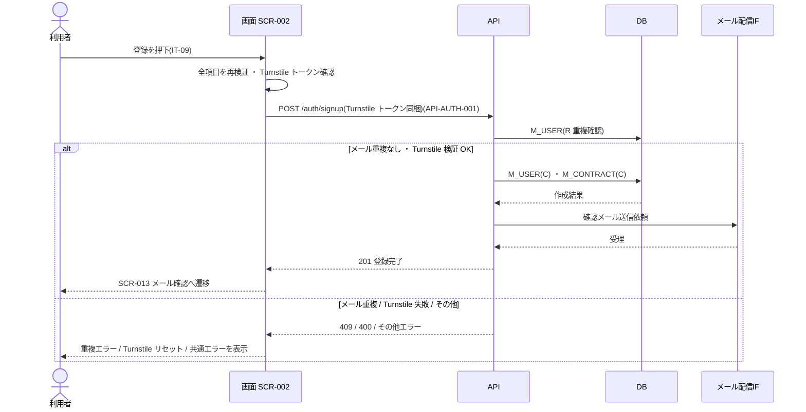

<!-- portal-top -->
[設計ポータル](../README.md) ／ [ユースケース](index.md) ／ **UC-SCR-002: アカウント登録 ユースケース**
<!-- /portal-top -->

# UC-SCR-002: アカウント登録 ユースケース

> **このページは、画面 SCR-002(アカウント登録)の画面イベント EV-01〜EV-12 に対応する 12 のユースケースを「1 イベント = 1 ユースケース」で定義します。**

*版数 v1.0 ・ 更新 2026-06-21 ・ ユースケース 12 ・ ステータス ドラフト*

## 0. イベント↔ユースケース対応表

画面 [SCR-002](../02_basic-design/SCR-002.md#SCR-002) §6 の各イベントを、1 対 1 でユースケースへ対応づけます。種別は、サーバ API・DB へアクセスする「API/DB 連携」と、画面内で完結する「クライアント内処理のみ」を区別します。

| イベント ID | イベント名 | ユースケース ID | 種別 |
|----|----|----|----|
| `EV-01` | 初期表示 | [UC-SCR-002-EV01](#UC-SCR-002-EV01) | クライアント内処理のみ |
| `EV-02` | メールアドレスを入力 | [UC-SCR-002-EV02](#UC-SCR-002-EV02) | クライアント内処理のみ |
| `EV-03` | パスワードを入力 | [UC-SCR-002-EV03](#UC-SCR-002-EV03) | クライアント内処理のみ |
| `EV-04` | パスワード(確認)を入力 | [UC-SCR-002-EV04](#UC-SCR-002-EV04) | クライアント内処理のみ |
| `EV-05` | 業種を選択 | [UC-SCR-002-EV05](#UC-SCR-002-EV05) | クライアント内処理のみ |
| `EV-06` | 「利用規約に同意する」をチェック | [UC-SCR-002-EV06](#UC-SCR-002-EV06) | クライアント内処理のみ |
| `EV-07` | 「プライバシーポリシーに同意する」をチェック | [UC-SCR-002-EV07](#UC-SCR-002-EV07) | クライアント内処理のみ |
| `EV-08` | 「利用規約を別ウィンドウで表示」を押下 | [UC-SCR-002-EV08](#UC-SCR-002-EV08) | クライアント内処理のみ |
| `EV-09` | 「プライバシーポリシーを別ウィンドウで表示」を押下 | [UC-SCR-002-EV09](#UC-SCR-002-EV09) | クライアント内処理のみ |
| `EV-10` | 「登録して確認メールを送信する」を押下 | [UC-SCR-002-EV10](#UC-SCR-002-EV10) | API/DB 連携 |
| `EV-11` | 「ログインする」を押下 | [UC-SCR-002-EV11](#UC-SCR-002-EV11) | クライアント内処理のみ |
| `EV-12` | Turnstile 検証を完了 | [UC-SCR-002-EV12](#UC-SCR-002-EV12) | クライアント内処理のみ |

## 1. ユースケース定義

### UC-SCR-002-EV01 初期表示

> **概要** 登録フォームを空状態で表示し、業種ドロップダウンの選択肢を読み込んで Turnstile を初期化する、クライアント内処理のみのユースケース。

| 項目 | 内容 |
|---|---|
| 利用者 | 未認証ユーザー(新規オーナー) |
| 事前条件 | SCR-002 の URL にアクセスした |
| トリガー | EV-01: 初期表示 |
| 事後条件 | 登録フォームを空状態で表示し、業種選択肢を読み込み、Turnstile(IT-11)を初期化してトークン取得を開始する |
| 関連 | [SCR-002](../02_basic-design/SCR-002.md#SCR-002) ・ [FR-001](../01_requirements/FR01.md#FR-001) ・ [FR-111](../01_requirements/FR14.md#FR-111) |

クライアント内処理のみ(バックエンド連携なし)。業種選択肢は静的定義のため API 取得を伴いません。

**基本フロー**
1. 画面が登録フォーム(IT-01〜IT-10)を空の状態で表示する。
2. 業種ドロップダウン(IT-04)の選択肢を読み込む。
3. Turnstile ウィジェット(IT-11)を初期化し、トークン取得を開始する。

**異常系フロー**
- Turnstile の初期化に失敗した場合は登録ボタン(IT-09)を非活性とし、再読み込みを促す。

### UC-SCR-002-EV02 メールアドレスを入力

> **概要** メールアドレスの必須・形式をフォーカスアウト時にインライン検証する、クライアント内処理のみのユースケース。

| 項目 | 内容 |
|---|---|
| 利用者 | 未認証ユーザー(新規オーナー) |
| 事前条件 | 登録フォームが表示されている |
| トリガー | EV-02: メールアドレス(IT-01)を入力 |
| 事後条件 | 入力が妥当ならフィールドエラーを消去し、不正なら IT-01 直下にエラーを表示する |
| 関連 | [SCR-002](../02_basic-design/SCR-002.md#SCR-002) ・ [FR-001](../01_requirements/FR01.md#FR-001) |

クライアント内処理のみ(バックエンド連携なし)。

**基本フロー**
1. フォーカスアウト時にメール形式・必須を画面内で検証する。
2. 妥当ならフィールドエラーを消去する。

**異常系フロー**
- 未入力・形式不正の場合は IT-01 直下にエラーを表示する。

### UC-SCR-002-EV03 パスワードを入力

> **概要** パスワードの必須・強度(12 文字以上・3 種類以上)をフォーカスアウト時にインライン検証する、クライアント内処理のみのユースケース。

| 項目 | 内容 |
|---|---|
| 利用者 | 未認証ユーザー(新規オーナー) |
| 事前条件 | 登録フォームが表示されている |
| トリガー | EV-03: パスワード(IT-02)を入力 |
| 事後条件 | 強度要件を満たせばフィールドエラーを消去し、不足なら IT-02 直下にエラーを表示する |
| 関連 | [SCR-002](../02_basic-design/SCR-002.md#SCR-002) ・ [FR-006](../01_requirements/FR01.md#FR-006) |

クライアント内処理のみ(バックエンド連携なし)。

**基本フロー**
1. フォーカスアウト時にパスワード強度(12 文字以上・3 種類以上の文字種)・必須を画面内で検証する。
2. 要件を満たせばフィールドエラーを消去する。

**異常系フロー**
- 未入力・強度不足の場合は IT-02 直下にエラーを表示する。

### UC-SCR-002-EV04 パスワード(確認)を入力

> **概要** パスワード(確認)の必須・一致をフォーカスアウト時にインライン検証する、クライアント内処理のみのユースケース。

| 項目 | 内容 |
|---|---|
| 利用者 | 未認証ユーザー(新規オーナー) |
| 事前条件 | 登録フォームが表示されている |
| トリガー | EV-04: パスワード(確認)(IT-03)を入力 |
| 事後条件 | パスワード(IT-02)と一致すればフィールドエラーを消去し、不一致なら IT-03 直下にエラーを表示する |
| 関連 | [SCR-002](../02_basic-design/SCR-002.md#SCR-002) ・ [FR-006](../01_requirements/FR01.md#FR-006) |

クライアント内処理のみ(バックエンド連携なし)。

**基本フロー**
1. フォーカスアウト時にパスワード(IT-02)との一致・必須を画面内で検証する。
2. 一致すればフィールドエラーを消去する。

**異常系フロー**
- 未入力・不一致の場合は IT-03 直下にエラーを表示する。

### UC-SCR-002-EV05 業種を選択

> **概要** 高規制業界を選択した場合に提供範囲外の注意とサポート窓口案内をインライン表示する、クライアント内処理のみのユースケース。

| 項目 | 内容 |
|---|---|
| 利用者 | 未認証ユーザー(新規オーナー) |
| 事前条件 | 登録フォームが表示されている |
| トリガー | EV-05: 業種選択(IT-04)を選択 |
| 事後条件 | 高規制業界(金融 / 医療等)選択時は提供範囲外の注意とサポート窓口案内をインライン表示する。登録ボタンは非活性化せず登録自体は許容する。それ以外の選択では追加表示なし |
| 関連 | [SCR-002](../02_basic-design/SCR-002.md#SCR-002) ・ [FR-001](../01_requirements/FR01.md#FR-001) |

クライアント内処理のみ(バックエンド連携なし)。

**基本フロー**
1. 利用者が業種(IT-04)を選択する。
2. 高規制業界を選択した場合、提供範囲外の注意メッセージとサポート窓口案内をフォーム上にインライン表示する。
3. それ以外の選択では追加表示を行わない。

**異常系フロー**
- なし(画面内の表示切替のみ)。

### UC-SCR-002-EV06 「利用規約に同意する」をチェック

> **概要** 利用規約同意チェックの状態を保持し、未チェックでの登録を拒否対象とする、クライアント内処理のみのユースケース。

| 項目 | 内容 |
|---|---|
| 利用者 | 未認証ユーザー(新規オーナー) |
| 事前条件 | 登録フォームが表示されている |
| トリガー | EV-06: 利用規約同意(IT-05)をチェック |
| 事後条件 | チェック状態を保持する。未チェックのまま登録を押下した場合は登録を拒否しチェックを求めるエラーを表示する |
| 関連 | [SCR-002](../02_basic-design/SCR-002.md#SCR-002) ・ [FR-002](../01_requirements/FR01.md#FR-002) |

クライアント内処理のみ(バックエンド連携なし)。同意記録の永続化は EV-10 の登録 API で行います。

**基本フロー**
1. 利用者が利用規約同意(IT-05)をチェック / アンチェックする。
2. 画面はチェック状態を保持する。

**異常系フロー**
- 未チェックのまま登録(IT-09)を押下した場合は、EV-10 で登録を拒否しチェックを求めるエラーを表示する。

### UC-SCR-002-EV07 「プライバシーポリシーに同意する」をチェック

> **概要** プライバシーポリシー同意チェックの状態を保持し、未チェックでの登録を拒否対象とする、クライアント内処理のみのユースケース。

| 項目 | 内容 |
|---|---|
| 利用者 | 未認証ユーザー(新規オーナー) |
| 事前条件 | 登録フォームが表示されている |
| トリガー | EV-07: プライバシーポリシー同意(IT-06)をチェック |
| 事後条件 | チェック状態を保持する。未チェックのまま登録を押下した場合は登録を拒否しチェックを求めるエラーを表示する |
| 関連 | [SCR-002](../02_basic-design/SCR-002.md#SCR-002) ・ [FR-002](../01_requirements/FR01.md#FR-002) |

クライアント内処理のみ(バックエンド連携なし)。同意記録の永続化は EV-10 の登録 API で行います。

**基本フロー**
1. 利用者がプライバシーポリシー同意(IT-06)をチェック / アンチェックする。
2. 画面はチェック状態を保持する。

**異常系フロー**
- 未チェックのまま登録(IT-09)を押下した場合は、EV-10 で登録を拒否しチェックを求めるエラーを表示する。

### UC-SCR-002-EV08 「利用規約を別ウィンドウで表示」を押下

> **概要** 利用規約全文を別ウィンドウで開き、入力状態を保持する、クライアント内処理のみのユースケース。

| 項目 | 内容 |
|---|---|
| 利用者 | 未認証ユーザー(新規オーナー) |
| 事前条件 | 登録フォームが表示されている |
| トリガー | EV-08: 利用規約リンク(IT-07)を押下 |
| 事後条件 | 利用規約の全文を別ウィンドウ(タブ)で表示する。現在のフォーム入力状態は保持する |
| 関連 | [SCR-002](../02_basic-design/SCR-002.md#SCR-002) ・ [FR-002](../01_requirements/FR01.md#FR-002) |

クライアント内処理のみ(バックエンド連携なし)。

**基本フロー**
1. 利用者が利用規約リンク(IT-07)を押下する。
2. 画面は利用規約の全文を別ウィンドウ(タブ)で表示し、フォーム入力状態を保持する。

**異常系フロー**
- なし(別ウィンドウ表示のみ)。

### UC-SCR-002-EV09 「プライバシーポリシーを別ウィンドウで表示」を押下

> **概要** プライバシーポリシー全文を別ウィンドウで開き、入力状態を保持する、クライアント内処理のみのユースケース。

| 項目 | 内容 |
|---|---|
| 利用者 | 未認証ユーザー(新規オーナー) |
| 事前条件 | 登録フォームが表示されている |
| トリガー | EV-09: プライバシーポリシーリンク(IT-08)を押下 |
| 事後条件 | プライバシーポリシーの全文を別ウィンドウ(タブ)で表示する。現在のフォーム入力状態は保持する |
| 関連 | [SCR-002](../02_basic-design/SCR-002.md#SCR-002) ・ [FR-002](../01_requirements/FR01.md#FR-002) |

クライアント内処理のみ(バックエンド連携なし)。

**基本フロー**
1. 利用者がプライバシーポリシーリンク(IT-08)を押下する。
2. 画面はプライバシーポリシーの全文を別ウィンドウ(タブ)で表示し、フォーム入力状態を保持する。

**異常系フロー**
- なし(別ウィンドウ表示のみ)。

### UC-SCR-002-EV10 「登録して確認メールを送信する」を押下

> **概要** 全項目を再検証し Turnstile トークンを添えて新規登録 API を呼び出し、利用者・契約を作成して確認メール送信フローへ遷移する最重要ユースケース。

| 項目 | 内容 |
|---|---|
| 利用者 | 未認証ユーザー(新規オーナー) |
| 事前条件 | 必須項目が入力され、利用規約・プライバシーポリシーに同意し、Turnstile トークン(IT-11)を取得している |
| トリガー | EV-10: 登録ボタン(IT-09)を押下 |
| 事後条件 | 成功時は利用者(`M_USER`)と契約(`M_CONTRACT`)を作成し確認メールを送信したうえで SCR-013 メール確認へ遷移する。失敗時はアカウントを作成せず、メール重複・Turnstile 検証失敗・その他に応じたエラーを表示する |
| 関連 | [SCR-002](../02_basic-design/SCR-002.md#SCR-002) ・ [API-AUTH-001](../02_basic-design/API-auth.md#API-AUTH-001) ・ [FR-001](../01_requirements/FR01.md#FR-001) ・ [FR-003](../01_requirements/FR01.md#FR-003) ・ [FR-111](../01_requirements/FR14.md#FR-111) |

**基本フロー**
1. 全項目のバリデーション(EV-02〜EV-07)を実行し、エラーがある場合は登録を中止してエラーを表示する。
2. Turnstile トークン(IT-11)が未取得の場合は登録を中止してエラーを表示する。
3. 新規登録 API(`POST /auth/signup` = [API-AUTH-001](../02_basic-design/API-auth.md#API-AUTH-001))を、Turnstile トークンをリクエストに含めて呼び出す。
4. API はメール重複を確認し、新規オーナーの利用者(`M_USER`、メール一意)と契約(`M_CONTRACT`、1 契約 = 1 オーナー)を作成する。
5. API はメール配信 IF 経由で確認メールを送信する。
6. 成功時、画面は SCR-013(メール確認)へ遷移する。

**異常系フロー**
- メール重複(409): 該当フィールドにエラーメッセージを表示し、アカウントを作成しない。
- Turnstile 検証失敗(400): フォーム上部にエラーを表示し、Turnstile ウィジェットをリセットする。
- 入力再検証エラー: 送信を中止し、該当フィールド直下にエラーを表示する。
- その他失敗: フォーム上部にエラーメッセージを表示する。

### UC-SCR-002-EV11 「ログインする」を押下

> **概要** ログイン画面へ遷移する、クライアント内処理のみのユースケース。

| 項目 | 内容 |
|---|---|
| 利用者 | 未認証ユーザー |
| 事前条件 | 登録フォームが表示されている |
| トリガー | EV-11: ログイン画面リンク(IT-10)を押下 |
| 事後条件 | SCR-001 ログインへ遷移する |
| 関連 | [SCR-002](../02_basic-design/SCR-002.md#SCR-002) ・ [FR-004](../01_requirements/FR01.md#FR-004) |

クライアント内処理のみ(バックエンド連携なし)。

**基本フロー**
1. 利用者がログイン画面リンク(IT-10)を押下する。
2. 画面は SCR-001 ログインへ遷移する。

**異常系フロー**
- なし(画面遷移のみ)。

### UC-SCR-002-EV12 Turnstile 検証を完了

> **概要** Turnstile 検証トークンを取得・保持し、失敗時は登録ボタンを非活性化する、クライアント内処理のみのユースケース。

| 項目 | 内容 |
|---|---|
| 利用者 | 未認証ユーザー(新規オーナー) |
| 事前条件 | Turnstile ウィジェット(IT-11)が初期化されている |
| トリガー | EV-12: Turnstile 検証を完了 |
| 事後条件 | 成功時は検証トークンを取得・保持する。失敗時は Turnstile 上にエラーを表示し登録ボタン(IT-09)を非活性にする |
| 関連 | [SCR-002](../02_basic-design/SCR-002.md#SCR-002) ・ [FR-111](../01_requirements/FR14.md#FR-111) |

クライアント内処理のみ(バックエンド連携なし)。検証トークンの最終的な妥当性確認は EV-10 の登録 API で行います。

**基本フロー**
1. Turnstile ウィジェット(IT-11)が検証を完了する。
2. 成功時、画面は検証トークンを取得・保持する。

**異常系フロー**
- 検証失敗時: Turnstile ウィジェット上にエラーを表示し、登録ボタン(IT-09)を非活性にする。

---

<!-- portal-bottom -->
[ユースケース](index.md) ・ [↑ 設計ポータル](../README.md)
<!-- /portal-bottom -->
