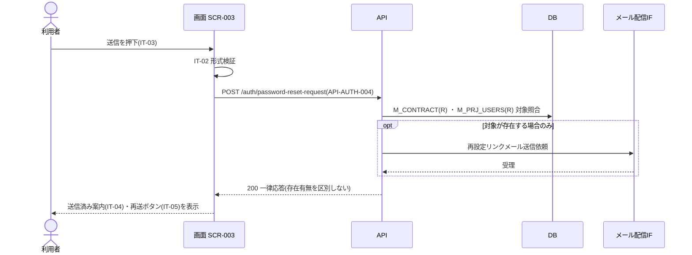
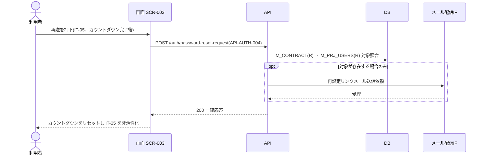
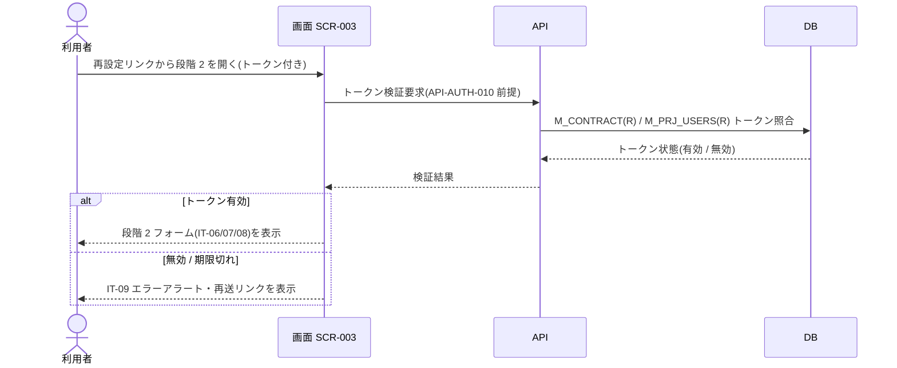
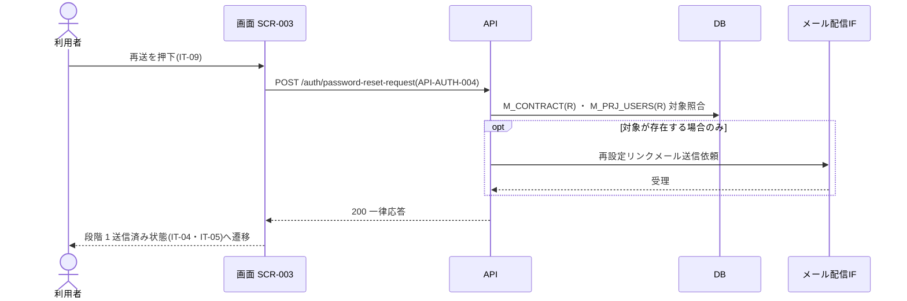
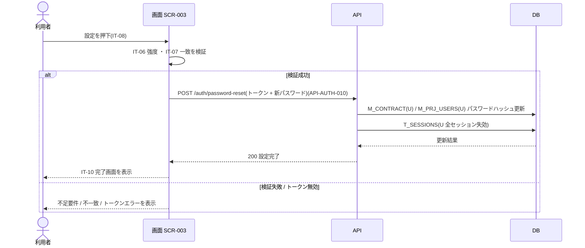

<!-- portal-top -->
[設計ポータル](../README.md) ／ [ユースケース](index.md) ／ **UC-SCR-003: パスワード再設定 ユースケース**
<!-- /portal-top -->

# UC-SCR-003: パスワード再設定 ユースケース

> **このページは、画面 SCR-003(パスワード再設定)の画面イベント EV-01〜EV-09 に対応する 9 のユースケースを「1 イベント = 1 ユースケース」で定義します。**

*版数 v1.0 ・ 更新 2026-06-21 ・ ユースケース 9 ・ ステータス ドラフト*

## 0. イベント↔ユースケース対応表

画面 [SCR-003](../02_basic-design/SCR-003.md#SCR-003) §6 の各イベントを、1 対 1 でユースケースへ対応づけます。種別は、サーバ API・DB へアクセスする「API/DB 連携」と、画面内で完結する「クライアント内処理のみ」を区別します。

| イベント ID | イベント名 | ユースケース ID | 種別 |
|----|----|----|----|
| `EV-01` | 初期表示(段階 1) | [UC-SCR-003-EV01](#UC-SCR-003-EV01) | クライアント内処理のみ |
| `EV-02` | 「再設定リンクを送信」を押下 | [UC-SCR-003-EV02](#UC-SCR-003-EV02) | API/DB 連携 |
| `EV-03` | 「メールを再送信する」を押下 | [UC-SCR-003-EV03](#UC-SCR-003-EV03) | API/DB 連携 |
| `EV-04` | 初期表示(段階 2) | [UC-SCR-003-EV04](#UC-SCR-003-EV04) | API/DB 連携 |
| `EV-05` | 「再送する」を押下(段階 2 エラー時) | [UC-SCR-003-EV05](#UC-SCR-003-EV05) | API/DB 連携 |
| `EV-06` | 新パスワードを入力 | [UC-SCR-003-EV06](#UC-SCR-003-EV06) | クライアント内処理のみ |
| `EV-07` | 「新しいパスワードを設定する」を押下 | [UC-SCR-003-EV07](#UC-SCR-003-EV07) | API/DB 連携 |
| `EV-08` | 「ログインする」を押下 | [UC-SCR-003-EV08](#UC-SCR-003-EV08) | クライアント内処理のみ |
| `EV-09` | 「ログインに戻る」を押下 | [UC-SCR-003-EV09](#UC-SCR-003-EV09) | クライアント内処理のみ |

## 1. ユースケース定義

### UC-SCR-003-EV01 初期表示(段階 1)

> **概要** 段階 1 のタイムライン・メールアドレス入力・送信ボタンを表示する、クライアント内処理のみのユースケース。

| 項目 | 内容 |
|---|---|
| 利用者 | 未認証ユーザー(再設定を要するアカウント利用者) |
| 事前条件 | SCR-003 の URL にアクセスした(段階 1) |
| トリガー | EV-01: 初期表示(段階 1) |
| 事後条件 | タイムライン(IT-01、段階 1 強調)、メールアドレス入力(IT-02)、送信ボタン(IT-03)を表示する |
| 関連 | [SCR-003](../02_basic-design/SCR-003.md#SCR-003) ・ [FR-004](../01_requirements/FR01.md#FR-004) |

クライアント内処理のみ(バックエンド連携なし)。

**基本フロー**
1. 画面がタイムライン(IT-01)を段階 1 強調で表示する。
2. 画面がメールアドレス入力(IT-02)と送信ボタン(IT-03)を表示する。

**異常系フロー**
- なし(表示のみ)。

### UC-SCR-003-EV02 「再設定リンクを送信」を押下

> **概要** メールアドレスを検証してパスワード再設定要求 API を発行し、存在有無を区別しない一律応答を返して送信済み案内を表示するユースケース。

| 項目 | 内容 |
|---|---|
| 利用者 | 未認証ユーザー(再設定を要するアカウント利用者) |
| 事前条件 | 段階 1 のメールアドレス入力(IT-02)が表示されている |
| トリガー | EV-02: 送信ボタン(IT-03)を押下 |
| 事後条件 | 形式正常時は再設定要求 API を発行し、メールアドレスの存在有無を区別しない一律応答後に送信済み案内(IT-04)と再送ボタン(IT-05、カウントダウン付き)を表示する |
| 関連 | [SCR-003](../02_basic-design/SCR-003.md#SCR-003) ・ [API-AUTH-004](../02_basic-design/API-auth.md#API-AUTH-004) ・ [FR-004](../01_requirements/FR01.md#FR-004) |

**基本フロー**
1. 画面が IT-02 の形式バリデーションを実行する。
2. 形式正常時、パスワード再設定要求 API(`POST /auth/password-reset-request` = [API-AUTH-004](../02_basic-design/API-auth.md#API-AUTH-004))を発行する。
3. API は対象アカウントの有無を応答で区別せず、該当時はメール配信 IF 経由で再設定リンクメールを送信する。
4. 応答受取後、画面は送信済み案内(IT-04)と再送ボタン(IT-05、カウントダウン付き)を表示する。

**異常系フロー**
- 形式不正: IT-02 直下にエラーメッセージを表示してリクエストを中断する。
- API 失敗: 送信済み案内へ遷移せず、エラーを表示する(列挙攻撃対策のため対象有無は明かさない)。

> [!NOTE]
> 段階 1 の応答はメールアドレスの存在有無を区別しません(列挙攻撃対策)。図はメール送信を「該当時のみ」と抽象化し、対象判定の内部分岐は展開しません。

### UC-SCR-003-EV03 「メールを再送信する」を押下

> **概要** レート制限解除後にパスワード再設定要求 API を再発行し、カウントダウンをリセットして再送ボタンを再び非活性化するユースケース。

| 項目 | 内容 |
|---|---|
| 利用者 | 未認証ユーザー(再設定を要するアカウント利用者) |
| 事前条件 | 段階 1 送信済みで、再送ボタン(IT-05)が表示されている |
| トリガー | EV-03: 再送ボタン(IT-05)を押下 |
| 事後条件 | カウントダウン完了後に再設定要求 API を再発行し、応答受取後にカウントダウンをリセットして IT-05 を再び非活性にする |
| 関連 | [SCR-003](../02_basic-design/SCR-003.md#SCR-003) ・ [API-AUTH-004](../02_basic-design/API-auth.md#API-AUTH-004) ・ [FR-004](../01_requirements/FR01.md#FR-004) |

**基本フロー**
1. 5 分のレート制限カウントダウン中は IT-05 が非活性のため操作できない。
2. カウントダウン完了後、利用者が IT-05 を押下する。
3. 画面はパスワード再設定要求 API([API-AUTH-004](../02_basic-design/API-auth.md#API-AUTH-004))を再発行する。
4. 応答受取後、画面はカウントダウンをリセットして IT-05 を再び非活性にする。

**異常系フロー**
- API 失敗: カウントダウンをリセットせず、エラーを表示する。

### UC-SCR-003-EV04 初期表示(段階 2)

> **概要** 再設定リンクの URL トークンを検証し、有効時は新パスワード入力フォーム、無効時はエラーアラートを表示するユースケース。

| 項目 | 内容 |
|---|---|
| 利用者 | 未認証ユーザー(再設定リンクから到達) |
| 事前条件 | メールの再設定リンク(トークン付き URL)からアクセスした(段階 2) |
| トリガー | EV-04: 初期表示(段階 2) |
| 事後条件 | トークン有効時はタイムライン(段階 2 強調)と新パスワードフォーム(IT-06・IT-07・IT-08)を表示する。無効 / 期限切れ時は IT-09 エラーアラートと再送リンクを表示する |
| 関連 | [SCR-003](../02_basic-design/SCR-003.md#SCR-003) ・ [API-AUTH-010](../02_basic-design/API-auth.md#API-AUTH-010) ・ [FR-004](../01_requirements/FR01.md#FR-004) |

**基本フロー**
1. 画面が再設定リンクの URL トークンを取得する。
2. 画面はトークンを検証する(有効期限 1 時間)。
3. トークン有効時、タイムライン(IT-01、段階 2 強調)と新パスワードフォーム(IT-06・IT-07・IT-08)を表示する。

**異常系フロー**
- トークン無効 / 期限切れ: IT-09 エラーアラートと再送リンクを表示する。

> [!NOTE]
> トークン検証はパスワード再設定確定 API([API-AUTH-010](../02_basic-design/API-auth.md#API-AUTH-010))が前提とするトークンの妥当性に準じます。画面側の初期検証はフォーム表示可否の判定であり、最終確定は EV-07 で行います。

### UC-SCR-003-EV05 「再送する」を押下(段階 2 エラー時)

> **概要** 段階 2 のトークンエラー画面から再設定要求 API を発行し、段階 1 送信済み状態へ復帰するユースケース。

| 項目 | 内容 |
|---|---|
| 利用者 | 未認証ユーザー(段階 2 エラー画面に到達) |
| 事前条件 | 段階 2 で IT-09 エラーアラートと再送リンクが表示されている |
| トリガー | EV-05: 再送リンク(IT-09)を押下 |
| 事後条件 | 再設定要求 API を発行し、応答受取後に段階 1 送信済み状態(IT-04・IT-05 表示)へ遷移する |
| 関連 | [SCR-003](../02_basic-design/SCR-003.md#SCR-003) ・ [API-AUTH-004](../02_basic-design/API-auth.md#API-AUTH-004) ・ [FR-004](../01_requirements/FR01.md#FR-004) |

**基本フロー**
1. 利用者が IT-09 の再送リンクを押下する。
2. 画面はパスワード再設定要求 API([API-AUTH-004](../02_basic-design/API-auth.md#API-AUTH-004))を発行する。
3. 応答受取後、画面は段階 1 送信済み状態(IT-04・IT-05 表示)へ遷移する。

**異常系フロー**
- API 失敗: 段階 1 送信済み状態へ遷移せず、エラーを表示する。

### UC-SCR-003-EV06 新パスワードを入力

> **概要** 入力のたびに強度バーと不足要件メッセージをリアルタイム更新する、クライアント内処理のみのユースケース。

| 項目 | 内容 |
|---|---|
| 利用者 | 未認証ユーザー(段階 2) |
| 事前条件 | 段階 2 の新パスワードフォーム(IT-06)が表示されている |
| トリガー | EV-06: 新パスワード(IT-06)を入力 |
| 事後条件 | 入力のたびに強度バーと不足要件メッセージ(IT-06)をリアルタイム更新する |
| 関連 | [SCR-003](../02_basic-design/SCR-003.md#SCR-003) ・ [FR-006](../01_requirements/FR01.md#FR-006) |

クライアント内処理のみ(バックエンド連携なし)。

**基本フロー**
1. 利用者が新パスワード(IT-06)を入力する。
2. 画面は入力のたびに強度バーと不足要件メッセージを更新する(FR-006 準拠: 12 文字以上・3 種類以上の文字種)。

**異常系フロー**
- 要件未達の間は不足要件メッセージを表示し続ける(設定確定は EV-07 で再検証する)。

### UC-SCR-003-EV07 「新しいパスワードを設定する」を押下

> **概要** 強度・一致を検証してパスワード再設定確定 API を発行し、パスワードハッシュを更新して全セッションを失効し、完了画面を表示する最重要ユースケース。

| 項目 | 内容 |
|---|---|
| 利用者 | 未認証ユーザー(段階 2) |
| 事前条件 | 段階 2 で新パスワード(IT-06)と確認(IT-07)を入力している |
| トリガー | EV-07: 設定ボタン(IT-08)を押下 |
| 事後条件 | 検証成功時はパスワードハッシュを更新し当該ユーザーの全セッションを失効させ、完了画面(IT-10)を表示する。検証失敗時は不足要件 / 不一致エラーを表示しリクエストを中断する |
| 関連 | [SCR-003](../02_basic-design/SCR-003.md#SCR-003) ・ [API-AUTH-010](../02_basic-design/API-auth.md#API-AUTH-010) ・ [FR-006](../01_requirements/FR01.md#FR-006) |

**基本フロー**
1. 画面が IT-06 の強度要件(FR-006: 12 文字以上・3 種類以上の文字種)を検証する。
2. 画面が IT-07 の一致を検証する。
3. 検証成功時、パスワード再設定確定 API(`POST /auth/password-reset` = [API-AUTH-010](../02_basic-design/API-auth.md#API-AUTH-010))を発行する。
4. API はトークンと新パスワードを受け取り、対象マスタ(トークンの actor 種別で `M_CONTRACT` / `M_PRJ_USERS` を特定)のパスワードハッシュを更新する。
5. API は当該ユーザーの全セッション(`T_SESSIONS`)を失効させる。
6. 完了後、画面は IT-10 完了画面(「ログインしてください」案内 + ログインボタン)を表示する。

**異常系フロー**
- 強度不足 / 不一致: 不足要件メッセージ / 不一致エラーを表示してリクエストを中断する。
- トークン無効 / 期限切れ: 確定を行わず、IT-09 相当のエラーと再送導線を表示する。
- API 失敗: 完了画面へ遷移せず、エラーを表示する。

### UC-SCR-003-EV08 「ログインする」を押下

> **概要** 完了画面からログイン画面へ遷移する、クライアント内処理のみのユースケース。

| 項目 | 内容 |
|---|---|
| 利用者 | 未認証ユーザー(設定完了後) |
| 事前条件 | パスワード設定完了画面(IT-10)が表示されている |
| トリガー | EV-08: ログインボタン(IT-10)を押下 |
| 事後条件 | SCR-001 ログインへ遷移する |
| 関連 | [SCR-003](../02_basic-design/SCR-003.md#SCR-003) ・ [FR-004](../01_requirements/FR01.md#FR-004) |

クライアント内処理のみ(バックエンド連携なし)。

**基本フロー**
1. 利用者が完了画面のログインボタン(IT-10)を押下する。
2. 画面は SCR-001 ログインへ遷移する。

**異常系フロー**
- なし(画面遷移のみ)。

### UC-SCR-003-EV09 「ログインに戻る」を押下

> **概要** 段階 1 フォームからログイン画面へ戻る、クライアント内処理のみのユースケース。

| 項目 | 内容 |
|---|---|
| 利用者 | 未認証ユーザー(段階 1) |
| 事前条件 | 段階 1 フォームが表示されている |
| トリガー | EV-09: ログインに戻る(IT-11)を押下 |
| 事後条件 | SCR-001 ログインへ遷移する |
| 関連 | [SCR-003](../02_basic-design/SCR-003.md#SCR-003) ・ [FR-004](../01_requirements/FR01.md#FR-004) |

クライアント内処理のみ(バックエンド連携なし)。

**基本フロー**
1. 利用者が「ログインに戻る」(IT-11)を押下する。
2. 画面は SCR-001 ログインへ遷移する。

**異常系フロー**
- なし(画面遷移のみ)。

---

<!-- portal-bottom -->
[ユースケース](index.md) ・ [↑ 設計ポータル](../README.md)
<!-- /portal-bottom -->
