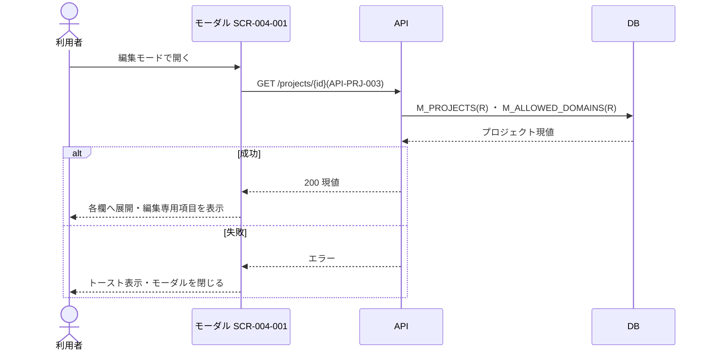
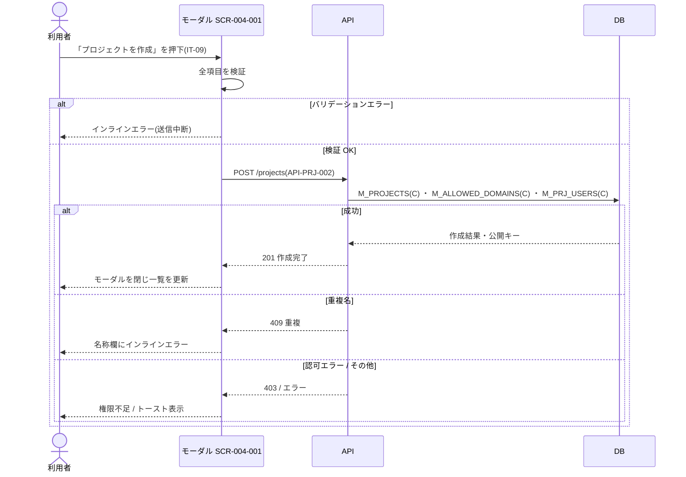
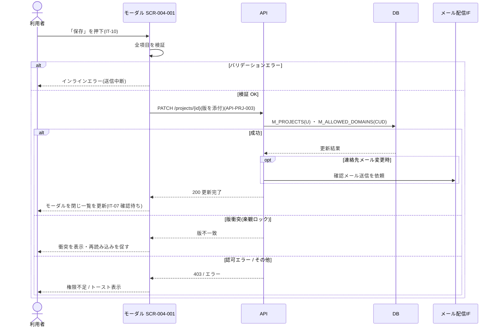
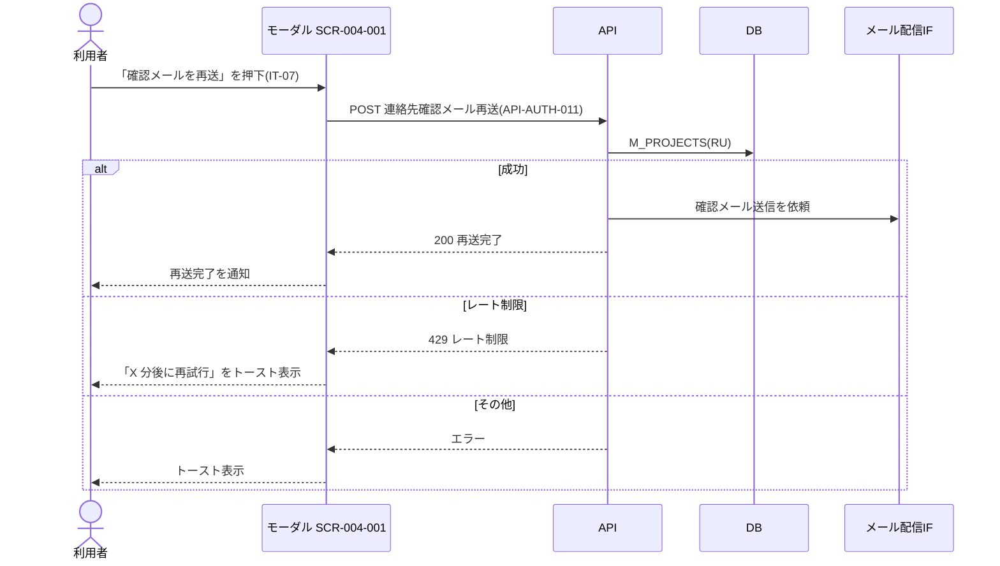
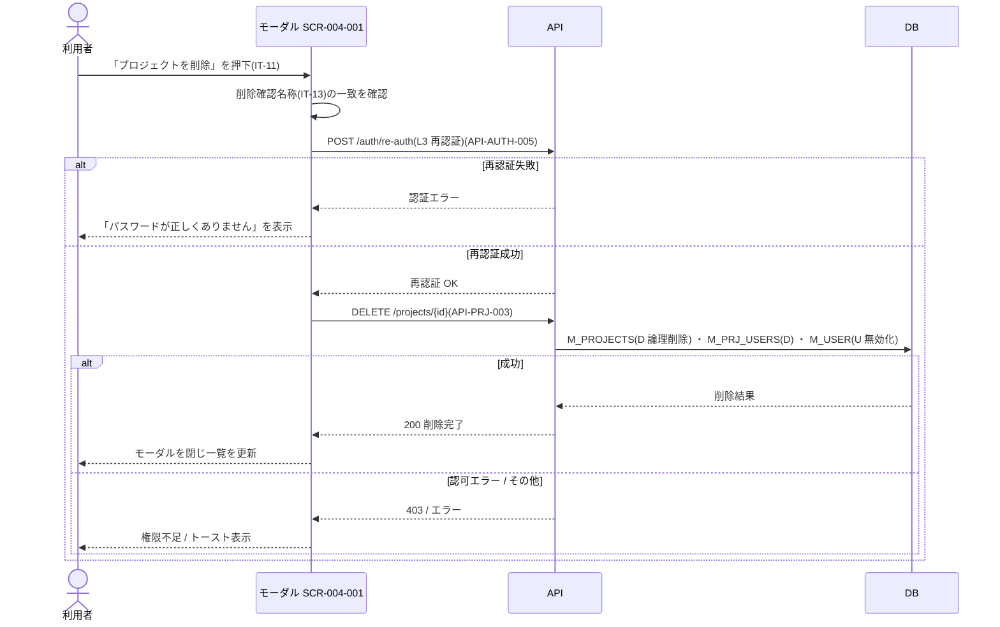

<!-- portal-top -->
[設計ポータル](../README.md) ／ [ユースケース](index.md) ／ **UC-SCR-004-001: プロジェクト作成・編集モーダル ユースケース**
<!-- /portal-top -->

# UC-SCR-004-001: プロジェクト作成・編集モーダル ユースケース

> **このページは、画面 SCR-004-001(プロジェクト作成・編集モーダル)の画面イベント EV-01〜EV-13 に対応する 13 のユースケースを「1 イベント = 1 ユースケース」で定義します。**

*版数 v1.0 ・ 更新 2026-06-21 ・ ユースケース 13 ・ ステータス ドラフト*

## 0. イベント↔ユースケース対応表

画面 [SCR-004-001](../02_basic-design/SCR-004-001.md#SCR-004-001) の §6 画面イベント一覧(EV-01〜EV-13)を、ユースケース ID へ 1:1 で対応づけます。種別は、サーバ API・DB へアクセスする「API/DB 連携」と、画面内のみで完結する「クライアント内処理のみ」に区別します。

| イベント ID | イベント名 | ユースケース ID | 種別 |
|----|----|----|----|
| `EV-01` | 初期表示(新規モード) | [UC-SCR-004-001-EV01](#UC-SCR-004-001-EV01) | クライアント内処理のみ |
| `EV-02` | 初期表示(編集モード) | [UC-SCR-004-001-EV02](#UC-SCR-004-001-EV02) | API/DB 連携 |
| `EV-03` | プロジェクト名を入力 | [UC-SCR-004-001-EV03](#UC-SCR-004-001-EV03) | クライアント内処理のみ |
| `EV-04` | 許可ドメインを入力 | [UC-SCR-004-001-EV04](#UC-SCR-004-001-EV04) | クライアント内処理のみ |
| `EV-05` | プロジェクト連絡先メールを入力 | [UC-SCR-004-001-EV05](#UC-SCR-004-001-EV05) | クライアント内処理のみ |
| `EV-06` | 「プロジェクトを作成」を押下 | [UC-SCR-004-001-EV06](#UC-SCR-004-001-EV06) | API/DB 連携 |
| `EV-07` | 「保存」を押下 | [UC-SCR-004-001-EV07](#UC-SCR-004-001-EV07) | API/DB 連携 |
| `EV-08` | 「確認メールを再送」を押下 | [UC-SCR-004-001-EV08](#UC-SCR-004-001-EV08) | API/DB 連携 |
| `EV-09` | 削除確認名称を入力 | [UC-SCR-004-001-EV09](#UC-SCR-004-001-EV09) | クライアント内処理のみ |
| `EV-10` | 「プロジェクトを削除」を押下 | [UC-SCR-004-001-EV10](#UC-SCR-004-001-EV10) | API/DB 連携 |
| `EV-11` | 「キャンセル」を押下 | [UC-SCR-004-001-EV11](#UC-SCR-004-001-EV11) | クライアント内処理のみ |
| `EV-12` | 「コピー」を押下(プロジェクト ID) | [UC-SCR-004-001-EV12](#UC-SCR-004-001-EV12) | クライアント内処理のみ |
| `EV-13` | × を押下 | [UC-SCR-004-001-EV13](#UC-SCR-004-001-EV13) | クライアント内処理のみ |

## 1. ユースケース定義

### UC-SCR-004-001-EV01 初期表示(新規モード)

> モーダルを新規作成モードで開いたとき、空の入力フォームを表示し、編集モード専用項目を非表示にします(クライアント内処理のみ)。

| 項目 | 内容 |
|----|----|
| 利用者 | オーナー(本モーダルはオーナー専有) |
| 事前条件 | SCR-004 で新規作成を選択し、新規作成モードで開いた |
| トリガー | SCR-004-001 を新規作成モードで開く |
| 事後条件 | 空フォームを表示する。見出し(IT-01)を「新規プロジェクトを作成」とし、IT-09(作成)のみ表示、編集モード専用項目(IT-02 / IT-07 / IT-10 / IT-11)は非表示にする |
| 関連 | [SCR-004-001](../02_basic-design/SCR-004-001.md#SCR-004-001) ・ [FR-019](../01_requirements/FR03.md#FR-019) |

基本フロー

1. 利用者が新規作成モードでモーダルを開く。
2. 画面は空の入力フォームを表示する。
3. 画面は見出し(IT-01)を「新規プロジェクトを作成」に設定し、「プロジェクトを作成」(IT-09)のみ表示する。
4. 画面は編集モード専用項目(IT-02 / IT-07 / IT-10 / IT-11)を非表示にする。

異常系フロー

- なし。

クライアント内処理のみのため、シーケンス図は省略します。

### UC-SCR-004-001-EV02 初期表示(編集モード)

> モーダルを編集モードで開いたとき、対象プロジェクトの現値を取得して各入力欄へ展開し、編集モード専用項目を表示します。

| 項目 | 内容 |
|----|----|
| 利用者 | オーナー(本モーダルはオーナー専有) |
| 事前条件 | SCR-004 でプロジェクト名を選択し、編集モードで開いた。対象プロジェクトが存在する |
| トリガー | SCR-004-001 を編集モードで開く |
| 事後条件 | 成功時は現値を各欄へ展開し、見出し(IT-01)を「プロジェクトを編集」に設定、編集モード専用項目(IT-02 / IT-07 / IT-10 / IT-11)を表示する。失敗時はトーストを表示しモーダルを閉じる |
| 関連 | [SCR-004-001](../02_basic-design/SCR-004-001.md#SCR-004-001) ・ [API-PRJ-003](../02_basic-design/API-project.md#API-PRJ-003) |

基本フロー

1. 利用者が編集モードでモーダルを開く。
2. 画面はプロジェクト更新・削除 API(GET)で対象プロジェクトの現値を取得する。
3. 画面はプロジェクト名・許可ドメイン・連絡先メール・連絡先メール確認状態を各欄へ展開する。
4. 画面は見出し(IT-01)を「プロジェクトを編集」に設定し、編集モード専用項目(IT-02 / IT-07 / IT-10 / IT-11)を表示する。

異常系フロー

- 取得失敗: 取得エラーをトーストで表示し、モーダルを閉じる。

### UC-SCR-004-001-EV03 プロジェクト名を入力

> プロジェクト名欄に入力すると、必須・文字数(1〜100 文字)を検証し、文字数カウンタを更新します(クライアント内処理のみ)。

| 項目 | 内容 |
|----|----|
| 利用者 | オーナー(本モーダルはオーナー専有) |
| 事前条件 | SCR-004-001 が表示済み |
| トリガー | プロジェクト名(IT-03)へ入力する |
| 事後条件 | 文字数カウンタが更新される。必須・文字数違反時はインラインエラーを表示する |
| 関連 | [SCR-004-001](../02_basic-design/SCR-004-001.md#SCR-004-001) |

基本フロー

1. 利用者がプロジェクト名(IT-03)へ入力する。
2. 画面は必須・文字数(1〜100 文字)を検証し、文字数カウンタ「N / 100」を更新する。

異常系フロー

- 未入力 / 100 文字超過: インラインエラーを表示する(送信は EV-06 / EV-07 で扱う)。

クライアント内処理のみのため、シーケンス図は省略します。

### UC-SCR-004-001-EV04 許可ドメインを入力

> 許可ドメイン欄で Enter またはカンマでタグを追加し、ドメイン形式を即時検証します(クライアント内処理のみ)。

| 項目 | 内容 |
|----|----|
| 利用者 | オーナー(本モーダルはオーナー専有) |
| 事前条件 | SCR-004-001 が表示済み |
| トリガー | 許可ドメイン(IT-04)へ入力し Enter またはカンマで確定する |
| 事後条件 | 形式が妥当ならタグを追加する。不正な場合はインラインエラーを表示しタグを追加しない |
| 関連 | [SCR-004-001](../02_basic-design/SCR-004-001.md#SCR-004-001) |

基本フロー

1. 利用者が許可ドメイン(IT-04)へ入力し、Enter またはカンマで確定する。
2. 画面はドメイン形式(完全一致または `*.example.com` 形式。IP アドレス・プロトコル指定は不可)を検証する。
3. 妥当ならタグを追加する。

異常系フロー

- 形式不正(IP アドレス・プロトコル指定等): インラインエラーを表示し、タグを追加しない。

クライアント内処理のみのため、シーケンス図は省略します。

### UC-SCR-004-001-EV05 プロジェクト連絡先メールを入力

> 連絡先メール欄からフォーカスアウトしたとき、メール形式を検証します(クライアント内処理のみ)。

| 項目 | 内容 |
|----|----|
| 利用者 | オーナー(本モーダルはオーナー専有) |
| 事前条件 | SCR-004-001 が表示済み |
| トリガー | プロジェクト連絡先メール(IT-06)へ入力しフォーカスアウトする |
| 事後条件 | メール形式が妥当ならエラーを消去し、不正ならインラインエラーを表示する |
| 関連 | [SCR-004-001](../02_basic-design/SCR-004-001.md#SCR-004-001) |

基本フロー

1. 利用者がプロジェクト連絡先メール(IT-06)へ入力し、フォーカスアウトする。
2. 画面はメール形式を検証し、妥当ならエラーを消去する。

異常系フロー

- メール形式不正: インラインエラーを表示する(連絡先メールは任意のため、空欄はエラーとしない)。

クライアント内処理のみのため、シーケンス図は省略します。

### UC-SCR-004-001-EV06 「プロジェクトを作成」を押下

> 入力を検証し、新規プロジェクトを作成します。成功時はオーナーをメンバーとして自動登録し、モーダルを閉じて一覧を更新します。

| 項目 | 内容 |
|----|----|
| 利用者 | オーナー(本モーダルはオーナー専有) |
| 事前条件 | 新規作成モードで、入力にバリデーションエラーがない(プロジェクト名・許可ドメインが必須範囲内) |
| トリガー | 「プロジェクトを作成」(IT-09)を押下する |
| 事後条件 | 成功時はプロジェクトを新規作成し、作成者オーナーをメンバーとして自動登録、ウィジェット公開キーを発行する。モーダルを閉じ SCR-004 の一覧を更新する。失敗時は遷移せずエラー表示する |
| 関連 | [SCR-004-001](../02_basic-design/SCR-004-001.md#SCR-004-001) ・ [API-PRJ-002](../02_basic-design/API-project.md#API-PRJ-002) ・ [FR-019](../01_requirements/FR03.md#FR-019) |

基本フロー

1. 利用者が「プロジェクトを作成」(IT-09)を押下する。
2. 画面は全項目のバリデーションを実行する。
3. 画面はプロジェクト新規作成 API を呼び出す。
4. API はプロジェクトを作成し、作成者オーナーを当該プロジェクトの member として `M_PRJ_USERS` に自動登録し、許可ドメインを登録、ウィジェット公開キーを発行する。
5. 成功時、画面はモーダルを閉じ、SCR-004 の一覧を更新する。

異常系フロー

- バリデーションエラー: 対象欄にインラインエラーを表示し、送信を中断する(モーダルに留まる)。
- 重複名: プロジェクト名欄に「このプロジェクト名は既に使用されています」を表示する。
- 認可エラー(403): 権限不足を表示し、作成しない。
- その他のエラー: トーストでエラーを表示する。

### UC-SCR-004-001-EV07 「保存」を押下

> 入力を検証し、プロジェクトを更新します。連絡先メールを変更した場合は確認メールを自動送信し、成功時はモーダルを閉じて一覧を更新します。

| 項目 | 内容 |
|----|----|
| 利用者 | オーナー(本モーダルはオーナー専有) |
| 事前条件 | 編集モードで、入力にバリデーションエラーがない |
| トリガー | 「保存」(IT-10)を押下する |
| 事後条件 | 成功時はプロジェクトを更新する。連絡先メール(IT-06)変更時は確認メールを自動送信し IT-07 を「確認待ち」に更新する。モーダルを閉じ SCR-004 の一覧を更新する。版衝突・権限なし時は遷移せずエラー表示する |
| 関連 | [SCR-004-001](../02_basic-design/SCR-004-001.md#SCR-004-001) ・ [API-PRJ-003](../02_basic-design/API-project.md#API-PRJ-003) ・ [FR-019](../01_requirements/FR03.md#FR-019) |

基本フロー

1. 利用者が「保存」(IT-10)を押下する。
2. 画面は全項目のバリデーションを実行する。
3. 画面はプロジェクト更新・削除 API(PATCH)で、版(楽観ロック)を添えてプロジェクトを更新する。
4. 連絡先メール(IT-06)を変更した場合は確認メールを自動送信し、IT-07 の確認状態を「確認待ち」に更新する。
5. 成功時、画面はモーダルを閉じ、SCR-004 の一覧を更新する。

異常系フロー

- バリデーションエラー: 対象欄にインラインエラーを表示し、送信を中断する(モーダルに留まる)。
- 版衝突(楽観ロック): 送信した版が他者の更新と一致しない場合、衝突を表示し再読み込みを促す(上書き保存しない)。
- 認可エラー(403): 権限不足を表示し、更新しない。
- その他のエラー: トーストでエラーを表示する。

### UC-SCR-004-001-EV08 「確認メールを再送」を押下

> 連絡先メール確認状態が「確認待ち」のとき、確認メールを再送信します。

| 項目 | 内容 |
|----|----|
| 利用者 | オーナー(本モーダルはオーナー専有) |
| 事前条件 | 編集モードで、連絡先メール確認状態(IT-07)が「確認待ち」 |
| トリガー | 「確認メールを再送」(IT-07)を押下する |
| 事後条件 | 成功時は連絡先確認メールを再送信する。レート制限時は再試行可能時刻を案内する |
| 関連 | [SCR-004-001](../02_basic-design/SCR-004-001.md#SCR-004-001) ・ [API-AUTH-011](../02_basic-design/API-auth.md#API-AUTH-011) |

基本フロー

1. 利用者が「確認メールを再送」(IT-07)を押下する。
2. 画面は連絡先確認メール再送 API を呼び出す。
3. API は確認トークンを生成し、連絡先確認メールを再送信する。
4. 成功時、画面は再送完了を通知する。

異常系フロー

- レート制限: 「再送は X 分後に再試行できます」をトーストで表示する。
- その他のエラー: トーストでエラーを表示する。

### UC-SCR-004-001-EV09 削除確認名称を入力

> 削除確認名称欄に入力すると、現プロジェクト名と照合し、完全一致するときのみ削除ボタンを有効化します(クライアント内処理のみ)。

| 項目 | 内容 |
|----|----|
| 利用者 | オーナー(本モーダルはオーナー専有) |
| 事前条件 | 編集モードで、削除確認名称入力欄(IT-13)が表示されている |
| トリガー | 削除確認名称(IT-13)へ入力する |
| 事後条件 | 入力値が現プロジェクト名と完全一致するとき IT-11(削除)を有効化し、不一致のとき無効化する |
| 関連 | [SCR-004-001](../02_basic-design/SCR-004-001.md#SCR-004-001) |

基本フロー

1. 利用者が削除確認名称(IT-13)へ入力する。
2. 画面は入力値と現プロジェクト名をリアルタイムで照合する。
3. 完全一致するとき、画面は「プロジェクトを削除」(IT-11)を有効化する。

異常系フロー

- 不一致: 「プロジェクトを削除」(IT-11)を無効化したままにする。

クライアント内処理のみのため、シーケンス図は省略します。

### UC-SCR-004-001-EV10 「プロジェクトを削除」を押下

> 名称タイプ確認と再認証(L3)を経て、プロジェクトを論理削除します。成功時はモーダルを閉じて一覧を更新します。

| 項目 | 内容 |
|----|----|
| 利用者 | オーナー(本モーダルはオーナー専有) |
| 事前条件 | 編集モードで、削除確認名称(IT-13)が現プロジェクト名と完全一致し IT-11 が有効 |
| トリガー | 「プロジェクトを削除」(IT-11)を押下する |
| 事後条件 | 再認証成功時はプロジェクトを論理削除し、メンバー割当を解除する。他に有効割当を持たないメンバーのアカウントを無効化する。モーダルを閉じ SCR-004 の一覧を更新する |
| 関連 | [SCR-004-001](../02_basic-design/SCR-004-001.md#SCR-004-001) ・ [API-AUTH-005](../02_basic-design/API-auth.md#API-AUTH-005) ・ [API-PRJ-003](../02_basic-design/API-project.md#API-PRJ-003) |

基本フロー

1. 利用者が「プロジェクトを削除」(IT-11)を押下する。
2. 画面は削除確認名称(IT-13)が現プロジェクト名と完全一致していることを確認する(不一致時は処理を中断。ボタンは無効状態のため通常到達しない)。
3. 画面は再認証(L3 パスワード再認証)を要求し、再認証 API を呼び出す。
4. 再認証成功時、画面はプロジェクト更新・削除 API(DELETE)でプロジェクトを論理削除する。
5. API はメンバー割当を論理削除し、他に有効割当を持たないメンバーのアカウントを無効化する。
6. 成功時、画面はモーダルを閉じ、SCR-004 の一覧を更新する。

異常系フロー

- 名称不一致: 処理を中断する(IT-11 は無効状態のため通常到達しない)。
- 再認証エラー: 「パスワードが正しくありません」をインラインで表示する。
- 認可エラー(403): 権限不足を表示し、削除しない。
- 削除失敗(その他): トーストでエラーを表示する。

### UC-SCR-004-001-EV11 「キャンセル」を押下

> キャンセルを押下すると、未保存変更の有無に応じてモーダルを閉じるか離脱確認を表示します(クライアント内処理のみ)。

| 項目 | 内容 |
|----|----|
| 利用者 | オーナー(本モーダルはオーナー専有) |
| 事前条件 | SCR-004-001 が表示済み |
| トリガー | 「キャンセル」(IT-08)を押下する |
| 事後条件 | 未保存変更なしの場合はモーダルを閉じる。未保存変更ありの場合は離脱確認を表示し、「破棄する」選択時のみ閉じる |
| 関連 | [SCR-004-001](../02_basic-design/SCR-004-001.md#SCR-004-001) |

基本フロー

1. 利用者が「キャンセル」(IT-08)を押下する。
2. 画面は未保存の変更の有無を判定する。
3. 未保存変更なし: 変更を破棄してモーダルを閉じる。
4. 未保存変更あり: UnsavedChangesGuard で離脱確認を表示し、「破棄する」を選択した場合のみモーダルを閉じる。

異常系フロー

- なし。

クライアント内処理のみのため、シーケンス図は省略します。

### UC-SCR-004-001-EV12 「コピー」を押下(プロジェクト ID)

> プロジェクト ID をクリップボードにコピーします(クライアント内処理のみ)。

| 項目 | 内容 |
|----|----|
| 利用者 | オーナー(本モーダルはオーナー専有) |
| 事前条件 | 編集モードで、プロジェクト ID(IT-02)が表示されている |
| トリガー | プロジェクト ID の「コピー」(IT-02)を押下する |
| 事後条件 | プロジェクト ID をクリップボードにコピーし、完了を通知する |
| 関連 | [SCR-004-001](../02_basic-design/SCR-004-001.md#SCR-004-001) |

基本フロー

1. 利用者がプロジェクト ID の「コピー」(IT-02)を押下する。
2. 画面はプロジェクト ID をクリップボードにコピーする。
3. 画面はコピー完了をアイコン変化またはトーストで通知する。

異常系フロー

- なし。

クライアント内処理のみのため、シーケンス図は省略します。

### UC-SCR-004-001-EV13 × を押下

> モーダルヘッダー右上の × を押下すると、「キャンセル」と同じく未保存変更の有無に応じてモーダルを閉じるか離脱確認を表示します(クライアント内処理のみ)。

| 項目 | 内容 |
|----|----|
| 利用者 | オーナー(本モーダルはオーナー専有) |
| 事前条件 | SCR-004-001 が表示済み |
| トリガー | × ボタン(IT-12)を押下する |
| 事後条件 | 未保存変更なしの場合はモーダルを閉じる。未保存変更ありの場合は離脱確認を表示し、「破棄する」選択時のみ閉じる |
| 関連 | [SCR-004-001](../02_basic-design/SCR-004-001.md#SCR-004-001) |

本ユースケースの処理は [UC-SCR-004-001-EV11](#UC-SCR-004-001-EV11)(「キャンセル」を押下)と同一です(× ボタンはキャンセルと同動作)。トリガーが × ボタン(IT-12)である点のみが異なります。基本フロー・異常系フローは UC-SCR-004-001-EV11 を参照してください。

---

<!-- portal-bottom -->
[ユースケース](index.md) ・ [↑ 設計ポータル](../README.md)
<!-- /portal-bottom -->
