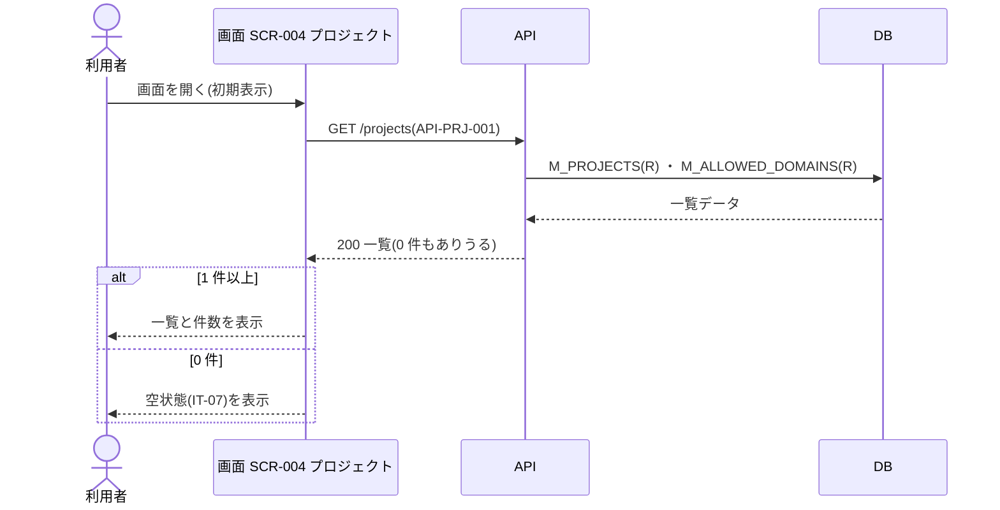

<!-- portal-top -->
[設計ポータル](../README.md) ／ [ユースケース](index.md) ／ **UC-SCR-004: プロジェクト ユースケース**
<!-- /portal-top -->

# UC-SCR-004: プロジェクト ユースケース

> **このページは、画面 SCR-004(プロジェクト)の画面イベント EV-01〜EV-05 に対応する 5 のユースケースを「1 イベント = 1 ユースケース」で定義します。**

*版数 v1.0 ・ 更新 2026-06-21 ・ ユースケース 5 ・ ステータス ドラフト*

## 0. イベント↔ユースケース対応表

画面 [SCR-004](../02_basic-design/SCR-004.md#SCR-004) の §6 画面イベント一覧(EV-01〜EV-05)を、ユースケース ID へ 1:1 で対応づけます。種別は、サーバ API・DB へアクセスする「API/DB 連携」と、画面内のみで完結する「クライアント内処理のみ」に区別します。

| イベント ID | イベント名 | ユースケース ID | 種別 |
|----|----|----|----|
| `EV-01` | 初期表示 | [UC-SCR-004-EV01](#UC-SCR-004-EV01) | API/DB 連携 |
| `EV-02` | 「+ 新規プロジェクトを作成」を押下 | [UC-SCR-004-EV02](#UC-SCR-004-EV02) | クライアント内処理のみ |
| `EV-03` | プロジェクト名リンクを押下 | [UC-SCR-004-EV03](#UC-SCR-004-EV03) | クライアント内処理のみ |
| `EV-04` | 管理範囲を切り替え | [UC-SCR-004-EV04](#UC-SCR-004-EV04) | クライアント内処理のみ |
| `EV-05` | 空状態の「+ 新規プロジェクトを作成」を押下 | [UC-SCR-004-EV05](#UC-SCR-004-EV05) | クライアント内処理のみ |

## 1. ユースケース定義

### UC-SCR-004-EV01 初期表示

> プロジェクト画面を開いたとき、契約内のプロジェクト一覧を取得して表示し、0 件のときは作成を促す空状態を表示します。

| 項目 | 内容 |
|----|----|
| 利用者 | オーナー(本画面はオーナー専有) |
| 事前条件 | ログイン済みで、オーナーである |
| トリガー | 画面 SCR-004 を開く(初期表示) |
| 事後条件 | 取得結果を一覧表示する。取得中は IT-08 ローディング状態(スケルトン 3 行)、0 件のときは IT-07 空状態を表示する |
| 関連 | [SCR-004](../02_basic-design/SCR-004.md#SCR-004) ・ [API-PRJ-001](../02_basic-design/API-project.md#API-PRJ-001) ・ [FR-019](../01_requirements/FR03.md#FR-019) |

基本フロー

1. 利用者がプロジェクト画面を開く。
2. 画面はプロジェクト一覧 API を呼び出す。取得中は IT-08 ローディング状態(スケルトン 3 行)を表示する。
3. API は認証・認可を検証し、契約内のプロジェクトと各許可ドメインを取得して返す。
4. 1 件以上のとき、画面はプロジェクトを一覧表示し、件数表示(IT-06)を更新する。
5. 0 件のとき、画面は IT-07 空状態を表示する。

異常系フロー

- 権限なし(オーナー以外の URL 直アクセス): 権限不足を表示し、本画面を表示しない。
- 取得失敗: 一覧を表示せず、エラーメッセージを表示する。

### UC-SCR-004-EV02 「+ 新規プロジェクトを作成」を押下

> ページヘッダーの「+ 新規プロジェクトを作成」を押下し、プロジェクト作成・編集モーダルを新規作成モードで開きます(クライアント内処理のみ)。

| 項目 | 内容 |
|----|----|
| 利用者 | オーナー(本画面はオーナー専有) |
| 事前条件 | プロジェクト一覧を表示している |
| トリガー | 新規作成ボタン(IT-01)を押下する |
| 事後条件 | プロジェクト作成・編集モーダル(SCR-004-001)を新規作成モードで開く |
| 関連 | [SCR-004](../02_basic-design/SCR-004.md#SCR-004) ・ [SCR-004-001](../02_basic-design/SCR-004-001.md#SCR-004-001) |

基本フロー

1. 利用者が新規作成ボタン(IT-01)を押下する。
2. 画面はプロジェクト作成・編集モーダル(SCR-004-001)を新規作成モードで開く。

異常系フロー

- なし(モーダル起動のみ。作成処理はモーダル SCR-004-001 で行う)。

クライアント内処理のみのため、シーケンス図は省略します。

### UC-SCR-004-EV03 プロジェクト名リンクを押下

> プロジェクト名リンクを押下し、当該プロジェクトをプロジェクト作成・編集モーダルで編集モードに開きます(クライアント内処理のみ)。

| 項目 | 内容 |
|----|----|
| 利用者 | オーナー(本画面はオーナー専有) |
| 事前条件 | プロジェクト一覧に対象プロジェクトが表示されている |
| トリガー | プロジェクト名(IT-02)のリンクを押下する |
| 事後条件 | プロジェクト作成・編集モーダル(SCR-004-001)を編集モードで開く |
| 関連 | [SCR-004](../02_basic-design/SCR-004.md#SCR-004) ・ [SCR-004-001](../02_basic-design/SCR-004-001.md#SCR-004-001) |

基本フロー

1. 利用者がプロジェクト名(IT-02)のリンクを押下する。
2. 画面は対象プロジェクト ID を引き継ぎ、プロジェクト作成・編集モーダル(SCR-004-001)を編集モードで開く。

異常系フロー

- なし(モーダル起動のみ。対象プロジェクトの現値ロード・権限検証は遷移先 SCR-004-001 で行う)。

クライアント内処理のみのため、シーケンス図は省略します。

### UC-SCR-004-EV04 管理範囲を切り替え

> 管理範囲スイッチャーで対象プロジェクトを選択し、当該プロジェクトの概要画面へ遷移します(クライアント内処理のみ)。

| 項目 | 内容 |
|----|----|
| 利用者 | オーナー(本画面はオーナー専有) |
| 事前条件 | プロジェクト一覧を表示している |
| トリガー | 管理範囲スイッチャー(IT-09)で対象プロジェクトを選択する |
| 事後条件 | 選択したプロジェクトの概要画面([SCR-008](../02_basic-design/SCR-008.md#SCR-008))へ遷移する |
| 関連 | [SCR-004](../02_basic-design/SCR-004.md#SCR-004) ・ [SCR-008](../02_basic-design/SCR-008.md#SCR-008) |

基本フロー

1. 利用者が管理範囲スイッチャー(IT-09)で対象プロジェクトを選択する。
2. 画面は選択したプロジェクトの概要画面(SCR-008)へ遷移する。

異常系フロー

- なし(画面遷移のみ)。

クライアント内処理のみ(画面遷移)のため、シーケンス図は省略します。

### UC-SCR-004-EV05 空状態の「+ 新規プロジェクトを作成」を押下

> 空状態(IT-07)の「+ 新規プロジェクトを作成」を押下し、プロジェクト作成・編集モーダルを新規作成モードで開きます(クライアント内処理のみ)。

| 項目 | 内容 |
|----|----|
| 利用者 | オーナー(本画面はオーナー専有) |
| 事前条件 | プロジェクトが 0 件で、空状態(IT-07)を表示している |
| トリガー | 空状態の新規作成ボタン(IT-07)を押下する |
| 事後条件 | プロジェクト作成・編集モーダル(SCR-004-001)を新規作成モードで開く |
| 関連 | [SCR-004](../02_basic-design/SCR-004.md#SCR-004) ・ [SCR-004-001](../02_basic-design/SCR-004-001.md#SCR-004-001) |

本ユースケースの処理は [UC-SCR-004-EV02](#UC-SCR-004-EV02)(「+ 新規プロジェクトを作成」を押下)と同一です。トリガーが空状態ボタン(IT-07)である点のみが異なります。基本フロー・異常系フローは UC-SCR-004-EV02 を参照してください。

---

<!-- portal-bottom -->
[ユースケース](index.md) ・ [↑ 設計ポータル](../README.md)
<!-- /portal-bottom -->
