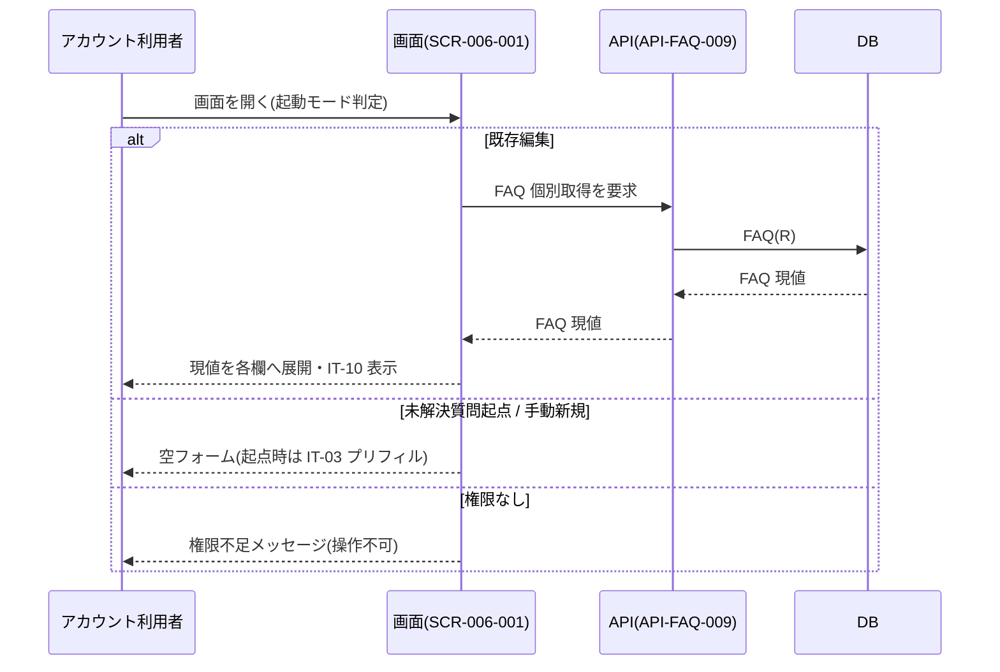
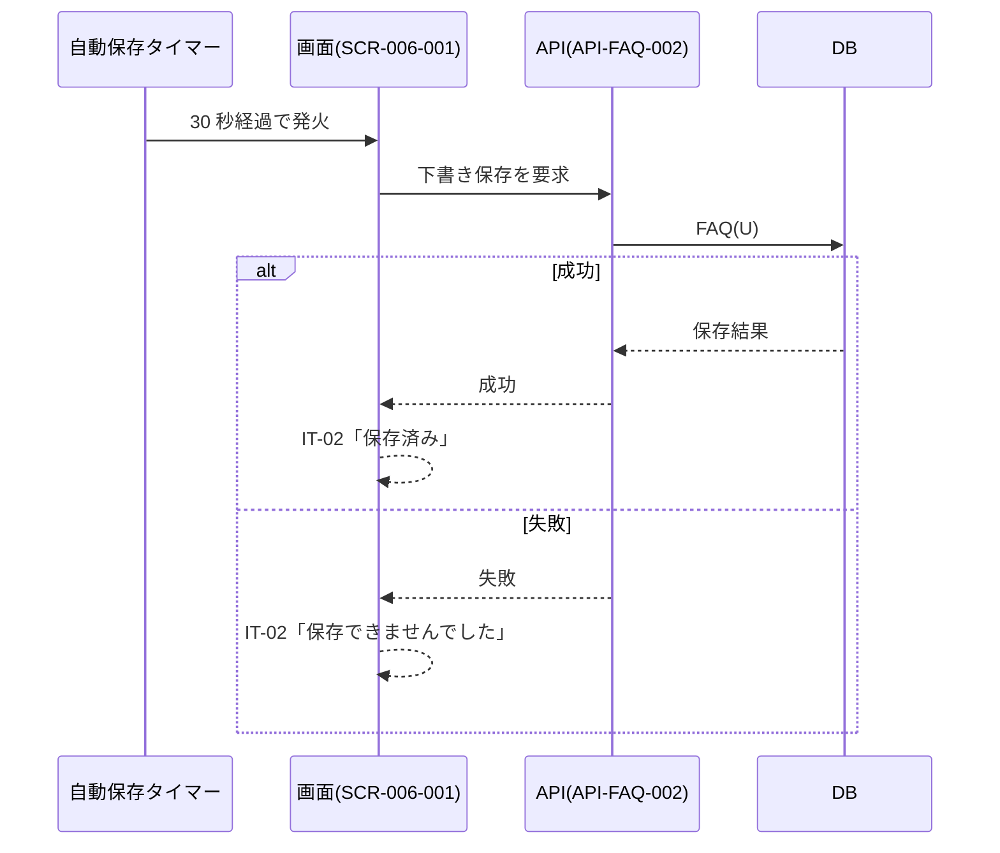
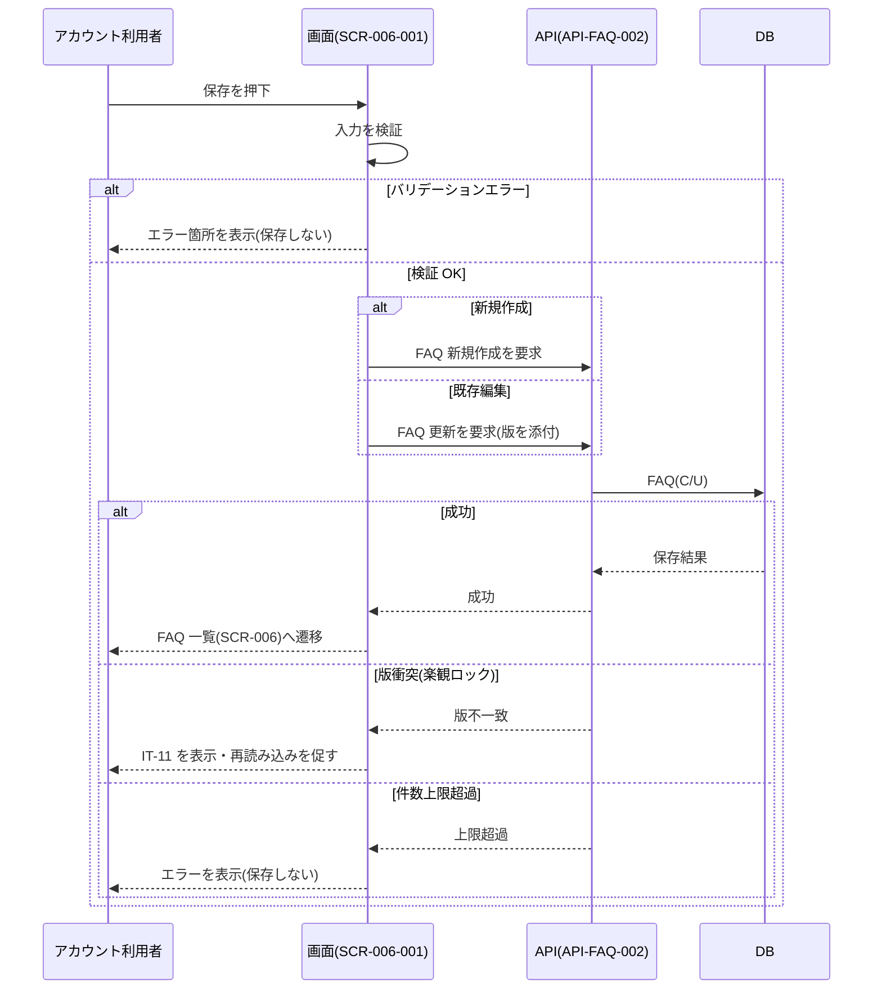
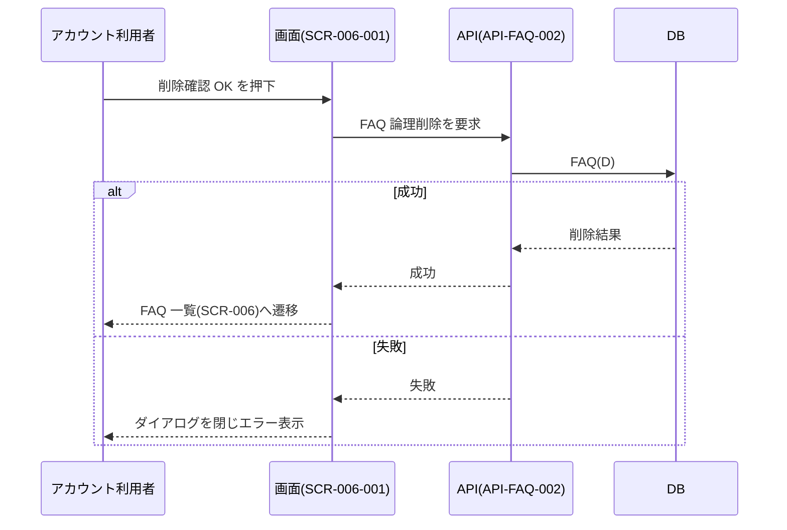

<!-- portal-top -->
[設計ポータル](../README.md) ／ [ユースケース](index.md) ／ **UC-SCR-006-001: FAQ 編集 ユースケース**
<!-- /portal-top -->

# UC-SCR-006-001: FAQ 編集 ユースケース

> **このページは、画面 SCR-006-001(FAQ 編集)の画面イベント EV-01〜EV-14 に対応する 14 のユースケースを「1 イベント = 1 ユースケース」で定義します。**

*版数 v1.0 ・ 更新 2026-06-21 ・ ユースケース 14 ・ ステータス ドラフト*

## 0. イベント↔ユースケース対応表

画面 [SCR-006-001](../02_basic-design/SCR-006-001.md#SCR-006-001) の §6 画面イベント一覧(EV-01〜EV-14)と本書のユースケースを 1:1 で対応づけます。種別は API/DB 連携を伴うか、クライアント内処理のみかを示します。

| イベント ID | イベント | ユースケース ID | ユースケース名 | 種別 |
|----|----|----|----|----|
| EV-01 | 初期表示 | [UC-SCR-006-001-EV01](#UC-SCR-006-001-EV01) | 初期表示 | API/DB 連携 |
| EV-02 | 質問を入力 | [UC-SCR-006-001-EV02](#UC-SCR-006-001-EV02) | 質問を入力 | クライアント内処理のみ |
| EV-03 | 回答を入力 | [UC-SCR-006-001-EV03](#UC-SCR-006-001-EV03) | 回答を入力 | クライアント内処理のみ |
| EV-04 | カテゴリを入力 | [UC-SCR-006-001-EV04](#UC-SCR-006-001-EV04) | カテゴリを入力 | クライアント内処理のみ |
| EV-05 | 「状態」を選択 | [UC-SCR-006-001-EV05](#UC-SCR-006-001-EV05) | 状態を選択 | クライアント内処理のみ |
| EV-06 | 自動保存タイマー発火(30 秒間隔) | [UC-SCR-006-001-EV06](#UC-SCR-006-001-EV06) | 自動保存 | API/DB 連携 |
| EV-07 | 「保存」を押下 | [UC-SCR-006-001-EV07](#UC-SCR-006-001-EV07) | 保存 | API/DB 連携 |
| EV-08 | 「削除」を押下 | [UC-SCR-006-001-EV08](#UC-SCR-006-001-EV08) | 削除ボタン押下 | クライアント内処理のみ |
| EV-09 | 削除確認ダイアログの「OK」を押下 | [UC-SCR-006-001-EV09](#UC-SCR-006-001-EV09) | 削除確認 OK | API/DB 連携 |
| EV-10 | 「キャンセル」を押下 | [UC-SCR-006-001-EV10](#UC-SCR-006-001-EV10) | キャンセル押下 | クライアント内処理のみ |
| EV-11 | 「登録元未解決質問」リンクを押下 | [UC-SCR-006-001-EV11](#UC-SCR-006-001-EV11) | 登録元未解決質問へ遷移 | クライアント内処理のみ |
| EV-12 | 削除確認ダイアログの「キャンセル」を押下 | [UC-SCR-006-001-EV12](#UC-SCR-006-001-EV12) | 削除確認キャンセル | クライアント内処理のみ |
| EV-13 | キャンセル確認ダイアログの「OK」を押下 | [UC-SCR-006-001-EV13](#UC-SCR-006-001-EV13) | キャンセル確認 OK | クライアント内処理のみ |
| EV-14 | キャンセル確認ダイアログの「キャンセル」を押下 | [UC-SCR-006-001-EV14](#UC-SCR-006-001-EV14) | キャンセル確認キャンセル | クライアント内処理のみ |

> [!NOTE]
> **システム副作用について** `published`(公開中)で保存した FAQ の全文検索インデックス `TP_FAQ_FTS` 連動更新、および FAQ 件数メータの更新は画面ユースケースのスコープ外です。本書では注記にとどめ、実体はシステムユースケース(UC-SYSTEM)で定義します。

## 1. ユースケース定義

### UC-SCR-006-001-EV01 初期表示

> アカウント利用者が FAQ 編集画面を開いたとき、起動モード(既存編集 / 未解決質問起点 / 手動新規 / 権限なし)に応じて画面を構成する。

| 項目 | 内容 |
|----|----|
| 利用者 | アカウント利用者(オーナー / メンバー。当該プロジェクトの FAQ 管理権限が前提) |
| 事前条件 | 起動モードのいずれか。<ul><li>既存編集: FAQ 一覧から FAQ ID を選択(編集対象 FAQ が存在)</li><li>未解決質問起点: 要対応の質問詳細から「FAQ 登録へ」で遷移</li><li>手動新規: FAQ 一覧から「新規作成」</li><li>権限なし: URL 直アクセスで当該プロジェクト未割当</li></ul> |
| トリガー | アカウント利用者が SCR-006-001 を開く |
| 事後条件 | 起動モードに応じたフォームが表示される(既存=現値展開、未解決質問起点=IT-03 プリフィル、手動新規=空フォーム)。権限なし時は権限不足メッセージを表示し操作不可 |
| 関連 | [SCR-006-001](../02_basic-design/SCR-006-001.md#SCR-006-001) ・ [API-FAQ-009](../02_basic-design/API-faq.md#API-FAQ-009) ・ [FR-025](../01_requirements/FR04.md#FR-025) ・ [FR-030](../01_requirements/FR04.md#FR-030) |

基本フロー(既存編集)

1. アカウント利用者が SCR-006-001 を開く。
2. 画面が [FAQ 個別取得](../02_basic-design/API-faq.md#API-FAQ-009)で編集対象 FAQ の現値を取得する。
3. 画面が質問・回答・カテゴリ・状態の各欄へ現値を展開する。
4. 登録元未解決質問が存在する場合は IT-07(登録元未解決質問リンク)を表示する。
5. 既存 FAQ のため IT-10(削除)を表示する。

基本フロー(未解決質問起点 / 手動新規)

1. アカウント利用者が未解決質問詳細または FAQ 一覧から本画面を開く。
2. 未解決質問起点では未解決質問の質問文を IT-03 へ初期反映し、その他の欄は空とする。手動新規では全欄を空フォームとする。
3. 新規作成のため IT-10(削除)は非表示とする。

異常系フロー

- 権限なし(URL 直アクセスで当該プロジェクト未割当): 権限不足メッセージを表示し、フォーム操作を不可とする(403 相当)。
- 既存編集で FAQ 個別取得が失敗: エラーメッセージを表示する。

> [!NOTE]
> **公開前メンバー確認(FR-030)** 状態の切替は専用 API を設けず、状態ラジオの選択 + 保存で一元化します。`published`(公開中)を選択して保存する操作が「公開前のメンバー確認」([FR-030](../01_requirements/FR04.md#FR-030))を兼ねます。初期表示では編集対象 FAQ の現在状態を IT-06 に反映します。

### UC-SCR-006-001-EV02 質問を入力

> アカウント利用者が質問欄に入力すると、文字数カウンタを更新し 1〜500 文字を検証する。

| 項目 | 内容 |
|----|----|
| 利用者 | アカウント利用者(オーナー / メンバー) |
| 事前条件 | SCR-006-001 が表示済み |
| トリガー | アカウント利用者が IT-03(質問)へ入力する |
| 事後条件 | 文字数カウンタが更新される。500 文字超過時はエラー表示し保存ボタンを無効化する |
| 関連 | [SCR-006-001](../02_basic-design/SCR-006-001.md#SCR-006-001) |

基本フロー

1. アカウント利用者が IT-03(質問)へ入力する。
2. 画面が文字数カウンタをリアルタイムに更新する。

異常系フロー

- 500 文字超過: エラーを表示し、保存ボタンを無効化する。
- 必須(0 文字): 保存時の検証で必須エラーとなる(保存は EV-07 で扱う)。

クライアント内処理のみのため、シーケンス図は省略します。

### UC-SCR-006-001-EV03 回答を入力

> アカウント利用者が回答欄に入力すると、文字数カウンタを更新し 1〜5,000 文字を検証する。

| 項目 | 内容 |
|----|----|
| 利用者 | アカウント利用者(オーナー / メンバー) |
| 事前条件 | SCR-006-001 が表示済み |
| トリガー | アカウント利用者が IT-04(回答)へ入力する |
| 事後条件 | 文字数カウンタが更新される。5,000 文字超過時はエラー表示し保存ボタンを無効化する |
| 関連 | [SCR-006-001](../02_basic-design/SCR-006-001.md#SCR-006-001) |

基本フロー

1. アカウント利用者が IT-04(回答)へ入力する。
2. 画面が文字数カウンタをリアルタイムに更新する。

異常系フロー

- 5,000 文字超過: エラーを表示し、保存ボタンを無効化する。
- 必須(0 文字): 保存時の検証で必須エラーとなる(保存は EV-07 で扱う)。

クライアント内処理のみのため、シーケンス図は省略します。

### UC-SCR-006-001-EV04 カテゴリを入力

> アカウント利用者がカテゴリ欄に入力すると、既存カテゴリのサジェストを表示し 100 文字以内を検証する。

| 項目 | 内容 |
|----|----|
| 利用者 | アカウント利用者(オーナー / メンバー) |
| 事前条件 | SCR-006-001 が表示済み |
| トリガー | アカウント利用者が IT-05(カテゴリ)へ入力する |
| 事後条件 | 既存カテゴリのサジェストが表示される。100 文字超過時はエラー表示し保存ボタンを無効化する |
| 関連 | [SCR-006-001](../02_basic-design/SCR-006-001.md#SCR-006-001) |

基本フロー

1. アカウント利用者が IT-05(カテゴリ)へ入力する。
2. 画面が既存カテゴリのサジェストを表示する。

異常系フロー

- 100 文字超過: エラーを表示し、保存ボタンを無効化する。

クライアント内処理のみのため、シーケンス図は省略します。

### UC-SCR-006-001-EV05 状態を選択

> アカウント利用者が状態ラジオを選択すると、選択値を保持し次回の保存に反映する。

| 項目 | 内容 |
|----|----|
| 利用者 | アカウント利用者(オーナー / メンバー) |
| 事前条件 | SCR-006-001 が表示済み |
| トリガー | アカウント利用者が IT-06(状態)を選択する |
| 事後条件 | 選択値(下書き / 公開中 / 非公開)が保持され、次回「保存」押下時に反映される |
| 関連 | [SCR-006-001](../02_basic-design/SCR-006-001.md#SCR-006-001) ・ [FR-030](../01_requirements/FR04.md#FR-030) |

基本フロー

1. アカウント利用者が IT-06(状態)で下書き / 公開中 / 非公開のいずれかを選択する。
2. 画面が選択値を保持する(この時点では保存しない)。

異常系フロー

- 該当なし(選択は相互に自由遷移・状態遷移ガードなし)。

クライアント内処理のみのため、シーケンス図は省略します。

### UC-SCR-006-001-EV06 自動保存

> 30 秒間隔の自動保存タイマーが発火すると、現在の入力内容を下書き保存し、保存インジケータを更新する。

| 項目 | 内容 |
|----|----|
| 利用者 | アカウント利用者(オーナー / メンバー) |
| 事前条件 | SCR-006-001 が表示済みで、編集対象 FAQ が存在する(下書き保存可能な状態) |
| トリガー | 自動保存タイマーが 30 秒間隔で発火する |
| 事後条件 | 成功時は下書きが保存され IT-02(自動保存インジケータ)が「保存済み」に更新される。失敗時は IT-02 が「保存できませんでした」に更新される |
| 関連 | [SCR-006-001](../02_basic-design/SCR-006-001.md#SCR-006-001) ・ [API-FAQ-002](../02_basic-design/API-faq.md#API-FAQ-002) |

基本フロー

1. 自動保存タイマーが 30 秒間隔で発火する。
2. 画面が [FAQ 作成・更新・削除](../02_basic-design/API-faq.md#API-FAQ-002)で現在の入力内容を下書き保存する。
3. 画面が IT-02 を「保存済み」に更新する。

異常系フロー

- 保存失敗: IT-02 を「保存できませんでした」に更新する(編集は継続可能)。

### UC-SCR-006-001-EV07 保存

> アカウント利用者が保存を押下すると、入力を検証し新規作成または更新を行い、成功時に FAQ 一覧へ遷移する。

| 項目 | 内容 |
|----|----|
| 利用者 | アカウント利用者(オーナー / メンバー) |
| 事前条件 | SCR-006-001 が表示済み。バリデーションエラーが無いこと(質問・回答が必須範囲内) |
| トリガー | アカウント利用者が IT-09(保存)を押下する |
| 事後条件 | 成功時は FAQ が選択中の状態で新規作成または更新され、FAQ 一覧([SCR-006](../02_basic-design/SCR-006.md#SCR-006))へ遷移する。版衝突・件数上限超過時は遷移せずエラー表示する |
| 関連 | [SCR-006-001](../02_basic-design/SCR-006-001.md#SCR-006-001) ・ [API-FAQ-002](../02_basic-design/API-faq.md#API-FAQ-002) ・ [FR-025](../01_requirements/FR04.md#FR-025) ・ [FR-030](../01_requirements/FR04.md#FR-030) |

基本フロー

1. アカウント利用者が IT-09(保存)を押下する。
2. 画面が入力内容(質問・回答・カテゴリ・状態)を検証する。
3. 新規作成の場合は [FAQ 作成・更新・削除](../02_basic-design/API-faq.md#API-FAQ-002)で FAQ を新規作成する。既存編集の場合は同 API で版(楽観ロック)を添えて更新する。
4. 成功時、FAQ 一覧([SCR-006](../02_basic-design/SCR-006.md#SCR-006))へ遷移する。

異常系フロー

- バリデーションエラー: エラー箇所を表示し保存しない(画面に留まる)。
- 版衝突(楽観ロック): 送信した版が他者の更新と一致しない場合、IT-11(楽観ロック衝突)を表示し、再読み込みを促す(上書き保存しない)。
- 件数上限超過: FAQ 件数が上限に達している場合、エラーを表示し保存しない。

> [!NOTE]
> **公開前メンバー確認(FR-030)** `published`(公開中)を選択して保存する操作が「公開前のメンバー確認」([FR-030](../01_requirements/FR04.md#FR-030))を兼ねます。`published` での保存成功時、全文検索インデックス `TP_FAQ_FTS` の連動更新・FAQ 件数メータの更新はシステムユースケース(UC-SYSTEM)のスコープであり、本書では扱いません。

### UC-SCR-006-001-EV08 削除ボタン押下

> アカウント利用者が削除を押下すると、削除確認ダイアログを表示する。

| 項目 | 内容 |
|----|----|
| 利用者 | アカウント利用者(オーナー / メンバー) |
| 事前条件 | 既存 FAQ 編集中(IT-10 削除ボタンが表示されている) |
| トリガー | アカウント利用者が IT-10(削除)を押下する |
| 事後条件 | 削除確認ダイアログが表示される(実際の削除は EV-09 で実行) |
| 関連 | [SCR-006-001](../02_basic-design/SCR-006-001.md#SCR-006-001) |

基本フロー

1. アカウント利用者が IT-10(削除)を押下する。
2. 画面が削除確認ダイアログ(IT-12 / IT-13)を表示する。

異常系フロー

- 新規作成時は IT-10 が非表示のため、本イベントは発生しない。

クライアント内処理のみのため、シーケンス図は省略します。

### UC-SCR-006-001-EV09 削除確認 OK

> アカウント利用者が削除確認ダイアログで OK を押下すると、FAQ を論理削除し FAQ 一覧へ遷移する。

| 項目 | 内容 |
|----|----|
| 利用者 | アカウント利用者(オーナー / メンバー) |
| 事前条件 | 削除確認ダイアログが表示中(EV-08 実行済み)。編集対象 FAQ が存在する |
| トリガー | アカウント利用者が IT-12(削除確認 OK)を押下する |
| 事後条件 | 成功時は FAQ が論理削除され、FAQ 一覧([SCR-006](../02_basic-design/SCR-006.md#SCR-006))へ遷移する。失敗時はダイアログを閉じエラー表示する |
| 関連 | [SCR-006-001](../02_basic-design/SCR-006-001.md#SCR-006-001) ・ [API-FAQ-002](../02_basic-design/API-faq.md#API-FAQ-002) |

基本フロー

1. アカウント利用者が IT-12(削除確認 OK)を押下する。
2. 画面が [FAQ 作成・更新・削除](../02_basic-design/API-faq.md#API-FAQ-002)で当該 FAQ を論理削除する。
3. 成功時、FAQ 一覧([SCR-006](../02_basic-design/SCR-006.md#SCR-006))へ遷移する。

異常系フロー

- 削除失敗: エラーメッセージを表示し、削除確認ダイアログを閉じる(一覧へ遷移しない)。

### UC-SCR-006-001-EV10 キャンセル押下

> アカウント利用者がキャンセルを押下すると、未保存変更の有無に応じて破棄遷移または確認ダイアログ表示を行う。

| 項目 | 内容 |
|----|----|
| 利用者 | アカウント利用者(オーナー / メンバー) |
| 事前条件 | SCR-006-001 が表示済み |
| トリガー | アカウント利用者が IT-08(キャンセル)を押下する |
| 事後条件 | 未保存変更なしの場合は FAQ 一覧へ遷移する。未保存変更ありの場合はキャンセル確認ダイアログを表示する(破棄実行は EV-13) |
| 関連 | [SCR-006-001](../02_basic-design/SCR-006-001.md#SCR-006-001) ・ [SCR-006](../02_basic-design/SCR-006.md#SCR-006) |

基本フロー

1. アカウント利用者が IT-08(キャンセル)を押下する。
2. 画面が未保存変更の有無を判定する。
3. 未保存変更なし: 編集を破棄して FAQ 一覧([SCR-006](../02_basic-design/SCR-006.md#SCR-006))へ遷移する。
4. 未保存変更あり: キャンセル確認ダイアログ(IT-14 / IT-15)を表示する。

異常系フロー

- 該当なし。

クライアント内処理のみのため、シーケンス図は省略します。

### UC-SCR-006-001-EV11 登録元未解決質問へ遷移

> アカウント利用者が登録元未解決質問リンクを押下すると、要対応の質問詳細画面へ遷移する。

| 項目 | 内容 |
|----|----|
| 利用者 | アカウント利用者(オーナー / メンバー) |
| 事前条件 | 当該 FAQ に登録元未解決質問が存在し、IT-07 が表示されている |
| トリガー | アカウント利用者が IT-07(登録元未解決質問リンク)を押下する |
| 事後条件 | 要対応の質問詳細画面([SCR-005-001](../02_basic-design/SCR-005-001.md#SCR-005-001))へ遷移する |
| 関連 | [SCR-006-001](../02_basic-design/SCR-006-001.md#SCR-006-001) ・ [SCR-005-001](../02_basic-design/SCR-005-001.md#SCR-005-001) |

基本フロー

1. アカウント利用者が IT-07(登録元未解決質問リンク)を押下する。
2. 画面が要対応の質問詳細画面([SCR-005-001](../02_basic-design/SCR-005-001.md#SCR-005-001))へ遷移する。

異常系フロー

- 登録元未解決質問が存在しない場合は IT-07 が非表示のため、本イベントは発生しない。

クライアント内処理のみ(画面遷移)のため、シーケンス図は省略します。

### UC-SCR-006-001-EV12 削除確認キャンセル

> アカウント利用者が削除確認ダイアログでキャンセルを押下すると、削除を中断して編集画面に戻る。

| 項目 | 内容 |
|----|----|
| 利用者 | アカウント利用者(オーナー / メンバー) |
| 事前条件 | 削除確認ダイアログが表示中(EV-08 実行済み) |
| トリガー | アカウント利用者が IT-13(削除確認キャンセル)を押下する |
| 事後条件 | 削除確認ダイアログが閉じ、削除を中断して編集画面に戻る(状態不変) |
| 関連 | [SCR-006-001](../02_basic-design/SCR-006-001.md#SCR-006-001) |

基本フロー

1. アカウント利用者が IT-13(削除確認キャンセル)を押下する。
2. 画面が削除確認ダイアログを閉じ、編集画面に戻る。

異常系フロー

- 該当なし。

クライアント内処理のみのため、シーケンス図は省略します。

### UC-SCR-006-001-EV13 キャンセル確認 OK

> アカウント利用者がキャンセル確認ダイアログで OK を押下すると、編集内容を破棄して FAQ 一覧へ遷移する。

| 項目 | 内容 |
|----|----|
| 利用者 | アカウント利用者(オーナー / メンバー) |
| 事前条件 | キャンセル確認ダイアログが表示中(EV-10 で未保存変更ありと判定済み) |
| トリガー | アカウント利用者が IT-14(キャンセル確認 OK)を押下する |
| 事後条件 | 編集内容が破棄され、FAQ 一覧([SCR-006](../02_basic-design/SCR-006.md#SCR-006))へ遷移する |
| 関連 | [SCR-006-001](../02_basic-design/SCR-006-001.md#SCR-006-001) ・ [SCR-006](../02_basic-design/SCR-006.md#SCR-006) |

基本フロー

1. アカウント利用者が IT-14(キャンセル確認 OK)を押下する。
2. 画面が編集内容を破棄し、FAQ 一覧([SCR-006](../02_basic-design/SCR-006.md#SCR-006))へ遷移する。

異常系フロー

- 該当なし。

クライアント内処理のみ(画面遷移)のため、シーケンス図は省略します。

### UC-SCR-006-001-EV14 キャンセル確認キャンセル

> アカウント利用者がキャンセル確認ダイアログでキャンセルを押下すると、ダイアログを閉じて編集を継続する。

| 項目 | 内容 |
|----|----|
| 利用者 | アカウント利用者(オーナー / メンバー) |
| 事前条件 | キャンセル確認ダイアログが表示中(EV-10 で未保存変更ありと判定済み) |
| トリガー | アカウント利用者が IT-15(キャンセル確認キャンセル)を押下する |
| 事後条件 | キャンセル確認ダイアログが閉じ、編集を継続する(入力内容は保持) |
| 関連 | [SCR-006-001](../02_basic-design/SCR-006-001.md#SCR-006-001) |

基本フロー

1. アカウント利用者が IT-15(キャンセル確認キャンセル)を押下する。
2. 画面がキャンセル確認ダイアログを閉じ、編集を継続する。

異常系フロー

- 該当なし。

クライアント内処理のみのため、シーケンス図は省略します。

---

<!-- portal-bottom -->
[ユースケース](index.md) ・ [↑ 設計ポータル](../README.md)
<!-- /portal-bottom -->
